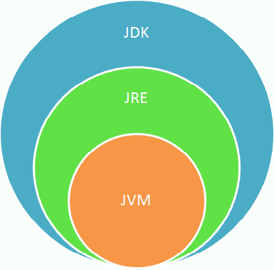
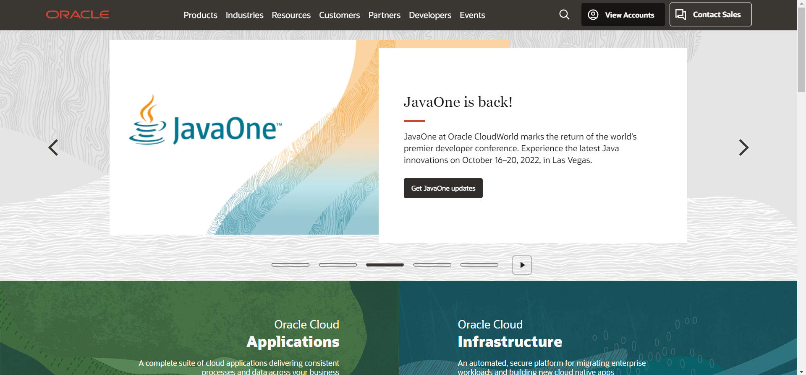
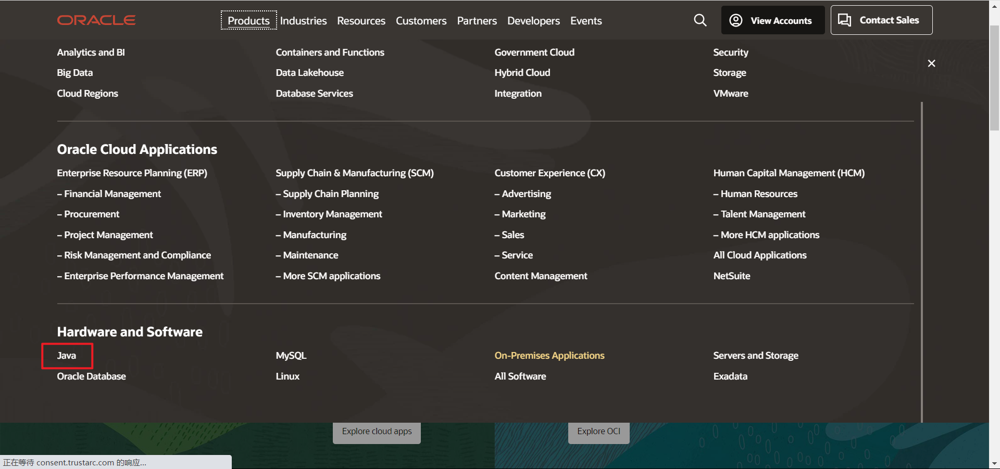
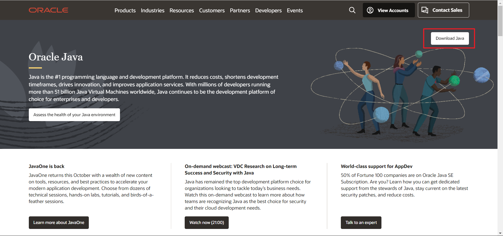
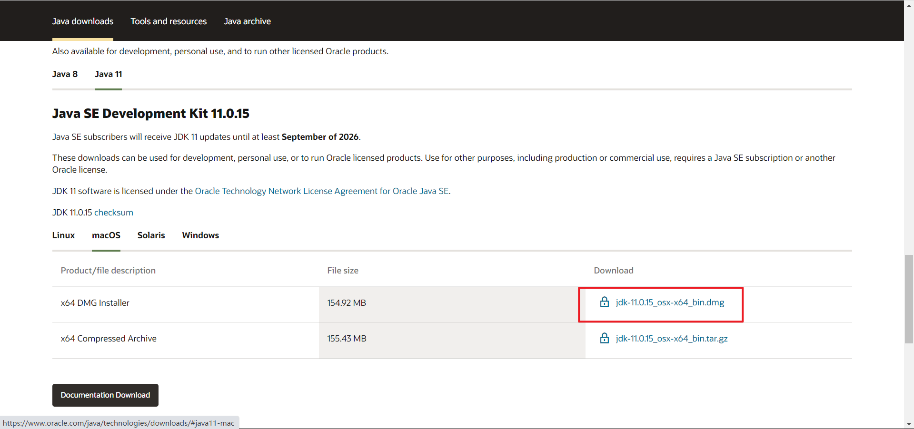
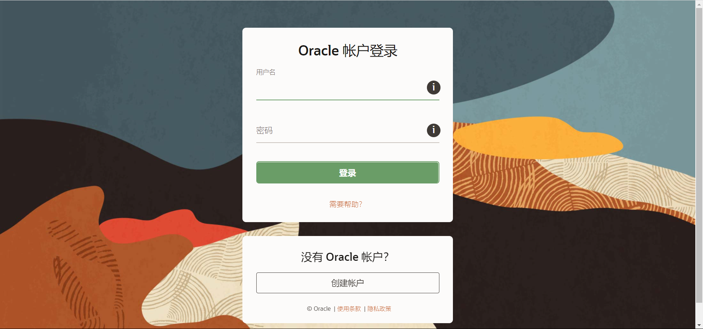
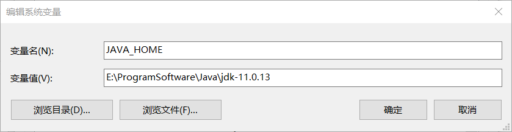
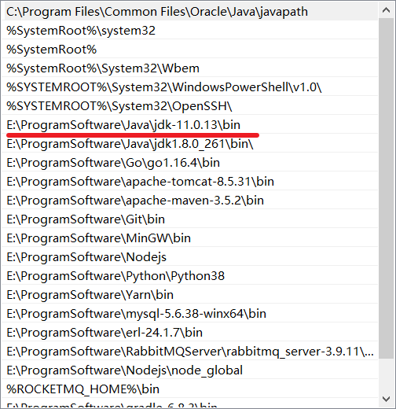
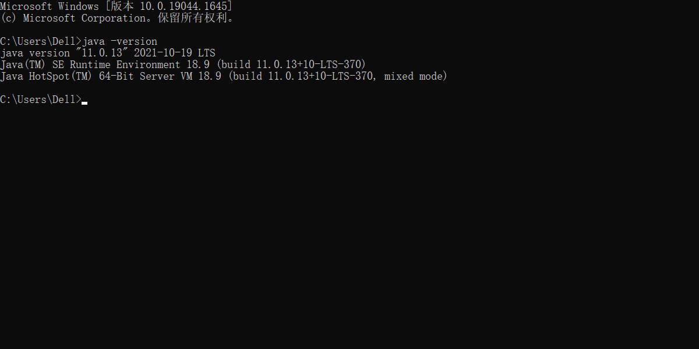

# 0. Java环境预热

## 0.1 关于Java程序设计平台

Java的历史要追溯到1991年,由**Patrick Naughton**和**James Gosling**(一个全能的计算机奇才)带领的Sun公司的工程师小组想要设计一种小型的计算机语言,主要用于有线电视转换盒这类的消费设备.由于这些消费的设备的处理能力和内存都很有限,所以语言必须非常小且能够生成非常紧凑的代码.另外,由于不同的厂商会选择不同的中央处理器(CPU),因此这种语言的关键是不与任何特定的体系结构捆绑在一起.这个项目称为"Green"

不过,Sun公司的人都有UNIX的应用背景.因此,所开发的语言以C++为基础,而不是Lisp,SmallTalk或者Pascal.不过,就像Gosling把这种语言称为"Oak"(这么起名字的原因大概是因为他非常喜欢自己办公室的橡树).Sun公司的人后来发现Oak是一种已有的计算机语言的名字,于是,将其改名字为Java.事实证明这是一个很有灵感的选择.

## 0.2 Java语言的特性

- **简单性**

人们希望构建一个无须深奥的专业训练就可以进行编程的系统,并且要符合当今的标准惯例.因此,尽管人们发现C++不太适用,但在设计Java的时候还是尽可能的接近C++,以便系统更易于理解.Java剔除了C++中许多很少适用,难以理解,易混淆的特性.在目前看来,这些特性带来的麻烦远远多于其带来的好处.

- **面向对象**

捡来来讲,面向对象设计是一种程序设计技术.它将重点放在数据(即对象)和对象的接口上.用木匠打一个比方,一个"面向对象的"木匠始终关注的是所制作的椅子,第二位才是所使用的工具,一个"非面向对象的"木匠首先考虑的是所用的工具.在本质上.Java的面向对象能力与C++是一样的.

- **分布式**

Java有一个丰富的例程库,用于处理像HTTP和FTP之类的TCP/IP协议.Java应用程序能够通过URL打开的方位网络上的对象,其便捷的程度就好像访问本地文件一样.

- **安全性**

Java适用于网络/分布式环境.为了达到这个目标,在安全方面投入了很大精力.使用Java可以构建防病毒,防篡改的系统.

- **体系结构中立**

编译器生成一个体系结构中立的目标文件格式,这是一个编译过的代码,只要有Java运行的系统,这些编译后的代码就可以在很多处理器上运行.Java编译器通过生成与特定的计算机体系结构无关的字节码指令来实现这一特性.精心设计的字节码不仅可以很容易地在任何机器上解释执行,而且还可以动态地翻译成本地机器代码.

- **可移植性**

与C/C++不同,Java规范中没有"依赖具体实现"的地方.基本数据类型的大小以及有关运算都做了明确的说明.

- **解释型**

Java解释器可以在任何移植了解释器的机器上执行Java字节码.由于链接是一个增量式且轻量级的过程,所以,开发过程也变得更加快捷,更加具有探索性.

- **高性能**

尽管对解释后的字节码性能已经比较满意,但是在有些场合下还是需要更加高效的性能,字节码可以(在运行时)动态地翻译成对应运行这个应用的特定CPU的机器码.

- **多线程**

多线程可以带来更好的交互响应和实时行为.

- **动态性**

从各种角度看,Java与C/C++相比更加具有动态性.它能够适应不断发展的环境.库中可以自由添加新方法的实例变量,而对客户端却没有任何影响.在Java中找出运行时类型信息十分简单.

## 0.3 安装JDK

### 0.3.1 有关术语

JDK(Java Development Kit): **编写**Java程序的软件

JRE(Java Runtime Environment): **运行**Java程序的软件

SE(Standard Edition): 用于桌面或简单服务器应用的Java平台

EE(Enterprise Edition): 用于企业级复杂服务器应用的Java平台

ME(Micro Edition): 用于手机和其他小型设备的Java平台

**`JDK = JRE + 开发工具集（例如Javac编译工具等）`**

**`JRE = JVM + Java SE标准类库`**

### 0.3.2 下载JDK

进入Oracle官网

点击Products找到Java

点击Download

找到JDK11,这里推荐JDK11或8,不要使用最新版的,尝鲜可以,学习使用不推荐

下载之前需要登录Oracle账号,没有注册一个

下载好安装包之后一直下一步就完事儿了

### 0.3.3 配置环境变量

找到你的Java安装目录,然后找到配置环境变量配置JAVA_HOME(为什么要配置JAVA_HOME?因为在之后学习中会用到很多Java写的中间件,它们都需要JAVA_HOME)

再点击Path配置环境变量,我这边用了比较粗暴的方式,最好使用%JAVA_HOME%引用前缀,在Windows里面是这种语法

### 0.3.4 查看版本

要想知道是否安装成功,只需要在命令行输入`java -version`即可,显示内容则安装成功!

jdk目录结构

- bin目录：Java工具的可执行文件，包括: java、Java编译器javac、反编译.class文件javap、密钥管理工具keytool、Java文档工具javadoc等。
- db目录：Java实现的数据库。
- include目录：.h头文件，C语言开发时用到的头文件。比如jni.h是开发jni程序时必须引用的头文件。
- jre目录：Java运行环境。
- lib目录： Java类库，我们经常看到的dt.jar和tools.jar就在这个目录下。
- src.zip文件：Java类库源码，包括了rt.jar库中的关键部分；除了Java类库，还包含了启动器（launcher）的源码（C语言实现）。
- COPYRIGHT文件：版权信息。
