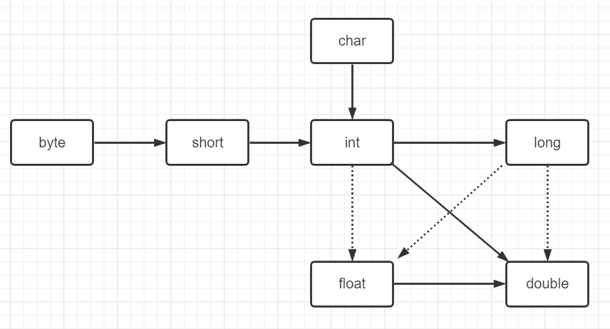

# 一. Java程序的基本结构

## 1.1 一个简单Java程序

在记事本输入以下代码,然后在命令行使用javac 命令编译源代码文件,最后使用java命令运行c编译后的lass文件,会看到控制台输出Hello World!

```java
public class HelloWorld {
	public static void main(String[] args) {
        System.out.println("Hello World!");
    }
}
```


## 1.2 数据类型

Java 是一种**强类型**语言.这就意味着必须为每一个变量声明一种类型.在 Java 中,一共有 **8 种** 基本数据类型(primitive type),其中有 **4** 中整型, **2** 种浮点类型, **1** 种用于表示 **Unicode** 编码的字符单元的字符类型 $\textcolor{blue}{char}$ 和 **1** 种用于表示真值的 $\textcolor{blue}{boolean}$ 类型.

| 类型    | 存储需求 | 取值范围                                         |
| ------- | -------- | ------------------------------------------------ |
| int     | 4 bytes  | -2^31^ ~ 2^31^ - 1                               |
| short   | 2 bytes  | -2^15^ ~ 2^15^ - 1                               |
| long    | 8 bytes  | -2^63^ ~ 2^63^ - 1                               |
| byte    | 1 byte   | -2^7^ ~ 2^7^ - 1 <=> (-128 ~ 127)                |
| float   | 4 bytes  | ±3.402 823 47E + 38F(有效位数为6~7位)            |
| double  | 8 bytes  | ±1.797 693 134 862 315 70E + 308(有效位数为15位) |
| boolean | 1 byte   | true/false                                       |
| char    | 1 byte   | Unicode编码表                                    |

### 1.2.1 整型

在通常情况下,  $\textcolor{#0033b3}{int}$ 类型最常用.但是如果表示星球上的居住人数,就需要使用 $\textcolor{#0033b3}{long}$ 类型了. $\textcolor{#0033b3}{byte}$ 和 $\textcolor{#0033b3}{short}$ 类型主要用于特定的场合. e.g. 底层的文件处理或者需要控制占用空间量的大数组.

在Java中,整形的范围与运行Java代码的机器无关.这就解决了了软件从一个平台移植到另一个平台,或者在同一个平台中的不同操作系统之间进行移植给程序员带来的诸多问题.与此相反,C/C++程序需要针对不同的操作系统之间选择最为高效的整型,这样就有可能造成一个在32位处理器上运行很好的C程序在16位系统上运行却发生整数溢出.由于Java程序必须保证在所有机器上都能够得到相同的运行结果,所以各种数据类型的取值范围必须固定.

**长整型数值**有一个后缀 **L** 或 **l** (如 4 000 000 000L).

**十六进制数值**有一个前缀 **0x** 或者 **0X** (如 0xCAFE).

**八进制数值**有一个前缀 **0** (如 010 对应八进制中的 8).

很显然八进制数值表示发比较容易混淆,所以建议**最好不要使用八进制数**!

**:star:** 从**JDK7**开始,加上前缀 **0b** 或 **0B** 就可以写二进制数.e.g., **0b1001** 就是 9.另外从**JDK7** 开始,还可以为数字字面量加下划线,如用 **1_000_000** (或 **0b1111_0100_0010_0100_0000**)表示一百万.这些下划线只是为了让人更易读.Java编译器会去除这些下划线.

💡 在C/C++中, $\textcolor{#0033b3}{int}$ 和 $\textcolor{#0033b3}{long}$ 等类型的大小与目标平台相关.在8086这样的16位处理器上整型数值占 2 字节.不过,在 32 为处理器(比如 **Pentium** 或 **SPARC** )上,整型数值则为 4 字节.类似地,在 32 位处理器上 $\textcolor{#0033b3}{long}$ 值为 4 字节,在 64 位处理器上则为 8 字节.由于存在这些差异,这对编写跨平台程序带来了很大难度.在 Java 中,所有的数值类型所占字节数量与平台无关.

⚠️ 注意, Java 没有任何**无符号(unsigned)**形式的 $\textcolor{#0033b3}{int}$, $\textcolor{#0033b3}{long}$, 或 $\textcolor{#0033b3}{byte}$ 类型.

### 1.2.2 浮点型

$\textcolor{#0033b3}{double}$ 表示这种类型数值精度是 $\textcolor{#0033b3}{float}$ 类型的两倍(有人称之为双精度数值).绝大部分应用程序都采用 $\textcolor{#0033b3}{double}$ 类型.在很多情况下, $\textcolor{#0033b3}{float}$ 类型的精度很难满足需求.实际上,只有很少的情况适合使用 $\textcolor{#0033b3}{float}$ 类型.e.g.,需要单精度数据的库,或者需要存储大量数据.

$\textcolor{#0033b3}{float}$ 类型的数值有一个后缀 **F** 或 **f** (e.g., 3.14F).没有后缀 **F** 的浮点数值(如 3.14)默认为 $\textcolor{#0033b3}{double}$ 类型.当然,也可以在浮点数值后面加后缀 **D** 或 **d** (e.g., 3.14D).

💡 可以使用十六进制表示浮点数值.e.g., **0.125=2^-3^** 可以表示成 **0x1.0p-3** .在十六进制表示法中,使用 **p** 表示指数,而不是 **e** .尾数采用十六进制,指数采用十进制.指数的基数是 **2** ,而不是 **10** !

所有的浮点数值计算都遵循 **IEEE 754** 规范.具体来说,下面是用于表示溢出和出错情况的三个特殊的浮点数值:

- 正无穷大
- 负无穷大
- NaN ( **Not a Number** 不是一个数字)

### 1.2.3 字符型

$\textcolor{#0033b3}{char}$ 类型原本用于表示单个字符.不过,现在情况已经有所变化.如今,有些 **Unicode** 字符可以使用一个 $\textcolor{#0033b3}{char}$ 值描述,另外一些 **Unicode** 字符则需要两个  $\textcolor{#0033b3}{char}$ 值.

$\textcolor{#0033b3}{char}$ 类型的字面量值要用单引号括起来.e.g.: **'A'** 是编码值为 **65** 所对应的字符常量.它与 **"A"** 不同, **"A"** 是包含一个字符 **A** 的字符串. $\textcolor{#0033b3}{char}$ 类型的值可以表示为十六进制值,其范围从 **\u0000** 到 **\Uffff** .e.g.: **\u2122** 表示注册号(^TM^), **\u03C0** 表示希腊字母 **π**.

除了转义序列 **\u** 之外,还有一些用于表示特殊字符的转义序列,如下表:

<center><h3>特殊字符的转义序列</h3></center>

| 转义序列 | 名称   | Unicode值 |
| -------- | ------ | --------- |
| \b       | 退格   | \u0008    |
| \t       | 制表   | \u0009    |
| \n       | 换行   | \u000a    |
| \r       | 回车   | \u000d    |
| \\"      | 双引号 | \u0022    |
| \\'      | 单引号 | \u0027    |
| \\\      | 反斜杠 | \u005c    |

我们强烈建议**不要在程序中使用** $\textcolor{#0033b3}{char}$ 类型,除非确实需要处理 **UTF-16** 代码单元.最好将字符串作为抽象数据类型处理!

### 1.2.4 布尔型

$\textcolor{#0033b3}{boolean}$ (布尔) 类型有两个值: *false* / *true* ,用来判断逻辑条件.整型值和布尔值之间不能进行相互转换!

💡 在 C++ 中,数值甚至指针可以代替 $\textcolor{#0033b3}{boolean}$ 值.值 **0** 相当于布尔值 *false* ,非 **0** 值相当于布尔值 *true* .在 Java 中则不是如此,因此 Java不会碰到以下麻烦:

`if (x = 0)  // ooops... `

在 C++ 中这个测试可以编译运行,其结果总是 *false* .而在 Java中,这个测试将不能通过编译,其原因是整数表达式 `x = 0` 不能转为布尔值!


## 1.3 变量

在 Java 中,每个变量都有一个 *类型* (type).在声明变量时,变量的类型位于变量名之前.如:

```java
double salary;
int vacationDays;
long earthPopulation;
boolean done;
```

### 1.3.1 命名规范

变量名称也叫作 **标识符** .合法的变量名都是以 **字母** , **$符号** , **下划线 _** 开头,其他的命名方式都是错的!

不能以 **数字** 开头,不可以使用关键字作为变量名称!

Java 推荐使用驼峰命名法!

类命名使用大驼峰,开头大写,其余单词开头大写剩下小写,如:

```java
public class HelloWorld {}
```

变量名称或者方法名称使用小驼峰命名法,开头小写,其余单词开头大写剩下小写,如:

```java
int numberCount;
public void sayHello() {}
```


### 1.3.2 变量初始化

声明一个变量之后,必须用复制语句对变量进行显示初始化,千万 **不要使用未初始化的变量** ! e.g.:

```java
int vacationDays;
System.out.println(vacationDays);  // ERROR --variable not initialized
```

要对一个变量赋值,就需要把变量名称放在 `=` 号左侧,相应取值的 Java 表达式放在等号的右侧.

```java
int vacationDays = 12;
```

**:star:** 在 Java 中,推荐 **变量的声明尽可能地靠近变量第一次使用的地方** ,这是一种良好的编程习惯!


### 1.3.3 常量

在 Java 中,使用关键字 $\textcolor{#0033b3}{final}$ 表示常量. e.g.:

```java
final double PI = 3.14;
```

关键字 $\textcolor{#0033b3}{final}$ 表示这个变量只能被赋值一次.一旦被赋值之后, **就不能够再次更改** !

习惯上,常量名称使用 **全大写** !

在 Java 中,经常希望某个常量可以在一个类中的多个方法中使用,通常将这些常量称为类常量.可以使用 $\textcolor{#0033b3}{static}$ $\textcolor{#0033b3}{final}$ 设置一个类常量.

```java
public class Constant {
	public static final double NATURAL_LOGARITHM = 2.718;
}
```


## 1.4 运算符

在 Java 中,使用算数运算符 `+` , `-` , `*` , `/` 表示加,减,乘,除运算.当参与 `/` 运算的两个操作数都是整数时,表示整数除法,否则,表示浮点除法.整数的求余操作(有时候称为取模 *MOD*),用 `%` 表示.

e.g. 

- 15 / 2 = 7
- 15 % 2 = 1
- 15.0 / 2 = 7.5

⚠️ 需要注意的是,整数被 **0** 除将会产生一个异常,而 **浮点数** 被 **0** 除将会得到无穷大或 **NaN** 的结果!


### 1.4.1 数学函数与常量

在 **Math** 类中,包含了各种各样的数字函数.在编写不同类别的程序时,可能需要的函数也不同.

要计算一个数值的平方根,可以使用 `sqrt()` 方法.

```java
double x = 4;
double y = Math.sqrt(x);  // 2.0
```

在 Java 中没有幂运算,因此要借助于 **Math** 类的 `pow()` 方法.

```java
double y = Math.pow(x, a);  // 返回 x^a 的结果
```

常用的三角函数:

- `double sin(double a)`
- `double cos(double a)`
- `double tan(double a)`
- `double asin(double a)`
- `double atan(double a)`

常用的对数/指数函数:

- `double exp(double a)`
- `double log(double a)`
- `double log10(double a)`

常用的数学常量:

- `Math.PI`
- `Math.E`

💡 不必在数学方法名和常量名前添加前缀 *Math* ,只要在源文件的顶部加上 `import static java.lang.Math.*` ,这也就是 **静态导入** 


### 1.4.2 数值类型之间的转换

经常需要将一种数值类型转换为另一种数值类型.如图表示基本数据类型之间的转换

虚线表示 **可能有精度损失的转换**

实线表示 **可正常进行的转换**




### 1.4.3 强制类型转换

