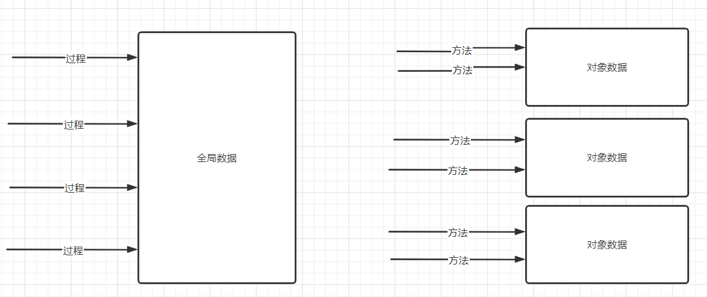
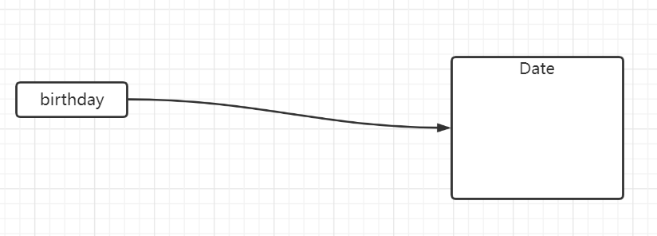
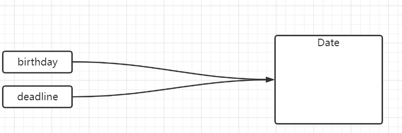
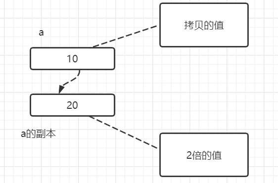
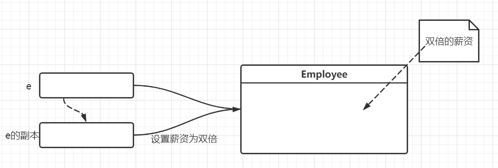
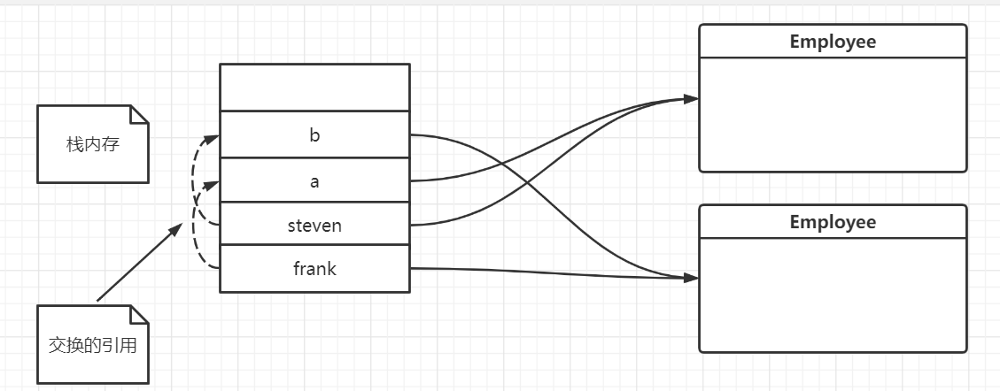

# 三. 面向对象编程

## 3.1 面向对象程序设计概述

面向对象程序设计(简称 **OOP** )是当今主流的程序设计范式.它已经取代了 20 世纪 70 年代的"结构化"过程化程序设计开发技术. Java 是完全面向对象的,必须熟悉 OOP 才能够编写 Java 程序.

面向对象的程序是由对象组成的,每个对象包含对象包含对用户公开的特定功能部分和隐藏的实现部分.程序中的很多对象来自标准库,还有一些是自定义的.




### 3.1.1 类

**类 (class)** 是构造独享的模板或蓝图.我们可以将类想象成制作小甜饼的切割机,将对象想象成小甜饼.由类**构造 (construct)**对象的过程称为创建类的**实例 (instance)**.

**封装 (encapsulation,有时候称为数据隐藏)**是与对象有关的一个重要概念.从形式上看,封装不过是将数据和行为组合在一个包中,并对对象的使用者隐藏了数据的实现方式.对象中的数据称为**实例域 (instance field)**,操作数据的过程称为**方法 (method)**.对于每个特定的类实例都有一组特定的实例域值.这些值的集合就是这个对象的当前**状态 (state)**.无论何时,只要向对象发送一个消息,它的状态就有可能发生改变.

实现封装的关键就在于**绝对不能**让类中的方法直接地访问其他类的实例域.程序**仅通过**对象的方法与对象数据进行交互.封装给对象赋予了"黑盒"的特征.


### 3.1.2 对象

**OOP** 的主要特性:

- **对象的行为 (behavior)** -- 可以对对象施加哪些操作,或可以对对象施加哪些方法?
- **对象的状态 (state)** -- 当施加那些方法时,对象如何响应?
- **对象标识 (identity)** -- 如何辨别具有相同行为与状态的不同对象?


### 3.1.3 类之间的关系

在类之间,最常见的关系有:

- **依赖 (uses-a)**
- **聚合 (has-a)**
- **继承 (is-a)**

**依赖 (dependence)**,即 "uses-a" 关系,是一种最明显,最常见的关系.例如, Order 类使用 Account 类是因为 Order 独享需要访问 Account 对象查看信用状态,但是 Item 类不依赖于 Account 类,这是因为 Item 对象与客户账户无关,因此,如果一个类的方法操作另一个类的对象,我们就说一个类**依赖于**另一个类.

应该尽可能地将相互依赖的类减至最少.

**聚合 (aggregation)**,即 "has-a" 关系,是一种具体且易于理解的关系.例如,一个 Order 对象包含一些 Item 对象.聚合关系就意味着类 A 的对象包含类 B 的对象,**简单来说就是仅仅是拥有,但是不使用**.

**继承 (inheritance)**,即 "is-a" 关系,是一种用于表示特殊与一般关系的.例如, RushOrder 类由 Order 类继承而来.在具有特殊性的 RushOrder 类中包含了一些优先处理的特殊方法,以及一个计算运费的不同方法.而其他的方法,如添加商品,生成账单等都是从 Order 类继承来的.一般而言,如果类 A 扩展类 B,类 A 不但包含从类 B 继承的方法,还会拥有一些额外的功能.


## 3.2 使用预定义类

在 Java 中,没有类就无法做任何事情,然而,并不是所有的类都具有面向对象特征.例如, Math 类,在程序中,可以使用 Math 类的方法,如 Math.random(),并只需要知道方法名和参数,而不必了解它的具体实现过程.这正是封装的关键所在.

### 3.2.1 对象与对象变量

想要使用对象,就必须先构造对象,并指定其初始状态.然后,对对象应用方法.

在 Java 程序设计语言中,使用**构造器 (constructor)**构造新实例.构造器是一种特殊的方法,用来构造并初始化对象.比如说,使用 Date 类创建对象.

​		`Date birthday = new Date();`

**对象**和**对象变量**之间存在一个很重要的区别,那就是定义的 birthday 不是一个对象,只是一个对象变量.对象和对象变量的关系如下图:



再比如说,声明 deadline 对象变量,这仅仅是声明,并没有赋值,调用 Date 类的 API 会产生空指针异常:

```java
Date deadline;
deadline.getTime();  // ooops,NullPointerException
```

可以让 deadline 和 birthday 引用同一个对象:

​		`deadline = birthday;`

这两个对象变量关系如图:



这两个对象向变量引用了同一个对象.

一定要认识到:**一个对象变量并没有实际包含一个对象,而仅仅是引用一个对象.**


### 3.2.2 getter和setter方法

访问对象并修改对象的方法称为**更改器方法(mutator method)**,也就是**setter**.

相反,访问对象**不修改**对象的方法称为**访问器方法(accessor method)**,也就是**getter**.

命名规范:

对于**setter**,设置一个对象的更改器方法,以**set**开头,然后紧接着是对象的属性名称.

对于**getter**,设置一个对象的访问器方法,以**get**开头,然后紧接着是对象的属性名称.

e.g.

```java
public class Person {
    private String name;
    
    public void setName(String name) {
        this.name = name;
    }
    
    public String getName() {
        return name;
    }
}
```


## 3.3 用户自定义类

这一节介绍如何设计复杂应用程序所需要的各种**主力类(workhorse class)**.通常这些类没有 **main** 方法,却有自己的实例域和实例方法.要想创建一个完整的程序,应该将若干类组合在一起,,其中只有一个 **main** 方法.

### 3.3.1 定义一个类

在 Java 中,最简单的类定义形式为,以 Employee 类为例:

```java
public class Employee {
	private String name;
	private double salary;
	private LocalDate birthday;
	
	// constructor
	public Employee(String n, double s, int year, int month, int day) {
		name = n;
		salary = s;
		hireDay = LocalDate.of(year, month, day);
	}
	
	// getters and setters ...
    public void setName(String name) {
        this.name = name;
    }
    
    public String getName() {
        return name;
    }
    
    ...
}
```


### 3.3.2 从构造器开始

从上面的代码可以看出,构造器方法与类名同名,在构造 Employee 类的对象时,构造器会运行,以便实例域初始化为所希望的状态.

只需要记住:

- 构造器与类同名
- 每个类可以有一个以上的构造器
- 构造器可以有 0 个,1 个或多个参数
- 构造器没有返回值
- 构造器总是伴随着 new 关键字一起调用


### 3.3.3 封装步骤

在有些时候,需要获取或设置实例域的值,因此,应该提供下面的三项内容:

- 一个私有的数据域
- 一个公有的域访问器方法(getter)
- 一个公有的域更改器方法(setter)


### 3.3.4 私有方法

在实现一个类时,由于公有数据非常危险,所以应该将所有的数据域都设置为**私有的**.然而,方法又应该如何设计呢?尽管大多数方法都被设计为公有的,但在某些情况下,也可能将它们设置为私有的.

在 Java 中,为了实现一个私有方法,只需要将关键字 **public ** 改为 **private** 即可.


### 3.3.5 final实例域

可以将实例域定义为 **final**.构建对象时**必须初始化这样的域**.也就是说,必须确保在每一个构造器执行之后,这个域的值被设置,并且在后续的操作中,**不能够再对它进行修改**.这个值不会再被修改,即没有 **setter** 方法.

**final** 关键字大多用于**基本 (primitive)**类型域,或**不可变 (immutable)**类的域.


## 3.4 static关键字

示例程序中, **main** 方法都被标记为 **static** ,这一节介绍 **static** 关键字的含义.

### 3.4.1 静态域

如果将域定义为 **static**,那么每个类只有一个这样的域,而每一个对象**对于所有的实例域都有自己的一份拷贝.**假设要给 Employee 类添加一个实例域 id 和一个静态域 nextId:

```java
public class Employee {
	private static int nextId = 1;
    private int id;
}
```

现在每一个 Employee 对象都有一个自己的 id 域,但这个类的**所有实例将共享同一个 nextId**.静态域属于类,不属于任何实例.任何对象对静态域的操作都会影响到其他的实例.


### 3.4.2 静态常量

静态变量使用得比较少,但静态常量使用得比较多.例如: Math 类的圆周率常量.

在程序中可以调用 Math.PI 获得这个常量.

由于每个类对象都可以对公有域进行修改,所以最好不要将域设计为 **public**.


### 3.4.3 静态方法

静态方法是一种不能向对象实施操作的方法,例如, Math 类的 pow 方法就是一个静态方法.表达式 Math.pow(x, a) 计算幂 X^a^ .在运算时,不使用 Math 对象.换句话说,没有隐式的参数.

可以认为静态方法就是没有 this 参数的方法没在一个非静态方法中, this 参数表示这个方法的隐式参数.静态方法不可以方法实例域,简单说就是**静态方法或静态代码块不可以调用任何实例的域或者实例的方法**.因为编译器并不知道调用的是哪一个对象的方法或者域,一个类可以创建若干个对象.**静态方法或者静态代码块只能调用静态的东西**.

以下代码会报错:

```java
public class Person {

	public static void staticMethod() {
        eat();  // Error
    }
    
    public void eat() {
        System.out.println("吃饭");
    }
}
```


### 3.4.4 工厂方法

静态方法还有另外一种常见的用途.类似 LocalDate 和 NumberFormat 的类使用静态工厂方法(*factory method*)来构造对象.可以使用工厂方法来格式化对象:

```java
NumberFormat currencyFormatter = NumberFormat.getCurrencyInstance();
NumberFormat percentFormatter = NumberFormat.getPercentInstance();
double x = 0.1;
System.out.println(currenyFormatter.format(x));  // $0.10
System.out.println(percentFormatter.format(x));  // 10%
```


## 3.5 方法参数

首先回顾在程序设计语言中有关将参数传递给方法(函数)的一些专业术语:

**值传递(call by value)**: 表示方法接收的是调用者提供的**值**.

**引用传递(call by reference)**: 表示方法接收的是调用者提供的**变量地址**.

Java 程序设计语言**只存在值传递**.也就是说,方法得到的是所有参数值的**一个拷贝**,特别是,方法不能修改传递给它的任何参数变量的内容.

e.g.

```java
public static int expand(int a) {
    return a *= 2;
}
public static void main(String[] args) {
    int a = 10;
    expand(a);  // doesn't work
    System.out.println(a);  // a = 10
}
```

通过以上代码,可以看出 a 并没有被扩大两倍,值还是 10.来分析一波调用的过程:

1. a 被初始化 10,传递给 expand() 方法,生成一个 a 值的一个拷贝,也就是 10.
2. a 的副本扩大 2 倍后返回,但是原有的 a 仍然是 10,此 a 非彼 a.



假如方法的参数为**引用数据类型**,这就不一样了,以提高员工薪资为例:

```java
public static void doubleSalary(Employee e) {  // works
	e.setSalary(e.getSalary() * 2);
}
public static void main(String[] args) {
    Employee e = new Employee();
    doubleSalary(e);
}
```

具体执行过程:

1. e 被初始化一个拷贝传递给 doubleSalary() 方法,这里是一个对象的引用
2. doubleSalary() 方法应用于对象引用 e.e 和 e的副本都指向 Employee 对象,然后设置薪资扩大两倍
3. 方法结束后 e 继续引用那个 Employee 对象,可以获取到 Employee 对象的薪资扩大了两倍

如图:



有些程序员认为 Java 程序设计语言对对象采用的是**引用传递**,实际上,这种累计额是不对的.由于这种误解有一定的普遍性,所以下面来证明 Java 是**值传递****的.

编写一个交换两个员工对象的方法:

```java
public static void swap(Employee a, Emplpyee b) {
    // 使用异或方便
    if (a != b) {
        a = a ^ b;
        b = a ^ b;
        a = a ^ b;
    }
}

public static void main(String[] args) {
    Employee frank = new Employee("Frank", 20);
    Employee steven = new Employee("Steven", 30);
    swap(frank, steven);  // doesn't work
    System.out.println(frank);  // doesn't change
    System.out.println(steven);
}
```

但是方法并没有改变存储在变量 a 和 b 中的对象引用. swap() 方法的参数 a 和 b 被初始化两个对象引用的拷贝,这个方法交换的是**这两个对象的拷贝**.

原来的变量 a 和 b 还是指向方法调用前的对象,如图所示:



这个过程说明: Java 程序设计语言对对象采用的不是**引用传递**.实际上,**对象引用时按值传递的**.

总结一下 Java 中方法参数的使用情况:

- 一个方法不能修改一个基本数据类型的参数(即数值型或者布尔型)
- 一个方法可以改变一个对象参数的状态
- 一个方法不能让对象参数引用一个新的对象


## 3.6 对象构造

Java 提供了许多编写构造器的机制,这一节来介绍这些机制.

### 3.6.1 重载

有些类有多个构造器.例如,可以如下构造一个空的 StringBuilder 对象:

```java
StringBuilder builder1 = new StringBuilder();
// 或者指定一个字符串
StringBuilder builder2 = new StringBuilder("To do:\n");
```

这种特征叫作**重载 (overloading)**.如果多个方法有**相同的名字,不同的参数,便产生了重载**.编译器必须挑选出具体执行哪个方法,它通过用各个方法给出的参数类型与特定方法调用所使用的值类型进行匹配来挑选出相应的方法.如果编译器找不到匹配的参数,就会产生编译时错误,因为根本不存在匹配,或者没有一个比其他的更好,这整个过程被称为**重载解析 (overloading resolution)**.

Java 允许重载任何方法,而不只是构造器方法.因此,要完整地描述一个方法,需要指出方法名称以及参数类型.这叫做**方法的签名 (signature)**.

返回值类型**不是**方法签名的一部分.也就是说,不能有两个名字相同,参数类型也相同却返回值不同的方法.


### 3.6.2 默认域初始化

如果在构造器中没有显示地给域赋值,那么就会被自动地赋值为默认值: 数值为0,布尔值为 false,对象引用为 null.


### 3.6.3 无参数的构造器

很多类都包含一个无参数的构造器,对象由无参数构造器创建时,其状态会设置为适当的默认值.如果在编写一个类时没有编写构造器,那么系统就会提供一个无参数的构造器.这个构造器将所有的实例域设置为默认值.于是实例域中的数值型数据设置为 0,布尔型数据设置为 false,所有对象变量将设置为 null.

如果类中提供了至少一个构造器但是**没有提供一个无参构造器**,则在构造对象时如果没有提供参数就会被视为不合法.

```java
public class Person {
	private String name;
	public Person(name) {
		this.name = name;
	}
	
	public static void main(String[] args) {
		new Person();  // Error
	}
}
```


### 3.6.4 显式域初始化

通过重载类的构造器发方法,可以采用多种形式设置类的实例域的初试状态,确保不管怎样调用构造器,每个实例域都可以被设置为一个有意义的初值,这是一种很好的设置习惯.

e.g.

```
public class Person {
	private Integer age = 18;
}
```

