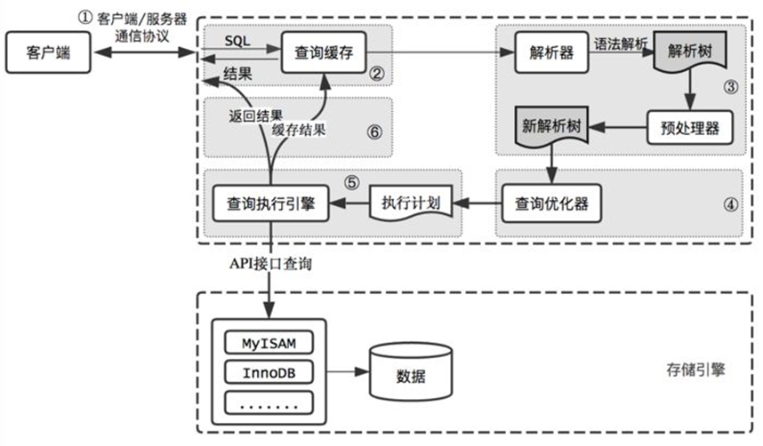

# JavaWeb-JDBC

# 一. JDBC概述

## 1.1 什么是JDBC

JDBC（Java DataBase Connectivity,  Java数据库连接） ,是一种用于执行SQL语句的Java API，为多种关系数据库提供统一访问,它由一组用Java语言编写的类和接口组成。

有了JDBC，程序员只需用JDBC API写一个程序，就可访问所有数据库。

Sun 公司、数据库厂商、程序员三方关系：

SUN 公司是规范制定者，制定了规范 JDBC（连接数据库规范） 		

**DriverManager** 类  作用：管理各种不同的JDBC驱动  		

**Connection** 接口   		

**Statement** 接口和 **PreparedStatement** 接口    		

**ResultSet** 接口  		

数据库厂商微软、甲骨文等分别提供实现JDBC接口的驱动 jar 包  		

程序员学习 JDBC 规范来应用这些 jar 包里的类。 

JDBC访问数据库编码步骤 		

1. 加载一个Driver驱动 		
2. 创建数据库连接（Connection） 		
3. 创建SQL命令发送器Statement 		
4. 通过Statement发送SQL命令并得到结果 		
5. 处理结果（select语句） 		
6. 关闭数据库资源ResultSet  Statement Connection 		

**创建模块/项目 导入jar包：**

### JDBD历史版本及特征

**JDBC 1.0：**

JDBC 1.0 随 JDK1.1 一起发布,JDBC操作相关的接口和类位于 java.sql 包中。 		

**JDBC 2.0：**

JDBC 2.0 API 被划分为两部分：核心 API 和扩展 API,有两个包,分别是 java.sql 包和 javax.sql 包。 		

**java.sql核心API包：**

在支持新功能方面：包括结果集可以向后滚动，批量的更新数据。另外，还提供了UNICODE字符集的字符流操作。 		

在支持SQL的数据类型方面：新增加的BLOB, CLOB,和数组接口能够是应用程序操作大块的数据类型 		

**javax.sql扩展API包：**

**DataSource 数据源接口：** 		

JDBC1.0是原来是用 DriverManager 类来产生一个对数据源的连接。JDBC2.0 用一种替代的方法，使用 DataSource 的实现，代码变的更小巧精致，也更容易控制。 

**Connection pooling：** 		

如果DataSource对象实现与一个支持连接池的中间层的服务器一起工作，DataSource对象就会自动的返回连接池中的连接，这个连接也是可以重复利用的。 

**Distrubute transaction：** 		

在一个事务中涉及到了多个数据库服务器。获得一个用来支持分布式事务的连接与获得连接池中的连接是很相似的。同样，不同之处在于 DataSource 的实现上的不同，而不是在应用程序中获得连接的方式上有什么不同。 		

**Rowsets：** 		

RowSet 接口扩展了 ResultSet 接口。这样 RowSet 对象就有了 ResultSet 对象所有的功能。不可以滚动的 ResultSet 变成了可以滚动的 RowSet。 		

## 1.2 快速上手

1. 创建项目并导入依赖

```xml
<dependency>
    <groupId>mysql</groupId>
    <artifactId>mysql-connector-java</artifactId>
    <version>8.0.25</version>
</dependency>
```

2. 示例代码

```java
public class JdbcDriverDemo {

    public static void main(String[] args) throws SQLException {
        // 创建驱动类，然后注册驱动类
        Driver driver = new com.mysql.cj.jdbc.Driver();
        DriverManager.registerDriver(driver);
        // 数据库协议和地址url
        /**
         * 协议：	jdbc:mysql
         * IP：	127.0.0.1/localhost
         * 端口号：	3306
         * 数据库名称：	test
         * 参数：...
         */
        String url = "jdbc:mysql://127.0.0.1:3306/test?useSSL=false&useUnicode=true&characterEncoding=utf-8&serverTimeZone=Asia/ShangHai";
        String user = "root";  // 用户名
        String password = "root1234";  // 密码
        // 获取连接对象
        Connection connection = DriverManager.getConnection(url, user, password);
        // 获取执行对象
        Statement statement = connection.createStatement();
        String sql = "insert into `tb_student` values(default, '高斯', 90)";
        // 执行SQL语句
        int rows = statement.executeUpdate(sql);
        // 输出影响的行数
        System.out.println("Affected Rows: " + rows);
        // 释放资源，注意顺序，先获得的后关闭
        statement.close();
        connection.close();
    }
}
```

## 1.3 常见异常

1. **Exception in thread "main" java.lang.ClassNotFoundException: com.mysql.jdbc2.Driver：**

原因：没有添加jar包或者com.mysql.jdbc2.Driver路径错误

2. **Exception in thread "main" java.sql.SQLException:** 		

   **No suitable driver found for jbdc:mysql://127.0.0.1:3306/test**

原因：url错误

3. **Exception in thread "main" java.sql.SQLException:** 		

   **Access denied for user 'root'@'localhost' (using password: YES)**

原因：用户名或者密码错误

4. **Exception in thread "main" com.mysql.jdbc.exceptions** 		

   **.jdbc4.MySQLIntegrityConstraintViolationException:Duplicate entry '90' for key 'PRIMARY'**

原因：主键冲突

5. **Public Key Retrieval is not allowed**

如果用户使用 sha256_password 认证，密码在传输过程中必须使用 TLS 协议保护，但是如果 RSA  公钥不可用，可以使用服务器提供的公钥；可以在连接中通过 ServerRSAPublicKeyFile 指定服务器的 RSA  公钥，或者 `AllowPublicKeyRetrieval=True`参数以允许客户端从服务器获取公钥；但是需要注意的是  `AllowPublicKeyRetrieval=True`可能会导致恶意的代理通过中间人攻击(MITM)获取到明文密码，所以默认是关闭的，必须显式开启。

在jdbc连接添加上参数 `allowPublicKeyRetrieval=true` 即可，注意参数间用 `&`。

### 1.4 驱动的加载

加载数据库驱动时,我们可以通过自己创建一个实例的方式,然后去注册驱动：

```java
package com.mysql.cj.jdbc;

import java.sql.DriverManager;
import java.sql.SQLException;

public class Driver extends NonRegisteringDriver implements java.sql.Driver {
    public Driver() throws SQLException {
    }

    static {
        try {
            DriverManager.registerDriver(new Driver());
        } catch (SQLException var1) {
            throw new RuntimeException("Can't register driver!");
        }
    }
}
```

在查看 Driver 的源代码时我们发现,该类内部有一个静态代码块,在代码块中就是在实例化一个驱动并在驱动中心注册.静态代码块会在类进入内存时执行,也就是说,我们只要让该类字节码进入内存,就会自动完成注册,不需要我们手动去 new。

所以我们在代码中直接使用反射,通过 `Class.forName("com.mysql.jdbc.Driver")`,加载该类进入内存即可 		

​    我们继续查看 jar 包发现,jar 包中已经默认配置了驱动类的加载。

jar--META-INF--services--java.sql.Driver--com.mysql.jdbc.Driver,在加载jar包时,会自动读取该内容并加载驱动,所以我们不去编写Class.forName("com.mysql.jdbc.Driver"),程序也是可以自动完成加载驱动的。

**这就是 Java 的 SPI 机制。**

# 二. JDBC完成CRUD

## 2.1 增删改学生信息

```java
public class JdbcDemo {
    
    private static final String driver = "com.mysql.cj.jdbc.Driver";
    private static final String url = "jdbc:mysql://127.0.0.1:3306/test?useSSL=false&useUnicode=true&characterEncoding=utf-8&serverTimeZone=Asia/ShangHai";
    private static final String user = "root";
    private static final String password = "root1234";
    
    public static void operate() {
        Connection connection = null;
        Statement statement = null;

        try {
            Class.forName(driver);
            connection = DriverManager.getConnection(url, user, password);
            statement = connection.createStatement();
            // 删除修改只需要修改sql语句即可，都是调用executeUpdate方法
            String sql = "insert into `tb_student` values(default, '高斯', 90)";
            int rows = statement.executeUpdate(sql);
			 System.out.println("Affected Rows: " + rows);
        } catch (ClassNotFoundException | SQLException e) {
            throw new RuntimeException(e);
        } finally {
            if (statement != null) {
                try {
                    statement.close();
                } catch (SQLException e) {
                    e.printStackTrace();
                }
            }
            if (connection != null) {
                try {
                    connection.close();
                } catch (SQLException e) {
                    e.printStackTrace();
                }
            }
        }
    }

    public static void main(String[] args) {
        List<Student> list = Operate();
        list.forEach(System.out::println);
    }
}
```

## 2.2 查询全部学生信息

1. 封装实体类

```java
// 一个实体类对应一个数据库表，属性名称尽量统一
public class Student {
    
    private Integer id;
    
    private String name;
    
    private Integer age;
    
    // constructors getters setters toString()... 
}
```

2. 查询

```java
public static List<Student> query() {
    Connection connection = null;
    Statement statement = null;
    ResultSet rs = null;
    List<Student> list = new ArrayList<>();

    try {
        Class.forName(driver);
        connection = DriverManager.getConnection(url, user, password);
        statement = connection.createStatement();
        String sql = "select * from `tb_student`";
        rs = statement.executeQuery(sql);
        while (rs.next()) {
            Student student = new Student();
            student.setId(rs.getInt("id"));
            student.setName(rs.getString("name"));
            student.setAge(rs.getInt("age"));
            list.add(student);
        }
    } catch (ClassNotFoundException | SQLException e) {
        throw new RuntimeException(e);
    } finally {
        if (statement != null) {
            try {
                statement.close();
            } catch (SQLException e) {
                e.printStackTrace();
            }
        }
        if (connection != null) {
            try {
                connection.close();
            } catch (SQLException e) {
                e.printStackTrace();
            }
        }
        if (rs != null) {
            try {
                rs.close();
            } catch (SQLException e) {
                e.printStackTrace();
            }
        }
    }
    return list;
}
```

- ResultSet 里的数据一行一行排列，每行有多个字段，且有一个记录指针，指针所指的数据行叫做当前数据行，我们只能来操作当前的数据行。我们如果想要取得某一条记录，就要使用 ResultSet 的 `next()` 方法 ,如果我们想要得到 ResultSet 里的所有记录，就应该使用 while 循环。
- ResultSet 对象自动维护指向当前数据行的游标。每调用一次 `next()` 方法，游标向下移动一行。
- 初始状态下记录指针指向第一条记录的前面，通过 `next()` 方法指向第一条记录。循环完毕后指向最后一条记录的后面。

| 方法名                            | 说明                                    |
| --------------------------------- | --------------------------------------- |
| boolean next()                    | 将光标从当前位置向下移动一行            |
| boolean  previous()               | 游标从当前位置向上移动一行              |
| void  close()                     | 关闭ResultSet 对象                      |
| int  getInt(int colIndex)         | 以int形式获取结果集当前行指定列号值     |
| int  getInt(String colLabel)      | 以int形式获取结果集当前行指定列名值     |
| float  getFloat(int colIndex)     | 以float形式获取结果集当前行指定列号值   |
| float  getFloat(String colLabel)  | 以float形式获取结果集当前行指定列名值   |
| String  getString(int colIndex)   | 以String 形式获取结果集当前行指定列号值 |
| StringgetString(String  colLabel) | 以String形式获取结果集当前行指定列名值  |

作为一种好的编程风格，应在不需要Statement对象和Connection对象时显式地关闭它们。关闭Statement对象和Connection对象的语法形式为：用户不必关闭ResultSet。当它的 Statement 关闭、重新执行或用于从多结果序列中获取下一个结果时，该ResultSet将被自动关闭。

## 2.3 实体类编写风格

**为什么将结果封装成对象或者对象集合?**

1. java 是面向对象的编程语言,java 中所有的数据处理都是基于面向对象的编码风格实现的,让数据以符合 java 风格的形式存在,便于对数据的后续处理 

2. ResultSet 集合虽然可以存放数据,但是它是 JDBC 中查询数据的一种手段,是一种数据的临时存储方案,使用完毕是要进行释放和关闭

**如何将结果集中的数据在java中进行存储和传递?**

准备和数据库表格相对应的一个实体类,用于封装结果集中的每一条数据,数据库表格中的每一个字段就是实体类的一个属性,实体类的一个对象就可以用于存储数据库表中的一条记录。

实体类编写指南：和数据库表格名称和字段是一一对应的类，该类的对象主要用处是存储从数据库中查询出来的数据，除此之外,该类没有任何的其他功能。

要求：

1. 类名和表名保持一致  (见名知意)

2. 属性个数和数据库的表的列数保持一致
3. 属性的数据类型和列的数据类型保持一致
4. 属性名和数据库表格的列名要保持一致
5. 所有的属性必须都是私有的 (出于安全考虑)
6. 实体类的属性推荐写成包装类
7. 日期类型推荐写成 java.util.Date
8. 所有的属性都要有 get 和 set 方法
9. 必须具备空参构造方法
10. 实体类应当实现序列化接口 (mybatis缓存  分布式需要 )
11. 实体类中其他构造方法可选

## 2.4 SQL注入攻击

SQL注入攻击指的是通过构建特殊的输入作为参数传入Web应用程序，而这些输入大都是SQL语法里的一些组合，通过执行SQL语句进而执行攻击者所要的操作，其主要原因是程序没有细致地过滤用户输入的数据，致使非法数据侵入系统。 		

以模拟登录为例:在前台输入用户名和密码，后台判断信息是否正确，并给出前台反馈信息，前台输出反馈信息。

比方说，黑客在密码输入框里面输入了以下密码：

```sql
123456 or 1 = 1
```

在最后的 sql 语句拼接可能就是：

```sql
select
	*
from
	`tb_user`
where
	username = '洛必达'
and
	password = 123456
or
	1 = 1
```

那么这样，sql 语句百分之百可以运行，因为 1 = 1 是恒等的，这样就有被黑客攻击的风险。当输入了精心设计的用户名密码后，即使是错误的，也能登录成功。让登录功能形同虚设。这是为什么呢，这就是SQL注入风险，原因在于SQL语句是字符串拼接的。SQL语句中拼接的内容破坏了SQL语句原有的判断逻辑 		

如何解决呢?使用 PreparedStatement 预编译语句对象就可以解决掉。

# 三. 预编译语句对象

## 3.1 使用预编译对象防止注入攻击

```java
public static void main(String[] args) {
    Connection connection = null;
    PreparedStatement preparedStatement = null;
    ResultSet rs = null;
    try {
        Class.forName(driver);
        connection = DriverManager.getConnection(url, user, password);
        tring sql="select * from account where username = ? and password = ?";
        preparedStatement = connection.prepareStatement(sql);
        // 通过set方法设置参数，从1开始计数
        preparedStatement.setString(1, username);
        preparedStatement.setString(2, pwd);
        rs = preparedStatement.executeQuery();
        while (rs.next()) {
            // do something...
        }
    } catch (Exception e) {
        e.printStackTrace();
    } finally {
        // ... close
    }
}
```

prepareStatment 对象在 *set* 方法上,会对单引号进行转译处理,也就是说, `?` 中的数据的单引号  `'` 会被转义成  **\\'** 这样就单引号就不会破坏 sql 语句的结构,

```
SELECT * FROM users WHERE username =  ? AND password = ?
preparedStatement.setString(1, "xiaoming");
preparedStatement.setString(2, 'anything' OR 'x' = 'x');
-- 会被转义为
SELECT * FROM users 
WHERE username = 'xiaoming' 
AND password = \'anything\' OR \'x\' = \'x\''
```

说白了就是把值当中的所有单引号给转义了!这就达到了防止 sql 注入的目的，说白了 mysql 驱动的 PreparedStatement 实现类的 setString();方法内部做了单引号的转义，而 Statement 不能防止 sql 注入，就是因为它没有把单引号做转义，而是简单粗暴的直接拼接字符串，所以达不到防止 sql 注入的目的。

## 3.2 预编译原理

当客户端发送一条 sql 语句给 DBMS 时,MySQL 的执行流程如下图：



**sql 命令执行流程：**

1. 客户端向服务器端发送 SQL 命令 		
2. 服务器端连接模块连接并验证 		
3. 缓存模块解析 SQL 为 Hash 并与缓存中 Hash 表对应。如果有结果直接返回结果，如果没有对应继续向下执行 		
4. 解析器解析 SQL 为解析树，如果出现错误，报 SQL 解析错误。如果正确，向下传递 		
5. 预处理器对解析树继续处理，处理成新的解析树。 		
6. 优化器根据开销自动选择最优执行计划，生成执行计划 		
7. 执行器执行执行计划，访问存储引擎接口 		
8. 存储引擎访问物理文件并返回结果 		
9. 如果开启缓存，缓存管理器把结果放入到查询缓存中。 		
10. 返回结果给客户端

当客户发送一条 SQL 语句给 DBMS 后，DBMS 总是需要校验 SQL 语句的语法格式是否正确，然后把 SQL 语句编译成可执行的函数，最后才是执行 SQL 语句。其中校验语法，和编译所花的时间可能比执行 SQL 语句花的时间还要多。 		

预编译语句 PreparedStatement 是 java.sql 中的一个接口，它是 Statement 的子接口。通过 Statement 对象执行 SQL 语句时，需要将 SQL 语句发送给 DBMS，由DBMS 首先进行编译后再执行。预编译语句和 Statement 不同，在创建PreparedStatement 对象时就指定了 SQL 语句，该语句立即发送给 DBMS 进行编译。当该编译语句被执行时，DBMS 直接运行编译后的 SQL 语句，而不需要像其他 SQL语句那样首先将其编译。预编译的 SQL 语句处理性能**稍微**高于普通的传递变量的办法。 		

例如:我们需要执行多次 insert 语句，但只是每次插入的值不同，MySQL 服务器也是需要每次都去校验 SQL 语句的语法格式，以及编译，这就浪费了太多的时间。如果使用预编译功能，那么只对SQL语句进行一次语法校验和编译，所以效率要高。

## 3.3 开启预编译

我们可以通过设置 URL 中的参数来控制预编译是否开启 		

**useServerPrepStmts** 是否开启预编译 		

**cachePrepStmts** 是否启用预编译缓存

```java
String url = "jdbc:mysql://localhost:3306/mydb?useServerPrepStmts=true&cachePrepStmts=true";
```

**值得注意的是,我们的Connector/J 5.0.5及之后** useServerPrepStmts 默认 false,就是默认没有开启预编译,之前默认为 true, cachePrepStmts  一直默认为 false,需要我们手动设置才可以启用预编译,在开启预编译的同时要同时开启预编译缓存才能带来些许的性能提升。

**Statement 和 PreparedStatment 的关系和区别：**

PreparedStatment 安全性高,可以避免 SQL 注入。

PreparedStatment 简单不繁琐,不用进行字符串拼接。

PreparedStatment 性能高，用在执行多个相同数据库 DML 操作时,可以减少 sql语句的编译次数。

# 四. 批处理


# 五. 事务及回滚点


# 六. DAO模式


# 七. 三大范式


