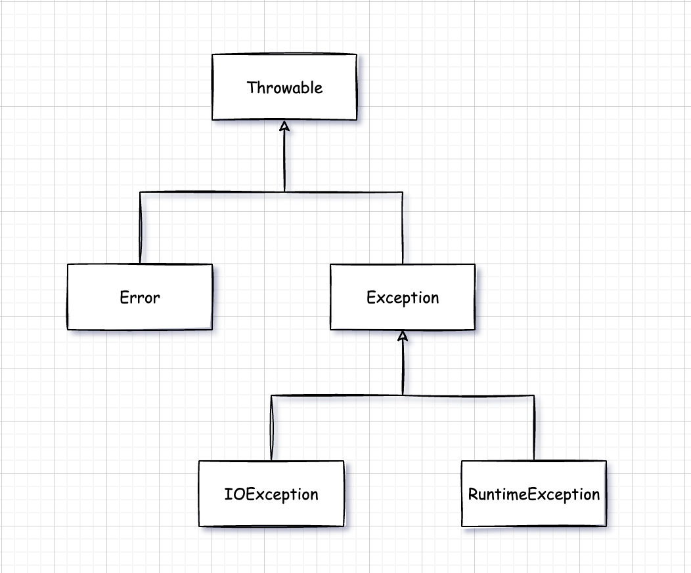

# 五. 异常断言日志

对于异常情况，例如，可能造成程序崩溃的错误输入，Java 使用一种被称为**异常处理(exception handling)**的错误捕捉机制处理。Java 异常处理与 C++ 或 Delphi 中的异常处理十分类似。


## 5.1 处理错误

假设在在一个 Java 程序运行期间出现了一个错误。这个错误可能是由于文件包含了错误的信息，或者网络连接出现问题造成的，也有可能是因为使用无数的数组下标，或者试图使用一个没有被赋值的对象引用而造成的。用户希望在出现错误的时候，程序能够采用一些理智的行为。如果由于出现错误而使得某些操作没有完成，程序应该：

- 返回到一种安全状态，并能够让用户执行一些其他的命令。
- 允许用户保存所有的操作，并以妥善的方式终止程序。

要做到这些并不是一件很容易的事情。其原因是检测(或引发)错误条件的代码通常离那些能够让数据恢复到安全状态，或者能够保存用户的操作结果，并正常地退出程序的代码很远。异常处理的任务就是将控制权从错误产生的地方转移给能够处理这种情况的错误处理器。


### 5.1.1 异常分类

在 Java 程序设计语言中，异常对象都是派生于 Throwable 类的一个实例。如果 Java 中内置的异常类不能够满足要求，那么用户可以创建自己的异常类。

Java 异常层次结构如图所示：



需要注意的是，所有的异常都是由 Throwable 继承而来，但在下一层立即分解为两个分支：Error 和 Exception。

Error 类层次结构描述了 Java 运行时系统的内部错误和资源耗尽错误。应用程序不应该抛出这种类型的对象。如果出现了这种内部错误，除了通告给用户，并尽力使程序安全地终止之外，再也无能为力。这种情况很少出现。

在设计 Java 应用程序是，需要关注 Exception 层次结构。这个层次结构又分解为两个分支：一个分支派生于 RuntimeException；另一个分支包含其他异常。划分两个分支的规则是：由程序错误导致的异常属于 RuntimeException；而程序本身没有问题，但由于像 I/O 错误这类问题导致的异常属于其他异常。

派生于 RuntimeException 的异常包含下面几种情况：

- 错误的类型转换。
- 数组访问越界。
- 访问 null 指针。

不是派生于 RuntimeException 的异常包括：

- 试图在文件尾部后面读取数据。
- 试图打开一个不存在的文件。
- 试图根据给定的字符串查找 Class 对象，而这个字符串表示的类并不存在。

如果出现 RuntimeException 异常，那么就一定是你的问题是一条相当有道理的规则。应该通过检测数组下表是否越界来避免 ArrayIndexOutOfBoundsException 异常。应该通过在使用变量之前检测是否为 null 来杜绝 NullPointer 异常的发生。

Java 语言规范将派生于 Error 类或 RuntimeException 类的所有异常称为**非受查异常(unchecked)**异常，所有其他异常称为**受查(checked)**。这是两个很有用的术语。编译器将核查是否为所有的受查异常提供了异常处理器。

> RuntimeException 这个名字很容易让人混淆。实际上，现在讨论的所有错误都发生运行时。


### 5.1.2 声明受查异常

如果遇到了无法处理的情况，那么 Java 的方法可以抛出一个异常。这个道理很简单：一个方法不仅需要告诉编译器将要返回什么值，**还要告诉编译器可能发生什么类型的错误**。例如，一段读取文件的代码知道有可能读取的文件不存在，或者内容为空。因此，试图处理文件信息的代码就需要通知编译器可能抛出 IOException 类的异常。

在自己编写方法时，不必讲所有可能抛出的异常都进行声明。至于什么时候需要再方法中用 throws 子句声明异常，什么异常必须使用 throws 子句声明，需要记住遇到下面  4 种情况时应该抛出异常：

- 调用一个抛出受查异常的方法
- 程序运行过程中发现错误，并且利用 throw 语句抛出一个受查异常。
- 程序出现错误，例如，数组下表越界异常。
- Java 虚拟机和运行时库出现的内部错误。

如果出现前两种情况之一，则必须告诉调用这个方法的程序员有可能抛出异常。因为任何一个抛出的异常方法都有可能是一个**死亡陷阱**。如果没有没有处理器捕获这个异常，当前执行的线程就会结束。

根据**异常规范(exception specification)**，在方法的首部声明这个方法可能抛出的异常。

```java
public Image loadImage(String s) throws IOException { ... }
```

如果一个方法有可能抛出多个受查异常类型，那么久必须在方法的首部列出所有的异常类。每个异常用逗号隔开：

```java
public Image loadImage(String s) throws FileNotFoundException, EOFException { ... }
```

但是不需要声明 Java 的内部错误，即从 Error 继承的错误。任何程序代码都具有抛出那些异常的潜能，而我们对其没有任何控制能力。

同样，也不该声明从 RuntimeException 继承的那些非受查异常。

总之，一个方法必须声明所有可能抛出的**受查异常**，而非受查异常要么不可控制(Error)，要么就应该避免发生(RuntimeException)。如果方法没有声明所有可能发生的异常，直接编译失败。

> 如果在子类中覆盖了超类的一个方法，子类方法中声明的受查异常不能比超类方法中声明的异常范围更广(也就是说，子类方法中可以抛出更特定的异常，或者根本不抛出任何异常。)特别需要说明的是，如果超类方法没有抛出任何受查异常，子类也不能抛出任何受查异常。

如果类中的一个方法声明将会抛出一个异常，而这个异常是某个特定类的实例时，则这个方法就有可能抛出一个这个类的异常，或者这个类的任意一个子类的异常。例如，FileInputStream 构造器声明将有可能抛出一个 IOException 异常，也有可能是其子类的异常。例如，FileNotFoundException。


### 5.1.3 如何抛出异常

抛出异常的语法格式：

```java
throw new XxxException();
```

把代码组织在一起：

```java
public String readData(Scanner in) throws EOFException {
    ...
    while (...) {
        if (!in.hasNext()) {  // EOF
            throw new EOFException();
        }
        ...
    }
    return s;
}
```

对于一个已经存在的异常类，将其抛出非常容易，在这种情况下：

1. 找到一个合适的异常类。
2. 创建这个类的一个对象。
3. 将其抛出。

一旦方法抛出异常，这个方法就不可能返回到调用者。也就是说，不必为返回的默认值或错误代码担忧。


### 5.1.4 创建异常类

在程序中，可能会遇到任何标准异常类都没有能够充分描述清楚问题。在这种情况下，创建自己的异常类就是一件顺理成章的事情了。需要做的就是定义一个派生于 Exception 的类，或者派生于 Exception 子类的类。

e.g. 定义一个自定义异常：

```java
public class FileFormatException extends IOException {
    public FileFormatException() {}
    public FileFormatException(String s) {
        super(s);
    }
}
```

抛出异常还是和原来一样，使用 throw 关键字即可。

*java.lang.Throwable* 有关 API：

- `Throwable()` 构造一个新的 Throwable 对象，这个对象没有详细的描述信息。
- `Throwable(String message)` 构造一个新的 throwable 对象，这个对象带有特定的详细描述信息。
- `String getMessage()` 获得 Throwable 对象的详细描述信息。


## 5.2 捕获异常

### 5.2.1 try catch

如果某个异常发生的时候没有任何地方尽心捕获，那么程序就会终止执行，并在控制台上打印异常信息，其中包括异常的类型和堆栈的内容。

想要捕获一个异常，那么必须要设置 try/catch 代码块。

try/catch 语法格式：

```java
try {
    ...  // code block that exception probably occurs in
} catch (ExceptionType e) {
    ...  // handle for this exception
}
```

如果在 try 代码块中的任何代码抛出了一个在 catch 子句中说明的异常类，那么：

1. 程序将会跳过 try 语句块的其余代码。
2. 程序将执行 catch 子句中的处理器代码。

如果在 try 语句块中的代码没有抛出异常，那么程序将跳过 catch 子句。

如果方法中的任何代码抛出了一个在 catch 子句中没有声明的异常类型，那么这个方法就会立刻退出。

e.g. 捕获读取数据的异常代码：

```java
public void read(String fileName) {
    try {
        InputStream in = new FileInputStream(fileName);
        int b;
        while ((b = in.read()) != -1) {
            ...
        }
    } catch (IOException e) {
        e.printStackTrace();
    }
}
```

或者不处理，而是把异常传递给调用者，那么就必须声明这个方法可能会抛出异常，那么代码就可以这样写：

```java
public void read(String fileName) throws IOException { ... }
```

编译器将严格执行 throws 说明符。如果调用了一个抛出受查异常的方法，就必须对它进行处理，或者继续传递。如果想要传递一个异常，就必须在方法的首部添加 throws 关键字，以便告知调用者这个方法可能会抛出异常。

同时记住，这个规则也有一个例外。如果编写一个覆盖超类的方法，而这个方法又没有抛出异常，那么这个方法就必须捕获方法中的每一个受查异常。不允许在子类的 throws 关键字后出现超过超类方法所列出的异常范围类型。


### 5.2.2 捕获多个异常

在一个 try 语句块中可以捕获多个异常，并对不同类型的异常做出不同的处理，可以按照下列方式为每个异常类型使用一个单独的 catch 子句：

```java
try {
    ...
} catch (FileNotFoundException e) {
    ...
} catch (UnknownHostException e) {
    ...
} catch (IOException e) {
    ...
}
```

异常对象可能包含与异常本身有关的信息。想要获得对象的更多信息，可以试着使用 `e.getMessage()`得到详细的错误信息或者使用 `e.getClass().getName()` 得到异常对象的实际类型。

在 Java SE 7 中，同一个 catch 子句可以捕获多个异常类型。上述代码可以合并为：

```java
try {
    ...
} catch (FileNotFoundException | UnkownHostException e) {
    ...
} catch(IOException e) {
    ...
}
```

意思就是说，前两种异常处理方式是一样的，后面的异常单独处理，相同处理方式的异常可以合并在一起。

> 捕获多个异常时，异常变量隐含为 final 变量。也就是说没，不可以为异常对象 e 重新赋值。


### 5.2.3 再次抛出异常与异常链


## 5.3 使用异常机制的技巧


## 5.4 使用断言


## 5.5 记录日志


## 5.6 调试技巧