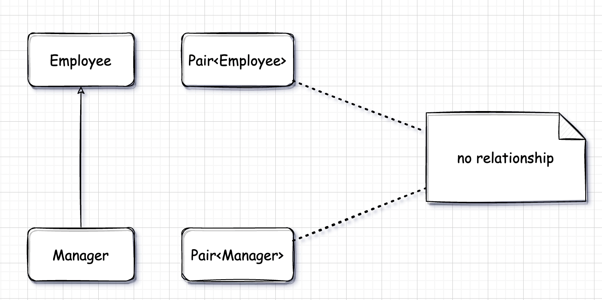
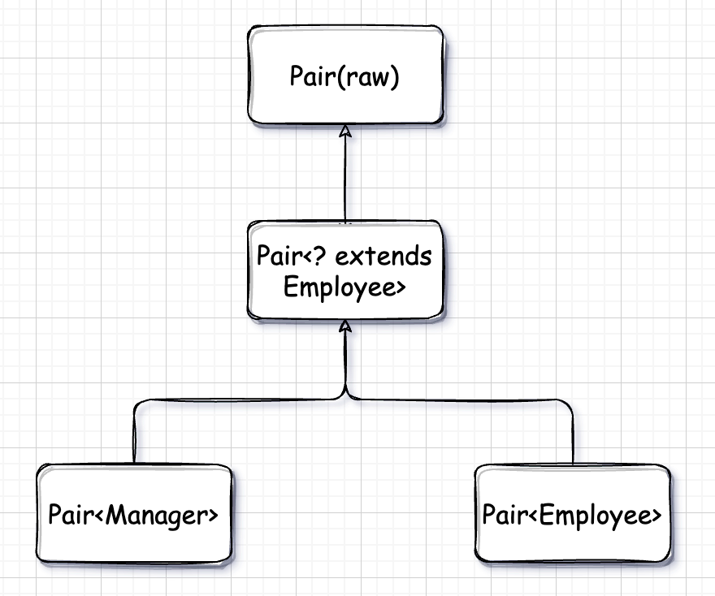
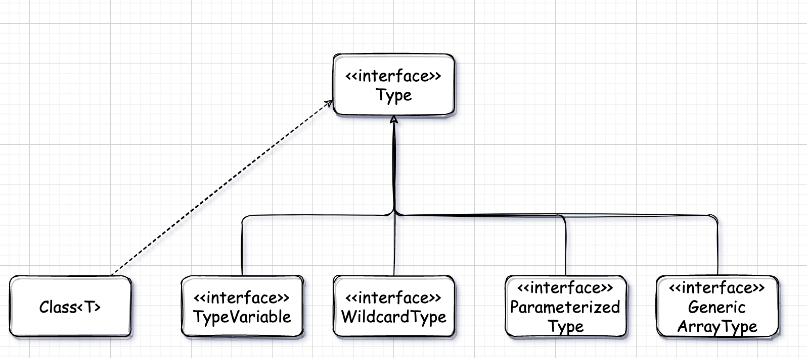

# 六. 泛型程序设计

## 6.1 Why 泛型程序设计

**泛型程序设计(Generic Programming)**意味着编写的代码可以被很多不同类型的对象重用。例如，我们并不希望聚集 String 和 File 对象分别设计不同的类。实际上，也不需要这样做，因为一个 ArrayList 类可以聚集任何类型的对象。这是一个泛型程序设计的实例。

### 6.1.1 类型参数的好处

在 Java 中增加泛型类之前，泛型程序设计是用继承实现的。ArrayList 类只维护一个 Object 引用的数组：

```java
public class ArrayList {
    private Object[] elements;
    ...
    public Object get(int i) {...}
    public void add(Object o) {...}
}
```

这种方法有两个问题。当获取一个值时必须进行强制类型转换。

```java
String fileName = (String) list.get(0);
```

此外这里没有错误检查。可以向数组列表中添加任何类的对象。

```java
list.add(new Person());
```

对于这个调用，编译和运行都不会出错。然而在其他地方，如果将 get 的结果做强制类型转换为 String 类型，救护产生一个错误。

泛型提供了一个更好的解决方案：**类型参数(type parameters)**。ArrayList 类有一个类型参数指示元素的类型：

```java
List<String> list = new ArrayList<>();
```

> 使用 Java SE 7 之后的版本可以使用菱形运算符<>省略后面的类型。编译器可以自动推导类型。

编译器也可以很好地利用这个信息。当调用 get 的时候，不需要进行强制类型转换，编译器就知道返回值是 String，而不是 Object。

```java
String fileName = list.get(0);
```

类型参数的魅力在于：使得程序具有更好的可读性和安全性。


## 6.2 定义简单泛型

一个**泛型类(generic class)**就是具有一个或多个类型变量的类。

e.g. 声明一个泛型类：

```java
public class Pair<T> {
    private T first;
    private T second;
    public Pair() {}
    public Pair(T first, T second) {
        this.first = first;
        this.second = second;
    }
    public T getFirst() {
        return first;
    }
    public T getSecond() {
        return second;
    }
    public void setFirst(T newValue) {
        first = newValue;
    }
    public void setSecond(T newValue) {
        second = newValue;
    }
}
```

Pair 类引入了一个类型变量 T，使用尖括号\<\>括起来，并放在类名的后面。泛型类可以有多个类型变量。

e.g. 定义有两个类型参数的 Pair 类：

```java
public class Pair<T, U> {
    ...
}
```

类型变量使用大写形式，且比较短，这是很常见的。在 Java 库中，使用变量 E 表示集合的元素类型，K 和 V 分别表示哈希表的关键字和值的类型。T 表示任意类型。

e.g. 实例化一个 Pair 泛型类对象：

```java
Pair<String> pair = new Pair<>();
```

简而言之，泛型类可以看作普通类的工厂。


## 6.3 泛型方法

在 Java 中不仅有泛型类，而且还有泛型方法，定义泛型方法这样也就不需要使用泛型类的类型参数了，或者直接不需要定义泛型类。

e.g. 定义一个泛型方法：

```java
public class IArrays {
    public static <T> T getMiddle(T... a) {
    	return a[a.length / 2];
	}
}
```

这个方法是在普通类中定义的，而不是在泛型类中定义的。然而，这是一个泛型方法，可以从尖括号和类型变量看出这一点。**注意，类型变量放在修饰符的后面，返回类型的前面。**

泛型方法可以在定义在普通类中，也可以定义在泛型类中。


## 6.4 类型变量的限定

有时候，类或方法需要对类型变量加以约束。下面是一个典型的例子，计算数组中的最小元素：

```java
public class TestArray {
	public static <T> T min(T[] a) {
        if (a == null || a.length) {
            return null;
        }
        T smallest = a[0];
        for (int i = 1; i < a.length; i++) {
            if (smallest.compareTo(a[i]) > 0) {
                smallest = a[i];
            }
        }
        return smallest;
    }
}
```

但是这里有一个问题，smallest 是一个类型为 T 的对象，也就是说它可以是任意一个对象。如何确定它实现了 Comparable 接口呢？

解决方案就是将 T 限制为实现了 Comparable 接口的类。可以通过对类型变量 T 设置**限定(bound)**实现这一点：

```java
public static <T extends Comparable> T min(T[] a) { ... }
```

实际上 Comparable 接口本身就是一个泛型类型。泛型的 min 方法只能被实现了 Comparable 接口的类的数组调用。

也许你或许会感到奇怪，为什么要使用关键字 `extends` 而不是使用 `implements` ？毕竟，Comparable 是一个接口。下面的记法：

```java
<T extends BoundingType>
```

表示 T 应该是绑定类型的**子类型(subtype)**。T 和绑定类型可以是类，也可以是接口。选择关键字 `extends` 原因是更接近子类的概念，并且 Java 的设计者也不打算在语言中再添加一个新的关键字。

一个类型变量或通配符可以有多个限定：

```java
T extends Comparable & Serializable
```

限定符使用 `&` 分隔，而逗号用来分隔类型变量。

在 Java 的继承中，可以根据需要拥有多个接口超类型，但限定中至多有一个类。如果用一个类作为限定，它必须是限定列表中的第一个。


## 6.5 泛型代码与虚拟机

虚拟机没有泛型类型对象——所有对象都属于普通类。在泛型实现的早期版本中，甚至能够将使用泛型的程序编译为在 1.0 虚拟机上运行的类文件。这个向后兼容性在 Java 泛型开发的后期被放弃了。

### 6.5.1 类型擦除

无论何时定义一个泛型类型，都自动提供了一个相应的**原始类型(raw type)**。原始类型的名字就是删去类型参数后的泛型类型名。**擦除(erased)**类型变量，并替换为限定类型(无限定类型的变量用 Object)。

e.g. Pair 类的原始类型：

```java
public class Pair {
    private Object first;
    private Object second;
    public Pair(Object first, Object second) {
        this.first = first;
        this.second = second;
    }
    public Object getFirst() {
        return first;
    }
    public Object getSecond() {
        return second;
    }
    public void setFirst(Object newValue) {
        first = newValue;
    }
    public void setSecond(Object newValue) {
        second = newValue;
    }
}
```

因为 T 是一个无限定的变量，所以直接用 Object 替换。

结果是一个普通的类，就好像泛型引入了 Java 语言之前已经实现的那样。

在程序中可以包含不同类型的 Pair，例如，Pair\<String\> 或 Pair\<LocalDate\>。而擦除类型后就变成原始的 Pair 类型了。

原始类型用第一个限定的类型变量来替换，如果没有给定限定那就用 Object 替换。例如，Pair\<T\> 中的类型变量没有显示的限定，因此，原始类型用 Object 替换 T。假设声明了一个不同的类型。

```java
public class Interval<T extends Comparable & Serializable> implements Serializable {
    private T lower;
    private T upper;
    ...
    public Interval(T first, T second) {
        if (first.compareTo(second) < 0) {
            lower = first;
            upper = second;
        } else {
            lower = second;
            upper = first;
        }
    }    
}
```

原始类型 Interval 如下所示：

```java
public class Interval implements Serializable {
    private Comparable lower;
    private Comparable upper;
    ...
    public Interval(Comparable first, Comparable second) { ... }    
}
```

你肯定想知道切换限定：class Interval\<T extends Serializable & Comparable\> 会发生什么。如果这样做，原始类型用 Serializable 替换 T，而编译器在必要时要向 Comparable 插入强制类型转换。为了提高效率，应该将标签(tagging)接口(即没有方法的接口)放在边界列表的末尾。


### 6.5.2 翻译泛型表达式

当程序调用泛型方法时，如果擦除返回类型，编译器插入强制类型转换。例如，下面这两条语句：

```java
Pair<Employee> buddies = ...;
Employee buddy = buddies.getFirst();
```

擦除 *getFirst* 的返回类型后返回 Object 类型。编译器自动插入 Employee 的强制类型转换。也就是说，编译器把这个方法翻译为两条虚拟机指令：

- 对原始方法 Pair.getFirst 的调用。
- 将返回的 Object 类型强制转换为 Employee 类型。

当存取一个泛型域时也要插入强制类型转换。假设 Pair 类的 first 域和 second 域都是公有的表达式：

```java
Employee buddy = buddies.first;
```

也会在结果字节码插入强制类型转换。


### 6.5.3 翻译泛型方法

类型擦除也会出现在泛型方法中。程序员通常认为下述的泛型方法

```java
public static <T extends Comparable> T min(T[] a);
```

是一个完整的方法族，而擦除类型之后，只剩下一个方法：

```java
public static Comparable min(Comparable[] a);
```

类型参数 T 已经被擦除了，只留下限定类型 Comparable。

方法的擦除带来两个复杂问题。

```java
public class DateInterval extends Pair<LocalDate> {
    public void setSecond(LocalDate second) {
        if (second.compareTo(getFirst()) >= 0) {
            super.setSecond(second);
        }
    }
}
```

一个日期区间是一对 LocalDate 对象，并且需要覆盖这个方法来确保第二个值永远不小于第一个值。这个类擦除之后变成：

```java
public class DateInterval extends Pair {
    public void setSecond(LocalDate second) { ... }
}
```

令人感到奇怪的是，存在另一个从 Pair 继承的 *setSecond* 方法，即：

```java
public void setSecond(Object second);
```

这显然是一个不同的方法，因为它有一个不同类型的参数——Object，而不是 LocalDate。然而，应该不一样。

这里希望对 *setSecond* 的调用具有多态性，并调用最合适的那个方法。由于 Pair 引用 DateInterval 对象，所以应该调用 DateInterval.setSecond。问题在于类型擦除与多态发生了冲突。要解决这个问题，就需要编译器在 DateInterval 类中生成一个**桥方法(bridge method)**：

```java
public void setSecond(Object second) {
    setSecond((LocalDate) second);
}
```

桥方法可能会变得十分奇怪。假设 DateInterval 方法也覆盖了 *getSecond* 方法：

```java
public class DateInterval extends Pair<LocalDate> {
    public LocalDate getSecond() {
        return (Date) super.getSecond().clone();
    }
}
```

在 DateInterval 类中，有两个 *getSecond* 方法：

```java
LocalDate getSecond();
Object getSecond();
```

不能这样编写 Java 代码，这并不是重载，因为重载需要方法的参数列表有差异，而这里这两个方法都没有参数，相当于是一个方法，不能以返回值类型差异作为重载的依据。但是在虚拟机中，用参数类型和**返回类型**确定一个方法。因此，编译器可能产生两个仅返回类型不同的方法字节码，虚拟机能够正确地处理这一情况。

总之，需要记住有关 Java 泛型转换的事实：

- 虚拟机中没有泛型，只有普通的类和方法。
- 所有的类型参数都用它们的限定类型替换。
- 桥方法被合成来保持多态。
- 为保持类型安全性，必要时插入强制类型转换。


## 6.6 约束与局限性

### 6.6.1 不能用基本类型实例化类型参数

不能用类型参数代替基本类型。因此没有 Pair\<double\>，只有 Pair\<Double\>。当然，其原因是类型擦除。擦除之后，Pair 类含有 Object 类型的域，而 Object 不能存储 double 值。

这确实令人烦恼。但是，这样做与 Java 语言中基本类型的独立状态相一致。这并不是一个致命的缺陷——只有 8 种基本类型，当包装器类型(wrapper type)不能接受替换时，可以使用独立的类和方法处理它们。


### 6.6.2 运行时类型查询只适用于原始类型

虚拟机中的对象总有一个特性的非泛型类型。因此，所有的类型查询只产生原始类型。例如：

```java
if (a instanceof Pair<String>)  // Error
```

实际上仅仅测试 a 是否任意类型的一个 Pair。下面的测试同样如此：

```java
if (a instanceof Pair<T>)  // Error
```

或者强制做强制类型转换：

```java
Pair<String> p = (Pair<String>) a;  // Warning--can only test that a is a pair
```

为提箱这一风险，试图查询一个对象是否属于某个泛型类型时，倘若使用 instanceof 会得到一个编译器错误，如果使用强制类型转换会得到一个警告。

同样的道理，*getClass* 方法总是返回原始类型。例如：

```java
Pair<String> stringPair = ...;
Pair<Employee> employeePair = ...;
if (stringPair.getClass == employeePair.getClass())  // they are equal
```

其比较的结果是 true，这是因为两次调用 *getClass* 都将返回 `Pair.class`。


### 6.6.3 不能创建参数化类型的数组

不能实例化参数化类型的数组，例如：

```java
Pair<String>[] table = new Pair<String>[10];  // Error
```

这有什么问题？擦除之后，table 的类型是 Pair[]。可以把它转换为 Object[]：

```java
Object[] objArray = table;
```

数组会记住它的元素类型，如果试图存储其他类型的元素，就会抛出一个 ArrayStoreException 异常：

```java
objArray[0] = "Hello";  // Error--component type is Pair
```

不过对于泛型类型，擦除会使这种机制无效。一下赋值：

```java
objArray[0] = new Pair<Employee>();
```

能够通过数组存储检查，不过仍然会导致一个类型错误。出于这个原因，不允许创建参数化类型的数组。

需要说明的是，只是不允许创建这些数组，而声明类型为 Pair\<String\>[] 的变量仍然是合法的。不过不能用 new Pair\<String\>[10] 初始化这个变量。

可以声明统配类型的数组，然后进行类型转换：

```java
Pair<String>[] table = (Pair<String>[]) new Pair<?>[10];
```

结果是不安全的。如果在 table[0] 中存储一个 Pair\<Employee\>，然后对 table[0].getFirst() 调用一个 String 方法，会得到一个 ClassCastException 异常。

如果需要收集参数化类型对象，只有一种安全而有效的方法：使用 ArrayList： `ArrayList<Pair<String>>`


### 6.6.4 Varargs警告

考虑下面这个简答的方法，它的参数个数是可变的：

```java
public static <T> void addAll(Collection<T> col, T... array) {
    for (T a : array) {
        col.add(a);
    }
}
```

实际上参数 array 是一个数组，包含提供的所有实参。

考虑以下调用：

```java
Collection<Pair<String>> table = ...;
Pair<String> pair1 = ...;
Pair<String> pair2 = ...;
addAll(table, pair1, pair2);
```

为了调用这个方法，Java 虚拟机必须建立一个 Pair\<String\> 数组，这就违反了前面的规则。不过，对于这种情况，规则有所放松，你只会得到一个警告，而不是错误。

可以采用两种方法来抑制这个警告。一种方法时为包含 *addAll* 调用的方法增加注解 @SuppressWarnings("unchecked")。或者在 Java SE 7 中，还可以用 @SafeVarargs 直接标注 *addAll* 方法：

```java
@SafeVarargs
public static <T> void addAll(Collection<T> col, T... ts);
```

现在就可以提供泛型类型调用这个方法了。对于只需要读取参数数组元素的所有方法，都可以使用这个注解，这仅限于最常见的用例。

所以我们在开发的时候基本上不直接使用泛型数组，因为真的很容易出错。通常都是使用 ArrayList 代替数组。


### 6.6.5 不能实例化类型变量

不能使用像 `new T(...)` ，`new T[...]` 或 `T.class` 这样的表达式中的类型变量。例如，下面的 Pair\<T\> 构造器就是非法的：

```java
public Pair() {
    first = new T();
    second = new T();  // Error
}
```

类型擦除将 T 改编成 Object，而且，本意肯定不希望调用 `new Object()`。在 Java SE 8 之后，最好的解决办法就是让调用者提供一个构造器表达式。例如：

```java
Pair<String> p = Pair.makePair(String::new);
```

*makePair* 方法接收一个 Supplier\<T\>，这是一个函数式接口，表示第一个无参数而且返回类型为 T 的函数：

```java
public static <T> Pair<T> makePair(Supplier<T> supplier) {
	return new Pair<>(supplier.get(), supplier.get());
}
```

比较传统的解决方法是通过反射调用 *Class.newInstance* 方法来构造泛型对象。遗憾的是，细节有点复杂。不能调用：

```java
first = T.class.newInstance();  // Error
```

表达式 `T.class` 是不合法的，因为它会擦除为 Object.class。必须像下面这样设计 API 以便得到一个 Class 对象：

```java 
public static <T> Pair<T> makePair(Class<T> cl) {
    try {
        return new Pair<>(cl.newInstance(), cl.newInstance());
    } catch (Exception e) {
        return null;
    }
}
```

这个方法可以按照下列方式调用：

```java
Pair<String> p = Pair.makePair(String.class);
```

注意，Class 类本身是泛型。例如，String.class 是一个 Class\<String\> 实例。因此，*makePair* 方法能够推断出 pair 的类型。


### 6.6.6 不能构造泛型数组

就像不能实例化一个泛型实例一样，也不能实例化数组。不过原因有所不同，毕竟数组会填充 null 值，构造时看上去是安全的。不过，数组本身也有类型，用来监控寻你急中的数组。这个类型会被擦除。考虑下面的例子：

```java
public static <T extends Comparable> T[] minMax(T[] a) {
    T[] mm = new T[2];  // Error
    ...
}
```

类型擦除会让这个方法永远构造 Comparable[2] 数组。

如果数组仅仅作为一个类的私有实例域，那么就可以将这个数组声明为 Object[]，并且在获取元素时进行类型转换。例如，ArrayList 类可以这样实现：

```java
public class ArrayList<E> {
    private Object[] elements;
    ...
}
```

实际的实现没有这么清晰：

```java
public class ArrayList<E> {
    private E[] elements;
    ...
    public ArrayList() {
        elements = (E[]) new Object[10];
    }    
}
```

这里强制类型转换 E[] 是一个假象，而类型擦除使其无法察觉。


### 6.6.7 泛型类静态上下文中类型变量无效

不能再静态域或方法中引用类型变量。例如，下列高招将无法施展：

```java
public class Singleton<T> {
    private static T singleInstance;  // Error
    public static T getSingleInstance() {  // Error
        if (singleInstance == null) {
            ...  // construct new Instance of T
        }
        return singleInstance;
    }
}
```

如果这个程序能够运行，就可以声明一个 Singleton\<Random\> 共享随机数生成器，声明一个 Singleton\<JFileChooser\> 共享文件选择器对话框。但是，这个程序无法工作。类型擦除之后，只剩下 Singleton 类，它只包含一个 singleInstance 域。因此，禁止使用带有类型变量的静态域和方法。


### 6.6.8 不能抛出或捕获泛型类的实例

既不能抛出也不能捕获泛型类对象。实际上，甚至泛型类扩展 Throwable 都是不合法的。例如，以下定义就不能正常编译：

```java
public class Problem<T> extends Exception { ... }  // Erro--can't extend Throwable
```

catch 子句中不能使用类型变量。例如，以下方法将不能编译：

```java
public static <T extends Throwable> void doWork(Class<T> t) {
    try {
        ...
    } catch (T e) {  // Error--can't catch type variable
        ...
    }
}
```

不过，在异常规范中使用类型变量时允许的。以下方法是合法的：

```java
public static <T extends Throwable> void doWork(T t) throws T {  // ok
    try {
        ...
    } catch (Throwable e) {
        t.initCause(e);
        throw t;
    }
}
```


### 6.6.9 可以消除对受查异常的检查

Java 异常处理的一个基本原则是，必须为所有受查异常提供一个处理器。不过可以利用泛型消除这个限制。关键在于以下方法：

```java
@SuppressWarnings("unchecked")
public static <T extends Throwable> void throwAs(Throwable e) throws T {
    throw (T) e;
}
```

假设这个方法包含在类 Block 中，如果调用

```java
Block.<RuntimeException>throwsAs(t);
```

编译器就会认为 t 是一个非受查异常。以下代码会把所有异常都转换为编译器所认为的非受查异常：

```java
try {
    ...
} catch (Throwable t) {
    Block.<RuntimeException>throwsAs(t);
}
```


### 6.6.10 注意擦除后的冲突

当泛型类型被擦除时，无法创建引发冲突的条件。下面是一个示例。假定像下面这样将 equals 方法添加到 Pair 类中：

```java
public class Pair<T> {
    public boolean equals(T value) {
        return first.equals(value) && second.equals(value);
    }
}
```

考虑一个 Pair\<String\>。从概念上讲，它有两个方法：

```java
boolean equals(String)  // defines in Pair<T>
boolean equals(Object)  // inherited from Object
```

但是前者类型擦除过户就是：

```java
boolean equals(Object)
```

当然，补救的办法就是重新命名引发错误的方法。

泛型规范说明还提到另外一个原则：**要想支持擦除的转换，就需要强行限制一个类或类型变量不能同时成为两个接口类型的子类，而这两个接口时同一接口的不同参数化**。例如，以下代码就是非法的：

```java
class Employee implements Comparable<Employee> {}
class Manager implements Comparable<Manager> {}  // Error
```

Manager 会实现 Comparale\<Employee\> 和 Comparable\<Manager\>，这是同一接口的不同参数化。

这一限制与类型擦除的关系并不十分明确。毕竟，下列非泛型版本是合法的。

```java
class Employee implements Comparable {}
class Manager implements Comparable {}
```

其原因非常微妙，有可能与合成的桥方法发生了冲突。实现了 Comarable\<T\> 的类可以获得一个桥方法：

```java
public int compareTo(Object other) {
    return compareTo((T) other);
}
```


## 6.7 泛型类型的继承规则

在使用泛型类时，需要了解一些有关继承和子类型的准则。考虑 Pair\<Manager\> 是 Pair\<Employee\> 的子类吗？这显然不是。

无论 S 和 T 有什么联系，通常，Pair\<S\> 与 Pair\<T\> 没有什么联系。这一限制看起来过于严格，但对于类型安全非常有必要。假设允许将 Pair\<Manager> 转换为 Pair\<Employee>。




## 6.8 通配符类型

### 6.8.1 通配符概念

通配符类型中，允许类型参数变化。例如，通配符类型：

```java
Pair<? extends Employee>
```

表示任何泛型 Pair 类型，它的类型参数是 Employee 的子类，如 Pair\<Manager\>，但不是 Pair\<String\>。

类型 Pair\<Manager\> 是 Pair\<? extends Employee\> 的子类型：




### 6.8.2 通配符的超类型限定

通配符限定与类型变量限定十分类似，但是，还有一个附加的能力，即可以指定一个**超类型限定(supertype bound)**，如下所示：

```java
<? super Manager>
```

这个通配符限制为 Manager 的所有超类型。

为什么要这样做？带有超类型限定的通配符可以为方法提供参数，但是不能使用返回值。例如，Pair\<? super Manager\> 有方法：

```java
void setFirst(? super Manager);
```

直观地讲 ，带有超类型限定的通配符可以向泛型对象写入，带有子类型限定的通配符可以从泛型对象读取。


### 6.8.3 无限定通配符

还可以使用无限定的通配符，例如，Pair\<?\>。类型 Pair\<?\> 有以下方法：

```java
? getFirst();
void setFirst(?);
```

*getFirst* 的返回值只能赋值给一个 Object。*setFirst* 方法不能被调用，甚至不能用 Object 调用。Pair\<?\> 和 Pair 本质的不同在于：可以用任意 Object 对象调用原始 Pair 类的 *setObject* 方法。

在我看来，无限定通配符最大的作用就是用来告诉程序员这是一个泛型类，其他倒是没什么作用，也就是避免了声明类型参数，更方便一点。


### 6.8.4 通配符捕获

编写一个交换成对元素的方法：

```java
public static void swap(Pair<?> p) {}
```

通配符不是类型变量，因此，不能再编写代码中使用 “?” 作为一种类型。也就是说，一下代码是非法的：

```java
? t = p.getFirst();  // Error
p.setFirst(p.getSecond());
p.setSecond(t);
```

这是一个问题，因为在交换的时候必须临时保存第一个元素。幸运的是，这个问题有一个有趣的解决方案。我们可以编写一个辅助方法 *swapHelper*，如下图所示：

```java
public static <T> void swapHelper(Pair<T> p) {
    T t = p.getFirst();
    p.setFirst(p.getSecond());
    p.setSecond(t);
}
```

*swapHelper* 是一个泛型方法，而 *swap* 不是，它具有固定的 Pair\<?\> 类型的参数。现在可以由 *swap* 调用 *swapHelper*：

```java
public static void swap(Pair<?> p) {
    swapHelper(p);
}
```

通配符捕获只有在许多限制的情况下才是合法的。编译器必须能够确信通配符表达的是单个、确定的类型。例如，ArrayList\<Pair\<T\>\> 中的 T 永远不能捕获 ArrayList\<Pair\<?\>\> 中的通配符。数组列表可以保存两个 Pair\<?\>，分别针对不同类型。


## 6.9 反射和泛型

### 6.9.1 泛型 Class 类

现在，Class 类时泛型的。例如，String.class 实际上是一个 Class\<String\> 类的对象。

类型参数十分有用，这是因为它允许 Class\<T\> 方法的返回类型更加具有针对性。

*newInstance* 方法返回一个实例，这个实例所属的类由默认的构造器获得。它的返回类型目前被声明为 T，其类型与 Class\<T\> 描述的类相同，这样就避免了类型转换。

如果给定的类型确实是 T 的一个子类型，*cast* 方法就会返回一个现在声明为类型 T 的对象，否则，抛出一个 BadCastException 异常。

如果这个类不是 enum 类或类型 T 的枚举值的数组，*getEnumConstants* 方法将返回 null。最后，*getConstructor* 与 *getDeclaredConstructor* 方法返回一个 Constructor\<T\> 对象。Constructor 类也已经变成泛型，以便 *newInstance* 方法有一个正确的返回类型。

*java.lang.Class\<T\>* 有关 API：

- `T newInstance()` 返回无参数构造器构造的一个新实例。
- `T cast(Objcet obj)` 如果 obj 为 null 或者有可能转换成类型 T，则返回 obj，否则抛出 BadCastException 异常。
- `T[] getEnumConstants()` 如果 T 是枚举类型，则返回所有值组成的数组，否则返回 null。
- `Class<? super T> getSuperClass()` 返回这个类的超类，如果 T 不是一个类或者 Object 类，则返回 null。
- `Constructor<T> getConstructor(Class... parameterTypes)`
- `Constructor<T> getDeclaredConstructor(Class... parameterTypes)` 获得公有构造器，或带有给定参数类型的构造器。

*java.lang.Constructor\<*T\> 有关 API：

- `T newInstance(Object... paramters)` 返回指定参数构造的新实例。


### 6.9.2 使用Class\<T\>参数进行类型匹配

有时候，匹配泛型方法中的 Class\<T\> 参数的类型变量很有实用价值。下面是一个标准的示例：

```java
public static <T> Pair<T> makePair(Class<T> c) throws InstantiationException, IllegalAccessException {
    return new Pair<>(c.newInstance(), c.newInstance());
}
```

调用时，使用：

```java
makePair(Employee.class);
```


### 6.9.3 虚拟机中的泛型类型信息

Java 泛型的卓越特性之一是在虚拟机中泛型类型的擦除。令人感到奇怪的是，擦除的类仍然保留一些泛型祖先的微弱记忆。

可以用反射 API 来确定：

- 这个泛型方法有一个叫作 T 的类型参数。
- 这个类型参数有一个子类型限定，其自身又是一个泛型类型。
- 这个限定类型有一个通配符参数。
- 这个通配符参数有一个超类型限定。
- 这个泛型方法有一个泛型数组参数。

换句话说，需要重新构造实现者生命的泛型类以及方法中的所有内容。但是，不会知道对于特定的对象或方法调用，如何解释类型参数。

为了表达泛型类型声明，使用 *java.lang.reflect* 包中提供的接口 Type。这个接口包含下列子类型：

- Class 类，描述具体类型。
- TypeVariable 接口，描述类型变量(如 T extends Comparable\<? super T\>)。
- WildcardType 接口，描述通配符(如 ? super T)。
- ParameterizedType 接口，描述泛型类或接口类型(如 Comparable\<? super T\>)。
- GenericArrayType 接口，描述泛型数组(如 T[])。



*java.lang.Class\<T\>*  

- `TypeVariable<Class<T>>[] getTypeParameters()`   如果这个类被声明为泛型类型，则获得泛型类型变量，否则获得一个长度为 0 的数组。
- `Type getGenericSuperclass()` 获得声明为这一类型的超类的泛型类型，如果这个类型是 Object 或不是一个类类型，则返回 null。
- `Type[] getGenericInterfaces()` 获得声明为这个类型的接口的泛型类型，否则，如果这个类型没有实现接口，返回长度为 0 的数组。

*java.lang.reflect.Method*

- `TypeVariable<Method>[] getTypeParameters()` 如果这个方法被声明为泛型方法，则获得泛型类型变量，否则返回长度为 0 的数组。
- `Type getGenericReturnType()` 获得这个方法被声明的泛型返回类型。
- `Type[] getGenericParameterTypes()` 获得这个方法被声明的泛型参数类型。如果这个方法没有参数，返回长度为 0 的数组。

*java.lang.reflect.TypeVariable*

- `String getName()` 获得类型变量的名字。
- `Type[] getBounds()` 获得类型变量的子类限定，否则，如果该变量无限定，则返回长度为 0 的数组。

*java.lang.reflect.WildcardType*

- `Type[] getUpperBounds()` 获得这个类型变量的子类限定，否则，如果没有子类限定，则返回长度为 0 的数组。
- `Type[] getLowerBounds()` 获得这个类型变量的超类限定，否则，如果没有超类限定，则返回长度为 0 的数组。

*java.lang.reflect.ParameterizedType*

- `Type getRawType()` 获得这个参数化类型的原始类型。
- `Type[] getActualTypeArguments()` 获得这个参数化类型声明时使用的类型参数。
- `Type getOwnerType()` 如果是内部类型，则返回其外部类型，如果是一个顶级类型，则返回 null。

*java.lang.reflect.GenericArrayType*

- `Type getGenericComponentType()` 获得声明该数组类型的泛型组件类型。

