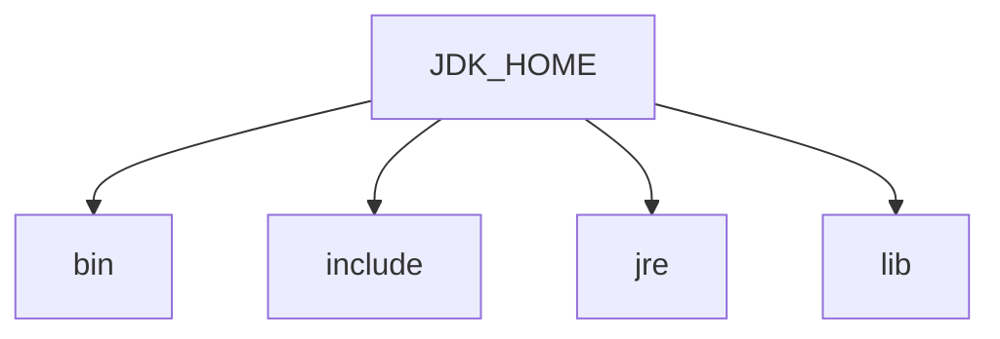
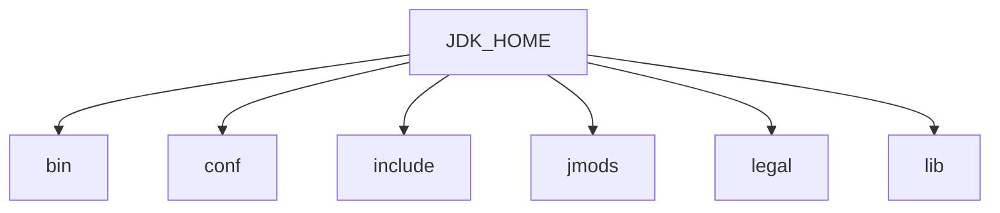

# JDK新特性

# JAVA9

## 概述

经过4次推迟，历经曲折的Java9最终在2017年9月21日发布。因为里面加入的模块化系统，在最初设想的时候并没有想过那么复杂，花费的时间超出预估时间。距离java8大约三年时间。
  	Java 9提供了超过150项新功能特性，包括备受期待的模块化系统、可交互的REPL工具: jshell, JDK编译工具，语法层面的改变：Java公共API和私有代码，以及安全增强、扩展提升、性能管理改善等。可以说Java 9是一个庞大的系统工程，完全做了一个整体改变。
  	 但是这个巨大改变的功劳，都给了java11了，**目前oracle对8,11都长期支持，9,10不支持了**，只能从历史版本（http://jdk.java.net/）中下载，Java 11 将会获得 Oracle 提供的长期支持服务，直至2026年9月。
  	从Java9这个版本开始，Java 的计划发布周期是6个月，下一个Java的主版本将于2018年3月发布，命名为Java18.3(java10)， 紧接着再过六个月将发布Java18.9(java11).
  	这意味着Java的更新**从传统的以特性驱动的发布周期，转变为以时间驱动的(6个月为周期)发布模式**（更快的时间周期,oracle的理念就是小步快跑，快速迭代，像IBM（DB2数据库，保守型内部测试才投入市场）），并逐步的将Oracle JDK原商业特性进行开源。针对企业客户的需求，Oracle将以三年为周期发布长期支持版本(long term support)

**重大改变**：

- 模块化系统
- JShell命令

**语法层面改变**:

- 接口私有方法
- 钻石操作符(泛型\<\>)使用升级
- 语法改进：try 语句

**API 层面变化**：

- String 存储结构变更，从 char 类型数组变为 byte 类型数组
- 集合特性： `of` 方法
- 增强的 `Stream API` (不断迭代)
- 全新的 HTTP 客户端 API，不仅支持 HTTP1.1 而且还支持 HTTP2。从 5 以前的 HttpUrlConnection 变为此安置的 HttpClient
- Deprecated 的 API

**其他变化**：

- Java Doc 的 HTML5 支持
- JS 引擎升级：Nashorn
- Java 的动态编译器
- 多版本兼容的 jar 包

 openJDK  可参考源码：

 http://openjdk.java.net/projects/jdk9/

 在线 OracleJDK Documentation 在线文档：

 https://docs.oracle.com/javase/9/

**JDK 和 JRE 的目录的改变**：

**Java8**：

**bin** 包含命令行开发和调试工具 如 javac jar  javadoc 

**include** 包含编译本地代码时使用的 c/c++ 头部文件

**lib** 包含JDK工具的几个 jar 和其他类型的文件,他有一个 tools.jar 文件,其中含 javac 编译器的 java 类

**jre/bin** 目录 包含基本指令,如 java 指令,在 windows 平台上,它包含系统的运行时动态链接

**jre/lib** 包含用户可编辑的配置文件,如 properties 和 .policy 文件,包含几个 jar 文件，rt.jar 文件包含运行时的java 类和资源文件



**Java9**：



**bin** 包含所有指令，在 windows 平台上，他继续包含系统的运行时动态链接

**conf** 目录 包含用户可编辑的配置文件，例如之前位于 jre/lib 目录中的 .properties 和 policy

**includes** 包含在以前编译本地代码时使用 c/c++ 头文件,他只存在于 JDK 中

**jmods**  包含JMOD 格式的平台模块,创建自定义运行时映像需要他,它只存在于 jdk 中

**legal** 法律声明

**lib** 包含非 windows 平台上的动态链接本地库,其子目录和文件不应由开发人员直接编译或使用

从 9 开始以后的 JDK 目录结构都是如此

## 语法层次

### 钻石操作符号语法升级

钻石操作符,就是我们泛型使用的符号 `<>` 

JAVA8 中,匿名内部类不能使用钻石操作符,如下代码在JAVA8 中是报错的,匿名内部类这里不支持泛型推断,重写的方法不明确泛型

```java
// JAVA8
Comparator<Integer> c = new Comparator<Integer>() {
    @Override
    public int compare(Integer o1, Integer o2) {
        return o1 - o2;
    }
}

// JAVA9
Comparator<Integer> c = new Comparator<>() {
    @Override
    public int compare(Integer o1, Integer o2) {
        return o1 - o2;
    }
}
```

而且在JAVA9中,匿名内部类**省略泛型**的语法不仅仅可以用于接口和抽象类,普通类也可以通过匿名内部类写法,在某个实例上完成对某个方法的重写。

```java
public class Demo1 {
    public static void main(String[] args) {
        // 这里可以省略泛型
        Person<String> person = new Person<>() {
            @Override
            public void eat(String s) {
                super.eat(s);
            }
        };
        person.eat("包子");

    }
}
class Person<T> {
    public void eat(T t) {
        System.out.println("Person eat");
    }
}
```

### try结构语法升级

普通的 `try catch finally` 语句  要释放的资源可以放到 `finally` 语句块中

```java
public static void main(String[] args) {
    InputStreamReader reader = null;
    try {
        reader = new InputStreamReader(System.in);
        int read = reader.read();
    } catch (Exception e) {
        throw new RuntimeException(e);
    } finally {
        // 这里可以释放资源
        if (reader != null) {
            try {
                reader.close();
            } catch (IOException e) {
                e.printStackTrace();
            }
        }
    }
}
```

JAVA 8中已经对try语法进行了升级,可以将要释放的资源放到try后面的小括号中,这样就不用通过finally语句块释放资源了,**但是要求执行后必须关闭的资源一定要放在try子句中进行初始化,否则编译不通过.** 下面的案例中,reader必须放在try后面的小括号中进行初始化：

```java
try (InputStreamReader reader = new InputStreamReader(System.in)) {
    int read = reader.read();
} catch (Exception e) {
    throw new RuntimeException(e);
}
```

JAVA 9 资源的关闭操作,我们可以在try子句中使用已经初始化的资源但是此时的资源必须 是final修饰的,final可以省略不写：

```java
InputStreamReader isr = new InputStreamReader(new FileInputStream("d:/aaa.txt"));
OutputStreamWriter isw = new OutputStreamWriter(new FileOutputStream("d:/aaa.txt"));
try (isr; isw) {
    isr.read();
} catch (Exception e) {
    e.printStackTrace();
}
```

### 下划线命名标识符使用限制

标识符命名组成：字母，数字，下划线，美元符

JAVA8 中,可以使用一个 `_` 作为标识符的命名：

```java
String _ = "Hello World";
```

JAVA9 中,就不可以使用一个_ 作为标识符的命名了,不通过编译,但是标识符中仍然可以使用_,必须配合其他内容：

```java
String p_name = "洛必达";
```

小细节,注意一下即可,一般也没人直接单独用一个 `_`  作为标识符的命名。

## API层次

### 接口中的私有方法

JAVA7 中,接口只能有抽象方法。

JAVA8 中,接口中 static (静态不可重写)和 default (可以重写)修饰的方法可以拥有方法体。

JAVA9 中,接口中可以使用 private 修饰方法,并拥有方法体,但是接口中的成员变量仍然不能用 private 修饰。

感觉: 接口中的代码越来越靠近抽象类,但是仍然是支持多继承的。

```java
// JAVA7 所有方法都是抽象方法
interface Interface7 {
    void m1();
}

// JAVA8 接口可以定义 static/default 方法
interface Interface8 {
    void m1();
    static void m2() {
        
    }
    
    default void m3() {
        
    }
}

// JAVA9 接口可以定义私有方法
interface Interface9 {
    void m1();
    static void m2() {
        
    }
    
    default void m3() {
        // 私有方法定义出来只能在默认方法中调用
        m4();
    }
    
    private void m4() {
        
    }
}
```

### String底层存储结构

JAVA8 中的 String 源码，String 类内部维护的是一个 final 修饰的私有 char 数组,说明 String 的底层是通过 char 数组存储字符串的。

```java
public final class String
    implements java.io.Serializable, Comparable<String>, CharSequence {
    /** The value is used for character storage. */
    private final char value[];
    // ...
}
```

JAVA9 中 String 的源码，String 类内部维护的是一个 final 修饰的私有 byte 数组,说明String 的底层是通过 byte 数组存储字符串的：

```java
public final class String
    implements java.io.Serializable, Comparable<String>, CharSequence {

    /**
     * The value is used for character storage.
     *
     * @implNote This field is trusted by the VM, and is a subject to
     * constant folding if String instance is constant. Overwriting this
     * field after construction will cause problems.
     *
     * Additionally, it is marked with {@link Stable} to trust the contents
     * of the array. No other facility in JDK provides this functionality (yet).
     * {@link Stable} is safe here, because value is never null.
     */
    @Stable
    private final byte[] value;
    // ...
}
```

这么做的原因:大多数 String 对象只包含 latin-1 字符。 这样的字符只需要一个字节的存储空间，因此这样的 String 对象的内部字符数组中有一半的空间没有使用 , 我们建议将String 类的内部表示形式从 UTF-16 字符数组更改为一个字节数组加上一个结束编码标志字段。

### Stream新增API

JAVA9 中，Stream 接口添加了 4 个新方法，*takeWhile*,*dropWhile*,*ofNullable*，还有一个 *iterate* 方法的新重载方法,可以通过一个 *Predicate* 来指定什么时候结束迭代：

```java
public static void testDropWhile() {
    List<Integer> list = Arrays.asList(2, 10, 1, 23, 4, 5, 7, 8, 56, 53, 23, 11, 10);
    // 从头开始删除满足条件的数据，直到第一个不满足条件的位置，并保留剩余元素
    list.stream().dropWhile(e -> e % 2 == 0).forEach(System.out::println);
}

public static void testTakeWhile() {
    List<Integer> list = Arrays.asList(1, 23, 4, 5, 7, 8, 56, 53, 23, 11, 10);
    // 从头开始取数据，直到遇到不符合要求的数据为止
    list.stream().takeWhile(e -> e % 2 == 1).forEach(System.out::println);
}

public static void testOfNullable() {
    Stream<Integer> stream = Stream.of(10, 20, 30);
    //        stream.forEach(System.out::println);
    // of元素只有一个，那么不允许为null
    //        Stream<Object> stream1 = Stream.of(null);
    // 如果只有一个null，那么返回一个empty stream
    // 如果不为null，那么返回只有一个元素的stream
    Stream<Integer> stream1 = Stream.ofNullable(null);
    stream1.forEach(System.out::println);
}

// 根据一个种子数，指定条件和迭代方式来获取流
public static void testIterator() {
    // JAVA8 generate
    Stream.generate(Math::random).limit(10).forEach(System.out::println);
    // JAVA8 iterate  0 2 4 ...
    Stream.iterate(0, t -> t + 2).limit(10).forEach(System.out::println);
    // JAVA9 重载 iterate
    Stream.iterate(0, t -> t < 10, t -> t + 1).forEach(System.out::println);
}

public static void testOptional() {
    List<Integer> list = Arrays.asList(1, 23, 4, 5, 7, 8, 56, 53, 23, 11, 10);
    // 通过stream获取optional
    Optional<Integer> optional = list.stream().max(Comparator.comparingInt(a -> a));
    System.out.println(optional.get());
    // optional转stream
    Stream<Integer> stream = optional.stream();
    stream.forEach(System.out::println);
    // optional直接获取
    Optional<List<Integer>> op1 = Optional.ofNullable(list);
    Stream<List<Integer>> stream1 = op1.stream();
    stream1.flatMap(x -> x.stream()).forEach(System.out::println);
}
```

除了 Stream 本身的扩展, Optional 和 Stream 之间的结合也得到了改进,现在可以通过Optional 的新方法将一个 Optional 对象转换为一个 Stream 对象(可能是空的)。

### transferTo方法

`InputStream` 新增 *transferTo* 方法,可以用来将数据直接传输到 `OutpuStream`,这是在处理原始数据时非常常见的一种方法：

```java
InputStream inputStream = new FileInputStream("d:/aaa.txt");
OutputStream outputStream = new FileOutputStream("d:/bbb.txt");
try (inputStream;outputStream) {
    inputStream.transferTo(outputStream);
} catch (IOException e) {
    e.printStackTrace();
}
```

### 只读集合创建

JAVA8 要创建一个只读,不可改变的集合,必须构造和分配他,然后添加元素,然后再包装成一个不可修的集合：

```java
List<String> list= new ArrayList<>();
list.add("Tom");
list.add("Jerry");
list.add("Mark");
list.add("Jhon");
list = Collections.unmodifiableList(list);
System.out.println(list);
```

放入数据后,然后要通过 *unmodifiableList* 才能让集合变为只读集合,不能表达为单个的表达式

JAVA9 通过集合工厂方法,创建一个只读集合,只要通过新增的 of 方法即可完成创建：

```java
List<String> list = List.of("TOM", "Jerry", "Mark", "Ben");
System.out.println(list);
```

上面是 List 接口的 *of* 方法, 同样的, Set 接口和 Map 接口下也新增了 of 方法,也是返回一个只读集合。

## 其他变化

### 模块化系统

 谈到Java9大家往往第一个想到的就是Jigsaw项目（后改名为Modularity）。众所周知，Java已经发展超过20年(95年最初发布)，Java和相关生态在不断丰富的同时也越来越暴露出一些问题:

1. Java运行环境的膨胀和臃肿。**每次JVM启动的时候，至少会有30~ 60MB的内存加载，主要原因是JVM需要加载rt.jar**,不管其中的类是否被classloader加载，第一步整个jar都会被JVM加载到内存当中去(而模块化可以根据模块的需要加载程序运行需要的class)

2. 当代码库越来越大，创建复杂，盘根错节的“意大利面条式代码”的几率呈指数级的增长。不同版本的类库交叉依赖导致让人头疼的问题，这些都阻碍了Java 开发和运行效率的提升。

3. 很难真正地对代码进行封装,而系统并没有对不同部分(也就是JAR文件)之间的依赖关系有个明确的概念。每一个公共类都可以被类路径之下任何其它的公共类所访问到，这样就会导致无意中使用了并不想被公开访问的API.

 本质上讲，模块化，就是在 package 外面包裹一层，说白了项目下有众多 模块 
  进行项目管理，管理各个模块，比如一个电商项目，下面有**支付模块**、**购物模块**...模块跟模块之间相互调用，这样代码就更安全，可以指定哪些暴露 哪些隐藏！

模块之间的可访问性是所使用的模块和使用模块之间的双向协议：模块明确地使其公共类型可供其他模块使用，而且使用这些公共类型的模块明确声明对第一个模块的依赖，模块中所有未导出的软件包都是模块的私有的，他们不能在模块之外使用.之前做不到，现在可以考虑这个事了。

在 JDK 9 中,项目模块之间的依赖。

新建两个模块，分别为 module1 和 module2，然后在每个 module 的 src 目录下编写 module-info 文件，每个模块随便写一些类，比如说 Person 类。

对于 module1，想要导出 Person 类，修改 moudle-info 文件：

```java
module module1 {
    // 向外导出pojo包
    exports org.codeArt.pojo;
}
```

对于 module2，想要导入 Person 类，修改 module-info 文件，使用 **requires** 关键字导入类：

```java
module module2 {
    requires module1;
}
```

假如发现报错，那么需要设置一下 IDEA：

project structure ⇨ modules ⇨ module2 ⇨ dependencies  ⇨ module lib ⇨ module1 ⇨ apply ⇨ ok

这时候就可以正常使用了。

### JShell

像 Python 和 Scala 之类的语言早就有交互式编程环境REPL (read -evaluate - print -loop)了，以交互式的方式对语句和表达式进行求值。开发者只需要输入一些代码，就可以在编译前获得对程序的反馈。而之前的Java 版本要想执行代码，必须创建文件、声明类、提供测试方法方可实现。

输入命令：

```shell
jshell
```

进入 java shell 模式。

将环境变量配置为java9，就可以在控制命令台使用jshell命令了：如果电脑上安装了其他版本的JDK,环境变量也是其他版本,大家可以在dos上通过cd 切换到指定版本的bin目录下,就可以使用该版本的jshell了。

简单输出语句：

```shell
jshell> System.out.println("Hello World")
```

定义变量：

```shell
jshell> int a = 100
```

定义方法和调用：

```shell
jshell> public int add(int a, int b) {
   ...>	    return a + b;
   ...> }
已创建 方法 add(int, int)
```

```shell
jshell> int c = add(10, 20);
n ==> 30
```

导包：

```shell
jshell> import java.util.Scanner
```

查看可用包：

```shell
jshell> /imports
```

`/` + tab 可以查看常用命令。

编辑代码：

```shell
jshell> /edit
```

列出已有代码：

```shell
jshell> /list
```

从内存保存到硬盘：

```shell
jshell> /open ~/Users/admin/Hello.java
```

退出 Shell：

```shell
jshell> /exit
```

# JAVA10

## 概述

2018年3月21日, Oracle官方宣布JAVA10正式发布

JAVA9和java10 都不是 LTS (Long-Term-Support)版本.和过去的JAVA大版本升级不同,这两个只有半年左右的开发和维护时间. 而JAVA11 也是就是18.9,才是JAVA之后的第一个长期支持版本

JAVA10 一共定义了109个新特性,其中包含JEP,对程序员来说,真正的新特性也就一个,还有一些新的API和JVM规范以及JAVA语言规范上的改动.

JAVA10 的12个JEP (JDK Enhancement Proposal特性加强协议) ,可参阅官方文档 http://openjdk.java.net/projects/jdk/10/。

286: 局部变量类型推断

296: JDK库合并

304: 统一的垃圾回收接口

307:为G1提供并行的Full GC

310:应用程序类数据共享

312: ThreadLocal握手交互

313: 移除JDK中附带的javah工具

314: 使用附加的Unicode语言标记拓展

316:能将对内存占用分配给用户指定的备用内存设备

317:使用基于JAVA的JIT编译器

319: 根证书

322:基于时间的发布版本

## 语法层次

### 局部变量类型推断

局部变量的显示类型声明,常常认为是不必须的,给一个好听的名字经常可以很清楚的表达出下面应该怎样继续.减少了啰嗦和形式的代码,避免了信息的冗余,而且对齐了变量名,容易阅读。

作为JAVA程序员,在声明一个变量时,我们一般都是书写两次变量类型,第一次用于声明变量类型,第二次用于构造器：

```java
ArrayList<String> list = new ArrayList<>();
```

变量的声明类型书写复杂且较长,尤其是加上泛型的使用：

```java
Iterator<Map.Entry<Integer, Student>> iterator = set.iterator();
```

局部变量推断有点类似 JavaScript 中的弱变量类型的写法,通过后面的数据来推断前面的数据类型,数据类型的声明统一为 var：

```java
public void test1() {
    // 局部变量,根据所赋的值,推断变量的类型
    var num = 10;
    var arrayList = new ArrayList<String>();
    // 遍历操作
    for (var i : arrayList) {
        System.out.println(i);
        System.out.println(i.getClass());
    }
    // 普通的遍历操作
    for (int i = 0; i<100; i++) {
        System.out.println(i);
    }
    // 推断类型的遍历操作
    for (var i = 0; i < 100; i++) {
        System.out.println(i);
    }
}
```

1. 变量的声明不能使用类型推断,因为无法推断：

```java
// 根据右边的数据推断类型,不赋值压根没给推断的机会,这是错的
var name;
```

2. 初始值为null：

```java
// null值无法推断数据类型,这是不能使用类型推断
var str = null;
```

3. lambda表达式：

```java
// 这是OK的
Supplier<Double> supplier = () -> Math.random();
// 这是不OK的 lambda表达式需要显式数据类型,不然无法明确是哪个接口
var supplier2 = () -> Math.random();
```

4. 方法引用：

```java
// 这是可以的进行方法引用的
Consumer<String> consumer = System.out::println;
// 这是不可以的,无法明确接口类型
var consumer2 = System.out::println;
```

5. 为数组静态初始化：

```java
// 动态初始化数据可以进行类型推断
var arr = new String[10];
// 静态初始化数组不可以使用类型推断 
var arr2 = {"asdf", "qwer", "zxcv", "tyui", "ghjk"};
```

6. 类型推断仅仅是局部变量,成员变量不可以使用类型推断：

```java
public class Test1 {
    // 成员变量不能使用类型推断
    var name = "小明";
    public void testMethod1() {
        // 局部变量可以使用类型推断
        var localname = "小明";
    }
}
```

7. 其他不可以推断的情况：

```java
// 情况1 没有初始化的局部变量声明
var s; 
var x = null;
// 情况2 方法的返回值类型
public var test1()
// 情况3 方法的参数类型
public void test2(var a, var b)
// 情况4 构造器的参数类型
public Person(var name, var age)
// 情况5 属性
class Person {
    var name;
}
// 情况6 catch块
try {
    
} catch(var e) {
    
}
```

以下两点需要注意：

1. var不是一个关键字

我们无需担心变量名或者方法名会与var发生冲突,因为var实际上不是一个关键字,而是一个类型名,只有在编译器需要知道类型的地方法才会用到它.除此之外,他就是一个普通的合法标识符.也就是说,除了不能用它做类名,其他都可以.但是又有哪个傻瓜非要用var做类名呢?

2. 这毕竟不是JavaScript

var并不会改变java是一门静态语言的事实,编译器负责推断出类型,并把结果写入字节码,也就是说,数据类型还是在字节码中的,java还是属于强类型的编程语言,开发人员没有明确写出来而已.而JavaScript是弱类型解释型的脚本语言,和这里的类型推断是两回事.

## API层次

### copyOf创建只读集合

```java
// JAVA9中新增创建只读的方法
var strings1 = List.of("MCA", "JAVA", "Golang");
// JAVA10中新增的创建只读集合的方法
var strings2 = List.copyOf(strings1);
// 判断两个集合在内存上是否是同一个,结果为true
System.out.println(strings1 == strings2);

// 创建一个普通集合
var strings3 = new ArrayList<String>();
// 通过copyOf方法创建一个只读集合
var strings4 = List.copyOf(strings3);
// 判断两个集合在内存上是否是同一个,结果为false
System.out.println(strings3 == strings4);
```

结论: *copyOf* 方法的作用通过一个集合返回的是一个只读集合,如果参数本来就是只读集合,那么返回的就是参数,如果参数不是只读集合,就再创造一个只读集合返回。