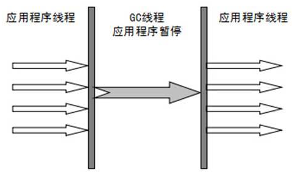
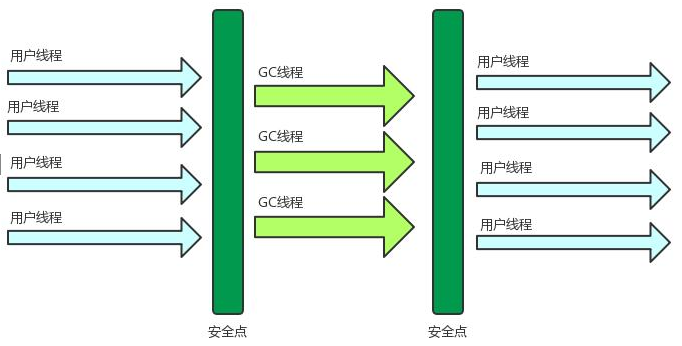
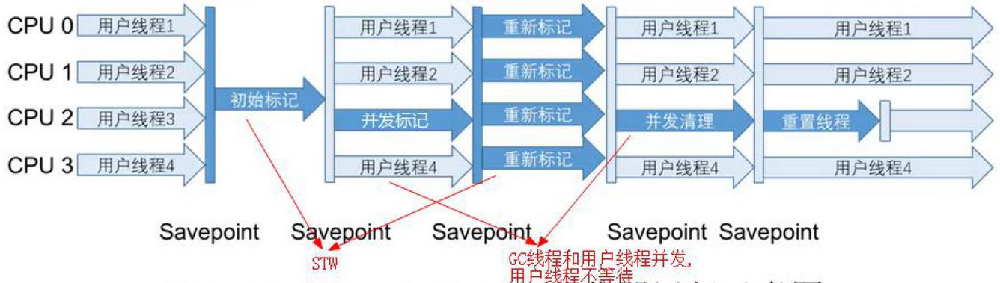
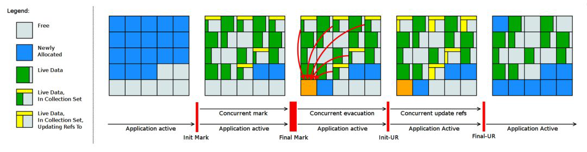
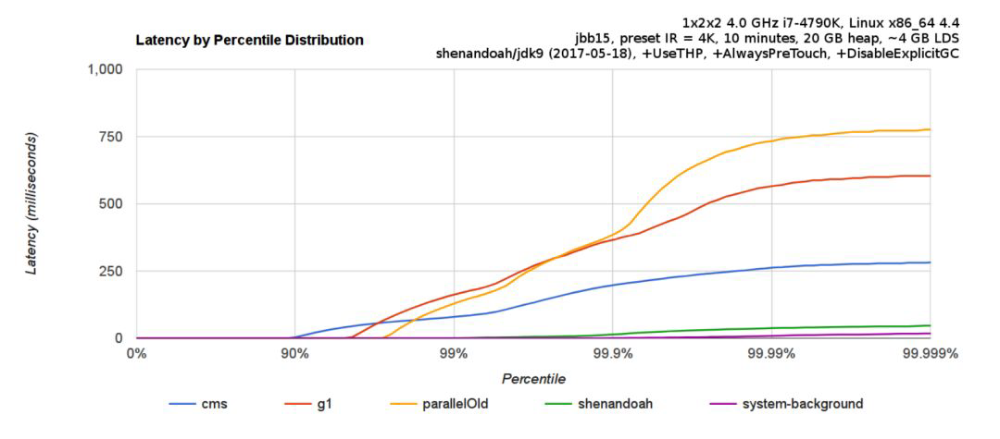

# JDK9+新特性2

# JAVA11

## 概述

2018年9月26日,Oracle官方发布JAVA11.这是JAVA大版本周期变化后的第一个长期支持版本,非常值得关注.最新发布的JAVA11将带来ZGC HttpClient等重要特性,一共17个需要我们关注的JEP,参考文档http://openjdk.java.net/projects/jdk/11/

181:基于嵌套的访问控制  

309:动态类文件常量  

315:改进Aarch64 Intrinsics  

318:Epsilon:一个无操作的垃圾收集器  

320:移除Java EE和CORBA模块  

321:HTTP客户端(标准)  

323:本地变量语法Lambda参数  

324:与Curve25519和Curve448的密钥一致  

327: Unicode 10  

328:飞行记录器  

329: ChaCha20和Poly1305密码算法  

330:启动单文件源代码程序  

331:低开销堆分析  

332: TLS (Transport Layer Security) 1.3  

333:ZGC:一个可伸缩的低延迟垃圾收集器  (实验)  

335:已弃用Nashorn JavaScript引擎  

336:已弃用Pack200工具和API  

## 语法层次

### 局部变量类型推断升级

局部变量类型推断是 java 10 开始新增的新特性, java 11 中对局部变量推断进行了升级,在使用 `var` 关键字时支持添加注解的语法格式,JAVA 10 中是无法实现的,在 JAVA 11 中加入了这样的语法。

lambda表达式中,注解修饰变量的时候,变量的数据类型必须要写,不能省略,像下面这种写法就是错误的：

```java
Consumer<String> con = (@Deprecated t) -> System.out.println(t.toLowerCase());
```

这个时候就必须要为小括号中的参数添加数据类型,应该这样写：

```java
// 这里必须要带上括号，虽然只有一个参数，使用注解不加括号直接报错
Consumer<String> con = (@Deprecated String t) -> System.out.println(t.toLowerCase());
```

java 11 中,lambda 表达式中的参数数据类型可以使用 var,但是不能不写：

```java
Consumer<String> con = (@Deprecated var t) -> System.out.println(t.toLowerCase());
```

## API层次

### 新增String处理方法

```java
// 判断字符串是否为空白
boolean b = " \t ".isBlank();  // true
// 去除字符串首尾空白
String s1 = " \n \t www.mashibin.com\n \t  ".strip();  // "www.mashibing.com"
// 去除字符串尾部空格
String s2 = "  \n \twww.mashibin.com\n \t  ".stripTrailing();  // " \n \twww.mashibing.com"
// 去除字符串首部空格
String s3 = "  \n \twww.mashibin.com\n \t  ".stripLeading();  // "www.mashibing.com\n \t "
// 复制字符串
String r = "mashibing".repeat(2);  // "mashibingmashibing"
// 行数统计
long c = "A\nB\nC\nD".lines().count();  // 4
```

### Optional新增方法

Optional 也增加了几个非常好用的方法,现在可以很方便的讲一个 Optional 转换成一个Stream,或者当一个空 Optional 时,给它一个替代的. 我们发现从 JDK8 开始出现 Stream 以后,每个版本都有相关的更新。

| 新增方法                                                     | 描述                                                         | 新增版本 |
| ------------------------------------------------------------ | ------------------------------------------------------------ | -------- |
| boolean isEmpty()                                            | 判断value是否为空                                            | JDK11    |
| T orElseThrow()                                              | value非空,返回value,否则抛出NoSuchElementExpception          | JDK10    |
| ifPresentOrElse(Consumer<? super T> action, Runnable emptyAction) | value非空,执行参数1功能,如果value为空,执行参数2功能          | JDK9     |
| Optional\<T\> or(Supplier<? extends Optional<? extends T> supplier) | value非空,返回对应的Optional,value为空,返回形参封装的Optional | JDK9     |
| Stream\<T\> stream();                                        | value非空,返回一个仅包含此value的Steam,否则,返回一个空的Stream | JDK9     |

```java
Optional<String> optional = Optional.empty();
// JDK8 判断value是否存在
System.out.println(optional.isPresent());
// JDK11 判断value是否为空
System.out.println(optional.isEmpty());

// JDK10 返回value,如果为null则直接抛出 NoSuchElementExpception
Optional<String> optional2 = Optional.of("element1");
String value = optional2.orElseThrow();
System.out.println(value);

// JDK9  value非空,执行参数1功能,如果value为空,执行参数2功能
Optional<String> optional3 = Optional.empty();// Optional.of("element1");
optional.ifPresentOrElse(v -> System.out.println("value为" + v), ()-> System.out.println("value为null"));

// JDK9 value非空,返回对应的Optional,value为空,返回形参封装的Optional
Optional<String> optional4 = Optional.empty();// Optional.of("element1");
Optional<String> optional5 = optional4.or(() -> Optional.of("element2"));
System.out.println(optional5);

// JDK9 value非空,返回一个仅包含此value的Steam,否则,返回一个空的Stream
Optional<String> optional6 = Optional.of("element3");  // Optional.empty();
Stream<String> stream = optional6.stream();
stream.forEach(System.out::println);
```

### HttpClient

JAVA 9 开始引入一个处理 HTTP 请求的 HttpClient API,该 API 支持同步和异步,而在JAVA11 中成为正式可用状态,可以在 java.net 包中找到这个 API,它将替代仅适用于 blocking 模式的 HttpUrlConnection (创建于 Http1.0 时代,并使用了协议无关的方法),并提供对WebSocket 和 HTTP2 的支持。

```java
// HttpClient 替换原有的HttpUrlConnection  同步方式
HttpClient client = HttpClient.newHttpClient();
HttpRequest request = HttpRequest.newBuilder(URI.create("http://127.0.0.1:8080/demo")).build();
HttpResponse.BodyHandler<String> handler = HttpResponse.BodyHandlers.ofString();
HttpResponse<String> response = client.send(request, handler);
String body = response.body();
System.out.println(body);

// HttpClient 替换原有的HttpUrlConnection  异步方式
HttpClient client = HttpClient.newHttpClient();
HttpRequest request = HttpRequest.newBuilder(URI.create("http://127.0.0.1:8080/demo")).build();
HttpResponse.BodyHandler<String> handler = HttpResponse.BodyHandlers.ofString();
CompletableFuture<HttpResponse<String>> sendAsync = client.sendAsync(request, handler);
sendAsync.thenApply(t -> t.body()).thenAccept(System.out::println);
```

## 其他

### 更简化的编译运行

JAVA11 提供了更简化的编译运行程序，在原来，编译一个java源代码文件语法应该是：

```shell
javac HelloWorld.java
```

解释执行一个 java 字节码文件的语法应该是：

```shell
java HelloWorld
```

在我们目前的知识里面,运行一个 java 源代码必须经过两个不中,一个是编译,一个是解释执行,而在 java 11 中,通过一个 java 命令就可以直接搞定了,语法是：

```shell
java HelloWorld.java
```

需要注意的是:

1. 源代码文件中如果有多个类,执行源文件中的第一个类中主方法,注意这里的第一个是代码顺序的第一个,**和是否由 public 修饰无关**

2. 不可以使用其他源文件中定中自定义的类,当前文件中自定义的类是可以使用的

### 废弃Nashorn

废弃 Nashorn JavaScript 引擎,在后续的版本中准备移除,需要的可以考虑 **GraalVM**。

### ZGC

GC 是 java 的主要优势之一(另一个是强大的 JVM),永远都是 java 优化的一个核心点. 然而,当 GC 的 **STW**(stop the world)太长,就会影响应用的响应时间. 消除或者减少 **GC** 的停顿时长,将会使 JAVA 对更广泛的引用场景成为一个更具有吸引力的平台. 此外,现代系统中可用内存不断正常,用户和程序员希望 JVM 能够以更高效的方式利用这些内存,并且无需长时间 STW. **ZGC  A Scalable Low-Latency Garbage Collector(Experimental)**.作为 JDK11 最瞩目的特征,但是后面带了 Experimental,说明是实验版本,也就不建议在生产环境中使用.ZGC 是一个并发,基于 region 的压缩性垃圾收集器,只有 root 扫描阶段会 STW,因此 GC 停顿时间不会随着堆的增长和存活对象的增长而变长.

**优势**：

* 暂停时间不会超过 10ms
* 既能处理几百兆的小堆,也能处理几个T的大堆(OMG)
* 和 G1 相比,应用吞吐能力不会下降超过 15%
* 为未来的 GC 功能和利用 colored 指针以及 Load Barriers 优化奠定基础
* 初始只支持 64 位系统

**设计目标**：

1. 支持 TB 级内存容量,暂停时间低(<10ms),对整个程序吞吐量的影响小于 15%

2. 将来还可以扩展实现机制,用以支持很多让人兴奋的功能. 如多层堆或者压缩堆

PS: 多层堆即对象置于 DRAM 和冷对象置于 NVMe 闪存。

### 仅作了解

* unicode10
* Deprecate The Pack200 Tools and API 
* 新的 Epsilon 垃圾收集器
* 完全支持 Linux 容器,包括 Docker
* 支持 G1 上的并行完全垃圾收集
* 最新的 HTTPS 安全协议 TLS 1.3 
* JAVA Flight Recoder

# JAVA12

## 概述

2019 年3 月 19 日,java12 正式发布了,总共有 8 个新的 JEP(JDK Enhancement Proposals)。

- 189:Shenandoah:A Low-Pause-Time Garbage Collector(Experimental) **低暂停时间的GC** http://openjdk.java.net/jeps/189
- 230:Microbenchmark Suite **微基准测试套件** http://openjdk.java.net/jeps/230
- 325:Switch Expressions(Preview) **switch表达式** http://openjdk.java.net/jeps/325
- 334:JVM Constants API **JVM常量API** http://openjdk.java.net/jeps/334
- 340:One AArch64 Port,Not Two **只保留一个AArch64实现** http://openjdk.java.net/jeps/340
- 341:Default CDS Archives **默认类数据共享归档文件** http://openjdk.java.net/jeps/341
- 344:Abortable Mixed Collections for G1 **可中止的G1 Mixed GC** http://openjdk.java.net/jeps/344
- 346:Promptly Return Unused Committed Memory from G1 **G1及时返回未使用的已分配内存** http://openjdk.java.net/jeps/346

## 语法

### switch表达式

传统的 `switch` 声明语句(switch statement)在使用中有一些问题：

1. 匹配自上而下,若无 break, 后面的 case 语句都会执行；	
2. 不同的 case 语句定义的变量名不能重复；
3. 不能在一个 case 里写多个执行结果一致的条件；
4. 整个 switch 不能作为表达式返回值；

Java 12 提供增强版的 switch 语句或称为 "switch 表达式"来写出更加简化的代码。

`switch` 表达式也是作为预览语言功能的第一个语言改动被引入新版 Java 中来的，这是一种引入新特性的测试版的方法。通过这种方式，能够根据用户反馈进行升级、更改.如果没有被很好的接纳，则可以完全删除该功能。预览功能的没有被包含在 Java SE 规范中。也就时说: 这不是一个正式的语法,是暂时进行测试的一种语法。

switch 详细语法：

扩展的 switch 语句，不仅可以作为语句（statement），还可以作为表达式（expression），并且两种写法都可以使用传统的 switch 语法，或者使用简化的 `case L ->` 模式匹配语法作用于不同范围并控制执行流。这些更改将简化日常编码工作，并为switch 中的模式匹配（JEP 305）做好准备。

* 使用 Java 12 中 switch 表达式的写法，省去了 break 语句，避免了因少写 break 而出错。

* 同时将多个 case 合并到一行，显得简洁、清晰也更加优雅的表达逻辑分支，其具体写法就是将之前的 case 语句表成了：`case L ->`，即如果条件匹配 case ，则执行标签右侧的代码 ，同时标签右侧的代码段只能是表达式、代码块或 throw 语句。

* 为了保持兼容性，case 条件语句中依然可以使用字符 : ，这时 **fall-through** 规则依然有效的，即不能省略原有的 break 语句，但是同一个 Switch 结构里不能混用 `->` 和 `:` ，否则会有编译错误。并且简化后的 switch 代码块中定义的局部变量，其作用域就限制在代码块中，而不是蔓延到整个 switch 结构，也不用根据不同的判断条件来给变量赋值。

JAVA 12 之前的 switch 语法：

```java
public class SwitchExpressionDemo {
    public static enum Month {
        JANUARY, FEBRUARY, MARCH, APRIL, MAY, JUNE, JULY, 
        AUGUST, SEPTEMBER, OCTOBER, NOVEMBER, DECEMBER;
    }
    public static void main(String[] args) {
        Month month = Month.APRIL;
        String season;
        switch (month) {
            case DECEMBER:
            case JANUARY:
            case FEBRUARY:
                season = "winter";
                break;
            case MARCH:
            case APRIL:
            case MAY:
                season = "spring";
                break;
            case JUNE:
            case JULY:
            case AUGUST:
                season = "summer";
                break;
            case SEPTEMBER:
            case OCTOBER:
            case NOVEMBER:
                season = "autumn";
                break;
            default:
                throw new RuntimeException("NoSuchMonthException");
        }
        // spring
        System.out.println(season);
    }
}
```

JAVA 12 之后的 switch 语法：

```java
public static void main(String[] args) {
    Month month = Month.APRIL;
    String season;
    switch (month) {
        case DECEMBER, JANUARY, FEBRUARY -> season = "winter";
        case MARCH, APRIL, MAY -> season = "spring";
        case JUNE, JULY, AUGUST -> season = "summer";
        case SEPTEMBER, OCTOBER, NOVEMBER -> season = "autumn";
        default -> throw new RuntimeException("NoSuchMonth");
    }
    System.out.println(season);
}
```

似乎可以看出,java 开发者或将逐渐的从复杂繁琐的底层抽象代码的编写中解放出来,编写一些更高层次更优雅的代码. 减少出错,提高开发效率. 目前 switch 表达式支持下面的数据类型：

- byte 
- char 
- short 
- int 
- Byte
- Character
- Short 
- Integer 
- enum
- String

未来是否会支持 float double 和 long? 目前本版本未对支持的数据类型进行拓展。

## API

### 数字压缩格式化

NumberFormat 添加了对以紧凑形式格式化数字的支持。紧凑数字格式是指以简短或人类可读形式表示的数字。例如，在en_US语言环境中，1000可以格式化为“1K”，1000000可以格式化为“1M”，具体取决于指定的样式 `NumberFormat.Style`。

```java
var cnf = NumberFormat.getCompactNumberInstance(Locale.CHINA, NumberFormat.Style.SHORT);
System.out.println(cnf.format(1_0000));
System.out.println(cnf.format(1_9200));
System.out.println(cnf.format(1_000_000));
System.out.println(cnf.format(1L << 30));
System.out.println(cnf.format(1L << 40));
System.out.println(cnf.format(1L << 50));
```

运行结果为：

```
1万
2万
100万
11亿
1万亿
1126万亿
```

注意：**这里的万亿等于古代的兆单位**。

### String新方法

**transform**方法

```java
public <R> R transform(Function<? super String, ? extends R> f)
```

它提供的函数作为输入提供给特定的 String 实例，并返回该函数返回的输出。

```java
String s = "baidu".transform(str -> "www." + str + ".com")
    			   .transform(String::toUpperCase);
System.out.println(s);  // WWW.BAIDU.COM
```

**indent**方法

```java
public String indent(int n)
```

该方法允许我们调整 String 实例的缩进。

```java
String word = "Java\nGolang\nMAC";
System.out.println(word.indent(4));
```

输出结果：

```
    Java
    Golang
    MAC
```

**换行符 \n 后向前缩进 n 个空格，为 0 或负数不缩进。**

**indent**方法源码：

```java
public String indent(int n) {
    if (isEmpty()) {
        return "";
    }
    Stream<String> stream = lines();
    if (n > 0) {
        final String spaces = " ".repeat(n);
        stream = stream.map(s -> spaces + s);
    } else if (n == Integer.MIN_VALUE) {
        stream = stream.map(s -> s.stripLeading());
    } else if (n < 0) {
        stream = stream.map(s -> s.substring(Math.min(-n, s.indexOfNonWhitespace())));
    }
    return stream.collect(Collectors.joining("\n", "", "\n"));
}
```

### Files新增mismatch方法

对比两个文件的差异,返回从哪个字节开始出现了不一致：

```java
FileWriter fileWriter = new FileWriter("d:/a.txt");
fileWriter.write("a");
fileWriter.write("b");
fileWriter.write("c");
fileWriter.close();
FileWriter fileWriterB = new FileWriter("d:/b.txt");
fileWriterB.write("a");
fileWriterB.write("1");
fileWriterB.write("c");
fileWriterB.close();
System.out.println(Files.mismatch(Path.of("d:/a.txt"), Path.of("d:/b.txt")));
```

## 关于GC新特性

### Shenandoah GC：低停顿时间

Shenandoah 垃圾回收器是 Red Hat 在 2014 年宣布进行的一项垃圾收集器研究项目 Pauseless GC 的实现，旨在针对 JVM 上的内存收回实现低停顿的需求。该设计将与应用程序线程并发，通过交换 CPU 并发周期和空间以改善停顿时间，使得垃圾回收器执行线程能够在 Java 线程运行时进行堆压缩，并且标记和整理能够同时进行，因此避免了在大多数 JVM 垃圾收集器中所遇到的问题。

据 Red Hat 研发 Shenandoah 团队对外宣称，Shenandoah 垃圾回收器的暂停时间与堆大小无关，这意味着无论将堆设置为 200 MB 还是 200 GB，都将拥有一致的系统暂停时间，不过实际使用性能将取决于实际工作堆的大小和工作负载。与其他 Pauseless GC 类似，Shenandoah GC 主要目标是 99.9% 的暂停小于 10ms，暂停与堆大小无关等。这是一个实验性功能，不包含在默认（Oracle）的OpenJDK版本中。

Stop-the-World ，简称STW ，指的是GC 事件发生过程中，停止所有的应用程序线程的执行。

​	**垃圾回收器的任务是识别和回收垃圾对象进行内存清理。垃圾回收要求系统进入一个停顿的状态。**停顿的目的是终止所有应用程序的执行，这样才不会有新的垃圾产生，同时保证了系统状态在某一个瞬间的一致性，并且有益于垃圾回收器更好地标记垃圾对象。**停顿产生时整个应用程序会被暂停，没有任何响应，有点像卡死的感觉，这个停顿称为STW 。**

如果 Stop-the-World 出现在新生代的 Minor GC 中时， 由于新生代的内存空间通常都比较小，所以暂停的时间较短,在可接受的范围内，老年代的 Full GC 中时，程序的工作线程被暂停的时间将会更久。内存空间越大，执行 Full GC 的时间就会越久，工作线程被暂停的时间也就会更长。**到目前为止，哪怕是 G1 也不能完全避免 Stop-the-world 情况发生，只能说垃圾回收器越来越优秀，尽可能地缩短了暂停时间。**

java 垃圾收集器的分类：常见的 **Serial(串行)，ParNEW(并行) ，Parallel(吞吐优先并行) CMS(低延迟) G1(区域化分代)**,不同的垃圾收集器都有自己的特征,简单进行一个分类。

**按线程数分类：**

1. 串行垃圾回收器

串行回收指的是在同一时间段内只允许一件事情发生，简单来说，当多个CPU 可用时，也只能有一个CPU用于执行垃圾回收操作，井且在执行垃圾回收时，程序中的工作线程将会被暂停，当垃圾收集工作完成后才会恢复之前被暂停的工作线程，这就是串行回收。



2. 并行垃圾回收器

和串行回收相反，并行收集可以运用多个CPU 同时执行垃圾回收，因此提升了应用的吞吐量，不过并行回收仍然与串行回收一样，采用独占式，使用了“ Stop-the-world ”机制和复制算法。



**按照工作模式分类：**

1. 并发式垃圾收集器

并发式垃圾回收器与应用程序线程交替工作，以尽可能减少应用程序的停顿时间。

2. 独占式垃圾收集器

独占式垃圾回收器(Stop the world)一旦运行，就停止应用程序中的其他所有线程，直到垃圾回收过程完全结束。



**按照碎片处理方式分类：**

1. 压缩式垃圾回收器

压缩式垃圾回收器会在回收完成后，对存活对象进行压缩整理，消除回收后的碎片。

2. 非压缩式垃圾回收器

非压缩式的垃圾回收器不进行这步操作。

**按照工作的内存区间分类：**

1. 年轻代垃圾回收器
2. 老年代垃圾回收器

**如何判断垃圾回收器的性能：**

* 吞吐量：程序的运行时间（程序的运行时间＋内存回收的时间）。
* 垃圾收集开销：吞吐量的补数，垃圾收集器所占时间与总时间的比例。
* 暂停时间：执行垃圾收集时，程序的工作线程被暂停的时间,就是用户功能延迟的时间。
* 收集频率：相对于应用程序的执行，收集操作发生的频率。
* 堆空间： Java 堆区所占的内存大小。
* 快速： 一个对象从诞生到被回收所经历的时间。

垃圾收集器中吞吐量和低延迟这两个目标本身是相互矛盾的，因为如果选择以吞吐量优先(单位时间希望运行更多的应用程序)，那么必然需要降低内存回收的执行频率，但是这样会导致GC 需要更长的暂停时间来执行内存回收。相反的，如果选择以低延迟优先为原则，那么为了降低每次执行内存回收时的暂停时间，也只能频繁地执行内存回收，但这又引起了年轻代内存的缩减和导致程序吞吐量的下降。

**Shenandoah 工作原理：**

从原理的角度，我们可以参考该项目官方的示意图，其内存结构与 G1 非常相似，都是将内存划分为类似棋盘的 region。整体流程与 G1 也是比较相似的，最大的区别在于实现了并发的 疏散(Evacuation) 环节，引入的 Brooks Forwarding Pointer 技术使得 GC 在移动对象时，对象引用仍然可以访问。

Shenandoah GC 工作周期如下所示：



1. Init Mark 启动并发标记阶段
2. 并发标记遍历堆阶段
3. 并发标记完成阶段
4. 并发整理回收无活动区域阶段
5. 并发 Evacuation 整理内存区域阶段
6. Init Update Refs 更新引用初始化 阶段
7. 并发更新引用阶段
8. Final Update Refs 完成引用更新阶段
9. 并发回收无引用区域阶段

了解 Shenandoah GC 的人比较少，提及比较多的是 Oracle 在 JDK11 中开源出来的 ZGC，或者商业版本的 Azul C4（Continuously Concurrent Compacting Collector）。也有人认为Shenandoah 其实际意义大于后两者,原因有一下几点：

1. 使用 ZGC 的最低门槛是升级到 JDK11，版本的更新不是一件容易的事情,而且 ZGC 实际表现如何也是尚不清楚。
2. C4 成本较高,很多企业甚至斤斤计较几百元的软件成本。
3. Shenandoah GC 可是有稳定的 JDK8u 版本发布的。甚至已经有公司在 HBase 等高实时性产品中有较多的实践。
4. ZGC也是面向 low-pause-time 的垃圾收集器，不过 ZGC 是基于 colored pointers来实现，而 Shenandoah GC 是基于 brooks pointers 来实现。

不是唯有 GC 停顿可能导致常规应用程序响应时间比较长。具有较长的 GC 停顿时间会导致系统响应慢的问题，但响应时间慢并非一定是 GC 停顿时间长导致的，队列延迟、网络延迟、其他依赖服务延迟和操作提供调度程序抖动等都可能导致响应变慢。使用 Shenandoah 时需要全面了解系统运行情况，综合分析系统响应时间。下面是jbb15benchmark 中，Shenandoah GC 相对于其他主流 GC 的表现。

各种 GC 工作负载对比：



GC 暂停相比于 CMS 等选择有数量级程度的提高，对于 GC 暂停非常敏感的场景，价值还是很明显的，能够在 SLA 层面有显著提高。当然，这种对于低延迟的保证，也是以消耗 CPU 等计算资源为代价的，实际吞吐量表现也不是非常明朗，需要看企业的实际场景需求，并不是一个一劳永逸的解决方案。

使用所有可用的内存分页，减少系统运行停顿，为避免运行时性能损失：

```shell
-XX:+AlwaysPreTouch
```

设置初始堆大小与最大值一致，可以减轻伸缩堆大小带来的压力，与 AlwaysPreTouch 参数配合使用，在启动时提交所有内存，避免在最终使用中出现系统停顿：

```shell
-Xmx == -Xmsv
```

能够大大提高大堆的性能，同时建议在 Linux 上使用时将
/sys/kernel/mm/transparent_hugepage/enabled 和
/sys/kernel/mm/transparent_hugepage/defragv 设置为：madvise，同时与 AlwaysPreTouch 一起使用时，init 和 shutdownv 速度会更快，因为它将使用更大的页面进行预处理：

```shell
-XX:+ UseTransparentHugePages
```

虽然 Shenandoah 尚未明确支持 NUMA（Non-Uniform Memory Access），但最好启用此功能以在多插槽主机上启用 NUMA 交错。与 AlwaysPreTouch 相结合，它提供了比默认配置更好的性能：

```shell
-XX:+UseNUMA
```

忽略代码中的 System.gc() 调用。当用户在代码中调用 System.gc() 时会强制
Shenandoah 执行 STW Full GC ，应禁用它以防止执行此操作：

```shell
-XX:+DisableExplicitGC
```

在 调用 System.gc() 时执行 CMS GC 而不是 Full GC，建议在有System.gc() 调用的情况下使用：

```shell
-XX:+ExplicitGCInvokesConcurrent
```

不过目前 Shenandoah 垃圾回收器还被标记为实验项目，如果要使用 Shenandoah GC 需要编译时 --with-jvmfeatures 选项带有shenandoahgc，然后启动时使用参数：

```shell
-XX:+UnlockExperimentalVMOptions -XX:+UseShenandoahGC
```

### 可中断的G1 Mixed GC

当 G1 垃圾回收器的回收超过暂停时间的目标，则能中止垃圾回收过程。

G1 是一个垃圾收集器，设计用于具有大量内存的多处理器机器。由于它提高了性能效率，G1 垃圾收集器最终将取代 CMS垃圾收集器。**该垃圾收集器设计的主要目标之一是满足用户设置的预期的 JVM 停顿时间。**

G1 采用一个高级分析引擎来选择在收集期间要处理的工作量，此选择过程的结果是一组称为 GC 回收集（collection set( CSet )）的区域。一旦收集器确定了 GC 回收集 并且 GC 回收、整理工作已经开始，这个过程是without stopping的，即 G1 收集器必须完成收集集合的所有区域中的所有活动对象之后才能停止；但是如果收集器选择过大的 GC 回收集，此时的STW时间会过长超出目标pause time。

这种情况在mixed collections时候比较明显。这个特性启动了一个机制，当选择了一个比较大的collection set，Java 12 中将把 GC 回收集（混合收集集合）拆分为mandatory（必需或强制）及optional两部分( 当完成 mandatory 的部分，如果还有剩余时间则会去处理optional部分)来将mixed collections从without stopping变为 abortable，以更好满足指定 pause time的目标。

* 其中必需处理的部分包括 G1 垃圾收集器不能递增处理的 GC 回收集的部分（如：年轻代），同时也可以包含老年代以提高处理效率。

* 将 GC 回收集拆分为必需和可选部分时，垃圾收集过程优先处理必需部分。同时，需要为可选 GC 回收集部分维
  护一些其他数据，这会产生轻微的 CPU 开销，但小于 1 ％的变化，同时在 G1 回收器处理 GC 回收集期间，本机内存使用率也可能会增加，使用上述情况只适用于包含可选 GC 回收部分的 GC 混合回收集合。

* 在 G1 垃圾回收器完成收集需要必需回收的部分之后，如果还有时间的话，便开始收集可选的部分。但是粗粒度的处理，可选部分的处理粒度取决于剩余的时间，一次只能处理可选部分的一个子集区域。在完成可选收集部分的收集后，G1 垃圾回收器可以根据剩余时间决定是否停止收集。如果在处理完必需处理的部分后，剩余时间不足，总时间花销接近预期时间，G1 垃圾回收器也可以中止可选部分的回收以达到满足预期停顿时间的目标。

### 增强G1

上面介绍了 Java 12 中增强了 G1 垃圾收集器关于混合收集集合的处理策略，这节主要介绍在 Java 12 中同时也对 G1垃圾回收器进行了改进，**使其能够在空闲时自动将 Java 堆内存返还给操作系统**，这也是 Java 12 中的另外一项重大改进。

目前 Java 11 版本中包含的 G1 垃圾收集器暂时无法及时将已提交的 Java 堆内存返回给操作系统。为什么呢？ G1 目前只有在full GC或者concurrent cycle（并发处理周期）的时候才会归还内存，由于这两个场景都是G1极力避免的，因此在大多数场景下可能不会及时归还 committed Java heap memory 给操作系统。除非有外部强制执行。

在使用云平台的容器环境中，这种不利之处特别明显。即使在虚拟机不活动，但如果仍然使用其分配的内存资源，哪怕是其中的一小部分，G1 回收器也仍将保留所有已分配的 Java 堆内存。而这将导致用户需要始终为所有资源付费，哪怕是实际并未用到，而云提供商也无法充分利用其硬件。如果在此期间虚拟机能够检测到 Java 堆内存的实际使用情况，并在利用空闲时间自动将 Java 堆内存返还，则两者都将受益。

为了尽可能的向操作系统返回空闲内存，**G1 垃圾收集器将在应用程序不活动期间定期生成或持续循环检查整体 Java堆使用情况，以便 G1 垃圾收集器能够更及时的将 Java 堆中不使用内存部分返还给操作系统。**对于长时间处于空闲状态的应用程序，此项改进将使 JVM 的内存利用率更加高效。而在用户控制下，可以可选地执行Full GC，以使返回的内存量最大化。

JDK12的这个特性新增了两个参数分别是 G1 PeriodicGCInterval 及 G1 PeriodicGCSystemLoadThreshold，设置为 0 的话，表示禁用。如果应用程序为非活动状态，在下面两种情况任何一个描述下，G1 回收器会触发定期垃圾收集：

* 自上次垃圾回收完成以来已超过 G1PeriodicGCInterval ( milliseconds )， 并且此时没有正在进行的垃圾回收任务。如果 G1PeriodicGCInterval 值为零表示禁用快速回收内存的定期垃圾收集。

* 应用所在主机系统上执行方法 getloadavg()，默认一分钟内系统返回的平均负载值低于G1PeriodicGCSystemLoadThreshold指定的阈值，则触发full GC或者concurrent GC( 如果开启G1PeriodicGCInvokesConcurrent )，GC之后Java heap size会被重写调整，然后多余的内存将会归还给操作系统。如果 G1PeriodicGCSystemLoadThreshold 值为零，则此条件不生效。

如果不满足上述条件中的任何一个，则取消当期的定期垃圾回收。等一个 G1PeriodicGCInterval 时间周期后，将重新考虑是否执行定期垃圾回收。

G1 定期垃圾收集的类型根据 G1PeriodicGCInvokesConcurrent 参数的值确定：如果设置值了，G1 垃圾回收器将继续上一个或者启动一个新并发周期；如果没有设置值，则 G1 回收器将执行一个Full GC。在每次一次 GC 回收末尾，

G1 回收器将调整当前的 Java 堆大小，此时便有可能会将未使用内存返还给操作系统。新的 Java 堆内存大小根据现有配置确定，具体包括下列配置：- XX:MinHeapFreeRatio、-XX:MaxHeapFreeRatio、-Xms、-Xmx。

默认情况下，G1 回收器在定期垃圾回收期间新启动或继续上一轮并发周期，将最大限度地减少应用程序的中断。**如果定期垃圾收集严重影响程序执行，则需要考虑整个系统 CPU 负载，或让用户禁用定期垃圾收集。**

## 其他

### JVM常量API

Java 12 中引入 JVM 常量 API，用来更容易地对关键类文件 (key class-file) 和运行时构件（artefact）的名义描述(nominal description) 进行建模，特别是对那些从常量池加载的常量，这是一项非常技术性的变化，能够以更简单、标准的方式处理可加载常量。

具体来说就是java.base模块新增了java.lang.constant包。包中定义了一系列基于值的符号引用（JVMS 5.1）类型，它们能够描述每种可加载常量。

引入了ConstantDesc接口( ClassDesc、MethodTypeDesc、MethodHandleDesc这几个接口直接继承了ConstantDesc 接口)以及 Constable 接口；ConstantDesc接口定义了resolveConstantDesc方法，Constable接口定义了describeConstable方法；String、Integer、Long、Float、Double均实现了这两个接口，而EnumDesc实现了ConstantDesc 接口。

符号引用以纯 nominal 形式描述可加载常量，与类加载或可访问性上下文区分开。有些类可以作为自己的符号引用（例如 String）。而对于可链接常量，另外定义了一系列符号引用类型，具体包括： ClassDesc (Class 的可加载常量标称描述符) ，MethodTypeDesc(方法类型常量标称描述符) ，MethodHandleDesc (方法句柄常量标称描述符) 和DynamicConstantDesc (动态常量标称描述符) ，它们包含描述这些常量的 nominal 信息。此 API 对于操作类和方法的工具很有帮助。

ConstantDesc 源码：

```java
public interface ConstantDesc {
	Object resolveConstantDesc(MethodHandles.Lookup lookup) throws ReflectiveOperationException;
}
```

Constable 接口源码：

```java
public interface Constable {
	Optional<? extends ConstantDesc> describeConstable();    
}
```

String 新增方法：

```java
@Override
public Optional<String> describeConstable() {
	return Optional.of(this);
}

@Override
public String resolveConstantDesc(MethodHandles.Lookup lookup) {
	return this;
}
```

```java
String name = "洛必达";
Optional<String> optional = name.describeConstable();
System.out.println(optional.get());
```

### 微基准测试套件

**什么是 JMH (java微基准测试)？**

JMH，即 Java Microbenchmark Harness，是专门用于代码微基准测试的工具套件。何谓 Micro Benchmark 呢？简单的来说就是基于方法层面的基准测试，精度可以达到微秒级。当你定位到热点方法，希望进一步优化方法性能的时候，就可以使用JMH对优化的结果进行量化的分析。

**应用场景：**

1. 想准确的知道某个方法需要执行多长时间，以及执行时间和输入之间的相关性
2. 对比接口不同实现在给定条件下的吞吐量；
3. 查看多少百分比的请求在多长时间内完成；

**JMH使用：**

要使用JMH，首先需要准备好 Maven 环境,

如果要在现有 Maven 项目中使用 JMH，只需要把生成出来的两个依赖以及shade插件拷贝到项目的 pom 中即可：

```xml
<dependency>
	<groupId>org.openjdk.jmh</groupId>
	<artifactId>jmh-core</artifactId>
	<version>0.7.1</version>
</dependency>

<dependency>
	<groupId>org.openjdk.jmh</groupId>
	<artifactId>jmh-generator-annprocess</artifactId>
	<version>0.7.1</version>
	<scope>provided</scope>
</dependency>

<plugin>
	<groupId>org.apache.maven.plugins</groupId>
	<artifactId>maven-shade-plugin</artifactId>
	<version>2.0</version>
	<executions>
		<execution>
			<phase>package</phase>
			<goals>
				<goal>shade</goal>
			</goals>
			<configuration>
				<finalName>microbenchmarks</finalName>
				<transformers>
   					 <transformer implementation="org.apache.maven.plugins.shade.resource.ManifestResourceTransformer">
						<mainClass>org.openjdk.jmh.Main</mainClass>
					</transformer>
				</transformers>
			</configuration>
		</execution>
	</executions>
</plugin>
```

**新特性说明：**

Java 12 中添加一套新的基本的微基准测试套件（microbenchmarks suite），此功能为JDK源代码添加了一套微基准测试（大约100个），**简化了现有微基准测试的运行和新基准测试的创建过程**.使开发人员可以轻松运行现有的微基准测试并创建新的基准测试，其目标在于提供一个稳定且优化过的基准。 它基于Java Microbenchmark Harness（JMH），可以轻松测试JDK性能，支持JMH更新。

**微基准套件与 JDK 源代码位于同一个目录中，并且在构建后将生成单个 jar 文件**。但它是一个单独的项目，在支持构建期间不会执行，以方便开发人员和其他对构建微基准套件不感兴趣的人在构建时花费比较少的构建时间。

要构建微基准套件，用户需要运行命令：

```shell
make build-microbenchmark
```

 类似的命令还有：

```shell
make test TEST="micro:java.lang.invoke
```

将使用默认设置运行 java.lang.invoke 相关的微基准测试。

### 只保留一个AArch64实现

当前 Java 11 及之前版本JDK中存在两个 64 位 ARM 端口。这些文件的主要来源位于src/hotspot/cpu/arm 和 open/src/hotspot/cpu/aarch64 目录中。尽管两个端口都产生了aarch64 实现，我们将前者（由Oracle贡献）称为arm64 ，将后者称为aarch64 。

Java 12 中将删除由 Oracle 提供的 arm64端口相关的所有源码，即删除目录 open/src/hotspot/cpu/arm 中关于64-bit 的这套实现，只保留其中有关 32-bit ARM端口的实现，余下目录的 open/src/hotspot/cpu/aarch64 代码部分就成了 AArch64 的默认实现。

这将使开发贡献者将他们的精力集中在单个 64 位 ARM 实现上，并消除维护两套实现所需的重复工作。

### 默认生成类的数据共享(CDS)归档文件

我们知道在同一个物理机／虚拟机上启动多个JVM时，如果每个虚拟机都单独装载自己需要的所有类，启动成本和内存占用是比较高的。所以Java团队引入了**类数据共享机制** (Class Data Sharing ，简称 CDS) 的概念，通过把一些核心类在每个 JVM 间共享，每个JVM只需要装载自己的应用类即可。好处是：启动时间减少了，另外核心类是共享的，所
以JVM的内存占用也减少了。

1. JDK5引入了Class-Data Sharing可以用于多个JVM共享class，提升启动速度，最早只支持system classes及serial GC。
2. JDK9对其进行扩展以支持application classes(自定义class)及其他GC算法。
3. java10的新特性JEP 310: Application Class-Data Sharing扩展了JDK5引入的Class-Data Sharing，支持application的Class-Data Sharing并开源出来(以前是commercial feature)CDS 只能作用于 BootClassLoader 加载的类，不能作用于 AppClassLoader 或者自定义的 ClassLoader加载的类。在 Java 10 中，则将 CDS 扩展为 AppCDS，顾名思义，AppCDS 不止能够作用于BootClassLoader了，AppClassLoader 和自定义的 ClassLoader 也都能够起作用，大大加大了 CDS 的适用范围。也就说开发自定义的类也可以装载给多个JVM共享了。
4. JDK11将-Xshare:off改为默认-Xshare:auto，以更加方便使用CDS特性

可以说，自 Java 8 以来，在基本 CDS 功能上进行了许多增强、改进，启用 CDS 后应用的启动时间和内存占用量显着减少。使用 Java 11 早期版本在 64 位 Linux 平台上运行HelloWorld 进行测试，测试结果显示启动时间缩短有 32％，同时在其他 64 位平台上，也有类似或更高的启动性能提升。

JDK 12之前，想要利用CDS的用户，即使仅使用JDK中提供的默认类列表，也必须java -Xshare:dump 作为额外的步骤来运行。

Java 12 针对 64 位平台下的 JDK 构建过程进行了增强改进，使其默认生成类数据共享（CDS）归档，以进一步达到
改进应用程序的启动时间的目的，同时也避免了需要手动运行：java -Xshare:dump 的需要，修改后的 JDK 将在 ${JAVA_HOME}/lib/server 目录中生成一份名为classes.jsa的默认archive文件(大概有18M)方便大家使用。

当然如果需要，也可以添加其他 GC 参数，来调整堆大小等，以获得更优的内存分布情况，同时用户也可以像之前一样创建自定义的 CDS 存档文件。

### 支持Unicode11

JDK 12版本包括对Unicode 11.0.0的支持。在发布支持Unicode 10.0.0的JDK 11之后，Unicode 11.0.0引入了以下JDK 12中包含的新功能： 684 new characters,   11 new blocks.  7 new scripts.
其中：

684 个新字符，包含以下重要内容：

* 66个表情符号字符（66 emoji characters）

* Copyleft符号（Copyleft symbol）

* 评级系统的半星（Half stars for rating systems）

* 额外的占星符号（Additional astrological symbols）

* 象棋中国象棋符号（Xiangqi Chinese chess symbols）

7 个新脚本：

* Hanifi Rohingya
* Old Sogdian
* Sogdian
* Dogra
* Gunjala Gondi
* Makasar
* Medefaidrin

11 个新块，包括上面列出的新脚本的 7 个块和以下现有脚本的 4 个块：

* 格鲁吉亚扩展（Georgian Extended）
* 玛雅数字（Mayan Numerals）
* 印度Siyaq数字（Indic Siyaq Numbers）
* 国际象棋符号（Chess Symbols）

### 其他新增

* Collectors新增teeing方法用于聚合两个downstream的结果
* CompletionStage新增exceptionallyAsync、exceptionallyComposeAsync方法，允许方法体在异步线程执
  行，同时新增了exceptionallyCompose方法支持在exceptionally的时候构建新的CompletionStage。
* ZGC: Concurrent Class Unloading
  * ZGC在JDK11的时候还不支持class unloading，JDK12对ZGC支持了Concurrent Class Unloading，默认是开启，使用-XX:-ClassUnloading可以禁用

* 新增-XX:+ExtensiveErrorReports
  * -XX:+ExtensiveErrorReports可以用于在jvm crash的时候收集更多的报告信息到hs_err.log文件中，
    product builds中默认是关闭的，要开启的话，需要自己添加-XX:+ExtensiveErrorReports参数

* 新增安全相关的改进
  * 支持 java.security.manager 系统属性，当设置为 disallow 的时候，则不使用 SecurityManager 以提升性能，如果此时调用 System.setSecurityManager 则会抛出 UnsupportedOperationExceptionkeytool新增 `-groupname` 选项允许在生成key pair的时候指定一个named group新增PKCS12 KeyStore配置属性用于自定义PKCS12 keystores的生成 Java Flight Recorder 新增了 security-related 的 event 支持 ChaCha20 andPoly1305 TLS Cipher Suites

### 移除项

移除 com.sun.awt.SecurityWarnin；

移除 FileInputStream、FileOutputStream、- Java.util.ZipFile/Inflator/Deflator 的 *finalize*方法；

移除 GTE CyberTrust Global Root；

移除 javac的-source, -target对6及1.6的支持，同时移除--release选项；

### 废弃项

废弃的 API 列表见 deprecated-list

废弃 `-XX:+/-MonitorInUseLists` 选项

废弃 Default Keytool 的 -keyalg 值

