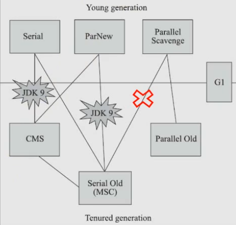

# JDK9+新特性3

# JAVA13

## 概述

- 350:Dynamic CDS Archives 动态CDS档案
- 351:ZGC: Uncommit Unused Memory ZGC:取消使用未使用的内存
- 353:Reimplement the Legacy Socket API 重新实现旧版套接字API
- 354:Switch Expressions (Preview) switch表达式（预览）
- 355:Text Blocks (Preview) 文本块

## 语法

### switch表达式(预览)

在 JDK 12 中引入了 switch 表达式作为预览特性。JDK 13 提出了第二个 switch 表达式预览。JEP 354修改了这个特性，它引入了**yield语句，用于返回值**。这意味着switch 表达式(返回值)应该使用yield, switch语句(不返回值)应该使用 break。
在 JDK 12中有一个，但是要进行一个更改：要从 switch 表达式中生成一个值 break，要删除 with value 语句以支持 `yield` 声明。目的是扩展，switch 以便它可以用作语句或表达式，因此两个表单既可以使用 `case ... :` 带有连贯符号的传统标签，也可以使用新 `case … ->` 标签，而不需要通过，还有一个新的语句用于从 switch 表达式中产生值。这些更改将简化编码并为模式匹配做好准备。

在以前，我们想要在switch中返回内容，还是比较麻烦的，一般语法如下：

```java
String x = "3";
int i;
switch (x) {
	case "1":
		i=1;
		break;
	case "2":
		i=2;
		break;
	default:
		i = x.length();
		break;
}
System.out.println(i);
```

JDK 13 中使用以下语法：

```java
String x = "3";
int i = switch (x) {
	case "1" -> 1;
	case "2" -> 2;
	default -> {
		yield 3;
	}
};
System.out.println(i);

// or
String x = "3";
int i = switch (x) {
	case "1":
		yield 1;
	case "2":
		yield 2;
	default:
		yield 3;
};
System.out.println(i);
```

在这之后，switch中就多了一个关键字用于跳出 switch 块了，那就是 yield，他用于返回一个值。和 return 的区别在于：**return 会直接跳出当前循环或者方法，而yield 只会跳出当前 switch 块。**

### 文本块(预览)

在 JDK 12 中引入了 Raw String Literals 特性，但在发布之前就放弃了。这个 JEP与引入多行字符串文字（text block）在意义上是类似的。

这条新特性跟 Kotlin 里的文本块是类似的。

在 Java 中，通常需要使用 String 类型表达 HTML，XML，SQL 或 JSON 等格式的字符串，在进行字符串赋值时需要进行转义和连接操作，然后才能编译该代码，这种表达方式难以阅读并且难以维护。**文本块就是指多行字符串，例如一段格式化后的xml、json 等。而有了文本块以后，用户不需要转义，Java 能自动搞定。因此，文本块将提高 Java 程序的可读性和可写性。**

简化跨越多行的字符串，避免对换行等特殊字符进行转义，简化编写 Java 程序。增强 Java 程序中字符串的可读性。

定义一段 HTML 代码，放入 String 中，显示如下：

```java
String words =
    "<html>\n" +
	"\t<body>\n" +
	"\t\t<a href=\"http://www.baidu.com\">百度</a>\n" +
	"\t</body>\n" +
	"</html>";
```

JAVA 13 支持文本块语法，自动将空格换行缩进和特殊符号进行了转义：

```java
String words = """
    <html>
        <body>
            <a href="http://www.baidu.com">百度</a>
        </body>
    </html>""";
```

使用 `"""` 作为文本块的开始符和结束符，在其中就可以放置多行的字符串，不需要进行任何转义。看起来就十分清爽了。

如常见的SQL语句：

```java
String newQuery = """
    select empno,ename,sal,deptno
    from emp
    where deptno in (40,50,60)
    order by deptno asc
""";
```

**语法细节 1：**

* 文本块是Java语言中的一种新文字。它可以用来表示任何字符串，并且提供更大的表现力和更少的复杂性。
* 文本块由零个或多个字符组成，由开始和结束分隔符括起来。
  * 开始分隔符是由三个双引号字符（`"""`），后面可以跟零个或多个空格，最终以行终止符结束。文本块内容以开始分隔符的行终止符后的第一个字符开始。
  * 结束分隔符也是由三个双引号字符（`"""`）表示，文本块内容以结束分隔符的第一个双引号之前的最后一个字符结束。
* 文本块中的内容可以直接使用"，"但不是必需的。
* 文本块中的内容可以直接包括行终止符。允许在文本块中使用 \n，但不是必需的。例如，文本块：

```java
"""
line1
line2
line3
"""
```

相当于：

```java
"line1\nline2\nline3\n"
```

文本块可以表示空字符串，但不建议这样做，因为它需要两行源代码：

```java
String empty = """
""";
```

以下是错误格式的文本块：

```java
String a = """"""; // 开始分隔符后没有行终止符
String b = """ """; // 开始分隔符后没有行终止符
// 没有结束分隔符
String c = """
			"; 
// 含有未转义的反斜线（请参阅下面的转义处理）
String d = """
abc \ def
"""; 
```

在运行时，文本块将被实例化为 String 的实例，就像字符串一样。从文本块派生的 String 实例与从字符串派生的实例是无法区分的。具有相同内容的两个文本块将引用相同的 String 实例，就像字符串一样。

**语法细节 2：**

下面这段代码中，我们用.来表示我们代码中的的空格，而这些位置的空格就是多余的：

```java
String html = """
..............<html>
.............. <body>
.............. <p>Hello, world</p>
.............. </body>
..............</html>
..............""";
```

多余的空格还会出现在每一行的结尾，特别是当你从其他地方复制过来时，更容易出现这种情况，比如下面的代码：

```java
String html = """
..............<html>...
.............. <body>
.............. <p>Hello, world</p>....
.............. </body>.
..............</html>...
..............""";
```

每行文字后面的空格,编译器会自动帮助我们去掉,但是开头部分的空格和结束的 `"""`; 前面的空格数有关, `""";` 前面有几个空格,编译器就会自动帮助我们去掉每一行前面的几个空格。

**语法细节 3：**

允许开发人员使用 `\n`，`\f` 和 `\r` 来进行字符串的垂直格式化，使用 `\b` 和 `\t` 进行水平格式化。比如下面的代码是合法的：

```java
String html = """
		<html>\n
			<body>\n
				<p>Hello, world</p>\n
			</body>\n
		</html>\n
""";
```

请注意，在文本块内自由使用 `"` 是合法的。例如：

```java
String story = """
"When I use a word," Humpty Dumpty said,
in rather a scornful tone, "it means just what I
choose it to mean - neither more nor less."
"The question is," said Alice, "whether you
can make words mean so many different things."
"The question is," said Humpty Dumpty,
"which is to be master - that's all."
""";
```

但是，三个 `"` 字符的序列需要进行转义至少一个 `"` 以避免模仿结束分隔符：

```java
String code =
"""
String text = \"""
A text block inside a text block
\""";
""";
```

**语法细节 4：**

可以在任何可以使用字符串的地方使用文本块。例如，文本块和字符串可以相互连接：

```java
String code = "public void print(Object o) {" +
	"""
		System.out.println(Objects.toString(o));
	}
	""";
```

但是，涉及文本块的连接可能变得相当笨重。以下面文本块为基础：

```java
String code = """
	public void print(Object o) {
		System.out.println(Objects.toString(o));
	}
""";
```

假设我们想把上面的 Object 改为来自某一变量，我们可能会这么写：

```java
String code = """
		public void print(""" + type + """
		o) {
			System.out.println(Objects.toString(o));
		}
		""";
```

可以发现这种写法可读性是非常差的，更简洁的替代方法是使用 `String::replace` 或 `String::format`，比如：

```java
String code = """
		public void print($type o) {
			System.out.println(Objects.toString(o));
		}
		""".replace("$type", type);
// or
String code = String.format("""
		public void print(%s o) {
			System.out.println(Objects.toString(o));
		}
		""", type);
```

另一个方法是使用 `String::formatted`，这是一个新方法，比如：

```java
String source = """
		public void print(%s object) {
			System.out.println(Objects.toString(object));
		}
		""".formatted(type);
```

## API

### 重新实现旧版套接字API

重新实现了古老的 Socket 接口。现在已有的 java.net.Socket 和 java.net.ServerSocket 以及它们的实现类，都可以回溯到 JDK 1.0 时代了。

* 它们的实现是混合了 Java 和 C 的代码的，维护和调试都很痛苦。
* 实现类还使用了线程栈作为 I/O 的缓冲，导致在某些情况下还需要增加线程栈的大小。
* 支持异步关闭，此操作是通过使用一个本地的数据结构来实现的，这种方式这些年也带来了潜在的不稳定性和跨平台移植问题。该实现还存在几个并发问题，需要彻底解决。

在未来的网络世界，要快速响应，不能阻塞本地方法线程，当前的实现不适合使用了。

全新实现的 NioSocketImpl 来替换 JDK1.0 的 PlainSocketImpl。此实现与 NIO 实现共享相同的内部基础结构,并且与现有的缓冲区高速缓存机制集成在一起,因此不需要使用线程堆栈.除此之外,他还有一些其他更改,例如使用 java.lang.ref.Cleaner 机制关闭套接字,实现在尚未关闭的套接字上进行了垃圾收集,以及在轮询时套接字出于非阻塞模式时处理超时操作等方法：

* 它便于维护和调试，与 NewI/O (NIO) 使用相同的 JDK 内部结构，因此不需要使用系统本地代码。
* 它与现有的缓冲区缓存机制集成在一起，这样就不需要为 I/O 使用线程栈。
* 它使用 java.util.concurrent 锁，而不是 synchronized 同步方法，增强了并发能力。
* 新的实现是 Java 13 中的默认实现，但是旧的实现还没有删除，可以通过设置系统属性 jdk.net.usePlainSocketImpl 来切换到旧版本。

运行一个实例化 Socket 和 ServerSocket 的类将显示这个调试输出。这是默认的(新的)。

```java
public abstract class SocketImpl implements SocketOptions {
    private static final boolean USE_PLAINSOCKETIMPL = usePlainSocketImpl();

    private static boolean usePlainSocketImpl() {
        PrivilegedAction<String> pa = () -> NetProperties.get("jdk.net.usePlainSocketImpl");
        String s = AccessController.doPrivileged(pa);
        return (s != null) && !s.equalsIgnoreCase("false");
    }
}
```

SocketImpl 的 `USE_PLAINSOCKETIMPL` 取决于 *usePlainSocketImpl* 方法，而它会从NetProperties 读取 jdk.net.usePlainSocketImpl 配置，如果不为 null 且不为 false，则usePlainSocketImpl方法返回 true；createPlatformSocketImpl 会根据 `USE_PLAINSOCKETIMPL` 来创建 PlainSocketImpl 或者 NioSocketImpl。

## 其他变化

### ZGC取消未使用的内存

**G1 和 Shenandoah：**

JVM的GC释放的内存会还给操作系统吗？GC后的内存如何处置，其实是取决于不同的垃圾回收器。因为把内存还给OS，意味着要调整JVM的堆大小，这个过程是比较耗费资源的。

* Java12的346: Promptly Return Unused Committed Memory from G1新增了两个参数分别是 G1PeriodicGCInterval 及 G1PeriodicGCSystemLoadThreshold 用于 GC 之后重新调整 Java heap size，然后将多余的内存归还给操作系统

* Java12的189: Shenandoah: A Low-Pause-Time Garbage Collector (Experimental)拥有参数 `-XX:ShenandoahUncommitDelay=` 来指定 ZPage 的 page cache 的失效时间，然后归还内存

HotSpot的G1和Shenandoah这两个GC已经提供了这种能力，并且对某些用户来说，非常有用。因此，Java13则给ZGC新增归还unused heap memory给操作系统的特性。

**ZGC的使用背景：**

在JDK 11中，Java 引入了 ZGC，这是一款可伸缩的低延迟垃圾收集器，但是当时只是实验性的。号称不管你开了多大的堆内存，它都能保证在 10 毫秒内释放 JVM ，不让它停顿在那。但是，当时的设计是它不能把内存归还给操作系统。对于比较关心内存占用的应用来说，肯定希望进程不要占用过多的内存空间了，所以这次增加了这个特性。

在 Java 13 中，JEP 351再次对 ZGC 做了增强，将没有使用的堆内存归还给操作系统。ZGC 当前不能把内存归还给操作系统，即使是那些很久都没有使用的内存，也只进不出。这种行为并不是对任何应用和环境都是友好的，尤其是那些内存占用敏感的服务，例如：

1. 按需付费使用的容器环境；
2. 应用程序可能长时间闲置，并且和很多其他应用共享和竞争资源的环境；
3. 应用程序在执行期间有非常不同的堆空间需求，例如，可能在启动的时候所需的堆比稳定运行的时候需要更多
   的堆内存。

**使用细节：**

ZGC的堆由若干个Region组成，每个Region被称之为ZPage。每个Zpage与数量可变的已提交内存相关联。当ZGC压缩堆的时候，ZPage就会释放，然后进入page cache，即ZPageCache。这些在page cache中的ZPage集合就表示没有使用部分的堆，这部分内存应该被归还给操作系统。回收内存可以简单的通过从page cache中逐出若干个选好的 ZPage 来实现，由于page cache是以LRU（Least recently used，最近最少使用）顺序保存ZPage的，并且按照尺寸（小，中，大）进行隔离，因此逐出 ZPage 机制和回收内存相对简单了很多，主要挑战是设计关于何时从 page cache 中逐出 ZPage 的策略。

一个简单的策略就是设定一个超时或者延迟值，表示ZPage被驱逐前，能在page cache中驻留多长时间。这个超时时间会有一个合理的默认值，也可以通过JVM参数覆盖它。Shenandoah GC用了一个类型的策略，默认超时时间是5分钟，可以通过参数-XX:ShenandoahUncommitDelay = milliseconds覆盖默认值。

像上面这样的策略可能会运作得相当好。但是，用户还可以设想更复杂的策略：不需要添加任何新的命令行选项。例如，基于GC频率或某些其他数据找到合适超时值的启发式算法。JDK13将使用哪种具体策略目前尚未确定。可能最初只提供一个简单的超时策略，使用-XX:ZUncommitDelay = seconds选项，以后的版本会添加更复杂、更智能的策略（如果可以的话）。

uncommit 能力默认是开启的，但是无论指定何种策略，ZGC 都不能把堆内存降到低于Xms。这就意味着，如果 Xmx和 Xms 相等的话，这个能力就失效了。-XX:-ZUncommit 这个参数也能让这个内存管理能力失效。

### 动态CDS档案(动态类数据共享归档)

**在JAVA应用程序在程序执行结束时动态归档类. 归档的类将包括默认基层CDS归档中不存在的所有已加载应用程序类和类库。**

CDS，是java 12的特性了，可以让不同 Java 进程之间共享一份类元数据，减少内存占用，它还能加快应用的启动速度。**而JDK13的这个特性支持在Java application执行之后进行动态archive。**存档类将包括默认的基础层CDS存档中不存在的所有已加载的应用程序和库类。也就是说，在Java 13中再使用AppCDS的时候，就不再需要这么复杂了。该提案处于目标阶段，旨在提高AppCDS的可用性，并消除用户进行运行时创建每个应用程序的类列表的需要。

```shell
# JVM退出时动态创建共享归档文件：导出jsa
java -XX:ArchiveClassesAtExit=hello.jsa -cp hello.jar Hello
# 用动态创建的共享归档文件运行应用:使用jsa
java -XX:SharedArchiveFile=hello.jsa -cp hello.jar Hello
```

JAVA13 这次对 CDS 增强的目的

* 改善 APPCDS 的可用性,减少用户每次都要创建一个类列表的需要
* 通过开启 -Xshare:dump 选项来开启静态归档,使用类列表仍然行得通,包含内置的类加载信息和用户定义的类加载信息

在 JDK13 中做的增强,可以只开启命令行选项完成上述过程,在程序运行的时候,动态评估哪些类需要归档,同时支持内置的类加载器和用户定义的类加载器。

在第一次程序执行完成后,会自动的将类进行归档,后续启动项目的时候也无需指定要使用哪些归档,整个过程看起来更加透明。

### 增加废弃和移除

**增加项：**

* 添加 FileSystems.newFileSystem(Path, Map<String, ?>) Method
* 新的 java.nio.ByteBuffer Bulk get/put Methods Transfer Bytes Without Regard to Buffer Position
* 支持 Unicode 12.1
* 添加 -XX:SoftMaxHeapSize Flag，目前仅仅对ZGC起作用
* ZGC 的最大 heap 大小增大到 16TB

**移除项：**

* 移除 awt.toolkit System Property
* 移除 Runtime Trace Methods
* 移除 -XX:+AggressiveOpts
* 移除 Two Comodo Root CA Certificates、Two DocuSign Root CA Certificates
* 移除内部的 com.sun.net.ssl 包

**废弃项：**

* 废弃 -Xverify:none 及 -noverify
* 废弃 rmic Tool 并准备移除
* 废弃 javax.security.cert 并准备移除

# JAVA14

## 概述

Oracle在2020年3月17日宣布JAVA14 全面上市,JAVA14通过每六个个月发布一次新功能,为企业和开发人员社区提供增强功能,继续了Oracle加快创新的承诺. 最新的JAVA开发工具包提供了新功能,其中包括两项备受期待的新预览功能,实例匹配的匹配模式(JEP 305) 和记录(JEP 359),以及文本块的第二个预览(JEP 368),此外,最新的JAVA版本增加了对switch表达式的语言支持,公开了,用于持续监控JDK Flight Recorder数据的新API,将低延迟的Z垃圾收集器的可用性扩招到了macOS和Windows,并在孵化器模块中添加了包装完备的java应用程序和新的外部内存访问API,以安全高效的访问JAVA对外部的内存

我们可以在openjdk灌完中观察到JDK14发布的详细官方计划和具体新特性详情,地址如下

https://openjdk.java.net/projects/jdk/14/

JAVA14 一共发行了16个JEP(JDK Enhancement Proposals,JDK 增强提案)。

* switch表达式(标准) 
* 友好的空指针异常
* 非易失性字节缓冲区
* record
* instanceof模式匹配
* 文本块改进 二次预览
* 外部存储API
* G1的NUMA内存分配优化
* JAVA打包工具 孵化
* JFR事件流

**移除：**

* MacOS系统上的ZGC试验
* windows系统上的ZGC实验
* 弃用Parallel Scavenge 和Serial Old垃圾收集算法
* 弃用Solaris和SPCRC端口
* 移除CMS垃圾收集器
* 删除Pack200工具和API

## 语法

### instanceof模式匹配(预览)

以往我们使用 `instanceof` 运算符都是先判断,然后在进行强转,例如我们查看String 的 equals 方法源码

```java
public boolean equals(Object anObject) {
    if (this == anObject) {
        return true;
    }
    // 先进行类型的判断 
    if (anObject instanceof String) {
        // 然后进行强转
        String aString = (String)anObject;
        if (!COMPACT_STRINGS || this.coder == aString.coder) {
            return StringLatin1.equals(value, aString.value);
        }
    }
    return false;
}
```

JAVA14  提供了新的解决方案: 新的 `instanceof` 模式匹配,新的模式匹配语法是: 在 `instanceof` 的类型之后添加了变量. 如果对obj的类型检查通过,obj会被转换成后面的变量表示的数据类型. 数据类型的声明仅仅书写一次即可：

```java
Object obj ="hello java";
if (obj instanceof String str) {
    System.out.println(str);
} else {
    System.out.println("not a String");
}
```

上述语法的判断逻辑时,如果 obj 是 String 类型,则会转换为后面的 str,如果不是,则执行 else,注意,此时的 str 仅仅是 if 语句块里的局部变量,在 else 语句块中不可用

```java
Object obj ="hello java";
// 这里做的是取反运算
if (!(obj instanceof String str)) {
    System.out.println("not a String");
    // System.out.println(str);// 这里不能使用str
} else {
    System.out.println(str);// 这里可以使用str
}
```

但是如果 if 语句中使用了`!` 这种取反运算,那么逻辑上就是相反的,这个时候 else才是相当于成功转换了,所以在 else 中可以使用 str,if 中不可以使用 str：

```java
Object obj = new Date();  // "hello java";
if (obj instanceof String str && str.length() > 2) {
    System.out.println(str);
} else {
    System.out.println("not a String or length <= 2");
}
```

上述语句块中,如果 if 中的判断逻辑比较复杂,是可以在后续的其他条件中使用 str变量进行判断的,但是注意这里的运算符是短路与运算,就是要保证后面在使用str时,已经完成了转换,如果使用短路或运算,无法保证 str 是可以成功转换的,是不允许的,如下面的代码,就是错的。

```java
Object obj =new Date();// "hello java";
if (obj instanceof String str || str.length() > 2) {
    System.out.println(str);
} else {
    System.out.println("not a String or length <=2");
}
```

通过这个模式匹配,我们可以简化在类中重写的 equals 方法：

```java
import java.util.Objects;

class Person {
    private String pname;
    private Integer page;
    public Person(String pname,Integer page) {
        this.pname = pname;
        this.page = page;
    }
    @Override
    public boolean equals(Object obj) {
        return obj instanceof Person p && Objects.equals(this.pname,p.pname) && Objects.equels(this.page,p.page);
    }
}
```

### switch表达式

java 的 switch 语句是一个一直在变化的语法,可能是因为之前的不够强大,在JAVA14 中,我们依然可以看到对于 switch 的语法优化.

我们简单整理一下 switch 语句在各个版本中的特点

JAVA 5 switch 变量类型可以使用枚举了

JAVA 7 switch 变量类型中可以使用 `String`

JAVA 11 switch 语句可以自动省略 `break` 导致的贯穿提示警告` case L ->`

JAVA 12 switch 语句可以作为表达式,用变量接收结果,可以省略 `break`

JAVA 13 switch 中可以使用yield关键字停止 `switch` 语句块

JAVA 14 JEP361 switch 表达式(标准)是独立的,不依赖于JEP 325 和 JEP 354,也就是说这里开始,**之前学习的 switch 语句的语法成为一个正式的标准**.未来是否有更多的改进,我们可以拭目以待、

JDK12 对缺省 break 的贯穿弱点进行了改进, `case:` 改成 `case L ->` ,这样即使不写也不会贯穿了,而且可以作为表达式返回结果：

```java
var grade = "a";
var res = switch (grade) {
    case "a" -> "优秀";
    case "b" -> "良好";
    case "c" -> "一般";
    case "d" -> "及格";
    default -> "no such grade";
}
```

JAVA 12 开始也可以进行多值匹配的支持：

```java
var grade = "a";
var res = switch (grade) {
    case "a","b" -> "优秀";
    case "c" -> "一般";
    case "d" -> "及格";
    default -> "no such grade";
}
```

JAVA 13 开始可以使用 yield 返回结果,这里的 case 后面仍然是：

```java
String x = "3";
int i = switch (x) {
    case "1":
        yield 1;
    case "2": {
        System.out.println("");
        yield 2;
    }
    default:
        yield 3;
};
System.out.println(i);
```

### 文本块改进(第二次预览)

文本块是在 JAVA 13 中开始了第一次的预览,目标是在字符串中可以更好的表达 HTML XML SQL 或者 JSON 格式的字符串,减少各种的不相关一些空格换行符号,字符串转义和字符串加号的拼接,在 JAVA14 中,增加了两个 escape sequence ,分别是 `\` (取消换行操作)  与 `\s` (增加空格),文本块进行了第二次预览,进一步调了JAVA程序书写大段字符串文本的可读性和方便性。

* 简化跨越多行的字符串,避免对换行等特殊字符进行转义,简化 java 程序
* 增强 java 程序中用字符串表示其他语言代码的可读性
* 解析新的转义序列

```java
String textBlock= """
               <!DOCTYPE html>
               <html lang="en">
               <head>
                   <meta charset="UTF-8">
                   <title>Title</title>
               </head>\s\
               <body>
                              
               </body>\s
               </html>
               """;
System.out.println(textBlock);
```

### Records记录类型

通过 Record 增强 java 编程语言,Record 提供了一种紧凑的语法来声明类,这些类是浅层不可变数据的透明持有者。

我们经常听到这样的抱怨:"JAVA太冗长","JAVA规矩多". 最明显的就是最为简单数据载体的类,为了写一个数据类,开发人员必须编写许多低价值,重复,且容易出错的代码,构造函数,getter setter访问器,equals,hashcode,toString这些东西,尽管IDE可以提供一些插件和手段优化,但是仍然没有改变这些代码依然存在,需要操作的事实。

传统的类：

```java
class Person {
    private String name;
    private Integer age;
    // constructors gettes setters toString ...
}
```

Record是java的一种新的类型,同枚举一样,Record也是对类的一种限制,Record放弃了类通常享有的特性:将API和表示解耦,但是作为回报,record使数据类型变得非常简洁,一般可以帮助我们定义一些简单的用于传递数据的实体类。

一个record具有名称和状态描述,状态描述声明了record的组成部分：

```java
record Person(String name, int age) {}
```

因为 record 在与以上是数据的简单透明持有者,所以 record 会自动获取很多的标准成员：

- 状态声明中的每个成员,都是一个 private final 的字段,属性设置值则不可修改
- 状态声明中的每个组件的公共读取访问方法,该方法和组件具有相同的名字,get 方法和属性名一致
- 一个公共的构造函数,其签名与状态声明相同,构造方法和签名合二为一
- equals 和 hashcode 的实现
- toString 的实现
- record 提供的默认是一个全参的构造器

```java
public class TestPerson {
    public static void main(String[] args) {
        Person p = new Person(1,"张三",10);
        Person p2 = new Person(1,"张三",10);
        System.out.println(p.pname());
        System.out.println(p);
        System.out.println(p.hashCode());
        System.out.println(p2.hashCode());
        System.out.println(p.equals(p2));
    }
}
record Person(Integer pid,String pname ,Integer page) {};
```

records 类是隐含的 final 类,并且不是抽象类,records 不能拓展任何类,不能被继承,声明的任何其他字段都必须是静态的,records 的 API 仅仅能由其状态描述定义(通过属性定义)。

也可以显示声明从状态描述自动派生的任何成员,可以在没有正式参数列表的情况下声明构造函数,并且在正常的构造函数主体正常完成是调用隐式初始化,这样就可以在显示构造函数中仅执行其参数的验证逻辑,并且省略字段的初始化。

```java
record Person(Integer pid, String pname, Integer page) {
    // 定义额外的变量必须是静态的,不能定义成员变量
    private static String name;
    public static void setName(String name) {
        Person.name = name;
    }
    // 可以定义其他实例方法
    public void eat() {
        System.out.println("eat");
    }
    // 可以定义其他静态方法
    public static void methodA() {
        System.out.println("methoA");
    }
    // 这里是构造函数,默认就是全参的构造函数,和record声明的参数列表是一致的,
    // 这里可以使用全参构造函数中的所有参数
    // 在这里会默认执行参数给属性赋值操作,就是在这里默认会有this.pid=pid,this.pname=pname,this.page=page
    public Person {
        System.out.println(pid);
        System.out.println(pname);
        System.out.println(page);
    }
};
```

## 关于GC

### G1的NUMA内存分配优化

NUMA就是非统一内存访问架构（英语：non-uniform memory access，简称NUMA），是一种为多处理器的电脑设计的内存架构，内存访问时间取决于内存相对于处理器的位置。在NUMA下，处理器访问它自己的本地内存的速度比非本地内存（内存位于另一个处理器，或者是处理器之间共享的内存）快一些。如下图所示，Node0中的CPU如果访问Node0中的内存，那就是访问本地内存，如果它访问了Node1中的内存，那就是远程访问，性能较差。

非统一内存访问架构的特点是：

被共享的内存物理上是分布式的，所有这些内存的集合就是全局地址空间。所以处理器访问这些内存的时间是不一样的，显然访问本地内存的速度要比访问全局共享内存或远程访问外地内存要快些。另外，NUMA中内存可能是分层的：本地内存，群内共享内存，全局共享内存。

JEP345希望通过实现NUMA-aware的内存分配，改进G1在大型机上的性能。

现代的multi-socket服务器越来越多都有NUMA，意思是，内存到每个socket的距离是不相等的，内存到不同的socket之间的访问是有性能差异的，这个距离越长，延迟就会越大，性能就会越差！（https://openjdk.java.net/jeps/345）

G1的堆组织为固定大小区域的集合。一个区域通常是一组物理页面，尽管使用大页面（通过 -XX:+UseLargePages）时，多个区域可能组成一个物理页面。

如果指定了+XX:+UseNUMA选项，则在初始化JVM时，区域将平均分布在可用NUMA节点的总数上。

在开始时固定每个区域的NUMA节点有些不灵活，但是可以通过以下增强来缓解。为了为mutator线程分配新的对象，G1可能需要分配一个新的区域。它将通过从NUMA节点中优先选择一个与当前线程绑定的空闲区域来执行此操作，以便将对象保留在新生代的同一NUMA节点上。如果在为变量分配区域的过程中，同一NUMA节点上没有空闲区域，则G1将触发垃圾回收。要评估的另一种想法是，从距离最近的NUMA节点开始，按距离顺序在其他NUMA节点中搜索自由区域。

该特性不会尝试将对象保留在老年代的同一NUMA节点上。

JEP 345专门用于实现G1垃圾收集器的NUMA支持，仅用于内存管理（内存分配），并且仅在Linux下。对于NUMA体系结构的这种支持是否也适用于其他垃圾回收器或其他部分（例如任务队列窃取），尚不清楚。

### 弃用Serial+CMS,ParNew+Serial Old

由于维护和兼容性测试的成本,在JDK8时将Serial+CMS,ParNew+Serial Old这两个组合声明为废弃(JEP173),并在JDK9中完全取消了这些组合的支持(JEP214)



ParallelScavenge+SerialOld GC 的 GC 组合要被标记为 Deprecate 了。

这个GC组合需要大量的代码维护工作,并且,这个 GC 组合很少被使用.因为它的使用场景应该是一个很大的 Young 区和一个很小的 Old 区,这样的话,Old 区用 SerialOld GC 去收集停顿时间才可以勉强被接受

废弃了 Parallelyoung generationGC 与SerialOldGC 组合  (-XX:+UseParallelGC  与 -XX:-UseParallelOldGC 配合开启),现在使用-XX:+UseParallelGC -XX:-UseParallelOldGC或者使用  -XX:-UseParallelOldGC 会出现警告。

### 删除CMS

自从 G1 出现后,CMS 在 JDK9 中就被标记为 Deprecate 了。

* 会产生内存碎片,导致并发清除后,用户线程可用空间不足(标记清除算法产生,需要整理算法解决)
* 既然强调了并发 (Concurrent) CMS 收集器对于 CPU 资源非常敏感,导致吞吐量降低
* CMS 收集器无法处理浮动垃圾(用户线程和垃圾回收线程并发执行,回收时用户线程产生新的垃圾)

当 CMS 停止工作时,会把 Serial Old GC 作为备选方案,而它是JVM中性能最差的垃圾收集方式,停顿几秒甚至十秒都有可能。

移除了 CMS 垃圾收集器,如果继续在 JDK14 中使用 -XX:+UseConcMarkSweepGC 不会报错,仅仅给出一个 warning 警告。

```
warning: Ignoring option UseConcMarkSweepGC; support was removed in 14.0
```

G1回收器hotSpot已经默认使用有几年了,我们还看到两个新的GC JAVA11中的ZGC和openJDK12中的Shenandoah,后两者主要特点是:低停顿时间

Shenandoah非Oracle官方发布的,是OpenJDK于JAVA12发布的

| 收集器名称       | 运行时间 | 总停顿时间 | 最大停顿时间 | 平均停顿时间 |
| ---------------- | -------- | ---------- | ------------ | ------------ |
| Shenandoah       | 387.602s | 320ms      | 89.79ms      | 53.01ms      |
| G1               | 312.052s | 11.7s      | 1.24s        | 450.12ms     |
| CMS              | 286.264s | 12.78s     | 4.39s        | 852.26ms     |
| ParallelScavenge | 260.092s | 6.59s      | 3.04s        | 823.75ms     |

### ZGC on MacOS and Windows

JAVA14之前,ZGC仅仅支持Linux

基于一些开发部署和测试的需要,ZGC在JDK14中支持在macOS 和windows,因此许多桌面级应用可以从ZGC中受益,目前还是一个实验性版本,要想在macOS 和windows上使用

ZGC与Shenandoah目标非常相似,都是在尽量减少吞吐量的情况下,实现对任意堆大小(TB级)都可以把垃圾收集器停顿时间限制在10毫秒以内的低延迟时间

ZGC 收集器是一款基于Region内存布局的,暂时不设分代的,使用了读屏障,染色指针和内存多重映射等技术来实现并发的标记压缩算法,以低延迟为首要目标的一款垃圾收集器.现在想在macOS 和windows上使用ZGC, 方式如下

-XX:+UnlockExperimentalVMOptions -XX:+UseZGC

## 其他

### 友好的空指针异常提示

NullpointerException是java开发中经常遇见的问题,在JDK14之前的版本中,空指针异常的提示信息就是简答的null,并不会告诉我们更加有用的信息,知识根据异常产生的日志来进行查找和处理,对于很长的引用来说,很难定位到具体是哪个对象为null.

```java
public class Test2 {
    public static void main(String[] args) {
        Person p = new Person();
        p.cat.eat();

    }
}

class Person {
    public Cat cat;
}

class Cat {
    public void eat() {

    }
}
```

上面的代码在调用eat方法时就会出现空指针异常，这种提示其实并不是很详细,我们可以在运行代码的时候,加上一段配置,用以展示比较友好的控制成提示信息：

```shell
-XX:+ShowCodeDetailsInExceptionMessages
```

但是对于更复杂的代码,不适用调用器就无法确定是哪个变量为空：

```java
a.b.c.d = 100;
```

仅仅使用文件名和行数,并不能精确的提示到底是哪个变量为 null，访问多维数组也会发生类似的情况：

```java
a[j][j][k] = 99;
```

这里如果发生npe文件名和行号也是无法精确指出到底是哪一层的数组出现了空指针：

```java
a.i = b.j;
```

这里出现了 npe 如果仅凭文件名和行号,无法确定到底是 a 的问题还是b的问题

NPE也可能在方法调用中传递：

```java
x().y().i = 99;
```

### JAVA打包工具 JEP343(孵化)

该特征旨在创建一个用于打包独立java应用程序的工具.JAVA应用的打包和分发一直都是个老大的难题. 用户希望JAVA引用的安装和运行方式和其他应用有相似的体验. 比如,在windows上只需要双击文件就可以运行. JAVA平台本身没有提供实用的工具解决这个问题. 通常都依赖第三方的工具完成,这个JEP的目标就是创建一个简单的JAVa打包工具jpackage. 相对于第三方工具,jpackage只适用于比较简单的场景,不过对很多应用来说已经足够好了.

该jpackage工具将java的应用程序打包到特定的平台的程序包中,该程序包包含所必须的依赖. 该应用程序可以作为普通的jar文件或者模块的集合提供,受支持的特定平台的软件包格式为:

1 Linux deb或者 rpm

2 maxOS: pkg和dmg

3 windows L msi和exe

默认情况下,jpackage以最适合其运行系统的格式生成软件包

如果有一个包含jar文件的应用程序,所有的应用程序都位于一个名为lib 的目录总,并且lib/main.jar包含主类,可以通过如下命令打包：

```shell
$ jpackage --name myapp -- input lib --main-jar main.jar
```

将以本地系统的默认格式打包应用程序,将生成的打包文件保留到当前目录中. 如果MANIFEST.MF文件中没有main.jar.没有Main-Class属性,则必须显式指定主类：

```shell
$ jpackage --name myapp --input lib --main-jar main.jar \ --main-class myapp.Main
```

软件包的名称将为没有app ,尽管软件包文件本身的名称将更长,并以软件包类型皆为,该软件包将包括该应用程序的启动器,也称为myapp .要启动应用程序,启动程序将会从输入目录复制的每个jar文件放在jvm的类路径上

如果您希望默认格式以外的其他格式制作软件包,请使用 --type选项. 例如,要在macOS 上生成pkg文件而不是dmg文件：

```shell
$ jpackage --name myapp --input lib --main-jar main.jar --type pkg
```

如果您有一个模块化应用程序,该程序有目录中的模块化jar文件或JMOD文件组成,并且模块中lib包含主类myAPP,则命令为：

```shell
$ jpackage -name myapp --moudule-path lib -m myapp
```

如果 myAPP 模块未标识主类,则必须再次明确：

```shell
$ jpackage -name myapp --moudule-path lib -m myapp/myapp.Main
```

### JFR事件流

Java Flight Recorder（JFR）是JVM的诊断和性能分析工具。

JAVA14之前只能做离线的分析,现在可以做实时的持续监视

它可以收集有关JVM以及在其上运行的Java应用程序的数据。JFR是集成到JVM中的，所以JFR对JVM的性能影响非常小，我们可以放心的使用它。

一般来说，在使用默认配置的时候，性能影响要小于1%。

JFR的历史很久远了。早在Oracle2008年收购BEA的时候就有了。JFR一般和JMC（Java Mission Control）协同工作。

JFR是一个基于事件的低开销的分析引擎，具有高性能的后端，可以以二进制格式编写事件，而JMC是一个GUI工具，用于检查JFR创建的数据文件。

这些工具最早是在BEA的JRockit JVM中出现的，最后被移植到了Oracle JDK。最开始JFR是商用版本，但是在JDK11的时候，JFR和JMC完全开源了，这意味着我们在非商用的情况下也可以使用了。

而在今天的JDK 14中，引入了一个新的JFR特性叫做JFR Event Streaming，我们将在本文中简要介绍。

先介绍一下JFR和JMC。

上面我们简单的介绍了一下JFR。JFR是JVM的调优工具，通过不停的收集JVM和java应用程序中的各种事件，从而为后续的JMC分析提供数据。

Event是由三部分组成的：时间戳，事件名和数据。同时JFR也会处理三种类型的Event：持续一段时间的Event，立刻触发的Event和抽样的Event。

为了保证性能的最新影响，在使用JFR的时候，请选择你需要的事件类型。

JFR从JVM中搜集到Event之后，会将其写入一个小的thread-local缓存中，然后刷新到一个全局的内存缓存中，最后将缓存中的数据写到磁盘中去。

或者你可以配置JFR不写到磁盘中去，但是这样缓存中只会保存部分events的信息。这也是为什么会有JDK14 JEP 349的原因。

开启JFR有很多种方式，这里我们关注下面两种：

1. 添加命令行参数：

```shell
-XX:StartFlightRecording:<options>
```

启动命令行参数的格式如上所述。

JFR可以获取超过一百种不同类型的元数据。如果要我们一个个来指定这些元数据，将会是一个非常大的功能。所以JDK已经为我们提供了两个默认的profile：default.jfc and profile.jfc。

其中 default.jfc 是默认的记录等级，对JVM性能影响不大，适合普通的，大部分应用程序。而profile.jfc包含了更多的细节，对性能影响会更多一些。

如果你不想使用默认的两个jfc文件，也可以按照你自己的需要来创建。

下面看一个更加完整的命令行参数：

```shell
-XX:StartFlightRecording:disk=true,filename=/tmp/customer.jfr,maxage=5h,settings=profile
```

上面的命令会创建一个最大age是5h的profile信息文件。

1. 使用jcmd

命令行添加参数还是太麻烦了，如果我们想动态添加JFR，则可以使用 jcmd 命令。

```shell
jcmd <pid> JFR.start name=custProfile settings=default
jcmd <pid> JFR.dump filename=custProfile.jfr
jcmd <pid> JFR.stop
```

上面的命令在一个运行中的JVM中启动了JFR，并将统计结果dump到了文件中。

上面的custProfile.jfr是一个二进制文件，为了对其进行分析，我们需要和JFR配套的工具JMC。

JDK Mission Control 是一个用于对 Java 应用程序进行管理、监视、概要分析和故障排除的工具套件。

在JDK14中，JMC是独立于JDK单独发行的。我们可以下载之后进行安装。

我们先启动一个程序，用于做JFR的测试。

```java
@Slf4j
public class ThreadTest {

    public static void main(String[] args) {
        ExecutorService executorService = Executors.newFixedThreadPool(10);
        Runnable runnable = () -> {
            while (true) {
                log.info(Thread.currentThread().getName());
                try {
                    Thread.sleep(500);
                } catch (InterruptedException e) {
                    log.error(e.getMessage(),e);
                }
            }
        };

        for (int i = 0; i < 10; i++) {
            executorService.submit(runnable);
        }
    }
}
```

JMC好用是好用，但是要一个一个的去监听JFR文件会很繁琐。接下来我们来介绍一下怎么采用写代码的方式来监听JFR事件。

如果我们想通过程序来获取“Class Loading Statistics"的信息，可以这样做。

上图的右侧是具体的信息，我们可以看到主要包含三个字段：开始时间，Loaded Class Count和 Unloaded Class Count。

我们的思路就是使用jdk.jfr.consumer.RecordingFile去读取生成的JFR文件，然后对文件中的数据进行解析。

相应代码如下：

```java
@Slf4j
public class JFREvent {

    private static Predicate<RecordedEvent> testMaker(String s) {
        return e -> e.getEventType().getName().startsWith(s);
    }

    private static final Map<Predicate<RecordedEvent>,
            Function<RecordedEvent, Map<String, String>>> mappers =
            Map.of(testMaker("jdk.ClassLoadingStatistics"),
                    ev -> Map.of("start", ""+ ev.getStartTime(),
                            "Loaded Class Count",""+ ev.getLong("loadedClassCount"),
                            "Unloaded Class Count", ""+ ev.getLong("unloadedClassCount")
                    ));

    @Test
    public void readJFRFile() throws IOException {
        RecordingFile recordingFile = new RecordingFile(Paths.get("/Users/flydean/flight_recording_1401comflydeaneventstreamThreadTest.jfr"));
        while (recordingFile.hasMoreEvents()) {
            var event = recordingFile.readEvent();
            if (event != null) {
                var details = convertEvent(event);
                if (details == null) {
                    // details为空
                } else {
                    // 打印目标
                    log.info("{}",details);
                }
            }
        }
    }

    public Map<String, String> convertEvent(final RecordedEvent e) {
        for (var ent : mappers.entrySet()) {
            if (ent.getKey().test(e)) {
                return ent.getValue().apply(e);
            }
        }
        return null;
    }
}
```

注意，在convertEvent方法中，我们将从文件中读取的Event转换成了map对象。

在构建map时，我们先判断Event的名字是不是我们所需要的jdk.ClassLoadingStatistics，然后将Event中其他的字段进行转换。最后输出。

### 外部存储器API(孵化)

通过一个API,以允许java程序安全有效的访问JAVA堆之外的外部存储(堆以外的外部存储空间)

 目的:[JEP 370](https://openjdk.java.net/jeps/370)旨在实现一种提供“通用性”，“安全性”和“确定性”的“外部存储器API”JEP还指出，此外部内存API旨在替代当前使用的方法（ [java.nio.ByteBuffer](https://docs.oracle.com/en/java/javase/13/docs/api/java.base/java/nio/ByteBuffer.html)和[sun.misc.Unsafe](https://hg.openjdk.java.net/jdk/jdk/file/tip/src/jdk.unsupported/share/classes/sun/misc/Unsafe.java) ）。

许多java的库都能访问外部存储,例如 ignite ,mapDB , memcached以及netty的ByteBuffer API ,这样可以:

* 避免垃圾回收相关成本和不可预测性
* 跨多个进程共享内存
* 通过将文件映射到内存中来序列化和反序列化内容

但是JAVA API本身没有提供一个令人满意的访问外部内存的解决方案

当java程序需要访问堆内存之外的外部存储是,通常有两种方式

* java.nio.ByteBuffer ,:ByteBuffer 允许使用allcateDirect() 方法在堆内存之外分配内存空间

* sum.misc.Unsafe : Unsafe 中的方法可以直接对内存地址进行操作

ByteBuffer有自己的限制. 首先是ByteBuffer的大小不能超过2G,其次是内存的释放依靠垃圾回收器,Unsafe的API在使用是不安全的,风险很高,可能会造成JVM崩溃.另外Unsafe本身是不被支持的API,并不推荐

 JEP 370的“描述”部分引入了安全高效的API来访问外部外部内存地址,目前该API还是属于孵化阶段,相关API在jdk.incubator.foreign模块的jdk.incubator.foreign包中, 三个API分别是： `MemorySegment` ， `MemoryAddress`和`MemoryLayout` 。 `MemorySegment`用于对具有给定空间和时间范围的连续内存区域进行建模。 可以将`MemoryAddress`视为段内的偏移量。 最后， `MemoryLayout`是内存段内容的程序化描述。

### 非易失性映射字节缓冲区

JAVA14增加了一种文件映射模式,用于访问非易失性内存,非易失性内存能够持久保持数据,因此可以利用该特性来改进性能

JEP352 可以使用FileChannelAPI创建引用非易失性内存,(non-volatile memory) 的MappedByteBuffer实例,该JEP建议升级MappedByteBuffer以支持对非易失性存储器的访问,唯一需要的API更改是FileChannel客户端,以请求映射位于NVM的支持的文件系统,而不是常规的文件存储系统上的文件,对MappedByteBuffer API最新的更改意味着他支持允许直接内存更新所需要的所有行为,并提供更高级别的JAVA客户端库所需要的持久性保证,以实现持久性的数据类型

NVM为引用程序程序员提供了在程序运行过程中创建和更新程序转台的机会,而减少了输出到持久性介质或者从持久性介质输入是的成本. 对于事务程序特别重要,在事务程序中,需要定期保持不确定状态以启用崩溃恢复.

现有的C库(例如Intel的libpmen),为c程序员提供了对集成NVM的高效访问,它们还一次基础来支持对各种持久性数据类型的简单管理.当前,由于频繁需要进行系统调用或者JNI来调用原始操作,从而确保内存更改是持久的,因此即使禁用JAVA的基础类库也很昂贵.同样的问题限制了高级库的使用.并且,由于C中提供的持久数据类型分配在无法从JAVA直接访问的内存中这一事实而加剧了这一问题.

该特性试图通过允许映射到ByteBuffer的NVM的有效写回来解决第一个问题. 由于java可以直接访问ByteBuffer映射内存,因此可以通过实现与C语言中提供的客户端库等效的客户端库来解决第二个问题,以管理不同持久数据类型存储.

该JEP使用了JAVASE API的两个增强功能

* 支持 Implementation-defined的映射模式
* MappedByteBuffer::force方法指定范围
* 通过新模块中的公共API公开新的MApMode枚举值

一个公共扩展枚举ExtendedMapMode将添加到jdk.nio.mapmode程序包：

```java
package jdk.nio.mapmode;
public class ExtendedMapMode {
    private ExtendedMapMode() {
        
    }
    public static final MapMode READ_ONLY_SYNC =  ... ...
}
```

在调用FileChannel::map方法创建映射到NVM设备文件上的只读或者写MappedByteBuffer时,可以使用上述的枚举值,如果这些标志在不支持NVM设备文件平台上传递,程序会抛出UnsupportedOperationException异常,在受支持的平台上,及当目标FileChannel实例是通过NVM设备打开的派生文件是,才能传递这些参数,在任何情况下,都会抛出IOException;