# CSS1

# 一. 简介

## 1.1 什么是CSS

CSS：cascading style sheets (层叠样式表)。为了能美化页面，所以引入了 CSS 技术，HTML 用于构建页面的骨架，而 CSS 则用于修饰页面。用了CSS之后，样式和元素本身做到了分离的效果，同时也降低了代码的耦合性。

## 1.2 CSS引入方式

1. 内联式：

```html
<!DOCTYPE html>
<html>
    <head>
        <meta charset="UTF-8">
        <title></title>
    </head>
    <body>
        <h1 style="color: deeppink;font-family: '宋体';">这是一个h1标题</h1>
    </body>
</html>
```

内联式也称为行内式，使用一个 style 属性设置样式值，而且这种样式设置的优先级是最高的。

2. 内部样式：

```html
<!DOCTYPE html>
<html>
    <head>
        <meta charset="UTF-8">
        <title></title>
        <style type="text/css">
            h1 {
                color: royalblue;
                font-family: 宋体;
            }
        </style>
    </head>
    <body>
        <h1>这是一个标题</h1>
    </body>
</html>
```

内部样式就是在 head 标签内部声明 style 标签，然后在 style 标签内部编写各种样式，最后把样式作用到 html 元素上。

3. 外部样式：

```html
<!DOCTYPE html>
<html>
    <head>
        <meta charset="UTF-8">
        <title></title>
        <link rel="stylesheet" type="text/css" href="css/mystyle.css"/>
    </head>
    <body>
        <h1>这是一个标题</h1>
    </body>
</html>
```

外部样式就是在 head 标签内部使用 link 标签引入外部的 css 文件，在外部的 css 文件编写样式，最后作用到元素上。

实际开发中三种书写方式用的最多的是第三种**外部样式**，因为这种方式真正做到了  元素页面和样式分离。

三种书写方式优先级为就近原则：

**内联式 \> 内部样式 \> 外部样式。**

# 二. 选择器

## 2.1 基本选择器

1. 标签选择器：

通过标签的名字进行定位，它会获取页面上所有这个元素，无论藏的多深都可以获取到。对页面上的所有对应的元素都有效：

```css
h1 {
    color: red;
}
div {
    width: 100px;
    height: 200px;
}
```

2. 类选择器：

类选择器让不同类型的元素都可以使用同一样式。语法：

```css
.abc {
    color: blue;
}
```

在名称前面加一个 `.` 符号即可。

调用时，只需要声明 class 属性即可：

```html
<div class="abc">HelloWorld</div>
```

3. id 选择器：

id 选择器就是只会对 id 属性值和 选择器同名的元素生效，声明如下：

```css
#abc {
    color: red;
}
```

不需要手动调用，自动生效，只需要声明元素的 id 即可：

```html
<div id="abc">HelloWorld</div>
```

优先级顺序：

**id选择器 \> 类选择器 \> 标签选择器。**

## 2.2 关系选择器

1. 子类选择器：

子类选择器是指必须得符合某个继承关系，得要是这个元素的后代样式才会生效。

```csss
div h1 {
	color: red;
}
```

表示只要是 div 标签的后代就可以生效。例如：

```html
<div>
    <p>
        <h1>
        	你好世界    
    	</h1>
    </p>
</div>
```

h1 元素的样式此时可以生效。

2. 直接子类选择器

直接子类选择器就是指要是指定元素的直接后代样式才可以生效。声明如下：

```css
div > h1 {
    color: red;
}
```

上面那个例子就不会生效。必须得是元素的儿子元素而不是孙子元素样式才能生效。

3. 交集选择器

交集选择器是指同时具备多个基本选择器的选择器，声明如下：

```css
/*
 * 选择器1选择器2...选择器n
 * 中间没有空格
 */
div.music {
    color: red;
}
```

```html
<div class="music">HelloWorld</div>
```

上面选择器指的是既有 div 标签又有 music 类选择器，故称为交集选择器。

4. 并集选择器

并集选择器就是对一系列的元素都生效，声明如下：

```css
h1, div, span, .cl1 {
    color: white;
}
```

上述选择器指对逗号隔开的元素都生效。

## 2.3 属性选择器

**属性选择器**就是值属性值为指定值的选择器，声明如下：

```css
input[type="password"] {
    color: red;
}
```

对 type 属性值为 password 的 input 标签生效。

```css
input[type="text"][value="123"] {
    color: red;
}
```

对 type 属性值为 text 且 value 属性值为 123 的 input 标签生效。

## 2.4 伪类选择器

伪类选择器用于向某些选择器添加特殊效果。一般伪类选择器都用在超链接上：

```html
<!DOCTYPE html>
<html>
    <head>
        <meta charset="UTF-8">
        <title></title>
        <style type="text/css">
            /*设置静止状态*/
            a:link {
                color: yellow;
            }
            /*设置鼠标悬浮状态*/
            a:hover {
                color: red;
            }
            /*设置触发状态*/
            a:active {
                color: blue;
            }

            /*设置完成状态*/
            a:visited {
                color: green;
            }
        </style>
    </head>
    <body>
        <a href="index.html">超链接</a>
    </body>
</html>
```

# 三. 浮动

## 3.1 什么是浮动

浮动设计的初衷为了解决文字环绕图片问题，浮动后一定不会将文字挡住，这是设计初衷，不能违背的。 		

CSS 的 Float（浮动）使元素脱离文档流，按照指定的方向(左或右发生移动)，直到它的外边缘碰到包含框或另一个浮动框的边框为止。 		

说到脱离文档流要说一下什么是文档流，文档流是是文档中可显示对象在排列时所占用的位置/空间，而脱离文档流就是在页面中不占位置了。

## 3.2 浮动原理

请看下图，当把框 1 向右浮动时，它脱离文档流并且向右移动，直到它的右边缘碰到包含框的右边缘：

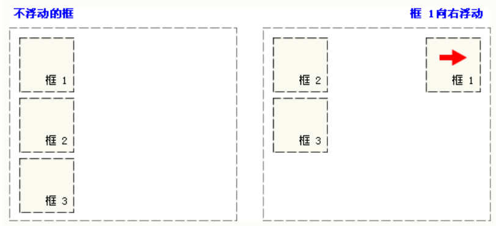

再请看下图，当框 1 向左浮动时，它脱离文档流并且向左移动，直到它的左边缘碰到包含框的左边缘。因为它不再处于文档流中，所以它不占据空间，实际上覆盖住了框 2，使框 2 从视图中消失。如果把所有三个框都向左移动，那么框 1 向左浮动直到碰到包含框，另外两个框向左浮动直到碰到前一个浮动框。

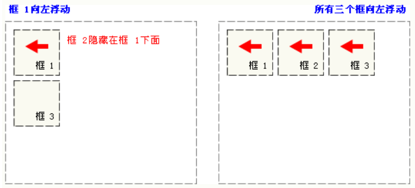

如下图所示，如果包含框太窄，无法容纳水平排列的三个浮动元素，那么其它浮动块向下移动，直到有足够的空间。如果浮动元素的高度不同，那么当它们向下移动时可能被其它浮动元素“卡住”：

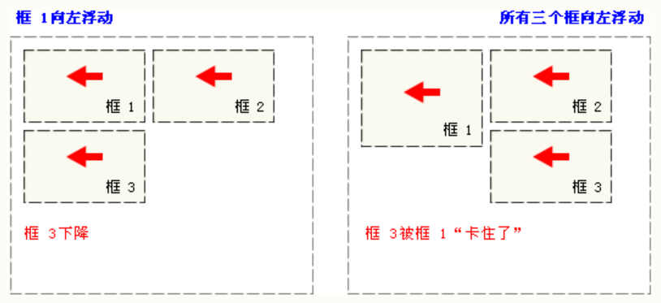

## 3.3 语法

```
float: [left | right | none]
```

- left：元素向左移动
- right：元素向右移动
- none：默认值，元素不动，并会显示在其文本中出现的位置

## 3.4 实操

**case1：**

```html
<!DOCTYPE html>
<html>
    <head>
        <meta charset="UTF-8">
        <title></title>
    </head>
    <body>
        <!--外层div-->
        <div style="background-color: pink;">
            <div style="width: 100px;height: 100px;background-color: chartreuse;">11</div>
            <div style="width: 200px;height: 200px;background-color: coral;">22</div>
            <div style="width: 300px;height: 300px;background-color: yellow">33</div>
        </div>
    </body>
</html>
```

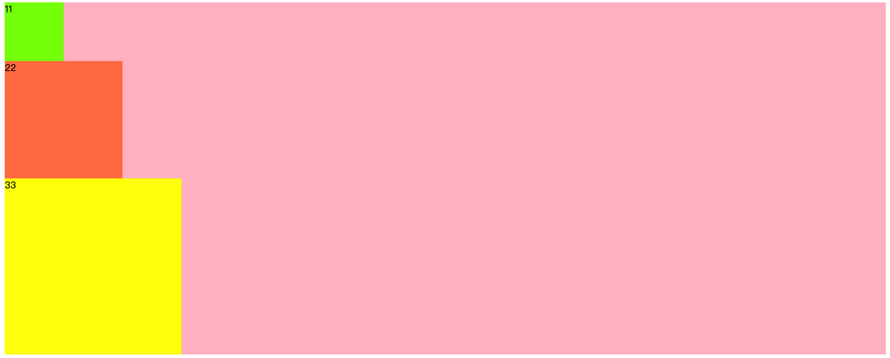

没有任何浮动。

**case2：**

```html
<!DOCTYPE html>
<html>
    <head>
        <meta charset="UTF-8">
        <title></title>
    </head>
    <body>
        <!--外层div-->
        <div style="background-color: pink;">
            <!-- 给绿色添加浮动 -->
            <div id="div01" 
                 style="width: 100px;height: 100px;background-color: 
                        chartreuse;float: left;">11</div>
            <div id="div02" 
                 style="width: 200px;height: 200px;background-color: coral;">22</div>
            <div id="div03" 
                 style="width: 300px;height: 300px;background-color: yellow">33</div>
        </div>
    </body>
</html>
```

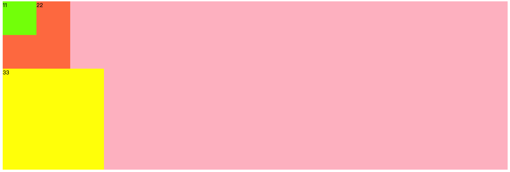

**case3：**

```html
<!DOCTYPE html>
<html>
    <head>
        <meta charset="UTF-8">
        <title></title>
    </head>
    <body>
        <!--外层div-->
        <div style="background-color: pink;">
            <!-- 给橙色添加浮动 -->
            <div id="div01" style="width: 100px;height: 100px;background-color: chartreuse;float: left;">11</div>
            <div id="div02" style="width: 200px;height: 200px;background-color: coral;float: left;">22</div>
            <div id="div03" style="width: 300px;height: 300px;background-color: yellow">33</div>
        </div>
    </body>
</html>
```

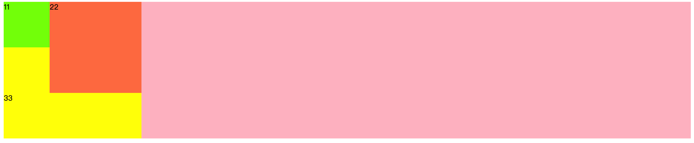

**case4：**

```html
<!DOCTYPE html>
<html>
    <head>
        <meta charset="UTF-8">
        <title></title>
    </head>
    <body>
        <!--外层div-->
        <div style="background-color: pink;">
            <!-- 给黄色添加浮动 -->
            <div id="div01" style="width: 100px;height: 100px;background-color: chartreuse;float: left;">11</div>
            <div id="div02" style="width: 200px;height: 200px;background-color: coral;float: left;">22</div>
            <div id="div03" style="width: 300px;height: 300px;background-color: yellow;float: left;">33</div>
        </div>
    </body>
</html>
```

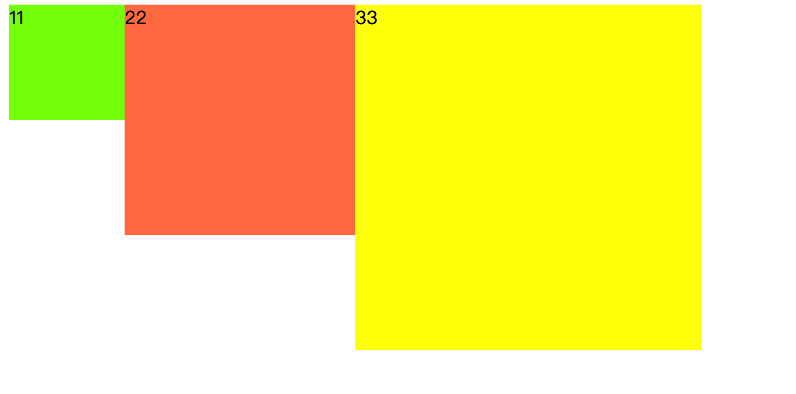

**case5：**

```html
<!DOCTYPE html>
<html>
    <head>
        <meta charset="UTF-8">
        <title></title>
    </head>
    <body>
        <!-- 外层div -->
        <!-- 现在在三个div下面再加上一个紫色div -->
        <div style="background-color: pink;">
            <div id="div01" style="width: 100px;height: 100px;background-color: chartreuse;float: left;">11</div>
            <div id="div02" style="width: 200px;height: 200px;background-color: coral;float: left;">22</div>
            <div id="div03" style="width: 300px;height: 300px;background-color: yellow;float: left;">33</div>
        </div>
        <div style="width: 500px;height: 500px;background-color: blueviolet;"></div>
    </body>
</html>
```

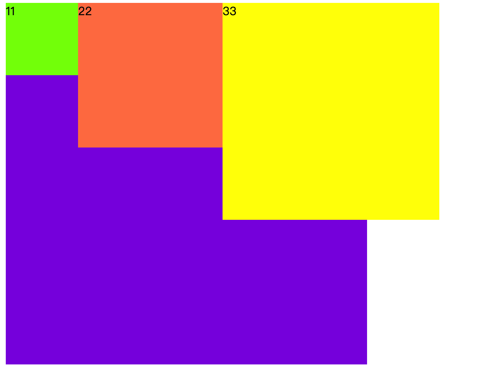

若要消除浮动影响，只需要使用 clear 属性设置为 [left | right | both] 即可。

# 四. 定位

## 4.1 简介

定位主要是用于确定一个元素的位置，分为四种：

| 种类     | 描述                                                         |
| -------- | ------------------------------------------------------------ |
| absolute | 生成绝对定位的元素，相对于 static 定位以外的第一个父元素进行定位的。元素的位置通过 left，top，right，bottom 属性进行规定。 |
| fixed    | 生成绝对定位的元素，相对于浏览器窗口进行定位。元素的位置通过 left，top，right，bottom 属性进行规定。 |
| relative | 生成相对定位的元素，相对于其正常位置进行定位。因此，left: 20 会向元素的右边移动 20 像素，也就是距离元素正常位置的左边 20 像素。 |
| static   | 默认值，没有定位，元素出现在正常的文档流中。                 |

## 4.2 语法

1. 静态定位：

```html
<!--静态定位：
    如果我们不写position属性的话，相当于默认效果就是静态定位。
    静态效果：就是元素出现在它本该出现的位置。一般使用静态定位可以直接省略不写。
-->

```

2. 相对定位：

```html
<!--相对定位：
    相对元素自身所在的原来的位置进行定位。
    可以设置 left,right,top,bottom四个属性
    效果：在进行相对定位以后，元素原来所在的位置被保留了，被占用了--》保留站位其他元素的位置不会发生移动
    一般情况下，left和right不会同时使用  ,选择一个方向即可.top和bottom不会同时使用,选择一个方向即可
    优先级：左上>右下
-->
<div style="width: 500px;height: 500px;background-color: pink;">
    <div style="width: 100px;height: 100px;
                background-color: bisque;position: relative;left: 10px;
                z-index: 10;"></div>
    <div style="width: 100px;height: 100px;
                background-color: yellow;position: relative;bottom: 10px;right: 20px;
                z-index: 90;"></div>
    <div style="width: 100px;height: 100px;background-color: green;"></div>
</div>
```

相对定位的应用场合： 		

（1）元素在小范围移动的时候 	

（2）结合绝对定位使用

**z-index** 属性要设置在定位的元素上，决定着哪个元素展示在最上层。越大优先级越高。

3. 绝对定位：

```html
<!DOCTYPE html>
<html>
    <head>
        <meta charset="UTF-8">
        <title></title>
        <style type="text/css">
            #outer {
                width: 500px;
                height: 500px;
                background-color: pink;
                margin-left:300px;
            }
            #div01 {
                width: 100px;
                height: 100px;
                background-color: cornflowerblue;
                position: absolute;
                left: 30px;
                top: 50px;
            }
            #div02 {
                width: 100px;
                height: 100px;
                background-color: coral;
            }
        </style>
    </head>
    <body>
        <div id="outer">
            <div id="div01">111</div>
            <div id="div02">222</div>
        </div>
    </body>
</html>
```

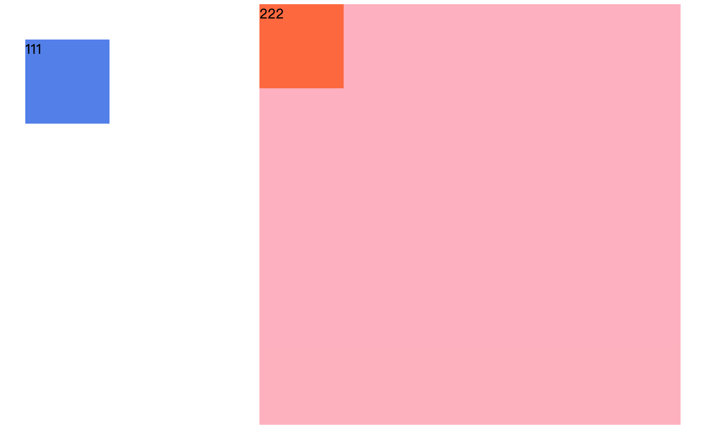

暂时来说看到的效果：蓝色div相对body产生的位移，相对body进行位置的改变，然后蓝色div发生位移以后，原位置得到了释放。橙色div移动上去了！ 		

实际开发中，我们往往让蓝色div在粉色div中发生位移效果，只需要设置父元素定位为相对定位即可。

```html
<style type="text/css">
    #outer {
        width: 500px;
        height: 500px;
        background-color: pink;
        margin-left:300px;
        position: relative;/*直接设置一个相对定位*/
    }
    #div01 {
        width: 100px;
        height: 100px;
        background-color: cornflowerblue;
        position: absolute;
        left: 30px;
        top: 50px;
    }
    #div02 {
        width: 100px;
        height: 100px;
        background-color: coral;
    }
</style>
```

当给一个元素设置了绝对定位的时候，它相对谁变化呢？它会向上一层一层的找父级节点是否有定位，如果直到找到 body了也没有定位，那么就相对 body 进行变化，如果父级节点有定位（绝对定位，相对定位，固定定位），但是一般我们会配合使用父级为相对定位，当前元素为绝对定位，这样这个元素就会相对父级位置产生变化。无论是上面的哪一种，都会释放原来的位置，然后其他元素会占用那个位置。

4. 固定定位

应用场合：在页面过长的时候，将某个元素固定在浏览器的某个位置上，当拉动滚动条的时候，这个元素位置不动。

```html
<!DOCTYPE html>
<html>
    <head>
        <meta charset="UTF-8">
        <title></title>
        <style type="text/css">
            #mydiv {
                width: 50px;
                height: 400px;
                background-color: cadetblue;
                /*固定定位*/
                position: fixed;
                right: 0px;
                top: 300px;
            }
        </style>
    </head>
    <body>
        <div id="mydiv"></div>
        <p>你好</p>
        <p>你好</p>
        <!-- 省略100行 -->
    </body>
</html>
```

# 五. 盒子模型

## 5.1 介绍

页面上也有很多元素，元素之间的布局/设计 依靠 盒子模型：所有HTML元素可以看作盒子，在CSS中，"box model"这一术语是用来设计和布局时使用。CSS盒模型本质上是一个盒子，封装周围的HTML元素，它包括：边距，边框，填充，和实际内容。盒模型允许我们在其它元素和周围元素边框之间的空间放置元素。 		

下面的图片说明了盒子模型(Box Model)：

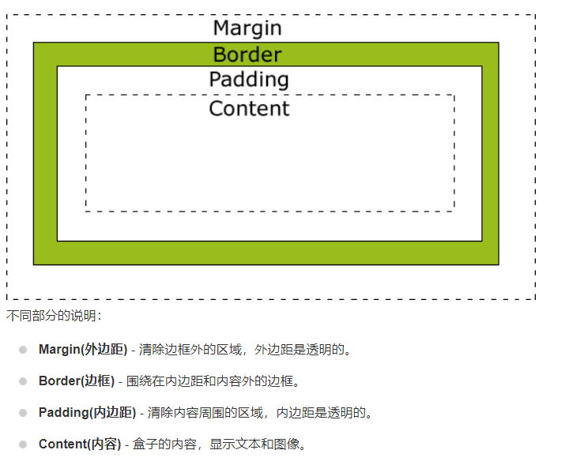

## 5.2 实操

```html
<!DOCTYPE html>
<html>
    <head>
        <meta charset="UTF-8">
        <title></title>
        <style type="text/css">
            /*将所有元素的样式：外边距，边框，内边距全部设置为0*/
            * {
                margin: 0px;
                border: 0px;
                padding: 0px;
            }
            #outer {
                width: 440px;
                height: 450px;
                background-color: lightskyblue;
                margin-left: 100px;
                margin-top: 100px;
                padding-top: 50px;
                padding-left: 60px;
            }
            #mydiv {
                width: 170px;
                height: 150px;
                background-color: pink;
                padding-top: 50px;
                padding-left: 30px;
            }
        </style>
    </head>
    <body>
        <div id="outer">
            <div id="mydiv">我是div</div>
        </div>
    </body>
</html>
```

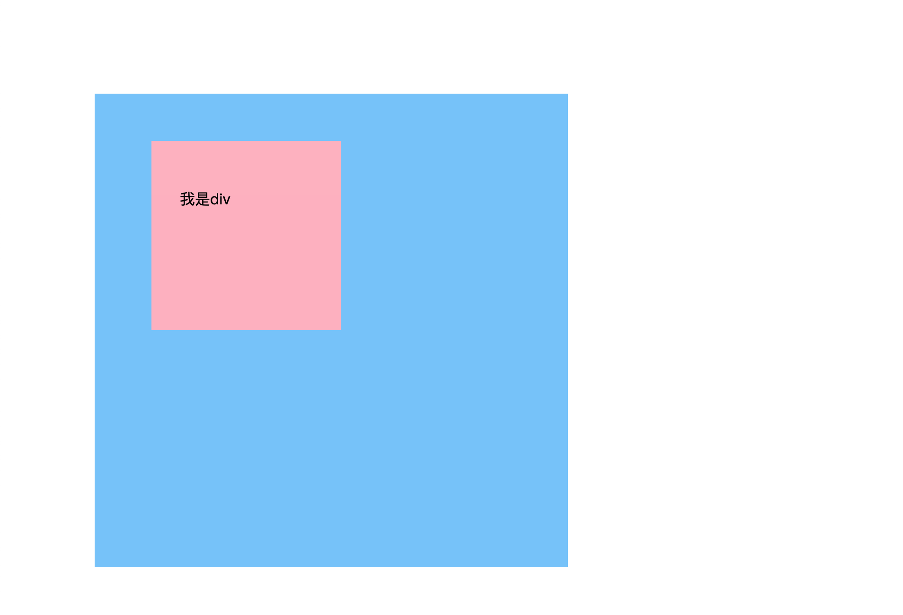