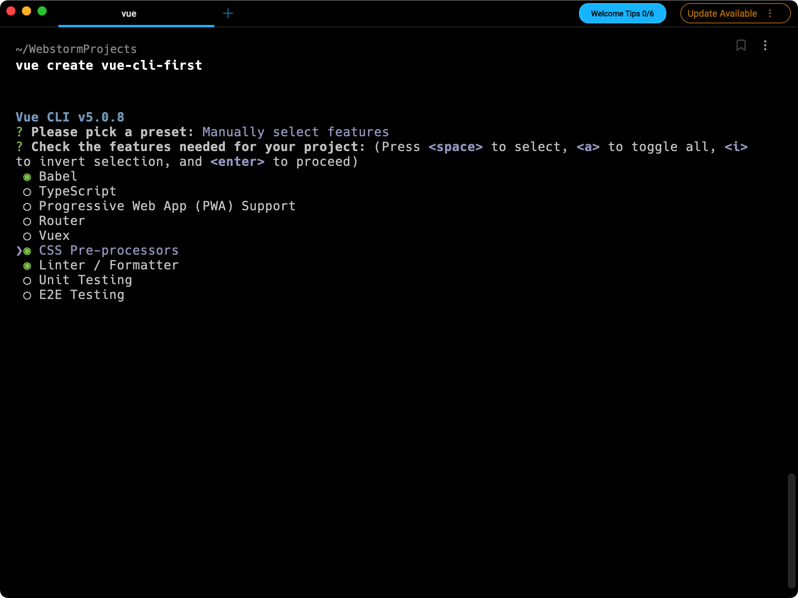

# Vue-CLI

# 介绍

Vue CLI 是一个基于 Vue.js 进行快速开发的完整系统，提供：

- 通过 `@vue/cli` 实现的交互式的项目脚手架。
- 通过 `@vue/cli` + `@vue/cli-service-global` 实现的零配置原型开发。
- 一个运行时依赖 (`@vue/cli-service`)，该依赖：
  - 可升级；
  - 基于 webpack 构建，并带有合理的默认配置；
  - 可以通过项目内的配置文件进行配置；
  - 可以通过插件进行扩展。
- 一个丰富的官方插件集合，集成了前端生态中最好的工具。
- 一套完全图形化的创建和管理 Vue.js 项目的用户界面。

Vue CLI 致力于将 Vue 生态中的工具基础标准化。它确保了各种构建工具能够基于智能的默认配置即可平稳衔接，这样你可以专注在撰写应用上，而不必花好几天去纠结配置的问题。与此同时，它也为每个工具提供了调整配置的灵活性，无需 eject。

## 该系统的组件

Vue CLI 有几个独立的部分——如果你看到了我们的[源代码](https://github.com/vuejs/vue-cli/tree/dev/packages/@vue)，你会发现这个仓库里同时管理了多个单独发布的包。

### CLI

CLI (`@vue/cli`) 是一个全局安装的 npm 包，提供了终端里的 `vue` 命令。它可以通过 `vue create` 快速搭建一个新项目，或者直接通过 `vue serve` 构建新想法的原型。你也可以通过 `vue ui` 通过一套图形化界面管理你的所有项目。我们会在接下来的指南中逐章节深入介绍。

### CLI 服务

CLI 服务 (`@vue/cli-service`) 是一个开发环境依赖。它是一个 npm 包，局部安装在每个 `@vue/cli` 创建的项目中。

CLI 服务是构建于 [webpack](http://webpack.js.org/) 和 [webpack-dev-server](https://github.com/webpack/webpack-dev-server) 之上的。它包含了：

- 加载其它 CLI 插件的核心服务；
- 一个针对绝大部分应用优化过的内部的 webpack 配置；
- 项目内部的 `vue-cli-service` 命令，提供 `serve`、`build` 和 `inspect` 命令。

如果你熟悉 [create-react-app](https://github.com/facebookincubator/create-react-app) 的话，`@vue/cli-service` 实际上大致等价于 `react-scripts`，尽管功能集合不一样。

[CLI 服务](https://cli.vuejs.org/zh/guide/cli-service.html)章节涵盖了它的具体用法。

### CLI 插件

CLI 插件是向你的 Vue 项目提供可选功能的 npm 包，例如 Babel/TypeScript 转译、ESLint 集成、单元测试和 end-to-end 测试等。Vue CLI 插件的名字以 `@vue/cli-plugin-` (内建插件) 或 `vue-cli-plugin-` (社区插件) 开头，非常容易使用。

当你在项目内部运行 `vue-cli-service` 命令时，它会自动解析并加载 `package.json` 中列出的所有 CLI 插件。

插件可以作为项目创建过程的一部分，或在后期加入到项目中。它们也可以被归成一组可复用的 preset。我们会在[插件和 preset](https://cli.vuejs.org/zh/guide/plugins-and-presets.html) 章节进行深入讨论。

# 安装

> Node 版本要求
>
> Vue CLI 4.x 需要 [Node.js](https://nodejs.org/) v8.9 或更高版本 (推荐 v10 以上)。你可以使用 [n](https://github.com/tj/n)，[nvm](https://github.com/creationix/nvm) 或 [nvm-windows](https://github.com/coreybutler/nvm-windows) 在同一台电脑中管理多个 Node 版本。

可以使用下列任一命令安装这个新的包：

```shell
npm install -g @vue/cli
# OR
yarn global add @vue/cli
```

安装之后，你就可以在命令行中访问 `vue` 命令。你可以通过简单运行 `vue`，看看是否展示出了一份所有可用命令的帮助信息，来验证它是否安装成功。

你还可以用这个命令来检查其版本是否正确：

```shell
vue --version
```

如需升级全局的 Vue CLI 包，请运行：

```shell
npm update -g @vue/cli

# 或者
yarn global upgrade --latest @vue/cli
```

上面列出来的命令是用于升级全局的 Vue CLI。如需升级项目中的 Vue CLI 相关模块（以 `@vue/cli-plugin-` 或 `vue-cli-plugin-` 开头），请在项目目录下运行 `vue upgrade`：

```
用法： upgrade [options] [plugin-name]

（试用）升级 Vue CLI 服务及插件

选项：
  -t, --to <version>    升级 <plugin-name> 到指定的版本
  -f, --from <version>  跳过本地版本检测，默认插件是从此处指定的版本升级上来
  -r, --registry <url>  使用指定的 registry 地址安装依赖
  --all                 升级所有的插件
  --next                检查插件新版本时，包括 alpha/beta/rc 版本在内
  -h, --help            输出帮助内容
```

# 基础

## 创建一个项目

### vue create

运行以下命令来创建一个新项目：

```shell
vue create hello-world
```

你会被提示选取一个 preset。你可以选默认的包含了基本的 Babel + ESLint 设置的 preset，也可以选“手动选择特性”来选取需要的特性。

这个默认的设置非常适合快速创建一个新项目的原型，而手动设置则提供了更多的选项，它们是面向生产的项目更加需要的。



> ~/.vuerc
>
> 被保存的 preset 将会存在用户的 home 目录下一个名为 `.vuerc` 的 JSON 文件里。如果你想要修改被保存的 preset / 选项，可以编辑这个文件。
>
> 在项目创建的过程中，你也会被提示选择喜欢的包管理器或使用[淘宝 npm 镜像源](https://npmmirror.com/)以更快地安装依赖。这些选择也将会存入 `~/.vuerc`。

`vue create` 命令有一些可选项，你可以通过运行以下命令进行探索：

```shell
vue create --help
```

```
用法：create [options] <app-name>

创建一个由 `vue-cli-service` 提供支持的新项目


选项：

  -p, --preset <presetName>       忽略提示符并使用已保存的或远程的预设选项
  -d, --default                   忽略提示符并使用默认预设选项
  -i, --inlinePreset <json>       忽略提示符并使用内联的 JSON 字符串预设选项
  -m, --packageManager <command>  在安装依赖时使用指定的 npm 客户端
  -r, --registry <url>            在安装依赖时使用指定的 npm registry
  -g, --git [message]             强制 / 跳过 git 初始化，并可选的指定初始化提交信息
  -n, --no-git                    跳过 git 初始化
  -f, --force                     覆写目标目录可能存在的配置
  -c, --clone                     使用 git clone 获取远程预设选项
  -x, --proxy                     使用指定的代理创建项目
  -b, --bare                      创建项目时省略默认组件中的新手指导信息
  -h, --help                      输出使用帮助信息
```

### 使用图形化界面

你也可以通过 `vue ui` 命令以图形化界面创建和管理项目：

```shell
vue ui
```

上述命令会打开一个浏览器窗口，并以图形化界面将你引导至项目创建的流程。

## 插件和Preset

### 插件

Vue CLI 使用了一套基于插件的架构。如果你查阅一个新创建项目的 `package.json`，就会发现依赖都是以 `@vue/cli-plugin-` 开头的。插件可以修改 webpack 的内部配置，也可以向 `vue-cli-service` 注入命令。在项目创建的过程中，绝大部分列出的特性都是通过插件来实现的。

> 你可以通过 `vue ui` 命令使用 GUI 安装和管理插件。

#### 在现有的项目中安装插件

每个 CLI 插件都会包含一个 (用来创建文件的) 生成器和一个 (用来调整 webpack 核心配置和注入命令的) 运行时插件。当你使用 `vue create` 来创建一个新项目的时候，有些插件会根据你选择的特性被预安装好。如果你想在一个已经被创建好的项目中安装一个插件，可以使用 `vue add` 命令：

```shell
vue add eslint
```

> `vue add` 的设计意图是为了安装和调用 Vue CLI 插件。这不意味着替换掉普通的 npm 包。对于这些普通的 npm 包，你仍然需要选用包管理器。

这个命令将 `@vue/eslint` 解析为完整的包名 `@vue/cli-plugin-eslint`，然后从 npm 安装它，调用它的生成器。

```shell
# 这个和之前的用法等价
vue add cli-plugin-eslint
```

如果不带 `@vue` 前缀，该命令会换作解析一个 unscoped 的包。例如以下命令会安装第三方插件 `vue-cli-plugin-apollo`：

```shell
# 安装并调用 vue-cli-plugin-apollo
vue add apollo
```

你也可以基于一个指定的 scope 使用第三方插件。例如如果一个插件名为 `@foo/vue-cli-plugin-bar`，你可以这样添加它：

```shell
vue add @foo/bar
```

#### 项目本地的插件

如果你需要在项目里直接访问插件 API 而不需要创建一个完整的插件，你可以在 `package.json` 文件中使用 `vuePlugins.service` 选项：

```json
{
  "vuePlugins": {
    "service": ["my-commands.js"]
  }
}
```

每个文件都需要暴露一个函数，接受插件 API 作为第一个参数。

你也可以通过 `vuePlugins.ui` 选项添加像 UI 插件一样工作的文件：

```json
{
  "vuePlugins": {
    "ui": ["my-ui.js"]
  }
}
```

### Preset

一个 Vue CLI preset 是一个包含创建新项目所需预定义选项和插件的 JSON 对象，让用户无需在命令提示中选择它们。

在 `vue create` 过程中保存的 preset 会被放在你的 home 目录下的一个配置文件中 (`~/.vuerc`)。你可以通过直接编辑这个文件来调整、添加、删除保存好的 preset。

这里有一个 preset 的示例：

```json
{
  "useConfigFiles": true,
  "cssPreprocessor": "sass",
  "plugins": {
    "@vue/cli-plugin-babel": {},
    "@vue/cli-plugin-eslint": {
      "config": "airbnb",
      "lintOn": ["save", "commit"]
    },
    "@vue/cli-plugin-router": {},
    "@vue/cli-plugin-vuex": {}
  }
}
```

Preset 的数据会被插件生成器用来生成相应的项目文件。除了上述这些字段，你也可以为集成工具添加配置：

```json
{
  "useConfigFiles": true,
  "plugins": {...},
  "configs": {
    "vue": {...},
    "postcss": {...},
    "eslintConfig": {...},
    "jest": {...}
  }
}
```

这些额外的配置将会根据 `useConfigFiles` 的值被合并到 `package.json` 或相应的配置文件中。例如，当 `"useConfigFiles": true` 的时候，`configs` 的值将会被合并到 `vue.config.js` 中。

## CLI服务

### 使用命令

在一个 Vue CLI 项目中，`@vue/cli-service` 安装了一个名为 `vue-cli-service` 的命令。你可以在 npm scripts 中以 `vue-cli-service`、或者从终端中以 `./node_modules/.bin/vue-cli-service` 访问这个命令。

这是你使用默认 preset 的项目的 `package.json`：

```json
{
  "scripts": {
    "serve": "vue-cli-service serve",
    "build": "vue-cli-service build"
  }
}
```

你可以通过 npm 或 Yarn 调用这些 script：

```shell
npm run serve
# OR
yarn serve
```

如果你可以使用 [npx](https://github.com/npm/npx) (最新版的 npm 应该已经自带)，也可以直接这样调用命令：

### vue-cli-service serve

```
用法：vue-cli-service serve [options] [entry]

选项：

  --open    在服务器启动时打开浏览器
  --copy    在服务器启动时将 URL 复制到剪切版
  --mode    指定环境模式 (默认值：development)
  --host    指定 host (默认值：0.0.0.0)
  --port    指定 port (默认值：8080)
  --https   使用 https (默认值：false)
```

`vue-cli-service serve` 命令会启动一个开发服务器 (基于 [webpack-dev-server](https://github.com/webpack/webpack-dev-server)) 并附带开箱即用的模块热重载 (Hot-Module-Replacement)。

除了通过命令行参数，你也可以使用 `vue.config.js` 里的 [devServer](https://cli.vuejs.org/zh/config/#devserver) 字段配置开发服务器。

命令行参数 `[entry]` 将被指定为唯一入口 (默认值：`src/main.js`，TypeScript 项目则为 `src/main.ts`)，而非额外的追加入口。尝试使用 `[entry]` 覆盖 `config.pages` 中的 `entry` 将可能引发错误。

### vue-cli-service build

```
用法：vue-cli-service build [options] [entry|pattern]

选项：

  --mode        指定环境模式 (默认值：production)
  --dest        指定输出目录 (默认值：dist)
  --modern      面向现代浏览器带自动回退地构建应用
  --target      app | lib | wc | wc-async (默认值：app)
  --name        库或 Web Components 模式下的名字 (默认值：package.json 中的 "name" 字段或入口文件名)
  --no-clean    在构建项目之前不清除目标目录的内容
  --report      生成 report.html 以帮助分析包内容
  --report-json 生成 report.json 以帮助分析包内容
  --watch       监听文件变化
```

`vue-cli-service build` 会在 `dist/` 目录产生一个可用于生产环境的包，带有 JS/CSS/HTML 的压缩，和为更好的缓存而做的自动的 vendor chunk splitting。它的 chunk manifest 会内联在 HTML 里。

这里还有一些有用的命令参数：

- `--modern` 使用[现代模式](https://cli.vuejs.org/zh/guide/browser-compatibility.html#现代模式)构建应用，为现代浏览器交付原生支持的 ES2015 代码，并生成一个兼容老浏览器的包用来自动回退。
- `--target` 允许你将项目中的任何组件以一个库或 Web Components 组件的方式进行构建。更多细节请查阅[构建目标](https://cli.vuejs.org/zh/guide/build-targets.html)。
- `--report` 和 `--report-json` 会根据构建统计生成报告，它会帮助你分析包中包含的模块们的大小。

### vue-cli-service inspect

```
用法：vue-cli-service inspect [options] [...paths]

选项：

  --mode    指定环境模式 (默认值：development)
```

你可以使用 `vue-cli-service inspect` 来审查一个 Vue CLI 项目的 webpack config。

### 查看所有的可用命令

有些 CLI 插件会向 `vue-cli-service` 注入额外的命令。例如 `@vue/cli-plugin-eslint` 会注入 `vue-cli-service lint` 命令。你可以运行以下命令查看所有注入的命令：

```shell
npx vue-cli-service help
```

你也可以这样学习每个命令可用的选项：

```shell
npx vue-cli-service help [command]
```

### 缓存和并行处理

- `cache-loader` 会默认为 Vue/Babel/TypeScript 编译开启。文件会缓存在 `node_modules/.cache` 中——如果你遇到了编译方面的问题，记得先删掉缓存目录之后再试试看。
- `thread-loader` 会在多核 CPU 的机器上为 Babel/TypeScript 转译开启。

# 开发

## HTML静态资源

### HTML

#### Index文件

`public/index.html` 文件是一个会被 [html-webpack-plugin](https://github.com/jantimon/html-webpack-plugin) 处理的模板。在构建过程中，资源链接会被自动注入。另外，Vue CLI 也会自动注入 resource hint (`preload/prefetch`、manifest 和图标链接 (当用到 PWA 插件时) 以及构建过程中处理的 JavaScript 和 CSS 文件的资源链接。

#### 插值

因为 index 文件被用作模板，所以你可以使用 [lodash template](https://lodash.com/docs/4.17.10#template) 语法插入内容：

- `<%= VALUE %>` 用来做不转义插值；
- `<%- VALUE %>` 用来做 HTML 转义插值；
- `<% expression %>` 用来描述 JavaScript 流程控制。

除了[被 `html-webpack-plugin` 暴露的默认值](https://github.com/jantimon/html-webpack-plugin#writing-your-own-templates)之外，所有[客户端环境变量](https://cli.vuejs.org/zh/guide/mode-and-env.html#using-env-variables-in-client-side-code)也可以直接使用。例如，`BASE_URL` 的用法：

```html
<link rel="icon" href="<%= BASE_URL %>favicon.ico">
```

#### Preload

`<link rel="preload">` 是一种 resource hint，用来指定页面加载后很快会被用到的资源，所以在页面加载的过程中，我们希望在浏览器开始主体渲染之前尽早 preload。

默认情况下，一个 Vue CLI 应用会为所有初始化渲染需要的文件自动生成 preload 提示。

这些提示会被 [@vue/preload-webpack-plugin](https://github.com/vuejs/preload-webpack-plugin) 注入，并且可以通过 `chainWebpack` 的 `config.plugin('preload')` 进行修改和删除。

#### Prefetch

`<link rel=prefetch>` 是一种 resource hint，用来告诉浏览器在页面加载完成后，利用空闲时间提前获取用户未来可能会访问的内容。

默认情况下，一个 Vue CLI 应用会为所有作为 async chunk 生成的 JavaScript 文件 ([通过动态 `import()` 按需 code splitting](https://webpack.js.org/guides/code-splitting/#dynamic-imports) 的产物) 自动生成 prefetch 提示。

这些提示会被 [@vue/preload-webpack-plugin](https://github.com/vuejs/preload-webpack-plugin) 注入，并且可以通过 `chainWebpack` 的 `config.plugin('prefetch')` 进行修改和删除。

```js
// vue.config.js
module.exports = {
  chainWebpack: config => {
    // 移除 prefetch 插件
    config.plugins.delete('prefetch')

    // 或者
    // 修改它的选项：
    config.plugin('prefetch').tap(options => {
      options[0].fileBlacklist = options[0].fileBlacklist || []
      options[0].fileBlacklist.push(/myasyncRoute(.)+?\.js$/)
      return options
    })
  }
}
```

当 prefetch 插件被禁用时，你可以通过 webpack 的内联注释手动选定要提前获取的代码区块：

```js
import(/* webpackPrefetch: true */ './someAsyncComponent.vue')
```

webpack 的运行时会在父级区块被加载之后注入 prefetch 链接。

#### 不生成Index

当基于已有的后端使用 Vue CLI 时，你可能不需要生成 `index.html`，这样生成的资源可以用于一个服务端渲染的页面。这时可以向 [`vue.config.js`](https://cli.vuejs.org/zh/config/#vue-config-js) 加入下列代码：

```js
// vue.config.js
module.exports = {
  // 去掉文件名中的 hash
  filenameHashing: false,
  // 删除 HTML 相关的 webpack 插件
  chainWebpack: config => {
    config.plugins.delete('html')
    config.plugins.delete('preload')
    config.plugins.delete('prefetch')
  }
}
```

然而这样做并不是很推荐，因为：

- 硬编码的文件名不利于实现高效率的缓存控制。
- 硬编码的文件名也无法很好的进行 code-splitting (代码分段)，因为无法用变化的文件名生成额外的 JavaScript 文件。
- 硬编码的文件名无法在[现代模式](https://cli.vuejs.org/zh/guide/browser-compatibility.html#现代模式)下工作。

你应该考虑换用 [indexPath](https://cli.vuejs.org/zh/config/#indexpath) 选项将生成的 HTML 用作一个服务端框架的视图模板。

#### 构建一个多页应用

不是每个应用都需要是一个单页应用。Vue CLI 支持使用 [`vue.config.js` 中的 `pages` 选项](https://cli.vuejs.org/zh/config/#pages)构建一个多页面的应用。构建好的应用将会在不同的入口之间高效共享通用的 chunk 以获得最佳的加载性能。

### 处理静态资源

静态资源可以通过两种方式进行处理：

- 在 JavaScript 被导入或在 template/CSS 中通过相对路径被引用。这类引用会被 webpack 处理。
- 放置在 `public` 目录下或通过绝对路径被引用。这类资源将会直接被拷贝，而不会经过 webpack 的处理。

#### 从相对路径导入

当你在 JavaScript、CSS 或 `*.vue` 文件中使用相对路径 (必须以 `.` 开头) 引用一个静态资源时，该资源将会被包含进入 webpack 的依赖图中。在其编译过程中，所有诸如 ``、`background: url(...)` 和 CSS `@import` 的资源 URL **都会被解析为一个模块依赖**。

```html

```

将会被编译到：

```js
h('img', { attrs: { src: require('./image.png') }})
```

#### URL转换规则

- 如果 URL 是一个绝对路径 (例如 `/images/foo.png`)，它将会被保留不变。
- 如果 URL 以 `.` 开头，它会作为一个相对模块请求被解释且基于你的文件系统中的目录结构进行解析。
- 如果 URL 以 `~` 开头，其后的任何内容都会作为一个模块请求被解析。这意味着你甚至可以引用 Node 模块中的资源：

```html

```

- 如果 URL 以 `@` 开头，它也会作为一个模块请求被解析。它的用处在于 Vue CLI 默认会设置一个指向 `<projectRoot>/src` 的别名 `@`。**(仅作用于模版中)**

#### public文件夹

任何放置在 `public` 文件夹的静态资源都会被简单的复制，而不经过 webpack。你需要通过绝对路径来引用它们。

注意我们推荐将资源作为你的模块依赖图的一部分导入，这样它们会通过 webpack 的处理并获得如下好处：

- 脚本和样式表会被压缩且打包在一起，从而避免额外的网络请求。
- 文件丢失会直接在编译时报错，而不是到了用户端才产生 404 错误。
- 最终生成的文件名包含了内容哈希，因此你不必担心浏览器会缓存它们的老版本。

`public` 目录提供的是一个**应急手段**，当你通过绝对路径引用它时，留意应用将会部署到哪里。如果你的应用没有部署在域名的根部，那么你需要为你的 URL 配置 [publicPath](https://cli.vuejs.org/zh/config/#publicpath) 前缀：

- 在 `public/index.html` 或其它通过 `html-webpack-plugin` 用作模板的 HTML 文件中，你需要通过 `<%= BASE_URL %>` 设置链接前缀：

```html
<link rel="icon" href="<%= BASE_URL %>favicon.ico">
```

- 在模板中，你首先需要向你的组件传入基础 URL：

```js
data () {
  return {
    publicPath: process.env.BASE_URL
  }
}
```

然后：

```html

```

#### 何时使用public文件夹

- 你需要在构建输出中指定一个文件的名字。
- 你有上千个图片，需要动态引用它们的路径。
- 有些库可能和 webpack 不兼容，这时你除了将其用一个独立的 `<script>` 标签引入没有别的选择。

## CSS相关

Vue CLI 项目天生支持 [PostCSS](http://postcss.org/)、[CSS Modules](https://github.com/css-modules/css-modules) 和包含 [Sass](https://sass-lang.com/)、[Less](http://lesscss.org/)、[Stylus](http://stylus-lang.com/) 在内的预处理器。

### 引用静态资源

所有编译后的 CSS 都会通过 [css-loader](https://github.com/webpack-contrib/css-loader) 来解析其中的 `url()` 引用，并将这些引用作为模块请求来处理。这意味着你可以根据本地的文件结构用相对路径来引用静态资源。另外要注意的是如果你想要引用一个 npm 依赖中的文件，或是想要用 webpack alias，则需要在路径前加上 `~` 的前缀来避免歧义。更多细节请参考[处理静态资源](https://cli.vuejs.org/zh/guide/html-and-static-assets.html#处理静态资源)。

### 预处理器

你可以在创建项目的时候选择预处理器 (Sass/Less/Stylus)。如果当时没有选好，内置的 webpack 仍然会被预配置为可以完成所有的处理。你也可以手动安装相应的 webpack loader：

```shell
# Sass
npm install -D sass-loader sass

# Less
npm install -D less-loader less

# Stylus
npm install -D stylus-loader stylus
```

然后你就可以导入相应的文件类型，或在 `*.vue` 文件中这样来使用：

```vue
<style lang="scss">
$color: red;
</style>
```

#### 自动化导入

如果你想自动化导入文件 (用于颜色、变量、mixin……)，你可以使用 [style-resources-loader](https://github.com/yenshih/style-resources-loader)。这里有一个关于 Stylus 的在每个单文件组件和 Stylus 文件中导入 `./src/styles/imports.styl` 的例子：

```js
// vue.config.js
const path = require('path')

module.exports = {
  chainWebpack: config => {
    const types = ['vue-modules', 'vue', 'normal-modules', 'normal']
    types.forEach(type => addStyleResource(config.module.rule('stylus').oneOf(type)))
  },
}

function addStyleResource (rule) {
  rule.use('style-resource')
    .loader('style-resources-loader')
    .options({
      patterns: [
        path.resolve(__dirname, './src/styles/imports.styl'),
      ],
    })
}
```

### PostCSS

Vue CLI 内部使用了 PostCSS。

你可以通过 `.postcssrc` 或任何 [postcss-load-config](https://github.com/michael-ciniawsky/postcss-load-config) 支持的配置源来配置 PostCSS。也可以通过 `vue.config.js` 中的 `css.loaderOptions.postcss` 配置 [postcss-loader](https://github.com/postcss/postcss-loader)。

我们默认开启了 [autoprefixer](https://github.com/postcss/autoprefixer)。如果要配置目标浏览器，可使用 `package.json` 的 [browserslist](https://cli.vuejs.org/zh/guide/browser-compatibility.html#browserslist) 字段。

在生产环境构建中，Vue CLI 会优化 CSS 并基于目标浏览器抛弃不必要的浏览器前缀规则。因为默认开启了 `autoprefixer`，你只使用无前缀的 CSS 规则即可。

### CSS Modules

你可以通过 `<style module>` 以开箱即用的方式[在 `*.vue` 文件中使用 CSS Modules](https://vue-loader.vuejs.org/zh/guide/css-modules.html)。

如果想在 JavaScript 中作为 CSS Modules 导入 CSS 或其它预处理文件，该文件应该以 `.module.(css|less|sass|scss|styl)` 结尾：

```js
import styles from './foo.module.css'
// 所有支持的预处理器都一样工作
import sassStyles from './foo.module.scss'
```

如果你想去掉文件名中的 `.module`，可以设置 `vue.config.js` 中的 `css.requireModuleExtension` 为 `false`：

```js
// vue.config.js
module.exports = {
  css: {
    requireModuleExtension: false
  }
}
```

如果你希望自定义生成的 CSS Modules 模块的类名，可以通过 `vue.config.js` 中的 `css.loaderOptions.css` 选项来实现。所有的 `css-loader` 选项在这里都是支持的，例如 `localIdentName` 和 `camelCase`：

```js
// vue.config.js
module.exports = {
  css: {
    loaderOptions: {
      css: {
        // 注意：以下配置在 Vue CLI v4 与 v3 之间存在差异。
        // Vue CLI v3 用户可参考 css-loader v1 文档
        // https://github.com/webpack-contrib/css-loader/tree/v1.0.1
        modules: {
          localIdentName: '[name]-[hash]'
        },
        localsConvention: 'camelCaseOnly'
      }
    }
  }
}
```

### 向预处理器Loader传递选项

有的时候你想要向 webpack 的预处理器 loader 传递选项。你可以使用 `vue.config.js` 中的 `css.loaderOptions` 选项。比如你可以这样向所有 Sass/Less 样式传入共享的全局变量：

```js
// vue.config.js
module.exports = {
  css: {
    loaderOptions: {
      // 给 sass-loader 传递选项
      sass: {
        // @/ 是 src/ 的别名
        // 所以这里假设你有 `src/variables.sass` 这个文件
        // 注意：在 sass-loader v8 中，这个选项名是 "prependData"
        additionalData: `@import "~@/variables.sass"`
      },
      // 默认情况下 `sass` 选项会同时对 `sass` 和 `scss` 语法同时生效
      // 因为 `scss` 语法在内部也是由 sass-loader 处理的
      // 但是在配置 `prependData` 选项的时候
      // `scss` 语法会要求语句结尾必须有分号，`sass` 则要求必须没有分号
      // 在这种情况下，我们可以使用 `scss` 选项，对 `scss` 语法进行单独配置
      scss: {
        additionalData: `@import "~@/variables.scss";`
      },
      // 给 less-loader 传递 Less.js 相关选项
      less:{
        // http://lesscss.org/usage/#less-options-strict-units `Global Variables`
        // `primary` is global variables fields name
        globalVars: {
          primary: '#fff'
        }
      }
    }
  }
}
```

## Webpack相关

### 简单的配置方式

调整 webpack 配置最简单的方式就是在 `vue.config.js` 中的 `configureWebpack` 选项提供一个对象：

```js
// vue.config.js
module.exports = {
  configureWebpack: {
    plugins: [
      new MyAwesomeWebpackPlugin()
    ]
  }
}
```

该对象将会被 [webpack-merge](https://github.com/survivejs/webpack-merge) 合并入最终的 webpack 配置。

如果你需要基于环境有条件地配置行为，或者想要直接修改配置，那就换成一个函数 (该函数会在环境变量被设置之后懒执行)。该方法的第一个参数会收到已经解析好的配置。在函数内，你可以直接修改配置，或者返回一个将会被合并的对象：

```js
// vue.config.js
module.exports = {
  configureWebpack: config => {
    if (process.env.NODE_ENV === 'production') {
      // 为生产环境修改配置...
    } else {
      // 为开发环境修改配置...
    }
  }
}
```

### 链式操作

Vue CLI 内部的 webpack 配置是通过 [webpack-chain](https://github.com/mozilla-neutrino/webpack-chain) 维护的。这个库提供了一个 webpack 原始配置的上层抽象，使其可以定义具名的 loader 规则和具名插件，并有机会在后期进入这些规则并对它们的选项进行修改。

它允许我们更细粒度的控制其内部配置。接下来有一些常见的在 `vue.config.js` 中的 `chainWebpack` 修改的例子。

#### 修改Loader选项

```js
// vue.config.js
module.exports = {
  chainWebpack: config => {
    config.module
      .rule('vue')
      .use('vue-loader')
        .tap(options => {
          // 修改它的选项...
          return options
        })
  }
}

```

#### 添加一个新的Loader

```js
// vue.config.js
module.exports = {
  chainWebpack: config => {
    // GraphQL Loader
    config.module
      .rule('graphql')
      .test(/\.graphql$/)
      .use('graphql-tag/loader')
        .loader('graphql-tag/loader')
        .end()
      // 你还可以再添加一个 loader
      .use('other-loader')
        .loader('other-loader')
        .end()
  }
}
```

#### 替换一个新的Loader

如果你想要替换一个已有的[基础 loader](https://github.com/vuejs/vue-cli/tree/dev/packages/@vue/cli-service/lib/config/base.js)，例如为内联的 SVG 文件使用 `vue-svg-loader` 而不是加载这个文件：

```js
// vue.config.js
module.exports = {
  chainWebpack: config => {
    const svgRule = config.module.rule('svg')

    // 清除已有的所有 loader。
    // 如果你不这样做，接下来的 loader 会附加在该规则现有的 loader 之后。
    svgRule.uses.clear()

    // 添加要替换的 loader
    svgRule.use('vue-svg-loader').loader('vue-svg-loader')
  }
}
```

#### 修改插件选项

```js
// vue.config.js
module.exports = {
  chainWebpack: config => {
    config
      .plugin('html')
      .tap(args => {
        return [/* 传递给 html-webpack-plugin's 构造函数的新参数 */]
      })
  }
}
```

## 模式和环境变量

### 模式

**模式**是 Vue CLI 项目中一个重要的概念。默认情况下，一个 Vue CLI 项目有三个模式：

- `development` 模式用于 `vue-cli-service serve`
- `test` 模式用于 `vue-cli-service test:unit`
- `production` 模式用于 `vue-cli-service build` 和 `vue-cli-service test:e2e`

你可以通过传递 `--mode` 选项参数为命令行覆写默认的模式。例如，如果你想要在构建命令中使用开发环境变量：

```shell
vue-cli-service build --mode development
```

当运行 `vue-cli-service` 命令时，所有的环境变量都从对应的[环境文件](https://cli.vuejs.org/zh/guide/mode-and-env.html#环境变量)中载入。如果文件内部不包含 `NODE_ENV` 变量，它的值将取决于模式，例如，在 `production` 模式下被设置为 `"production"`，在 `test` 模式下被设置为 `"test"`，默认则是 `"development"`。

`NODE_ENV` 将决定您的应用运行的模式，是开发，生产还是测试，因此也决定了创建哪种 webpack 配置。

例如通过将 `NODE_ENV` 设置为 `"test"`，Vue CLI 会创建一个优化过后的，并且旨在用于单元测试的 webpack 配置，它并不会处理图片以及一些对单元测试非必需的其他资源。

同理，`NODE_ENV=development` 创建一个 webpack 配置，该配置启用热更新，不会对资源进行 hash 也不会打出 vendor bundles，目的是为了在开发的时候能够快速重新构建。

当你运行 `vue-cli-service build` 命令时，无论你要部署到哪个环境，应该始终把 `NODE_ENV` 设置为 `"production"` 来获取可用于部署的应用程序。

#### 环境变量

你可以在你的项目根目录中放置下列文件来指定环境变量：

```
.env                # 在所有的环境中被载入
.env.local          # 在所有的环境中被载入，但会被 git 忽略
.env.[mode]         # 只在指定的模式中被载入
.env.[mode].local   # 只在指定的模式中被载入，但会被 git 忽略
```

一个环境文件只包含环境变量的“键=值”对：

```
FOO=bar
VUE_APP_NOT_SECRET_CODE=some_value
```

请注意，只有 `NODE_ENV`，`BASE_URL` 和以 `VUE_APP_` 开头的变量将通过 `webpack.DefinePlugin` 静态地嵌入到*客户端侧*的代码中。这是为了避免意外公开机器上可能具有相同名称的私钥。

### Staging模式

假设我们有一个应用包含以下 `.env` 文件：

```
VUE_APP_TITLE=My App
```

和 `.env.staging` 文件：

```
NODE_ENV=production
VUE_APP_TITLE=My App (staging)
```

- `vue-cli-service build` 会加载可能存在的 `.env`、`.env.production` 和 `.env.production.local` 文件然后构建出生产环境应用。
- `vue-cli-service build --mode staging` 会在 staging 模式下加载可能存在的 `.env`、`.env.staging` 和 `.env.staging.local` 文件然后构建出生产环境应用。

这两种情况下，根据 `NODE_ENV`，构建出的应用都是生产环境应用，但是在 staging 版本中，`process.env.VUE_APP_TITLE` 被覆写成了另一个值。

### 客户端使用环境变量

只有以 `VUE_APP_` 开头的变量会被 `webpack.DefinePlugin` 静态嵌入到客户端侧的包中。你可以在应用的代码中这样访问它们：

```js
console.log(process.env.VUE_APP_SECRET)
```

在构建过程中，`process.env.VUE_APP_SECRET` 将会被相应的值所取代。在 `VUE_APP_SECRET=secret` 的情况下，它会被替换为 `"secret"`。

除了 `VUE_APP_*` 变量之外，在你的应用代码中始终可用的还有两个特殊的变量：

- `NODE_ENV` - 会是 `"development"`、`"production"` 或 `"test"` 中的一个。具体的值取决于应用运行的[模式](https://cli.vuejs.org/zh/guide/mode-and-env.html#模式)。
- `BASE_URL` - 会和 `vue.config.js` 中的 `publicPath` 选项相符，即你的应用会部署到的基础路径。

所有解析出来的环境变量都可以在 `public/index.html` 中以 [HTML 插值](https://cli.vuejs.org/zh/guide/html-and-static-assets.html#插值)中介绍的方式使用。

### 只在本地有效的变量

有的时候你可能有一些不应该提交到代码仓库中的变量，尤其是当你的项目托管在公共仓库时。这种情况下你应该使用一个 `.env.local` 文件取而代之。本地环境文件默认会被忽略，且出现在 `.gitignore` 中。

`.local` 也可以加在指定模式的环境文件上，比如 `.env.development.local` 将会在 development 模式下被载入，且被 git 忽略。

## 构建目标

当你运行 `vue-cli-service build` 时，你可以通过 `--target` 选项指定不同的构建目标。它允许你将相同的源代码根据不同的用例生成不同的构建。

### 应用

应用模式是默认的模式。在这个模式中：

- `index.html` 会带有注入的资源和 resource hint
- 第三方库会被分到一个独立包以便更好的缓存
- 小于 8KiB 的静态资源会被内联在 JavaScript 中
- `public` 中的静态资源会被复制到输出目录中

### 库

这个入口可以是一个 `.js` 或一个 `.vue` 文件。如果没有指定入口，则会使用 `src/App.vue`。

构建一个库会输出：

- `dist/myLib.common.js`：一个给打包器用的 CommonJS 包 (不幸的是，webpack 目前还并没有支持 ES modules 输出格式的包)
- `dist/myLib.umd.js`：一个直接给浏览器或 AMD loader 使用的 UMD 包
- `dist/myLib.umd.min.js`：压缩后的 UMD 构建版本
- `dist/myLib.css`：提取出来的 CSS 文件 (可以通过在 `vue.config.js` 中设置 `css: { extract: false }` 强制内联)

## 部署

### 通用指南

如果你用 Vue CLI 处理静态资源并和后端框架一起作为部署的一部分，那么你需要的仅仅是确保 Vue CLI 生成的构建文件在正确的位置，并遵循后端框架的发布方式即可。

如果你独立于后端部署前端应用——也就是说后端暴露一个前端可访问的 API，然后前端实际上是纯静态应用。那么你可以将 `dist` 目录里构建的内容部署到任何静态文件服务器中，但要确保正确的 [publicPath](https://cli.vuejs.org/zh/config/#publicpath)。

### 本地预览

`dist` 目录需要启动一个 HTTP 服务器来访问 (除非你已经将 `publicPath` 配置为了一个相对的值)，所以以 `file://` 协议直接打开 `dist/index.html` 是不会工作的。在本地预览生产环境构建最简单的方式就是使用一个 Node.js 静态文件服务器，例如 [serve](https://github.com/zeit/serve)：

```shell
npm install -g serve
# -s 参数的意思是将其架设在 Single-Page Application 模式下
# 这个模式会处理即将提到的路由问题
serve -s dist
```
