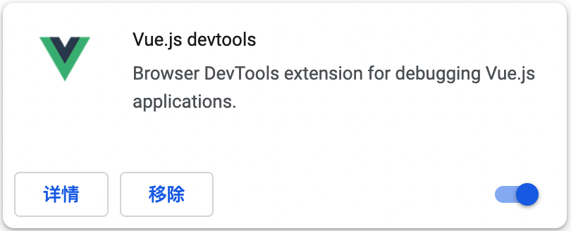

# Vue2(1)

# 一. 简介

Vue (读音 /vjuː/，类似于 **view**) 是一套用于构建用户界面的**渐进式框架**。与其它大型框架不同的是，Vue 被设计为可以自底向上逐层应用。Vue 的核心库只关注视图层，不仅易于上手，还便于与第三方库或既有项目整合。另一方面，当与[现代化的工具链](https://v2.cn.vuejs.org/v2/guide/single-file-components.html)以及各种[支持类库](https://github.com/vuejs/awesome-vue#libraries--plugins)结合使用时，Vue 也完全能够为复杂的单页应用提供驱动。

# 二. 安装

## 1.1 兼容性

Vue **不支持** IE8 及以下版本，因为 Vue 使用了 IE8 无法模拟的 ECMAScript 5 特性。但它支持所有[兼容 ECMAScript 5 的浏览器](https://caniuse.com/#feat=es5)。

## 1.2 Vue Devtools

在使用 Vue 时，我们推荐在你的浏览器上安装 [Vue Devtools](https://github.com/vuejs/vue-devtools#vue-devtools)。它允许你在一个更友好的界面中审查和调试 Vue 应用。



## 1.3 直接引入

直接下载并用 `<script>` 标签引入，`Vue` 会被注册为一个全局变量。

**开发环境**：

```html
<script src="https://cdn.jsdelivr.net/npm/vue@2.7.10/dist/vue.js"></script>
```

**生产环境**：

```html
<script src="https://cdn.jsdelivr.net/npm/vue@2.7.10"></script>
```

如果你使用原生 ES Modules，这里也有一个兼容 ES Module 的构建文件：

```html
<script type="module">
  import Vue from 'https://cdn.jsdelivr.net/npm/vue@2.7.10/dist/vue.esm.browser.js'
</script>
```

你可以在 [cdn.jsdelivr.net/npm/vue](https://cdn.jsdelivr.net/npm/vue/) 浏览 NPM 包的源代码。

Vue 也可以在 [unpkg](https://unpkg.com/vue@2.7.10/dist/vue.js) 和 [cdnjs](https://cdnjs.cloudflare.com/ajax/libs/vue/2.7.10/vue.js) 上获取 (cdnjs 的版本更新可能略滞后)。

## 1.4 npm

在用 Vue 构建大型应用时推荐使用 NPM 安装。NPM 能很好地和诸如 [webpack](https://webpack.js.org/) 或 [Browserify](http://browserify.org/) 模块打包器配合使用。同时 Vue 也提供配套工具来开发[单文件组件](https://v2.cn.vuejs.org/v2/guide/single-file-components.html)。

```shell
npm install vue
```

## 1.5 脚手架(CLI)

Vue 提供了一个[官方的 CLI](https://github.com/vuejs/vue-cli)，为单页面应用 (SPA) 快速搭建繁杂的脚手架。它为现代前端工作流提供了开箱即用的构建设置。只需要几分钟的时间就可以运行起来并带有热重载、保存时 lint 校验，以及生产环境可用的构建版本。更多详情可查阅 [Vue CLI 的文档](https://cli.vuejs.org/)。

# 三. Vue实例

## 3.1 创建一个Vue实例

每个 Vue 应用都是通过用 `Vue` 函数创建一个新的 **Vue 实例**开始的：

```js
var vm = new Vue({
  // 选项
  el: '#app',
  data: {
    a: 0
  }
})
```

虽然没有完全遵循 [MVVM 模型](https://zh.wikipedia.org/wiki/MVVM)，但是 Vue 的设计也受到了它的启发。因此在文档中经常会使用 `vm` (ViewModel 的缩写) 这个变量名表示 Vue 实例。

当创建一个 Vue 实例时，你可以传入一个**选项对象**。这篇教程主要描述的就是如何使用这些选项来创建你想要的行为。作为参考，你也可以在 [API 文档](https://v2.cn.vuejs.org/v2/api/#选项-数据)中浏览完整的选项列表。

一个 Vue 应用由一个通过 `new Vue` 创建的**根 Vue 实例**，以及可选的嵌套的、可复用的组件树组成。举个例子，一个 todo 应用的组件树可以是这样的：

```
根实例
└─ TodoList
   ├─ TodoItem
   │  ├─ TodoButtonDelete
   │  └─ TodoButtonEdit
   └─ TodoListFooter
      ├─ TodosButtonClear
      └─ TodoListStatistics
```

## 3.2 数据与方法

当一个 Vue 实例被创建时，它将 `data` 对象中的所有的 property 加入到 Vue 的**响应式系统**中。当这些 property 的值发生改变时，视图将会产生“响应”，即匹配更新为新的值。

```js
// 我们的数据对象
var data = { a: 1 }

// 该对象被加入到一个 Vue 实例中
var vm = new Vue({
  data: data
})

// 获得这个实例上的 property
// 返回源数据中对应的字段
vm.a == data.a // => true

// 设置 property 也会影响到原始数据
vm.a = 2
data.a // => 2

// ……反之亦然
data.a = 3
vm.a // => 3
```

当这些数据改变时，视图会进行重渲染。**值得注意的是只有当实例被创建时就已经存在于** `data` 中的 property 才是**响应式**的。也就是说如果你添加一个新的 property，比如：

```js
vm.b = 'hi'
```

那么对 `b` 的改动将不会触发任何视图的更新。如果你知道你会在晚些时候需要一个 property，但是一开始它为空或不存在，那么你仅需要设置一些初始值。比如：

```js
data: {
  newTodoText: '',
  visitCount: 0,
  hideCompletedTodos: false,
  todos: [],
  error: null
}
```

这里唯一的例外是使用 `Object.freeze()`，这会阻止修改现有的 property，也意味着响应系统无法再*追踪*变化。

```js
var obj = {
  foo: 'bar'
}

Object.freeze(obj)

new Vue({
  el: '#app',
  data: obj
})
```

```html
<div id="app">
  <p>{{ foo }}</p>
  <!-- 这里的 `foo` 不会更新！ -->
  <button v-on:click="foo = 'baz'">Change it</button>
</div>
```

除了数据 property，Vue 实例还暴露了一些有用的实例 property 与方法。它们都有前缀 `$`，以便与用户定义的 property 区分开来。例如：

```js
var data = { a: 1 }
var vm = new Vue({
  el: '#example',
  data: data
})

vm.$data === data // => true
vm.$el === document.getElementById('example') // => true

// $watch 是一个实例方法
vm.$watch('a', function (newValue, oldValue) {
  // 这个回调将在 `vm.a` 改变后调用
})
```

## 3.3 实例生命周期钩子

每个 Vue 实例在被创建时都要经过一系列的初始化过程——例如，需要设置数据监听、编译模板、将实例挂载到 DOM 并在数据变化时更新 DOM 等。同时在这个过程中也会运行一些叫做**生命周期钩子**的函数，这给了用户在不同阶段添加自己的代码的机会。

比如 [`created`](https://v2.cn.vuejs.org/v2/api/#created) 钩子可以用来在一个实例被创建之后执行代码：

也有一些其它的钩子，在实例生命周期的不同阶段被调用，如 [`mounted`](https://v2.cn.vuejs.org/v2/api/#mounted)、[`updated`](https://v2.cn.vuejs.org/v2/api/#updated) 和 [`destroyed`](https://v2.cn.vuejs.org/v2/api/#destroyed)。生命周期钩子的 `this` 上下文指向调用它的 Vue 实例。

> 不要在选项 property 或回调上使用[箭头函数](https://developer.mozilla.org/zh-CN/docs/Web/JavaScript/Reference/Functions/Arrow_functions)，比如 `created: () => console.log(this.a)` 或 `vm.$watch('a', newValue => this.myMethod())`。因为箭头函数并没有 `this`，`this` 会作为变量一直向上级词法作用域查找，直至找到为止，经常导致 `Uncaught TypeError: Cannot read property of undefined` 或 `Uncaught TypeError: this.myMethod is not a function` 之类的错误。

## 3.4 生命周期图示


# 四. 模板语法

Vue.js 使用了基于 HTML 的模板语法，允许开发者声明式地将 DOM 绑定至底层 Vue 实例的数据。所有 Vue.js 的模板都是合法的 HTML，所以能被遵循规范的浏览器和 HTML 解析器解析。

在底层的实现上，Vue 将模板编译成虚拟 DOM 渲染函数。结合响应系统，Vue 能够智能地计算出最少需要重新渲染多少组件，并把 DOM 操作次数减到最少。

如果你熟悉虚拟 DOM 并且偏爱 JavaScript 的原始力量，你也可以不用模板，[直接写渲染 (render) 函数](https://v2.cn.vuejs.org/v2/guide/render-function.html)，使用可选的 JSX 语法。

## 4.1 插值

### 4.1.1 文本

数据绑定最常见的形式就是使用“Mustache”语法 (双大括号) 的文本插值：

```html
<span>Message: {{ msg }}</span>
```

Mustache 标签将会被替代为对应数据对象上 `msg` property 的值。无论何时，绑定的数据对象上 `msg` property 发生了改变，插值处的内容都会更新。

通过使用 [v-once 指令](https://v2.cn.vuejs.org/v2/api/#v-once)，你也能执行一次性地插值，当数据改变时，插值处的内容不会更新。但请留心这会影响到该节点上的其它数据绑定：

```html
<span v-once>这个将不会改变: {{ msg }}</span>
```

### 4.1.2 原始HTML

双大括号会将数据解释为普通文本，而非 HTML 代码。为了输出真正的 HTML，你需要使用 [`v-html` 指令](https://v2.cn.vuejs.org/v2/api/#v-html)：

```html
<p>Using mustaches: {{ rawHtml }}</p>
<p>Using v-html directive: <span v-html="rawHtml"></span></p>
```

这个 `span` 的内容将会被替换成为 property 值 `rawHtml`，直接作为 HTML——会忽略解析 property 值中的数据绑定。注意，你不能使用 `v-html` 来复合局部模板，因为 Vue 不是基于字符串的模板引擎。反之，对于用户界面 (UI)，组件更适合作为可重用和可组合的基本单位。

### 4.1.3 动态属性绑定

Mustache 语法不能作用在 HTML attribute 上，遇到这种情况应该使用 [`v-bind` 指令](https://v2.cn.vuejs.org/v2/api/#v-bind)：

```html
<div v-bind:id="dynamicId"></div>
```

### 4.1.4 使用JS表达式

迄今为止，在我们的模板中，我们一直都只绑定简单的 property 键值。但实际上，对于所有的数据绑定，Vue.js 都提供了完全的 JavaScript 表达式支持。

```html
{{ number + 1 }}

{{ ok ? 'YES' : 'NO' }}

{{ message.split('').reverse().join('') }}

<div v-bind:id="'list-' + id"></div>
```

这些表达式会在所属 Vue 实例的数据作用域下作为 JavaScript 被解析。有个限制就是，每个绑定都只能包含**单个表达式**，**所以双大括号里面不可以写任何的语句！**

## 4.2 指令

指令 (Directives) 是带有 `v-` 前缀的特殊 attribute。指令 attribute 的值预期是**单个 JavaScript 表达式** (`v-for` 是例外情况，稍后我们再讨论)。指令的职责是，当表达式的值改变时，将其产生的连带影响，响应式地作用于 DOM。回顾我们在介绍中看到的例子：

```html
<p v-if="seen">现在你看到我了</p>
```

这里，`v-if` 指令将根据表达式 `seen` 的值的真假来插入/移除 `<p>` 元素。

### 4.2.1 参数

一些指令能够接收一个“参数”，在指令名称之后以冒号表示。例如，`v-bind` 指令可以用于响应式地更新 HTML attribute：

```html
<a v-bind:href="url">...</a>
```

在这里 `href` 是参数，告知 `v-bind` 指令将该元素的 `href` attribute 与表达式 `url` 的值绑定。

另一个例子是 `v-on` 指令，它用于监听 DOM 事件：

```html
<a v-on:click="doSomething">...</a>
```

### 4.2.2 动态参数

**从 2.6.0 开始**，可以用方括号括起来的 JavaScript 表达式作为一个指令的参数：

```html
<!--
注意，参数表达式的写法存在一些约束，如之后的“对动态参数表达式的约束”章节所述。
-->
<a v-bind:[attributeName]="url"> ... </a>
```

这里的 `attributeName` 会被作为一个 JavaScript 表达式进行动态求值，求得的值将会作为最终的参数来使用。例如，如果你的 Vue 实例有一个 `data` property `attributeName`，其值为 `"href"`，那么这个绑定将等价于 `v-bind:href`。

同样地，你可以使用动态参数为一个动态的事件名绑定处理函数：

```html
<a v-on:[eventName]="doSomething"> ... </a>
```

在这个示例中，当 `eventName` 的值为 `"focus"` 时，`v-on:[eventName]` 将等价于 `v-on:focus`。

**对动态参数的值的约束**：

动态参数预期会求出一个字符串，异常情况下值为 `null`。这个特殊的 `null` 值可以被显性地用于移除绑定。任何其它非字符串类型的值都将会触发一个警告。

**对动态参数表达式的约束**：

动态参数表达式有一些语法约束，因为某些字符，如空格和引号，放在 HTML attribute 名里是无效的。例如：

```html
<!-- 这会触发一个编译警告 -->
<a v-bind:['foo' + bar]="value"> ... </a>
```

变通的办法是使用没有空格或引号的表达式，或用**计算属性**替代这种复杂表达式。

在 DOM 中使用模板时 (直接在一个 HTML 文件里撰写模板)，还需要避免使用大写字符来命名键名，因为浏览器会把 attribute 名全部强制转为小写：

```html
<!--
在 DOM 中使用模板时这段代码会被转换为 `v-bind:[someattr]`。
除非在实例中有一个名为“someattr”的 property，否则代码不会工作。
-->
<a v-bind:[someAttr]="value"> ... </a>
```

### 4.2.3 修饰符

修饰符 (modifier) 是以半角句号 `.` 指明的特殊后缀，用于指出一个指令应该以特殊方式绑定。例如，`.prevent` 修饰符告诉 `v-on` 指令对于触发的事件调用 `event.preventDefault()`：

```html
<form v-on:submit.prevent="onSubmit">...</form>
```

## 4.3 缩写

`v-` 前缀作为一种视觉提示，用来识别模板中 Vue 特定的 attribute。当你在使用 Vue.js 为现有标签添加动态行为 (dynamic behavior) 时，`v-` 前缀很有帮助，然而，对于一些频繁用到的指令来说，就会感到使用繁琐。同时，在构建由 Vue 管理所有模板的[单页面应用程序 (SPA - single page application)](https://en.wikipedia.org/wiki/Single-page_application) 时，`v-` 前缀也变得没那么重要了。因此，Vue 为 `v-bind` 和 `v-on` 这两个最常用的指令，提供了特定简写：

### 4.3.1 v-bind缩写

```html
<!-- 完整语法 -->
<a v-bind:href="url">...</a>

<!-- 缩写 -->
<a :href="url">...</a>

<!-- 动态参数的缩写 (2.6.0+) -->
<a :[key]="url"> ... </a>
```

### 4.3.2 v-on缩写

```html
<!-- 完整语法 -->
<a v-on:click="doSomething">...</a>

<!-- 缩写 -->
<a @click="doSomething">...</a>

<!-- 动态参数的缩写 (2.6.0+) -->
<a @[event]="doSomething"> ... </a>
```

它们看起来可能与普通的 HTML 略有不同，但 `:` 与 `@` 对于 attribute 名来说都是合法字符，在所有支持 Vue 的浏览器都能被正确地解析。而且，它们不会出现在最终渲染的标记中。

# 五. 计算属性和侦听器

## 5.1 计算属性

模板内的表达式非常便利，但是设计它们的初衷是用于简单运算的。在模板中放入太多的逻辑会让模板过重且难以维护。例如：

```html
<div id="example">
  {{ message.split('').reverse().join('') }}
</div>
```

所以，对于任何复杂逻辑，你都应当使用**计算属性**。

### 5.1.1 案例

```html
<div id="example">
  <p>Original message: "{{ message }}"</p>
  <p>Computed reversed message: "{{ reversedMessage }}"</p>
</div>
<script>
  var vm = new Vue({
  el: '#example',
  data: {
    message: 'Hello'
  },
  computed: {
    // 计算属性的 getter
    reversedMessage: function () {
      // `this` 指向 vm 实例
      return this.message.split('').reverse().join('')
    }
  }
})
</script>
```

你可以像绑定普通 property 一样在模板中绑定计算属性。Vue 知道 `vm.reversedMessage` 依赖于 `vm.message`，因此当 `vm.message` 发生改变时，所有依赖 `vm.reversedMessage` 的绑定也会更新。而且最妙的是我们已经以声明的方式创建了这种依赖关系：计算属性的 getter 函数是没有副作用 (side effect) 的，这使它更易于测试和理解。

### 5.1.2 计算属性缓存比较方法

```html
<p>Reversed message: "{{ reversedMessage() }}"</p>
<script>
  var vm = new Vue({
    el: '#app',
    methods: {  // 在组件中
  		reversedMessage: function () {
    		return this.message.split('').reverse().join('')
  	}
  })
}
</script>
```

我们可以将同一函数定义为一个方法而不是一个计算属性。两种方式的最终结果确实是完全相同的。然而，不同的是**计算属性是基于它们的响应式依赖进行缓存的**。只在相关响应式依赖发生改变时它们才会重新求值。这就意味着只要 `message` 还没有发生改变，多次访问 `reversedMessage` 计算属性会立即返回之前的计算结果，而不必再次执行函数。

这也同样意味着下面的计算属性将不再更新，因为 `Date.now()` 不是响应式依赖：

```js
computed: {
  now: function () {
    return Date.now()
  }
}
```

相比之下，每当触发重新渲染时，调用方法将**总会**再次执行函数。

我们为什么需要缓存？假设我们有一个性能开销比较大的计算属性 **A**，它需要遍历一个巨大的数组并做大量的计算。然后我们可能有其他的计算属性依赖于 **A**。如果没有缓存，我们将不可避免的多次执行 **A** 的 getter！如果你不希望有缓存，请用方法来替代。

### 5.1.3 计算属性的setter

计算属性默认只有 getter，不过在需要时你也可以提供一个 setter：

```js
// ...
computed: {
  fullName: {
    // getter
    get: function () {
      return this.firstName + ' ' + this.lastName
    },
    // setter
    set: function (newValue) {
      var names = newValue.split(' ')
      this.firstName = names[0]
      this.lastName = names[names.length - 1]
    }
  }
}
// ...
```

现在再运行 `vm.fullName = 'John Doe'` 时，setter 会被调用，`vm.firstName` 和 `vm.lastName` 也会相应地被更新。

## 5.2 侦听器

虽然计算属性在大多数情况下更合适，但有时也需要一个自定义的侦听器。这就是为什么 Vue 通过 `watch` 选项提供了一个更通用的方法，来响应数据的变化。当需要在数据变化时执行异步或开销较大的操作时，这个方式是最有用的。

```html
<div id="watch-example">
  <p>
    Ask a yes/no question:
    <input v-model="question">
  </p>
  <p>{{ answer }}</p>
</div>
<!-- 因为 AJAX 库和通用工具的生态已经相当丰富，Vue 核心代码没有重复 -->
<!-- 提供这些功能以保持精简。这也可以让你自由选择自己更熟悉的工具。 -->
<script src="https://cdn.jsdelivr.net/npm/axios@0.12.0/dist/axios.min.js"></script>
<script src="https://cdn.jsdelivr.net/npm/lodash@4.13.1/lodash.min.js"></script>
<script>
var watchExampleVM = new Vue({
  el: '#watch-example',
  data: {
    question: '',
    answer: 'I cannot give you an answer until you ask a question!'
  },
  watch: {
    // 如果 `question` 发生改变，这个函数就会运行
    question: function (newQuestion, oldQuestion) {
      this.answer = 'Waiting for you to stop typing...'
      this.debouncedGetAnswer()
    }
  },
  created: function () {
    // `_.debounce` 是一个通过 Lodash 限制操作频率的函数。
    // 在这个例子中，我们希望限制访问 yesno.wtf/api 的频率
    // AJAX 请求直到用户输入完毕才会发出。想要了解更多关于
    // `_.debounce` 函数 (及其近亲 `_.throttle`) 的知识，
    // 请参考：https://lodash.com/docs#debounce
    this.debouncedGetAnswer = _.debounce(this.getAnswer, 500)
  },
  methods: {
    getAnswer: function () {
      if (this.question.indexOf('?') === -1) {
        this.answer = 'Questions usually contain a question mark. ;-)'
        return
      }
      this.answer = 'Thinking...'
      var vm = this
      axios.get('https://yesno.wtf/api')
        .then(function (response) {
          vm.answer = _.capitalize(response.data.answer)
        })
        .catch(function (error) {
          vm.answer = 'Error! Could not reach the API. ' + error
        })
    }
  }
})
</script>
```

