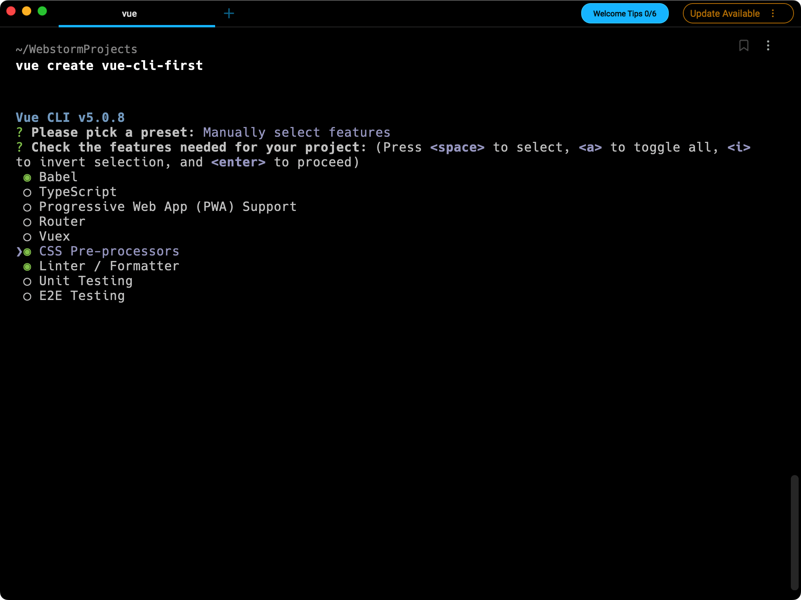

# Vue2(1)基础入门

# 一. 简介

## 1.1 什么是Vue

Vue (发音为 /vjuː/，类似 **view**) 是一款用于构建用户界面的 JavaScript 框架。它基于标准 HTML、CSS 和 JavaScript 构建，并提供了一套声明式的、组件化的编程模型，帮助你高效地开发用户界面。无论是简单还是复杂的界面，Vue 都可以胜任。

Vue 是一个框架，也是一个生态。其功能覆盖了大部分前端开发常见的需求。但 Web 世界是十分多样化的，不同的开发者在 Web 上构建的东西可能在形式和规模上会有很大的不同。考虑到这一点，Vue 的设计非常注重灵活性和“可以被逐步集成”这个特点。根据你的需求场景，你可以用不同的方式使用 Vue：

- 无需构建步骤，渐进式增强静态的 HTML
- 在任何页面中作为 Web Components 嵌入
- 单页应用 (SPA)
- 全栈 / 服务端渲染 (SSR)
- Jamstack / 静态站点生成 (SSG)
- 开发桌面端、移动端、WebGL，甚至是命令行终端中的界面

## 1.2 单文件组件

在大多数启用了构建工具的 Vue 项目中，我们可以使用一种类似 HTML 格式的文件来书写 Vue 组件，它被称为**单文件组件** (也被称为 `*.vue` 文件，英文 Single-File Components，缩写为 **SFC**)。顾名思义，Vue 的单文件组件会将一个组件的逻辑 (JavaScript)，模板 (HTML) 和样式 (CSS) 封装在同一个文件里。下面我们将用单文件组件的格式重写上面的计数器示例：

```vue
<template>
  <button @click="count++">Count is: {{ count }}</button>
</template>

<script>
export default {
  data() {
    return {
      count: 0
    }
  }
}
</script>

<style scoped>
button {
  font-weight: bold;
}
</style>
```

## 1.3 API风格

Vue 的组件可以按两种不同的风格书写：**选项式 API** 和**组合式 API**。

### 1.3.1 选项式API

**选项式 API(Options API)**，我们可以用包含多个选项的对象来描述组件的逻辑，例如 `data`、`methods` 和 `mounted`。选项所定义的属性都会暴露在函数内部的 `this` 上，它会指向当前的组件实例。

```vue
<template>
  <button @click="increment">Count is: {{ count }}</button>
</template>

<script>
export default {
  // data() 返回的属性将会成为响应式的状态
  // 并且暴露在 `this` 上
  data() {
    return {
      count: 0
    }
  },

  // methods 是一些用来更改状态与触发更新的函数
  // 它们可以在模板中作为事件监听器绑定
  methods: {
    increment() {
      this.count++
    }
  },

  // 生命周期钩子会在组件生命周期的各个不同阶段被调用
  // 例如这个函数就会在组件挂载完成后被调用
  mounted() {
    console.log(`The initial count is ${this.count}.`)
  }
}
</script>
```

### 1.3.2 组合式API

通过组合式 API，我们可以使用导入的 API 函数来描述组件逻辑。在单文件组件中，组合式 API通常会与 `<script setup>` 搭配使用。这个 `setup` attribute 是一个标识，告诉 Vue 需要在编译时进行一些处理，让我们可以更简洁地使用组合式 API。比如，`<script setup>` 中的导入和顶层变量/函数都能够在模板中直接使用。

下面是使用了组合式 API 与 `<script setup>` 改造后和上面的模板完全一样的组件：

```vue
<template>
  <button @click="increment">Count is: {{ count }}</button>
</template>

<script setup>
import { ref, onMounted } from 'vue'

// 响应式状态
const count = ref(0)

// 用来修改状态、触发更新的函数
function increment() {
  count.value++
}

// 生命周期钩子
onMounted(() => {
  console.log(`The initial count is ${count.value}.`)
})
</script>
```

两种 API 风格都能够覆盖大部分的应用场景。它们只是同一个底层系统所提供的两套不同的接口。实际上，选项式 API 是在组合式 API 的基础上实现的！关于 Vue 的基础概念和知识在它们之间都是通用的。

选项式 API 以“组件实例”的概念为中心 (即上述例子中的 `this`)，对于有面向对象语言背景的用户来说，这通常与基于类的心智模型更为一致。同时，它将响应性相关的细节抽象出来，并强制按照选项来组织代码，从而对初学者而言更为友好。

组合式 API 的核心思想是直接在函数作用域内定义响应式状态变量，并将从多个函数中得到的状态组合起来处理复杂问题。这种形式更加自由，也需要你对 Vue 的响应式系统有更深的理解才能高效使用。相应的，它的灵活性也使得组织和重用逻辑的模式变得更加强大。

# 二.快速上手

## 2.1 创建一个应用

本节中，我们将介绍如何在本地搭建 Vue [单页应用](https://cn.vuejs.org/guide/extras/ways-of-using-vue.html#single-page-application-spa)。创建的项目将使用基于 [Vite](https://vitejs.dev/) 的构建设置，并允许我们使用 Vue 的[单文件组件](https://cn.vuejs.org/guide/scaling-up/sfc.html) (SFC)。

确保你安装了最新版本的 [Node.js](https://nodejs.org/)，然后在命令行中运行以下命令 ：

```bash
npm init vue@latest
```

这一指令将会安装并执行 [create-vue](https://github.com/vuejs/create-vue)，它是 Vue 官方的项目脚手架工具。你将会看到一些诸如 TypeScript 和测试支持之类的可选功能提示：

```bash
✔ Project name: … <your-project-name>
✔ Add TypeScript? … No / Yes
✔ Add JSX Support? … No / Yes
✔ Add Vue Router for Single Page Application development? … No / Yes
✔ Add Pinia for state management? … No / Yes
✔ Add Vitest for Unit testing? … No / Yes
✔ Add Cypress for both Unit and End-to-End testing? … No / Yes
✔ Add ESLint for code quality? … No / Yes
✔ Add Prettier for code formatting? … No / Yes

Scaffolding project in ./<your-project-name>...
Done.
```

如果不确定是否要开启某个功能，你可以直接按下回车键选择 `No`。在项目被创建后，通过以下步骤安装依赖并启动开发服务器：

```bash
cd <your-project-name>
npm install
npm run dev
```

你现在应该已经运行起来了你的第一个 Vue 项目！请注意，生成的项目中的示例组件是使用[组合式 API](https://cn.vuejs.org/guide/introduction.html#composition-api) 和 `<script setup>` 编写的，而非[选项式 API](https://cn.vuejs.org/guide/introduction.html#options-api)。

当你准备将应用发布到生产环境时，请运行：

```bash
npm run build
```

此命令会在 `./dist` 文件夹中为你的应用创建一个生产环境的构建版本。关于将应用上线生产环境的更多内容，请阅读[生产环境部署指南](https://cn.vuejs.org/guide/best-practices/production-deployment.html)。

## 2.2 通过CDN使用Vue

你可以借助 script 标签直接通过 CDN 来使用 Vue：

```js
<script src="https://unpkg.com/vue@3/dist/vue.global.js"></script>
```

这里我们使用了 [unpkg](https://unpkg.com/)，但你也可以使用任何提供 npm 包服务的 CDN，例如 [jsdelivr](https://www.jsdelivr.com/package/npm/vue) 或 [cdnjs](https://cdnjs.com/libraries/vue)。当然，你也可以下载此文件并自行提供服务。

通过 CDN 使用 Vue 时，不涉及“构建步骤”。这使得设置更加简单，并且可以用于增强静态的 HTML 或与后端框架集成。但是，你将无法使用单文件组件 (SFC) 语法。

### 2.2.1 使用全局构建版本

全局构建版本_的 Vue，该版本的所有顶层 API 都以属性的形式暴露在了全局的 `Vue` 对象上。里有一个使用全局构建版本的例子：

```html
<div id="app">{{ message }}</div>
<script src="https://unpkg.com/vue@3/dist/vue.global.js"></script>
<script>
  const { createApp } = Vue
  
  createApp({
    data() {
      return {
        message: 'Hello Vue!'
      }
    }
  }).mount('#app')
</script>
```

老版本(2.6.14)：

```html
<div id="app">{{ message }}</div>
<script src="https://unpkg.com/vue@2.6.14/dist/vue.global.js"></script>
<script>
  const vm = new Vue({
		el: '#app',
    data: {
      message: 'Hello World'
    }
  })
</script>
```

### 2.2.2 使用ES模块构建版本

在该文档的其余部分我们会主要使用 [ES 模块](https://developer.mozilla.org/zh-CN/docs/Web/JavaScript/Guide/Modules)语法。大多数的现代浏览器现在都已原生支持 ES 模块。因此我们可以像这样通过 CDN 以及原生 ES 模块使用 Vue：

```html
<div id="app">{{ message }}</div>

<script type="module">
  import { createApp } from 'https://unpkg.com/vue@3/dist/vue.esm-browser.js'
  
  createApp({
    data() {
      return {
        message: 'Hello Vue!'
      }
    }
  }).mount('#app')
</script>
```

注意我们使用了 `<script type="module">`，且导入的 CDN URL 指向的是 Vue 的 **ES 模块构建版本**。

### 2.2.3 启用Import Maps

在上面的示例中，我们使用了完整的 CDN URL 来导入，但在文档的其余部分中，你将看到如下代码：

```js
import { createApp } from 'vue'
```

我们可以使用[导入映射表 (Import Maps)](https://caniuse.com/import-maps) 来告诉浏览器如何定位到导入的 `vue`：

```html
<script type="importmap">
  {
    "imports": {
      "vue": "https://unpkg.com/vue@3/dist/vue.esm-browser.js"
    }
  }
</script>

<div id="app">{{ message }}</div>

<script type="module">
  import { createApp } from 'vue'

  createApp({
    data() {
      return {
        message: 'Hello Vue!'
      }
    }
  }).mount('#app')
</script>
```

Import Maps 浏览器支持

目前只有基于 Chromium 的浏览器支持导入映射表，所以我们推荐你在学习过程中使用 Chrome 或 Edge。

# 三. 基础使用

每个 Vue 应用都是通过 [`createApp`](https://cn.vuejs.org/api/application.html#createapp) 函数创建一个新的 **应用实例**：

```js
import { createApp } from 'vue'

const app = createApp({
  /* 根组件选项 */
})
```

## 3.1 根组件

我们传入 `createApp` 的对象实际上是一个组件，每个应用都需要一个“根组件”，其他组件将作为其子组件。

如果你使用的是单文件组件，我们可以直接从另一个文件中导入根组件。

```js
import { createApp } from 'vue'
// 从一个单文件组件中导入根组件
import App from './App.vue'

const app = createApp(App)
```

## 3.2 挂载应用

应用实例必须在调用了 `.mount()` 方法后才会渲染出来。该方法接收一个“容器”参数，可以是一个实际的 DOM 元素或是一个 CSS 选择器字符串：

```html
<div id="app"></div>
```

```js
app.mount('#app')
```

应用根组件的内容将会被渲染在容器元素里面。容器元素自己将**不会**被视为应用的一部分。

`.mount()` 方法应该始终在整个应用配置和资源注册完成后被调用。同时请注意，不同于其他资源注册方法，它的返回值是根组件实例而非应用实例。

## 3.3 DOM 中的根组件模板

当在未采用构建流程的情况下使用 Vue 时，我们可以在挂载容器中直接书写根组件模板：

```html
<div id="app">
  <button @click="count++">{{ count }}</button>
</div>
```

```js
import { createApp } from 'vue'

const app = createApp({
  data() {
    return {
      count: 0
    }
  }
})

app.mount('#app')
```

当根组件没有设置 `template` 选项时，Vue 将自动使用容器的 `innerHTML` 作为模板。

## 3.4 应用配置

应用实例会暴露一个 `.config` 对象允许我们配置一些应用级的选项，例如定义一个应用级的错误处理器，它将捕获所有由子组件上抛而未被处理的错误：

```js
app.config.errorHandler = (err) => {
  /* 处理错误 */
}
```

应用实例还提供了一些方法来注册应用范围内可用的资源，例如注册一个组件：

```js
app.component('TodoDeleteButton', TodoDeleteButton)
```

这使得 `TodoDeleteButton` 在应用的任何地方都是可用的。

## 3.5 多个应用实例

应用实例并不只限于一个。`createApp` API 允许你在同一个页面中创建多个共存的 Vue 应用，而且每个应用都拥有自己的用于配置和全局资源的作用域。

```js
const app1 = createApp({
  /* ... */
})
app1.mount('#container-1')

const app2 = createApp({
  /* ... */
})
app2.mount('#container-2')
```

如果你正在使用 Vue 来增强服务端渲染 HTML，并且只想要 Vue 去控制一个大型页面中特殊的一小部分，**应避免将一个单独的 Vue 应用实例挂载到整个页面上，而是应该创建多个小的应用实例，将它们分别挂载到所需的元素上去。**

# 四. 模板语法

Vue 使用一种基于 HTML 的模板语法，使我们能够声明式地将其组件实例的数据绑定到呈现的 DOM 上。所有的 Vue 模板都是语法层面合法的 HTML，可以被符合规范的浏览器和 HTML 解析器解析。

在底层机制中，Vue 会将模板编译成高度优化的 JavaScript 代码。结合响应式系统，当应用状态变更时，Vue 能够智能地推导出需要重新渲染的组件的最少数量，并应用最少的 DOM 操作。

## 4.1 文本插值

最基本的数据绑定形式是文本插值，它使用的是“Mustache”语法 (即双大括号)：

```html
<span>Message: {{ msg }}</span>
```

双大括号标签会被替换为相应组件实例中 `msg` 属性的值。同时每次 `msg` 属性更改时它也会同步更新。

## 4.2 原始HTML

双大括号会将数据解释为纯文本，而不是 HTML。若想插入 HTML，你需要使用 [`v-html` 指令](https://cn.vuejs.org/api/built-in-directives.html#v-html)：

```html
<p>Using text interpolation: {{ rawHtml }}</p>
<p>Using v-html directive: <span v-html="rawHtml"></span></p>
```

这里我们遇到了一个新的概念。这里看到的 `v-html` attribute 被称为一个**指令**。指令由 `v-` 作为前缀，表明它们是一些由 Vue 提供的特殊 attribute，你可能已经猜到了，它们将为渲染的 DOM 应用特殊的响应式行为。这里我们做的事情简单来说就是：在当前组件实例上，将此元素的 innerHTML 与 `rawHtml` 属性保持同步。

`span` 的内容将会被替换为 `rawHtml` 属性的值，插值为纯 HTML——数据绑定将会被忽略。注意，你不能使用 `v-html` 来拼接组合模板，因为 Vue 不是一个基于字符串的模板引擎。在使用 Vue 时，应当使用组件作为 UI 重用和组合的基本单元。

## 4.3 动态属性绑定

双大括号不能在 HTML attributes 中使用。想要响应式地绑定一个 attribute，应该使用 [`v-bind` 指令](https://cn.vuejs.org/api/built-in-directives.html#v-bind)：

```html
<div v-bind:id="dynamicId"></div>
```

`v-bind` 指令指示 Vue 将元素的 `id` attribute 与组件的 `dynamicId` 属性保持一致。如果绑定的值是 `null` 或者 `undefined`，那么该 attribute 将会从渲染的元素上移除。

**可以简写为：**

```html
<div :id="dynamicId"></div>
```

## 4.4 使用JS表达式

Vue 实际上在所有的数据绑定中都支持完整的 JavaScript 表达式：

```vue
{{ number + 1 }}

{{ ok ? 'YES' : 'NO' }}

{{ message.split('').reverse().join('') }}

<div :id="`list-${id}`"></div>
```

这些表达式都会被作为 JavaScript ，以组件为作用域解析执行。

在 Vue 模板内，JavaScript 表达式可以被使用在如下场景上：

- 在文本插值中 (双大括号)
- 在任何 Vue 指令 (以 `v-` 开头的特殊 attribute) attribute 的值中

**注意：双大括号内仅支持表达式，不可以写任何语句！**

## 4.5 调用函数

可以在绑定的表达式中使用一个组件暴露的方法：

```html
<span :title="toTitleDate(date)">
  {{ formatDate(date) }}
</span>
```

## 4.6 指令

指令是带有 `v-` 前缀的特殊 attribute。Vue 提供了许多[内置指令](https://cn.vuejs.org/api/built-in-directives.html)，包括上面我们所介绍的 `v-bind` 和 `v-html`。

指令 attribute 的期望值为一个 JavaScript 表达式 (除了少数几个例外，即之后要讨论到的 `v-for`、`v-on` 和 `v-slot`)。一个指令的任务是在其表达式的值变化时响应式地更新 DOM。以 [`v-if`](https://cn.vuejs.org/api/built-in-directives.html#v-if) 为例：

```html
<p v-if="seen">Now you see me</p>
```

这里，`v-if` 指令会基于表达式 `seen` 的值的真假来移除/插入该 `<p>` 元素。

### 4.6.1 动态参数

同样在指令参数上也可以使用一个 JavaScript 表达式，需要包含在一对方括号内：

```html
<!--
注意，参数表达式有一些约束，
参见下面“动态参数值的限制”与“动态参数语法的限制”章节的解释
-->
<!-- 简写 -->
<a :[attributeName]="url"> ... </a>
```

这里的 `attributeName` 会作为一个 JavaScript 表达式被动态执行，计算得到的值会被用作最终的参数。举例来说，如果你的组件实例有一个数据属性 `attributeName`，其值为 `"href"`，那么这个绑定就等价于 `v-bind:href`。

相似地，你还可以将一个函数绑定到动态的事件名称上：

```html
<a v-on:[eventName]="doSomething"> ... </a>

<!-- 简写 -->
<a @[eventName]="doSomething"> ... </a>
```

在此示例中，当 `eventName` 的值是 `"focus"` 时，`v-on:[eventName]` 就等价于 `v-on:focus`。

### 4.6.2 动态参数的限制

动态参数中表达式的值应当是一个字符串，或者是 `null`。特殊值 `null` 意为显式移除该绑定。其他非字符串的值会触发警告。

### 4.6.3 动态参数语法的限制

动态参数表达式因为某些字符的缘故有一些语法限制，比如空格和引号，在 HTML attribute 名称中都是不合法的。例如下面的示例：

```html
<!-- 这会触发一个编译器警告 -->
<a :['foo' + bar]="value"> ... </a>
```

如果你需要传入一个复杂的动态参数，我们推荐使用[计算属性](https://cn.vuejs.org/guide/essentials/computed.html)替换复杂的表达式，也是 Vue 最基础的概念之一，我们很快就会讲到。

当使用 DOM 内嵌模板 (直接写在 HTML 文件里的模板) 时，我们需要避免在名称中使用大写字母，因为浏览器会强制将其转换为小写：

```html
<a :[someAttr]="value"> ... </a>
```

上面的例子将会在 DOM 内嵌模板中被转换为 `:[someattr]`。如果你的组件拥有 “someAttr” 属性而非 “someattr”，这段代码将不会工作。单文件组件内的模板**不**受此限制。

### 4.6.4 修饰符

修饰符是以点开头的特殊后缀，表明指令需要以一些特殊的方式被绑定。例如 `.prevent` 修饰符会告知 `v-on` 指令对触发的事件调用 `event.preventDefault()`：


