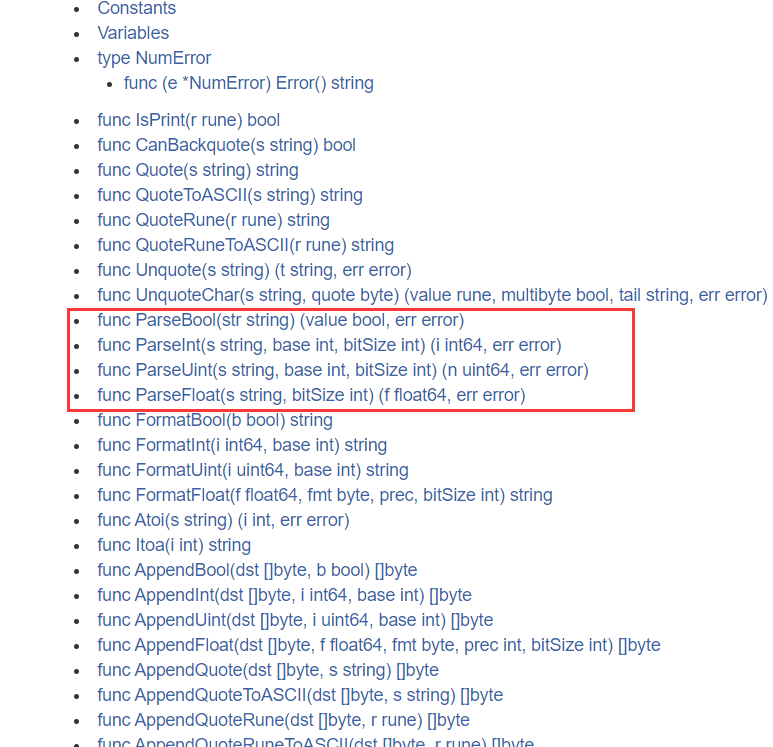

# Go程序基本结构

# 一. 变量

【1】变量的引入：
一个程序就是一个世界
不论是使用哪种高级程序语言编写程序,变量都是其程序的基本组成单位，

【2】变量的介绍：
变量相当于内存中一个数据存储空间的表示


【3】变量的使用步骤：

1. 声明
2. 赋值
3. 使用  


PS：看到VSCode的目录结构：


【4】代码练习：

```go
package main
import "fmt"
func main(){
    //1.变量的声明
    var age int
    //2.变量的赋值
    age = 18
    //3.变量的使用
    fmt.Println("age = ",age)
    //声明和赋值可以合成一句：
    var age2 int = 19
    fmt.Println("age2 = ",age2)
    // var age int = 20;
    // fmt.Println("age = ",age)
    /*变量的重复定义会报错：
                # command-line-arguments
                .\main.go:16:6: age redeclared in this block
                                previous declaration at .\main.go:6:6
        */
    //不可以在赋值的时候给与不匹配的类型
    var num int = 12.56
    fmt.Println("num = ", num)
}
```

【5】变量的4种使用方式：

【6】支持一次性声明多个变量（多变量声明）

```go
package main
import "fmt"

// 全局变量：定义在函数外的变量
var n7 = 100
var n8 = 9.7

// 设计者认为上面的全局变量的写法太麻烦了，可以一次性声明：
var (
    n9 = 500
    n10 = "netty"
)

func main() {
    // 定义在{}中的变量叫：局部变量
    // 第一种：变量的使用方式：指定变量的类型，并且赋值，
    var num int = 18
    fmt.Println(num)
    
    //第二种：指定变量的类型，但是不赋值，使用默认值 
    var num2 int
    fmt.Println(num2)
    
    //第三种：如果没有写变量的类型，那么根据=后面的值进行判定变量的类型 （自动类型推断）
    var num3 = "tom"
    fmt.Println(num3)
    
    //第四种：省略var，注意 := 不能写为 =   
    sex := "男"
    fmt.Println(sex)
    fmt.Println("------------------------------------------------------------------")
    
    //声明多个变量：
    var n1,n2,n3 int
    fmt.Println(n1)
    fmt.Println(n2)
    fmt.Println(n3)
    
    var n4,name,n5 = 10,"jack",7.8
    fmt.Println(n4)
    fmt.Println(name)
    fmt.Println(n5)
    
    n6,height := 6.9,100.6
    fmt.Println(n6)
    fmt.Println(height)
    fmt.Println(n7)
    fmt.Println(n8)
    fmt.Println(n9)
    fmt.Println(n10)
}
```


# 二. 数据类型

## 2.1 基本数据类型

### 2.1.1 整型

【1】整数类型介绍：
简单的说，就是用于存放整数值的，比如10,-45,6712等等。

【2】有符号整数类型：


PS:127怎么算出来的？
01111111 -->二进制 ---》转为十进制：
   1\*2^6^   +   1\**2^5^  +  1\*2^4^  +   1*\*2^3^  +   1\*2^2^  +   1\*2^1^  +    1\*2^0^
 = 64      +   32         +    16          +   8        +      4       +    2     +   1
= 127

PS：-128怎么算出来的？
		  10000000 --->二进制 --->一看就是个负数 

 10000000 --》负数的二进制

减1：01111111
		 取反：10000000     ---》得到一个正数    2^7 = 128
		 加负号：-128


代码测试超出范围：


【3】无符号整数类型：


表数范围的边界计算：
		 11111111= 2^7+127 = 128 + 127 = 255
		 00000000 = 0 
		 超出边界报错：


【4】其他整数类型：


PS：Golang的整数类型，默认声明为int类型


PS :变量占用的字节数：


【5】这么多整数类型，使用的时候该如何选择呢？
Golang程序中整型变量在使用时,遵守保小不保大的原则,
即:在保证程序正确运行下,尽量使用占用空间小的数据类型


### 2.1.2 浮点类型

【1】浮点类型介绍：
简单的说，就是用于存放小数值的，比如3.14、0.28、-7.19等等。  

【2】浮点类型种类：


PS: 底层存储空间和操作系统无关
		  PS: 浮点类型底层存储：符号位+指数位+尾数位，所以尾数位只是存了 一个大概，很可能会出现精度的损失

【3】代码：

```go
package main
import "fmt"
func main(){
    //定义浮点类型的数据：
    var num1 float32 = 3.14
    fmt.Println(num1)
    //可以表示正浮点数，也可以表示负的浮点数
    var num2 float32 = -3.14
    fmt.Println(num2)
    //浮点数可以用十进制表示形式，也可以用科学计数法表示形式  E 大写小写都可以的
    var num3 float32 = 314E-2 
    fmt.Println(num3)
    var num4 float32 = 314E+2
    fmt.Println(num4)
    var num5 float32 = 314e+2
    fmt.Println(num5)
    var num6 float64 = 314e+2
    fmt.Println(num6)
    //浮点数可能会有精度的损失，所以通常情况下，建议你使用：float64 
    var num7 float32 = 256.000000916
    fmt.Println(num7)
    var num8 float64 = 256.000000916
    fmt.Println(num8)
    //golang中默认的浮点类型为：float64 
    var num9 = 3.17
    fmt.Printf("num9对应的默认的类型为：%T",num9)
}
```


### 2.1.3 字符类型

【1】Golang中没有专门的字符类型，如果要存储单个字符(字母)，一般使用byte来保存。

【2】Golang中字符使用UTF-8编码
			

```go
package main
import "fmt"
func main(){
    //定义字符类型的数据：
    var c1 byte = 'a'
    fmt.Println(c1)  //97
    var c2 byte = '6'
    fmt.Println(c2)  // 54
    var c3 byte = '('
    fmt.Println(c3 + 20) // 40
    // 字符类型，本质上就是一个整数，也可以直接参与运算，输出字符的时候，会将对应的码值做一个输出
    // 字母，数字，标点等字符，底层是按照ASCII进行存储。
    var c4 int = '中'
    fmt.Println(c4)
    
    // 汉字字符，底层对应的是Unicode码值
    // 对应的码值为20013，byte类型溢出，能存储的范围：可以用int
    // 总结：Golang的字符对应的使用的是UTF-8编码（Unicode是对应的字符集，
    // UTF-8是Unicode的其中的一种编码方案）
    var c5 byte = 'A'
    // 想显示对应的字符，必须采用格式化输出
    fmt.Printf("c5对应的具体的字符为：%c", c5)
}
```


### 2.1.4 布尔类型

【1】布尔类型也叫bool类型，bool类型数据只允许取值true和false

【2】布尔类型占1个字节。

【3】布尔类型适于逻辑运算，一般用于程序流程控制

【4】代码：

```go
package main
import "fmt"
func main() {
    //测试布尔类型的数值：
    var flag01 bool = true
    fmt.Println(flag01)
    var flag02 bool = false
    fmt.Println(flag02)
    var flag03 bool = 5 < 9
    fmt.Println(flag03)
}
```


### 2.1.5 字符串类型

【1】介绍：字符串就是一串固定长度的字符连接起来的字符序列。

【2】字符串的使用：

```go
func main() {
    // 1.定义一个字符串：
    var s1 string = "你好全面拥抱Golang"
    fmt.Println(s1)
    
    fmt.Println(s2)
    // 2.字符串的表示形式：
    //（1）如果字符串中没有特殊字符，字符串的表示形式用双引号
    //var s3 string = "asdfasdfasdf"
    //（2）如果字符串中有特殊字符，字符串的表示形式用反引号 ``
    var s4 string = `
        package main
        import "fmt"

        func main(){
                //测试布尔类型的数值：
                var flag01 bool = true
                fmt.Println(flag01)

                var flag02 bool = false
                fmt.Println(flag02)

                var flag03 bool = 5 < 9
                fmt.Println(flag03)
        }
        `
    fmt.Println(s4)
    
    // 3.字符串的拼接效果：
    var s5 string = "abc" + "def"
    s5 += "hijk"
    fmt.Println(s5)
    
    // 当一个字符串过长的时候：注意：+保留在上一行的最后
    var s6 string = "abc" + "def" + "abc" + "def" + "abc" + "def" + "abc" +
    "def"+ "abc" + "def" + "abc" + "def"+ "abc" + "def" + "abc" + "def"+
    "abc" + "def" + "abc" + "def"+ "abc" + "def" + "abc" + "def"+ "abc" +
    "def" + "abc" + "def"+ "abc" + "def" + "abc" + "def"+ "abc" + "def" + 
    "abc" + "def"+ "abc" + "def"
    fmt.Println(s6)
}

```

【3】注意事项:

1. **字符串是不可变的：指的是字符串一旦定义好，其中的字符的值不能改变**
2. **如果字符串中没有特殊字符，字符串的表示形式用双引号**
3. **如果字符串中有特殊字符，字符串的表示形式用反引号 ``**
4. **当一个字符串过长的时候：注意：+保留在上一行的最后**

### 2.1.6 基本数据类型默认值

【1】在Golang中数据类型都有一个默认值，当程序员没有赋值时，就会保留默认值(默认值又叫零值)。


【2】代码验证:


### 2.1.7 基本数据类型之间转换

【1】Go在不同类型的变量之间赋值时需要显式转换，并且只有显式转换(强制转换)。

【2】语法：

表达式 **T(v)** 将值 **v** 转换为类型 **T**

**T** : 就是数据类型

**v** : 就是需要转换的变量

【3】案例展示： 

```go
func main() {
    // 进行类型转换：
    var n1 int = 100
    // var n2 float32 = n1  在这里自动转换不好使，比如显式转换
    fmt.Println(n1)
    // fmt.Println(n2)
    var n2 float32 = float32(n1)
    fmt.Println(n2)
    // 注意：n1的类型其实还是int类型，只是将n1的值100转为了float32而已，n1还是int的类型
    fmt.Printf("%T", n1)  //int
    fmt.Println()
    // 将int64转为int8的时候，编译不会出错的，但是会数据的溢出
    var n3 int64 = 888888
    var n4 int8 = int8(n3)
    fmt.Println(n4)//56
    var n5 int32 = 12
    var n6 int64 = int64(n5) + 30  //一定要匹配=左右的数据类型
    fmt.Println(n5)
    fmt.Println(n6)
    var n7 int64 = 12
    var n8 int8 = int8(n7) + 127  //编译通过，但是结果可能会溢出
    // var n9 int8 = int8(n7) + 128 //编译不会通过
    fmt.Println(n8)
    // fmt.Println(n9)
}
```


### 2.1.8 基本数据类型转为string

【1】基本数据类型和string的转换介绍
在程序开发中，我们经常需要将基本数据类型转成string类型。或者将string类型转成基本数据类型。

【2】基本类型转string类型
方式1: `fmt.Sprintf("%参数", 表达式)`    ---》 重点练习这个，推荐方式
方式2: 使用strconv包的函数   

【3】代码测试：

==方式1==：


```go
func main() {
    var n1 int = 19
    var n2 float32 = 4.78
    var n3 bool = false
    var n4 byte = 'a'
    var s1 string = fmt.Sprintf("%d", n1)
    fmt.Printf("s1对应的类型是：%T ，s1 = %q \n",s1, s1)
    var s2 string = fmt.Sprintf("%f",n2)
    fmt.Printf("s2对应的类型是：%T ，s2 = %q \n",s2, s2)
    var s3 string = fmt.Sprintf("%t",n3)
    fmt.Printf("s3对应的类型是：%T ，s3 = %q \n",s3, s3)
    var s4 string = fmt.Sprintf("%c",n4)
    fmt.Printf("s4对应的类型是：%T ，s4 = %q \n",s4, s4)
}
```

==方式2==:


```go
package main
import(
    "fmt"
    "strconv"
)
func main() {
    var n1 int = 18
    var s1 string = strconv.FormatInt(int64(n1),10)
    // 参数：第一个参数必须转为int64类型，第二个参数指定字面值的进制形式为十进制
    fmt.Printf("s1对应的类型是：%T ，s1 = %q \n",s1, s1)
    var n2 float64 = 4.29
    var s2 string = strconv.FormatFloat(n2,'f',9,64)
    
    // 第二个参数：'f'（-ddd.dddd）  第三个参数：9 保留小数点后面9位  
    // 第四个参数：表示这个小数是float64类型
    fmt.Printf("s2对应的类型是：%T ，s2 = %q \n", s2, s2)
    var n3 bool = true
    var s3 string = strconv.FormatBool(n3)
    fmt.Printf("s3对应的类型是：%T ，s3 = %q \n", s3, s3)
}
```


### 2.1.9 string转为基本数据类型

【1】string类型转基本类型

==方式==: 使用strconv包的函数

   

【2】测试：


```go
package main
import(
    "fmt"
    "strconv"
)
func main() {
    // string-->bool
    var s1 string = "true"
    var b bool
    // ParseBool这个函数的返回值有两个：(value bool, err error)
    // value就是我们得到的布尔类型的数据，err出现的错误
    // 我们只关注得到的布尔类型的数据，err可以用_直接忽略
    b, _ = strconv.ParseBool(s1)
    fmt.Printf("b的类型是：%T,b=%v \n",b,b)
    // string ---> int64
    var s2 string = "19"
    var num1 int64
    num1,_ = strconv.ParseInt(s2,10,64)
    fmt.Printf("num1的类型是：%T,num1=%v \n",num1,num1)
    
    // string-->float32/float64
    var s3 string = "3.14"
    var f1 float64
    f1,_ = strconv.ParseFloat(s3,64)
    fmt.Printf("f1的类型是：%T,f1=%v \n",f1,f1)
    
    // 注意：string向基本数据类型转换的时候，
    // 一定要确保string类型能够转成有效的数据类型，
    // 否则最后得到的结果就是按照对应类型的默认值输出
    var s4 string = "golang"
    var b1 bool
    b1, _ = strconv.ParseBool(s4)
    fmt.Printf("b1的类型是：%T,b1=%v \n",b1,b1)
    var s5 string = "golang"
    var num2 int64
    num2, _ = strconv.ParseInt(s5,10,64)
    fmt.Printf("num2的类型是：%T,num2=%v \n",num2,num2)
}

```

## 2.2 复杂数据类型

### 2.2.1 指针

【1】基本数据类型和内存：

```go
package main
import(
    "fmt"
)
func main() {
    var age int = 18
    //&符号+变量 就可以获取这个变量内存的地址
    fmt.Println(&age) //0xc0000a2058
}
```

==内存==：


【2】指针变量：

```go
func main() {
    var age int = 18
    // &符号+变量 就可以获取这个变量内存的地址
    fmt.Println(&age) //0xc0000a2058
    // 定义一个指针变量：
    // var代表要声明一个变量
    // ptr 指针变量的名字
    // ptr对应的类型是：*int 是一个指针类型 （可以理解为 指向int类型的指针）
    // &age就是一个地址，是ptr变量的具体的值
    var ptr *int = &age
    fmt.Println(ptr)
    fmt.Println("ptr本身这个存储空间的地址为：", &ptr)
    // 想获取ptr这个指针或者这个地址指向的那个数据：
    fmt.Printf("ptr指向的数值为：%v", *ptr) // ptr指向的数值为：18
}
```

==内存图==:


总结：最重要的就是两个符号：

1. & 取内存地址
2. \* 根据地址取值

### 2.2.2 指针细节

【1】可以通过指针改变指向值

```go
func main() {
    var num int = 10
    fmt.Println(num)
    var ptr *int = &num
    *ptr = 20
    fmt.Println(num)
}
```

【2】指针变量接收的一定是地址值


【3】指针变量的地址不可以不匹配


PS:*float32意味着这个指针指向的是float32类型的数据，但是&num对应的是int类型的不可以。*

【4】基本数据类型（又叫值类型）都有对应的指针类型,形式为 \* 数据类型，比如int的对应的指针就是\*int, float32对应的指针类型就是*float32。依次类推。

## 2.3 标识符

【1】标识符：读音   biao zhi fu

【2】什么是标识符？ 
         变量，方法等,只要是起名字的地方,那个名字就是标识符  var age int = 19   var price float64 = 9.8. "标识"是一个多音词，既可以读 biāoshí，也可以读 biāozhì。当“标识”读作 “biāoshí” 的时候，指标示识别或用来识别的记号；当“标识”读作“biāozhì”的时候，指表明特征的记号或事物，也可指表明某种特征。标识（zhì），同“标志”。

【3】标识符定义规则：

1. 三个可以（组成部分）：数字，字母，下划线_  

PS:字母含义比较宽泛，使用汉字也是可以的：


不建议使用中文，建议用字母：26字母

2. 四个注意：不可以以数字开头，严格区分大小写，不能包含空格，不可以使用Go中的保留关键字 

3. 见名知意：增加可读性

4. 下划线"_"本身在Go中是一个特殊的标识符，称为空标识符。可以代表任何其它的标识符，但是它对应的值会被忽略(比如:忽略某个返回值)。所以仅能被作为占位符使用，不能单独作为标识符使用。

5. 起名规则：

   为什么之前在定义源文件的时候，一般我们都用package main 包 ? main包是一个程序的入口包，所以你main函数它所在的包建议定义为main包，如果不定义为main包，那么就不能得到可执行文件。

   - **尽量保持package的名字和目录保持一致**

   - **和标准库不要冲突**

   -  **如果变量名、函数名、常量名首字母大写**，**则可以被其他的包访问;如果首字母小写，则只能在本包中使用**  （利用首字母大写小写完成权限控制）

   - 变量名、函数名、常量名 : **采用驼峰法**。就是单词按照大写区分开 

## 2.4 关键字和预定义标识符

【1】关键字就是程序发明者规定的有特殊含义的单词，又叫保留字。 

go语言中一共有25个关键字。


【2】预定义标识符：一共36个预定标识符，包含基础数据类型和系统内嵌函数


