# 基本Go程序处理

# 一. 运算符

Go语言有几十种运算符，被分成十几个级别，有的运算符优先级不同，有的运算符优先级相同，请看下表。

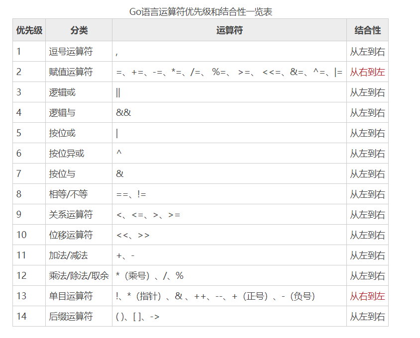

# 二. 获取控制台输入内容

【1】介绍：在编程中，需要接收用户输入的数据，就可以使用键盘输入语句来获取。

【2】API：

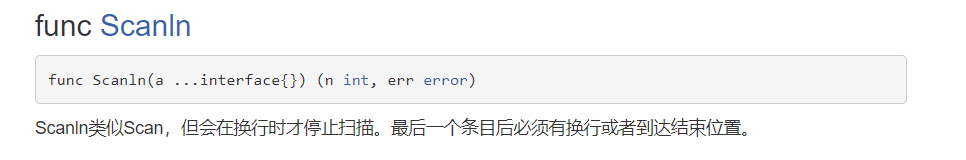

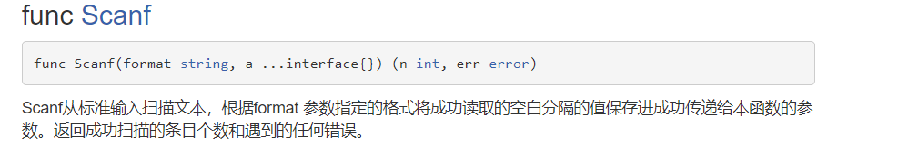

【3】代码练习：

```go
package main
import "fmt"
func main() {
    // 实现功能：键盘录入学生的年龄，姓名，成绩，是否是VIP
    // 方式1：Scanln
    var age int
    // fmt.Println("请录入学生的年龄：")
    // 传入age的地址的目的：在Scanln函数中，对地址中的值进行改变的时候，实际外面的age被影响了
    // fmt.Scanln(&age)//录入数据的时候，类型一定要匹配，因为底层会自动判定类型的
    var name string
    // fmt.Println("请录入学生的姓名：")
    // fmt.Scanln(&name)
    var score float32
    // fmt.Println("请录入学生的成绩：")
    // fmt.Scanln(&score)
    var isVIP bool
    // fmt.Println("请录入学生是否为VIP：")
    // fmt.Scanln(&isVIP)
    // 将上述数据在控制台打印输出：
    // fmt.Printf("学生的年龄为：%v,姓名为：%v,成绩为：%v,是否为VIP:%v",age,name,score,isVIP)
    // 方式2：Scanf
    fmt.Println("请录入学生的年龄，姓名，成绩，是否是VIP，使用空格进行分隔")
    fmt.Scanf("%d %s %f %t", &age, &name, &score, &isVIP)
    // 将上述数据在控制台打印输出：
    fmt.Printf("学生的年龄为：%v,姓名为：%v,成绩为：%v,是否为VIP:%v",age,name,score,isVIP)
}
```


# 三. 流程控制

【1】流程控制的作用：
流程控制语句是用来控制程序中各语句执行顺序的语句，可以把语句组合成能完成一定功能的小逻辑模块。

【2】控制语句的分类：
控制语句分为三类：顺序、选择和循环。
“顺序结构”代表“先执行a，再执行b”的逻辑。
“条件判断结构”代表“如果…，则…”的逻辑。
“循环结构”代表“如果…，则再继续…”的逻辑。
  三种流程控制语句就能表示所有的事情！不信，你可以试试拆分你遇到的各种事情。这三种基本逻辑结构是相互支撑的，它们共同构成了算法的基本结构，无论怎样复杂的逻辑结构，都可以通过它们来表达。所以任何一种高级语言都具备上述两种结构。
本章是大家真正进入编程界的“门票”。  

【3】流程控制的流程：

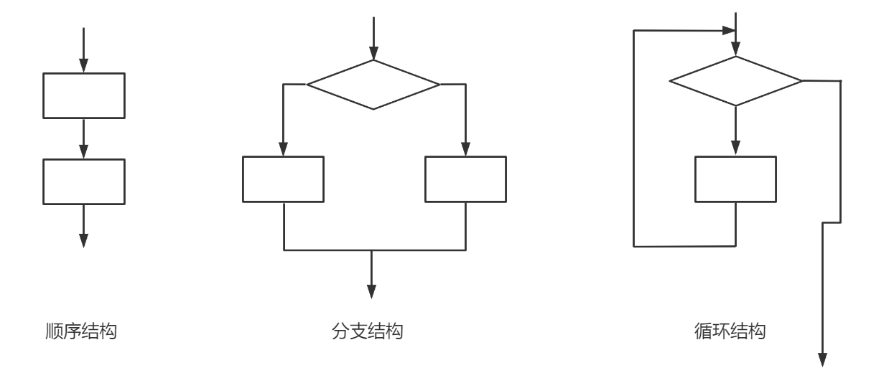

## 3.1 分支结构

### 3.1.1 单分支

【1】基本语法

```go
if condition-expression {
    logic code
}
```

当条件表达式为ture时，就会执行得的代码。

- 条件表达式左右的 () 可以不写，**也建议不写** 

- if 和表达式中间，**一定要有空格**
- 在Golang中，**{} 大括号是必须有的,就算你只写一行代码。**

【2】代码练习：

```go
package main
import "fmt"
func main() {
    // 实现功能：如果口罩的库存小于30个，提示：库存不足：
    // var count int = 100
    // 在golang里，if后面可以并列的加入变量的定义：
    if count := 20;count < 30 {
        fmt.Println("对不起，口罩存量不足")
    }
}
```


### 3.1.2 双分支

【1】基本语法

```go
if condition-expression {
   logic code1
} else {
   logic code2
}
```


当条件表达式成立，即执行逻辑代码1，否则执行逻辑代码2。**{} 也是必须有的**。

PS：**下面的格式是错误的 else 必须紧接着上一个 if 的大括号结尾**：

```go
if condition-expression {
   logic code1
}
else {
   logic code2
} 
```

PS：空格加上，美观规范

【2】代码练习：

```go
package main
import "fmt"
func main() {
    var count int = 70
    if count < 30 { //这个条件表达式返回的是true的话，后面{}执行了
        fmt.Println("库存不足")
    } else {  // count >= 30
        fmt.Println("库存充足")
    }   
}
```


### 3.1.3 多分支

【1】基本语法:

```go
if condition-expression1 {
    ...
} else if condition-expression1 {
    ...
} else if ... {
	...
} else {
    ...
}
```


【2】代码练习：

```go
package main
import "fmt"
func main() {
    var score int = 18
    if score >= 90 {
        fmt.Println("您的成绩为A级别")
    } else if score >= 80 {  // else隐藏：score < 90
    	fmt.Println("您的成绩为B级别")
    } else if score >= 70 {  // score < 80
     	fmt.Println("您的成绩为C级别")
    } else if score >= 60 {  // score < 70
    	fmt.Println("您的成绩为D级别")
    } else {  // score < 60
   		fmt.Println("您的成绩为E级别")
    }
}
```


### 3.1.4 switch分支

【1】基本语法：

```go
switch expression {
    case 值1, 值2,.….:
    	语句块1
    case 值3, 值4,...:
    	语句块2
    ....
    default:
    	语句块
}
```


【2】代码练习：

```go
package main
import "fmt"
func main() {
    var score int = 187
    // 根据分数判断等级：
    // switch后面是一个表达式，这个表达式的结果依次跟case进行比较，满足结果的话就执行冒号后面的代码。
    // default是用来“兜底”的一个分支，其它case分支都不走的情况下就会走default分支
    // default分支可以放在任意位置上，不一定非要放在最后。
    switch score / 10 {
        case 10 :
        	fmt.Println("您的等级为A级")
        case 9 :
        	fmt.Println("您的等级为A级")
        case 8 :
        	fmt.Println("您的等级为B级")
        case 7 :
        	fmt.Println("您的等级为C级")
        case 6 :
        	fmt.Println("您的等级为D级")
        case 5 :
        	fmt.Println("您的等级为E级")
        case 4 :
        	fmt.Println("您的等级为E级")
        case 3 :
        	fmt.Println("您的等级为E级")
        case 2 :
        	fmt.Println("您的等级为E级")
        case 1 :
        	fmt.Println("您的等级为E级")
        case 0 :
        	fmt.Println("您的等级为E级")
        default:
        	fmt.Println("您的成绩有误")
    }
}
```

【3】注意事项：

- **switch后是一个表达式(即:常量值、变量、一个有返回值的函数等都可以)**

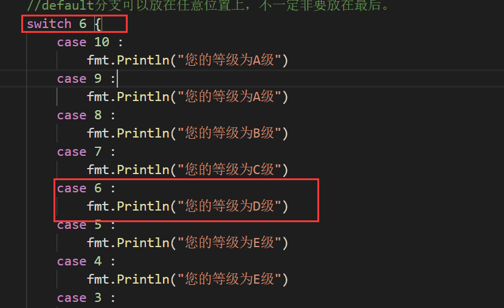

- **case后面的值如果是常量值(字面量)，则要求不能重复**

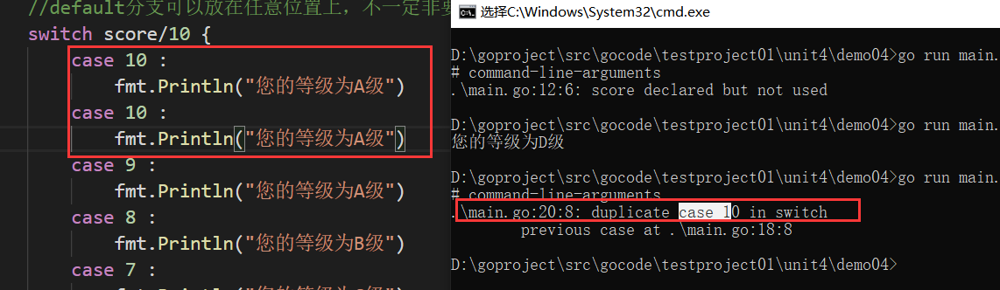

- case后的各个值的数据类型，必须和 switch 的表达式数据类型一致,如下图代码编译不通过.


- case 后面可以带多个值，使用逗号间隔。比如 case 值1,值2...

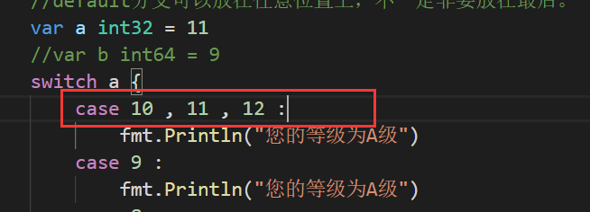

- case 后面不需要带 break。 
- default 语句不是必须的，位置也是随意的。
- switch 后也可以不带表达式，当做 if 分支来使用

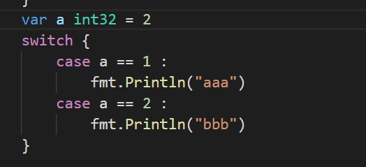

- switch后也可以直接声明/定义一个变量，分号结束，不推荐

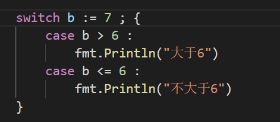

- switch穿透，利用fallthrough关键字，如果在case语句块后增加fallthrough ,则会继续执行下一个case,也叫switch穿透。

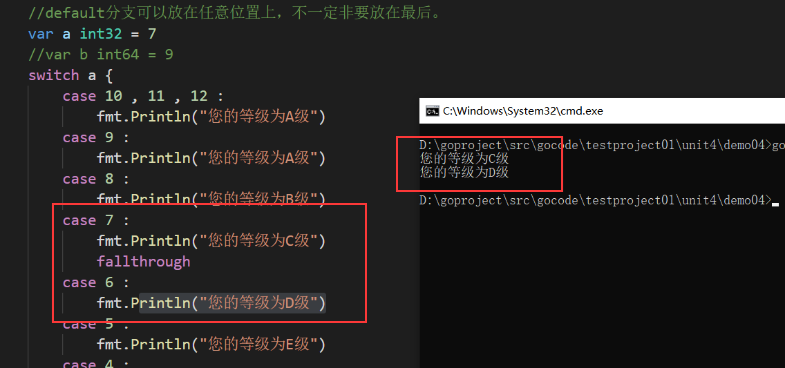


## 3.2 循环结构

### 3.2.1 for循环

【1】语法结构：

```go
for init-expression; bool-expression; iterator {
    circulation body
}
```

for循环语句是支持迭代的一种通用结构，是最有效、最灵活的循环结构。for循环在第一次反复之前要进行初始化，即执行初始表达式；随后，对布尔表达式进行判定，若判定结果为true，则执行循环体，否则，终止循环；最后在每一次反复的时候，进行某种形式的“步进”，即执行迭代因子。

- 初始化部分设置循环变量的初值
- 条件判断部分为任意布尔表达式
- 迭代因子控制循环变量的增减
- for循环在执行条件判定后，先执行的循环体部分，再执行步进。

for循环结构的流程图如图所示：

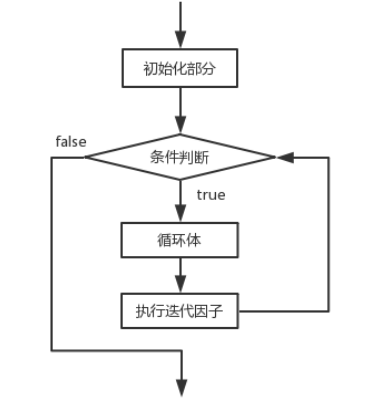

【2】代码展示：

```go
package main
import "fmt"
func main() {
    var sum int = 0
    for i := 1 ; i <= 5 ; i++ {
        sum += i
    }
    fmt.Println(sum)
    // 注意：for的初始表达式 不能用var定义变量的形式，要用:=
    // 注意：for循环实际就是让程序员写代码的效率高了，但是底层该怎么执行还是怎么执行的，
    // 底层效率没有提高，只是程序员写代码简洁了而已
}
```

【3】非固定格式：

```go
package main
import "fmt"
func main() {
    i := 1  // 变量的初始化
    for i<=5 {  // 条件表达式。判断条件
        fmt.Println("你好 Golang")  // 循环体
        i++  // 迭代
    }
}
```

【4】死循环：

```go
package main
import "fmt"
func main() {
    // 死循环：
    // for {
    // 	fmt.Println("你好 Golang")
    // }
    for ;; {
        fmt.Println("你好 Golang")
    }
    // 在控制台中结束死循环：ctrl + c
}
```


### 3.2.2 for ... range

（键值循环） for range结构是Go语言特有的一种的迭代结构，在许多情况下都非常有用，for range 可以遍历数组、切片、字符串、map 及通道，for range 语法上类似于其它语言中的 foreach 语句，一般形式为：

```go
for key, val := range coll {
    ...
}
```

代码展示：

```go
package main
import "fmt"
func main(){
    // 定义一个字符串：
    var str string = "hello golang你好"
    // 方式1：普通for循环：按照字节进行遍历输出的 （暂时先不使用中文）
    // for i := 0; i < len(str); i++ {  // i:理解为字符串的下标
    // 	fmt.Printf("%c \n", str[i])
    // }
    // 方式2：for range
    for i, value := range str {
        fmt.Printf("索引为：%d,具体的值为：%c \n", i, value)
    }
    // 对str进行遍历，遍历的每个结果的索引值被i接收，每个结果的具体数值被value接收
    // 遍历对字符进行遍历的
}
```

for-range的结果：

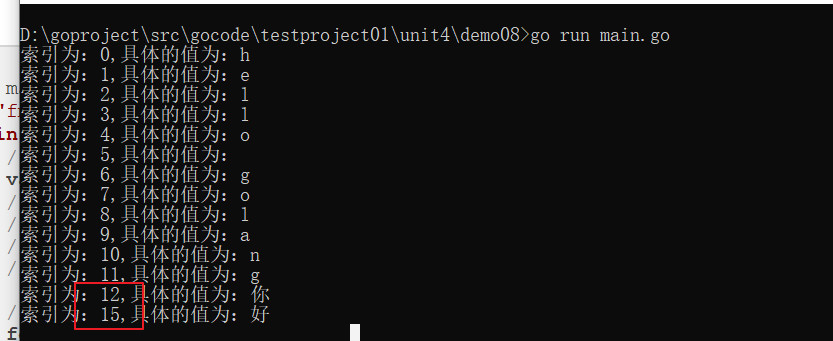


## 3.3 循环关键字

### 3.3.1 break

【1】感受break在循环中的作用：

```go
func main() {
    var sum int = 0
    for i := 1 ; i <= 100 ; i++ {
        sum += i
        fmt.Println(sum)
        if sum >= 300 {
            //停止正在执行的这个循环：
            break 
        }
    }
    fmt.Println("-----ok")
}
```

总结：

1. switch分支中，每个case分支后都用break结束当前分支，但是在go语言中break可以省略不写。
2. break可以结束正在执行的循环

【2】深入理解：

```go
func main() {
    // 双重循环：
    for i := 1; i <= 5; i++ {
        for j := 2; j <= 4; j++ {
            fmt.Printf("i: %v, j: %v \n",i,j)
            if i == 2 && j == 2 {
                break
            }
        }
    }
}
```

总结：**break 的作用结束离当前的循环,也就是一层循环**

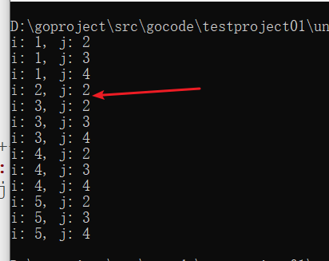

【3】标签的使用展示：

```go
func main(){ 
    // 双重循环：
    label:
    for i := 1; i <= 5; i++ {
        for j := 2; j <= 4; j++ {
            fmt.Printf("i: %v, j: %v \n",i,j)
            if i == 2 && j == 2 {
                break label   //结束指定标签对应的循环
            }
        }
    }
    fmt.Println("-----ok")
}
```

❗ 注意：如果那个标签没有使用到 的话，那么标签不用加，否则报错.

### 3.3.2 continue

【1】continue的作用：

```go
func main() {
    // 功能：输出1-100中被6整除的数：
    for i := 1; i <= 100; i++ {
        if i % 6 != 0 {
            continue //结束本次循环，继续下一次循环
        }
        fmt.Println(i)
    }
}
```

【2】深入理解：

```go
func main() {
    // 双重循环：
    for i := 1; i <= 5; i++ {
        for j := 2; j <= 4; j++ {			
            if i == 2 && j == 2 {
                continue
            }
            fmt.Printf("i: %v, j: %v \n",i,j)
        }
    }
    fmt.Println("-----ok")
}
```


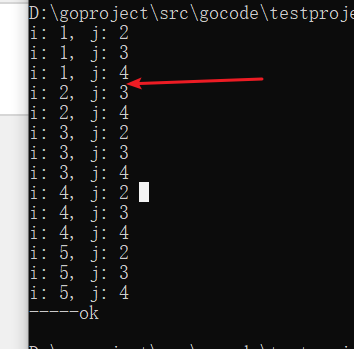

结论：continue的作用是结束当前本次执行的那个循环，继续离当前的循环

【3】标签的作用：

```go
func main() {
    // 双重循环：
    label:
    for i := 1; i <= 5; i++ {
        for j := 2; j <= 4; j++ {			
            if i == 2 && j == 2 {
                continue label
            }
            fmt.Printf("i: %v, j: %v \n",i,j)
        }
    }
    fmt.Println("-----ok")
}
```


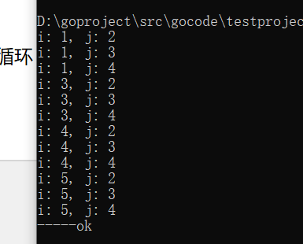


### 3.3.3 goto

【1】Golang的 goto 语句可以无条件地转移到程序中指定的行。

【2】goto语句通常与条件语句配合使用。可用来实现条件转移。

【3】在Go程序设计中一般不建议使用goto语句，以免造成程序流程的混乱。

【4】代码展示：

```go
func main() {
    fmt.Println("hello golang1")
    fmt.Println("hello golang2")
    if 1 == 1 {
        goto label1 //goto一般配合条件结构一起使用
    }
    fmt.Println("hello golang3")
    fmt.Println("hello golang4")
    fmt.Println("hello golang5")
    fmt.Println("hello golang6")
    label1:
    fmt.Println("hello golang7")
    fmt.Println("hello golang8")
    fmt.Println("hello golang9")
}
```


### 3.3.4 return

==return== 关键字用来终止当前的函数:

```go
func main() {
    for i := 1; i <= 100; i++ {
        fmt.Println(i)
        if i == 14 {
            return //结束当前的函数
        }
    }
    fmt.Println("hello golang")
}
```

