# 数组

# 一. 数组的引入

```go
func main() {
    var scores [5]int
    scores[0] = 95
    scores[1] = 91
    scores[2] = 39
    scores[3] = 60
    scores[4] = 21
   
    sum := 0
    for i := 0; i < len(scores); i++ {
        sum += scores[i]
    }
    avg := sum / len(scores)
    fmt.Printf("成绩的总和为：%v,成绩的平均数为：%v", sum, avg)
}
```


数组声明格式:

`var 数组名 [数组大小]数据类型`


# 二. 内存分析

【1】代码：

```go
func main() {
    // 声明数组：
    var arr [3]int16
    // 获取数组的长度：
    fmt.Println(len(arr))
    // 打印数组：
    fmt.Println(arr)  // [0 0 0]
    // 证明arr中存储的是地址值：
    fmt.Printf("arr的地址为：%p", &arr)
    // 第一个空间的地址：
    fmt.Printf("arr的地址为：%p", &arr[0])
    // 第二个空间的地址：
    fmt.Printf("arr的地址为：%p", &arr[1])
    // 第三个空间的地址：
    fmt.Printf("arr的地址为：%p", &arr[2])
}
```

运行结果：

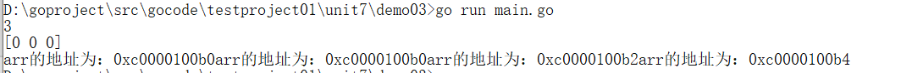

【2】内存分析：

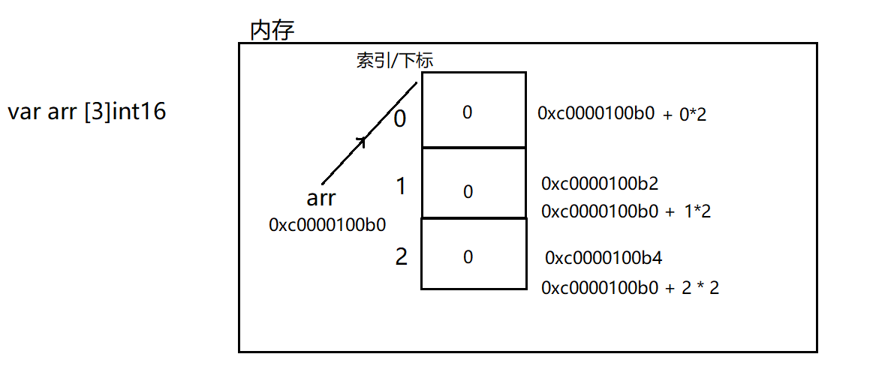

PS : 数组每个空间占用的字节数取决于数组类型

【3】赋值内存：（数组是值类型，在栈中开辟内存）

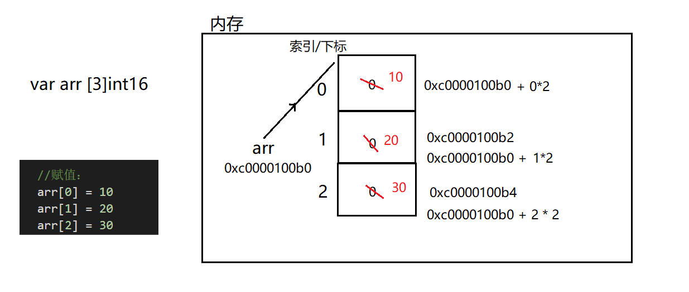


# 三. 数组遍历

【1】普通for循环

【2】键值循环

（键值循环） for range结构是Go语言特有的一种的迭代结构，在许多情况下都非常有用，for range 可以遍历数组、切片、字符串、map 及通道，for range 语法上类似于其它语言中的 foreach 语句，一般形式为：

```go
for key, val := range coll {
    ...
}
```

注意：

（1）coll就是你要的数组

（2）每次遍历得到的索引用key接收，每次遍历得到的索引位置上的值用val

（3）key、value的名字随便起名  k、v   key、value  

（4）key、value属于在这个循环中的局部变量

（5）你想忽略某个值：用_就可以了：

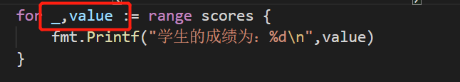


# 四. 初始化方式

```go
func main() {
    // 第一种：长度确定
    var arr1 [3]int = [3]int{3,6,9}
    fmt.Println(arr1)
    // 第二种：隐式类型推断
    arr2 := [3]int{1,4,7}
    fmt.Println(arr2)
    // 第三种：长度不确定,编译器自动确定长度
    var arr3 = [...]int{4,5,6,7}
    fmt.Println(arr3)
    // 第四种：长度不确定,指定位置为固定值
    var arr4 = [...]int{2:66, 0:33, 1:99, 3:88}
    fmt.Println(arr4)
}
```


# 五. 注意事项

【1】长度属于类型的一部分 ：

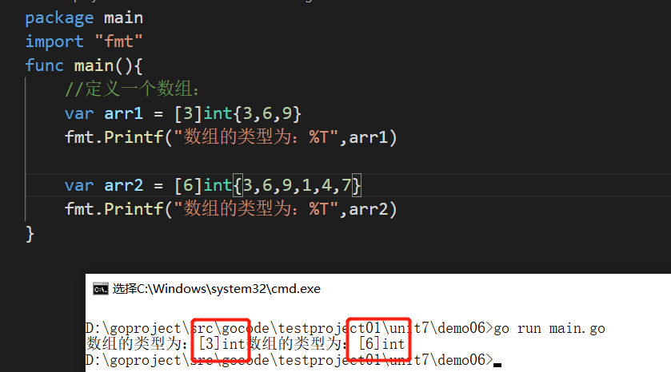

【2】Go中数组属值类型，在默认情况下是值传递，因此会进行值拷贝。

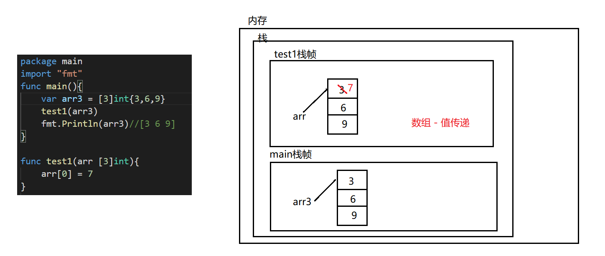

【3】如想在其它函数中，去修改原来的数组，可以使用引用传递(指针方式)。

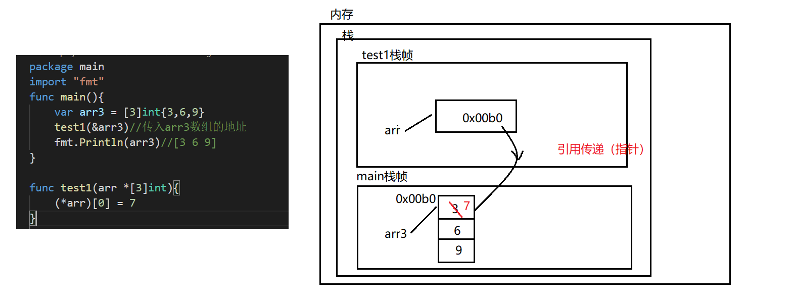


# 六. 二维数组

【1】二维数组的定义，并且有默认初始值：

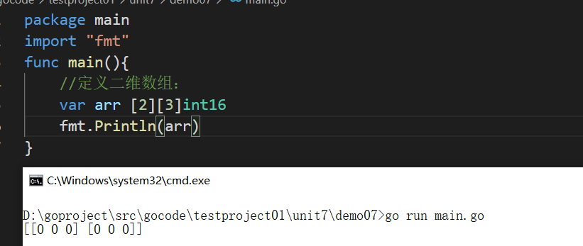


【2】二维数组内存：

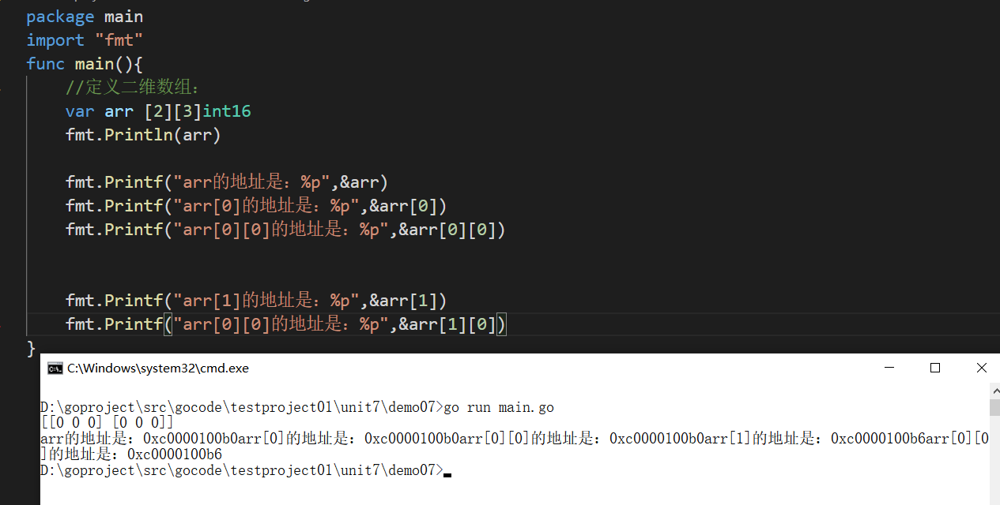


【3】赋值操作：

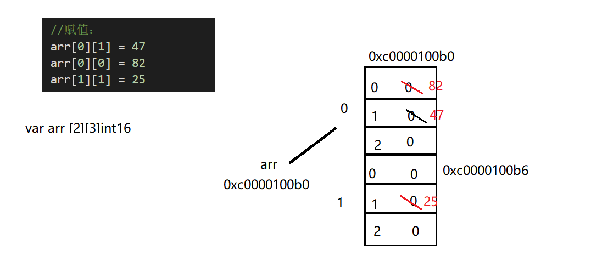

【4】二维数组的初始化：

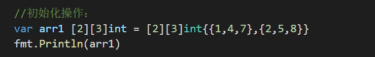


【4】二维数组的遍历：

```go
func main() {
    // 定义二维数组：
    var arr [3][3]int = [3][3]int{{1,4,7}, {2,5,8}, {3,6,9}}
    fmt.Println(arr)
    fmt.Println("------------------------")

    // 方式1：普通for循环：
    for i := 0; i < len(arr); i++{
        for j := 0;j < len(arr[i]);j++ {
            fmt.Print(arr[i][j], "\t")
        }
        fmt.Println()
    }
    
    fmt.Println("------------------------")
    
    // 方式2：for range循环：
    for key, value := range arr {
        for k, v := range value {
            fmt.Printf("arr[%v][%v] = %v\t", key, k, v)
        }
        fmt.Println()
    }
}
```

