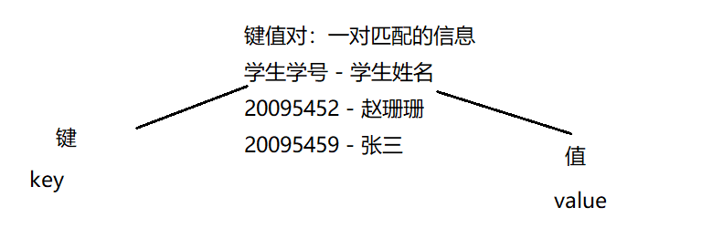
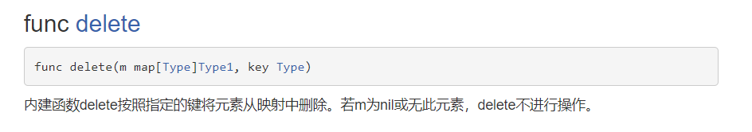

# 映射

# 一. 映射的引入

【1】映射（map）, Go语言中内置的一种类型，它将键值对相关联，我们可以通过键 key来获取对应的值 value。 类似其它语言的集合



【2】基本语法

`var 变量名 map[KeyType] ValueType`

PS：**key、value的类型：bool、数字、string、指针、channel 、还可以是只包含前面几个类型的接口、结构体、数组**

PS：**key通常为int 、string类型，value通常为数字（整数、浮点数）、string、map、结构体**

PS：**key：slice、map、function不可以**

【3】代码：   

map的特点：

（1）**map集合在使用前一定要make**

（2）**map的key-value是无序的**

（3）**key是不可以重复的，如果遇到重复，后一个value会替换前一个value**

（4）**value可以重复的**

```go
func main() {
    // 定义map变量：
    var a map[int]string
    // 只声明map内存是没有分配空间
    // 必须通过make函数进行初始化，才会分配空间：
    a = make(map[int]string, 10) // map可以存放10个键值对
    // 将键值对存入map中：
    a[20095452] = "张三"
    a[20095387] = "李四"
    a[20097291] = "王五"
    a[20095387] = "朱六"
    a[20096699] = "张三"
    // 输出集合
    fmt.Println(a)
}
```


# 二. 映射创建方式

## 2.1 方式1

```go
var a map[int]string
// 只声明map内存是没有分配空间
// 必须通过make函数进行初始化，才会分配空间：
a = make(map[int]string, 10) //m ap可以存放10个键值对
// 将键值对存入map中：
a[20095452] = "张三"
a[20095387] = "李四"
// 输出集合
fmt.Println(a)
```


## 2.2 方式2

```go
b := make(map[int]string)
b[20095452] = "张三"
b[20095387] = "李四"
fmt.Println(b)
```


## 2.3 方式3

```go
c := map[int]string{
    20095452: "张三",
    20098765: "李四",
}
c[20095387] = "王五"
fmt.Println(c)
```


# 三. 映射的操作

【1】增加和更新操作:
`map["key"] = value`  ——》 如果key还没有，就是增加，如果key存在就是修改。

【2】删除操作：
`delete(map, "key")` , delete是一个内置函数，如果key存在，就删除该key-value，如果k的y不存在，不操作，但是也不会报错



【3】清空操作：

（1）如果我们要删除map的所有key ,没有一个专门的方法一次删除，可以遍历一下key,逐个删除

（2）或者`map = make(...)`，make一个新的，让原来的成为垃圾，被 **gc** 回收

【4】查找操作：

`value, bool = map[key]`

value为返回的value，bool为是否返回 ，要么true 要么false 

【5】获取长度：len函数

【6】遍历：for-range

```go
b := make(map[int]string)
// 增加：
b[20095452] = "张三"
b[20095387] = "李四"
b[20098833] = "王五"
// 获取长度：
fmt.Println(len(b))
// 遍历：
for k, v := range b {
    fmt.Printf("key为：%v value为%v \t", k, v)
}
```

