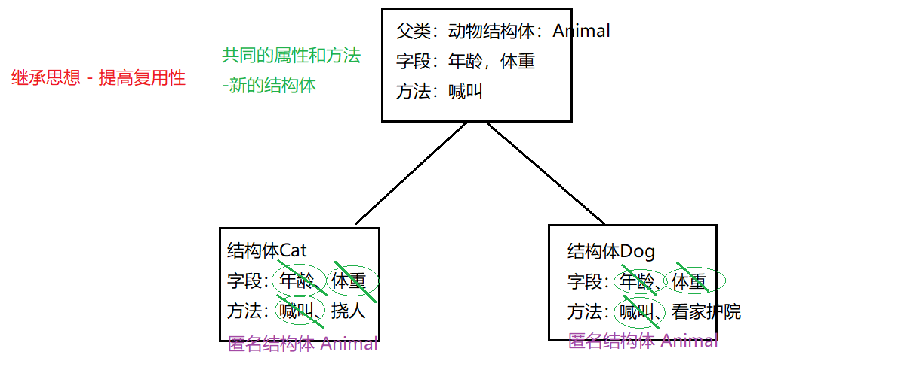

# 面向对象编程

# 一. 面向对象概述

Golang语言面向对象编程说明：

（1）Golang也支持面向对象编程(OOP)，但是和传统的面向对象编程有区别，**并不是纯粹的面向对象语言。所以我们说Golang支持面向对象编程特性是比较准确的。**

（2）Golang没有类(class)，Go语言的结构体(struct)和其它编程语言的类(class)有同等的地位，你可以理解**Golang是基于struct来实现OOP特性的。**

（3）Golang面向对象编程非常简洁，**去掉了传统OOP语言的方法重载、构造函数和析构函数、隐藏的this指针等等**

（4）Golang仍然有面向对象编程的继承，封装和多态的特性，只是实现的方式和其它OOP语言不一样，比如继承:**Golang没有extends 关键字，继承是通过匿名字段组合来实现。** 


# 二. 结构体

## 2.1 声明结构体

声明一个结构体:

```go
type Person struct {
    // 开头大写表示可以对外公开
    Name string
    Age int
}
```


## 2.2 创建结构体对象

### 2.2.1 创建语法

方式1: 声明然后赋值

```go
var p Person
p.Name = "洛必达"
p.Age = 19
```

方式2: 类似构造器

```go
var p = Person{"洛必达", 19}
```

方式3: 使用New函数

```go
var p = new(Person)
p.Name = "洛必达"
p.Age = 19
```

方式4: 返回结构体指针

```go
var p = &Person{"洛必达", 19}
```


### 2.2.2 指定字段值

```go
type Student struct {
	Name string
	Age int
}
```

【1】方式1：按照顺序赋值操作

缺点：必须按照顺序有局限性

```go
var s = Student{"洛必达", 20}
```


【2】方式2：按照指定类型

```go
var s = Student{
	Name: "洛必达",
	Age: 18,
}
```


【3】方式3：想要返回结构体的指针类型

```go
var s1 = &Student{"洛必达", 18}
var s2 = &Student{
	Name: "洛必达",
	Age: 19
}
```


### 2.2.3 跨包创建结构体

【1】创建不同的包：

```go
package pojo

type Student struct {
    Name string
    Age int
} 
```


【2】在main.go创建结构体对象,**前提是结构体开头必须要大写**:

```go
package main

func main() {
    var s = pojo.Student{"洛必达", 19}
}
```


## 2.2 内存分析


## 2.3 结构体之间的转换

【1】结构体是用户单独定义的类型，和其它类型进行转换时需要有完全相同的字段(名字、个数和类型)

```go
type Student struct {
    Age int
}
type Person struct {
    Age int
}
func main() {
    var s Student = Student{10}
    var p Person = Person{10}
    s = Student(p)
    fmt.Println(s)
    fmt.Println(p)
}
```

【2】结构体进行type重新定义(相当于取别名)，Golang认为是新的数据类型，**但是相互间可以强转**

```go
type Student struct {
    Age int
}
type Stu Student
func main() {
    var s1 Student = Student{19}
    var s2 Stu = Stu{19}
    s1 = Student(s2)
    fmt.Println(s1)
    fmt.Println(s2)
}
```


## 2.4 方法

### 2.4.1 方法的声明

【1】方法是作用在指定的数据类型上、和指定的数据类型绑定，因此自定义类型，都可以有方法，而不仅仅是struct

【2】方法的声明和调用格式：

```go
type A struct {
    Num int
}
func (a A) test() {
    fmt.Println(a.Num)
}

func main() {
    var a = A{19}
    a.test()
}
```


（1）func (a A) test()相当于A结构体有一个方法叫test

（2）(a A)体现方法test和结构体A绑定关系

注意：

（1）test方法中参数名字随意起

（2）结构体A和test方法绑定，调用test方法必须靠指定的类型：A

（3）如果其他类型变量调用test方法一定会报错。

（4）结构体对象传入test方法中，**值传递，和函数参数传递一致。**


### 2.4.2 方法使用注意事项

（1）**结构体类型是值类型，在方法调用中，遵守值类型的传递机制，是值拷贝传递方式**

（2）**如程序员希望在方法中，改变结构体变量的值，可以通过结构体指针的方式来处理**

```go
type Person struct {
	Name string
}
func (p *Person) test() {
    p.Name = "伯努利"
    fmt.Println(p.Name)
}
```

（3）Golang中的方法作用在指定的数据类型上的，和指定的数据类型绑定，因此自定义类型，都可以有方法，而不仅仅是struct，比如int , float32等都可以有方法

```go
type integer int
func (i integer) print() {
    i = 30
    fmt.Println("i = ",i)
}
func (i *integer) change() {
    *i = 30
    fmt.Println("i = ",*i)
}
func main() {
    var i integer = 20
    i.print()
    i.change()
    fmt.Println(i)
}
```

（4）方法的访问范围控制的规则，和函数一样。**方法名首字母小写，只能在本包访问，方法首字母大写，可以在本包和其它包访问。**

（5）如果一个类型实现了String()这个方法，那么fmt.Println默认会调用这个变量的String()进行输出.以后定义结构体的话，常定义String()作为输出结构体信息的方法，在fmt.Println会自动调用

```go
type Student struct {
    Name string
    Age int
}
func (s *Student) String() string {
    str := fmt.Sprintf("Name = %v , Age = %v",s.Name,s.Age)
    return str
}
func main() {
    stu := Student{
        Name : "丽丽",
        Age : 20,
    }
    // 传入地址，如果绑定了String方法就会自动调用
    fmt.Println(&stu)
}
```


### 2.4.3 方法与函数的区别

【1】绑定指定类型：

方法：需要绑定指定数据类型

函数：不需要绑定数据类型

【2】调用方式不一样：

函数的调用方式:  函数名(实参列表)

方法的调用方式：变量.方法名(实参列表)

```go
type Student struct {
    Name string
}
// 定义方法：
func (s Student) test01() {
    fmt.Println(s.Name)
}
// 定义函数：
func method01(s Student){
    fmt.Println(s.Name)
}
func main() {
    // 调用函数：
    var s Student = Student{"罗不低啊"}
    method01(s)
    // 方法调用：
    s.test01()
}
```

【3】对于函数来说，参数类型对应是什么就要传入什么。

```go
type Student struct {
    Name string
}
// 定义函数：
func method01(s Student) {
    fmt.Println(s.Name)
}
func method02(s *Student) {
    fmt.Println((*s).Name)
}
func main() {
    var s Student = Student{"丽丽"}
    method01(s)
    // method01(&s)错误
    method02(&s)
    // method02(s)错误
}
```

【4】对于方法来说，接收者为值类型，可以传入指针类型，接受者为指针类型，可以传入值类型。

```go
type Student struct {
    Name string
}
// 定义方法：
func (s Student) test01() {
    fmt.Println(s.Name)
}
func (s *Student) test02() {
    fmt.Println((*s).Name)
}
func main() {
    var s Student = Student{"丽丽"}
    s.test01()
    (&s).test01()  // 虽然用指针类型调用，但是传递还是按照值传递的形式
    (&s).test02()
    s.test02()  // 等价
}
```


# 三. 封装

【1】什么是封装：
封装(encapsulation)就是把抽象出的字段和对字段的操作封装在一起，数据被保护在内部,程序的其它包只有通过被授权的操作方法，才能对字段进行操作。

【2】封装的好处：

1) 隐藏实现细节
2) 提可以对数据进行验证，保证安全合理 

【3】Golang中如何实现封装：
1) 建议将结构体、字段(属性)的首字母小写(其它包不能使用，类似private，实际开发不小写也可能，因为封装没有那么严格)
2) 给结构体所在包提供一个工厂模式的函数，首字母大写（类似一个构造函数）
3) **提供一个首字母大写**的Set方法(类似其它语言的public)，用于对属性判断并赋值
            
            ```go
            func (var 结构体类型名) SetXxx(参数列表) {
                //加入数据验证的业务逻辑
                var.Age =参数
            }
            ```
4) **提供一个首字母大写**的Get方法(类似其它语言的public)，用于获取属性的值
            
            ```go
            func (var 结构体类型名) GetXxx() (返回值列表) {
                return var.字段
            }
            ```
            
            

【4】代码实现：

```go
package pojo

type person struct {
    Name string
    age int
}

func NewPerson(name string) *person {
    return &person{
        Name: name,
    }
}

func (p *person) SetAge(age int) {
    if age > 0 && age < 100 {
        p.age = age
    } else {
        errors.New("年龄不合法!")
    }
}

func (p *person) GetAge() int {
    return p.age
}
```


```go
package main

func main() {
    var p = pojo.NewPerson("洛必达")
    p.SetAge(19)
}
```


# 四. 继承

## 4.1 继承概述

【1】继承的引入：
当多个结构体存在相同的属性(字段)和方法时,可以从这些结构体中抽象出结构体,在该结构体中定义这些相同的属性和方法，其它的结构体不需要重新定义这些属性和方法，只需嵌套一个匿名结构体即可。也就是说:在Golang中，如果一个struct嵌套了另一个匿名结构体，那么这个结构体可以直接访问匿名结构体的字段和方法，从而实现了继承特性。



【2】代码引入：

```go
// 定义动物结构体：
type Animal struct {
    Age int
    Weight float32
}
// 给Animal绑定方法：喊叫：
func (an *Animal) Shout() {
    fmt.Println("我可以大声喊叫")
}
// 给Animal绑定方法：自我展示：
func (an *Animal) ShowInfo() {
    fmt.Printf("动物的年龄是：%v,动物的体重是：%v", an.Age, an.Weight)
}
// 定义结构体：Cat
type Cat struct {
    // 为了复用性，体现继承思维，嵌入匿名结构体：——》将Animal中的字段和方法都达到复用
    Animal
}
// 对Cat绑定特有的方法：
func (c *Cat) scratch() {
    fmt.Println("我是小猫，我可以挠人")
}
func main() {
    // 创建Cat结构体示例：
    cat := &Cat{}
    cat.Animal.Age = 3
    cat.Animal.Weight = 10.6
    cat.Animal.Shout()
    cat.Animal.ShowInfo()
    cat.scratch()
}
```


## 4.2 继承注意事项

【1】结构体可以使用嵌套匿名结构体所有的字段和方法，即:首字母大写或者小写的字段、方法，都可以使用。

【2】匿名结构体字段访问可以简化。

```go
func main() {
    // 创建Cat结构体示例：
    cat := &Cat{}
    cat.Age = 3
    cat.Weight = 10.6
    cat.Shout()
    cat.ShowInfo()
    cat.scratch()
}
```

cat.Age --->cat对应的结构体中找是否有Age字段，如果有直接使用，如果没有就去找嵌入的结构体类型中的Age

【3】当结构体和匿名结构体有相同的字段或者方法时，编译器采用就近访问原则访问，如希望访问匿名结构体的字段和方法，可以通过匿名结构体名来区分。

【4】Golang中支持多继承：如一个结构体嵌套了多个匿名结构体，那么该结构体可以直接访问嵌套的匿名结构体的字段和方法，从而实现了多重继承。为了保证代码的简洁性，建议大家尽量不使用多重继承，很多语言就将多重继承去除了，但是Go中保留了。

```go
type A struct{
    a int
    b string
}
type B struct{
    c int
    d string
}
type C struct{
    A
    B
}
func main() {
    // 构建C结构体实例：
    c := C{A{10,"aaa"}, B{20,"ccc"}}
    fmt.Println(c)
}
```

【5】如嵌入的匿名结构体有相同的字段名或者方法名，则在访问时，需要通过匿名结构体类型名来区分。

```go
func main() {
    // 构建C结构体实例：
    c := C{A{10,"aaa"}, B{20,"ccc",50}}
    fmt.Println(c.b)
    fmt.Println(c.d)
    fmt.Println(c.A.a)
    fmt.Println(c.B.a)
}
```

【6】结构体的匿名字段可以是基本数据类型。

```go
func main() {
	// 构建C结构体实例：
    c := C{A{10,"aaa"}, B{20,"ccc",50}. 100}
    fmt.Println(c.int)
}
```

【7】嵌套匿名结构体后，也可以在创建结构体变量(实例)时，直接指定各个匿名结构体字段的值。

```go
func main() {
    // 构建C结构体实例：
    c := C{
        A{
            a: 10,
            b: "aaa"
        }, 
        B{
            c: 20,
            d: "ccc",50
        }
    }
}
```

【8】嵌入匿名结构体的指针也是可以的。

【9】结构体的字段可以是结构体类型的。（组合模式）

```go
type D struct {
	a int
	b string
	c B		// 使用组合模式
}
```


# 五. 接口

## 5.1 接口概述

【1】代码入门：

```go
// 接口的定义：定义规则、定义规范，定义某种能力：
type SayHello interface {
    // 声明没有实现的方法：
    sayHello()
}
// 接口的实现：定义一个结构体：
type Chinese struct {
}
// 实现接口的方法---》具体的实现：
func (person Chinese) sayHello(){
    fmt.Println("你好")
}
// 接口的实现：定义一个结构体：
type American struct{
}
// 实现接口的方法---》具体的实现：
func (person American) sayHello(){
    fmt.Println("hi")
}
// 定义一个函数：专门用来各国人打招呼的函数，接收具备SayHello接口的能力的变量：
func greet(s SayHello){
    s.sayHello()
}
func main() {
    // 创建一个中国人：
    c := Chinese{}
    // 创建一个美国人：
    a := American{}
    // 美国人打招呼：
    greet(a)
    // 中国人打招呼：
    greet(c)
}
```


【2】总结：

（1）接口中可以定义一组方法，但不需要实现，不需要方法体。并且接口中不能包含任何变量。到某个自定义类型要使用的时候（实现接口的时候）,再根据具体情况把这些方法具体实现出来。

（2）实现接口要实现所有的方法才是实现。

（3）Golang中的接口不需要显式的实现接口。**Golang中没有implements关键字。**
（Golang中实现接口是基于方法的，不是基于接口的）

例如：

A接口 a,b方法

B接口 a,b方法

C结构体 实现了  a,b方法 ，那么C实现了A接口，也可以说实现了B接口   （只要实现全部方法即可，和实际接口耦合性很低，比Java松散得多）

（4）接口目的是为了定义规范，具体由别人来实现即可。


## 5.2 接口注意事项

【1】接口本身不能创建实例，但是可以指向一个实现了该接口的自定义类型的变量。

【2】只要是自定义数据类型，就可以实现接口，不仅仅是结构体类型。

【3】一个自定义类型可以实现多个接口

```go
type AInterface interface {
    a()
}
type BInterface interface {
    b()
}
type Stu struct{
}
func (s Stu) a() {
    fmt.Println("aaaa")
}
func (s Stu) b() {
    fmt.Println("bbbb")
}
func main() {
    var s Stu
    var a AInterface = s
    var b BInterface = s
    a.a()
    b.b()
}
```

【4】一个接口(比如A接口)可以继承多个别的接口(比如B,C接口)，这时如果要实现A接口,也必须将B,C接口的方法也全部实现。

```go
type CInterface interface {
    c()
}
type BInterface interface {
    b()
}
type AInterface interface {
    BInterface
    CInterface
    a()
}
type Stu struct {
}
func (s Stu) a() {
    fmt.Println("a")
}
func (s Stu) b() {
    fmt.Println("b")
}
func (s Stu) c() {
    fmt.Println("c")
}
func main() {
    var s Stu
    var a AInterface = s
    a.a()
    a.b()
    a.c()
}
```

【5】interface类型默认是一个指针(引用类型)，如果没有对interface初始化就使用,那么会输出nil

【6】空接口没有任何方法,所以可以理解为所有类型都实现了空接口，也可以理解为我们可以把任何一个变量赋给空接口。**其实空接口可以理解为 Java 里面的泛型**!


# 六. 多态

【1】基本介绍
变量(实例)具有多种形态。面向对象的第三大特征，在Go语言，多态特征是通过接口实现的。可以按照统一的接口来调用不同的实现。这时接口变量就呈现不同的形态。

【2】案例：

```go
func greet(s SayHello) {
    s.sayHello()
}
```

【3】接口体现多态特征

1) 多态参数： s叫多态参数
2) 多态数组 ：比如,定义SayHello数组，存放中国人结构体、美国人结构体

```go
func main() {
    var arr = [3]SayHello{
        American{"ROCK"},
        Chinese{"宋江"},
        Chinese{"史进"}
    }
    
    for _, v range arr {
        v.sayHello()
    }
}
```


# 七. 断言

【1】什么是断言？
Go语言里面有一个语法，可以直接判断是否是该类型的变量： value, ok := element.(T)，这里value就是变量的值，ok是一个bool类型，element是interface变量，T是断言的类型。

【2】断言案例：

判断一个人是否是中国人:

```go
func greet(s SayHello) {
    s.sayHello()
    switch s.(type){  // type属于go中的一个关键字，固定写法
        case Chinese:
        	ch := s.(Chinese)
        	ch.eatWithChopsticks()
        case American:
        	am := s.(American)
        	am.eatWithForks()
    }
    fmt.Println("打招呼。。。")
}

func main() {
    // 创建一个中国人：
    c := Chinese{}
    greet(c)
}
```

