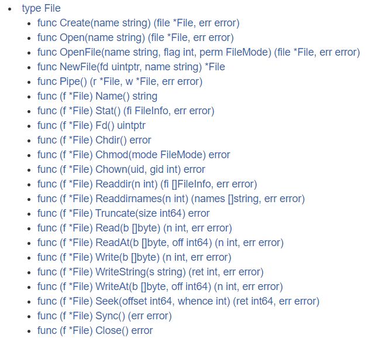
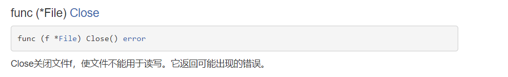
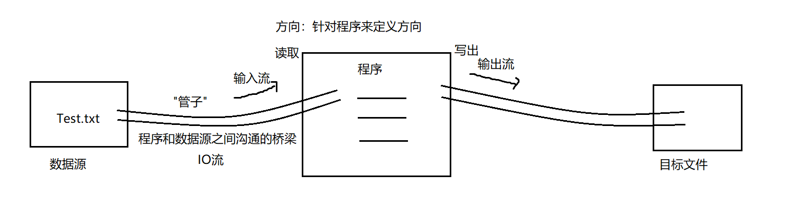
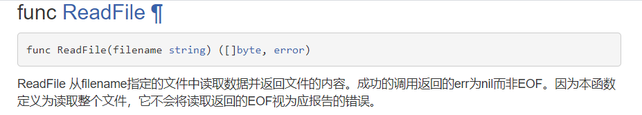

# 文件读写

# 一. 文件概述

【1】文件是什么？

文件是保存数据的地方，是数据源的一种，比如大家经常使用的word文档、txt文件、excel文件、jpg文件...都是文件。文件最主要的作用就是保存数据，它既可以保存一张图片，也可以保持视频，声音...

【2】os包下的File结构体封装了对文件的操作：



【3】File结构体---打开文件和关闭文件：

（1）打开文件，用于读取：（函数）


传入一个字符串（文件的路径），返回的是文件的指针，和是否打开成功

（2）关闭文件：（方法）



使文件不能用于读写。它返回可能出现的错误

【4】实操：

```go
func main() {
    // 打开文件：
    file,err := os.Open("d:/Test.txt");
    if err != nil {//出错
        fmt.Println("文件打开出错，对应错误为：",err)
    }
    // 没有出错，输出文件：
    fmt.Printf("文件=%v",file)
    // .........一系列操作
    // 关闭文件：
    err2 := file.Close();
    if err2 != nil {
        fmt.Println("关闭失败")
    }
}
```


# 二. I/O引入

【1】IO流对文件进行操作：




# 三. 读取文件

## 3.1 直接读取文件

【1】读取文件的内容并显示在终端(使用ioutil一次将整个文件读入到内存中)，这种方式适用于文件不大的情况。相关方法和函数(ioutil.ReadFile)



【2】案例：

```go
func main() {
    // 备注：在下面的程序中不需要进行 Open\Close操作，
    // 因为文件的打开和关闭操作被封装在ReadFile函数内部了
    // 返回内容为：[]byte,err
    content, err := ioutil.ReadFile("d:/Test.txt")
    if err != nil {//读取有误
        fmt.Println("读取出错，错误为：", err)
    }
    // 如果读取成功，将内容显示在终端即可：
    // fmt.Printf("%v",content)
    fmt.Printf("%v", string(content))
}
```


## 3.2 使用缓冲区读取

【1】读取文件的内容并显示在终端(带缓冲区的方式-4096字节)，适合读取比较大的文件，使用os.Open,file.Close,bufio.NewReader(),reader.ReadString函数和方法

【2】案例：

```go
func main() {
    // 打开文件：
    file,err := os.Open("d:/Test.txt")
    if err != nil {
        fmt.Println("文件打开失败，err=",err)
    }
    // 当函数退出时，让file关闭，防止内存泄露：
    defer file.Close()
    // 创建一个流：
    reader := bufio.NewReader(file)
    // 读取操作：
    for {
        // 读取到一个换行就结束
        str,err := reader.ReadString('\n')
        if err == io.EOF {  // io.EOF表示已经读取到文件的结尾
            break
        }
        // 如果没有读取到文件结尾的话，就正常输出文件内容即可：
        fmt.Println(str)
    }
    // 结束：
    fmt.Println("文件读取成功，并且全部读取完毕")
}
```


# 四. 写入文件


# 五. 复制文件