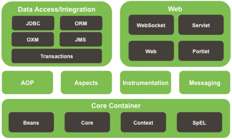
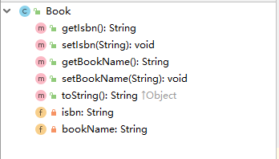
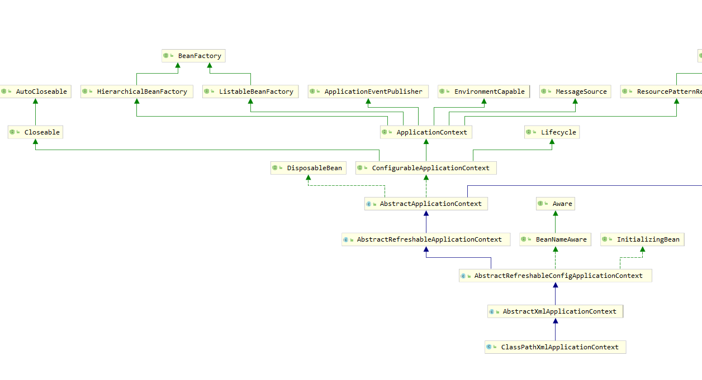
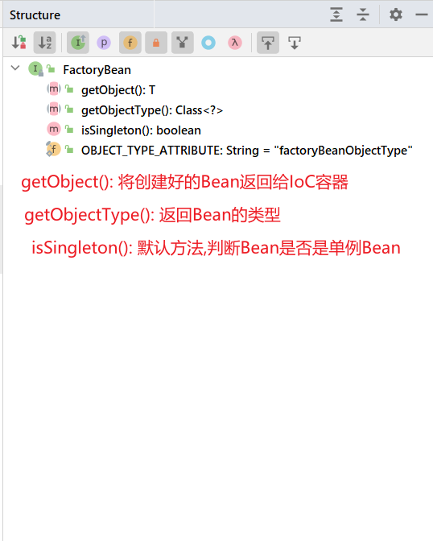
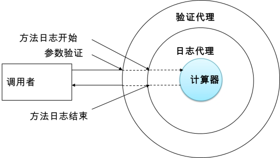
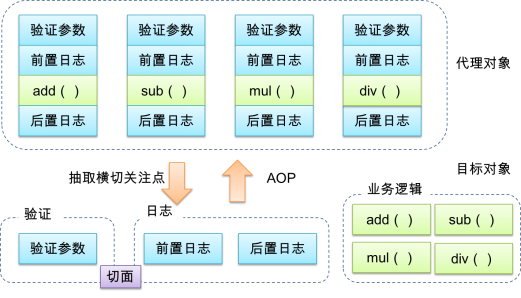
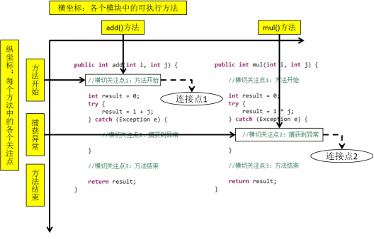
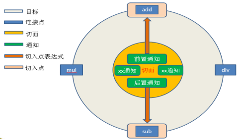
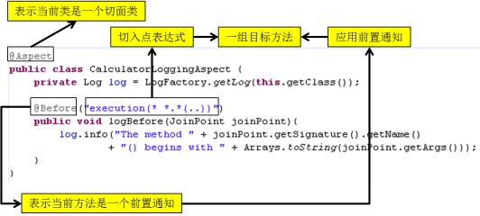

## 概述 简单了解框架

> 框架，即framework。其实就是某种应用的半成品，就是一组组件，供你选用完成你自己的系统。简单说就是使用别人搭好的舞台，你来做表演。而且，框架一般是成熟的，不断升级的软件。
>
> 框架是对特定应用领域中的应用系统的部分设计和实现的整体结构。
>
> 因为软件系统发展到今天已经很复杂了，特别是服务器端软件，涉及到的知识，内容，问题太多。在某些方面使用别人成熟的框架，就相当于让别人帮你完成一些基础工作，你只需要集中精力完成系统的业务逻辑设计。而且框架一般是成熟，稳健的，他可以处理系统很多细节问题，比如，事务处理，安全性，数据流控制等问题。还有框架一般都经过很多人使用，所以结构很好，所以扩展性也很好，而且它是不断升级的，你可以直接享受别人升级代码带来的好处。


## 一. Spring概述 

### 1.1 Spring概述  

 Spring的作者是一个音乐博士。

 hibernate的作者因为不会写sql语句，所以做了一个持久层框架。

- Spring是一个开源框架

- Spring为简化企业级开发而生，使用Spring，JavaBean就可以实现很多以前要靠EJB才能实现的功能。同样的功能，在EJB中要通过繁琐的配置和复杂的代码才能够实现，而在Spring中却非常的优雅和简洁。 

  - EJB即Enterprise JavaBean，是SUN的JavaEE服务器端组件模型。在JavaEE里，EJB称为Java 企业Bean，是Java的核心代码，分别是会话Bean（**Session Bean**），实体Bean（**Entity Bean**）和消息驱动Bean（**MessageDriven Bean**）。在EJB3.0推出以后，实体Bean被单独分了出来，形成了新的规范**JPA**。

- Spring是一个**IOC**(DI)和**AOP**容器框架。

  - spring的核心。what?  

- Spring的优良特性

  - **非侵入式**：基于Spring开发的应用中的对象可以不依赖于Spring的API(struts侵入式)
  -  **依赖注入**：DI——Dependency Injection，反转控制(IOC)最经典的实现。
  -  **面向切面编程**：Aspect Oriented Programming——AOP
  -  **容器**：Spring是一个容器，因为它包含并且管理应用对象的生命周期
  -  **组件化**：Spring实现了使用简单的组件配置组合成一个复杂的应用。在 Spring 中可以使用XML和Java注解组合这些对象。
  - **一站式**：在IOC和AOP的基础上可以整合各种企业应用的开源框架和优秀的第三方类库（实际上Spring 自身也提供了表述层的SpringMVC和持久层的Spring JDBC）。

- Spring模块

  

- Spring 官网

  https://spring.io/ 


### 1.2 搭建Spring运行时环境

- 加入**JAR**包依赖

  ~~~xml
  <?xml version="1.0" encoding="UTF-8"?>
  <project xmlns="http://maven.apache.org/POM/4.0.0"
           xmlns:xsi="http://www.w3.org/2001/XMLSchema-instance"
           xsi:schemaLocation="http://maven.apache.org/POM/4.0.0 http://maven.apache.org/xsd/maven-4.0.0.xsd">
      <modelVersion>4.0.0</modelVersion>
  
      <groupId>org.example</groupId>
      <artifactId>spring_day01</artifactId>
      <version>1.0-SNAPSHOT</version>
      
      <dependencies>
          <!-- 引入context包即可,依赖传递,自定引入需要的包 -->
          <dependency>
              <groupId>org.springframework</groupId>
              <artifactId>spring-context</artifactId>
              <version>5.2.12.RELEASE</version>
          </dependency>
  
          <dependency>
              <groupId>commons-logging</groupId>
              <artifactId>commons-logging</artifactId>
              <version>1.1.1</version>
          </dependency>
      </dependencies>
  </project>
  ~~~
  
- 在idea中创建Spring的**配置文件**

  ~~~xml
  <?xml version="1.0" encoding="UTF-8" ?>
  <beans xmlns:xsi="http://www.w3.org/2001/XMLSchema-instance"
         xmlns="http://www.springframework.org/schema/beans"
         xsi:schemaLocation="http://www.springframework.org/schema/beans http://www.springframework.org/schema/beans/spring-beans.xsd" default-autowire="byName">
  
  </beans>
  ~~~


### 1.3 入门案例HelloWorld

​	lombok:自动帮pojo类添加get和set方法，toString.  

1. 添加依赖

~~~xml
 <dependency>
     <groupId>org.projectlombok</groupId>
     <artifactId>lombok</artifactId>
     <version>1.18.8</version>
     <scope>provided</scope>
</dependency>
~~~

2. 下载lombok插件


1. Book类结构图：

​	

2. Book类代码：

   ~~~java
   @Data
   public class Book {
   	private String isbn;
   	private String bookName;
   }
   ~~~
   
3. 创建Spring配置文件

   ~~~xml
   <?xml version="1.0" encoding="UTF-8" ?>
   <beans xmlns:xsi="http://www.w3.org/2001/XMLSchema-instance"
          xmlns="http://www.springframework.org/schema/beans"
          xsi:schemaLocation="http://www.springframework.org/schema/beans http://www.springframework.org/schema/beans/spring-beans.xsd" default-autowire="byName">
   
       <!-- 使用bean元素定义一个由IOC容器创建的对象 -->
   	<!-- class属性指定用于创建bean的全类名 -->
       <!-- id属性指定用于引用bean实例的标识 -->
       <bean id="book" class="cn.element.spring.pojo.Book">
           <!-- 使用property子元素为bean的属性赋值 -->
           <property name="isbn" value="1001"/>
           <property name="bookName" value="百年孤独"/>
       </bean>
   </beans>
   ~~~
   
   
   
4. 测试：通过Spring的IOC容器创建Student类实例

   ~~~java
   public void test01() {
       // 用我们的配置文件来启动一个 ApplicationContext
       ApplicationContext context = new ClassPathXmlApplicationContext("classpath:applicationContext.xml");
   
       // 从 context 中取出我们的 Bean，而不是用 new Book() 这种方式
       Book book = context.getBean(Book.class);
   
       // 这句将输出: book
       System.out.println(book);
   }
   ~~~
   
   
   

## 二. IOC容器和Bean的配置

### 2.1 IOC和DI

#### 2.1.1 IOC(Inversion of Control)：控制反转

>  在应用程序中的组件需要获取资源时，传统的方式是组件主动的从容器中获取所需要的资源，在这样的模式下开发人员往往需要知道在具体容器中特定资源的获取方式，增加了学习成本，同时降低了开发效率。
> 反转控制的思想完全颠覆了应用程序组件获取资源的传统方式：反转了资源的获取方向——改由容器主动的将资源推送给需要的组件，开发人员不需要知道容器是如何创建资源对象的，只需要提供接收资源的方式即可，极大的降低了学习成本，提高了开发的效率。这种行为也称为查找的被动形式。

#### 2.1.2 DI(Dependency Injection)：依赖注入

IOC的另一种表述方式：即组件以一些预先定义好的方式(例如：setter 方法)接受来自于容器的资源注入。相对于IOC而言，这种表述更直接。

> 总结: IOC 就是一种反转控制的思想， 而DI是对IOC的一种具体实现。  

#### 2.1.3 IOC容器在Spring中的实现

前提:  

1. Spring中有IOC思想
2. IOC思想必须基于 IOC容器来完成， 
3. 而IOC容器在最底层实质上就是一个对象工厂.

- 在通过IOC容器读取Bean的实例之前，需要先将IOC容器本身实例化。
- Spring提供了IOC容器的两种实现方式
  - BeanFactory：IOC容器的基本实现，是Spring内部的基础设施，是面向Spring本身的，不是提供给开发人员使用的。
  
  - ApplicationContext：BeanFactory的子接口，提供了更多高级特性。面向Spring的使用者，几乎所有场合都使用ApplicationContext而不是底层的BeanFactory。
  
    

> 面试题：BeanFactory和ApplicationContext有什么区别？
>


#### 2.1.4 ApplicationContext的主要实现类

1. **ClassPathXmlApplicationContext：对应类路径下的XML格式的配置文**

2. **FileSystemXmlApplicationContext：对应文件系统中的XML格式的配置文件**

3. **在初始化时就创建单例的bean，也可以通过配置的方式指定创建的Bean是多实例的。**

   

#### 2.1.5 ConfigurableApplicationContext

1. **是ApplicationContext的子接口，包含一些扩展方法**

2. **refresh()和close()让ApplicationContext具有启动、关闭和刷新上下文的能力。**

   

#### 2.1.6 WebApplicationContext

1. **专门为WEB应用而准备的，它允许从相对于WEB根目录的路径中完成初始化工作**

   

#### 2.1.7 容器的结构图



### 2.2 通过类型获取bean

- 从IOC容器中获取bean时，除了通过id值获取，还可以通过bean的类型获取。但如果同一个类型的bean在XML文件中配置了多个，则获取时会抛出异常，所以同一个类型的bean在容器中必须是唯一的。

  ~~~java
  Book book = cxt.getBean(Book.class);
  ~~~
~~~java

- 或者可以使用另外一个重载的方法，同时指定bean的id值和类型

  ~~~java
  Book book = cxt.getBean(“book”,Book.class);
~~~

### 2.3 给bean的属性赋值

#### 2.3.1 依赖注入的方式

~~~java
@Data
public class Student {
	private Integer studentId;
	private String stuName;
	private int age;

	public Student() {
	}

	public Student(Integer studentId, String stuName, int age) {
		this.studentId = studentId;
		this.stuName = stuName;
		this.age = age;
	}
}
~~~


1. 通过bean的setXxx()方法赋值
    Hello World中使用的就是这种方式

  ~~~xml
  <bean id="book" class="cn.element.spring.pojo.Book">
      <!-- 使用property子元素为bean的属性赋值 -->
      <property name="isbn" value="1001"/>
      <property name="bookName" value="百年孤独"/>
  </bean>
  ~~~

  

2. 通过bean的构造器赋值

  1) Spring自动匹配合适的构造器

  ~~~xml
  <bean id="student" class="cn.element.spring.pojo.Student">
      <constructor-arg  value="1"></constructor-arg>
      <constructor-arg  value="张三"></constructor-arg>
      <constructor-arg  value="20"></constructor-arg>
  </bean>
  ~~~

  

  2) 通过索引值指定参数位置

   ~~~xml
  <bean id="student" class="cn.element.spring.pojo.Student">
       <constructor-arg index="0" value="1"></constructor-arg>
       <constructor-arg index="1" value="张三"></constructor-arg>
       <constructor-arg index="2" value="20"></constructor-arg>
  </bean>
   ~~~

  

  3)通过类型区分重载的构造器

  ~~~xml
  <bean id="student1" class="cn.element.spring.pojo.Student">
      <constructor-arg  value="1" type="java.lang.Integer"></constructor-arg>
      <constructor-arg  value="20" type="int"></constructor-arg>
      <constructor-arg value="张三" type="java.lang.String"></constructor-arg>
  </bean>
  ~~~

  

#### 2.3.2 依赖注入可用值

1. **字面量**

   1) 可以使用字符串表示的值，可以通过value属性或value子节点的方式指定

   2) 基本数据类型及其封装类、String等类型都可以采取字面值注入的方式

   3) 若字面值中包含特殊字符，可以使用<![CDATA[]]>把字面值包裹起来

   

2. **null值**

   如果赋值为`<null/>`，**得到的结果是null,而不是“null”**,**但是如果对null进行运算spring会自动将null转成“null”字符串来运算，防止空指针异常**

   ~~~xml
   <bean id="student1" class="cn.element.spring.pojo.Student">
       <constructor-arg  value="1" type="java.lang.Integer"></constructor-arg>
       <constructor-arg  value="20" type="int"></constructor-arg>
       <constructor-arg  type="java.lang.String">
           <null></null>
       </constructor-arg>
   </bean>
   ~~~

   

3. 外部已声明的bean、引用其他的bean

   shop类：

   ~~~java
   @Data
   public class Shop {
   
       private int shopId;
   
       private String shopName;
   
       private Book book;
   }
   ~~~
   
   引用外部的bean,使用ref属性。
   
   ~~~xml
   <bean id="shop" class="cn.element.spring.pojo.Shop">
       <property name="shopId" value="1"/>
       <property name="shopName" value="天猫小店"/>
       <property name="book" ref="book"/>
   </bean>
   ~~~


4. 给bean的**级联**属性赋值

   ~~~xml
   <bean id="shop" class="cn.element.spring.pojo.Shop">
       <property name="shopId" value="1"/>
       <property name="shopName" value="天猫小店"/>
       <property name="book" ref="book"/>
       <property name="book.bookName" value="金瓶梅"/>
   </bean>
   ~~~


5. 内部bean
   当bean实例仅仅给一个特定的属性使用时，可以将其声明为内部bean。内部bean声明直接包含在`<property>`或

   `<constructor-arg>`元素里，不需要设置任何id或name属性,内部bean不能使用在任何其他地方
   
   ~~~xml
   <bean id="shop1" class="cn.element.spring.pojo.Shop">
       <property name="shopId" value="1"/>
       <property name="shopName" value="天猫小店"/>
       <property name="book">
           <bean class="cn.justweb.ioc.Book">
               <property name="isbn" value="1005"/>
               <property name="bookName" value="三国演义"/>
           </bean>
       </property>
   </bean>
   ~~~
   
   

#### 2.3.3  p名称空间和c命名空间

为了简化XML文件的配置，越来越多的XML文件采用属性而非子元素配置信息。Spring从2.5版本开始引入了新的p命名空间和c命名空间，可以通过<bean>元素属性的方式配置Bean的属性。

- 使用p命名空间后，基于XML的配置方式将进一步简化。

  ~~~xml
  xmlns:p="http://www.springframework.org/schema/p"
  ~~~

  ~~~xml
  <bean id="student3" class="cn.justweb.ioc.Student" p:studentId="1" p:stuName="李四" p:age="40"/>
  ~~~

  

- 使用c命名空间后，基于XML的配置方式将进一步简化。

  ~~~xml
  xmlns:c="http://www.springframework.org/schema/c"
  ~~~

  ~~~xml
  <bean id="student4" class="cn.justweb.ioc.Student" c:studentId="3" c:stuName="李四2" c:age="43"/>
  ~~~

  

### 2.4 集合属性

在Spring中可以通过一组内置的XML标签来配置集合属性，例如：`<list>`，`<set>`或`<map>`

图书馆类：

~~~java
@Data
public class Library {

    //图书集合
    private List<Book> books;

    //图书分类列表
    private Set<String> categories;
    
    //图书映射
    private Map<Integer,Book> bookMap;
}

~~~

#### 2.4.1 数组和List

配置java.util.List类型的属性，需要指定`<list>`标签，在标签里包含一些元素。这些标签	可以通过`<value>`指定简单的常量值，通过`<ref>`指定对其他Bean的引用。通过`<bean>`指定内置bean定义。通过`<null/>`指定空元素。甚至可以内嵌其他集合。

数组的定义和List一样，都可以使用`<list>`和`<array>`标签。list底层就是数组。
配置java.util.Set需要使用`<set>`标签，定义的方法与List一样。

~~~xml
<bean id="library" class="cn.element.spring.pojo.Library" >
    <property name= "categories">
        <!-- 以字面量为值的List集合 -->
        <set>
            <value> 历史</value >
            <value> 军事</value >
        </set>
    </property>
    <property name= "books">
        <!-- 以bean的引用为值的List集合 -->
        <list>
            <ref bean= "book"/>
            <ref bean= "book2"/>
        </list>
    </property>
</bean>
~~~


#### 2.4.2 Map

~~~tex
1. Java.util.Map通过<map>标签定义。
2. <map>标签里可以使用多个<entry>作为子标签。每个条目包含一个键和一个值。
3. 必须在<key>标签里定义键。
4. 因为键和值的类型没有限制，所以可以自由地为它们指定<value>、<ref>、<bean>或<null/>元素。
5. 可以将Map的键和值作为<entry>的属性定义：简单常量使用key和value来定义。bean引用通过key-ref和value-ref属性定义。
~~~

~~~xml
<bean id="library" class="cn.element.spring.pojo.Library">
    <property name= "categories">
        <!-- 以字面量为值的List集合 -->
        <set>
            <value>历史</value>
            <value>军事</value>
        </set>
    </property>
    <property name= "books">
        <!-- 以bean的引用为值的List集合 -->
        <list>
            <ref bean="book"/>
            <ref bean="book2"/>
        </list>
    </property>
    <property name="bookMap">
        <map key-type="java.lang.Integer" value-type="cn.element.spring.pojo.Book">
            <entry key="1001" value="book"/>
            <entry key="1003" value="book2"/>
        </map>
    </property>
</bean>
~~~


#### 2.4.3 集合类型的bean

如果只能将集合对象配置在某个bean内部，则这个集合的配置将不能重用。我们需要将集合bean的配置拿到外面，供其他bean引用。

配置集合类型的bean需要引入util名称空间

~~~xml
http://www.springframework.org/schema/util
http://www.springframework.org/schema/util/spring-util-4.0.xsd

<util:list id="bookList">
	<ref bean="book01"/>
	<ref bean="book02"/>
	<ref bean="book03"/>
	<ref bean="book04"/>
	<ref bean="book05"/>
</util:list>

<util:list id="list">
    <value>1</value>
    <value>2</value>
    <value>3</value>
    <value>4</value>
</util:list>

<util:list id="categoryList">
	<value>编程</value>
	<value>简维</value>
	<value>小说</value>
	<value>评书</value>
</util:list>
~~~


### 2.5  FactoryBean

- **Spring中有两种类型的bean，一种是普通bean，另一种是工厂bean，即FactoryBean。**

- **工厂bean跟普通bean不同，其返回的对象不是指定类的一个实例，其返回的是该工厂bean的getObject方法所返回的对象。**

- **工厂bean必须实现org.springframework.beans.factory.FactoryBean接口。**

  q	

~~~xml
<bean id="product" class="cn.justweb.ioc.ProductFactory"></bean>
~~~

productFactory类

~~~java
public class ProductFactory implements FactoryBean {

    @Override
    public Object getObject() throws Exception {
        Book book = new Book();
        book.setIsbn("1");
        book.setBookName("aaa");
        return book;
    }

    @Override
    public Class<?> getObjectType() {
        return Book.class;
    }

    @Override
    public boolean isSingleton() {
        return true;
    }
}
~~~




> **面试题：BeanFactory和FactoryBean有什么区别？**


### 2.6  Bean的作用域

在Spring中，可以在`<bean>`元素的scope属性里设置bean的作用域，以决定这个bean是单实例的还是多实例的。

默认情况下，Spring只为每个在IOC容器里声明的bean创建唯一一个实例，整个IOC容器范围内都能共享该实例：所有后续的getBean()调用和bean引用都将返回这个唯一的bean实例。该作用域被称为singleton，它是所有bean的默认作用域。

	

当bean的作用域为单例时，Spring会在IOC容器对象创建时就创建bean的对象实例。而当bean的作用域为prototype时，IOC容器在获取bean的实例时创建bean的实例对象。


### 2.7 bean的生命周期

- Spring IOC容器可以管理bean的生命周期，Spring允许在bean生命周期内特定的时间点执行指定的任务。

- Spring IOC容器对bean的生命周期进行管理的过程：

  1. 通过构造器或工厂方法创建bean实例
  2. 为bean的属性设置值和对其他bean的引用
  3. 调用bean的初始化方法
  4. bean可以使用了
  5. 当容器关闭时，调用bean的销毁方法


- 在配置bean时，通过 **init-method** 和 **destroy-method** 属性为bean指定初始化和销毁方法
  
- bean的后置处理器
  
    1. bean后置处理器允许在调用初始化方法前后对bean进行额外的处理
    2. bean后置处理器对IOC容器里的所有bean实例逐一处理，而非单一实例。
       其典型应用是：检查bean属性的正确性或根据特定的标准更改bean的属性。
    3. bean后置处理器需要实现接口：org.springframework.beans.factory.config.BeanPostProcessor。
       在初始化方法被调用前后，Spring将把每个bean实例分别传递给上述接口的
       以下两个方法：
       ● postProcessBeforeInitialization(Object, String)
       ● postProcessAfterInitialization(Object, String)
    
- 添加bean后置处理器后bean的生命周期:
	1. 通过构造器或工厂方法创建bean实例
    2. 为bean的属性设置值和对其他bean的引用
    3. 将bean实例传递给bean后置处理器的**postProcessBeforeInitialization()**方法
    4. 调用bean的初始化方法
    5. 将bean实例传递给bean后置处理器的**postProcessAfterInitialization()**方法
    6.  bean可以使用了
    7. 当容器关闭时调用bean的销毁方法

**生命周期测试：**

~~~java
public class Employee {
	
	private  String lastName ;
	
	private  Integer age ;
	
	private  String desc ;
	
	public Employee() {
		System.out.println("生命周期 第一阶段 ====>① 调用构造器 创建Bean对象");
	}
	

	public String getLastName() {
		return lastName;
	}

	public void setLastName(String lastName) {
		System.out.println("生命周期 第二阶段 ====>② 调用set方法给对象的属性赋值");
		this.lastName = lastName;
	}

	public Integer getAge() {
		return age;
	}

	public void setAge(Integer age) {
		this.age = age;
	}

	public String getDesc() {
		return desc;
	}

	public void setDesc(String desc) {
		this.desc = desc;
	}

	@Override
	public String toString() {
		return "Employee [lastName=" + lastName + ", age=" + age + ", desc=" + desc + "]";
	} 
	
	/**
	 * init
	 * 
	 * 需要在配置文件中通过 init-method 来指定.
	 */
	public void  init() {
		System.out.println("生命周期 第三阶段 ====>③ 执行init方法");
	}
	
	
	/**
	 * destroy
	 * 
	 * 需要在配置文件中通过destroy-method来指定。
	 */
	public void destroy() {
		System.out.println("生命周期 第五阶段 ====>⑤ 执行destroy方法");
	}
}
~~~


**后置处理器：**

~~~java
/**
 * 后置处理器
 * 
 * 特点: 
 * 	1. 后置处理器 会对IOC容器 中的每个bean都起作用.
 */
public class IBeanPostProcessor implements BeanPostProcessor {
	
	/**
	 * 在初始化方法之前执行
	 * 
	 * Object bean :  当前正在被创建的Bean对象. 
	 * 
	 * String beanName :  当前正在被创建的Bean对象的id值. 
	 */
	@Override
	public Object postProcessBeforeInitialization(Object bean, String beanName) throws BeansException {
		//对bean对象进行处理
		System.out.println("postProcessBeforeInitialization==> "+ bean + " , " + beanName );
		Employee employee  = (Employee) bean ;
		employee.setAge(39);
		return employee;
	}
	/**
	 * 在初始化方法之后执行
	 */
	@Override
	public Object postProcessAfterInitialization(Object bean, String beanName) throws BeansException {
		//对bean对象进行处理
		System.out.println("postProcessAfterInitialization==> "+ bean + " , " + beanName );
		Employee employee  = (Employee) bean ;
		employee.setDesc("除了嘴行啥都不行.");
		return employee ; 
	}
}

~~~


测试：

~~~java
public class TestEmployee {
	
	public static void main(String[] args) {
		ConfigurableApplicationContext ctx = new ClassPathXmlApplicationContext("spring-lifecycle.xml");
		Employee employee = ctx.getBean("employee",Employee.class);
		System.out.println("生命周期 第四阶段 ====>④ 使用Bean " + employee);
		
		//关闭容器
		ctx.close();
	}
}
~~~


xml配置：

~~~xml
<?xml version="1.0" encoding="UTF-8"?>
<beans xmlns="http://www.springframework.org/schema/beans"
	xmlns:xsi="http://www.w3.org/2001/XMLSchema-instance"
	xsi:schemaLocation="http://www.springframework.org/schema/beans http://www.springframework.org/schema/beans/spring-beans.xsd">
	
	<!-- 生命周期 -->
    <bean id="employee" class="cn.element.spring.pojo.Employee" init-method="init" destroy-method="destroy">
        <property name="lastName" value="洛必达"/>
        <property name="age" value="25"/>
        <property name="desc" value="天下无敌"/>
    </bean>

    <!-- 后置处理器-->
    <bean class="cn.element.spring.factory.IBeanPostProcessor"/>
</beans>
~~~

### 2.8 引用外部属性文件

当bean的配置信息逐渐增多时，查找和修改一些bean的配置信息就变得愈加困难。这时可以将一部分信息提取到bean配置文件的外部，以properties格式的属性文件保存起来，同时在bean的配置文件中引用properties属性文件中的内容，从而实现一部分属性值在发生变化时仅修改properties属性文件即可。这种技术多用于连接数据库的基本信息的配置。

#### 2.8.1 直接配置

~~~xml
<!-- 直接配置 -->
<bean id="dataSource" class="com.mchange.v2.c3p0.ComboPooledDataSource">
	<property name="user" value="root"/>
	<property name="password" value="root"/>
	<property name="jdbcUrl" value="jdbc:mysql:///test"/>
	<property name="driverClass" value="com.mysql.jdbc.Driver"/>
</bean>
~~~


#### 2.8.2 使用外部的属性文件


1. 创建properties属性文件

   ~~~properties
   username=root
   password=root
   url=jdbc:mysql:///test
   driverClass=com.mysql.jdbc.Driver
   ~~~

   

2. 引入context名称空间

   ~~~xml
   <?xml version="1.0" encoding="UTF-8"?>
   <beans xmlns="http://www.springframework.org/schema/beans"
   	xmlns:xsi="http://www.w3.org/2001/XMLSchema-instance"
   	xmlns:context="http://www.springframework.org/schema/context"
   	xsi:schemaLocation="http://www.springframework.org/schema/beans http://www.springframework.org/schema/beans/spring-beans.xsd
   		http://www.springframework.org/schema/context http://www.springframework.org/schema/context/spring-context-4.0.xsd">
   ~~~

   

3. 指定properties属性文件的位置

   ~~~xml
   <!-- 读取属性文件   
        classpath:   从当前工程的类路径下读取属性文件。
        classpath*:  从有依赖关系的多个工程的类路径下读取属性文件。
   
        ${}:  特定的语法格式，用于读取属性文件中的内容.
   -->
   
   <!-- 
    PropertyPlaceHolderConfigurer 
   
      <bean class="org.springframework.beans.factory.config.PropertyPlaceholderConfigurer">
        <property name="location"  value="classpath:db.properties"></property>
      </bean>
     -->
   
   <!-- <context:property-placeholder/> -->
   
   <context:property-placeholder location="classpath:db.properties"/>
   ~~~

   

4. 从properties属性文件中引入属性值

   ~~~xml
   <!-- 从properties属性文件中引入属性值 -->
   <bean id="dataSource" class="com.alibaba.druid.pool.DruidDataSource">
       <property name="username" value="${username}"/>
       <property name="password" value="${password}"/>
       <property name="url" value="${url}"/>
       <property name="driverClassName" value="${driverClass}"/>
   </bean>
   ~~~

   

### 2.9自动装配

#### 2.9.1 自动装配的概念

- 手动装配：以value或ref的方式明确指定属性值都是手动装配。
- 自动装配：根据指定的装配规则，不需要明确指定，Spring自动将匹配的属性值注入bean中。

#### 2.9.2 装配模式

- 根据**类型**自动装配：将类型匹配的bean作为属性注入到另一个bean中。若IOC容器中有多个与目标bean类型一致的bean，Spring将无法判定哪个bean最合适该属性，所以不能执行自动装配
- 根据**名称**自动装配：必须将目标bean的名称和属性名设置的完全相同
- 通过**构造器**自动装配：当bean中存在多个构造器时，此种自动装配方式将会很复杂。不推荐使用。


自动装配实现类

~~~java
@Data
public class Person {
	
	private String name;
	
	private String friendName;
	
	private Car car; 
	
	private Address address;

	@Override
	public String toString() {
		return name  + "开着" + car.getPrice() + "钱的" + car.getBrand() + "带着" + friendName + "到" + address.getCity() + "的" +address.getLocation() + " 一起玩.";
	} 
	
}

~~~


被装配的car

~~~java
public class Car {
	
	private String brand ;
	
	private Double price ;

	public String getBrand() {
		return brand;
	}

	public void setBrand(String brand) {
		this.brand = brand;
	}

	public Double getPrice() {
		return price;
	}

	public void setPrice(Double price) {
		this.price = price;
	}

	@Override
	public String toString() {
		return "Car [brand=" + brand + ", price=" + price + "]";
	}
}
~~~


配置文件：

~~~xml
<?xml version="1.0" encoding="UTF-8"?>
<beans xmlns="http://www.springframework.org/schema/beans"
	xmlns:xsi="http://www.w3.org/2001/XMLSchema-instance"
	xsi:schemaLocation="http://www.springframework.org/schema/beans http://www.springframework.org/schema/beans/spring-beans.xsd">

	<!-- Car -->
	<bean id="car" class="com.atguigu.spring.autowire.Car">
		<property name="brand" value="摩拜单车"></property>
		<property name="price" value="500"></property>
	</bean>
	
	<!-- Address -->
	<bean id="address1" class="com.atguigu.spring.autowire.Address">
		<property name="city" value="北京"></property>
		<property name="location" value="三里屯"></property>
	</bean>
	
	
	<bean id="address2" class="com.atguigu.spring.autowire.Address">
		<property name="city" value="北京"></property>
		<property name="location" value="优衣库"></property>
	</bean>
	
	<bean id="address3" class="com.atguigu.spring.autowire.SubAddress">
		<property name="city" value="北京"></property>
		<property name="location" value="五道口"></property>
	</bean>
	
	
	<!-- Person  
	
		自动装配 
			byName :  Spring会使用被装配的属性的名字与IOC容器中bean的id值进行匹配，匹配成功则进行装配. 
			
			byType :  Spring会使用被装配的属性的类型与IOC容器中的bean的class值进行匹配。
					    如果能唯一匹配，则装配成功，如果匹配到多个兼容类型的bean，装配失败. 
	-->
	<bean id="person" class="com.atguigu.spring.autowire.Person" autowire="byType">
		<property name="name" value="大胜"></property>
		<property name="friendName" value="刚哥"></property>
	</bean>
	
	<!--  使用建议:  基于xml方式的自动装配不使用，但是要记住自动装配的模式, 以后使用基于注解的方式进行自动装配. -->

</beans>
~~~


#### 2.9.3 选用建议	

​	相对于使用注解的方式实现的自动装配，在XML文档中进行的自动装配略显笨拙，在项目中更多的使用注解的方式实现。


### 2.10 通过注解配置bean 

#### 2.10.1 概述

​	相对于XML方式而言，通过注解的方式配置bean更加简洁和优雅，而且和MVC组件化开发的理念十分契合，是开发中常用的使用方式。

#### 2.10.2 使用注解标识组件 

1. **普通组件**：@Component
   标识一个受Spring IOC容器管理的组件

2. **持久化层组件**：@Repository
   标识一个受Spring IOC容器管理的持久化层组件

   ~~~java
   @Repository
   public class UserDaoMyBatisImpl  implements UserDao{
   	
   	@Override
   	public void insertUser() {
   		System.out.println("UserDaoMyBatisImpl insert user success ...");
   	}
   }
   ~~~

3. **业务逻辑层组件**：@Service
   标识一个受Spring IOC容器管理的业务逻辑层组件

   ~~~java
   @Service
   public class UserServiceImpl implements UserService {
   	
   	/**
   	 * 1. @Autowired 注解的工作机制: 
   	 * 	  优先使用byType的方式进行自动装配, 如果能唯一匹配则装配成功， 
   	 * 	  如果匹配到多个兼容类型的bean, 会再使用byName的方式在匹配到的bean中进行唯一性确定，
   	 *   如果能唯一确定，则进行装配，否则，失败.
   	 * 
   	 * 2. 默认情况下，使用@Autowired注解，属性必须被进行装配。 可以通过required =false 设置为可选的. 
   	 * 
   	 * 3. 可以使用@Qualifier 注解 具体指定要装配的bean的id值. 
   	 * 
   	 * 4. @Autowired 和 @Qualifier注解既可以加到属性上，也可以加到带有形参的方法上.
   	 * 
   	 * 
   	 */
   	//持久层的组件
   	@Autowired(required=false)
   	@Qualifier("userDaoMyBatisImpl")
   	private UserDao userDao ;
   	
   	/*
   	@Autowired(required=false)
   	@Qualifier("userDaoMyBatisImpl")
   	public void aaaUserDao(UserDao userDao) {
   		this.userDao = userDao;
   	}
   	*/
   	
   	
   	@Override
   	public void doRegister() {
   		userDao.insertUser();
   	}
   }
   ~~~

   

4. **表述层控制器组件**：@Controller
   标识一个受Spring IOC容器管理的表述层控制器组件

   ~~~java
   /**
    * 控制层的组件
    * 
    * @Controller: 
    * 		相当于在xml中进行如下的配置:
    * 		<bean id="userController" class="com.atguigu.spring.annotation.controller.UserController"/>
    * id问题: 
    * 	 1.加上注解以后，组件管理到IOC容器中，会有一个默认的id,  就是类名的首字母小写  userController
    *   2.可以使用注解的value属性来指定id值.   @Controller(value="uc")
    *   3.如果注解中只设置一个value属性的情况, value可以省略.   @Controller("uc")
    * 	 
    */
   @Controller
   public class UserController {
   	
   	//Service层的组件对象
   	@Autowired
   	private UserService  userService;
   
   	
   	public void register() {
   		userService.doRegist();
   	}
   }
   ~~~

5. **组件命名规则**
      ①默认情况：使用组件的简单类名首字母小写后得到的字符串作为bean的id
      ②使用组件注解的value属性指定bean的id


   > 注意：事实上Spring并没有能力识别一个组件到底是不是它所标记的类型，即使将@Respository注解用在一个表述层控制器组件上面也不会产生任何错误，所以@Respository、@Service、@Controller这几个注解仅仅是为了让开发人员自己明确当前的组件扮演的角色。

#### 2.10.3 扫描组件

组件被上述注解标识后还需要通过Spring进行扫描才能够侦测到。

1. 指定被扫描的package

   ~~~xml
   <context:component-scan base-package="com.justweb.component"/>
   ~~~

2. 详细说明
   ① base-package属性指定一个需要扫描的基类包，Spring容器将会扫描这个基类包及其子包中的所有类。
   ② 当需要扫描多个包时可以使用逗号分隔。
   ③ 如果仅希望扫描特定的类而非基包下的所有类，可使用resource-pattern属性过滤特定的类，示例：

   ~~~xml
   <context:component-scan base-package="com.justweb.component" resource-pattern="autowire/*.class"/>
   ~~~

   ④包含与排除

   - &lt;context:include-filter&gt;子节点表示要包含的目标类

     > 注意：通常需要与use-default-filters属性配合使用才能够达到“仅包含某些组件”这样的效果。即：通过将use-default-filters属性设置为false，禁用默认过滤器，然后扫描的就只是include-filter中的规则指定的组件了。

   - &lt;context:exclude-filter&gt;子节点表示要排除在外的目标类

   - &lt;component-scan&gt;下可以拥有若干个include-filter和exclude-filter子节点

   - 过滤表达式

     | 类别       | 示例                      | 说明                                                         |
     | ---------- | ------------------------- | ------------------------------------------------------------ |
     | annotation | com.justweb.XxxAnnotation | 过滤所有标注了XxxAnnotation的类。这个规则根据目标组件是否标注了指定类型的注解进行过滤。 |
     | assignable | com.justweb.BaseXxx       | 过滤所有BaseXxx类的子类。这个规则根据目标组件是否是指定类型的子类的方式进行过滤。 |
     | aspectj    | com.justweb.*Service+     | 所有类名是以Service结束的，或这样的类的子类。这个规则根据AspectJ表达式进行过滤。 |
     | regex      | com\.justweb\.anno\.*     | 所有com.justweb.anno包下的类。这个规则根据正则表达式匹配到的类名进行过滤。 |
     | custom     | com.justweb.XxxTypeFilter | 使用XxxTypeFilter类通过编码的方式自定义过滤规则。该类必须实现org.springframework.core.type.filter.TypeFilter接口 |


xml配置

~~~xml
<?xml version="1.0" encoding="UTF-8"?>
<beans xmlns="http://www.springframework.org/schema/beans"
	xmlns:xsi="http://www.w3.org/2001/XMLSchema-instance"
	xmlns:context="http://www.springframework.org/schema/context"
	xsi:schemaLocation="http://www.springframework.org/schema/beans http://www.springframework.org/schema/beans/spring-beans.xsd
		http://www.springframework.org/schema/context http://www.springframework.org/schema/context/spring-context-4.0.xsd">
	
	<!-- 组件扫描:  base-package: 基包, Spring会扫描指定包以及子包下的类，将带有注解的管理到IOC容器中   
			
			<context:include-filter>: 包含. 
				type: 过滤方式. 
					annotation:  通过注解的类型来进行过滤. 
					assignable:  通过组件的类型来进行过滤.
				注意: <context:include-filter> 需要在<context:component-scan>中设置  use-default-filters=false
				
			<context:exclude-filter>: 排除. 
				注意:  <context:exclude-filter> 需要在<context:component-scan>中设置  use-default-filters=true.
	-->
	<context:component-scan base-package="com.atguigu.spring.annotation" use-default-filters="true">
		<!-- <context:include-filter type="annotation" expression="org.springframework.stereotype.Controller"/> -->
		<!-- <context:include-filter type="assignable" expression="com.atguigu.spring.annotation.controller.UserController"/> -->
		
		<!-- <context:exclude-filter type="annotation" expression="org.springframework.stereotype.Controller"/> -->
		<!-- <context:exclude-filter type="assignable" expression="com.atguigu.spring.annotation.controller.UserController"/> -->
	</context:component-scan>	
</beans>
~~~


#### 2.10.4 组件装配

- 需求

  Controller组件中往往需要用到Service组件的实例，Service组件中往往需要用到	Repository组件的实例。Spring可以通过注解的方式帮我们实现属性的装配。

- 实现依据
  在指定要扫描的包时，`<context:component-scan/>` 元素会自动注册一个bean的后置处	理器：AutowiredAnnotationBeanPostProcessor的实例。该后置处理器可以自动装配标记了@Autowired、@Resource或@Inject注解的属性。

- @Autowired注解

  1. 根据类型实现自动装配。
  
  2. 构造器、普通字段(即使是非public)、一切具有参数的方法都可以应用@Autowired注解
  
  3. 默认情况下，所有使用@Autowired注解的属性都需要被设置。当Spring找不到匹配的bean装配属性时，会抛出异常。
  
  4. 若某一属性允许不被设置，可以设置@Autowired注解的required属性为 false
  
  5. 默认情况下，当IOC容器里存在多个类型兼容的bean时，Spring会尝试匹配bean的id值是否与变量名相同，如果相同则进行装配。如果bean的id值不相同，通过类型的自动装配将无法工作。此时可以在@Qualifier注解里提供bean的名称。Spring甚至允许在方法的形参上标注@Qualifiter注解以指定注入bean的名称。
  
  6. @Autowired注解也可以应用在数组类型的属性上，此时Spring将会把所有匹配的bean进行自动装配。
  
  7. @Autowired注解也可以应用在集合属性上，此时Spring读取该集合的类型信息，然后自动装配所有与之兼容的bean。
  
  8. @Autowired注解用在java.util.Map上时，若该Map的键值为String，那么 Spring将自动装配与值类型兼容的bean作为值，并以bean的id值作为键。
  
- @Resource
  	@Resource注解要求提供一个bean名称的属性，若该属性为空，则自动采用标注处的变量或方法名作为bean的名称。

- @Inject
  	@Inject和@Autowired注解一样也是按类型注入匹配的bean，但没有reqired属性。

## 三. AOP前奏

### 3.1 提出问题

#### 3.1.1 情景：数学计算器

1) 要求

​	①执行加减乘除运算

​	②日志：在程序执行期间追踪正在发生的活动

​	③验证：希望计算器只能处理正数的运算


2) 常规实现

~~~java
public class ArithmeticCalculatorImpl implements ArithmeticCalculator {

    @Override
    public double add(double a, double b) {
//        System.out.println("日志：begin ["+a+","+b+"]");

        double result = a + b;
 //        System.out.println("日志：result="+result);
        return result;
    }

    @Override
    public double sub(double a, double b) {
//        System.out.println("日志：begin ["+a+","+b+"]");

        double result = a - b;

//        System.out.println("日志：result="+result);
        return result;
    }

    @Override
    public double mul(double a, double b) {
//        System.out.println("日志：begin ["+a+","+b+"]");

        double result = a * b;

//        System.out.println("日志：result="+result);
        return result;
    }

    @Override
    public double div(double a, double b) {
//        System.out.println("日志：begin ["+a+","+b+"]");

        double result = a / b;

//        System.out.println("日志：result="+result);
        return result;
    }
}
~~~

 

3) 问题

①代码混乱：越来越多的非业务需求(日志和验证等)加入后，原有的业务方法急剧膨胀。每个方法在处理核心逻辑的同时还必须兼顾其他多个关注点。

②代码分散: 以日志需求为例，只是为了满足这个单一需求，就不得不在多个模块（方法）里多次重复相同的日志代码。如果日志需求发生变化，必须修改所有模块。

 

### 3.2 动态代理

#### 3.2.1 动态代理的原理

代理设计模式的原理：**使用一个代理将原本对象包装起来**，然后用该代理对象”取代”原始对象。任何对原始对象的调用都要通过代理。代理对象决定是否以及何时将方法调用转到原始对象上。

 

#### 3.2.2 动态代理的方式

1) 基于接口实现动态代理： JDK动态代理

2) 基于继承实现动态代理： Cglib、Javassist动态代理 

### 3.3 数学计算器的改进

#### 3.3.1 日志处理器

~~~java
public class CalculatorLoggingHandler implements InvocationHandler {

    private Object target;

    public CalculatorLoggingHandler(Object target) {
        this.target = target;
    }

    @Override
    public Object invoke(Object proxy, Method method, Object[] args) throws Throwable {
        System.out.println("方法名："+method.getName()+"() 参数列表："+ Arrays.toString(args));

        Object result = method.invoke(target, args);

        System.out.println("方法名："+method.getName()+"() 运行结果是："+ result);

        return result;

    }

    //创建代理对象。
    public static Object createProxy(Object target){
        return Proxy.newProxyInstance(target.getClass().getClassLoader(),target.getClass().getInterfaces(),new CalculatorLoggingHandler(target));
    }

}
~~~


#### 3.3.2 测试代码

```java
@Test
public void test() {
    //创建一个计算器实现类
    ArithmeticCalculator arithmeticCalculator = new ArithmeticCalculatorImpl();

    //创建代理对象（代理对象中对每个方法进行了增强。打印日志。）
    ArithmeticCalculator proxyObject = (ArithmeticCalculator)CalculatorLoggingHandler.createProxy(arithmeticCalculator);

    double add = proxyObject.add(1, 2);
    System.out.println("add = " + add);
}
```

 

#### 3.3.3 保存生成的动态代理类

~~~java
//在测试方法中加入如下代码：
Properties properties = System.getProperties();
properties.put("sun.misc.ProxyGenerator.saveGeneratedFiles", "true");
~~~


## 四. AOP概述

### 4.1 AOP概述

1. AOP(Aspect-Oriented Programming，**面向切面编程**)：是一种新的方法论，是对传统 OOP(Object-Oriented Programming，面向对象编程)的补充。

2.  AOP编程操作的主要对象是切面(aspect)，而切面用于**模块化横切关注点（公共功能)**

3. 在应用AOP编程时，仍然需要定义公共功能，但可以明确的定义这个功能应用在哪里，以什么方式应用，并且不必修改受影响的类。这样一来横切关注点就被模块化到特殊的类里——这样的类我们通常称之为“切面”。

4. 使用AOP的作用： 

   - 每个事物逻辑位于一个位置，代码不分散，便于维护和升级

   - 业务模块更简洁，只包含核心业务代码
   - AOP图解

 


### 4.2 AOP术语

#### 4.2.1 横切关注点

从每个方法中抽取出来的同一类非核心业务。

#### 4.2.2 切面(Aspect)

封装横切关注点信息的类，每个关注点体现为一个通知方法。

#### 4.2.3 通知(Advice)

切面必须要完成的各个具体工作,也叫做增强,简单来说就是**增强的功能**.

通知通常分为5种:

- **前置通知: 在进入切入点之前调用**
- **后置通知: 在离开切入点之后调用**
- **环绕通知: 在切入点前后都调用**
- **方法返回通知: 在切入点方法正常返回之后调用**
- **异常通知: 在切入点方法抛出异常之后调用**

#### 4.2.4 目标(Target)

被通知(增强)的对象

#### 4.2.5 代理(Proxy)

向目标对象应用通知之后创建的代理对象

#### 4.2.6 连接点(Joinpoint)

横切关注点在程序代码中的具体体现，对应程序执行的某个特定位置。例如：类某个方法调用前、调用后、方法捕获到异常后等。在应用程序中可以使用横纵两个坐标来定位一个具体的连接点,简单来讲就是**方法可以被增强的位置**.

 

#### 4.2.7 切入点(pointcut)：

定位连接点的方式。每个类的方法中都包含多个连接点，所以连接点是类中客观存在的事物。如果把连接点看作数据库中的记录，那么切入点就是查询条件——AOP可以通过切入点定位到特定的连接点。切点通过org.springframework.aop.Pointcut 接口进行描述，它使用类和方法作为连接点的查询条件。简单来说,切入点就是**实际被增强的方法**.


#### 4.2.8 织入(Weaving):

将切面和其他对象连接起来,并创建代理对象的过程称为**织入**.


#### 4.2.9 图解

 


### 4.3 AspectJ

#### 4.3.1	简介

**AspectJ**：Java社区里最完整最流行的AOP框架。

在Spring2.0以上版本中，可以使用基于AspectJ注解或基于XML配置的AOP。

**Spring AOP**旨在通过Spring IoC提供一个简单的AOP实现，以解决编码人员面临的最常出现的问题。这并不是完整的AOP解决方案，它只能用于Spring容器管理的beans。

AspectJ是最原始的AOP实现技术，提供了完整的AOP解决方案。AspectJ更为健壮，相对于Spring AOP也显得更为复杂。值得注意的是，AspectJ能够被应用于所有的领域对象。

#### 4.3.2	在Spring中启用AspectJ注解支持

- 导入依赖

  ~~~xml
  <dependencies>
      <dependency>
          <groupId>org.springframework</groupId>
          <artifactId>spring-context</artifactId>
          <version>5.2.12.RELEASE</version>
      </dependency>
  
      <dependency>
          <groupId>org.aspectj</groupId>
          <artifactId>aspectjweaver</artifactId>
          <version>1.9.6</version>
      </dependency>
  
      <dependency>
          <groupId>junit</groupId>
          <artifactId>junit</artifactId>
          <version>4.12</version>
          <scope>test</scope>
      </dependency>
  </dependencies>
  ~~~
  
  
  
- 引入aop命名空间

  ~~~java
  http://www.springframework.org/schema/aop
  http://www.springframework.org/schema/aop/spring-aop.xsd
  ~~~

- 配置`<aop:aspectj-autoproxy/>`重要!

  ​	当Spring IOC容器侦测到bean配置文件中&lt;aop:aspectj-autoproxy&gt;元素时，会自动为与AspectJ切面匹配的bean创建代理


#### 4.3.3 用AspectJ注解声明切面

- 要在Spring中声明AspectJ切面，只需要在IOC容器中将切面声明为bean实例。
- 当在Spring IOC容器中初始化AspectJ切面之后，Spring IOC容器就会为那些与 AspectJ切面相匹配的bean创建代理。
- 在AspectJ注解中，切面只是一个带有@Aspect注解的Java类，它往往要包含很多通知。
- 通知是标注有某种注解的简单的Java方法。
- AspectJ支持5种类型的通知注解：
  1. **@Before：前置通知，在方法执行之前执行**
  2. **@After：后置通知，在方法执行之后执行**
  3. **@AfterRunning：返回通知，在方法返回结果之后执行**
  4. **@AfterThrowing：异常通知，在方法抛出异常之后执行**
  5.  **@Around：环绕通知，围绕着方法执行**


切面类：

~~~java

@Component  // 标识为一个组件,受Spring的IOC容器管理
@Aspect  //标识为一个切面
@Order(1)  //通过@Order注解指定一个int类型的值， 来设置优先级， 值越小优先级越高. 默认值为int的最大值.
		   //扩展: 最大最小值的表示方式:
						//最大值: 01111111 11111111 11111111 11111111   0x7fffffff
						//最小值:	 10000000 00000000 00000000 00000000   0x80000000	 
public class LoggingAspect { 
	@Before(value="execution( public int  cn.element.calculator.impl.ArithmeticCalculatorImpl.*(int,int))")
	public void beforeMethod() {
		System.out.println("前置通知");
	}
	
	....
	
}
~~~


## 五. AOP细节

### 5.1 切入点表达式 

#### 5.1.1 作用

​	通过**表达式的方式**定位**一个或多个**具体的连接点。

#### 5.1.2 语法细节

- 切入点表达式的语法格式

  execution([权限修饰符] [返回值类型] [简单类名/全类名] [方法名]([参数列表]))

  execution(public * com.example.spring.Demo.method(..))

- 案例

  | 表达式 | execution(* com.example.spring.ArithmeticCalculator.*(..))   |
  | ------ | ------------------------------------------------------------ |
  | 含义   | ArithmeticCalculator接口中声明的所有方法。第一个 * 代表任意返回值。第二个 * 代表任意方法。.. 匹配任意数量、任意类型的参数。若目标类、接口与该切面类在同一个包中可以省略包名。 |

  | 表达式 | execution(public * ArithmeticCalculator.*(..)) |
  | ------ | ---------------------------------------------- |
  | 含义   | ArithmeticCalculator接口的所有公有方法         |

  | 表达式 | execution(public double ArithmeticCalculator.*(..)) |
  | ------ | --------------------------------------------------- |
  | 含义   | ArithmeticCalculator接口中返回double类型数值的方法  |

  | 表达式 | execution(public double ArithmeticCalculator.*(double, ..))  |
  | ------ | ------------------------------------------------------------ |
  | 含义   | 第一个参数为double类型的方法。“..” 匹配任意数量、任意类型的参数。 |

  | 表达式 | execution(public double ArithmeticCalculator.*(double, double)) |
  | ------ | ------------------------------------------------------------ |
  | 含义   | 参数类型为double，double类型的方法                           |

- 在AspectJ中，切入点表达式可以通过 “&&”、“||”、“!”等操作符结合起来。

  | 表达式 | execution (* .add(int,..)) ***\*\|\|\**** execution(* *.sub(int,..)) |
  | ------ | ------------------------------------------------------------ |
  | 含义   | 任意类中第一个参数为int类型的add方法或sub方法                |
  | 表达式 | **!execution (* *.add(int,..))**                             |
  | 含义   | 匹配不是任意类中第一个参数为int类型的add方法                 |


#### 5.1.3切入点表达式应用到实际的切面类中

 


### 5.2 当前连接点细节

#### 5.2.1 概述

切入点表达式通常都会是从宏观上定位一组方法，和具体某个通知的注解结合起来就能够确定对应的连接点。那么就一个具体的连接点而言，我们可能会关心这个连接点的一些具体信息，例如：当前连接点所在方法的方法名、当前传入的参数值等等。这些信息都封装在JoinPoint接口的实例对象中。


#### 5.2.2 JoinPoint

### 5.3通知

切面类代码：

~~~java
@Component  // 标识为一个组件,受Spring的IOC容器管理
@Aspect  //标识为一个切面
@Order(1)  //通过@Order注解指定一个int类型的值， 来设置优先级， 值越小优先级越高. 默认值为int的最大值.
		   //扩展: 最大最小值的表示方式:
						//最大值: 01111111 11111111 11111111 11111111   0x7fffffff
						//最小值:	 10000000 00000000 00000000 00000000   0x80000000	 
public class LoggingAspect { 
	/**
	 * 定义切入点表达式
	 */
	@Pointcut(value="execution(* cn.justweb.calculator.*.*(..))")
	public void declarePointCut() {}
	
	/**
	 * 通知: 前置通知  后置通知 返回通知 异常通知 环绕通知
	 */
	
	/**
	 * 前置通知: 在目标方法执行之前执行.
	 * 
	 * @Before  
	 * 	  value: 指定切入点表达式， 告诉通知要作用到哪些个目标方法上. 
	 * 
	 * 连接点对象: JoinPoint , 当通知作用到某个连接点时，就会产生一个连接点对象，用于描述当前连接点的相关信息.
	 */
	//@Before(value="execution( public int  cn.justweb.spring.aop.aspectj.ArithmeticCalculatorImpl.*(int,int))")
	@Before(value="declarePointCut()")
	public void beforeMethod(JoinPoint joinPoint ) {
		//方法名  
		String methodName = joinPoint.getSignature().getName();
		//参数列表
		Object [] args = joinPoint.getArgs();    
		System.out.println("LoggingAspect==>The method "+methodName+" begin with : " + Arrays.toString(args) );                                                D
	}
	
	/**
	 * 后置通知: 在目标方法执行之后执行. 不管目标方法有没有抛出异常都会执行. 不能获取到目标方法的返回值
	 * 
	 * 切入点表达式:  * cn.justweb.spring.aop.aspectj.*.*(..)
	 * 		* : 任意修饰符任意返回值
	 * 		* : 包下的任意类
	 * 		* : 类中的任意方法
	 * 		..: 方法中的任意参数列表
	 */
	
	//@After(value="execution(* cn.justweb.spring.aop.aspectj.*.*(..))")
	@After(value="declarePointCut()")
	public void afterMethod(JoinPoint joinPoint) {
		String methodName = joinPoint.getSignature().getName();
		System.out.println("LoggingAspect==>The method "+ methodName + " ends .");
	}
	
	/**
	 * 返回通知: 在目标方法正常执行结束后执行，可以获取到方法的返回值. 
	 * 
	 * 获取目标方法的返回值: 通过returning 指定一个形参名， 在通知方法中定义对应的形参，用于接收目标方法的返回值.
	 */
	
	//@AfterReturning(value="execution(* cn.justweb.spring.aop.aspectj.*.*(..))",returning="result")
	@AfterReturning(value="declarePointCut()",returning="result")
	public void afterReturningMethod(JoinPoint joinPoint, Object result ) {
		String methodName = joinPoint.getSignature().getName();
		System.out.println("LoggingAspect==>The method " + methodName + "end with : " + result );
		
	}
	
	/**
	 * 异常通知: 在目标方法抛出异常后执行. 
	 * 获取目标方法的异常信息: 通过throwing定义一个形参名，在通知方法中定义对应的形参, 用于接收目标方法抛出的异常信息.
	 * 					    也可以灵活的通过形参的类型来设置抛出指定异常以后再执行异常通知.
	 */
	//@AfterThrowing(value="execution(* cn.justweb.spring.aop.aspectj.*.*(..))",throwing="ex")
	@AfterThrowing(value="declarePointCut()",throwing="ex")
	public void afterThrowingMethod(JoinPoint joinPoint,ArithmeticException  ex ) {
		String methodName = joinPoint.getSignature().getName();
		
		System.out.println("LoggingAspect==>The method " + methodName + " occurs Exception : " + ex);
	}
	
	/**
	 * 环绕通知:  环绕着整个目标方法执行，可以理解为是 前置  后置  异常 返回通知的结合.
	 * 			类似于动态代理InvocationHandler中的invoke方法的处理. 
	 */
	
	//@Around(value="execution(* cn.justweb.spring.aop.aspectj.*.*(..))")
	public Object  aroudMethod(ProceedingJoinPoint pjp) {
		try {
			//前置通知
			
			//执行目标方法
			Object result = pjp.proceed();
			
			//返回通知
			return result ;
		} catch (Throwable e) {
			//异常通知
			e.printStackTrace();
		} finally {
			//后置通知
		}
		return -100;
	}
	
	
}
~~~


#### 5.3.1 概述

1. 在具体的连接点上要执行的操作。
2. 一个切面可以包括一个或者多个通知。
3. 通知所使用的注解的值往往是切入点表达式。

#### 5.3.2 前置通知

1. 前置通知：在方法执行之前执行的通知
2. 使用@Before注解

#### 5.3.3 后置通知

1. 后置通知：后置通知是在连接点完成之后执行的，即连接点返回结果或者抛出异常的时候
2. 使用@After注解

#### 5.3.4 返回通知

1. 返回通知：无论连接点是正常返回还是抛出异常，后置通知都会执行。如果只想在连接点返回的时候记录日志，应使用返回通知代替后置通知。
2. 使用@AfterReturning注解,在返回通知中访问连接点的返回值
   - 在返回通知中，只要将returning属性添加到@AfterReturning注解中，就可以访问连接点的返回值。该属性的值即为用来传入返回值的参数名称
   - 必须在通知方法的签名中添加一个同名参数。在运行时Spring AOP会通过这个参数传递返回值
   - 原始的切点表达式需要出现在pointcut属性中	

#### 5.3.5 异常通知

1. 异常通知：只在连接点抛出异常时才执行异常通知
2. 将throwing属性添加到@AfterThrowing注解中，也可以访问连接点抛出的异常。Throwable是所有错误和异常类的顶级父类，所以在异常通知方法可以捕获到任何错误和异常。
3. 如果只对某种特殊的异常类型感兴趣，可以将参数声明为其他异常的参数类型。然后通知就只在抛出这个类型及其子类的异常时才被执行

#### 5.3.6 环绕通知

1. 环绕通知是所有通知类型中功能最为强大的，能够全面地控制连接点，甚至可以控制是否执行连接点。
2. 对于环绕通知来说，连接点的参数类型必须是ProceedingJoinPoint。它是 JoinPoint的子接口，允许控制何时执行，是否执行连接点。
3. 在环绕通知中需要明确调用ProceedingJoinPoint的proceed()方法来执行被代理的方法。如果忘记这样做就会导致通知被执行了，但目标方法没有被执行。
4. 注意：环绕通知的方法需要返回目标方法执行之后的结果，即调用 joinPoint.proceed();的返回值，否则会出现空指针异常。

### 5.4 重用切入点定义

1. 在编写AspectJ切面时，可以直接在通知注解中书写切入点表达式。但同一个切点表达式可能会在多个通知中重复出现。
2. 在AspectJ切面中，可以通过@Pointcut注解将一个切入点声明成简单的方法。切入点的方法体通常是空的，因为将切入点定义与应用程序逻辑混在一起是不合理的。
3. 切入点方法的访问控制符同时也控制着这个切入点的可见性。如果切入点要在多个切面中共用，最好将它们集中在一个公共的类中。在这种情况下，它们必须被声明为public。在引入这个切入点时，必须将类名也包括在内。如果类没有与这个切面放在同一个包中，还必须包含包名。
4. 其他通知可以通过方法名称引入该切入点

### 5.5 指定切面的优先级

1. 在同一个连接点上应用不止一个切面时，除非明确指定，否则它们的优先级是不确定的。
2. 切面的优先级可以通过实现Ordered接口或利用@Order注解指定。
3. 实现Ordered接口，getOrder()方法的返回值越小，优先级越高。
4. 若使用@Order注解，序号出现在注解中


## 六. 以XML方式配置切面 

### 6.1 概述  

​	除了使用AspectJ注解声明切面，Spring也支持在bean配置文件中声明切面。这种声明是通过aop名称空间中的XML元素完成的。
​	正常情况下，基于注解的声明要优先于基于XML的声明。通过AspectJ注解，切面可以与AspectJ兼容，而基于XML的配置则是Spring专有的。由于AspectJ得到越来越多的 AOP框架支持，所以以注解风格编写的切面将会有更多重用的机会。

### 6.2 配置细节

​	在bean配置文件中，所有的Spring AOP配置都必须定义在`<aop:config>`元素内部。对于每个切面而言，都要创建一个`<aop:aspect>`元素来为具体的切面实现引用后端bean实例。
切面bean必须有一个标识符，供`<aop:aspect>`元素引用。

### 6.3 声明切入点

1. 切入点使用`<aop:pointcut>`元素声明。
2. 切入点必须定义在`<aop:aspect>`元素下，或者直接定义在`<aop:config>`元素下。
   - 定义在`<aop:aspect>`元素下：只对当前切面有效
   - 定义在`<aop:config>`元素下：对所有切面都有效
3. 基于XML的AOP配置不允许在切入点表达式中用名称引用其他切入点。

### 6.4 声明通知

1. 在aop名称空间中，每种通知类型都对应一个特定的XML元素。

2. 通知元素需要使用`<pointcut-ref>`来引用切入点，或用`<pointcut>`直接嵌入切入点表达式。

3. method属性指定切面类中通知方法的名称

   

切面类：

~~~java
@Component  // 标识为一个组件,受Spring的IOC容器管理
public class LoggingAspect { 
	
	public void beforeMethod(JoinPoint joinPoint ) {
		//方法名  
		String methodName = joinPoint.getSignature().getName();
		//参数列表
		Object [] args = joinPoint.getArgs();
		System.out.println("LoggingAspect==>The method "+methodName+" begin with : " + Arrays.toString(args) );
	}
	
	public void afterMethod(JoinPoint joinPoint) {
		String methodName = joinPoint.getSignature().getName();
		System.out.println("LoggingAspect==>The method "+ methodName + " ends .");
	}
	
	public void afterReturningMethod(JoinPoint joinPoint,Object result ) {
		String methodName = joinPoint.getSignature().getName();
		System.out.println("LoggingAspect==>The method " + methodName + "end with : " + result );
		
	}
	
	public void afterThrowingMethod(JoinPoint joinPoint,ArithmeticException  ex ) {
		String methodName = joinPoint.getSignature().getName();
		System.out.println("LoggingAspect==>The method " + methodName + " occurs Exception : " + ex);
	}
	
	public Object  aroudMethod(ProceedingJoinPoint pjp) {
		try {
			//前置
			
			//执行目标方法
			Object result = pjp.proceed();
			
			//返回通知
			return result ;
		} catch (Throwable e) {
			//异常通知
			e.printStackTrace();
		} finally {
			//后置通知
		}
		
		return -100;
	}
	
	
}
~~~


xml配置

~~~xml
<!--组件扫描-->
<context:component-scan base-package="cn.element.spring.calculator"/>

<!--配置aop-->
<aop:config>
    <aop:pointcut id="myPointCut" expression="execution(* cn.element.spring.calculator.ArithmeticCalculatorImpl1.*(..))"/>
    <!--切面-->
    <aop:aspect ref="loggingAspect1" order="1">
        <!--通知-->
        <!--前置通知-->
        <aop:before method="before" pointcut-ref="myPointCut"/>
        <!--后置通知，返回通知-->
        <aop:after-returning method="afterReturning" pointcut-ref="myPointCut" returning="result"/>
        <!--异常通知-->
        <aop:after-throwing method="afterThrowing" pointcut-ref="myPointCut" throwing="ex"/>
        <!--最终通知-->
        <aop:after method="after" pointcut-ref="myPointCut"/>
        <!--环绕通知-->
        <aop:around method="around" pointcut-ref="myPointCut"/>
    </aop:aspect>
</aop:config>
~~~


测试：

~~~java
public static void main(String[] args) {
		ApplicationContext ctx = new ClassPathXmlApplicationContext("spring-aop.xml");
		//从IOC容器中获取ArithmeticCalculator 
		ArithmeticCalculator  ac =  ctx.getBean("arithmeticCalculatorImpl", ArithmeticCalculator.class);
		
		System.out.println("ac: " + ac.getClass().getName());
		
		int result = ac.add(1, 1);
		
		System.out.println("Main Result : " + result );
		
		System.out.println("==========================================================");
		
//		result = ac.div(4, 0);
//		
//		System.out.println("Main Result : " + result );
	}
~~~


## 七. JdbcTemplate 

### 7.1  概述

为了使JDBC更加易于使用，Spring在JDBC API上定义了一个抽象层，以此建立一个JDBC存取框架。 

作为Spring JDBC框架的核心，JDBC模板的设计目的是为不同类型的JDBC操作提供模板方法，通过这种方式，以在尽可能保留灵活性的情况下，将数据库存取的工作量降到最低。 

可以将Spring的JdbcTemplate看作是一个小型的轻量级持久化层框架，和我们之前使用过的DBUtils风格非常接近。

### 7.2  环境准备

#### 7.2.1导入JAR包

~~~~xml
<dependencies>
    <dependency>
        <groupId>junit</groupId>
        <artifactId>junit</artifactId>
        <version>4.9</version>
    </dependency>

    <dependency>
        <groupId>mysql</groupId>
        <artifactId>mysql-connector-java</artifactId>
        <version>5.1.47</version>
    </dependency>

    <dependency>
        <groupId>com.alibaba</groupId>
        <artifactId>druid</artifactId>
        <version>1.1.9</version>
    </dependency>

    <dependency>
        <groupId>org.springframework</groupId>
        <artifactId>spring-context</artifactId>
        <version>4.0.0.RELEASE</version>
    </dependency>

    <dependency>
        <groupId>org.springframework</groupId>
        <artifactId>spring-orm</artifactId>
        <version>4.0.0.RELEASE</version>
    </dependency>

    <dependency>
        <groupId>org.springframework</groupId>
        <artifactId>spring-test</artifactId>
        <version>4.0.0.RELEASE</version>
    </dependency>

    <dependency>
        <groupId>org.projectlombok</groupId>
        <artifactId>lombok</artifactId>
        <version>1.16.10</version>
        <scope>provided</scope>
    </dependency>

    <dependency>
        <groupId>org.aspectj</groupId>
        <artifactId>aspectjweaver</artifactId>
        <version>1.9.4</version>
    </dependency>
</dependencies>
~~~~

#### 7.2.2 数据库配置文件

~~~properties
jdbc.driver=com.mysql.jdbc.Driver
jdbc.url=jdbc:mysql://cdb-l0wj176w.bj.tencentcdb.com:10182/spring_day04
jdbc.username=root
jdbc.password=root
~~~

#### 7.2.3 Spring配置文件

1. 数据源对象

   ~~~xml
   <!-- 数据源,连接池 -->
   <context:property-placeholder location="classpath:db.properties"/>
   <bean id="myDataSource" class="com.alibaba.druid.pool.DruidDataSource">
       <property name="driverClassName" value="${jdbc.driver}"></property>
       <property name="url" value="${jdbc.url}"></property>
       <property name="username" value="${jdbc.username}"></property>
       <property name="password" value="${jdbc.password}"></property>
   </bean>
   ~~~

   

2. JdbcTemplate对象

   ~~~xml
   <!-- JdbcTemplate -->
   <bean id="jdbcTemplate" class="org.springframework.jdbc.core.JdbcTemplate">
       <property name="dataSource" ref="myDataSource"></property>
   </bean>
   ~~~

   

### 7.3 持久化操作

1. 增删改

   ~~~java
   /**
    * update(): 完成增 删  改 操作. 
    */
   @Test
   public void testUpdate() {
       String sql = "insert into tbl_employee(last_name,gender,descr) values(?,?,?)" ;
       jt.update(sql, "孟老湿", 1 , "Java界的苍老师");
   }
   ~~~
   
   

2. 批量增删改

   ~~~java
   /**
    * batchUpdate(): 完成批量增删改操作 
    */
   @Test
   public void testBatchUpdate() {
       String sql = "insert into tbl_employee(last_name,gender,descr) values(?,?,?)" ;
       List<Object [] > batchArgs = new ArrayList<>();
       batchArgs.add(new Object[] {"太旺",1 ,"太旺小时候"});
       batchArgs.add(new Object[] {"木旺",1 ,"木旺长大后"});
       batchArgs.add(new Object[] {"大旺",1 ,"大旺泰国一日游后"});
       jt.batchUpdate(sql, batchArgs);
   }
   ~~~
   
   
   
3. 查询单行

   ~~~java
   /**
    * queryForObject(): 查询返回一个对象. 
    * 	 1. 查询一条数据返回一个JavaBean对象 √
    *   2. 查询返回单个值. 
    */	
   @Test
   public void testQueryForObjectReturnJavaBean() {
       String sql = "select id,last_name,gender,descr from tbl_employee where id = ? ";
   
       //查询数据返回结果集后, ResultSet  , 我们需要将每条结果中的每个字段的值赋值给JavaBean对象的每个属性. 
       //Spring只需要我们通过RowMapper指定一个JavaBean的类型即可.
       RowMapper<Employee> rowMapper = new BeanPropertyRowMapper<>(Employee.class);
       Employee employee = jt.queryForObject(sql, rowMapper, 1001); 
       System.out.println(employee);
   }
   
   
   ~~~

   

4. 查询多行

   ~~~java
   /**
    * query(): 查询多条数据返回多个JavaBean对象的集合. 
    */
   @Test
   public void testQuery() {
       String sql = "select id,last_name,gender,descr from tbl_employee" ;
       RowMapper<Employee> rowMapper = new BeanPropertyRowMapper<>(Employee.class);
       List<Employee > emps = jt.query(sql, rowMapper);
       System.out.println(emps );
   }
   ~~~

   

5. 查询单一值

   ~~~java
   /**
    * queryForObject(): 查询返回一个对象. 
    * 	 1. 查询一条数据返回一个JavaBean对象
    *   2. 查询返回单个值. √
    */
   @Test
   public void testQueryForObjectReturnValue() {
       String sql = "select count(id) from tbl_employee" ;
       Integer result = jt.queryForObject(sql, Integer.class);
       System.out.println(result);
   }
   ~~~

   

### 7.4 使用JdbcTemplate实现Dao

1) 通过IOC容器自动注入

**JdbcTemplate类是线程安全的**，所以可以在IOC容器中声明它的单个实例，并将这个实例注入到所有的Dao实例中。

~~~java
@Repository
public class EmployeeDao {

	@Autowired
	private JdbcTemplate jdbcTemplate ; 
		
	public void insertEmployee(Employee employee) {
		//JdbcTemplate
	}
}

~~~

## 八. 声明式事务管理

### 8.1事务概述

- 在JavaEE企业级开发的应用领域，为了保证数据的完整性和一致性，必须引入数据库事务的概念，所以事务管理是企业级应用程序开发中必不可少的技术。
- 事务就是一组由于逻辑上紧密关联而合并成一个整体(工作单元)的多个数据库操作，这些操作要么都执行，要么都不执行。 
- 事务的四个关键属性(**ACID**)
  1. **原子性**(atomicity)：“原子”的本意是“不可再分”，事务的原子性表现为一个事务中涉及到的多个操作在逻辑上缺一不可。事务的原子性要求事务中的所有操作要么都执行，要么都不执行。 
  2. **一致性**(consistency)：“一致”指的是数据的一致，具体是指：所有数据都处于满足业务规则的一致性状态。一致性原则要求：一个事务中不管涉及到多少个操作，都必须保证事务执行之前数据是正确的，事务执行之后数据仍然是正确的。如果一个事务在执行的过程中，其中某一个或某几个操作失败了，则必须将其他所有操作撤销，将数据恢复到事务执行之前的状态，这就是回滚。
  3. **隔离性**(isolation)：在应用程序实际运行过程中，事务往往是并发执行的，所以很有可能有许多事务同时处理相同的数据，因此每个事务都应该与其他事务隔离开来，防止数据损坏。隔离性原则要求多个事务在并发执行过程中不会互相干扰。
  4. **持久性**(durability)：持久性原则要求事务执行完成后，对数据的修改永久的保存下来，不会因各种系统错误或其他意外情况而受到影响。通常情况下，事务对数据的修改应该被写入到持久化存储器中。

### 8.2 Spring事务管理

#### 8.2.1编程式事务管理

- 使用原生的JDBC API进行事务管理

  1. 获取数据库连接Connection对象

  2. 取消事务的自动提交

  3. 执行操作

  4. 正常完成操作时手动提交事务

  5. 执行失败时回滚事务

  6. 关闭相关资源

- 评价

  使用原生的JDBC API实现事务管理是所有事务管理方式的基石，同时也是最典型	的编程式事务管理。编程式事务管理需要将事务管理代码嵌入到业务方法中来控制事务	的提交和回滚。在使用编程的方式管理事务时，必须在每个事务操作中包含额外的事务	管理代码。相对于核心业务而言，事务管理的代码显然属于非核心业务，如果多个模块	都使用同样模式的代码进行事务管理，显然会造成较大程度的代码冗余。

#### 8.2.2 声明式事务管理

​	大多数情况下声明式事务比编程式事务管理更好：它将事务管理代码从业务方法中分离出来，以声明的方式来实现事务管理。
​	事务管理代码的固定模式作为一种横切关注点，可以通过AOP方法模块化，进而借助Spring AOP框架实现声明式事务管理。
​	Spring在不同的事务管理API之上定义了一个抽象层，通过配置的方式使其生效，从而让应用程序开发人员不必了解事务管理API的底层实现细节，就可以使用Spring的事务管理机制。
​	Spring既支持编程式事务管理，也支持声明式的事务管理。

#### 8.2.3 Spring提供的事务管理器

​	Spring从不同的事务管理API中抽象出了一整套事务管理机制，让事务管理代码从特定的事务技术中独立出来。开发人员通过配置的方式进行事务管理，而不必了解其底层是如何实现的。
​	Spring的核心事务管理抽象是它为事务管理封装了一组独立于技术的方法。无论使用Spring的哪种事务管理策略(编程式或声明式)，事务管理器都是必须的。
​	事务管理器可以以普通的bean的形式声明在Spring IOC容器中。

#### 8.2.4事务管理器的主要实现

1. DataSourceTransactionManager：在应用程序中只需要处理一个数据源，而且通过JDBC存取
2. JtaTransactionManager：在JavaEE应用服务器上用JTA(Java Transaction API)进行事务管理
3. HibernateTransactionManager：用Hibernate框架存取数据库

 

### 8.3 测试数据准备

#### 8.3.1 需求

 

#### 8.3.2 数据库表

~~~sql
CREATE TABLE book (
  isbn VARCHAR (50) PRIMARY KEY,
  book_name VARCHAR (100),
  price INT
) ;

CREATE TABLE book_stock (
  isbn VARCHAR (50) PRIMARY KEY,
  stock INT
  ) ;
  
CREATE TABLE account (
  username VARCHAR (50) PRIMARY KEY,
  balance INT
) ;

INSERT INTO account (`username`,`balance`) VALUES ('Tom',100000);
INSERT INTO account (`username`,`balance`) VALUES ('Jerry',150000);

INSERT INTO book (`isbn`,`book_name`,`price`) VALUES ('ISBN-001','book01',100);
INSERT INTO book (`isbn`,`book_name`,`price`) VALUES ('ISBN-002','book02',200);
INSERT INTO book (`isbn`,`book_name`,`price`) VALUES ('ISBN-003','book03',300);
INSERT INTO book (`isbn`,`book_name`,`price`) VALUES ('ISBN-004','book04',400);
INSERT INTO book (`isbn`,`book_name`,`price`) VALUES ('ISBN-005','book05',500);

INSERT INTO book_stock (`isbn`,`stock`) VALUES ('ISBN-001',1000);
INSERT INTO book_stock (`isbn`,`stock`) VALUES ('ISBN-002',2000);
INSERT INTO book_stock (`isbn`,`stock`) VALUES ('ISBN-003',3000);
INSERT INTO book_stock (`isbn`,`stock`) VALUES ('ISBN-004',4000);
INSERT INTO book_stock (`isbn`,`stock`) VALUES ('ISBN-005',5000);
~~~

### 8.4 初步实现

1. 配置文件

~~~xml
<!-- 配置事务管理器 -->
<bean id="transactionManager" 
	class="org.springframework.jdbc.datasource.DataSourceTransactionManager">
	<property name="dataSource" ref="dataSource"/>	  
</bean>

<!-- 启用事务注解 -->
<tx:annotation-driven transaction-manager="transactionManager"/>
~~~

2. 在需要进行事务控制的方法上加注解 @Transactional


### 8.5 事务的传播行为

#### 8.5.1 简介

当事务方法被另一个事务方法调用时，必须指定事务应该如何传播。例如：方法可能继续在现有事务中运行，也可能开启一个新事务，并在自己的事务中运行。
事务的传播行为可以由传播属性指定。Spring定义了7种类传播行为。

 

事务传播属性可以在@Transactional注解的propagation属性中定义。

#### 8.5.2 测试

 


- REQUIRED传播行为
  当bookService的purchase()方法被另一个事务方法checkout()调用时，它默认会在现有的事务内运行。这个默认的传播行为就是REQUIRED。因此在checkout()方法的开始和终止边界内只有一个事务。这个事务只在checkout()方法结束的时候被提交，结果用户一本书都买不了。

   

- REQUIRES_NEW传播行为
  表示该方法必须启动一个新事务，并在自己的事务内运行。如果有事务在运行，就应该先挂起它。

   

#### 8.5.3 补充

在Spring 2.x事务通知中，可以像下面这样在<tx:method>元素中设定传播事务属性。

 

### 8.6 事务的隔离级别

#### 8.6.1 数据库事务并发问题

假设现在有两个事务：Transaction01和Transaction02并发执行。

- 脏读
  1. Transaction01将某条记录的AGE值从20修改为30。
  2. Transaction02读取了Transaction01更新后的值：30。
  3. Transaction01回滚，AGE值恢复到了20。
  4. Transaction02读取到的30就是一个无效的值。
- 不可重复读
  	1. Transaction01读取了AGE值为20。
   	2. Transaction02将AGE值修改为30。
   	3. Transaction01再次读取AGE值为30，和第一次读取不一致。
- 幻读
  	1. Transaction01读取了STUDENT表中的一部分数据。
   	2. Transaction02向STUDENT表中插入了新的行。
   	3. Transaction01读取了STUDENT表时，多出了一些行。

#### 8.6.2 隔离级别

数据库系统必须具有隔离并发运行各个事务的能力，使它们不会相互影响，避免各种并发问题。**一个事务与其他事务隔离的程度称为隔离级别**。SQL标准中规定了多种事务隔离级别，不同隔离级别对应不同的干扰程度，隔离级别越高，数据一致性就越好，但并发性越弱。

1. **读未提交**：READ UNCOMMITTED

   允许Transaction01读取Transaction02未提交的修改。

2. **读已提交**：READ COMMITTED
   要求Transaction01只能读取Transaction02已提交的修改。

3. **可重复读**：REPEATABLE READ
   	   确保Transaction01可以多次从一个字段中读取到相同的值，即Transaction01执行期间禁止其它事务对这个字段进行更新。

4. **串行化**：SERIALIZABLE

   确保Transaction01可以多次从一个表中读取到相同的行，在Transaction01执行期间，禁止其它事务对这个表进行添加、更新、删除操作。可以避免任何并发问题，但性能十分低下。

5. 各个隔离级别解决并发问题的能力见下表

   |                  | 脏读 | 不可重复读 | 幻读 |
   | ---------------- | ---- | ---------- | ---- |
   | READ UNCOMMITTED | 有   | 有         | 有   |
   | READ COMMITTED   | 无   | 有         | 有   |
   | REPEATABLE READ  | 无   | 无         | 有   |
   | SERIALIZABLE     | 无   | 无         | 无   |

6. 各种数据库产品对事务隔离级别的支持程度

   |                  | Oracle  | MySQL   |
   | ---------------- | ------- | ------- |
   | READ UNCOMMITTED | ×       | √       |
   | READ COMMITTED   | √(默认) | √       |
   | REPEATABLE READ  | ×       | √(默认) |
   | SERIALIZABLE     | √       | √       |

#### 8.6.3 在Spring中指定事务隔离级别

1)注解
用@Transactional注解声明式地管理事务时可以在@Transactional的isolation属性中设置隔离级别
2)XML
在Spring 2.x事务通知中，可以在<tx:method>元素中指定隔离级别

 

### 8.7 触发事务回滚的异常

#### 8.7.1默认情况

捕获到RuntimeException或Error时回滚，而捕获到编译时异常不回滚。

#### 8.7.2设置途经

- 注解@Transactional 注解
  ① rollbackFor属性：指定遇到时必须进行回滚的异常类型，可以为多个
  ② noRollbackFor属性：指定遇到时不回滚的异常类型，可以为多个

   

- XML
  在Spring 2.x事务通知中，可以在<tx:method>元素中指定回滚规则。如果有不止一种异常则用逗号分隔。

   

### 8.8 事务的超时和只读属性

#### 8.8.1简介

由于事务可以在行和表上获得锁，因此长事务会占用资源，并对整体性能产生影响。
如果一个事务只读取数据但不做修改，数据库引擎可以对这个事务进行优化。
超时事务属性：事务在强制回滚之前可以保持多久。这样可以防止长期运行的事务占用资源。
只读事务属性: 表示这个事务只读取数据但不更新数据, 这样可以帮助数据库引擎优化事务。

#### 8.8.2设置

1)注解
@Transaction注解

 

2)XML
在Spring 2.x事务通知中，超时和只读属性可以在&lt;tx:method&gt;元素中进行指定
 

### 8.9 基于XML文档的声明式事务配置

~~~xml
<!-- 配置事务切面 -->
<aop:config>
    <aop:pointcut expression="execution(* com.justweb.tx.component.service.BookShopServiceImpl.purchase(..))" id="txPointCut"/>
    <!-- 将切入点表达式和事务属性配置关联到一起 -->
    <aop:advisor advice-ref="myTx" pointcut-ref="txPointCut"/>
</aop:config>

<!-- 配置基于XML的声明式事务  -->
<tx:advice id="myTx" transaction-manager="transactionManager">
    <tx:attributes>
        <!-- 设置具体方法的事务属性 -->
        <tx:method name="find*" read-only="true"/>
        <tx:method name="get*" read-only="true"/>
        <tx:method name="purchase" 
                   isolation="READ_COMMITTED" 
                   no-rollback-for="java.lang.ArithmeticException,java.lang.NullPointerException"
                   propagation="REQUIRES_NEW"
                   read-only="false"
                   timeout="10"/>
    </tx:attributes>
</tx:advice>
~~~


