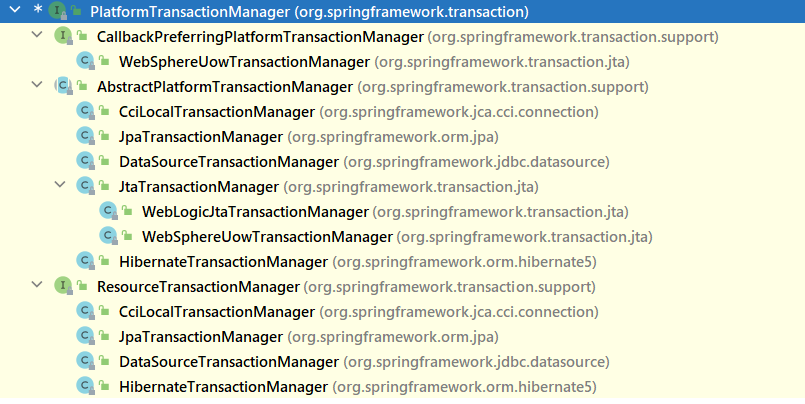
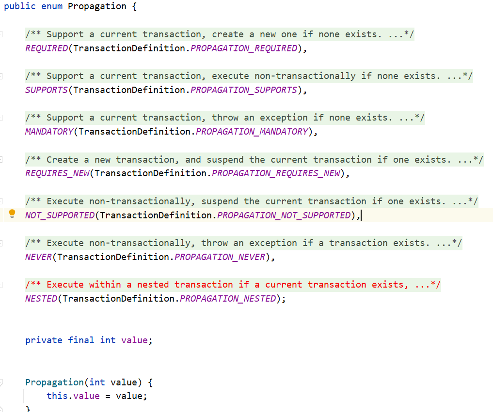
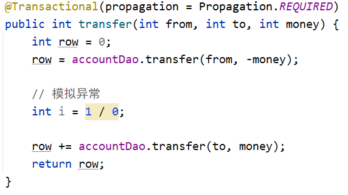
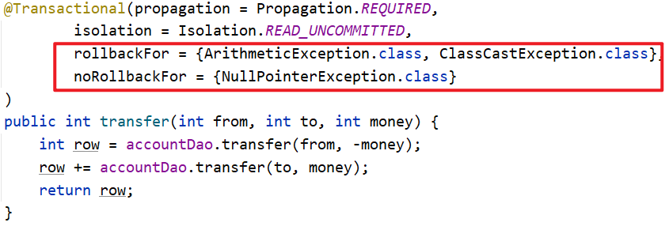
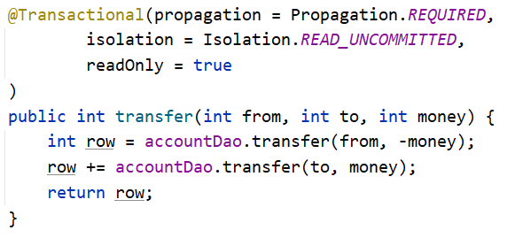
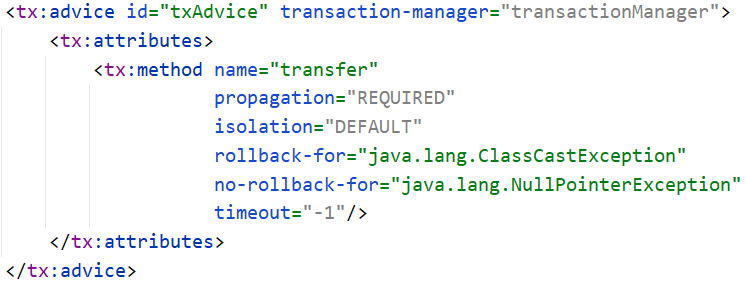

# 七. JdbcTemplate 

### 7.1  概述

为了使 JDBC 更加易于使用,Spring 在 *JDBC API* 上定义了一个抽象层,以此建立一个JDBC存取框架. 

作为 Spring JDBC 框架的核心,JDBC模板的设计目的是为不同类型的JDBC操作提供模板方法,通过这种方式,以在尽可能保留灵活性的情况下,将数据库存取的工作量降到最低. 

可以将 Spring 的 JdbcTemplate 看作是一个小型的轻量级持久化层框架,和我们之前使用过的 DBUtils 风格非常接近.

### 7.2  环境准备

#### 7.2.1导入JAR包

~~~~xml
<dependencies>
    <dependency>
        <groupId>junit</groupId>
        <artifactId>junit</artifactId>
        <version>4.9</version>
        <scope>test</scope>
    </dependency>

    <dependency>
        <groupId>mysql</groupId>
        <artifactId>mysql-connector-java</artifactId>
        <version>5.1.47</version>
    </dependency>

    <dependency>
        <groupId>com.alibaba</groupId>
        <artifactId>druid</artifactId>
        <version>1.1.9</version>
    </dependency>

    <dependency>
        <groupId>org.springframework</groupId>
        <artifactId>spring-context</artifactId>
        <version>5.2.12.RELEASE</version>
    </dependency>

    <dependency>
        <groupId>org.springframework</groupId>
        <artifactId>spring-orm</artifactId>
        <version>5.2.12.RELEASE</version>
    </dependency>

    <dependency>
        <groupId>org.springframework</groupId>
        <artifactId>spring-test</artifactId>
        <version>5.2.12.RELEASE</version>
    </dependency>

    <dependency>
        <groupId>org.projectlombok</groupId>
        <artifactId>lombok</artifactId>
        <version>1.16.10</version>
        <scope>provided</scope>
    </dependency>

    <dependency>
        <groupId>org.aspectj</groupId>
        <artifactId>aspectjweaver</artifactId>
        <version>1.9.4</version>
    </dependency>
</dependencies>
~~~~

#### 7.2.2 数据库配置文件

在 *resources* 文件夹下创建 *jdbc.properties* 文件,内容如下:

~~~properties
jdbc.driver=com.mysql.jdbc.Driver
jdbc.url=jdbc:mysql://localhost:3306/demo?autoReconnect=true&useUnicode=true&characterEncoding=utf8&serverTimezone=Asia/Shanghai
jdbc.username=root
jdbc.password=root
~~~

#### 7.2.3 Spring配置文件

1. 数据源对象

~~~xml
<!-- 数据源,连接池 -->
<context:property-placeholder location="classpath:jdbc.properties"/>
<bean id="myDataSource" class="com.alibaba.druid.pool.DruidDataSource">
    <property name="driverClassName" value="${jdbc.driver}"></property>
    <property name="url" value="${jdbc.url}"></property>
    <property name="username" value="${jdbc.username}"></property>
    <property name="password" value="${jdbc.password}"></property>
</bean>
~~~

2. JdbcTemplate对象

~~~xml
<!-- JdbcTemplate -->
<bean id="jdbcTemplate" class="org.springframework.jdbc.core.JdbcTemplate">
    <property name="dataSource" ref="myDataSource"/>
</bean>
~~~


### 7.3 持久化操作

创建测试类

```java
@Runwith(SpringRunner.class)
@ContextConfiguration("classpath:application.xml")
public class TestJdbcTemplate {
    // 注入JdbcTemplate
    @Autowired
	private JdbcTemplate jdbcTemplate;
    
    /**
     * update(): 完成增 删  改 操作. 
     */
    @Test
    public void testUpdate() {
        String sql = "insert into tbl_employee(last_name,gender,descr) values(?,?,?)" ;
        jt.update(sql, "孟老湿", 1 , "Java界的苍老师");
    }
    
    /**
     * batchUpdate(): 完成批量增删改操作 
     */
    @Test
    public void testBatchUpdate() {
        String sql = "insert into tbl_employee(last_name,gender,descr) values(?,?,?)" ;
        List<Object [] > batchArgs = new ArrayList<>();
        batchArgs.add(new Object[] {"太旺",1 ,"太旺小时候"});
        batchArgs.add(new Object[] {"木旺",1 ,"木旺长大后"});
        batchArgs.add(new Object[] {"大旺",1 ,"大旺泰国一日游后"});
        jt.batchUpdate(sql, batchArgs);
    }
    
    /**
     * queryForObject(): 查询返回一个对象. 
     * 	 1. 查询一条数据返回一个JavaBean对象 √
     *   2. 查询返回单个值. 
     */	
    @Test
    public void testQueryForObjectReturnJavaBean() {
        String sql = "select id,last_name,gender,descr from tbl_employee where id = ? ";

        //查询数据返回结果集后, ResultSet  , 我们需要将每条结果中的每个字段的值赋值给JavaBean对象的每个属性. 
        //Spring只需要我们通过RowMapper指定一个JavaBean的类型即可.
        RowMapper<Employee> rowMapper = new BeanPropertyRowMapper<>(Employee.class);
        Employee employee = jt.queryForObject(sql, rowMapper, 1001); 
        System.out.println(employee);
    }
    
    /**
     * query(): 查询多条数据返回多个JavaBean对象的集合. 
     */
    @Test
    public void testQuery() {
        String sql = "select id,last_name,gender,descr from tbl_employee" ;
        RowMapper<Employee> rowMapper = new BeanPropertyRowMapper<>(Employee.class);
        List<Employee > emps = jt.query(sql, rowMapper);
        System.out.println(emps);
    }
    
    /**
     * queryForObject(): 查询返回一个对象. 
     * 	 1. 查询一条数据返回一个JavaBean对象
     *   2. 查询返回单个值. √
     */
    @Test
    public void testQueryForObjectReturnValue() {
        String sql = "select count(id) from tbl_employee" ;
        Integer result = jt.queryForObject(sql, Integer.class);
        System.out.println(result);
    }
}

```


### 7.4 使用JdbcTemplate实现Dao

1) 通过IOC容器自动注入

**JdbcTemplate类是线程安全的**,所以可以在IOC容器中声明它的单个实例,并将这个实例注入到所有的Dao实例中.

~~~java
@Repository
public class EmployeeDao {

	@Autowired
	private JdbcTemplate jdbcTemplate ; 
		
	public void insertEmployee(Employee employee) {
		//JdbcTemplate
	}
}

~~~


# 八. 声明式事务管理

## 8.1事务概述

- 在JavaEE企业级开发的应用领域,为了保证数据的完整性和一致性,必须引入数据库事务的概念,所以事务管理是企业级应用程序开发中必不可少的技术.
- 事务就是一组由于逻辑上紧密关联而合并成一个整体(工作单元)的多个数据库操作,这些操作要么都执行,要么都不执行. 
- 事务的四个关键属性(**ACID**)
  1. **原子性**(atomicity)：“原子”的本意是“不可再分”,事务的原子性表现为一个事务中涉及到的多个操作在逻辑上缺一不可.事务的原子性要求事务中的所有操作要么都执行,要么都不执行. 
  2. **一致性**(consistency)：“一致”指的是数据的一致,具体是指：所有数据都处于满足业务规则的一致性状态.一致性原则要求：一个事务中不管涉及到多少个操作,都必须保证事务执行之前数据是正确的,事务执行之后数据仍然是正确的.如果一个事务在执行的过程中,其中某一个或某几个操作失败了,则必须将其他所有操作撤销,将数据恢复到事务执行之前的状态,这就是回滚.
  3. **隔离性**(isolation)：在应用程序实际运行过程中,事务往往是并发执行的,所以很有可能有许多事务同时处理相同的数据,因此每个事务都应该与其他事务隔离开来,防止数据损坏.隔离性原则要求多个事务在并发执行过程中不会互相干扰.
  4. **持久性**(durability)：持久性原则要求事务执行完成后,对数据的修改永久的保存下来,不会因各种系统错误或其他意外情况而受到影响.通常情况下,事务对数据的修改应该被写入到持久化存储器中.

## 8.2 Spring事务管理

### 8.2.1 编程式事务管理

- 使用原生的 *JDBC API* 进行事务管理

  1. 获取数据库连接Connection对象

  2. 取消事务的自动提交

  3. 执行操作

  4. 正常完成操作时手动提交事务

  5. 执行失败时回滚事务

  6. 关闭相关资源

- 评价

  使用原生的 JDBC API 实现事务管理是所有事务管理方式的基石,同时也是最典型的编程式事务管理.编程式事务管理需要将事务管理代码嵌入到业务方法中来控制事务	的提交和回滚.在使用编程的方式管理事务时,必须在每个事务操作中包含额外的事务管理代码.相对于核心业务而言,事务管理的代码显然属于非核心业务,如果多个模块	都使用同样模式的代码进行事务管理,显然会造成较大程度的代码冗余.

### 8.2.2 声明式事务管理

​	大多数情况下声明式事务比编程式事务管理更好：它将事务管理代码从业务方法中分离出来,以声明的方式来实现事务管理.事务管理代码的固定模式作为一种横切关注点,可以通过 AOP 方法模块化,进而借助 Spring AOP框架实现声明式事务管理. Spring 在不同的事务管理 API 之上定义了一个抽象层,通过配置的方式使其生效,从而让应用程序开发人员不必了解事务管理 API 的底层实现细节,就可以使用 Spring 的事务管理机制. Spring 既支持编程式事务管理,也支持声明式的事务管理.

### 8.2.3 Spring提供的事务管理器

​	Spring 从不同的事务管理API中抽象出了一整套事务管理机制,让事务管理代码从特定的事务技术中独立出来.开发人员通过配置的方式进行事务管理,而不必了解其底层是如何实现的.Spring的核心事务管理抽象是它为事务管理封装了一组独立于技术的方法.无论使用 Spring 的哪种事务管理策略(编程式或声明式),事务管理器都是必须的.事务管理器可以以普通的bean的形式声明在 Spring IoC 容器中.

### 8.2.4事务管理器的主要实现

1. *DataSourceTransactionManager* ：在应用程序中只需要处理一个数据源,而且通过 *JDBC* 存取
2. *JtaTransactionManager* ：在 JavaEE 应用服务器上用 *JTA(Java Transaction API)* 进行事务管理
3. *HibernateTransactionManager* ：用Hibernate框架存取数据库



## 8.3 测试数据准备

### 8.3.1 需求

测试用户之间转账案例

### 8.3.2 数据库表

~~~sql
SET NAMES utf8mb4;
SET FOREIGN_KEY_CHECKS = 0;

-- ----------------------------
-- Table structure for tb_account
-- ----------------------------
DROP TABLE IF EXISTS `tb_account`;
CREATE TABLE `tb_account`  (
  `id` int(11) NOT NULL AUTO_INCREMENT COMMENT 'id',
  `username` varchar(255) CHARACTER SET utf8mb4 COLLATE utf8mb4_general_ci NOT NULL,
  `balance` int(10) NULL DEFAULT NULL,
  PRIMARY KEY (`id`) USING BTREE
) ENGINE = InnoDB AUTO_INCREMENT = 3 CHARACTER SET = utf8mb4 COLLATE = utf8mb4_general_ci ROW_FORMAT = Compact;

-- ----------------------------
-- Records of tb_account
-- ----------------------------
INSERT INTO `tb_account` VALUES (1, '洛必达', 10000);
INSERT INTO `tb_account` VALUES (2, '牛顿', 10000);

SET FOREIGN_KEY_CHECKS = 1;
~~~

### 8.3.3 实体类

```java
@Data
@NoArgsConstructor
@AllArgsConstructor
@Accessors(chain = true)
public class Account {
    
    private Integer id;
    
    private String username;
    
    private Integer balance;

}
```

### 8.3.4 Dao层实现

```java
public interface AccountDao {
    
    int transfer(int id, int money);

}

@Repository
public class AccountDaoImpl implements AccountDao {
    
    @Autowired
    private JdbcTemplate jdbcTemplate;

    @Override
    public int transfer(int id, int money) {
        String sql = "update `tb_account` set balance = balance + ? where id = ?";
        return jdbcTemplate.update(sql, money, id);
    }
}
```

### 8.3.5 Service层实现

```java
@Service
public class AccountService {
    
    @Autowired
    private AccountDao accountDao;

    /**
     * 转账
     * @param from  转账人
     * @param to    收款人
     * @param money 金额
     */
    @Transactional
    public int transfer(int from, int to, int money) {
        int row = 0;
        row = accountDao.transfer(from, -money);
        
        // 模拟异常
        int i = 1 / 0;
        
        row += accountDao.transfer(to, money);
        return row;    
    }
}
```


## 8.4 初步实现

1. 配置文件

~~~xml
<!-- 配置事务管理器 -->
<bean id="transactionManager" 
	class="org.springframework.jdbc.datasource.DataSourceTransactionManager">
	<property name="dataSource" ref="dataSource"/>	  
</bean>

<!-- 启用事务注解 -->
<tx:annotation-driven transaction-manager="transactionManager"/>
~~~

> 小贴士: *transaction-manager* 属性默认值就是 **transactionManager** 所以可以省略不写

2. 在需要进行事务控制的方法上加注解 `@Transactional`
3. 创建测试类

```java
@RunWith(SpringRunner.class)
@ContextConfiguration("classpath:application.xml")
public class TestSpringRunner {

    @Autowired
    private AccountService accountService;

    @Test
    public void testTransfer() {
        int i = accountService.transfer(1, 2, 200);
        System.out.println(i);
    }
}
```


## 8.5 事务的传播行为

### 8.5.1 简介

当事务方法被另一个事务方法调用时,必须指定事务应该如何传播.例如：方法可能继续在现有事务中运行,也可能开启一个新事务,并在自己的事务中运行.事务的传播行为可以由传播属性指定.Spring定义了7种类传播行为.

在 *org.springframework.transaction.annotation.Propagation* 枚举类中可以看到如下传播机制定义:




| **传播机制**                  | **说明**                                                     |
| :---------------------------- | :----------------------------------------------------------- |
| **PROPAGATION_REQUIRED**      | **支持当前事务,如果当前没有事务则创建一个新的事务. REQUIRED 传播机制也是 spring 默认传播机制.** |
| **PROPAGATION_SUPPORTS**      | **支持当前事务,如果当前没有事务则以 非事务 方式执行.**       |
| **PROPAGATION_MANDATORY**     | **支持当前事务,如果当前不存在事务则抛出异常.**               |
| **PROPAGATION_REQUIRES_NEW**  | **不支持当前事务并创建一个新的事务,假如当前存在事务则挂起.** |
| **PROPAGATION_NOT_SUPPORTED** | **不支持当前事务并以非事务方式执行,假如当前存在事务则挂起.** |
| **PROPAGATION_NEVER**         | **不支持当前事务并以非事务方式执行,假如当前存在事务则抛出异常.** |
| **PROPAGATION_NESTED**        | **如果当前存在事务,则在嵌套的事务内执行.如果当前没有事务,则执行与 PROPAGATION_REQUIRED 类似的操作** |

事务传播属性可以在 `@Transactional` 注解的 *propagation* 属性中定义.



### 8.5.2 补充

在Spring 2.x事务通知中,可以像下面这样在 `<tx:method>` 元素中设定传播事务属性.


## 8.6 事务的隔离级别

### 8.6.1 数据库事务并发问题

假设现在有两个事务：Transaction01 和 Transaction02 并发执行.

- **脏读**
  1. Transaction01 将某条记录的 AGE 值从 20 修改为 30.
  2. Transaction02 读取了 Transaction01 更新后的值：30.
  3. Transaction01 回滚,AGE值恢复到了20.
  4. Transaction02 读取到的30就是一个无效的值.
- **不可重复读**
   1. Transaction01 读取了AGE值为 20.
   2. Transaction02 将AGE值修改为 30.
   3. Transaction01再次读取AGE值为 30,和第一次读取不一致.
- **幻读**
   	1. Transaction01 读取了 STUDENT 表中的一部分数据.
   	2. Transaction02 向 STUDENT 表中插入了新的行.
   	3. Transaction01 读取了 STUDENT 表时,多出了一些行.

### 8.6.2 隔离级别

数据库系统必须具有隔离并发运行各个事务的能力,使它们不会相互影响,避免各种并发问题.**一个事务与其他事务隔离的程度称为隔离级别**.SQL标准中规定了多种事务隔离级别,不同隔离级别对应不同的干扰程度,隔离级别越高,数据一致性就越好,但并发性越弱.

1. **读未提交**：*READ UNCOMMITTED*

   允许 Transaction01 读取 Transaction02 未提交的修改.

2. **读已提交**：*READ COMMITTED*
   要求 Transaction01 只能读取 Transaction02 已提交的修改.

3. **可重复读**：*REPEATABLE READ*
   确保 Transaction01 可以多次从一个字段中读取到相同的值,即 Transaction01 执行期间禁止其它事务对这个字段进行更新.

4. **串行化**：*SERIALIZABLE*

   确保 Transaction01 可以多次从一个表中读取到相同的行,在 Transaction01 执行期间,禁止其它事务对这个表进行添加、更新、删除操作.可以避免任何并发问题,但性能十分低下.

5. 各个隔离级别解决并发问题的能力见下表

   | 隔离级别             | 脏读 | 不可重复读 | 幻读 |
   | -------------------- | ---- | ---------- | ---- |
   | **READ UNCOMMITTED** | 有   | 有         | 有   |
   | **READ COMMITTED**   | 无   | 有         | 有   |
   | **REPEATABLE READ**  | 无   | 无         | 有   |
   | **SERIALIZABLE**     | 无   | 无         | 无   |

6. 各种数据库产品对事务隔离级别的支持程度

   | 隔离级别             | Oracle  | MySQL   |
   | -------------------- | ------- | ------- |
   | **READ UNCOMMITTED** | ×       | √       |
   | **READ COMMITTED**   | √(默认) | √       |
   | **REPEATABLE READ**  | ×       | √(默认) |
   | **SERIALIZABLE**     | √       | √       |

### 8.6.3 在Spring中指定事务隔离级别

1) 注解: 用 `@Transactional` 注解声明式地管理事务时可以在 `@Transactional` 的 *isolation* 属性中设置隔离级别


1) XML: 在 Spring 2.x 事务通知中,可以在 `<tx:method>` 元素中指定隔离级别


## 8.7 触发事务回滚的异常

### 8.7.1默认情况

捕获到 *RuntimeException* 或 *Error* 时回滚,而捕获到编译时异常不回滚.

### 8.7.2设置途经

- 注解 `@Transactional` 注解
  ① *rollbackFor* 属性：指 **遇到异常** 时 **回滚** 的异常类型
  ② *noRollbackFor* 属性：指 **遇到异常** 时 **不回滚** 的异常类型

  

- XML: 在 Spring 2.x 事务通知中,可以在 `<tx:method>` 元素中指定回滚规则.如果有不止一种异常则用逗号分隔.
  
  

## 8.8 事务的超时和只读属性

### 8.8.1 简介

由于事务可以在行和表上获得锁,因此长事务会占用资源,并对整体性能产生影响.如果一个事务只读取数据但不做修改,数据库引擎可以对这个事务进行优化.超时事务属性：事务在强制回滚之前可以保持多久.这样可以防止长期运行的事务占用资源.只读事务属性: 表示这个事务只读取数据但不更新数据, 这样可以帮助数据库引擎优化事务.

### 8.8.2 设置

1) 注解: `@Transaction` 注解



2) XML
   在Spring 2.x事务通知中,超时和只读属性可以在&lt;tx:method&gt;元素中进行指定

   

## 8.9 基于XML文档的声明式事务配置

~~~xml
<!-- 配置事务切面 -->
<aop:config>
    <aop:pointcut expression="execution(* cn.element.tx.component.service.BookShopServiceImpl.purchase(..))" id="txPointCut"/>
    <!-- 将切入点表达式和事务属性配置关联到一起 -->
    <aop:advisor advice-ref="myTx" pointcut-ref="txPointCut"/>
</aop:config>

<!-- 配置基于XML的声明式事务  -->
<tx:advice id="myTx" transaction-manager="transactionManager">
    <tx:attributes>
        <!-- 设置具体方法的事务属性 -->
        <tx:method name="find*" read-only="true"/>
        <tx:method name="get*" read-only="true"/>
        <tx:method name="purchase" 
                   isolation="READ_COMMITTED" 
                   no-rollback-for="java.lang.ArithmeticException,java.lang.NullPointerException"
                   propagation="REQUIRES_NEW"
                   read-only="false"
                   timeout="10"/>
    </tx:attributes>
</tx:advice>
~~~


## 8.10 通过注解配置类配置项目

1. 创建配置类

```java
@EnableTransactionManagement  // 开启事务注解
@Configuration
@ComponentScan(basePackages = "cn.element.spring")
@PropertySource("classpath:jdbc.properties")
public class ApplicationConfig {
    
    @Value("${jdbc.username}")
    private String username;
    
    @Value("${jdbc.password}")
    private String password;
    
    @Value("${jdbc.url}")
    private String url;
    
    @Value("${jdbc.driverClass}")
    private String driver;

    /**
     * 配置Druid数据源
     */
    @Bean
    public DruidDataSource druidDataSource() {
        DruidDataSource dataSource = new DruidDataSource();
        dataSource.setUsername(username);
        dataSource.setPassword(password);
        dataSource.setUrl(url);
        dataSource.setDriverClassName(driver);
        return dataSource;
    }

    /**
     * 配置JdbcTemplate
     */
    @Bean
    public JdbcTemplate jdbcTemplate(@Autowired DruidDataSource dataSource) {
        return new JdbcTemplate(dataSource);
    }

    /**
     * 配置事务管理器
     */
    @Bean
    public PlatformTransactionManager platformTransactionManager(DruidDataSource dataSource) {
        return new DataSourceTransactionManager(dataSource);
    }
}
```

2. 创建测试类

```java
@ExtendWith(SpringExtension.class)
@ContextConfiguration(classes = ApplicationConfig.class)
public class TestJunit5 {

    @Autowired
    private AccountService accountService;
    
    @Test
    public void testTransfer() {
        int i = accountService.transfer(1, 2, 200);
        System.out.println(i);
    }
}
```

> @ContextConfiguration(classes = ApplicationConfig.class) 指定了创建的配置类,进行初始化上下文.


# 九. Spring日志使用

1. 导入依赖

```xml
<dependency>
    <groupId>org.apache.logging.log4j</groupId>
    <artifactId>log4j-slf4j-impl</artifactId>
    <version>2.14.1</version>
    <scope>test</scope>
</dependency>
```

2. 在 *resources* 文件夹下创建 *log4j2.xml* 配置文件

```xml
<?xml version="1.0" encoding="UTF-8"?>
<Configuration status="DEBUG">
    <Appenders>
        <Console name="Console" target="SYSTEM_OUT">
            <PatternLayout pattern="%d{YYYY-MM-dd HH:mm:ss} [%t] %-5p %c{1}:%L - %msg%n" />
        </Console>
    </Appenders>
    <Loggers>
        <Root level="debug">
            <AppenderRef ref="Console" />
        </Root>
    </Loggers>
</Configuration>
```


# 十. Spring整合Junit

在很多场合下我们都需要在 Spring 上下文环境下进行单元测试, *Junit* 与 Spring 整合只需要几个步骤即可

## 10.1 整合Junit4

1. 导入依赖

```xml
<dependency>
    <groupId>junit</groupId>
    <artifactId>junit</artifactId>
    <version>4.13.2</version>
    <scope>test</scope>
</dependency>

<dependency>
    <groupId>org.springframework</groupId>
    <artifactId>spring-test</artifactId>
    <version>5.2.12.RELEASE</version>
    <scope>test</scope>
</dependency>
```

2. 创建测试类

***@RunWith(SpringRunner.class)*** 指定运行的是 Spring 上下文环境

***@ContextConfiguration("classpath:application.xml")*** 指定配置文件路径

```java
@RunWith(SpringRunner.class)
@ContextConfiguration("classpath:application.xml")
public class TestSpringRunner {
    
    @Autowired
    private UserService userService;
    
    @Test
    public void testJdbcTemplate() {
        List<User> users = userService.selectAll();
        users.forEach(System.out::println);
    }
}
```


## 10.2 整合Junit5

1. 导入依赖

```xml
<dependency>
    <groupId>org.junit.jupiter</groupId>
    <artifactId>junit-jupiter</artifactId>
    <version>5.7.2</version>
    <scope>test</scope>
</dependency>

<dependency>
    <groupId>org.springframework</groupId>
    <artifactId>spring-test</artifactId>
    <version>5.2.12.RELEASE</version>
    <scope>test</scope>
</dependency>
```

2. 创建测试类

***@ExtendWith(SpringExtension.class)*** 指定 Junit 运行的环境

***@ContextConfiguration("classpath:application.xml")*** 指定 Spring 的配置文件位置

```java
@ExtendWith(SpringExtension.class)
@ContextConfiguration("classpath:application.xml")
public class TestJunit5 {

    @Autowired
    private UserService userService;
    
    @Test
    public void testJdbcTemplate() {
        List<User> users = userService.selectAll();
        users.forEach(System.out::println);
    }
}
```

