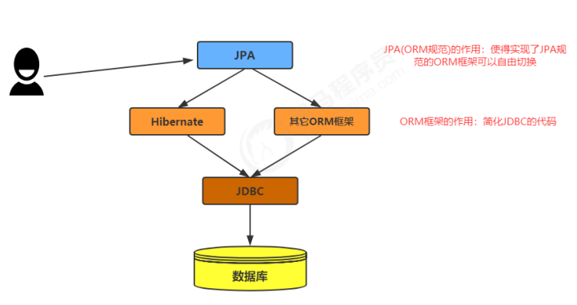
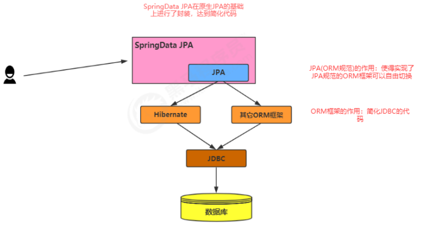
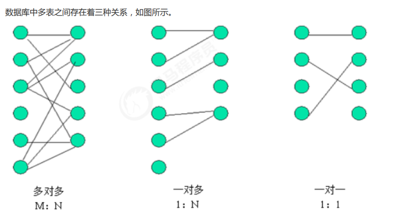

# Spring Data JPA使用指南


# JPA

## 	2.1 什么是JPA?

​	JPA 的全称是 Java Persistence API，即 Java 持久化 API，是 SUN 公司推出的一套基于 ORM 的规范，注意不是 ORM 框架——因为 JPA 并未提供 ORM 实现，它只是提供了一些编程的 API 接口。




## 	2.2 实操

### 1. 引入核心依赖

```xml
<dependencies>
    <!--mysql-->
    <dependency>
        <groupId>mysql</groupId>
        <artifactId>mysql-connector-java</artifactId>
        <version>5.1.47</version>
    </dependency>

    <!--hibernate-->
    <dependency>
        <groupId>org.hibernate</groupId>
        <artifactId>hibernate-entitymanager</artifactId>
        <version>5.0.7.Final</version>
    </dependency>

    <!--hibernate-core-->
    <dependency>
        <groupId>org.hibernate</groupId>
        <artifactId>hibernate-core</artifactId>
        <version>5.0.7.Final</version>
    </dependency>

    <!--druid-->
    <dependency>
        <groupId>com.alibaba</groupId>
        <artifactId>druid</artifactId>
        <version>1.2.6</version>
    </dependency>
</dependencies>
```

### 2. 创建pojo类 

```java
@Data
@NoArgsConstructor
@AllArgsConstructor
@Accessors(chain = true)
@Entity							//表示这是一个实体类
@Table(name = "tb_article") 	//建立实体类和表的映射关系
public class Article implements Serializable {
	@Id//声明当前私有属性为主键
	@GeneratedValue(strategy = GenerationType.IDENTITY) //配置主键的生成策略
	private Integer id;
    
	//声明类的属性跟数据表字段的对应关系，如果属性名称和字段名称一致，可省略
	@Column(name = "title")
    private String title;
    private String author;
    private Date createTime;
}
```

### 3. 加入JPA的核心配置文件

在maven工程的resources路径下创建一个名为META-INF的文件夹，在文件夹下创建一个名为
<u>persistence.xml</u>的配置文件。**注意：META-INF文件夹名称不能修改,persistence.xml文件名称不能改**.

```xml
<?xml version="1.0" encoding="utf-8" ?>
<!--导入schema约束，此约束来源：复制hibernate-core:5.2.16.Final包下的/org/hibernate/jpa/persistence_2_0.xsd文件中的这一段出来即可。-->
<persistence
        xmlns="http://java.sun.com/xml/ns/persistence"
        xmlns:xsi="http://www.w3.org/2001/XMLSchema-instance"
        xsi:schemaLocation=
                "http://java.sun.com/xml/ns/persistence
                 http://java.sun.com/xml/ns/persistence/persistence_2_0.xsd"
        version="2.0"
>
    <!--配置持久化单元（可以配置多个，名称不能重复）
        name:用于指定持久化单元的名称
        transaction-type:指定事务的类型。
                      JTA:Java Transaction API
                      RESOURCE_LOCAL:指的是本地代码事务
    -->
    <persistence-unit name="myPersistenceUnit" transaction-type="RESOURCE_LOCAL">
        <!--JPA规范提供商，可以不写,当项目中只导入了一个JPA实现时,此选项可以省略-->
        <provider>org.hibernate.jpa.HibernatePersistenceProvider</provider>

        <!--指定Jpa注解的实体类型位置，可以不写-->
        <class>cn.element.jpa.pojo.Article</class>

        <!--连接相关的一些配置，都是用hibernate的。-->
        <properties>
            <!--第一部分，连接数据库信息-->
            <property name="hibernate.connection.driver_class" value="com.mysql.jdbc.Driver"/>
            <property name="hibernate.connection.url" value="jdbc:mysql://127.0.0.1:3306/data?characterEncoding=utf8&amp;useUnicode=true&amp;useSSL=false&amp;serverTimezone=Asia/Shanghai"/>
            <property name="hibernate.connection.username" value="root"/>
            <property name="hibernate.connection.password" value="root"/>

            <!--说明:数据库的方言，用于存放不同数据库之间的SQL语句差异。-->
            <!--            <property name="hibernate.dialect" value="org.hibernate.dialect.MySQL57Dialect"/>-->

            <!--第二部分，hibernate的可选配置-->
            <!--是否显示hibernate的生成的SQL语句-->
            <property name="hibernate.show_sql" value="true"/>

            <!--是否使用格式化输出SQL语句到控制台-->
            <property name="hibernate.format_sql" value="true"/>

            <!--采用何种方式生成DDL语句，update表示检测实体类的映射配置与数据库表结构是否一致，不一致，则更新数据库。
                其实就是自动建表-->
            <property name="hibernate.hbm2ddl.auto" value="update"/>

            <!--连接池的配置,常用的还有阿里的-->
            <!--            <property name="hibernate.connection.provider_class" value="com.alibaba.druid.support.hibernate.DruidConnectionProvider"/>-->
        </properties>
    </persistence-unit>
</persistence>
```

### 4.  测试

```java
	/**
     * 测试保存操作
     * Persistence              通过读取持久化单元名称,根据读取名称得到的配置创建持久化管理器工厂
     * EntityTransaction        进行事务管理begin commit rollback
     * EntityManagerFactory     这是一个工厂类,目的是为了创建EntityManager,对于这种工厂类,它的创建	  和销毁特别耗费资源
     *                          一般在一个项目中为单例
     * EntityManager            基于这个API可以实现数据库的CRUD
     *
     * persist(T)               保存
     * find(Class, T)           查询
     * merge(Class)             修改
     * remove(T)                删除
     */
    @Test
    public void testSave() {
        // 创建实体
        Article article = new Article();
        article.setTitle("测试文章")
               .setAuthor("洛必达")
               .setCreateTime(new Date());

        // 使用JPA将文章保存到数据库
        // 1.创建一个持久化管理器工厂,单元名称要和xml配置文件中的一致!
        String unitName = "myPersistenceUnit";
        EntityManagerFactory factory = Persistence.createEntityManagerFactory(unitName);

        // 2.创建持久化管理器,基于此API可以完成获取事务以及对数据库的CRUD操作
        EntityManager manager = factory.createEntityManager();

        // 3.得到事务,并且开启
        EntityTransaction transaction = manager.getTransaction();
        transaction.begin();

        // 4.操作
        manager.persist(article);

        // 5.提交事务
        transaction.commit();

        // 6.关闭资源
        manager.close();
    }
```

### 5. JPA中的重要API

```
Persistence              通过读取持久化单元名称,根据读取名称得到的配置创建持久化管理器工厂
EntityTransaction        进行事务管理begin commit rollback
EntityManagerFactory     这是一个工厂类,目的是为了创建EntityManager,对于这种工厂类,它的创建和销毁						  特别耗费资源一般在一个项目中为单例.

EntityManager            基于这个API可以实现数据库的CRUD.
persist(T)               保存
find(Class, T)           查询
merge(Class)             修改
remove(T)                删除
getReference		 	 根据id查询
```


## 	2.3 Spring Data JPA

### 2.3.1 简介

​	SpringData JPA是Spring Data家族的一个成员，是Spring Data对JPA封装之后的产物，目的在于简化基于JPA的数据访问技术。使用SpringData JPA技术之后，开发者只需要声明Dao层的接口，不必再写实现类或其它代码，剩下的一切交给SpringData JPA来搞定 .

### 2.3.2 快速入门

#### 1. 导入依赖

```xml
<!--spring-data-jpa-->
<dependency>
    <groupId>org.springframework.boot</groupId>
    <artifactId>spring-boot-starter-data-jpa</artifactId>
</dependency>
```

#### 2. 编写DAO层接口

```
/**
 * JpaRepository<实体类类型，主键类型>：用来完成基本 CRUD 操作
 * JpaSpecificationExecutor<实体类类型>：用于复杂查询（分页等查询操作）
 */
public interface ArticleDao extends JpaRepository<Article, Integer>,
									JpaSpecificationExecutor<Article> {
									
}
```

#### 3. 配置YAML文件

```yaml
spring:
  application:
    name: boot-demo-application

  datasource:
    url: jdbc:mysql://localhost:3306/data?autoReconnect=true&useUnicode=true&characterEncoding=utf8&serverTimezone=Asia/Shanghai
    type: com.alibaba.druid.pool.DruidDataSource
    username: root
    password: root
    driver-class-name: com.mysql.jdbc.Driver

  jpa:
    hibernate:
      ddl-auto: update  # 允许自动建表
    show-sql: true      # 显示sql语句
    generate-ddl: true  # 生成ddl语句
```

#### 4. 测试

```java
@Slf4j
@SpringBootTest
@RunWith(SpringRunner.class)
public class TestSpringJPA {

    @Autowired
    private ArticleDao articleDao;

    /**
     * 测试保存
     */
    @Test
    public void testSave() {
        Article article = new Article();
        article.setTitle("测试文章")
               .setAuthor("洛必达")
               .setCreateTime(new Date());

        articleDao.save(article);
        log.info("{}", article);
    }
}
```

#### 5. CRUD的API

```java
List<T> findAll();  							// 查询全部
List<T> findAll(Sort var1);						// 查询全部排序	
List<T> findAllById(Iterable<ID> var1);			// 根据id查询全部
List<S> findAll(Example<S> var1);				// 条件查询全部
List<S> findAll(Example<S> var1, Sort var2);	// 条件查询全部并且排序
Optional<S> findOne(Example<S> var1);			// 条件查询单个
Iterable<S> findAll(Example<S> var1);			// 条件查询全部
Iterable<S> findAll(Example<S> var1, Sort var2);// 条件查询并且排序
Page<S> findAll(Example<S> var1, Pageable var2);// 分页条件查询
List<S> saveAll(Iterable<S> var1);				// 批量插入
void deleteInBatch(Iterable<T> var1);			// 批量删除
void deleteAllInBatch();						// 删除全部
T getOne(ID var1);								// 根据id查询
long count(Example<S> var1);					// 计算符合条件的记录数量
boolean exists(Example<S> var1);				// 判断是否存在
```


### 2.3.3 Spring Data JPA运行时原理

#### Spring Data中的几个重要接口

自定义的接口继承了两个接口，方法肯定来自里面，追踪关系得到下面的继承关系
**Repository** 标记接口：继承了此接口后会被Spring识别，进而可以在接口中声明一些满足规范的方
					法
	↑
	|
**CrudRepository** 实现了基本增删改查方法
	↑
	|
**PagingAndSortingRepository** 实现了分页和排序的方法
	↑
	|
**JpaRepository** 重写了几个查找和删除的方法
	↑
	|
**IRepository**
通过上面的继承关系，我们可以看到我们自定义的接口ArticleDao继承了一系列的Repository接口，
而每一个接口都会给我们提供一部分的功能，这样继承下来，我们的ArticleDao不用任何的方法声明就拥有
了很多的功能了。


#### Spring Data底层原理

1.  在运行时，Spring会使用**JdkDynamicAopProxy**为dao接口生成一个代理对象
2.  那么这个代理对象是根据那个类代理出来的呢？点击进入**JdkDynamicAopProxy**源码查看invoke方
    法，发现**targetSource**代理的是**SimpleJpaRepository**类
3.  通过对**SimpleJpaRepository**中代码的分析，我们看到最终执行保存的是**EntityManager**对象
4.  总结：使用**SpringData JPA**开发底层还是用的JPA的API，**SpringData JPA**只是对标准 JPA 操作进行了进
    一步封装，已达到简化了Dao层代码开发的目的。****

#### SpringData Jpa 与 Jpa 及 Hibernate的关系

​	

### 2.3.5 方法命名规则查询

​	顾名思义，方法命名规则查询就是根据方法的名字，就能创建查询。只需要按照SpringData JPA提供的方
法命名规则定义方法的名称，就可以完成查询工作。
​	SpringData JPA在程序执行的时候会根据方法名称进行解析，并自动生成查询语句进行查询.按照SpringData JPA定义的规则，查询方法以findBy开头，涉及条件查询时，条件的属性用条件关键字连接，**要注意的是：条件属性首字母需大写。框架在进行方法名解析时，会先把方法名多余的前缀截取掉，然后对剩下部分进行解析。**

| 关键字            | 例子                                         | 对应的JPQL语句                                               |
| ----------------- | -------------------------------------------- | ------------------------------------------------------------ |
| And               | findByLastnameAndFirstname                   | … where x.lastname = ?1 and<br/>x.firstname = ? 2            |
| Or                | findByLastnameOrFirstname                    | … where x.lastname = ?1 or<br/>x.firstname = ?2              |
| Is,Equals         | findByFirstnameIs,<br/>findByFirstnameEquals | … where x.firstname = ?1                                     |
| Between           | findByStartDateBetween                       | … where x.startDate between ?1<br/>and ?2                    |
| LessThan          | findByAgeLessThan                            | … where x.age < ?1                                           |
| LessThanEqual     | findByAgeLessThanEqual                       | … where x.age <= ?1                                          |
| GreaterThan       | findByAgeGreaterThan                         | … where x.age > ?1                                           |
| GreaterThanEqual  | findByAgeGreaterThanEqual                    | … where x.age >= ?1                                          |
| After             | findByStartDateAfter                         | … where x.startDate > ?1                                     |
| Before            | findByStartDateBefore                        | … where x.startDate < ?1                                     |
| IsNull            | findByAgeIsNull                              | … where x.age is null                                        |
| IsNotNull,NotNull | findByAge(Is)NotNull                         | … where x.age not null                                       |
| Like              | findByFirstnameLike                          | … where x.firstname like ?1                                  |
| NotLike           | findByFirstnameNotLike                       | … where x.firstname not like ?1                              |
| StartingWith      | findByFirstnameStartingWith                  | … where x.firstname like ?1<br/>(parameter bound with appended %) |
| EndingWith        | findByFirstnameEndingWith                    | … where x.firstname like ?1<br/>(parameter bound with prepended %) |
| Containing        | findByFirstnameContaining                    | … where x.firstname like ?1<br/>(parameter bound wrapped in %) |
| OrderBy           | findByAgeOrderByLastnameDesc                 | … where x.age = ?1 order by<br/>x.lastname desc              |
| Not               | findByLastnameNot                            | … where x.lastname <> ?1                                     |
| In                | findByAgeIn(Collection ages)                 | … where x.age in ?1                                          |
| NotIn             | findByAgeNotIn(Collection age)               | … where x.age not in ?1                                      |
| TRUE              | findByActiveTrue()                           | … where x.active = true                                      |
| FALSE             | findByActiveFalse()                          | … where x.active = false                                     |
| IgnoreCase        | findByFirstnameIgnoreCase                    | … where UPPER(x.firstame) = U                                |

### 2.3.6 JPQL查询

​	使用SpringData JPA提供的查询方法已经可以解决大部分的应用场景，但是对于某些业务来说，我们还
需要灵活的构造查询条件，这时就可以使用@Query注解，结合JPQL的语句方式完成查询。**JPQL**，全称是**Java Persistence Query Language**。JPQL语句是JPA中定义的一种查询语言，此种语言的用意是让开发者忽略数据库表和表中的字段，而关注实体类及实体类中的属性。它的写法十分类似于SQL语句的写法，但是要把查询的表名换成实体类名称，把表中的字段名换成实体类的属性名称。

```java
@Query("from Article as a where a.title = ?1 and a.author = ?2")
List<Article> findByCondition1(String title, String author);

@Query("from Article as a where a.title = :title and a.author = :author")
List<Article> findByCondition2(@Param("title") String title, @Param("author") String author);

@Query("from Article as a where a.title like %:title% order by a.id desc")
List<Article> findByCondition3(@Param("title") String title);

@Query("from Article as a where a.title like %:title%")
List<Article> findByCondition4(Pageable pageable, @Param("title") String title);

@Query("from Article as a where a.id in :list")
List<Article> findByCondition5(@Param("list") List<Integer> list);

@Query("from Article as a where a.title = :#{#article.title} and a.author = :#{#article.author}")
List<Article> findByCondition6(@Param("article") Article article);
```

### 2.3.7 本地SQL查询

**nativeQuery=true**表示使用本地SQL查询,**基本不会使用**，除非是出现非常复杂的业务情况导致SQL非常复杂，JPQL搞不定的时候.

```java
@Query("select * from article where title like ?1 and author = ?
2",nativeQuery=true)
List<User> findAllByTitleAndAuthor(String title,String author);
```

### 2.3.8 多表查询

#### **多表关系分析**



#### 一对一关系

数据环境（Article和ArticleData的一对一关系）

声明类间关系
在类中使用注解再声明表间关系
声明主动放弃关系维护

**@OneToOne**

**mappedBy**:        **当前类在对方类中的属性名**
**cascade**:             **选择级联操作**

创建**Article**文章类

```java
@Entity
@Table(name = "tb_article")
public class Article {

    @Id
    @GeneratedValue(strategy = GenerationType.IDENTITY)
    private Integer id;

    private String title;

    private String author;

    @Column(name = "create_time")
    private Date createTime;

    @OneToOne(mappedBy = "article", cascade = CascadeType.PERSIST)
    private ArticleData articleData;
    
    @OneToMany(mappedBy = "article")
    private Set<Comment> comments = new HashSet<>(0);

    @ManyToMany(mappedBy = "articles")
    private Set<Type> types = new HashSet<>(0);
    // 省略 getter setter toString 
}
```

创建**ArticleData**文章详情类

让这个实体来维护这个关系

**@JoinColum**

**name**:                    		  当前表中的外键名

**referencedColumnName**:    指向的对方表中的主键名

```java
@Entity
@Table(name = "tb_article_data")
public class ArticleData {

    @Id
    @GeneratedValue(strategy = GenerationType.IDENTITY)
    private Integer id;

    private String content;

    @OneToOne
    @JoinColumn(name = "articleId", referencedColumnName = "id", unique = true)
    private Article article;
}
```

#### 一对多关系

创建**Comment**(评论)类

```java
@Entity
@Table(name = "tb_comment")
public class Comment {

    @Id
    @GeneratedValue(strategy = GenerationType.IDENTITY)
    private Integer id;

    private String comment;

    @ManyToOne
    @JoinColumn(name = "articleId", referencedColumnName = "id")
    private Article article;
}
```

#### 多对多关系

创建**Type**(类别)类

**@JoinTable**

**name**:	代表中间表名称

**joinColumns**:	中间表的外键对应到当前表的主键名称

**inverseJoinColumns**:	中间表的外键对应到的对方表的主键名称

```java
@Entity
@Table(name = "tb_type")
public class Type {

    @Id
    @GeneratedValue(strategy = GenerationType.IDENTITY)
    private Integer id;

    private String name;

    @ManyToMany
    @JoinTable(
        name = "tb_type_articles",
        joinColumns = {@JoinColumn(name = "tid", referencedColumnName = "id")},
        inverseJoinColumns = {@JoinColumn(name = "aid", referencedColumnName = "id")}
    )
    private Set<Article> articles;
}
```