# 一. 认识Go

【1】简介：
Go（又称 Golang）是 Google 的 Robert Griesemer，Rob Pike 及 Ken Thompson 开发的一种计算机编程语言语言。

【2】设计初衷：
Go语言是谷歌推出的一种的编程语言，可以在不损失应用程序性能的情况下降低代码的复杂性。谷歌首席软件工程师罗布派克(Rob Pike)说：我们之所以开发Go，是因为过去10多年间软件开发的难度令人沮丧。派克表示，和今天的C++或C一样，Go是一种系统语言。他解释道，"使用它可以进行快速开发，同时它还是一个真正的编译语言，我们之所以现在将其开源，原因是我们认为它已经非常有用和强大。"

1)  计算机硬件技术更新频繁，性能提高很快。目前主流的编程语言发展明显落后于硬件，不能合理利用多核多CPU的优势提升软件系统性能。
2)  软件系统复杂度越来越高，维护成本越来越高，目前缺乏一个足够简洁高效的编程语言。
3)  企业运行维护很多c/c++的项目，c/c++程序运行速度虽然很快，但是编译速度确很慢，同时还存在内存泄漏的一系列的困扰需要解决。

【3】应用领域:

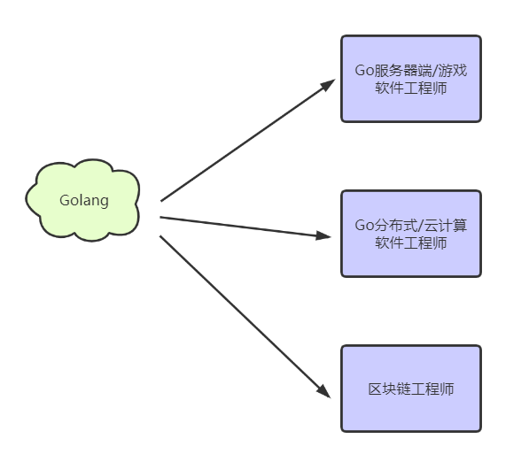

【4】用go语言的公司：
1、Google

这个不用多做介绍，作为开发Go语言的公司，当仁不让。Google基于Go有很多优秀的项目，比如：https://github.com/kubernetes/kubernetes ，大家也可以在Github上 https://github.com/google/ 查看更多Google的Go开源项目。
2、Facebook

Facebook也在用，为此他们还专门在Github上建立了一个开源组织facebookgo，大家可以通过https://github.com/facebookgo访问查看facebook开源的项目，比如著名的是平滑升级的grace。
3、腾讯

腾讯作为国内的大公司，还是敢于尝试的，尤其是Docker容器化这一块，他们在15年已经做了docker万台规模的实践，具体可以参考http://www.infoq.com/cn/articles/tencent-millions-scale-docker-application-practice 。

主要职责是：
负责腾讯游戏蓝鲸平台后台开发工作，负责容器相关的开发工作和蓝鲸平台，容器开发有关。腾讯作为主要使用C/C++的公司，使用Go会方便很多，也有很多优势，不过日积月累的C/C++代码很难改造，也不敢动，所以新业务会在Go方面尝试。
4、百度

目前所知的百度的使用是在运维这边，是百度运维的一个BFE项目，负责前端流量的接入。他们的负责人在2016年有分享，大家可以看下这个 http://www.infoq.com/cn/presentations/application-of-golang-in-baidu-frontend .其次就是百度的消息系统，从其最近的Golang招聘介绍就可以看出来.负责公司手百消息通讯系统服务器端开发及维护。
5、京东

京东云消息推送系统、云存储，以及京东商城等都有使用Go做开发。
6、小米

小米对Golang的支持，莫过于运维监控系统的开源，也就是 http://open-falcon.com/ 。此外，小米互娱、小米商城、小米视频、小米生态链等团队都在使用Golang。
7、360

360对Golang的使用也不少，一个是开源的日志搜索系统Poseidon，托管在Github上，https://github.com/Qihoo360/poseidon.还有360的推送团队也在使用，他们还写了篇博文在Golang的官方博客上 https://blog.golang.org/qihoo。360直播在招聘Golang开发工程师。美团、滴滴、新浪、阿里、京东以及七牛等。一般的选择，都是选择用于自己公司合适的产品系统来做，比如消息推送的、监控的、容器的等，Golang特别适合做网络并发的服务，这是他的强项，所以也是被优先用于这些项目。

【5】前景：  

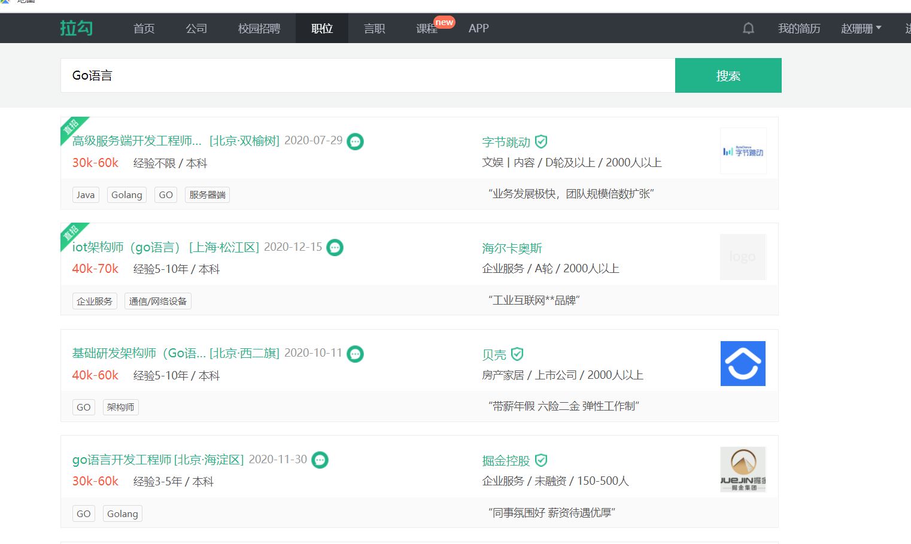

# 二. Go历史

【1】开发团队：
罗伯特·格瑞史莫（Robert Griesemer），罗勃·派克（Rob Pike）及肯·汤普逊（Ken Thompson）于2007年9月开始设计Go，稍后Ian Lance Taylor、Russ Cox加入项目。

【2】Go语言发展简史
2007年，谷歌工程师Rob Pike, Ken Thompson和Robert Grisemer开始设计一门全新的语言，这是Go语言的最初原型。
2009年11月，Google将Go语言以开放源代码的方式向全球发布。 
2015年8月，Go1.5版发布，本次更新中移除了"最后残余的c代码" 。
2017年2月，Go语言Go 1.8版发布。
2017年8月，Go语言Go 1.9版发布。
2018年2月，Go语言Go1.10版发布。
2018年8月，Go语言Go1.11版发布。
2019年2月，Go语言Go1.12版发布。
2019年9月，Go语言Go1.13版发布。
2020年2月，Go语言Go1.14版发布。
2020年8月，Go语言Go1.15版发布。
....一直迭代

【3】Go语言的吉祥物 - 金花鼠Gordon。

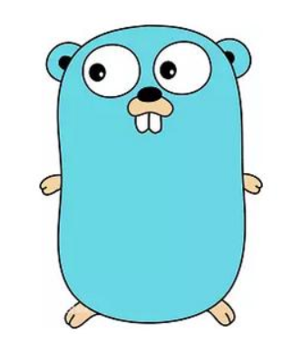

# 三. 搭建开发环境

 【1】搭建Go开发环境 - 安装和配置SDK
基本介绍:

1) SDK的全称(Software Development Kit 软件开发工具包)
2) SDK是提供给开发人员使用的，其中包含了对应开发语言的工具包。

【2】SDK下载
1) Go语言的官网为: golang.org ,无法访问，需要翻墙。
2) SDK下载地址 : Golang中文社区：https://studygolang.com/dl  (1.15.6版本)

【3】安装SDK：
请注意：安装路径不要有中文或者特殊符号如空格等
SDK安装目录建议:一般我安装在d:/golang_sdk安装时 , 基本上是傻瓜式安装，解压就可以使用

（1）解压zip：

go整个目录就是sdk

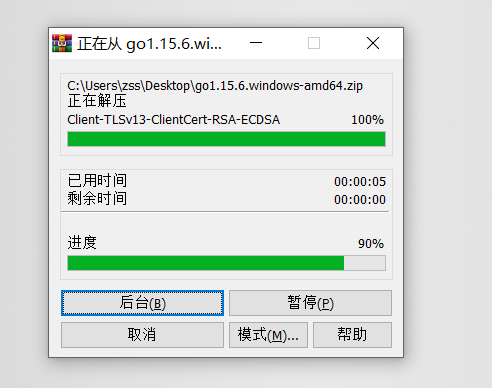

（2）go目录下：

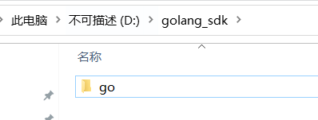

​		【4】配置环境变量

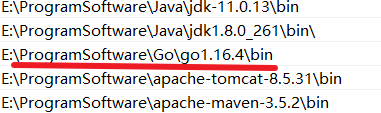

​		【5】测试是否安装成功

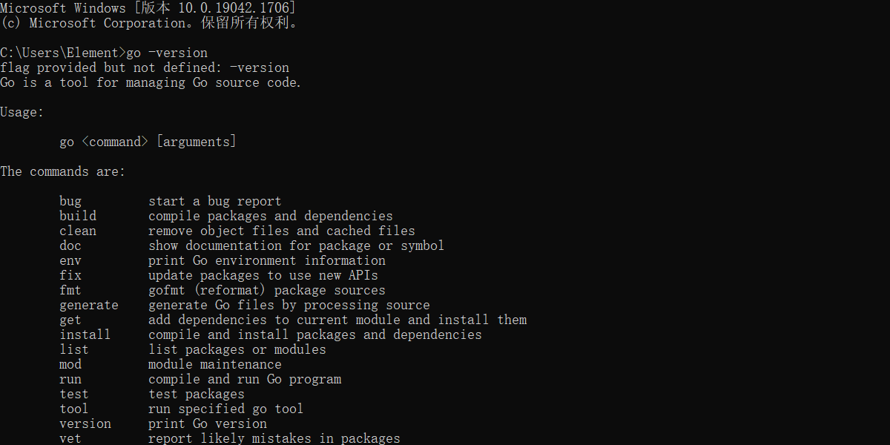

# 四. Go执行流程

【1】执行流程分析：

【2】上述两种执行流程的方式区别

1) 在编译时，编译器会将程序运行依赖的库文件包含在可执行文件中，所以，可执行文件
   变大了很多。

2) 如果我们先编译生成了可执行文件，那么我们可以将该可执行文件拷贝到没有go开发环
   境的机器上，仍然可以运行
3) 如果我们是直接go run go源代码，那么如果要在另外一个机器上这么运行，也需要go
   开发环境，否则无法执行。

4) go run运行时间明显要比第一种方式  长一点点

【3】编译注意事项：
编译后的文件可以另外指定名字：

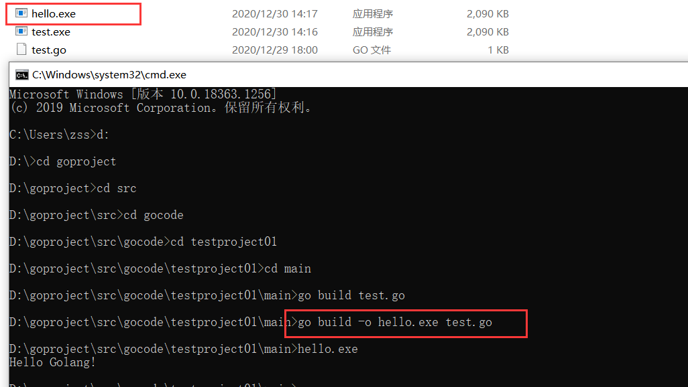

# 五. 语法注意事项

1. 源文件以"go"为扩展名。
2. 程序的执行入口是main()函数。
3. 严格区分大小写。
4. 方法由一条条语句构成，每个语句后不需要分号(Go语言会在每行后自动加分号)，这也体现出Golang的简洁性。
5. Go编译器是一行行进行编译的，因此我们一行就写一条语句，不能把多条语句写在同一个，否则报错
6. 定义的变量或者import的包如果没有使用到，代码不能编译通过。
7. 大括号都是成对出现的，缺一不可

# 六. 注释

【1】注释的作用：
用于注解说明解释程序的文字就是注释，注释提高了代码的阅读性;
注释是一个程序员必须要具有的良好编程习惯。
将自己的思想通过注释先整理出来，再用代码去体现。

【2】Golang中注释类型：
Go支持c语言风格的/**/块注释，也支持c++风格的//行注释。行注释更通用，块注释主要用于针对包的详细说明或者屏蔽大块的代码
（1）行注释 //     VSCode快捷键：ctrl+/  再按一次取消注释
（2）块注释（多行注释） /**/        VSCode快捷键：shift+alt+a 再按一次取消注释
         注意：块注释中不可以嵌套块注释

提示：官方推荐使用行注释 //

# 七. 代码风格

【1】注意缩进
向后缩进：tab
向前取消缩进：shift+tab
通过命令完成格式化操作：

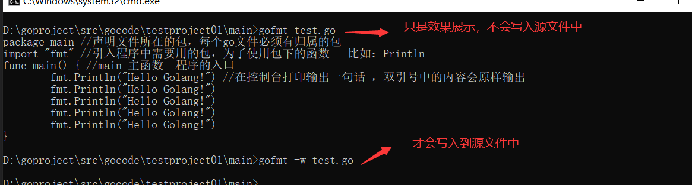

【2】成对编程 {} （） “” ‘’ 
		  【3】运算符两边加空白

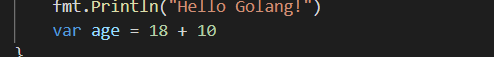

【4】注释：官方推荐行注释//
        【5】以下代码是错误的：

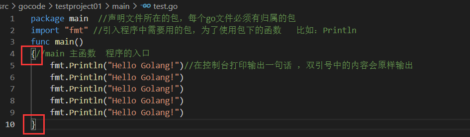

原因：go的设计者想要开发者有统一的代码风格，一个问题尽量只有一个解决方案是最好的
【6】行长约定：
一行最长不超过80个字符，超过的请使用换行展示，尽量保持格式优雅

