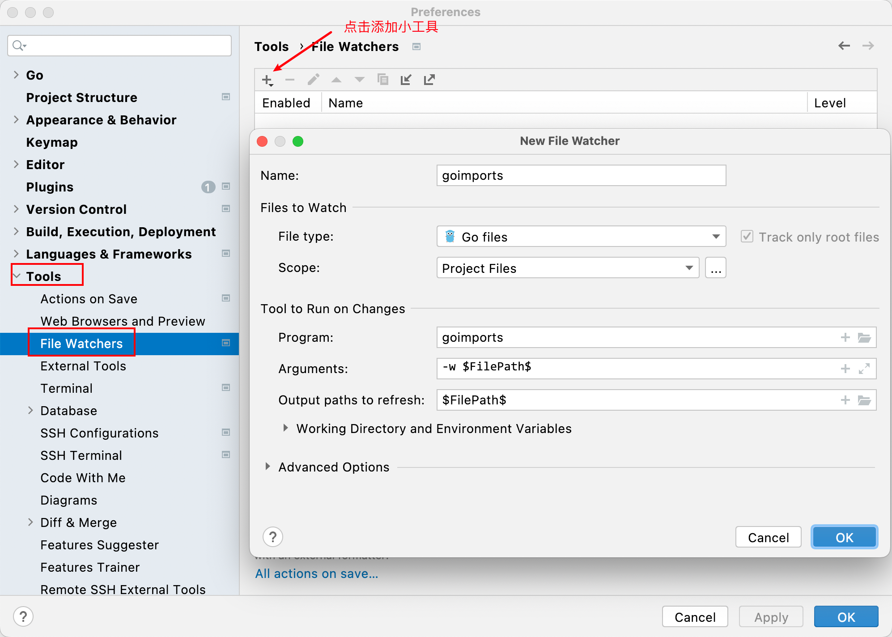

# Go Module

# 一. 介绍

`1.11` 版本引入

`1.12` 正式支持

> 使用 Go Module 之后，就可以告别使用 GOPATH 了，也就是说不用把项目源代码放置到 GOPATH src 目录下，可以放置到任意目录。Go Module 其实也就类似于 Java 的 Maven、Gradle，Node.js 的 Npm、Yarn。


# 二. 快速入门

## 2.1 如何开启

```shell
go env -w GO111MODULE="on"
go env -w GOPROXY="https://proxy.golang.org,direct"
# go env -w GOPROXY="https://goproxy.cn,direct"  国服也可以

# GO111MODULE 三种值
GO111MODULE="on"
	go 命令会使用 modules，也不会去 GOPATH 目录下查找。
GO111MODULE="off"
	go 命令行不支持 module 功能，寻找依赖包的方式将会沿用旧版本那种通过 vendor 目录或 GOPATH 模
	式来查找。
GO111MODULE="auto"
	默认值，GO 命令行将会根据当前目录是否使用 module 功能。
	这种情况下可以分为两种情形：
		1、当前目录在 GOPATH 之外且该目录包含 go.mod 文件。
		2、当前文件包含 go.mod 文件的目录下面。
		Go mod 的命令使用 help 查看。

```


## 2.2 使用命令行创建Go Module项目

首先进入一个创建好的目录：

```shell
cd module-project  # 切换目录
go mod init module-project  # 后面这个名称是项目的名称可以和目录名称相同也可以不同
```

接下来使用 Goland 打开即可。


## 2.3 导入第三方库

### 2.3.1 导包

GoModule小试牛刀：web框架Gin安装

输入安装 gin 的命令：

```shell
# -u 表示更新本地依赖库中的包到最新版本
go get -u github.com/gin-gonic/gin
```


### 2.3.2 查看go.mod文件

```go
module github.com/code-art/gin-im  // 项目的名称前缀表示命名空间，为了与其他包区别开来

go 1.18  // 指定go语言SDK的版本，可以切换

// 下面三个都是直接依赖
require (
	github.com/gin-gonic/gin v1.8.1
	gorm.io/driver/mysql v1.3.4
	gorm.io/gorm v1.23.6
)

// 下面的都是非直接依赖，依赖传递
require (
	github.com/KyleBanks/depth v1.2.1 // indirect
	github.com/PuerkitoBio/purell v1.1.1 // indirect
	github.com/PuerkitoBio/urlesc v0.0.0-20170810143723-de5bf2ad4578 // indirect
	github.com/cespare/xxhash/v2 v2.1.2 // indirect
	github.com/dgryski/go-rendezvous v0.0.0-20200823014737-9f7001d12a5f // indirect
	github.com/fsnotify/fsnotify v1.5.4 // indirect
	github.com/gin-contrib/sse v0.1.0 // indirect
	github.com/go-openapi/jsonpointer v0.19.5 // indirect
	github.com/go-openapi/jsonreference v0.19.6 // indirect
	github.com/go-openapi/spec v0.20.4 // indirect
	github.com/go-openapi/swag v0.19.15 // indirect
	github.com/go-playground/locales v0.14.0 // indirect
	github.com/go-playground/universal-translator v0.18.0 // indirect
	github.com/go-playground/validator/v10 v10.10.0 // indirect
	github.com/go-redis/redis/v8 v8.11.5 // indirect
	github.com/go-sql-driver/mysql v1.6.0 // indirect
	github.com/goccy/go-json v0.9.7 // indirect
	github.com/gorilla/websocket v1.5.0 // indirect
	github.com/hashicorp/hcl v1.0.0 // indirect
	github.com/jinzhu/inflection v1.0.0 // indirect
	github.com/jinzhu/now v1.1.4 // indirect
	github.com/josharian/intern v1.0.0 // indirect
	github.com/json-iterator/go v1.1.12 // indirect
	github.com/leodido/go-urn v1.2.1 // indirect
	github.com/magiconair/properties v1.8.6 // indirect
	github.com/mailru/easyjson v0.7.6 // indirect
	github.com/mattn/go-isatty v0.0.14 // indirect
	github.com/mitchellh/mapstructure v1.5.0 // indirect
	github.com/modern-go/concurrent v0.0.0-20180306012644-bacd9c7ef1dd // indirect
	github.com/modern-go/reflect2 v1.0.2 // indirect
	github.com/pelletier/go-toml v1.9.5 // indirect
	github.com/pelletier/go-toml/v2 v2.0.1 // indirect
	github.com/spf13/afero v1.8.2 // indirect
	github.com/spf13/cast v1.5.0 // indirect
	github.com/spf13/jwalterweatherman v1.1.0 // indirect
	github.com/spf13/pflag v1.0.5 // indirect
	github.com/subosito/gotenv v1.3.0 // indirect
	github.com/ugorji/go/codec v1.2.7 // indirect
	golang.org/x/crypto v0.0.0-20220411220226-7b82a4e95df4 // indirect
	golang.org/x/net v0.0.0-20220520000938-2e3eb7b945c2 // indirect
	golang.org/x/sys v0.0.0-20220520151302-bc2c85ada10a // indirect
	golang.org/x/text v0.3.7 // indirect
	golang.org/x/tools v0.1.10 // indirect
	google.golang.org/protobuf v1.28.0 // indirect
	gopkg.in/fatih/set.v0 v0.2.1 // indirect
	gopkg.in/ini.v1 v1.66.4 // indirect
	gopkg.in/yaml.v2 v2.4.0 // indirect
	gopkg.in/yaml.v3 v3.0.1 // indirect
)
```


## 2.4 Go Module常用命令

```shell
go mod help  # 查看帮助

The commands are:

	download    download modules to local cache
	edit        edit go.mod from tools or scripts
	graph       print module requirement graph
	init        initialize new module in current directory
	tidy        add missing and remove unused modules
	vendor      make vendored copy of dependencies
	verify      verify dependencies have expected content
	why         explain why packages or modules are needed
```

- 初始化一个 `module`，模块名为项目名称

```shell
go mod init project01
```

- 下载 `modules` 到本地 `cache`，路径为 `go env` 中的 `GOMODCACHE`

```shell
go mod download
```

- 通过工具或脚本编辑 `go.mod` 文件，选项有 `-json`、`-require` 和 `-exclude`，可以使用帮助 `go help mod edit`

```shell
go mod edit

# 举例
go mod edit -replace=golang.org/x/crypto@v.0.0.0=github.com/golang/crypto@latest
```

- 以文本形式打印模块需求图

```shell
go mod graph
```

- 添加缺失或者删除没有使用的 `modules`

```shell
go mod tidy
```

- 在本地生成 `vendor` 目录

```shell
go mod vendor
```

- 验证依赖是否正确

```shell
go mod verify
```

- 查找依赖

```shell
go mod why
```


# 三. 小技巧

## 3.1 Goland配置File Watchers

