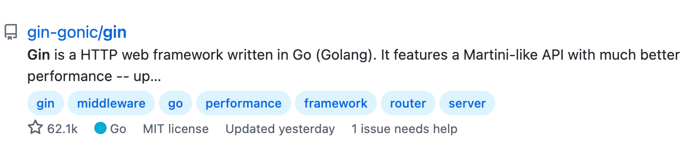
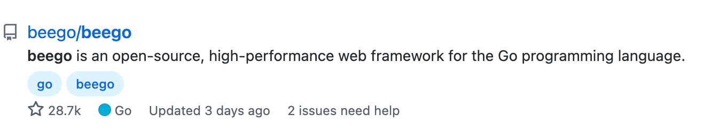
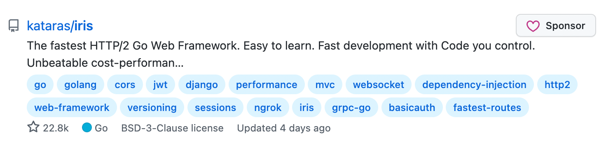

# Gin框架

# 一. Web框架前奏

## 1.1 **主流**Web**框架介绍**

> `golang` 的 `Web` 框架分两派：
>
>  一派是基于标准库 `net/http` 的，比如 `gin-gonic/gin` ， `labstack/echo` ， `astaxie/beego`
>
> 一派是基于 `valyala/fasthttp` 的，更偏向于性能，比如 `kataras / iris` ， `gofiber/fiber`

`Gin`



`Beego`



`Iris`




## 1.2 Beego快速体验

官方网站：https://beego.me/quickstart

1. 安装依赖

```shell
go get -u github.com/beego/beego/v2 # 安装Beego框架主体
go get -u github.com/beego/bee/v2 # 安装Beego命令行工具
```

2. 创建项目

```shell
bee api beego_api_demo # 只创建RestfulAPI工程
bee new projectname # 创建web工程
```

3. 运行项目

```shell
cd ./beego_api_demo/
bee run
```


## 1.3 Gin快速体验

项目地址：https://github.com/gin-gonic/gin

1. 安装依赖

```shell
go get -u github.com/gin-gonic/gin
```

2. 创建项目

```shell
mkdir gin_api_demo
cd .\gin_api_demo\
go mod init gin_api_demo
go get github.com/gin-gonic/gin
```

3. 打开项目新建main.go文件

```go
package main
import (
    "net/http"
    "github.com/gin-gonic/gin"
)

func main() {
    r := gin.Default()
    r.GET("/ping", func(c *gin.Context) {
        c.JSON(http.StatusOK, gin.H{
            "message": "pong",
        }) 
    })
	r.Run() 
}
```

4. 运行项目

```shell
go run main.go
```


## 1.4 Iris快速体验

官方网站：https://www.iris-go.com/docs/#/

```shell
go get -u github.com/kataras/iris/v12@master
```

1. 创建项目

```shell
mkdir iris_api_demo
cd ./iris_api_demo/
go mod init iris_api_demo
go get github.com/kataras/iris/v12@master
```

2. 创建并打开main.go文件编写以下代码

```go
package main
import (
    "github.com/kataras/iris/v12"
    "github.com/kataras/iris/v12/context"
)

func main() {
    app := iris.New()
    app.Get("/ping", func(c iris.Context) {
        c.JSON(iris.Map{
            "message": "pong",
        }) 
    })
    app.Listen(":8080")
}
```

3. 运行项目

```shell
go run main.go
```


## 1.5 总结

框架都大同小异，不用太过纠结于框架，掌握1-2个流行的框架即可，先学会一个在去学其他的就非常快 了，对于 `Beego` 而言大而全，褒贬不一，更偏向于 PHP ， Java 风格而不是 Golang 风格，对于 `Gin` 而言小而轻，自由度很高，使用众多，性能要优于 `Beego` ，相对于专注性能的 `Iris` 而言，先不说是不 是宇宙最快框架， `Iris` 相对 `Gin` 和 `Beego` 来说不够稳定，相对 `Iris` 而言 `Fiber` 路由更强一些


# 二. Gin框架快速开始代码含义

```go
package main

import (
    "github.com/gin-gonic/gin"
)

// gin.Context - 把请求和响应都封装到gin.Context上下文环境中了
func Hello(context *gin.Context) {
    // 对页面的渲染效果（多种），你要给浏览器响应什么效果
    context.String(200, "这是我的第一个Gin项目")
}

func main() {
    // Default()返回的是一个引擎Engine，它是框架非常重要的数据结构，是框架的入口。
    // 引擎 - 框架核心发送机 - 默认服务器 - 整个web服务都是由它来驱动的
    // Default()底层调用了New()，相当于New()的升级，New()返回的是一个引擎，
    // 在此基础上多增加了中间件处理-engine.Use(Logger(), Recovery())
    r := gin.Default()
    // r := gin.New()
    // 路由：通过访问"/"的GET请求走这一条处理逻辑，走对应的函数中的内容
    // "/" : 路由规则  函数：路由函数
    // 路由请求方式：GET、POST、DELETE、PATCH、PUT、OPTIONS、HEAD、Any
    // 函数：可以直接写匿名函数，还可以在外部定义函数使用
    // r.GET("/", func(context *gin.Context) {
    //	 context.String(200, "这是我的第一个Gin项目")
    // })
    // 函数：路径按照自己项目的规则去定义 "/"  "/user/demo"
    r.GET("/", Hello)
    // 启动引擎 ，服务器启动
    // Run可以传入参数：host+port
    // 中间拼接的冒号一定不要忘记
    // r.Run("127.0.0.1:9999")
    r.Run(":9999")
}

```


# 三. 数据交互

## 3.1 使用模板文件渲染

【1】Engine的LoadHTMLFiles方法(不推荐)：

```go
// 加载子指定的模板文件
// 不定长参数，可以传多个字符串，使用这个方法需要指定所有要使用的html文件路径
func (engine *Engine) LoadHTMLFiles(files ...string)
```

【2】Engine的LoadHTMLGlob方法(推荐)：

```go
// 加载子文件夹下的模板文件
// 只有一个参数，通配符，如：templates/* 
// 意思是找当前项目路径下templates文件夹下所有的html文件
func (engine *Engine) LoadHTMLGlob(pattern string)
```

【3】渲染HTML模板文件：Context的HTML方法：

```go
// 第一个参数：状态码（当浏览者访问一个网页时，浏览者的浏览器会向网页所在服务器发出请求。
// 当浏览器接收并显示网页前，此网页所在的服务器会返回一个包含HTTP状态码的信息头（server header）
// 用以响应浏览器的请求。）
// 第二个参数：渲染的文件名
// 第三个参数：传入参数，空接口可以接受任意类型
func (c *Context) HTML(code int, name string, obj interface{})
```

e.g.

```go
func Hello(c *gin.Context) {
    c.HTML(200, "hello-world.html", nil)
}
```

【4】多级目录的模板指定：

如果有多级目录，比如 templates 下有 demo01 和 demo02 两个目录，如果要使用里面的 html 文件，必须得在Load 的时候指定多级才可以。

（1）有几级目录，得在通配符上指明

```go
r.LoadHTMLGlob("templates/**/*")
```

（2）指定 html 文件，除了第一级的 templates 路径不需要指定，后面的路径都要指定

```go
context.HTML(200, "demo01/hello01.html", nil)
```

（3）在 html 中 define 定义目录

```html
{{define "demo1/hello01.html"}}  <!-- 跟上面的返回的字符串路径一样 -->
<!DOCTYPE html>
<html>
<head>
    <meta charset="UTF-8">
    <title>Hello World</title>
</head>
<body>
	HELLO WORLD!        
</body>
</html>
{{end}}
```


## 3.2 使用静态文件

【1】指定静态文件的路径(以css文件为例)：

1. 方式1

```go
// 第一个参数：相对路径
// 第二个参数：文件夹名称
// 含义：这个相对路径映射到哪个文件夹上去
func (group *RouterGroup) Static(relativePath, root string) IRoutes
```

e.g.

```go
// 指定静态文件：指定CSS文件：
r.Static("/s", "static")
```

（2）方式2：

```go
func (group *RouterGroup) StaticFS(relativePath string, fs http.FileSystem) IRoutes
```

e.g.

```go
r.StaticFS("/s", http.Dir("static"))
```

【2】在前端页面引入静态文件(以css文件为例)：

```html
{{define "demo1/hello01.html"}}  <!-- 跟上面的返回的字符串路径一样 -->
<!DOCTYPE html>
<html>
<head>
    <meta charset="UTF-8">
    <title>Hello World</title>
    <!-- 只需加上目标静态文件夹前缀即可 通过/s找到static目录 -->
    <!-- 然后去static目录下找css/base.css -->
    <link rel="stylesheet" href="/s/css/base.css">
</head>
<body>
	HELLO WORLD!        
</body>
</html>
{{end}}
```


## 3.3 后端渲染数据

### 3.3.1 设置路由

前端发送请求到后端，然后后端需要使用一个函数处理请求，这时候就需要使用后端路由，在 Gin 框架中，使用 `*gin.Engine` 设置路由：

```go
r := gin.Default()
r.GET("/demo1", handler)  // 传入一个声明好的函数作为回调函数，或者使用匿名函数
r.POST("/register", func(c *gin.Context) {
    // do something
})
r.PUT("/profile", UpdateUserInfo)  // 支持RestfulAPI
r.DELETE("/profile", DeleteUserInfo)
```


### 3.3.2 渲染字符串

【1】将要渲染的字符串通过HTML方法的第三个参数传入：

```go
func Handler(c *gin.Context) {
    str := "Hello World"
    c.HTML(200, "demo01/hello01.html", str)
}
```

【2】在页面上利用上下文来获取：

```html
{{define "demo1/hello01.html"}}
<!DOCTYPE html>
<html>
<head>
    <meta charset="UTF-8">
    <title>Hello World</title>
    <link rel="stylesheet" href="/s/css/base.css">
</head>
<body>
    <!-- 从上下文中获取 使用 . 符号，这部分将会被替换为 Hello World-->
	{{.}}  
</body>
</html>
{{end}}
```


### 3.3.3 渲染结构体

【1】将要渲染的结构体通过HTML方法的第三个参数传入：

```go
func Handler(c *gin.Context) {
    s := Student{
        Name: "洛必达",
        Age: 90
    }
    c.HTML(200, "demo01/hello01.html", s)
}
```

【2】在页面上利用上下文来获取：

```html
{{define "demo1/hello01.html"}}
<!DOCTYPE html>
<html>
<head>
    <meta charset="UTF-8">
    <title>Hello World</title>
    <link rel="stylesheet" href="/s/css/base.css">
</head>
<body>
    <!-- 这部分将会替换为结构体的属性值 -->
	{{.Name}}
    {{.Age}}
</body>
</html>
{{end}}
```


### 3.3.4 渲染数组

【1】将要渲染的数组通过HTML方法的第三个参数传入：

```go
func Handler(c *gin.Context) {
    arr := [3]int{10, 20, 30}
    c.HTML(200, "demo01/hello01.html", arr)
}
```

【2】在页面上利用上下文来获取：

```html
{{define "demo1/hello01.html"}}
<!DOCTYPE html>
<html>
<head>
    <meta charset="UTF-8">
    <title>Hello World</title>
    <link rel="stylesheet" href="/s/css/base.css">
</head>
<body>
	<!-- 第一种方式，第一个 . 表示传入数组的上下文，第二个 . 表示遍历的数组上下文 -->
    {{range .}}
    	{{.}}
    {{end}}
    <!-- 第二种方式：$i获取的是索引，$v获取的是数组的具体数值 -->
    {{range $i, $v := .}}
    	{{$i}}
    	{{$v}}
    {{end}}
</body>
</html>
{{end}}
```


### 3.3.5 渲染结构体数组

【1】将要渲染的数组通过HTML方法的第三个参数传入：

```go
func Handler(c *gin.Context) {
    arr := [3]Student{
        {"洛必达", 19},
        {"莱布尼茨", 20},
        {"欧拉", 100},
    }
    c.HTML(200, "demo01/hello01.html", arr)
}
```

【2】在页面上利用上下文来获取：

```html
{{define "demo1/hello01.html"}}
<!DOCTYPE html>
<html>
<head>
    <meta charset="UTF-8">
    <title>Hello World</title>
    <link rel="stylesheet" href="/s/css/base.css">
</head>
<body>
    <!-- 第一种方式，第一个 . 表示传入数组的上下文，第二个 . 表示遍历的数组上下文 -->
    <!-- 代表每一个结构体实例 -->
    {{range .}}
    	{{.Name}}
    	{{.Age}}
    {{end}}
    <!-- 第二种方式：$i获取的是索引，$v获取的是数组的具体数值，只用$v接收也是可以的 -->
    {{range $v := .}}
    	{{$v.Name}}
    	{{$v.Age}}
    {{end}}
</body>
</html>
{{end}}
```


### 3.3.6 渲染Map类型

【1】将要渲染的数组通过HTML方法的第三个参数传入：

```go
func Handler(c *gin.Context) {
    hashMap := map[string]int{
        "洛必达": 20,
        "牛顿": 100,
        "高斯": 99
    }
    c.HTML(200, "demo01/hello01.html", hashMap)
}
```

【2】在页面上利用上下文来获取：

```html
{{define "demo1/hello01.html"}}
<!DOCTYPE html>
<html>
<head>
    <meta charset="UTF-8">
    <title>Hello World</title>
    <link rel="stylesheet" href="/s/css/base.css">
</head>
<body>
    <!-- 获取map中的内容，代表上下文中的map，通过key获取value -->
    {{.洛必达}}
    {{.牛顿}}
</body>
</html>
{{end}}
```


### 3.3.7 渲染多个结构体类型

【1】解决：将多个结构体类型存入Map中： 	

【2】将要渲染的数组通过HTML方法的第三个参数传入：

```go
func Handler(c *gin.Context) {
    hashMap := map[string]Student{
        "no1": Student{"洛必达", 20},
        "no2": Student{"牛顿", 18},
    }
    c.HTML(200, "demo01/hello01.html", hashMap)
}
```

【3】在页面上利用上下文来获取：

```html
{{define "demo1/hello01.html"}}
<!DOCTYPE html>
<html>
<head>
    <meta charset="UTF-8">
    <title>Hello World</title>
    <link rel="stylesheet" href="/s/css/base.css">
</head>
<body>
    <!-- .代表上下文Map，通过key得到value -->
    {{.no1.Name}}
    {{.no1.Age}}
    {{.no2.Name}}
    {{.no2.Age}}
</body>
</html>
{{end}}
```


### 3.3.8 渲染切片类型

【1】将要渲染的数组通过HTML方法的第三个参数传入：

```go
func Handler(c *gin.Context) {
    slice := []int{1, 2, 3, 4, 5, 6}
    c.HTML(200, "demo01/hello01.html", slice)
}
```

【2】在页面上利用上下文来获取：

```html
{{define "demo1/hello01.html"}}
<!DOCTYPE html>
<html>
<head>
    <meta charset="UTF-8">
    <title>Hello World</title>
    <link rel="stylesheet" href="/s/css/base.css">
</head>
<body>
    <!-- 第一种方式 -->
    {{range .}}
    	{{.}}
    {{end}}
    <!-- 第二种方式 -->
    {{range $i, $v := .}}
    	{{$i}}
    	{{$v}}
    {{end}}
</body>
</html>
{{end}}
```


## 3.4 前端传参到后端

### 3.4.1 路径传参

【1】带参数的路由：路径中直接加上参数值 		

路径中加入参数值：http://localhost:8080/demo/1001

后端获取： 		

（1）方式1：使用占位符 `:`

```go
r := gin.Default()
// 路由规则中要求传入id参数，那么在发出请求时需加上参数值
r.GET("/demo/:id", Handler)
```

```go
func Handler(c *gin.Context) {
    // 获取路径中的参数值
    id := c.Param("id")
    c.String(200, "获取路径上的参数值,%s", id)
}
```

（2）方式2：使用占位符 `*`

路径中如果不给参数值，不报错 404

```go
r.GET("/demo/*id", Handler)
```


### 3.4.2 路径传递键值对

【1】路径中使用键值对形式的参数 	

参数值以键值对的形式，通过?拼接到路径之后： 	

[http://localhost:8080/demo?id=123&name=%E4%B8%BD%E4%B8%BD](http://localhost:8080/demo?id=123&name=丽丽) 	

利用 `?` 的形式拼接参数的键值对，多个键值对中间用&符号进行拼接

后端获取参数值： 	

（1）Query方法：

```go
func Handler(c *gin.Context) {
    // 获取路径中的参数值，通过key获取对应的value
    id := c.Query("id")
    name := c.Query("name")
    c.String(200, "获取路径上的值,%s, %s", id, name)
}
```

（2）DefaultQuery()：

如果获取不到对应的数据，可以加入默认值：

```go
func Handler(c *gin.Context) {
    id := c.DefaultQuery("id", "123")
    name := c.DefaultQuery("name", "洛必达")
    c.String(200, "获取路径上的值,%s, %s", id, name)
}
```


### 3.4.3 路径传递列表

【1】路径中参数值value为多个数据 - 数组： 	

路径：http://localhost:8080/demo?id=1,2,3,4,5

```go
func Handler(c *gin.Context) {
    ids := c.QueryArray("id")
    c.String(200, "获取路径上的值,%s", ids)
}
```

【2】路径中参数值value为多个数据 - map： 	

路径：[http://localhost:8080/demo?user[1001\]=%E4%B8%BD%E4%B8%BD&user[1003]=%E5%B0%8F%E6%98%8E](http://localhost:8080/demo5?user[1001]=丽丽&user[1003]=小明)

```go
func Handler(c *gin.Context) {
    userMap := c.QueryMap("user")
    c.String(200, "获取路径上的值,%s", userMap)
}
```


### 3.4.4 获取Post请求数据

【1】案例： 	

（1）定义一个页面：在页面中可以定义一个 form表单，请求方式post方式进行请求： 	

（2）表单在提交的时候：post方式进行提交 ： 	

（3）后端获取post请求数据： 	

【2】代码：

路由：

```go
package main

import (
    "TestGin/service"
    "github.com/gin-gonic/gin"
)

func main() {
    r := gin.Default()
    r.LoadHTMLGlob("templates/**/*")
    r.POST("/profile", service.PostUserInfo)
    r.Run()
}
```

处理器：

```go
func PostUserInfo(context *gin.Context){
    // 获取post请求的参数：
    uname := context.PostForm("username")
    pwd := context.PostForm("pwd")
}
```

页面：

```html
{{define "demo01/hello.html"}}
<!DOCTYPE html>
<html lang="en">
<head>
    <meta charset="UTF-8">
    <title>Title</title>
    <link rel="stylesheet" href="/s/css/base.css">
</head>
<body>
    定义一个用户的form表单：
    <form action="/profile" method="post">
        用户名：<input type="text" name="username">
        密码：<input type="password" name="pwd">
        <input type="submit" value="提交">
    </form>
</body>
</html>
{{end}}
```

表单提交复杂数据类型：

【1】代码： 	

前端：

```html
{{define "demo01/hello.html"}}
<!DOCTYPE html>
<html lang="en">
<head>
    <meta charset="UTF-8">
    <title>Title</title>
    <link rel="stylesheet" href="/s/css/base.css">
</head>
<body>
    定义一个用户的form表单：
    <form action="/profile" method="post">
        用户名：<input type="text" name="username">
        密码：<input type="password" name="pwd">
        年龄：<input type="text" name="age">
        你喜欢的编程语言：
        java:<input type="checkbox" name="hobbies" value="0">
        go:<input type="checkbox" name="hobbies" value="1">
        python:<input type="checkbox" name="hobbies" value="2">
        c:<input type="checkbox" name="hobbies" value="3">
        地址：<input type="text" name="user[addr]">
        邮件：<input type="text" name="user[email]">
        <input type="submit" value="提交">
    </form>
</body>
</html>
{{end}}
```

后端：

```go
func PostUserInfo(context *gin.Context) {
    uname := context.PostForm("username")
    pwd := context.PostForm("pwd")
    // DefaultPostForm方法:作用：当页面中未定义表单元素进行提交给出默认值，
    // 如果页面定义了元素但是提交没有提交数据，那么不会有默认值，会认为是没有提交数据
    age := context.DefaultPostForm("age","18")
    // PostFormArray方法：作用：如果前端value数据过多可以用数组接收：
    hobbies := context.PostFormArray("hobbies")
    // PostFormMap方法:作用：获取map的数据,参数需要注意：传入的是整个map（而不是具体的key）
    usermap := context.PostFormMap("user")
}
```


### 3.4.5 Ajax

【1】AJAX介绍

AJAX 即 “Asynchronous Javascript And XML”(异步 JavaScript 和  XML)，是指一种创建交互式、快速动态网页应用的网页开发技术，无需重新加载整个网页的情况下，能够更新部分网页的技术。通过在后台与服务器进行少量数据交换，AJAX 可以使网页实现异步更新。这意味着可以在不重新加载整个网页的情况下，对网页的某部分进行更新。

【2】AJAX的最大的特点： 异步访问，局部刷新。 			

【3】代码：案例：Ajax之验证用户名是否被占用

main：

```go
func main() {
    r := gin.Default()
    r.LoadHTMLGlob("/templates/**/*")
    r.Static("/s","/static")
    r.POST("/userExists", service.UserExists)
    r.Run()
}
```

前端：

```html
{{define "demo01/hello.html"}}
<!DOCTYPE html>
<html lang="en">
<head>
    <meta charset="UTF-8">
    <title>Title</title>
    <script src="/s/js/jQuery.min.js"></script>
</head>
<body>
    定义一个用户的form表单：
    <form action="/getUserInfo" method="post">
        用户名：<input type="text" name="username" id="uname">
        <span id="errmsg"></span><br>
        密码：<input type="password" name="pwd">
        <input type="submit" value="提交">
    </form>
    <script>
        // 获取用户名的文本框
        const unametext = document.getElementById("uname");
        // 给文本框绑定一个事件：失去焦点的时候会触发后面的函数的事件
        unametext.onblur = () => {
            // 获取文本框的内容：
            const uname = unametext.value;
            // alert(uname)可以弹出数据，验证代码的正确性
            // 局部刷新：通过ajax技术来实现数据的校验 ---》 后台 ：异步访问，局部刷新
            // 调用ajax方法需要传入json格式的数据： 
            // $.ajax({属性名:属性值, 属性名:属性值, 方法名:方法})
            $.ajax({
                url : "/userExists",  // 请求路由
                type : "POST",  // 请求类型 GET、POST
                // 向后端发送的数据，以json格式向后传递
                data : {
                    "uname": uname
                },
                // 后台响应成功会调用函数,info-后台响应的数据封装到info中，info名字可以随便起
                success : res => {
                    document.getElementById("errmsg").innerText = res["msg"]
                },
                // 后台响应失败会调用函数
                fail : () => {
                }
            })
        }
    </script>
</body>
</html>
{{end}}
```

后端：

```go
func UserExists(c *gin.Context) {
    // 获取post-ajax请求的数据，获取对应的参数：
    uname := c.PostForm("uname")
    // 如果获取的数据和"丽丽"一样，那么就在前端响应-用户名录入重复：
    if uname == "洛必达" {
        //向浏览器返回数据，返回json格式数据：
        c.JSON(200, gin.H{
            "msg": "用户名重复了!",
        })
    } else {
        c.JSON(200, gin.H{
            "msg": "用户名可以使用!",
        })
    }
}
```


## 3.5 文件上传

### 3.5.1 表单单文件上传

【1】代码：

路由：

```go
func main() {
    r := gin.Default()
    r.LoadHTMLGlob("templates/**/*")
    r.POST("/upload", service.UploadFile)
    r.Run()
}
```

前端：

```html
{{define "demo01/hello.html"}}
<!DOCTYPE html>
<html lang="en">
<head>
    <meta charset="UTF-8">
    <title>Title</title>
</head>
<body>
    定义一个用户的form表单：
    <form action="/upload" method="post" enctype="multipart/form-data">
        <input type="file" name="file">
        <input type="submit" value="提交">
    </form>
</body>
</html>
{{end}}
```

后端：

```go
func UploadFile(c *gin.Context){
    // 获取前端传入的文件：
    file, _ := c.FormFile("file")  // 参数名称和前端input标签name属性值一样
    // 加入一个时间戳：
    time_int := time.Now().Unix()
    time_str := strconv.FormatInt(time_int, 10)  // 转换为十进制
    // 保存在我的本地：
    c.SaveUploadedFile(file, "/Users/Admin/" + file.Filename + time_str)
    c.String(200, "文件上传成功")
}
```

【2】注意：在上传文件的时候，在表单中要加入： 	

` enctype="multipart/form-data"`

enctype 就是 encode type 编码类型的意思。multipart/form-data 是指表单数据有多部分构成，既有文本数据，又有二进制数据的意思。默认情况下，enctype 的值是 `application/x-www-form-urlencoded`，不能用于文件上传，只有使用了 `multipart/form-data`，才能完整地传递文件数据。

`application/x-www-form-urlencoded` 不是不能上传文件，是只能上传文本格式的文件，`multipart/form-data` 是将文件以二进制的形式上传。


### 3.5.2 表单多文件上传

【1】代码：

前端：

```html
{{define "demo01/hello.html"}}
<!DOCTYPE html>
<html lang="en">
<head>
    <meta charset="UTF-8">
    <title>Title</title>
</head>
<body>
    定义一个用户的form表单：
    <form action="/upload" method="post" enctype="multipart/form-data">
        <!-- 如果上传的文件的name是不同的，后端的处理就是按照：context.FormFile方式 -->
        <!-- 如果上传的文件的name的名字是相同的，那么后端的处理就要发生变化 -->
        <input type="file" name="files">
        <input type="file" name="files">
        <input type="file" name="files">
        <input type="submit" value="提交">
    </form>
</body>
</html>
{{end}}
```

后端：

```go
func UploadFile(c *gin.Context) {
    // 先获取form表单
    form, _ := context.MultipartForm()
    // 在form表单中获取name相同的文件：
    files := form.File["files"]  // File是个Map，通过key获取value部分
    // files就是name相同的多个文件：挨个处理---遍历处理：
    for _, file := range files {
        time_int := time.Now().Unix()
        time_str := strconv.FormatInt(time_int, 10)
        context.SaveUploadedFile(file, "/Users/Admin/" + file.Filename + time_str)
    }
    context.String(200, "文件上传成功")
}
```


### 3.5.3 Ajax单文件上传

【1】注意： 	

注意利用ajax上传文件的话，在ajax中需要加两个参数： 		

（1）`contentType: false `		

 默认为true，当设置为true的时候，jquery ajax 提交的时候不会序列化 data，而是直接使用 data 		

（2）`processData: false`

目的是防止上传文件中出现分界符导致服务器无法正确识别文件起始位置。

【2】代码：

前端：

```html
{{define "demo01/hello.html"}}
<!DOCTYPE html>
<html lang="en">
<head>
    <meta charset="UTF-8">
    <title>Title</title>
    <script src="/s/js/jQuery.min.js"></script>
</head>
<body>
    定义一个用户的form表单：
    <form action="/upload" method="post">
        <input type="file" class="file" multiple="multiple">
        <input type="button" value="提交按钮" id="btn">
    </form>
    <script>
        const btn = document.getElementById("btn")
        btn.onclick = () => {
            // $(".file") 获取到class为myfile的所有文件上传组件，形式以数组形式存放
            console.log($(".file"))
            // 获取到class为file的所有文件中的第一个文件
            console.log($(".file")[0])
            // 获取到class为file的所有文件中的第一个文件中上传的所有文件
            console.log($(".file")[0].files)
            // 获取到class为myfile的所有文件中的第一个文件中上传的所有文件的第一个文件
            console.log($(".file")[0].files[0])
            // 创建存放form表单的数据：
            const form_data = new FormData()
            // 在form_data添加要传入到后台的元素：
            form_data.append("file", $(".file")[0].files[0])
            $.ajax({
                url : "/upload",
                type : "POST",
                data : form_data,
                contentType: false,
                processData: false,
                success : () => {
                    
                }
            })
        }
    </script>
</body>
</html>
{{end}}
```

后端：

```go
func UploadFile(c *gin.Context) {
    file, _ := c.FormFile("file")
    time_int := time.Now().Unix()
    time_str := strconv.FormatInt(time_int, 10)
    c.SaveUploadedFile(file, "/Users/Admin/" + file.Filename + time_str)
    c.String(200, "文件上传成功")
}
```


### 3.5.4 Ajax多文件上传

【1】代码：

前端：

```html
{{define "demo01/hello.html"}}
<!DOCTYPE html>
<html lang="en">
<head>
    <meta charset="UTF-8">
    <title>Title</title>
    <script src="/s/js/jQuery.min.js"></script>
</head>
<body>
    定义一个用户的form表单：
    <form action="/upload" method="post">
        <input type="file" class="file">
        <input type="file" class="file">
        <input type="file" class="file">
        <input type="button" value="提交按钮" id="btn">
    </form>
    <script>
        const btn = document.getElementById("btn")
        btn.onclick = () => {
            const form_data = new FormData()
            const myfiles = $(".file")
            // 对多个文件进行遍历，每一个添加到form_data中去：
            for (let i = 0; i < myfiles.length; i++){
                form_data.append("file", myfiles[i].files[0])
            }
            $.ajax({
                url: "/upload",
                type: "POST",
                data: form_data,
                contentType: false,
                processData: false,
                success: () => {
                    
                }
            })
        }
    </script>
</body>
</html>
{{end}}
```


## 3.6 重定向

【1】响应重定向：

响应重定向是请求服务器后，服务器通知浏览器，让浏览器去自主请求其他资源的一种方式。

【2】代码：

main.go：

```go
func main() {
    r := gin.Default()
    r.GET("/red1", service.Red1)
    r.GET("/red2", service.Red2)
    r.Run()
}
```

user.go：

```go
func Red1(c *gin.Context) {
    fmt.Println("这是Red1")
    // 发送一个重定向的请求：
    c.Redirect(http.StatusFound, "/red2")
}

func Red2(c *gin.Context) {
    fmt.Println("这是Red2")
    // 在浏览器响应字符串：
    c.String(http.StatusOK, "重定向成功-这里是Red2")
}
```


# 


