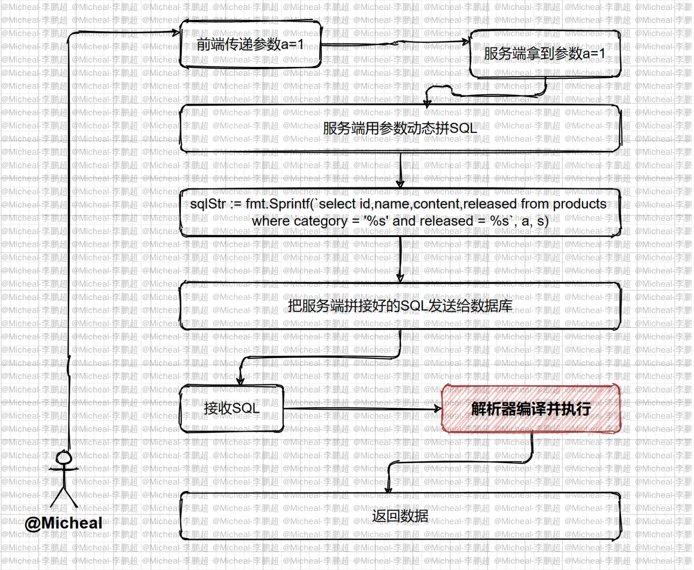
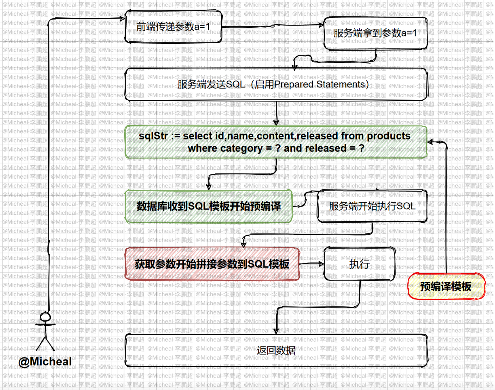

# database/sql

# 一. 介绍

> Go语言中的 `database/sql` 包提供了保证SQL或类SQL数据库的泛用接口，并不提供具体的数据库 驱动，使用 `database/sql` 包时必须注入一个数据库驱动。

https://github.com/go-sql-driver/mysql

# 	二. 安装

```shell
go get -u github.com/go-sql-driver/mysql
```

```go
// 使用Open方法打开一个dirverName指定的数据库，
// dataSourceName指定数据源，username， password，host，port，databasename等连接必要信息
func Open(driverName, dataSourceName string) (*DB, error)
```

# 三. 快速开始

## 3.1 连接测试

```go
import (
    "database/sql"
    "time"
    _ "github.com/go-sql-driver/mysql"
)

func TestConnect2Mysql(t testing.T) {
    // ...
    database := "mysql"
    dns := "root:root@tcp(localhost:3306)/demo?charset=utf8&parseTime=True&loc=Local"
    db, err := sql.Open(database, dns)
    if err != nil {
    	panic(err) 
    }
    // See "Important settings" section.
    db.SetConnMaxLifetime(time.Minute * 3)
    db.SetMaxOpenConns(10)
    db.SetMaxIdleConns(10)
    if err := db.Ping(); err != nil {
        panic(err)
    }
    fmt.Println("connect 2 database")
}
```

**SetMaxOpenConns**：

​		`SetMaxOpenConns` 设置与数据库建立连接的最大数目。 如果n大于0且小于最大闲置连接数，会将最大 闲置连接数减小到匹配最大开启连接数的限制。 如果n<=0，不会限制最大开启连接数，默认为0(无限 制)

```go
func (db *DB) SetMaxOpenConns(n int)
```

**SetMaxIdleConns**：

`SetMaxIdleConns` 设置连接池中的最大闲置连接数。 如果n大于最大开启连接数，则新的最大闲置连 接数会减小到匹配最大开启连接数的限制。 如果 n<=0，不会保留闲置连接

```go
 func (db *DB) SetMaxIdleConns(n int)
```

## 3.2 封装连接函数

```go
var DB *sql.DB
// initializeDatabase 初始化
func initializeDatabase() error {
    dsn := "root:123456@tcp(localhost:4000)/gin_demo?
    charset=utf8mb4&parseTime=True&loc=Local"
    db, err := sql.Open("mysql", dsn)
    if err != nil {
        return err }
    DB = db
    if err = db.Ping(); err != nil {
        return err 
    }
    return nil 
}

func main() {
    // ...
    if err := initializeDatabase(); err != nil {
        panic(err)
    }
}
```

## 3.3 CRUD操作

创建数据库：

```mysql
create database student charset utf8mb4;
```

创建表：

```mysql
CREATE TABLE `student`  (
  `id` int(11) NOT NULL AUTO_INCREMENT,
  `name` varchar(255) CHARACTER SET utf8mb4 COLLATE utf8mb4_general_ci NULL DEFAULT
NULL,
  `age` int(11) NULL DEFAULT NULL,
  PRIMARY KEY (`id`) USING BTREE
) ENGINE = InnoDB AUTO_INCREMENT = 6 CHARACTER SET = utf8mb4 COLLATE =
utf8mb4_general_ci ROW_FORMAT = Dynamic;
```

插入数据：

```mysql
INSERT INTO `student` VALUES (1, '张三', 18); 
INSERT INTO `student` VALUES (2, '李四', 19); 
INSERT INTO `student` VALUES (3, '王五', 20); 
INSERT INTO `student` VALUES (4, '赵六', 21); 
INSERT INTO `student` VALUES (5, 'Micheal', 18);
```

### 3.3.1 查询

**Query**函数单行查询：

```go
// queryRow 查询单条 
func queryRow() user {
    sqlStr := "select * from student where id = ?"
    var u user
    row := DB.QueryRow(sqlStr, 1)
    if err := row.Scan(&u.Id, &u.Name, &u.Age); err != nil {
        log.Printf("scan failed err : %s", err)
        return u 
    }
    return u 
}
```

**Query**函数多行查询：

```go
func queryMultiRow() []user {
    sqlStr := "select * from student"
    rows, err := DB.Query(sqlStr)
    if err != nil {
        log.Printf("query failed, err:%v\n", err)
        return nil
    }
    defer rows.Close()
    users := make([]user, 0)
    for rows.Next() {
        var u user
        err := rows.Scan(&u.Id, &u.Name, &u.Age)
        if err != nil {
            fmt.Printf("scan failed, err:%v\n", err)
            return nil
        }
        users = append(users, u)
    }
    return users
}
```

### 3.3.2 更新

**Exec**函数更新数据：

```go
func UpdateRow() {
    sqlStr := "update student set name = ? where id = ?"
    ret, err := DB.Exec(sqlStr, "zhangsan", 1)
    if err != nil {
        fmt.Printf("update failed, err%s", err)
    }
    // 如果不验证这句话可以吗?
    // n是1是不是才是修改成功啊?比如写一个不存在的id 6他也不会报错，
    // 但是我们并没有这条数据啊 n, err := ret.RowsAffected() // 操作影响的行数
    if err != nil {
        fmt.Printf("get RowsAffected failed, err:%v\n", err)
        return
    }
    log.Println(ret)
    log.Println(n)
}
```

### 3.3.3 删除

**Exec**函数删除数据：

```go
func DeleteRow() {
    sqlStr := "delete from student where id = ?"
    ret, err := DB.Exec(sqlStr, 6)
    if err != nil {
        fmt.Printf("delete failed, err:%v\n", err)
        return
    }
    n, err := ret.RowsAffected()
    if err != nil {
        fmt.Printf("get RowsAffected failed, err:%v\n", err)
        return
    }
    fmt.Printf("delete success, affected rows:%d\n", n)
}
```

### 3.3.4 插入

**Exec**函数插入数据：

```go
func insertRow() {
    sqlStr := "insert into student(name, age) values (?,?)" 
    ret, err := DB.Exec(sqlStr, "王五", 38)
    if err != nil {
        fmt.Printf("insert failed, err:%v\n", err)
        return
    }
    id, err := ret.LastInsertId()
    if err != nil {
        fmt.Printf("get lastinsert ID failed, err:%v\n", err)
        return
    }
    fmt.Printf("insert success, the id is %d.\n", id)
}
```

# 四. MySQL预处理

普通的SQL语句执行过程:

1. 客户端对SQL语句进行占位符替换得到完整的SQL语句
2. 客户端发送完整SQL语句到MySQL服务端
3. MySQL服务端执行完整的SQL语句并将结果返回给客户端

一次编译，单次运行，此类普通语句被称作 `Immediate Statements` (即时 SQL) 预处理执行过程:

1. 把SQL语句分成两部分，命令部分与数据部分
2. 先把命令部分发送给MySQL服务端，MySQL服务端进行SQL预处理
3. 然后把数据部分发送给MySQL服务端，MySQL服务端对SQL语句进行占位符替换 
4. 4. MySQL服务端执行完整的SQL语句并将结果返回给客户端

所谓预编译语句就是将此类 SQL 语句中的值用占位符替代，可以视为将 SQL 语句模板化或者说参数化，一般称这类语句叫 `Prepared Statements`

## 4.1 即时SQL执行流程



## 4.2 预处理SQL执行流程



## 4.3 Go实现MySQL预处理

```go
func (db *DB) Prepare(query string) (*Stmt, error)
```

`Prepare` 方法会先将 `sql` 语句发送给MySQL服务端，返回一个准备好的状态用于之后的查询和命令， 返回值可以同时执行多个查询和命令。

查询：

```go
func queryMultiRow(name string) []user {
    //sqlStr := fmt.Sprintf("select * from student where name = '%s'", name)
    sqlStr := "select * from student where name = ?"
    stmt, err := DB.Prepare(sqlStr)
    if err != nil {
        log.Printf("query failed, err:%v\n", err)
        return nil 
    }
    rows, _ := stmt.Query(name)
    defer rows.Close()
    users := make([]user, 0)
    for rows.Next() {
        var u user
        err := rows.Scan(&u.Id, &u.Name, &u.Age)
        if err != nil {
            fmt.Printf("scan failed, err:%v\n", err)
            return nil 
        }
        users = append(users, u)
    }
    return users
}
```

插入：

```go
func insertData() {
    sqlStr := "insert into student (name, age) values (?,?)"
    stmt, err := DB.Prepare(sqlStr)
    if err != nil {
        fmt.Printf("prepare failed, err:%v\n", err)
        return
    }
    defer stmt.Close()
    _, err = stmt.Exec("洛必达", 18) 
    if err != nil {
        fmt.Printf("insert failed, err:%v\n", err)
        return
    }
    _, err = stmt.Exec("牛顿", 100) 
    if err != nil {
        fmt.Printf("insert failed, err:%v\n", err)
        return
    }
    fmt.Println("insert success.")
}
```


