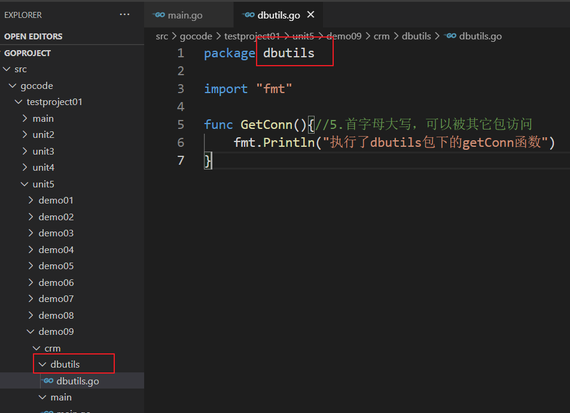

# 函数

# 一. 函数概念引入

【1】为什么要使用函数：
提高代码的复用型，减少代码的冗余，代码的维护性也提高了

【2】函数的定义：
为完成某一功能的程序指令(语句)的集合,称为函数。

【3】基本语法

```go
func funcName(T1 var1, T2 var2...) (T1 returned1, T2 returned2...) {
    return + returnedList
}
```

【4】函数的定义和函数的调用案例：

```go
// 如果返回值类型就一个的话，那么()是可以省略不写的  
func cal(num1 int, num2 int) int { 
    return num1 + num2
}
func main() {
    var num1 = 10
    var num2 = 20
    sum := cal(num1, num2)
    fmt.Println(sum)
}
```


# 二. 函数细节

（1）函数名：

- **遵循标识符命名规范:见名知意 addNum,驼峰命名 addNum**

- **首字母不能是数字**
- **首字母大写该函数可以被本包文件和其它包文件使用(类似public)**
- **首学母小写只能被本包文件使用，其它包文件不能使用(类似private)**

（2）形参列表：

- **形参列表：个数：可以是一个参数，可以是 n 个参数，可以是 0 个参数**
- **形式参数列表：作用：接收外来的数据**
- **实际参数：实际传入的数据**


（3）返回值类型列表：函数的返回值对应的类型应该写在这个列表中

返回0个：


返回1个：


返回多个：


【5】通过例题感受内存分析：

```go
func exchangeNum(num1 int, num2 int) { 
    var t = num1
    num1 = num2
    num2 = t
}
func main() {	
    // 调用函数：交换10和20
    var num1 int = 10
    var num2 int = 20
    fmt.Printf("交换前的两个数： num1 = %v,num2 = %v \n", num1, num2)
    swap(num1, num2)
    fmt.Printf("交换后的两个数： num1 = %v,num2 = %v \n", num1, num2)
}
```


内存分析：


【6】Golang中函数不支持重载:


【7】Golang中支持可变参数 (如果你希望函数带有可变数量的参数):

```go
func test (args...int) {
    // 函数内部处理可变参数的时候，将可变参数当做切片来处理
    // 遍历可变参数：
    for i := 0; i < len(args); i++ {
        fmt.Println(args[i])
    }
}
func main() {	
    test()
    fmt.Println("--------------------")
    test(3)
    fmt.Println("--------------------")
    test(37, 58, 39, 59, 47)
}
```


【8】基本数据类型和数组默认都是值传递的，即进行值拷贝。在函数内修改，不会影响到原来的值。


【9】以值传递方式的数据类型，如果希望在函数内的变量能修改函数外的变量，可以传入变量的地址 `&`，函数内以指针的方式操作变量。从效果来看类似引用传递。


【10】在Go中，函数也是一种数据类型，可以赋值给一个变量，则该变量就是一个函数类型的变量了。通过该变量可以对函数调用。

```go
func test(num int) {
    fmt.Println(num)
}
func main() {
    // 函数也是一种数据类型，可以赋值给一个变量	
    a := test//变量就是一个函数类型的变量
    
    // a的类型是：func(int), test函数的类型是：func(int)
    fmt.Printf("a的类型是：%T,test函数的类型是：%T \n", a, test)
    
    // 通过该变量可以对函数调用
    a(10) //等价于  test(10)
}
```

【11】函数既然是一种数据类型，因此在Go中，函数可以作为形参，并且调用:

```go
func test(num int) {
    fmt.Println(num)
}

func test02 (num1 int, num2 float32, testFunc func(int)) {
    fmt.Println("-----test02")
}

func main() {
    // 函数也是一种数据类型，可以赋值给一个变量	
    a := test  // 变量就是一个函数类型的变量
    
    // a的类型是：func(int),test函数的类型是：func(int)
    fmt.Printf("a的类型是：%T,test函数的类型是：%T \n", a, test)
    
    // 通过该变量可以对函数调用
    a(10) // 等价于  test(10)
    
    // 调用test02函数：
    test02(10, 3.19, test)
    test02(10, 3.19, a)
}
```

【12】为了简化数据类型定义,Go支持自定义数据类型

基本语法: `type 自定义数据类型名 数据类型`

可以理解为 : 相当于起了一个别名

例如: `type mylnt int` ----->这时 mylnt 就等价 int 来使用了.


例如: `type mySum func (int , int) int` ----->这时mySum就等价一个函数类型 *func(int, int) int*


【13】支持对函数返回值命名

传统写法要求：返回值和返回值的类型对应，顺序不能差


升级写法：对函数返回值命名，里面顺序就无所谓了，顺序不用对应


# 三. 包

【1】使用包的原因：

（1）我们不可能把所有的函数放在同一个源文件中，可以分门别类的把函数放在不同的原文件中 


（2）解决同名问题：两个人都想定义一个同名的函数，在同一个文件中是不可以定义相同名字的函数的。此时可以用包来区分 

【2】案例展示包：


1. package进行包的声明，建议：包的声明这个包和所在的文件夹同名



2. main包是程序的入口包，一般main函数会放在这个包下.main函数一定要放在main包下，否则不能编译执行
3. 打包语法：
   `package 包名`
4. 引入包的语法：``import 包的路径`
   包名是从 $GOPATH/src/ 后开始计算的，使用/进行路径分隔。

5. 如果有多个包，建议一次性导入,格式如下：
   `import(
       "fmt"
       "dbutils"
   )`
6. 在函数调用的时候前面要定位到所在的包


7. 函数名，变量名首字母大写，函数，变量可以被其它包访问


8. 一个目录下不能有重复的函数


9. 包到底是什么：
   （1）在程序层面，所有使用相同  package 包名  的源文件组成的代码模块
   （2）在源文件层面就是一个文件夹
10. 可以给包取别名，取别名后，原来的包名就不能使用了


# 四. init函数

【1】init函数：初始化函数，可以用来进行一些初始化的操作
每一个源文件都可以包含一个 init 函数，该函数会在 main 函数执行前，被Go运行框架调用。


【2】全局变量定义，init函数，main函数的执行流程


【3】多个源文件都有init函数的时候，如何执行：

先执行外部文件的 init 函数,然后创建全局变量,紧接着调用 main.go 文件的 init 函数,最后执行 main 函数!


# 五. 匿名函数

【1】Go支持匿名函数，如果我们某个函数只是希望使用一次，可以考虑使用匿名函数

【2】匿名函数使用方式：

（1）在定义匿名函数时就直接调用，这种方式匿名函数只能调用一次（用的多）


（2）将匿名函数赋给一个变量(该变量就是函数变量了)，再通过该变量来调用匿名函数（用的少）


【3】如何让一个匿名函数，可以在整个程序中有效呢?将匿名函数给一个全局变量就可以了,这和 js 的写法很像

```go
var Func01 = func (num1 int, num2 int) int {
    return num1 * num2
}
func main() {
    // 定义匿名函数：定义的同时调用
    result := func (num1 int, num2 int) int {
        return num1 + num2
    } (10, 20)
    fmt.Println(result)
    
    // 将匿名函数赋给一个变量，这个变量实际就是函数类型的变量
    // sub等价于匿名函数
    sub := func (num1 int, num2 int) int {
        return num1 - num2
    }
    // 直接调用sub就是调用这个匿名函数了
    result01 := sub(30,70)
    fmt.Println(result01)
    result02 := sub(30,70)
    fmt.Println(result02)
    result03 := Func01(3,4)
    fmt.Println(result03)
}
```


# 六. 闭包

【1】什么是闭包：
闭包就是一个函数和与其相关的引用环境组合的一个整体

【2】案例展示：

```go
// 函数功能：求和
// 函数的名字：getSum 参数为空
// getSum函数返回值为一个函数，这个函数的参数是一个int类型的参数，返回值也是int类型
func getSum() func(int) int {
    var sum int = 0
    return func (num int) int {
        sum += num 
        return sum
    }
}
// 闭包：返回的匿名函数+匿名函数以外的变量num
func main() {
    f := getSum()
    fmt.Println(f(1))  // 1 
    fmt.Println(f(2))  // 3
    fmt.Println(f(3))  // 6
    fmt.Println(f(4))  // 0
}
```

【3】闭包的本质：

闭包本质依旧是一个匿名函数，只是这个函数引入外界的变量/参数

匿名函数+引用的变量/参数 = 闭包

【4】特点：

（1）返回的是一个匿名函数，但是这个匿名函数引用到函数外的变量/参数 ,因此这个匿名函数就和变量/参数形成一个整体，构成闭包。

（2）闭包中使用的变量/参数会一直保存在内存中，所以会一直使用---》意味着闭包不可滥用（对内存消耗大）


# 七. defer关键字

【1】defer关键字的作用：
在函数中，程序员经常需要创建资源，为了在函数执行完毕后，及时的释放资源，Go的设计者提供defer关键字,可以类比 Java 的 finally 关键字.

【2】案例展示：


【3】代码变动一下，再次看结果：


发现：遇到defer关键字，会将后面的代码语句压入栈中，也会将相关的值同时拷贝入栈中，不会随着函数后面的变化而变化。

【4】defer应用场景：

比如你想关闭某个使用的资源，在使用的时候直接随手defer，因为defer有延迟执行机制（函数执行完毕再执行defer压入栈的语句），所以你用完随手写了关闭，比较省心，省事


# 八. 常用工具函数API

## 8.1 字符串工具函数

【1】统计字符串的长度,按字节进行统计：
                ` len(str)` 使用内置函数也不用导包的，直接用就行


【2】字符串遍历：

(1) 利用方式1：`for-range` 键值循环：


（2）`r:=[]rune(str)` 可以将字符串转为字符数组


【3】字符串转整数：
                                        `n, err := strconv.Atoi("66") `

【4】整数转字符串：
                                        `str = strconv.Itoa(6887)`

【5】查找子串是否在指定的字符串中: 
                                        `strings.Contains("javaandgolang", "go")`

【6】统计一个字符串有几个指定的子串:
                                        `strings.Count("javaandgolang", "a")` 

【7】不区分大小写的字符串比较:
                                         `strings.EqualFold("go", "Go")`

【8】返回子串在字符串第一次出现的索引值，如果没有返回-1 :
                                         `strings.Index("javaandgolang", "a")` 

【9】字符串的替换：
   								`strings.Replace("goandjavagogo", "go", "golang", n)`

​			n可以指定你希望替换几个,**如果 n = -1 表示全部替换**，替换两个 n 就是 2

【10】按照指定的某个字符，为分割标识，将一个学符串拆分成字符串数组:
								`strings.Split("go-python-java", "-")`

【11】将字符串的字母进行大小写的转换:
											`strings.ToLower("Go")  // go `
									 	`strings.ToUpper"go")  // Go`

【12】将字符串左右两边的空格去掉:
										`strings.TrimSpace("     go and java    ")`

【13】将字符串左右两边指定的字符去掉:
											`strings.Trim("~golang~ ", "~")  `

【14】将字符串左边指定的字符去掉:
											`strings.TrimLeft("~golang~", "~")`

【15】将字符串右边指定的字符去掉:
											`strings.TrimRight("~golang~", "~")`

【16】判断字符串是否以指定的字符串开头: 
									`strings.HasPrefix("http://java.sun.com/jsp/jstl/fmt", "http")`

【17】判断字符串是否以指定的字符串结束: 
									`strings.HasSuffix("demo.png", ".png")`


## 8.2 时间日期工具函数

【1】时间和日期的函数，需要到入time包，所以你获取当前时间，就要调用函数Now函数：

```go
func main() {
    // 时间和日期的函数，需要到入time包，所以你获取当前时间，就要调用函数Now函数：
    now := time.Now()
    // Now()返回值是一个结构体，类型是：time.Time
    fmt.Printf("%v ~~~ 对应的类型为：%T\n", now, now)
    // 2021-02-08 17:47:21.7600788 +0800 CST m=+0.005983901 ~~~ 
    // 对应的类型为：time.Time
    // 调用结构体中的方法：
    fmt.Printf("年：%v \n",now.Year())
    fmt.Printf("月：%v \n",now.Month())  // 月：February
    fmt.Printf("月：%v \n",int(now.Month()))  // 月：2
    fmt.Printf("日：%v \n",now.Day())
    fmt.Printf("时：%v \n",now.Hour())
    fmt.Printf("分：%v \n",now.Minute())
    fmt.Printf("秒：%v \n",now.Second())
}
```

【2】日期的格式化：

（1）将日期以年月日时分秒按照格式输出为字符串：

```go
// Printf将字符串直接输出：
fmt.Printf("当前年月日： %d-%d-%d 时分秒：%d:%d:%d  \n", now.Year(), now.Month(),
           now.Day(), now.Hour(), now.Minute(), now.Second())

// Sprintf可以得到这个字符串，以便后续使用：
datestr := fmt.Sprintf("当前年月日： %d-%d-%d 时分秒：%d:%d:%d  \n",
                       now.Year(),
                       now.Month(),
                       now.Day(),
                       now.Hour(),
                       now.Minute(),
                       now.Second())
fmt.Println(datestr)
```

（2）按照指定格式：

```go
// 这个参数字符串的各个数字必须是固定的，必须这样写 
datestr2 := now.Format("2006/01/02 15/04/05")
fmt.Println(datestr2)
// 选择任意的组合都是可以的，根据需求自己选择就可以（自己任意组合）。
datestr3 := now.Format("2006 15:04")
fmt.Println(datestr3)
```


## 8.3 内置公共函数

【1】什么是内置函数/内建函数：
Golang设计者为了编程方便，提供了一些函数，这些函数不用导包可以直接使用，我们称为Go的内置函数/内建函数。

【2】内置函数存放位置：
在builtin包下，使用内置函数也的，直接用就行

【3】常用函数：

（1）len函数：
统计字符串的长度,按字节进行统计


（2）**new函数**：
分配内存，主要用来分配值类型（int系列, float系列, bool, string、数组和结构体struct）


（3）**make函数**：
分配内存，主要用来分配引用类型（指针、slice切片、map、管道chan、interface 等）


# 九. 错误处理

## 9.1 捕获并处理错误

【1】展示错误：


【2】错误处理/捕获机制：

go中追求代码优雅，引入机制：**defer + recover** 机制处理错误

内置函数recover:


【3】自定义错误：需要调用 errors 包下的New函数：函数返回 error 类型


## 9.2 使用panic函数

有一种情况：程序出现错误以后，后续代码就没有必要执行，想让程序中断，退出程序：
借助：builtin 包下内置函数：panic,可以类比 Java 的抛出异常 throws.


