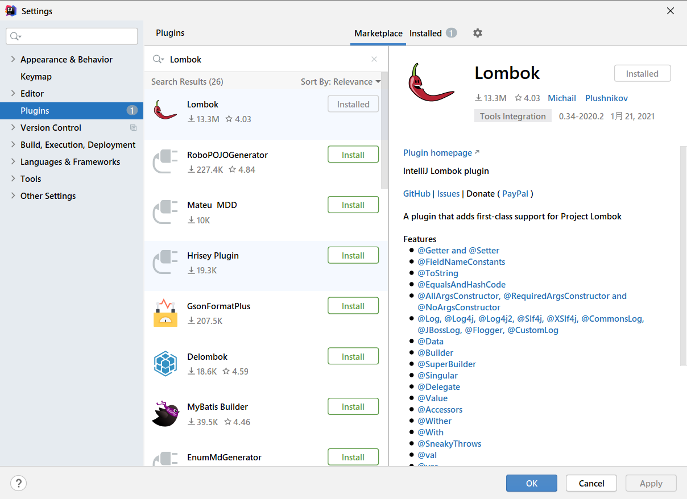
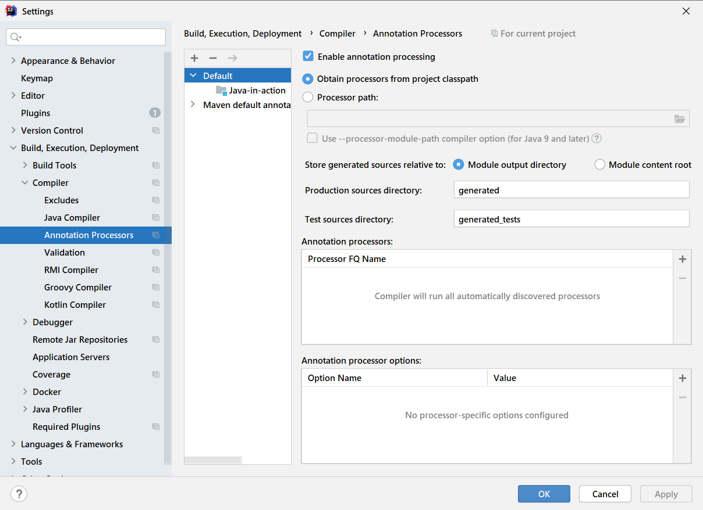

# Lombok使用指南


# 一.Why Lombok?

以前的Java项目中，充斥着太多不友好的代码：**POJO的getter/setter/toString**；异常处理；I/O流的关闭操作等等，这些样板代码既没有技术含量，又影响着代码的美观，Lombok应运而生。而且还可以使用它内置的日志注解打印日志,就避免了显示地创建logger对象了!

> 最近IDEA 2020最后一个版本发布了，已经内置了Lombok插件，SpringBoot 2.1.x之后的版本也在Starter中内置了Lombok依赖。为什么他们都要支持Lombok呢？今天我来讲讲Lombok的使用，看看它有何神奇之处！


# 二. Lombok快速入门

## 2.1 导入Lombok依赖

```xml
<dependency>
    <groupId>org.projectlombok</groupId>
    <artifactId>lombok</artifactId>
    <version>1.18.22</version>
    <scope>provided</scope>
</dependency>
```

Lombok的**scope=provided**，说明它只在编译阶段生效，不需要打入包中。事实正是如此，Lombok在编译期将带Lombok注解的Java文件正确编译为完整的Class文件。


## 2.2 下载IDEA插件

 IDEA中引入Lombok支持如下：

 点击File-- Settings设置界面，安装Lombok插件:




点击File-- Settings设置界面，开启 AnnocationProcessors,开启该项是为了让Lombok注解在编译阶段起到作用。




> Eclipse的Lombok插件安装可以自行百度，也比较简单，值得一提的是，由于Eclipse内置的编译器不是Oracle javac，而是eclipse自己实现的Eclipse Compiler for Java (ECJ).要让ECJ支持Lombok，需要在eclipse.ini配置文件中添加如下两项内容：
>
> **-Xbootclasspath/a:[lombok.jar**所在路径


## 2.3 Lombok实现原理

自从Java 6起，javac就支持“**JSR 269 Pluggable Annotation Processing API**”规范，只要程序实现了该API，就能在javac运行的时候得到调用。

Lombok就是一个实现了"JSR 269 API"的程序。在使用javac的过程中，它产生作用的具体流程如下：

------

1. javac对源代码进行分析，生成一棵抽象语法树(AST)

2. javac编译过程中调用实现了JSR 269的Lombok程序

3. 此时Lombok就对第一步骤得到的AST进行处理，找到Lombok注解所在类对应的语法树(AST)，然后修改该语法树(AST)，增加Lombok注解定义的相应树节点

4. javac使用修改后的抽象语法树(AST)生成字节码文件


## 2.4 Lombok注解的使用

### 2.4.1 @Getter/@Setter

Pojo常用注解: 

**@Getter/@Setter: 作用类上，生成所有成员变量的getter/setter方法；作用于成员变量上，生成该成员变量的getter/setter方法。可以设定访问权限及是否懒加载等。**

```java
@Getter
@Setter
public class User {
    private Integer id;
    private String username;
    private String password;
}
```


### 2.4.2 **@ToString**

**作用于类，覆盖默认的toString()方法，可以通过of属性限定显示某些字段，通过of属性指定某些字段,exclude属性排除某些字段。**

```java
@Getter
@Setter
@ToString(of = {"id", "age"}, exclude = {"password"})
public class User {
    private Integer id;
    private String username;
    private String password;
}
```


### 2.4.3 **@EqualsAndHashCode**

**作用于类，覆盖默认的equals和hashCode**


### 2.4.4 **@NonNull**

**主要作用于成员变量和参数中，标识不能为空，否则抛出空指针异常。**

```java
public class User {
    @NonNull
    private Integer id;
    private String username;
    private String password;
}
```


### 2.4.5 构造器注解

**@NoArgsConstructor, @RequiredArgsConstructor, @AllArgsConstructor**：作用于类上，用于生成构造函数。有**staticName**、**access**等属性。

**staticName属性一旦设定，将采用静态方法的方式生成实例，access属性可以限定访问权限。**

1. **@NoArgsConstructor**: **生成无参构造器；**
2. **@RequiredArgsConstructor: 生成包含final和@NonNull注解的成员变量的构造器;**
3. **@AllArgsConstructor：生成全参构造器**;

```java
@NoArgsConstructor
@AllArgsConstructor
public class User {
    private Integer id;
    private String username;
    private String password;
}
```


### 2.4.6 **@Data**

**作用于类上，是以下注解的集合：@ToString @EqualsAndHashCode @Getter @Setter @RequiredArgsConstructor**


### 2.4.7 **@Builder**

**作用于类上，将类转变为建造者模式**

```java
@Builder
public class User {
    private Integer id;
    private String username;
    private String password;

    public static void main(String[] args) {
        UserBuilder builder = new UserBuilder();
        User user = builder.id(1)
                           .username("川普")
                           .password("545465445")
                           .build();
        System.out.println(user);
    }
}
```


### 2.4.8 **@Log**

**作用于类上，生成日志变量。针对不同的日志实现产品，有不同的注解：**

**如果不引入任何日志类的库,那么默认就是java.util.logging包下的Logger类实例**

```java
@Log
public class Foo {
    public static void main(String[] args) {
        log.info("你好");
    }
}
```


### 2.4.9 **@Cleanup**

**动关闭资源，针对实现了java.io.Closeable接口的对象有效，如：典型的IO流对象**


### 2.4.10 **@SneakyThrows**

**作用于类,可以对受检异常进行捕捉并抛出**


### 2.4.11 @Synchronized

**作用于方法级别，可以替换synchronize关键字或lock锁，用处不大.**


### 2.4.12 @Accessors

**作用于类,用于链式编程,设置属性 chain = true 即可, fluent属性可以指定在链式编程时是否动态增加set前缀**

```java
// fluent默认是false也就是默认添加set前缀,
// 设为false就不会加set前缀,chain默认为true
@Accessors(chain = true)
public class User {
    private Integer id;
    private String username;
    private String password;
    
    public static void main(String[] args) {
        User user = new User();
        user.setId(1)
            .setUsername("...")
            .setPassword("1111");
    }
}
```


### 2.4.12 几个常用日志注解

**这些注解可以动态创建对应日志库的日志对象**,**在类上面声明.**

1. **@Slf4j**: Slf4j日志库

   需要引入logback库

   ```xml
   <dependency>
       <groupId>ch.qos.logback</groupId>
       <artifactId>logback-classic</artifactId>
       <version>1.3.0-alpha10</version>
   </dependency>
   ```

2. **@Log4j/@Log4j2**: 引入Log4j的库即可