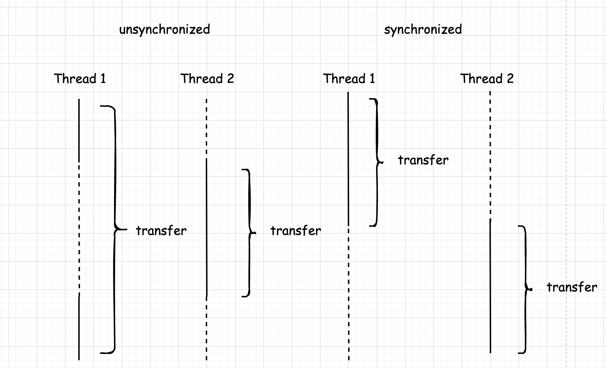

# 九. 并发

## 9.1 什么是线程

多线程程序在较低的层次上扩展了多任务的概念：一个程序同时执行多个任务。通常，每一个任务称为一个**线程(thread)**，它是线程控制的简称。可以同时运行一个以上线程的程序称为**多线程程序(multithreaded)**。

### 9.1.1 使用线程给其他任务提供机会

下面是在一个单独的线程中执行一个任务的简单过程：

1. 将任务代码移到实现了 Runnable 接口的类的 *run* 方法中。这个接口非常简单，只有一个方法：

```java
public interface Runnale {
    void run();
}
```

由于 Runnbale 是一个函数式接口，可以用 lambda 表达式建立一个实例：

```java
Runnable r = () -> { ... };
```

2. 由 Runnble 创建一个 Thread 对象：

```java
Thread t = new Thread(r);
```

3. 启动线程：

```java
t.start();
```

或者也可以通过构建一个 Thread 类的子类定义一个线程，如下所示：

```java
public class MyThread extends Thread {
    @Override
    public void run() {
        ...
    }
}
```

然后，构造一个子类对象，并调用 *start* 方法。不过，这种方法已经不再推荐。应该将要并行运行的任务与运行机制解耦合。如果有很多任务，要为每个任务创建一个独立的线程所付出的代价太大了。可以使用线程池来解决这个问题。

**不要调用 Thread 类或者 Runnable 对象的 *run* 方法。直接调用 *run* 方法，只会执行同一个线程中的任务，而不会启动新线程。应该调用 *Thread.start* 方法。这个方法将创建一个执行 *run* 方法的新线程。**


## 9.2 中断线程

当线程的 *run* 方法执行方法体中的最后一条语句后，并经由执行 *return* 语句返回时，或者出现了在方法中没有捕获的异常时，线程将终止。在 Java 早起版本中，还有一个 *stop* 方法，其他线程可以调用它终止线程。但是，这个方法现在已经被弃用了。

没有可以强制线程终止的方法。但是，*interrupt* 方法可以用来请求终止线程。

当对一个线程调用 *interrupt* 方法时，线程**中断状态**将被置位。这是每一个线程都具有的 boolean 标志。每个线程都应该不时地检查这个标志，以判断线程是否被中断，

要想弄清楚中断状态是否被置位，首先调用静态的 *Thread.currentThread* 方法获得当前线程，然后调用 *isInterrupted* 方法：

```java
while (!Thread.currentThread().isInterrupted() && ...) {
    ...
}
```

但是如果线程被阻塞，就无法检测中断状态。这是产生 InterruptedException 异常的地方。当在一个被阻塞的线程上调用 *interrupt* 方法，阻塞调用将会被 Interrupted Exception 异常中断。(存在不能被中断的阻塞式 I/O 调用，应考考虑选择可中断的调用)。

没有任何语言方面的需要要求一个被中断的线程应该终止。中断一个线程不过是引起它的注意。被中断的线程可以决定如何响应中断。某些线程是如此重要以至于应该处理完异常后，继续执行，而不理会中断。但是，更普遍的情况是，线程将简单地将中断作为一个终止的请求。这种线程 *run* 方法具有如下形式：

```java
Runnable r = () -> {
    try {
        ...
        while (!Thread.currentThread().isInterrupted() && ...) {
            ...
        }    
    } catch (InterruptedException) {
        // thread was interrupted during sleep or wait
    } finally {
        // clean up if required
    }
    // exiting the run method terminates the thread
};
```

如果在每次工作迭代这时候调用 *sleep* 方法，*isInterrupted* 检测既没有必要也没有用处。如果在中断状态被置位时调用 *sleep* 方法，它不会休眠。相反，它将清楚这一状态并抛出 InterruptedException。因此，如果你的循环调用 *sleep*，不会检测中断状态。相反，要如下所示捕获 InterruptedException：

```java
Runnable r = () -> {
    try {
        ...
        while (...) {
            ...
            Thread.sleep(DELAY);    
        }
    } catch (InterruptedException) {
        // thread was interrupted during sleep
    } finally {
        // clean up if required
    }
    // exiting the run method terminates the thread
}
```


## 9.3 线程状态

线程可以有如下 6 种状态：

- New(新创建)
- Runnable(可运行)
- Blocked(被阻塞)
- Waiting(等待)
- Timed Waiting(计时等待)
- Terminated(被终止)

### 9.3.1 新创建线程

当用 new 关键字创建一个新线程时，如 `new Thread(r)`，该线程还没开始运行。这意味着它的状态是 new。当一个线程处于创建状态时，程序还没有开始运行线程中的代码。在线程运行之前还有一些基础工作要做。


### 9.3.2 可运行线程

一旦调用 *start* 方法，线程处于 runnable 状态。一个可运行的线程可能正在运行也可能没有运行，这取决于操作系统给线程提供运行的时间。(Java 的规范说明没有将它作为一个单独状态。一个正在运行中的线程仍然处于可运行状态。)

一旦一个线程开始运行，它不必始终保持运行。事实上，运行中的线程被中断，目的是为了让其他线程获得运行机会。线程调度的细节依赖于操作系统提供的服务。抢占式调度系统给每一个可运行线程一个时间片来执行任务。当时间片用完，操作系统**剥夺**该线程的运行权，并给另一个线程运行机会。当选择下一个线程时，操作系统考虑线程的**优先级**。

现在所有的桌面以及服务器操作系统都使用抢占式调度。但是，像手机这样的小型设备可能使用协作式调度。在这样的设备中，一个线程只要调用 *yield* 方法、或者被阻塞或等待时，线程才失去控制权。

当具有多个处理器的机器上，每一个处理器运行一个线程，可以有多个线程并行运行。当然，如果线程的数目多于处理器的数目，调度器依然采用时间片机制。

记住，在任何给定时刻，一个可运行的线程可能正在运行也可能没有运行。


### 9.3.3 被阻塞线程和等待线程

当线程处于被阻塞或等待状态时，它暂时不活动。它不运行任何代码且消耗最少得资源。直到线程调度器重新激活它。细节取决于它是怎样达到非活动状态的。

- 当一个线程试图获取一个内部的**对象锁**，而该锁被其他线程持有，则该线程进入**阻塞状态**。当所有其他线程释放该锁，并且线程调度器允许本线程持有它的时候，该线程将变成非阻塞状态。
- 当线程等待另一个线程通知调度器一个条件时，它自己进入**等待状态**。实际上，被阻塞状态与等待状态是有很大不同的。
- 有几个方法有一个超时参数。调用它们导致线程进入**计时等待(timed waiting)**状态。这一状态将一直保持到超时期满或者接收到适当的通知。带有超时参数的方法有 `Thread.sleep` 和 `Object.wait`、`Thread.join`、`Lock.tryLock` 以及 `Condition.await` 的计时版。


### 9.3.4 被终止的线程

线程因如下两个原因之一而被终止：

- 因为 *run* 方法正常退出而自然死亡。
- 因为一个没有捕获的异常终止了 *run* 方法而意外死亡。

特别是，可以调用线程的 *stop* 方法杀死一个线程。该方法抛出 ThreadDeath 错误对象，由此杀死线程。但是，*stop* 方法已过时，不要在自己的代码中调用这个方法。


*java.lang.Thread*：

```java
void join();  // 等待终止指定的线程
void join(long millis);  // 等待指定的线程死亡或者经过指定的毫秒数
Thread.State getState();  // 得到线程的状态
void stop();  // 停止该线程。这一方法已经过时
void suspend();  // 暂停这一线程的执行。这一方法已经过时
void resume();  // 恢复线程。这一方法仅仅在调用 suspend() 方法之后调用。这一方法已经过时
```


## 9.4 线程属性

### 9.4.1 线程优先级

在 Java 程序设计语言中，每一个线程有一个**优先级**。默认情况下，一个线程继承它的父线程的优先级。可以用 *setPriority* 方法提高或降低任何一个线程的优先级。可以将优先级设置为 MIN_PRIORITY(在 Thread 类中定义为 1)与 MAX_PRIORITY(定义为 10)之间的任何值。NORM_PRIORITY 被定义为 5.

每当线程调度器有机会选择线程时，它首先选择具有较高优先级的线程。但是，线程优先级是**高度依赖于系统的**。当虚拟机依赖于宿主机平台的线程实现机制时，Java 线程的优先级被映射到宿主机平台的优先级上，优先级个数也许更多，也许更少。

例如，Winodws 有 7 哥优先级别。一些 Java 优先级将映射到相同的操作系统优先级。在 Oracle 为 Linux 提供的 Java 虚拟机中，线程的优先级被忽略——所有线程具有相同的优先级。


### 9.4.2 守护线程

可以通过调用：

```java
t.setDaemon(true);
```

将线程转换为**守护线程(daemon thread)**。这样一个线程没有什么神奇。守护线程的唯一用途是为其他线程提供服务。计时线程就是一个例子，它定时地发送“计时器嘀嗒”信号给其他线程或清空过时的高速缓存项的线程。当只剩下守护线程时，虚拟机就退出了，由于如果只剩下守护线程，就没必要继续运行程序了。

守护线程有时会被初学者错误地使用，他们不打算考虑关机(shutdown)动作。但是，这是很危险的。守护线程应该永远不去访问固有资源，如文件、数据库，因为它会在任何时候甚至在一个操作的中间发生中断。


### 9.4.3 未捕获异常处理器

**线程的 *run* 方法不能抛出任何受查异常**，但是，非受查异常会导致线程终止。在这种情况下，线程就死亡了。

但是不需要任何 catch 子句来处理可以被传递的异常。相反，就在线程死亡之前，异常被传递到一个用于为捕捉异常的处理器。

该处理器必须属于一个实现 `Thread.UncaughtExceptionHandler` 接口的类。这个接口只有一个方法。

```java
void uncaughtException(Thread t, Throwable e);
```

可以用 *setUncaughrtExceptionHandler* 方法为任何线程安装一个处理器。也可以用 Thread 类的静态方法 *setDefaultUncaughtExceptionHandler* 为所有线程安装一个默认的处理器。替换处理器的可以使用日志 API 发送未捕获异常的报告到日志文件。

如果不安装默认的处理器，默认的处理器为空。但是，如果不为独立的线程安装处理器，此时的处理器就是该线程的 ThreadGroup 对象。

ThreadGroup 类实现了 Thread.UncaughtExceptionHandler 接口。它的 uncaughtException 方法做如下操作：

1. 如果该线程组有父线程组，那么父线程组的 *uncaughtException* 方法被调用。
2. 否则，如果 *Thread.getDefaultExceptionHandler* 方法返回一个非空的处理器，则调用该处理器。
3. 否则，如果 Throwable 是 ThreadDeath 的实例，什么都不做。
4. 否则，线程的名字以及 Throwable 的栈轨迹被输出到 System.err 上。


## 9.5 同步

在大多数实际的多线程应用中，两个或两个以上的线程需要共享对同一数据的读取。如果两个线程存取相同的对象，并且每一个线程都调用了一个修改改对象状态的方法，将会发生什么呢？可以想象，线程彼此踩了对象的脚。根据各线程访问数据的次序，可能会产生错误的对象。这样一个情况通常称为**竞争条件(race condition)**。

### 9.5.1 竞争条件的一个例子

为了避免多线程引起的对共享数据的讹误，必须学习如何**同步存取**。

下面案例模拟一个有若干账户的银行。随机地生成在这些账户之间转移欠款的交易。每一个账户有一个线程。每一笔交易中，会从线程所服务的账户中随机转移一定数目的钱款到另一个随机账户。

定义一个 *transfer* 方法，这个方法从一个账户转移一定数量的钱款到另一个随机账户。

```java
public void transfer(int from, int to, double amount) {
    if (accounts[from] < amount) {
        return;
    }
    System.out.print(Thread.currentThread());
    accounts[from] -= amount;
    System.out.printf(" %10.2f from %d to %d", amount, from, to);
    accounts[to] += amount;
    System.out.printf(" Total Balance: %10.2f%n", getTotalBalance());
}
```

Bank 类：

```java
public class Bank {
    private final double[] accounts;

    public Bank(int n, double initialBalance) {
        accounts = new double[n];
        Arrays.fill(accounts, initialBalance);
    }

    public void transfer(int from, int to, double amount) {
        if (accounts[from] < amount) { 
            return;
        }
        System.out.print(Thread.currentThread());
        accounts[from] -= amount;
        System.out.printf(" %10.2f from %d to %d", amount, from, to);
        accounts[to] += amount;
        System.out.printf(" Total Balance: %10.2f%n", getTotalBalance());
    }

    public double getTotalBalance() {
        return Arrays.stream(accounts).reduce(0, Double::sum);
    }

    public int size() {
        return accounts.length;
    }
}
```

这是 Runnable 接口的实现代码，它的 *run* 方法不断地从一个固定的银行账户取出钱款。在每一次迭代中，*run* 方法随机选择一个目标账户和一个随机账户，调用 bank 对象的 *transfer* 方法，然后睡眠：

```java
public class BankTest {
    public static final int NACCOUNTS = 100;
    public static final double INITIAL_BALANCE = 1000;
    public static final double MAX_AMOUNT = 1000;
    public static final int DELAY = 10;

    public static void main(String[] args) {
        Bank bank = new Bank(NACCOUNTS, INITIAL_BALANCE);
        for (int i = 0; i < NACCOUNTS; i++) {
            int fromAccount = i;
            Runnable r = () -> {
                try {
                    while (true) {
                        int toAccount = (int) (bank.size() * Math.random());
                        double amount = MAX_AMOUNT * Math.random();
                        bank.transfer(fromAccount, toAccount, amount);
                        Thread.sleep((int) (DELAY * Math.random()));
                    }
                } catch (InterruptedException e) {
                }
            };
            Thread t = new Thread(r);
            t.start();
        }
    }
}
```


当这个模拟程序运行时，不清楚在某一时刻某一银行账户中有多少钱。但是，知道所有账户的总金额应该保持不变，因为所做的一切不过是从一个账户转移钱款到另一个账户。

在每一次交易的结尾，*transfer* 方法重新计算总值并打印出来。

显然这里面出现了错误，在最初的交易中，银行的余额保持 100,000，但是到后面余额就会发生了变化，这也就是所谓的线程安全问题。


### 9.5.2 竞争条件详解

程序运行一段时间后，错误不知不觉就出现了，总额要么增加，要么就减少。当两个线程试图同时更新同一个账户的时候，这个问题就出现了。假定两个线程同时执行指令：

```java
accounts[to] += amount;
```

问题就在于这不是原子操作。该指令可能被处理如下：

1. 将 accounts[to] 加载到寄存器。
2. 增加 amount。
3. 将结果写回 accounts[to]。

现在，假定第 1 个线程执行步骤 1 和 2，然后，它被剥夺了运行权。假定第 2 个线程被唤醒并修改了 accounts 数组中的同一项。然后，第 1 个线程被唤醒完成其第 3 步。

这样，这一动作擦去了第二个线程所做的更新。于是，总金额不再正确。


### 9.5.3 锁对象

有两种机制防止代码块受到并发访问的干扰。Java 语言提供一个关键字达到这一目的，并且 Java 5 引入了 ReentrantLock 类。synchronized 关键字自动提供一个锁以及相关的“条件”，对于大多数需要显示锁的情况，这是很便利的。*java.util.concurrent* 包为这些基础

使用 ReentrantLock 保护代码块的基本结构如下：

```java
myLock.lock();  // a ReentrantLock object
try {
    ...
} finall {
    myLock.unlock();  // make sure the lock is unlocked even if an exception is thrown
}
```

这一结构确保任何时刻只有一个线程进入临界区。一旦一个线程封锁了锁对象，其他任何线程都无法通过 lock 语句。当其他线程调用 *lock* 时，它们被阻塞，直到第一个线程释放锁对象。

**把解锁操作放在 finally 子句中是至关重要的。如果在临界区的代码抛出异常，锁必须被释放。否则，其他线程将永远阻塞。如果使用锁，就不能使用带资源的 try 语句。首先，解锁方法名不是 *close*。不过，即使将它重命名，带资源的 try 语句也无法正常工作。它的首部希望声明一个新变量。但是如果使用一个锁，你可能想使用多个线程共享的那个变量(而不是新变量)。**

e.g. 使用一个锁保护 Bank 类的 *transfer* 方法：

```java
public class Bank {
	private Lock bankLock = new ReentrantLock();
    ...
        
    public void transfer(int from, int to, double amount) throws InterruptedException {
        bankLock.lock();
        try {
            while (accounts[from] < amount)
                sufficientFunds.await();
            System.out.print(Thread.currentThread());
            accounts[from] -= amount;
            System.out.printf(" %10.2f from %d to %d", amount, from, to);
            accounts[to] += amount;
            System.out.printf(" Total Balance: %10.2f%n", getTotalBalance());
            sufficientFunds.signalAll();
        } finally {
            bankLock.unlock();
        }
    }    
}
```

假定一个线程调用 *transfer*，在执行结束前被剥夺了运行权。假定第二个线程也调用 transfer，由于第二个线程不能获得锁，将在调用 *lock* 方法时被阻塞。它必须等待第一个线程完成 *transfer* 方法的执行之后才能再度被激活。当第一个线程释放锁时，那么第二个线程才能开始运行。



简单来讲，所谓同步，也就是逻辑上的串行化执行。

锁是**可重入的**，因为线程可以重复地获得已经持有的锁。锁保持一个**持有计数(hold count)**来跟踪对 lock 方法的嵌套调用。线程在每一次调用 *lock* 都要调用 *unlock* 来释放锁。由于这一特性，被一个锁保护的代码可以调用另一个使用相同的锁的方法。

通常，可能想要保护若干个操作来更新或检查共享对象的代码块。要确定这些操作完成后，另一个线程才能使用相同对象。要留心临界区的代码，不要因为异常的抛出而跳出临界区。如果在临界区代码结束之前抛出了异常，finally 子句将释放锁，但会使对象可能处于一种受损状态。


### 9.5.4 条件对象

通常，线程进入临界区，却发现在某一条件满足之后它才能执行。要使用一个条件对象来管理那些已经获得了一个锁但是却不能做有用工作的线程。

一个锁对象可以有一个或多个相关的条件对象。可以使用 *newCondition* 方法获得一个条件对象。习惯上给每一个条件对象命名为可以反映它们所表达的条件的名字。例如，在此设置一个“余额充足”条件。

```java
public class Bank {
    priavte Condition sufficientFunds;
    ...
    public Bank() {
        ...
        sufficientFunds = bankLock.newCondition();    
    }            
}
```

如果 *transfer* 方法发现余额不足，它调用：

```java
sufficientFunds.await();
```

**当前线程现在被阻塞了，并放弃了锁。**我们希望这样可以使得另一个线程可以进行增加账户余额的操作。等到获得锁的线程的调用 *await* 方法的线程存在本质上的不同。一旦一个线程调用 *await* 方法，它进入该条件的等待集。当锁可用时，该线程不能马上解除阻塞。相反，它处于阻塞状态，直到另一个线程调用统一条件上的 *signalAll* 方法时为止。

当另一个线程转账时，它应该调用：

```java
sufficientFunds.signalAll();
```

这一调用重新激活因为这一条件而等待的所有线程。当这些线程从等待集当中移出时，它们再次成为可运行的，调度器再次激活它们。同时，它们将试图重新进入该对象。一旦锁成为可用的，它们中的某个将从 *await* 返回调用，获得该锁并从被阻塞的地方**继续**执行。

此时，线程应该再次测试该条件。由于无法确保该条件被满足——*signalAll* 方法仅仅是通知正在等待的线程：此时有可能已经满足条件，值得再次去检测该条件。

通常，对 *await* 的调用应该在如下形式的循环体中：

```java
while (!(ok to proceed)) {
    condition.await();
}
```

至关重要的是最终需要某个其他线程调用 *signalAll* 方法。当一个线程调用 *await* 时，它没有办法重新激活自身。它寄希望于其他线程。如果没有其他线程来重新激活等待的线程，它就永远不再运行了。这将导致令人不愉快的**死锁(deadlock)**现象。如果所有其他线程被阻塞，最后一个活动线程在解除其他线程的阻塞状态之前就调用 *await* 方法，那么它也被阻塞。没有任何线程可以解除其他线程的阻塞，那么该程序就挂起了。

应该何时调用 *signalAll* 方法？经验上讲，在对象的状态有利于等待线程的方向改变时调用 *signalAll*。例如，当一个账户余额发生改变时，等待的线程会应该有机会检查余额。在例子中，当完成了住转账时，调用 *signalAll* 方法：

```java
public void transfer(int from, int to, int amount) {
    banLock.lock();
    try {
        while (accounts[from] < amount) {
            sufficientFunds.await();
        }
        // transfer funds
        ...
        sufficientFunds.signalAll();
    }
}
```

注意调用 *signalAll* 不会立即激活一个等待线程。它仅仅解除等待线程的阻塞，以便这些线程退出同步方法后，通过竞争实现对对象的访问。

另一个方法 *signal*，则是随机解除等待集中某个线程的阻塞状态。这比解除所有线程的阻塞更加有效，但也存在危险。如果随机选择的线程发现自己仍然不能运行，那么它再次被阻塞。如果没有其他线程再次调用 *signal*，那么系统就死锁了。

**当一个线程拥有某个条件的锁时，它仅仅可以在该条件上调用 *await*、*signalAll* 或 *signal* 方法。**


### 9.5.5 synchronized关键字

总结一下有关锁和条件的关键之处：

- 锁用来保护代码片段，任何时刻只能有一个线程执行被保护的代码。
- 锁可以管理试图进入被保护代码段的线程。
- 锁可以拥有一个或多个相关的条件对象。
- 每个条件对象管理那些已经进入被保护的代码段但不能运行的线程。

Lock 和 Condition 接口为程序设计人员提供了高度的锁定控制。然而，大多数情况下，并不需要那样的控制，并且可以使用一种嵌入到 Java 语言内部的机制。从 1.0 版本开始，Java 中的每一个对象都有一个内部锁。如果一个方法使用 synchronized 关键字声明，那么对象的锁将保护整个方法。也就是说，要调用该方法，现成必须获得内部的对象锁。

换句话说，

```java
public synchronized void method() {
	...    
}
```

等价于：

```java
public void method() {
    this.intrinsicLock.lock();
    try {
        ...
    } finally {
        this.intrinsicLock.unlock();
    }
}
```

内部对象锁只有一个相关条件。*wait* 方法添加到一个线程到等待集中，*notifyAll/notidfy* 方法解除等待线程的阻塞状态。换句话说，调用 *wait* 或 *notifyAll* 等价于：

```java
intrinsicCondtion.await();
intrinsicConditon.signalAll();
```

*wait*、*notifyAll/notify* 方法时 Object 类的 final 方法。Condition 对象的方法必须命名为 *await*、*signalAll* 和 *signal* 以便它们不会与那些方法发生冲突。

例如，可以实现 Bank 类如下：

```java
public class Bank {
    private double[] accounts;
    public synchronized void transfer(int from, int to, int amount) throws InterruptedException {
        while (accounts[form] < amount) {
            wait();
        }
        accounts[from] -= account;
        accounts[to] += amount;
        notifyAll();  // notify all threads waiting on the condition
    }
}
```

可以看到，使用 synchronized 关键字来编写代码要简洁得多。当然，要理解这一代码，必须了解每一个对象有一个内部锁，并且该锁有一个内部条件。由锁来管理那些试图进入 synchronized 方法的线程，由条件来管理那些调用 *wait* 的线程。

将静态方法声明为 synchronized 也是合法的。如果调用这种方法，该方法获得相关的类对象的内部锁。例如，如果 Bank 类是一个静态同步方法，那么当该方法被调用时，Bank.class 对象的锁被锁住。因此，没有其他线程可以调用同一个类的这个货任何其他的同步静态方法。

内部锁和条件存在一些局限。包括：

- 不能中断一个正在试图获得锁的线程。
- 试图获得锁时不能设定超时。
- 每个锁仅有单一的条件，可能是不够的。

使用哪一种锁？下面是一些建议：

- 最好既不使用 Lock/Condition 也不使用 synchronized 关键字。在许多情况下可以使用 *java.util.concurrent* 包中的一种机制，它会为你处理所有的加锁。
- 如果 synchronized 关键字适合你的程序，那么尽量使用它，这样可以减少编写的代码数量，减少出错的几率。
- 如果特别需要 Lock/Condition 结构提供的独有特性时，才使用 Lock/Condition。


### 9.5.6 同步阻塞

除了给方法加 synchronized 关键字进行同步，还有一种操作也可以获得锁：

```java
synchronized (obj) {  // this is the syntax for a synchronized
    ...
}
```

于是它获得 obj 的锁。

有时候会发现“特殊的”锁：

```java
public class Bank {
    private double[] accounts;
    private Object lock = new Object();
    ...
    public void transfer(int from, int to, int amount) {
        synchronized (lock) {  // an ad-doc lock
            accounts[from] -= amount;
            accounts[to] += amount;
        }
    }    
}
```

在此，lock 对象被创建仅仅是用来使用每个 Java 对象持有锁。


### 9.5.7 监视器概念

锁和条件是线程同步的强大工具，但是，严格地讲，它们不是面向对象的。多年来研究人员努力寻找一种解决方法，可以在不需要程序员考虑如何加锁的情况下，就可以保证多线程的安全性。最成功的解决方案之一是**监视器**(monitor)，这一概念最早是由 Per Brinch Hansen 和 Tony Hoare 在 20 世纪 70 年代提出的。用 Java 的术语讲，监视器有如下特性：

- 监视器是只包含私有域的类。
- 每个监视器类的对象有一个相关的锁。
- 使用该锁对所有的方法进行加锁。换句话说，如果客户端使用 `obj.method()`，那么 obj 对象的锁时在方法调用开始时自动获得，并且当方法返回时自动释放锁。因为所有的域是私有的，这样的安排可以确保一个线程在对对象操作时，没有其他线程能访问该域。
- 该锁可以有任意多个相关条件。

监视器的早期版本只有单一的条件，使用一种很优雅的句法。可以简单调用 `await accounts[from] >= balance` 而不使用任何显示的条件变量。然而，研究表明盲目地重新测试条件是低效的。显示的条件变量解决了这一问题。每一个条件变量管理一个独立的线程集。

Java 设计者不是很精确的方式采用了监视器概念，Java 中的每一个对象有一个内部的锁和内部的条件。如果一个方法用 synchronized 关键字声明，那么，它表现的就像是一个监视器方法。通过调用 *wait/notify/notifyAll* 来访问条件变量。

然而，在下述的 3 个方面 Java 对象不同于监视器，从而使得线程安全性下降：

- 域不要求是必须是 priavte。
- 方法不要求必须是 synchronized。
- 内部锁对客户是可用的。


### 9.5.8 Volatile域

有时，仅仅为了读写一个或两个实例域就使用同步，显得开销过大了。毕竟，什么地方能出错呢？遗憾的是，使用现代的处理器与编译器，出错的可能性很大。

- 多核处理器的计算机能够暂时在寄存器或本地内存缓冲区中保存内存中的值。结果是，运行在不同处理器上的线程可能在同一内存位置取到不同的值。
- 编译器可以改变指令执行的顺序以使吞吐量最大化。这种顺序上的变化不会改变大代码语义，但是编译器假定内存的值仅仅在代码中有显示的修改指令时才会改变。然而，内存的值可以被另一个线程改变。

如果使用锁来保护可以被多个线程访问的代码，那么可以不考虑这种情况。编译器被要求通过在必要的时候刷新本地缓存来保持锁的效应，并且不能不正当地重新排序指令。

volatile 关键字为实例域的同步访问提供了一种免锁机制。如果声明一个域为 volatile，那么编译器和虚拟机就知道该域可能被另一个线程并发更新的。

例如，假定一个对象有一个布尔标记 done，它的值被另一个线程设置却被另一个线程查询，这样就可以使用锁：

```java
private boolean done;
public synchronized boolean isDone() {
    return done;
}
public synchronized void setDone() {
    done = true;
}
```

或者使用内部锁不是个好主意。如果另一个线程已经对该对象加锁，*isDone* 和 *setDone* 方法可能阻塞。如果注意到这个方面，一个线程可以为这一变量使用独立的 Lock。但是，这会带来许多麻烦。

在这种情况下，将域声明为 volatile 是合理的：

```java
private volatile boolean done;
public boolean isDone() {
    return done;
}
public void setDone() {
    done = true;
}
```


### 9.5.9 final变量

还有一种情况可以安全地访问一个共享域，即这个域声明为 final 时。考虑以下声明：

```java
final Map<String, Double> accounts = new HashMap<>();
```

其他线程会在构造函方法完成构造之后才看到这个 accounts 变量。

如果不使用 final，就不能保证其他线程看到的是 accounts 更新后的值，它们可能都只是看到 null，而不是新构造的 HashMap。

当然，对这个映射表的操作并不是线程安全的。如果多个线程在读写这个映射表，仍然需要进行同步。


### 9.5.10 原子性

假设对共享变量除了赋值之外并不完成其他操作，那么可以将这些共享变量声明为 volatile。

*java.util.concurrent.atomic* 包中有很多类使用了很高效的机器级指令(而不是使用锁)来保证其他操作的原子性。例如，AtomicInteger 类提供了方法 *incrementAndGet* 和 *decrementAndGet*，它们分别以原子方式将一个整数自增或自减。例如，可以安全地生成一个数值序列：

```java
public static AtomicLong nextNumber = new AtomicLong();
long id = nextNumber.incrementAndGet();
```

*incrementAndGet* 方法以原子方式将 AtomicLong 自增，并返回自增后的值。也就是说，获得值、增 1 并设置然后生成新值的操作不会中断。可以保证即使是多个线程并发地访问同一实例，也会计算并返回正确的值。

有很多方法可以以原子方式设置和增减值，不过，如果希望完成更复杂的更新，就必须使用 *compareAndSet* 方法。例如，假设希望跟踪不同线程观察的最大值。下面的代码是不可行的：

```java
public static AtomicLong largest = new AtomicLong();
largest.set(Math.max(largest.get(), observerd));  // Error--race condtion
```

这个更新不是原子的。实际上，应当在一个循环中计算新值和使用 *compareAndSet*：

```java
do {
    oldValue = largest.get();
    newValue = Math.max(oldValue, observed);
} while (!(largest.compareAndSet(oldValue, newValue)));
```

如果另一个线程也在更新 largest，就可能阻止这个线程更新。这样一来，*compareAndSet* 会返回 false，而不会设置新值。在这种情况下，循环会再次尝试，读取更新后的值，并尝试修改。最终，它会成功地用新值替换原来的值。这听上去有些麻烦，不过 *compareAndSet* 方法会映射到一个处理器操作，比使用锁速度更快。

在 Java 8 中，可以这样写：

```java
largest.updateAndGet(x -> Math.max(x, observed));
```

或

```java
largest.accumulateAndGet(observed, Math::max);
```

如果有大量线程要访问相同的原子值，性能会大幅下降。因为乐观更新需要太多次重试。Java SE 8 提供了 LongAdder 和 LongAccumulate 类来解决这个问题。LongAdder 包括多个变量，其总和为当前值。可以有多个线程更新不同的加数，线程个数增加时会自动提供新的加数。通常情况下，只有当前所有工作都完成之后才需要总和的值，对于这种情况，这种方法会高效。性能会有显著的提升。


### 9.5.11 死锁

锁和条件不能解决多线程中的所有问题。考虑以下情况：

```
账户 1 : $200
账户 2 : $300
线程 1 : 从账户 1 转移 $300 到账户 2
线程 2 : 从账户 2 转移 $400 到账户 1
```

线程 1 和 线程 2 都被阻塞了。因为账户 1 以及账户 2 中的余额都不足以进行转账，两个线程都无法执行下去。

有可能因为每一个线程要等待更多的钱款存入而导致所有线程都被阻塞。这样的状态称为**死锁(dead lock)**。

导致死锁的另一种途径是让第 i 个线程负责向第 i 个账户存钱，而不是从第 i 个账户取钱。这样一来，有可能讲所有的线程都集中到一个账户上，每一个线程都试图从这个账户中取出大于该账户的钱。


### 9.5.12 线程局部变量

使用 ThreadLocal 辅助类可以为各个线程提供各自的实例。例如，SimpleDateFormat 类不是线程安全的。

```java
public static final SimpleDateFormat formatter = new SimpleDateFormat("yyyy-MM-dd");
```

如果多个线程都执行一下操作：

```java
String dateStamp = formatter.format(new Date());
```

结果可能会很混乱，因为 formatter 使用的内部数据结构可能被并发的访问破坏。当然可以使用同步，但开销很大。或者也可以在需要时候构造一个局部 SimpleDateFormat 对象，不过太浪费了。

要为每个线程构造一个实例，可以使用以下代码：

```java
public static final ThreadLocal<SimpleDateFormat> formatter = ThreadLocal.withInitial(
	() -> new SimpleDateFormat("yyyy-MM-dd");
); 
```

要访问具体的格式化方法，可以调用：

```java
String dateStamp = formatter.get().format(new Date());
```

在一个戈丁线程中生成随机数也存在类似的问题。*java.util.Random* 类是线程安全的。但是如果多个线程需要等待一个共享的随机数生成器，这会很低效。

可以使用 ThreadLocal 辅助类为各个线程提供一个单独的生成器，不过 Java SE 7 还另外提供了一个便利类。只需要做以下调用：

```java
int random = ThreadLocalRandom.current().nextInt(upperBound);
```

`ThreadLocalRandom.current()` 调用会返回特定于当前线程的 Random 类实例。

*java.lang.ThreadLocal\<T\>*：

```java
T get();  // 得到这个线程的当前值。如果是首次调用 get，会调用 initialize 来得到这个值。
protected initialize();  // 应覆盖这个方法来提供一个初始值。默认情况下，这个方法返回 null。
void set(T t);  // 为了这个线程设置一个新值。
void remove();  // 删除这个线程的值。
// 创建一个线程局部变量，其初始值通过调用给定的 supplier 生成
static <S> ThreadLocal<S> withInitial(Supplier<? extends S> supplier);  
```


### 9.5.13 锁测试与超时

线程在调用 *lock* 方法来得到另一个线程所持有的锁的时候，很可能发生阻塞。应该更加谨慎地申请锁。*tryLock* 方法试图申请一个锁，在成功获得锁后返回 true，否则，立即返回 false，而且线程可以立即离开去做其他事情。

```java
if (myLock.tryLock()) {
    // now the thread owns the lock
    try {
        ...
    } finally {
        myLock.unLock();
    }
} else {
    // do something else
}
```

可以调用 *tryLock* 时，使用超时参数：

```java
if (myLock.tryLock(100, TimeUnit.MILLISECONDS)) {
	...    
}
```

TimeUnit 是一个枚举类型，可取的值包括 SECONDS、MILLISECONDS、MICROSECONDS 和 NANOSECONDS。

*lock* 方法不能被中断。如果一个线程在等待获得一个锁时被中断，中断线程在获得锁之前一直处于阻塞状态。如果出现死锁，那么，*lock* 方法就无法终止。

然而，如果调用带有超时参数的 *tryLock*，那么如果线程在等待期间被中断，将抛出 InterruptedException 异常。这是一个非常有用的特性，因为允许程序打破死锁。

也可以调用 *lockInterruptibly* 方法。它就相当于一个超时设为无限的 *tryLock* 方法。

在等待一个条件时，也可以提供一个超时：

```java
myCondition.await(100, TimeUnit.MILLISECONDS);
```

如果一个线程被另一个线程通过调用 *signalAll* 或 *signal* 激活，或者超时时限已经达到，或者线程被中断，那么 *await* 方法将返回。

如果等待的线程被中断，*await* 方法将抛出一个 InterruptedException 异常。在希望出现这种情况时线程继续等待，可以使用 *awaitUninterruptibly* 方法代替 *await*。


### 9.5.14 读写锁

*java.util.concurrent.locks* 包定义了两个锁类，分别是  ReentrantLock 和 ReentrantReadWriteLock 类。如果很多线程从一个数据结构读取数据而很少线程修改其中的数据的话，后者是十分有用的，在这种情况下，允许对读者线程共享访问是合适的。当然，写者线程依然必须是互斥访问的。

使用读/写锁的必要步骤：

1. 构造一个  ReentrantReadWriteLock 对象：

```java
private ReentrantReadWriteLock lock = new ReentrantReadWriteLock();
```

2. 抽取读写锁：

```java
private Lock readLock = lock.readLock();
private Lock writeLock = lock.writeLock();
```

3. 对所有的获取方法加读锁：

```java
public double getTotalBalance() {
    readLock.lock();
    try {
        ...
    } finally {
        readLock.unlock();
    }
}
```

4. 对所有的修改方法加写锁：

```java
public void transfer(...) {
    writeLock.lock();
    try {
        ...
    } finally {
        writeLock.unlock();
    }
}
```


### 9.5.15 为什么抛弃stop和suspend方法

初始的 Java 版本定义了一个 stop 方法用来终止一个线程，以及一个 *suspend* 方法用来阻塞一个线程直至另一个线程调用 *resume*。*stop* 和 *suspend* 方法有一些共同点，都试图控制一个给定线程的行为。

*stop*、*suspend* 和 *resume* 方法已经启用。*stop* 方法天生就不安全，经验证明 *suspend* 方法会经常导致死锁。

首先来看 *stop*方法，该方法终止所有未结束的方法，包括 *run* 方法、当线程被终止，立即释放被它锁住的所有对象的锁。这会导致对象处于不一致的状态。例如，假定 TransferThread 在从一个账户向另一个账户转账的过程中被终止，钱款已经被转出，却没有转入目标账户，现在银行对象就被破坏了。因为锁已经被释放，这种破坏会被其他尚未停止的线程观察到。

当线程要终止另一个线程时，无法知道什么时候调用 *stop* 方法时安全的，什么时候导致对象被破坏。因此，该方法被弃用了。在希望停止线程的时候应该中断线程，被中断的线程会在安全的时候停止。

再来看 *suspend* 方法有什么问题。与 *stop* 不同，*suspend* 不会破坏对象，但是，如果用 *suspend* 挂起一个持有一个锁的线程，那么，该锁在恢复之前是不可用的。如果调用 *suspend* 方法的线程试图获得同一个锁，那么程序死锁。被挂起的线程等待着被恢复，而将其挂起的线程等待获得锁。


## 9.6 阻塞队列

对于许多线程问题，可以通过使用一个或多个队列以优雅且安全的方式将其形式化。生产者线程向队列插入元素，消费者线程则取出它们。使用队列，可以安全地从一个线程向另一个线程传递数据。例如，考虑银行转账程序，转账线程将转账指令对象插入一个队列中，而不是直接访问银行对象。另一个线程从队列中取出指令执行转账。只有该线程可以访问该银行对象的内部。因此不需要同步。(当然，线程安全地队列类的实现者不能不考虑锁和条件，但是，那是他们的问题而不是你的问题。)

当试图向队列中添加元素而队列已满，或者是想从队列移出元素而队列为空的时候，**阻塞队列(blocking queue)**导致线程阻塞。在协调多个线程之间的合作时，阻塞队列是一个有用的工具。工作者线程可以周期性地将中间结果存储在阻塞队列中。其他的工作者线程移出中间结果并进一步加以修改。队列会自动地平衡负载。如果第一个线程集运行得比第二个慢，第二个线程集在等待结果时会阻塞。如果第一个线程集运行得快，它将等待第二个队列集赶上来。

阻塞队列方法分为以下 3 类，这取决于当队列满或空时它们的相应方式。如果将队列当作线程管理工具来使用，将要用到 *put* 和 *take* 方法。当试图向满的队列中添加或从空的队列中移出元素时，*add*、*remove* 和 *element* 操作抛出异常。当然在一个多线程程序中，队列会在任何时候空或满，因此，一点要使用 *offer*、*poll* 和 *peek*方法作为替代。这些方法如果不能完成任务，只是给出一个错误提示而不是抛出异常。

*poll* 和 *peek* 方法返回空来指示失败。因此，向这些队列中插入 null 值是非法的。

还有带超时的 *offer* 方法和 *poll* 方法的变体。例如：

```java
boolean success = q.offer(x, 100, TimeUnit.MILLISECONDS);
```

尝试在 100 毫秒的时间内在队列的尾部插入一个元素。如果成功返回 true。否则，达到超时，返回 false。类似地，下面的调用：

```java
Object head = q.poll(100, TimeUnit.MILLISECONDS);
```

尝试用 100 毫秒的时间移除队列的头元素，如果成功则返回头元素，否则，达到超时，返回 null。

如果队列满，则 *put* 方法阻塞。如果队列空，则 *take* 方法阻塞。在不带超时参数时,*offer* 和 *poll* 方法等效。

*java.util.concurrent* 包提供了阻塞队列的几个变种。默认情况下，LinkedBlockingQueue 的容量是没有上边界的，但是，也可以选择指定最大容量。LinkedBlockingDeque 是一个双端的版本。ArrayBlockingQueue 在构造时需要指定容量，并且有一个可选的参数来指定是否需要公平性。若设置了公平参数，则那么等待了最长时间的线程会优先得到处理。通常，公平性会降低性能，只有在确实非常需要的时候才使用它。

PriorityBlockingQueue 是一个带优先级的队列，而不是先进先出队列。元素按照它们的优先级顺序被移出。该队列是没有容量上限的，但是，如果队列是空的，取元素的操作会阻塞。

最后 DelayQueue 的包含实现 Delayed 接口的对象：

```java
public interface Delayed extends Comparable<Delayed> {
    long getDelay(TimeUnit unit);
}
```

*getDelay* 方法返回对象的残留延迟。负责表示延迟已经结束。元素只有在延迟用完的情况下才能从 DelayQueue 移出。还必须实现 *compareTo* 方法、DelayQueue 使用该方法对元素进行排序。


## 9.7 线程安全的集合

如果多线程要并发地修改一个数据结构，例如散列表，那么很容易会破坏这个数据结构。例如，一个线程可能要开始向表中插入一个新元素。假定在调整散列表各个桶之间的链接关系的过程中，被剥夺了控制权。如果另一个线程也开始遍历同一个链表，可能使用无效的链接并造成混乱，会抛出异常或者陷入死循环。

可以通过提供锁来保护共享数据结构，但是选择线程安全的实现作为替代可能更容易些。

### 9.7.1 高效的映射、集和队列

*java.util.concurrent* 包提供了映射、有序集合队列的高效实现：ConcurrentHashMap、ConcurrentSkipListMap、ConcurrentSkipListSet 和 ConcurrentLinkedQueue。

这些集合使用复杂的算法，通过允许并发地访问数据结构的不同部分来使竞争极小化。

与大多数集合不同，*size* 方法不必再常量时间内操作。确定这样的集合当前的大小通常需要遍历。

集合返回**弱一致性(weakly consistent)**的迭代器。这意味着迭代器不一定能反映出它们被构造之后的所有的修改，但是，它们不会将同一个值返回两次，也不会抛出 ConcurrentModificationException 异常。

并发的散列映射表，可高效地支持大量的读者和一定数量的写者。默认情况下，假定可以多达 16 个写者线程同时执行。可以有更多的写者线程，但是，如果同一时间多于 16 个，其他线程将暂时被阻塞。可以指定更大数目的构造器，然而，恐怕没有这种必要。

散列映射将有相同散列码的所有条目放在同一个“桶”中。有些应用使用的散列函数不当，以至于所有条目最后都放在很少的桶中，这会严重降低性能。即使是一般意义上还算合理的散列函数，如 String 类的散列函数，也可能存在问题。例如，攻击者可能会制造大量有相同散列值的字符串，让程序速度减慢。在 Java 8 中，并发散列映射将桶组织为树而不是列表，键类型实现了 Comparable 接口，从而可以保证查找时间复杂度为 O(log n)。


### 9.7.2 映射条目的原子更新

ConcurrentHashMap 原来的版本只有为数不多的方法可以实现原子更新，这使得编程多少有些麻烦。假设我们希望统计观察到的某些特性的频度。作为一个简单的例子，假设多个线程会遇到单词，想要统计它们的频率。

考虑使用 ConcurrentHashMap\<String, Long\>：

```java
do {
    oldValue = map.get(word);
    newValue = oldValue == null ? 1 : oldValue + 1;
} while (!map.replace(word, oldValue, newValue));
```

或者使用一个 ConcurrentHashMap\<String, AtomicLong\>，或者在 Java 8 中使用 ConcurrentHashMap\<String, LongAdder\>：

```java
map.putIfAbsent(word, new LongAdder());
map.get(word).increment();
```

第一个语句确保有一个 LongAdder 可以完成原子自增。由于 *putIfAbsent* 返回映射的值，所以可以组合这两个语句：

```java
map.putIfAbsent(word, new LongAdder()).increment();
```

Java 8 提供了一些可以更方便地完成原子跟新的方法。调用 *compute* 方法时可以提供一个键和一个计算新值的函数。这个函数接收键和相关联的值，如果没有值，则为 null，它会计算新值：

```java
map.compute(word, (k, v) -> v == null ? 1 : v + 1)；
```


### 9.7.3 对并发散列映射的批操作

Java 8 为并发散列映射提供了批操作，即使有其他线程在处理映射时，这些操作也能安全地执行。批操作会遍历映射，处理遍历过程中找到的元素。无须冻结当前映射的快照。除非你恰好知道批操作运行时映射不会被修改，否则就要把结果看作是映射状态的一个近似。

有 3 种不同的操作：

- 搜索(search)为每个键或提供一个函数，直到函数生成一个非 null 的结果。然后搜索终止，返回这个函数的结果。
- 归约(reduce)组合所有键或值，这里要使用所提供的一个累加函数。
- forEach 为所有键或值提供一个函数。

每个操作都有 4 个版本：

- *operationKeys*：处理键。
- *operationValues*：处理值。
- *operation*：处理键和值。
- *operationEntries*：处理 Map.Entry 对象。

对于上述各个操作，需要指定一个参数化阈值(parallelism threshold)、如果映射包含的元素多于这个阈值，就会并行完成批操作。如果希望批操作在一个线程中运行，可以使用阈值 Long.MAX_VALUE。如果希望用尽可能多的线程允许批操作，可以使用阈值 1。

e.g. 查找第一个出现次数超过 1000 次的单词，需要搜索键和值：

```java
String result = map.search(threshold, (k, v) -> v > 1000 ? k : null);
```

*forEach* 方法有两种形式。第一个只为各个映射条目提供一个消费者函数，例如：

```java
map.forEach(threshold, (k, v) -> System.out.println(k + "->" + v));
```

第二种形式还有一个 Funtion 函数：

```java
map.forEach(threshold, 
            (k, v) -> k + "->" + v, // Function
            System.out.println  //  Consumer
           );
```

转换器可以用作一个过滤器。只要转换器返回 null，这个值就会被悄无声息地跳过：

```java
map.forEach(threshold, 
            (k, v) -> v > 1000 ? k + "->" + v : null,  // Filter and Transformer
           System.out::println);  // the nulls are not passed to the consumer
```

reduce 操作用一个累加函数组合其输入。例如，可以如下计算所有值的总和：

```java
Long sum = map.reduceValues(threshold, Long::sum);
```

与 *forEach* 类似，也可以提供一个转换器函数。可以如下计算最长的键的长度：

```java
Integer maxLength = map.reduceKeys(threshold,
                                  String::length,  // Transformer
                                  Integer::max);  // Accumulator
```

转换器可以作为一个过滤器，通过返回 null 来排除不想要的输入：

```java
Long count = map.reduceValues(threshold,
                             v -> v > 1000 ? 1L : null,
                             Long::sum);
```


### 9.7.4 并发集视图

假设你需要的是一个大的线程安全的集而不是映射。并没有一个 ConcurrentHashSet 类，而且你肯定不想自己创建这样一个类。当然，可以使用 ConcurrentHashMap。不过这会得到一个映射而不是集，而且不能应用 Set 接口的操作。

静态 *newKeySet* 方法会生成一个 Set\<K\>，这实际上是 ConcurrentHashMap\<K, Boolean\> 的一个包装器：

```java
Set<String> words = ConcurrentHashMap.newKeySet()''
```

当然没，如果原来有一个映射，*keySet* 方法可以生成这个映射的键集。这个集是可变的。如果删除这个集的元素，这个键会从映射中删除。不过，不能向键集增加元素，因为没有相应的值可以增加。Java 8 为 ConcurrentHashMap 增加了第二个 *keySet* 方法，包含一个默认值，可以在为集增加元素时使用：

```java
Set<String> words = map.keySet(1L);
words.add("Java");
```


### 9.7.5 写数组的拷贝

CopyOnWriteArrayList 和 CopyOnWriteArraySet 是线程安全的集合，其中所有的修改线程对底层数组进行复制。如果在集合上进行迭代的线程数超过修改线程数，这样的安排是很有用的。当构建一个迭代器的时候，它包含一个对当前数组的引用。如果数组后来被修改了，迭代器仍然引用旧数组，但是，集合的数组已经被替换了。因而，旧的迭代器拥有一致的视图，访问它无须任何同步开销。


### 9.7.6 并行数组算法

在 Java 8 中，Arrays 类提供了大量并行化的操作。静态 *Arrays.parallelSort* 方法可以对一个基本类型值或对象的数组排序。例如：

```java
String contents = new String(Files.readAllBytes(
    Paths.get("alice.txt")), StandardCharsets.UTF_8);
String[] words = contents.split("[\\P{L}]+");
Arrays.parallelSort(words);
```

对对象排序时，可以提供一个 Comparator：

```java
Arrays.parallelSort(words, Comparator.comparing(String::length));
```

对于所有方法可以提供一个范围的边界：

```java
values.parallelSort(values.length / 2. values.length);
```


### 9.7.7 较早的线程安全集合

从 Java 的出版本开始，Vector 和 Hashtable 类就提供了线程安全的动态数组和散列表的实现。现在这些类被弃用了，取而代之的是 ArrayList 和 HashMap 类。这些类不是线程安全的，而集合库中提供了不同的机制。任何集合类都可以通过使用**同步包装器(synchronization wrapper)**变成线程安全的：

```java
List<E> syncArrayList = Collections.synchronizedList(new ArrayList<E>());
Map<K, V> syncHashMap = Collections.synchronizedMap(new HashMap<K, V>());
```

结果集合的方法使用锁加以保护，提供了线程安全访问。

如果在另一个线程可能进行修改时要对集合进行迭代，仍然需要使用“客户端”锁定：

```java
synchronized (syncHashMap) {
    Iterator<K> it = syncHashMap.keySet().iterator();
    while (it.hasNext()) {
        ...
    }
}
```

如果使用 “for each” 循环必须使用同样的代码，因为循环使用了迭代器。如果在迭代过程中，别的线程修改集合，迭代器会失效，抛出 ConcurrentModificationException 异常。同步仍然是需要的，因此并发的修改可以被可靠地检测出来。

最好使用 *java.util.concurrent* 包中定义的集合，不使用同步包装器中的。特别是，假如它们访问的是不同的桶，由于 ConcurrentHashMap 已经精心地实现了，多线程可以访问它而且不会彼此阻塞。有一个例外是经常被修改的数组列表。在那种情况下，同步的 ArrayList 可以胜过 CopyOnWriteArrayList。


## 9.8 Callable和Future

Runnable 封装一个异步运行的任务，可以把它想象成为一个没有参数和返回值的异步方法。Callable 与 Runnbale 类似，但是有返回值。Callable 接口是一个参数化的类型，只有一个方法 *call*：

```java
public interface Callable<V> {
    V call() throws Exception;
}
```

类型参数时返回值的类型。例如，Callable\<Integer\> 表示一个最终返回 Interger 对象的异步计算。

Future 保存异步计算的结果。可以启动一个计算，将 Future 对象交给某个线程，然后忘记它。Future 对象的所有者在结果计算好之后就可以获得它。

Future 接口具有以下方法：

```java
public interface Future<V> {
    V get() throws ...;
    V get(long timeout, TimeUnit unit) throws ...;
    void cancel(boolean mayInterrupt);
    boolean isCancelled();
    boolean isDone();
}
```

第一个 *get* 方法的调用被阻塞，直到计算完成。如果在计算完成之前，第二个方法的调用超时，抛出一个 TimeoutException 异常。如果运行该计算的线程被中断，两个方法都讲抛出 InterruptedException。如果计算已经完成，那么 *get* 方法立即返回。

如果计算还在进行，*isDone* 方法返回 false。如果完成了，则返回 true。

可以用 *cancel* 方法取消计算。如果计算还没有开始，它被取消且不再开始。如果计算处于运行之中，那么如果 mayInterrupt 参数为 true，它就被中断。

FutureTask 包装器是一种非常便利的机制，可将 Callable 转换成 Future 和 Runnable，它同时实现二者的接口：

```java
Callable<Integer> cal = ...;
FutureTask<Integer> task = new FutureTask<>(cal);
Thread t = new Thread(task);
...
Integer result = task.get();  // it's a future
```

当然，对 *get* 的调用会发生阻塞，直到有可获得结果为止。

*java.util.concurrent.FutureTask\<V\>*：

- `FutureTask(Callable<V> task)`
- `FutureTask(Runnable task, V result)`


## 9.9 执行器

构建一个新的线程是有一定的代价的，因为涉及与操作系统的交互。如果程序中创建了大量的生命周期很短的线程，应该使用**线程池(thread pool)**。一个线程池中包含许多准备运行的空闲线程。将 Runnable 对象交给线程池，就会有一个线程调用 *run* 方法。当 *run* 方法退出时，线程不会死亡，而是在池中准备为下一个请求提供服务。

另一个使用线程池的理由是减少并发线程的数目。创建大量线程会大大降低性能甚至使虚拟机崩溃。如果有一个会创建许多线程的算法，应该使用一个线程数“固定的”线程池以限制并发线程的总数。

**执行器(Executor)**类有许多静态工厂方法用来构建线程池。

| 方法                             | 描述                                                  |
| -------------------------------- | ----------------------------------------------------- |
| newCacheThreadPool               | 必要时创建线程，空闲线程会被保留 60 秒                |
| newFixedThreadPool               | 该池包含固定数量的线程，空闲线程会一直被保留          |
| newSingleThreadExecutor          | 只有一个线程的“池”，该线程顺序执行每一个提交的任务    |
| newScheduledThreadPool           | 用于预定执行而构建的固定线程池，替代*java.util.Timer* |
| newSingleThreadScheduledExecutor | 用于预定执行而构建的单线程“池”                        |


### 9.9.1 线程池

可以用下面方法之一将一个 Runnable 对象或 Callable 对象提交给 ExecutorService：

```java
Future<?> submit(Runnable task);
Future<T> submit(Runnable task, T result);
Future<T> sumbit(Callable<T> task);
```

该池会在方便的时候尽早执行提交任务。调用 *submit* 方法，会得到一个 Future 对象，可以用来查询该任务的状态。

第一个 *sumbit* 方法返回一个奇怪的样子的 Future\<?\>。可以使用这样一个对象来调用 *isDone*、*cancel* 或 *isCancelled*。但是，*get* 方法在完成的时候只要简单地返回 null。

第二个版本的 *submit* 也提交一个 Runnable，并且 Future 的 *get* 方法在完成的时候返回指定的 result 对象。

第三个 *submit* 提交一个 Callable，并且返回的 Future 对象将在计算结果好的时候得到它。

当用完一个线程池的时候，调用 *shutdown*。该方法启动该池的关闭序列。被关闭的执行器不再接受新的任务。当所有的任务都完成之后，线程池中的线程死亡。另一种方法是调用 *shutdownNow*。该池取消尚未开始的所有任务并试图中断正在运行的线程。

总结：

1. 调用 Executors 类中的静态方法 *newCacheThreadPool* 等方法。
2. 调用 *submit* 提交 Runnble 或 Callable 对象。
3. 如果想要取消一个任务，或如果提交 Callable 对象，那就要保存好返回的 Future 对象。
4. 当不再提交任何任务时，调用 *shutdown*。


### 9.9.2 预定执行

ScheduledExecutorService 接口具有为预定执行(Scheduled Execution)或重复执行任务而设计的方法。它是一种允许使用线程池机制的 *java.util.Timer* 的泛化。Executors 类的 *newScheduledThreadPool* 和 *newSingleThreadScheduledExecutor* 方法将返回实现了 ScheduledExecutorService 对象。

可以预定 Runnable 或 Callable 在初始的延迟之后只运行一次。也可以预定一个 Runnbale 对象周期性地运行。

*java.util.concurrent.Executors*：

- `ScheduledExecutorService newScheduledThreadPool(int threads)`
- `SechduledExecutorService newSingleThreadScheduledExecutor()`

*java.util.concurrent.ScheduledExecutorService*：

- `ScheduledFuture<V> schedule(Callable<V> task, long time, TimeUnit unit)`
- `ScheduledFuture<?> schedule(Runnable task, long time, TimeUnit)`
- `ScheduledFuture<?> scheduledAtFixedRate(Runnable task, long initialDelay, long period, TimeUnit unit)`
- `ScheduledFuture<?> scheduledWithFixedDelay(Runnable task, long initialDelay, long delay, TimeUnit)`


### 9.9.3 控制任务组

有时，使用执行器更有实际意义的原因，控制一组相关任务。例如，可以在执行器中使用 *shutdownNow* 方法取消所有的任务。

*invokeAny* 方法提交所有对象到一个 Callable 对象的集合中并返回某个已经完成了的任务的结果。无法知道返回的究竟是哪个任务的结果，也许是最先完成的那个任务的结果。对于搜索问题，如果你愿意接受任何一种解决方案的话，就可以使用这个方法。

*invokeAll* 方法提交所有对象到一个 Callable 对象的集合中，并返回一个 Future 对象的列表，代表所有任务的解决方案。当结算结果可获得时，可以像下面这样处理:

```java
List<Callable<T>> tasks = ...;
List<Future<T>> results = executor.invokeAll(tasks);
for (Future<T> result : results) {
    processFurther(result.get());
}
```

这个方法的缺点就是如果第一个任务恰巧花去了很多时间，则可能不得不进行等待。将结果按可获得的顺序保存起来更有实际意义。可以用 ExecutorCompletionService 来进行排列：

```java
ExecutorCompletionService<T> service = new ExecutorCompletionService(executor);
for (Callable<T> task : tasks) {
    service.submit(task);
}
for (int i = 0; i < task.size(); i++) {
    processFurther(service.take().get());
}
```


### 9.9.4 Fork-Join框架

有些应用使用了大量线程，但其中大多数都是空闲的。举例来说，一个 Web 服务器可能会为每个连接分别使用一个线程。另外一些应用可能对每个处理器内核分贝使用一个线程，来完成计算密集型任务，如图像或视频处理。Java 7 引入了 fork-join 框架，专门用来支持后一类应用。假设有一个处理任务，它可以很自然地分解为子任务，如下：

```java
if (problemSize < threshold) {
    // solve problem directly
} else {
    // break problem into subproblems
    // recursively solve each subproblem
    // combine the results
}
```

图像处理就是这样一个例子。要增强一个图像，可以变换上半部分和下半部分。如果有足够多空闲的处理器，这些操作可以并行运行。

举一个更简单的例子。假设想统计一个数组中有多少个元素满足某个特定的属性。可以将这个数组一分为二，分别对这两部分进行统计，再将结果相加。

要采用框架可用的一种方式完成这种递归计算，需要提供一个扩展 RecursiveTask\<T\> 的类或者提供了一个扩展 RecursiveAction 的类。再覆盖 *compute* 方法来生成并调用子任务，然后合并其结果。

```java
public class Counter extends RecursiveTask<Integer> {
    ...
    protected Integer compute() {
        if (to - from < THRESHOLD) {
            // solve problem directly
        } else {
            int mid = from + ((from - to) >> 1);
            Counter first = new Counter(values, from, mid, filter);
            Counter second = new Counter(values, mid, to, filter);
            invokeAll(first, second);
            return first.join() + second.join();
        }
    }    
}
```

在这里，*invokeAll* 方法接收到很多很多任务并阻塞，直到所有这些任务都已经完成。*join* 方法将生成结果。我们对每个子任务应用了 *join*，并返回其总和。

fork-join 框架使用了一种有效的智能方法来平衡可用线程的工作负载，这种方法称为工作密取(work stealing)。每个工作线程都有一个双端队列来完成任务。一个工作线程将子任务压入其双端队列的队头。一个工作线程空闲时，它会从另一个双端队列的队尾“密取”一个任务。由于打的子任务都在队尾，这种密取很少出现。


### 9.9.5 可完成Future

处理非阻塞调用的传统方式是使用事件处理器，程序员为任务完成之后提供一个回调函数。当然，如果下一个动作也是异步的，在它之后的下一个动作会在不同的事件处理器中。尽管程序员会认为：先做步骤 1，然后是步骤 2，再完成步骤 3。但实际上程序逻辑会分散到不同的处理器中。如果必须增加错误处理，情况会更糟糕。假设步骤 2 是“用户登录”。可能需要重复这个步骤，因为用户输入凭据时可能会出错。要尝试在一组事件处理器中实现这样一个控制流，或者想要理解所实现的这样一组事件处理器，会很有难度。

Java 8 的 CompletableFuture 类提供了一个候选方法。与事件处理器不同，“可完成 future”可以“组合”。

假设想要从一个 Web 页面抽取所有链接来建立一个网络爬虫。下面假设有这样一个方法：

```java
public void CompletableFuture<String> readPage(URL url)
```

Web 页面可用时会生成这个页面的文本。如果方法：

```java
public static List<URL> getLinks(String page)
```

生成一个 HTML 页面中的 URL。可以调度当页面可用时再调用这个方法：

```java
CompletableFuture<String> contents = readPage(url);
CompletableFuture<List<URL>> links = contents.thenApply(Parser::getLinks);
```

*thenApply* 方法不会阻塞。它会返回另一个 future。第一个 future 完成时，其结果会提供给 *getLinks* 方法，这个方法的返回值就是最终的结果。

利用可完成 future，可以指定你希望做什么，以及希望以什么顺序执行这些工作。当然，这不会立即发生，不过重要的是所有代码都放在一起。

从概念上讲，CompletableFuture 是一个简单的 API，不过有很多不同方法来组合可完成 future。

| 方法         | 参数                        | 描述                              |
| ------------ | --------------------------- | --------------------------------- |
| thenApply    | `T -> U`                    | 对结果应用一个函数                |
| thenCompose  | `T -> CompletableFuture<U>` | 对结果调用函数并执行返回的 future |
| handle       | `(T, Throwable) -> U`       | 处理结果或错误                    |
| thenAccept   | `T -> void`                 | 类似于 thenApply，不过结果为 void |
| whenComplete | `(T, Throwable) -> void`    | 类似于 hanldle，不过结果为 void   |
| thenRun      | `Runnable`                  | 执行 Runnable，结果为 void        |

 

## 9.10 同步器

*java.util.concurrent* 包含了几个能帮助人们管理相互合作的线程集的类。这些机制具有为线程之间的**共用集结点模式(common rendezvous patterns)**提供的“预置功能(canned functionality)”。如果有一个相互合作的线程集满足这些行为模式之一，那么应该直接重用合适的库类而不要试图提供手工的锁与条件的集合。

<center>同步器</center>

| 类               | 它能做什么                                                   | 说明                                                         |
| ---------------- | ------------------------------------------------------------ | ------------------------------------------------------------ |
| CyclicBarrier    | 允许线程集等待直至其中预定数目的线程达到一个公共障栅，然后可以选择执行一个处理障栅的动作 | 当大量的线程需要在它们的结果可用之前完成时                   |
| Phaser           | 类似于循环栅栏，不过有一个可变的计数                         |                                                              |
| CountDownLatch   | 允许线程集等待直到计数器减为 0                               | 当一个或多个线程需要等待直到指定数目的事件发生               |
| Exchanger        | 允许两个线程在要交换的对象准备好时交换对象                   | 当两个线程工作在同一个数据结构的两个实例上的时候，一个向实例添加数据而另一个从实例清除数据 |
| Semaphore        | 允许线程集等待直到被允许继续运行为止                         | 限制访问资源的线程总数。如果许可数为 1，常常阻塞线程直到另一个线程给出许可为止 |
| SynchronousQueue | 允许一个线程把对象交给另一个线程                             | 在没有显式同步的情况下，当两个线程准备好将一个对象从一个线程传递到另一个时 |


### 9.10.1 信号量

概念上讲，一个信号量管理许多的**许可证(permit)**。为了通过信号量，线程通过调用 acquire 请求许可。其实没有实际的许可对象，信号量仅维护一个计数。许可的数目是固定的，由此限制了通过的线程数量。其他线程可以通过调用 *release* 释放许可。而且，许可不是必须由获取它的线程释放。事实上，任何线程都可以释放任意数目的许可，这可能会增加许可数目以至于超出初始数目。

信号量在 1968 年由 Edsger Dijkstra 发明，作为**同步原语(synchronization primitive)**。


### 9.10.2 倒计时门栓

一个倒计时门栓(CountDownLatch)让一个线程集等待直到计数为 0.倒计时门栓是一次性的。一旦计数为 0，就不能再重用了。

一个有用的特例是计数值为 1 的门栓。实现一个只能通过一次的门。线程在门外等候直到另一个线程将计数器值置为 0。

举例来讲，假定一个线程需要一些初始的数据来完成工作。工作器线程被启动并在门外等候。另一个线程准备数据。当数据准备好的时候，调用 *countDown*，所有工作器线程就可以继续运行了。

然后，可以使用第二个门栓检查什么时候所有工作器线程完成工作。用线程数初始化门栓。每个工作器线程在结束前将门栓计数减 1。另一个获取工作结果的线程在门外等待，一旦所有工作器线程终止该线程继续运行。


### 9.10.3 障栅

CyclicBarrier 类实现了一个**集结点(rendezvous)**称为**栅栏(barrier)**。考虑大量线程运行在一次计算的不同部分的情形。当所有的部分都准备好，需要把结果都组合在一起。当一个线程完成了它的那部分任务后，我们让它运行到栅栏处。一旦所有的线程都到达了这个栅栏，栅栏就撤销，线程就可以继续运行。

```java
CyclicBarrier barrier = new CyclicBarrier(nthreads);
```

每一个线程做一些工作，完成后在栅栏上调用 *await*:

```java
public void run() {
    doWork();
    barrier.await();
    ...
}
```

如果任何一个在栅栏上等待的线程离开了栅栏，那么栅栏就被破坏了。在这种情况下，所有其他线程的 *await* 方法抛出 BrokenBarrierException 异常。那些已经在等待的线程立即终止 *await* 的调用。

可以提供一个可选的**栅栏动作(barrier action)**，当所有线程到达栅栏时候就会执行这一动作：

```java
Runnable action = ...;
CyclicBarrier barrier = new CyclicBarrier(nthreads, action);
```

该动作可以收集那些单个线程的运行结果。

栅栏被称为是**循环的**，因为可以在所有等待线程被释放后被重用。


### 9.10.4 交换器

当两个线程在同一数据缓冲区的两个实例上工作时候，就可以使用**交换器(exchanger)**。典型的情况是，一个线程向缓冲区填入数据，另一个线程消耗这些数据。当它们都完成之后，相互交换缓冲区。


### 9.10.5 同步队列

同步队列是一种将生产者与消费者线程配对的机制。当一个线程调用 SynchronousQueue 的 *put* 方法时，它会阻塞直到另一个线程调用 *take* 方法为止，反之亦然。与 Exchanger 的情况不同，数据仅仅沿一个方向传递，从生产者到消费者。

即使 SynchronousQueue 类实现了 BlockingQueue 接口，概念上讲，它依然不是一个队列。它没有包含任何元素，它的 *size* 方法总是返回 0。
