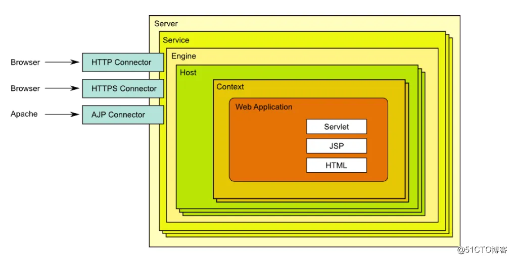
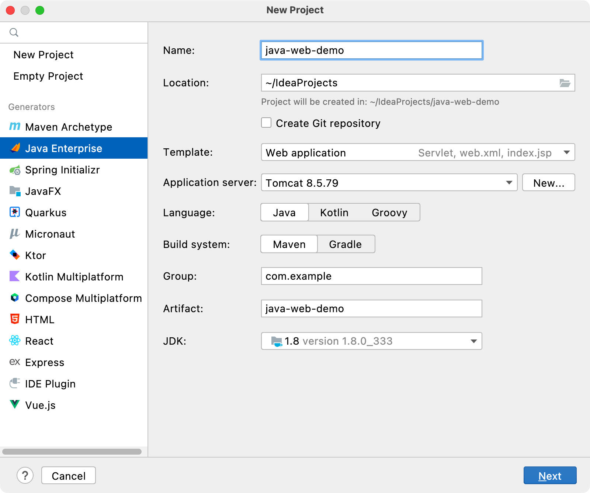
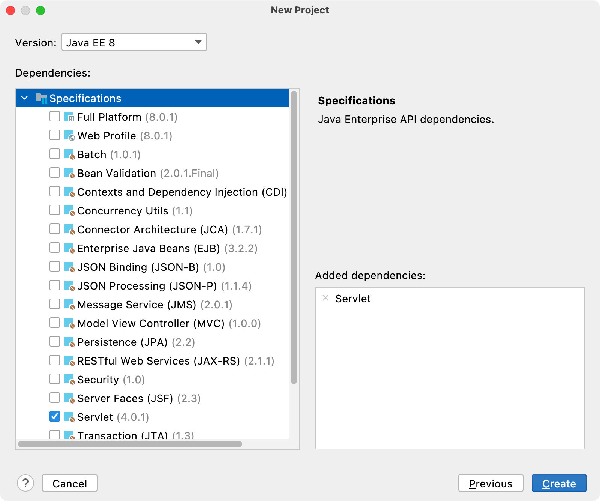
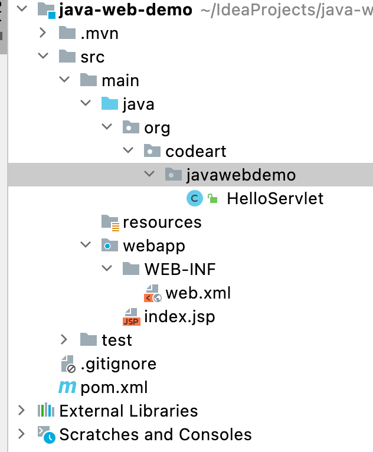
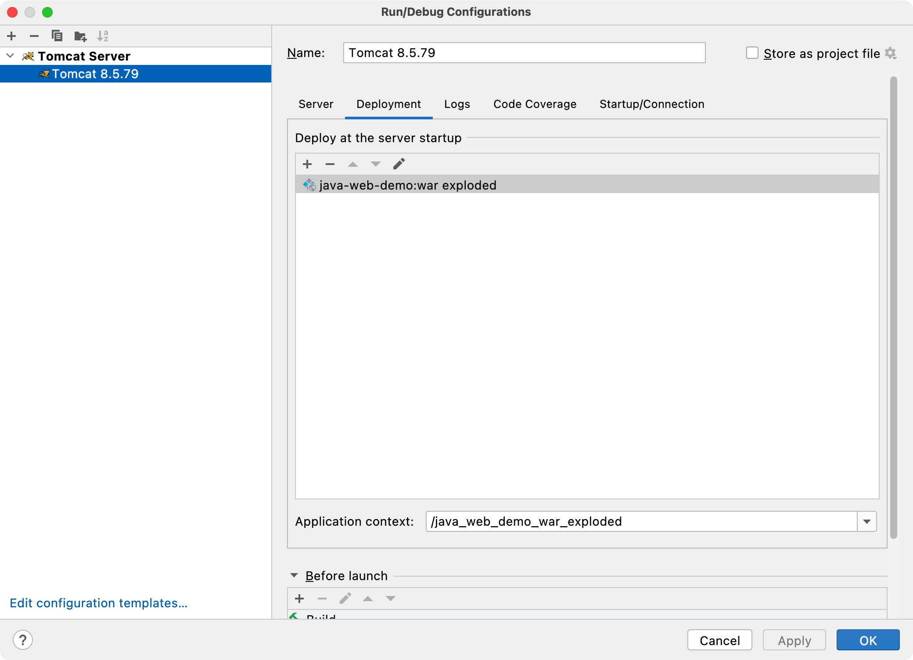
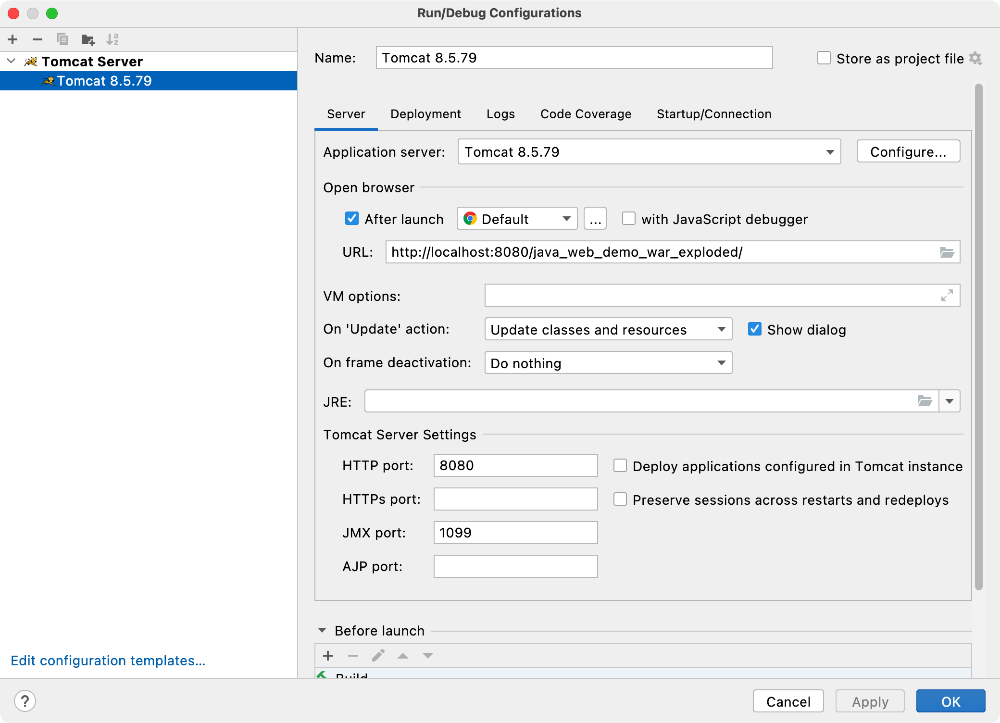
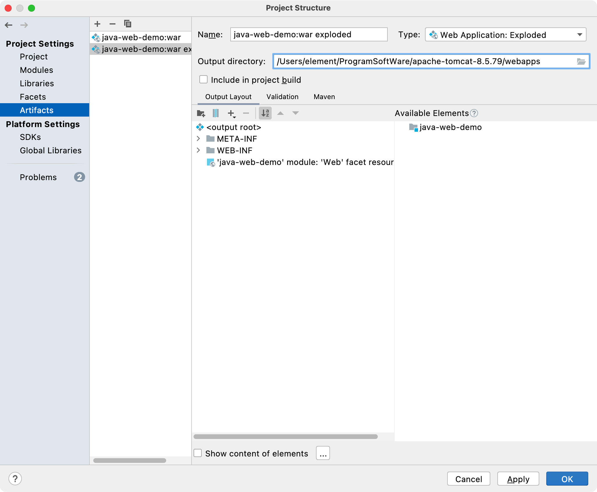

# JavaWeb(0)-Tomcat

# 一. JavaEE

## 1.1 简介

Java EE(Java Enterprise Edition)，Java企业版，是一个用于企业级 web 开发平台。最早由 Sun 公司定制并发布，后由 Oracle 负责维护。JavaEE平台规范了在开发企业级web应用中的技术标准。

在JavaEE平台共包含了 13 个技术规范(随着 Java EE 版本的变化所包含的技术点的数量会有增多)。它们分别是：

- JDBC：Java Database Connectivity，Java数据库连接
- JNDI：Java Naming and Directory Interface，Java命名和目录接口
- EJB：Enterprise Java Beans，企业Java Beans
- RMI：Remote Method Invocation，远程方法调用
- Servlet：小服务程序或服务连接器，用Java编写的服务器端程序
- JSP：Java Server Pages 是由Sun Microsystems公司主导创建的一种动态网页技术标准
- XML：Extensible Markup Language，可扩展标记语言
- JMS：Java Message Service，Java消息服务
- Java IDL：即 idltojava 编译器，Java IDL支持的是一个瞬间的 CORBA 对象
- JPA：Java Persistence API，Java持久层API
- JTA：Java Transaction API，JTA允许应用程序执行分布式事务处理
- JavaMail：Java 邮件服务
- JAF：JavaBeans Activation Framework，是一个专用的数据处理框架，它用于封装数据

## 1.2 JavaEE应用服务器

应用服务器是 Java EE 规范的具体实现, 可以执行/驱动基于 JavaEE 平台开发的 web 项目。绝大部分的应用服务器都是付费产品。

常见的应用服务：

- Weblogic(BEA Oracle 收费） 		
- Webshpere(IBM 收费） 		
- JBoss(RedHad 收费)
- Resin(Caucho 收费)
- JRun(Macromedia 收费)

## 1.3 Web容器

只实现了JavaEE平台下部分技术标准，如Servlet，Jsp，JNDI，JavaMail。Web容器是开源免费的。

常见的 Web 容器：

- Geronimo(Apache)
- Tomcat(Apache)
- Jetty(Eclipse)

# 二. Tomcat安装使用

## 2.1 下载安装

下载地址：http://tomcat.apache.org/

Tomcat 由 apache 开源组织使用 Java 开发的一款 web 容器,在使用之前需要安装 JDK 及配置 JAVA_HOME。Tomcat 是绿色软件，解压就可使用。如果之前已经安装了其他 tomcat 并且还配置了 CATALINA_HOME 不要忘记修改CATALINA_HOME 指向我们现在使用的这个 Tomcat。

**启动 Tomcat：**

进入到 Tomcat 安装目录的 bin 文件夹，输入以下命令：

```shell
# Linux/MacOS
./startup.sh
# Windows
startup.bat
```

**关闭 Tomcat：**

执行 shutdown 脚本即可：

```shell
# Linux/MacOS
./shutdown.sh
# Windows
shutdown.bat
```

Winodws 操作系统直接关闭窗口也可以。

**访问 Tomcat：**

浏览器输入：http://localhost:8080，即可访问。

## 2.2 结构介绍

- bin：bin 目录主要是用来存放 Tomcat 的命令文件，主要有两大类，一类是以 `.sh` 结尾的(Linux 命令)，另一类是以 `.bat` 结尾的(windows命令)
- conf：conf 目录主要是用来存放 Tomcat 的一些配置文件，重要的配置文件有：context.xml、server.xml、web.xml
- lib：lib 目录主要用来存放 Tomcat 运行需要加载的 jar 包
- logs：logs 目录用来存放 Tomcat 在运行过程中产生的日志文件
- temp：temp 目录用户存放 Tomcat 在运行过程中产生的临时文件
- webapps：webapps 目录用来存放应用程序，当 Tomcat 启动时会去加载 webapps 目录下的应用程序。可以以文件夹、war 包的形式发布应用
- work：work 目录用来存放 Tomcat 在运行时的编译后文件，例如 JSP 编译后的文件

## 2.3 部署项目

**方式 1：**

在 Tomcat 的 webapps 中创建一个我们自己的项目目录，比如叫 demo，然后在 demo 文件夹中新建 **index.html** 文件，随便写一点 html 代码，最后启动 Tomcat，访问本机 8080 端口即可，路径如下：

```
http://localhost:8080/demo
```

自动跳转到 index.html 页面。

**方式 2：**

 在 Tomcat 安装目录下找到 conf/Catalina/localhost 目录，在文件夹新建一个 xml 文件，名称最好和项目文件夹名称一样，在里面编写以下内容：

```xml
<Context path="/demo" docBase="/Users/Admin/demo"/>
```

path 指的是浏览器访问的根路径，docBase 指的是磁盘映射路径，也就是项目文件夹存在本机的磁盘位置。 访问项目和上面的一样。

## 2.4 常见配置

Tomcat 的配置文件由 4 个 xml 组成，分别是 context.xml、web.xml、server.xml、tomcat-users.xml。每个文件都有自己的功能与配置方法。

- context.xml：context.xml 是 Tomcat 公用的环境配置。Tomcat 服务器会定时去扫描这个文件。一旦发现文件被修改(时间戳改变了)，就会自动重新加载这个文件，而不需要重启服务器。
- web.xml：Web 应用程序描述文件，都是关于是 Web 应用程序的配置文件。所有 Web 应用的 web.xml 文件的父文件。也就是所有 Servlet Web 应用程序的**全局配置**，所以还有局部配置。
- server.xml：是 Tomcat 服务器的核心配置文件，server.xml 的每一个元素都对应了 Tomcat 中的一个组件，通过对 xml 中元素的配置，实现对 Tomcat中的各个组件和端口的配置。
- tomcat-users.xml：配置访问 Tomcat 的用户以及角色的配置文件。

**常见问题如下：**

1. 解决控制台乱码：

控制台产生乱码的原因是在 Tomcat 在输出日志中使用的是 UTF-8 编码，而我们中文的 Windows 操作系统使用的是 GBK 编码。由于编码格式不统一，所以出现了乱码。

修改 conf 目录中的 **logging.properties** 文件重新指定的编码方式。如果还是不行,那么就删除该行即可：

```properties
java.util.logging.ConsoleHandler.encoding = GBK
```

2. 修改 Tomcat 监听端口：

Tomcat 默认监听端口为 8080。可以通过修改 server.xml 文件来改变 Tomcat 的监听端口：

```xml
<Connector port="8080" protocol="HTTP/1.1" connectionTimeout="20000" redirectPort="8443"/>
```

3. 配置 Tomcat 并发数：

Tomcat 的最大并发数是可以配置的，实际运用中，最大并发数与硬件性能和 CPU 数量都有很大关系的。更好的硬件，更多的处理器都会使 Tomcat 支持更多的并发。

这个并发能力还与应用的逻辑密切相关，如果逻辑很复杂需要大量的计算，那并发能力势必会下降。如果每个请求都含有很多的数据库操作，那么对于数据库的性能也是非常高的。

对于单台数据库服务器来说，允许客户端的连接数量是有限制的。并发能力问题涉及整个系统架构和业务逻辑、系统环境不同、Tomcat 版本不同、JDK 版本不同、以及修改的设定参数不同。并发量的差异还是满大的。并发数设置参数有如下几个：

- maxThreads：最大并发数
- minSpareThreads：初始化时创建的线程数，一旦创建的线程超过这个值，Tomcat 就会关闭不再需要的 Socket 线程
- acceptCount：指定当所有可以使用的处理请求的线程数都被使用时，可以放到处理队列中的请求数，超过这个数的请求将不予处理

```xml
<Connector port="8080" protocol="HTTP/1.1" 
           minSpareThreads="100"  maxSpareThreads="500"   
           maxThreads="1000" acceptCount="700" 
           connectionTimeout="20000" redirectPort="8443"/>
```

4. 配置 Tomcat Manager：

Tomcat Manager 是 Tomcat 自带的、用于对 Tomcat 自身以及部署在 Tomcat 上的应用进行管理的 web 应用。默认情况下，Tomcat Manager 是处于禁用状态的。准确的说，Tomcat Manager 需要以用户角色进行登录并授权才能使用相应的功能，不过 Tomcat 并没有配置任何默认的用户，因此我们需要先进行用户配置后才能使用 Tomcat Manager。

Tomcat Manager 中没有默认用户，我们需要在 tomcat-users.xml 文件配置。Tomcat Manager 的用户配置需要配置两个部分：角色配置、用户名及密码配置。

Tomcat Manager 中的角色分类：

- manager-gui：允许访问 HTML GUI 和状态页面(即 URL 路径为 /manager/html/*)
- manager-script：允许访问文本界面和状态页面(即 URL 路径为 /manager/text/*)
- manager-jmx：允许访问 JMX 代理和状态页面(即 URL 路径为 /manager/jmxproxy/*)
- manager- status：仅允许访问状态页面(即 URL 路径为 /manager/status/*)

配置用户及角色：

```xml
<role rolename="manager-gui"/>
<role rolename="manager-script"/>
<role rolename="manager-jmx"/>
<role rolename="manager-status"/>
<role rolename="admin-gui"/>
<role rolename="admin-script"/>
<user username="tomcat" password="tomcat"
      roles="manager-gui,manager-script,manager-jmx,
             manager-status,admin-gui,admin-script"/>
```

## 2.5 主要组件



1. Server 组件：

启动一个 server 实例(即一个 JVM)，它监听在 8005 端口以接收 shutdown 命令。Server 的定义不能使用同一个端口，这意味着如果在同一个物理机上启动了多个 Server 实例，必须配置它们使用不同的端口。

```xml
<Server port="8005" shutdown="SHUTDOWN">
```

port：接收 shutdown 指令的端口，默认为8005

shutdown：发往此 Server 用于实现关闭 Tomcat 实例的命令字符串，默认为 SHUTDOWN

2. Service 组件：

Service 主要用于关联一个引擎和与此引擎相关的连接器，每个连接器通过一个特定的端口和协议接收请求并将其转发至关联的引擎进行处理。困此，Service 要包含一个引擎、一个或多个连接器。

```xml
<Service name="Catalina">
```

name：此服务的名称，默认为 Catalina

3. Connector 组件：

支持处理不同请求的组件，一个引擎可以有一个或多个连接器，以适应多种请求方式。默认只开启了处理 Http 协议的连接器。如果需要使用其他协议，需要在 Tomcat 中配置该协议的连接器。

在 Tomcat 中连接器类型通常有 4 种：

1. HTTP 连接器
2. SSL 连接器
3. AJP 1.3 连接器
4. Proxy 连接器

```xml
<Connector port="8888" protocol="HTTP/1.1" connectionTimeout="20000" 
           redirectPort="8443"/>
```

port：监听的端口。

protocol：连接器使用的协议，默认为 HTTP/1.1。

connectionTimeout：等待客户端发送请求的超时时间，单位为毫秒。

redirectPort：如果某连接器支持的协议是 HTTP，当接收客户端发来的 HTTPS 请求时，则转发至此属性定义的端口。

maxThreads：支持的最大并发连接数，默认为 200 个。

4. Engine 组件：

Engine 是 Servlet 处理器的一个实例，即 servlet 引擎，定义在 server.xml 中的 Service 标记中。Engine 需要defaultHost 属性来为其定义一个接收所有发往非明确定义虚拟主机的请求的 host 组件。

```xml
<Engine name="Catalina" defaultHost="localhost">
```

name：Engine 组件的名称。

defaultHost：Tomcat 支持基于 FQDN(Fully Qualified Domain Name 全限定域名)的虚拟主机，这些虚拟主机可以通过在 Engine 容器中定义多个不同的 Host 组件来实现；但如果此引擎的连接器收到一个发往非非明确定义虚拟主机的请求时则需要将此请求发往一个默认的虚拟主机进行处理，因此，在 Engine 中定义的多个虚拟主机的主机名称中至少要有一个跟 defaultHost 定义的主机名称同名。

5. Host 组件：

位于 Engine 容器中用于接收请求并进行相应处理的虚拟主机。通过该容器可以运行 Servlet 或者 JSP 来处理请求。

```xml
<Host name="localhost" appBase="webapps" unpackWARs="true" autoDeploy="true">
```

name：虚拟主机的名称，Tomcat 通过在请求 URL 中的域名与 name 中的值匹配，用于查找能够处理该请求的虚拟主机。如果未找到则交给在 Engine 中 defaultHost 指定的主机处理。

appBase：此 Host 的 webapps 目录，即指定存放web应用程序的目录的路径。

autoDeploy：在 Tomcat 处于运行状态时放置于 appBase 目录中的应用程序文件是否自动进行 deploy，默认为true。

unpackWARs：在启用此 webapps 时是否对 WAR 格式的归档文件先进行展开，默认为 true。

6. Context 组件：

Context 是 Host 的子标签，代表指定一个 Web 应用，它运行在某个指定的虚拟主机(Host)上，每个 Web 应用都是一个 WAR 文件，或文件的目录。

```xml
<Context path="/test" docBase="/Users/Admin/test" />
```

path：context path 既浏览器访问项目的访问路径。 		

docBase：相应的 Web 应用程序的存放位置，也可以使用相对路径，起始路径为此 Context 所属 Host 中appBase 定义的路径。

## 2.6 请求处理流程

**Tomcat处理请求流程：**

1. 用户访问 localhost:8080/test/index.jsp，请求被发送到 Tomcat，被监听 8080 端口并处理 HTTP/1.1 协议的Connector 获得。  		

2. Connector 把该请求交给它所在的 Service 的 Engine 来处理，并等待 Engine 的回应。  		

3. Engine 获得请求 localhost/test/index.jsp，匹配所有的虚拟主机 Host。  		

4. Engine 匹配到名为 localhost 的 Host 虚拟主机来处理 /test/index.jsp 请求(即使匹配不到会请求交给默认Host处理)，Host 会根据 /test 匹配它所拥有的所有的 Context。  		

5. 匹配到的 Context 获得请求 /index.jsp。  		

6. 构造 HttpServletRequest 对象和 HttpServletResponse 对象，作为参数调用 JspServlet 的 *doGet* 或 *doPost*，执行业务逻辑、数据存储等程序。 		

7. Context 把执行完之后的结果通过 HttpServletResponse 对象返回给 Host。  		

8. Host 把 HttpServletResponse 返回给 Engine。  		

9. Engine 把 HttpServletResponse 对象返回 Connector。  		

10. Connector 把 HttpServletResponse 对象返回给客户Browser。

# 三. JavaWeb项目开发和部署

## 3.1 JavaWeb目录结构

工程目录结构如下：

```
--静态资源文件/jsp
--WEB-INF 受保护的资源目录
  -lib jar包目录
  -classes java字节码目录
  -web.xml项目的配置文件
  -其他资源
```

## 3.2 使用idea开发JavaWeb项目

1. 打开 idea 选择 New Project，选择 Java Enterprise：



名称为项目名，Template 选择 Webp application，包管理器选择 Maven(不使用 Maven，那就需要手动引入 jar 包，并导入项目的依赖库)，即可进行下一步：



版本选择 Java EE 8，依赖选择 Servlet 即可。

生成的目录如下：



## 3.3 使用idea运行JavaWeb项目

**方式 1：**


点击 idea 右上角的绿色箭头即可运行，最后访问 8080 端口即可。


当有代码发生了变更，可以点击这个按钮立即重新部署，而不需要重启服务器。

点击下拉列表可以对 Tomcat 做一些配置：



Deployment 板块可以设置要部署哪些项目模块，点击加号可以添加，idea 会给项目自动添加 **war_exploded** 后缀，而且 idea 会把项目放在 Tomcat 的副本里面运行，这样和下载的 Tomcat 独立运行。



Server 板块可以设置监听端口号，还有打开默认浏览器。url 也是可以重新设置的，还有热更新设置。

在 Server 选项中, 		

勾选 Open browse r中的 After launch 选项,这样 idea 在启动项目之后可以自动帮助我们打开浏览器并访问 URL中的资源。

On Update action：当代码改变的时候，需要 idea 为你做什么，选项选为 Update classes and resources ,意义为：更新字节码和其他资源。

On Frame deactivation：当失去焦点(比如你最小化了IDEA窗口)，需要 idea 为你做什么。选项选为 Update resources，意义为：更新其他资源。

HTTP port 默认为 8080 不用修改。

JMX  port 默认为 1099 不用修改。

在 idea 中默认的并不会把 web 项目真正的部署到 Tomcat 的 webapps 目录中，而是通过为每个 web 项目创建一个独立的 Tomcat 副本并在 Tomcat 副本中通过的 Tomcat 的 Context 组件完成项目的目录指定，在 Context 组件的 **docBase** 属性中会指定 idea 对 web 项目编译后的目录 out/artifacts/\*。

**方式 2：**

点击项目结构选项指定输出artifacts的目录为 Tomcat 的 webapps 中的 demo 目录。



在 Tomcat 的 webapps 中创建一个名称对应的目录。启动 Tomcat，查看 demo 目录中的内容。这种方式极少使用，掌握第一种即可。
