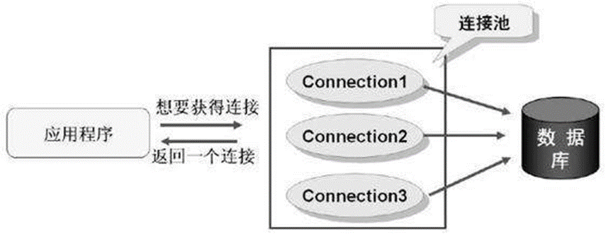

# JavaWeb-JDBC

# 一. JDBC概述

## 1.1 什么是JDBC

JDBC（Java DataBase Connectivity,  Java数据库连接） ,是一种用于执行SQL语句的Java API，为多种关系数据库提供统一访问,它由一组用Java语言编写的类和接口组成。

有了JDBC，程序员只需用JDBC API写一个程序，就可访问所有数据库。

Sun 公司、数据库厂商、程序员三方关系：

SUN 公司是规范制定者，制定了规范 JDBC（连接数据库规范） 		

**DriverManager** 类  作用：管理各种不同的JDBC驱动  		

**Connection** 接口   		

**Statement** 接口和 **PreparedStatement** 接口    		

**ResultSet** 接口  		

数据库厂商微软、甲骨文等分别提供实现JDBC接口的驱动 jar 包  		

程序员学习 JDBC 规范来应用这些 jar 包里的类。 

JDBC访问数据库编码步骤 		

1. 加载一个Driver驱动 		
2. 创建数据库连接（Connection） 		
3. 创建SQL命令发送器Statement 		
4. 通过Statement发送SQL命令并得到结果 		
5. 处理结果（select语句） 		
6. 关闭数据库资源ResultSet  Statement Connection 		

**创建模块/项目 导入jar包：**

### JDBD历史版本及特征

**JDBC 1.0：**

JDBC 1.0 随 JDK1.1 一起发布,JDBC操作相关的接口和类位于 java.sql 包中。 		

**JDBC 2.0：**

JDBC 2.0 API 被划分为两部分：核心 API 和扩展 API,有两个包,分别是 java.sql 包和 javax.sql 包。 		

**java.sql核心API包：**

在支持新功能方面：包括结果集可以向后滚动，批量的更新数据。另外，还提供了UNICODE字符集的字符流操作。 		

在支持SQL的数据类型方面：新增加的BLOB, CLOB,和数组接口能够是应用程序操作大块的数据类型 		

**javax.sql扩展API包：**

**DataSource 数据源接口：** 		

JDBC1.0是原来是用 DriverManager 类来产生一个对数据源的连接。JDBC2.0 用一种替代的方法，使用 DataSource 的实现，代码变的更小巧精致，也更容易控制。 

**Connection pooling：** 		

如果DataSource对象实现与一个支持连接池的中间层的服务器一起工作，DataSource对象就会自动的返回连接池中的连接，这个连接也是可以重复利用的。 

**Distrubute transaction：** 		

在一个事务中涉及到了多个数据库服务器。获得一个用来支持分布式事务的连接与获得连接池中的连接是很相似的。同样，不同之处在于 DataSource 的实现上的不同，而不是在应用程序中获得连接的方式上有什么不同。 		

**Rowsets：** 		

RowSet 接口扩展了 ResultSet 接口。这样 RowSet 对象就有了 ResultSet 对象所有的功能。不可以滚动的 ResultSet 变成了可以滚动的 RowSet。 		

## 1.2 快速上手

1. 创建项目并导入依赖

```xml
<dependency>
    <groupId>mysql</groupId>
    <artifactId>mysql-connector-java</artifactId>
    <version>8.0.25</version>
</dependency>
```

2. 示例代码

```java
public class JdbcDriverDemo {

    public static void main(String[] args) throws SQLException {
        // 创建驱动类，然后注册驱动类
        Driver driver = new com.mysql.cj.jdbc.Driver();
        DriverManager.registerDriver(driver);
        // 数据库协议和地址url
        /**
         * 协议：	jdbc:mysql
         * IP：	127.0.0.1/localhost
         * 端口号：	3306
         * 数据库名称：	test
         * 参数：...
         */
        String url = "jdbc:mysql://127.0.0.1:3306/test?useSSL=false&useUnicode=true&characterEncoding=utf-8&serverTimeZone=Asia/ShangHai";
        String user = "root";  // 用户名
        String password = "root1234";  // 密码
        // 获取连接对象
        Connection connection = DriverManager.getConnection(url, user, password);
        // 获取执行对象
        Statement statement = connection.createStatement();
        String sql = "insert into `tb_student` values(default, '高斯', 90)";
        // 执行SQL语句
        int rows = statement.executeUpdate(sql);
        // 输出影响的行数
        System.out.println("Affected Rows: " + rows);
        // 释放资源，注意顺序，先获得的后关闭
        statement.close();
        connection.close();
    }
}
```

## 1.3 常见异常

1. **Exception in thread "main" java.lang.ClassNotFoundException: com.mysql.jdbc2.Driver：**

原因：没有添加jar包或者com.mysql.jdbc2.Driver路径错误

2. **Exception in thread "main" java.sql.SQLException:** 		

   **No suitable driver found for jbdc:mysql://127.0.0.1:3306/test**

原因：url错误

3. **Exception in thread "main" java.sql.SQLException:** 		

   **Access denied for user 'root'@'localhost' (using password: YES)**

原因：用户名或者密码错误

4. **Exception in thread "main" com.mysql.jdbc.exceptions** 		

   **.jdbc4.MySQLIntegrityConstraintViolationException:Duplicate entry '90' for key 'PRIMARY'**

原因：主键冲突

5. **Public Key Retrieval is not allowed**

如果用户使用 sha256_password 认证，密码在传输过程中必须使用 TLS 协议保护，但是如果 RSA  公钥不可用，可以使用服务器提供的公钥；可以在连接中通过 ServerRSAPublicKeyFile 指定服务器的 RSA  公钥，或者 `AllowPublicKeyRetrieval=True`参数以允许客户端从服务器获取公钥；但是需要注意的是  `AllowPublicKeyRetrieval=True`可能会导致恶意的代理通过中间人攻击(MITM)获取到明文密码，所以默认是关闭的，必须显式开启。

在jdbc连接添加上参数 `allowPublicKeyRetrieval=true` 即可，注意参数间用 `&`。

## 1.4 驱动的加载

加载数据库驱动时,我们可以通过自己创建一个实例的方式,然后去注册驱动：

```java
package com.mysql.cj.jdbc;

import java.sql.DriverManager;
import java.sql.SQLException;

public class Driver extends NonRegisteringDriver implements java.sql.Driver {
    public Driver() throws SQLException {
    }

    static {
        try {
            DriverManager.registerDriver(new Driver());
        } catch (SQLException var1) {
            throw new RuntimeException("Can't register driver!");
        }
    }
}
```

在查看 Driver 的源代码时我们发现,该类内部有一个静态代码块,在代码块中就是在实例化一个驱动并在驱动中心注册.静态代码块会在类进入内存时执行,也就是说,我们只要让该类字节码进入内存,就会自动完成注册,不需要我们手动去 new。

所以我们在代码中直接使用反射,通过 `Class.forName("com.mysql.jdbc.Driver")`,加载该类进入内存即可。我们继续查看 jar 包发现,jar 包中已经默认配置了驱动类的加载。

jar--META-INF--services--java.sql.Driver--com.mysql.jdbc.Driver,在加载jar包时,会自动读取该内容并加载驱动,所以我们不去编写 `Class.forName("com.mysql.jdbc.Driver")`，程序也是可以自动完成加载驱动的。

**这就是 Java 的 SPI 机制。**

## 1.5 封装工具类

需要简单的连接时，我们可以封装一个 JDBC 工具类简化连接过程，而且使用了 properties 配置文件优化：

```java
public class JdbcUtil {

    private static final String driver;
    private static final String url;
    private static final String user;
    private static final String password;

    static {
        try {
            Properties properties = new Properties();
            InputStream is = PropertiesDemo.class.getResourceAsStream("/jdbc.properties");
            try {
                properties.load(is);
            } catch (IOException e) {
                e.printStackTrace();
            }
            driver = properties.getProperty("driver");
            url = properties.getProperty("url");
            user = properties.getProperty("user");
            password = properties.getProperty("password");
            Class.forName(driver);
        } catch (ClassNotFoundException e) {
            throw new RuntimeException(e);
        }
    }

    public static Connection getConnection() {
        try {
            return DriverManager.getConnection(url, user, password);
        } catch (SQLException e) {
            e.printStackTrace();
            return null;
        }
    }
}
```


# 二. JDBC完成CRUD

## 2.1 增删改学生信息

```java
public class JdbcDemo {
    
    private static final String driver = "com.mysql.cj.jdbc.Driver";
    private static final String url = "jdbc:mysql://127.0.0.1:3306/test?useSSL=false&useUnicode=true&characterEncoding=utf-8&serverTimeZone=Asia/ShangHai";
    private static final String user = "root";
    private static final String password = "root1234";
    
    public static void operate() {
        Connection connection = null;
        Statement statement = null;

        try {
            Class.forName(driver);
            connection = DriverManager.getConnection(url, user, password);
            statement = connection.createStatement();
            // 删除修改只需要修改sql语句即可，都是调用executeUpdate方法
            String sql = "insert into `tb_student` values(default, '高斯', 90)";
            int rows = statement.executeUpdate(sql);
			 System.out.println("Affected Rows: " + rows);
        } catch (ClassNotFoundException | SQLException e) {
            throw new RuntimeException(e);
        } finally {
            if (statement != null) {
                try {
                    statement.close();
                } catch (SQLException e) {
                    e.printStackTrace();
                }
            }
            if (connection != null) {
                try {
                    connection.close();
                } catch (SQLException e) {
                    e.printStackTrace();
                }
            }
        }
    }

    public static void main(String[] args) {
        List<Student> list = Operate();
        list.forEach(System.out::println);
    }
}
```

## 2.2 查询全部学生信息

1. 封装实体类

```java
// 一个实体类对应一个数据库表，属性名称尽量统一
public class Student {
    
    private Integer id;
    
    private String name;
    
    private Integer age;
    
    // constructors getters setters toString()... 
}
```

2. 查询

```java
public static List<Student> query() {
    Connection connection = null;
    Statement statement = null;
    ResultSet rs = null;
    List<Student> list = new ArrayList<>();

    try {
        Class.forName(driver);
        connection = DriverManager.getConnection(url, user, password);
        statement = connection.createStatement();
        String sql = "select * from `tb_student`";
        rs = statement.executeQuery(sql);
        while (rs.next()) {
            Student student = new Student();
            student.setId(rs.getInt("id"));
            student.setName(rs.getString("name"));
            student.setAge(rs.getInt("age"));
            list.add(student);
        }
    } catch (ClassNotFoundException | SQLException e) {
        throw new RuntimeException(e);
    } finally {
        if (statement != null) {
            try {
                statement.close();
            } catch (SQLException e) {
                e.printStackTrace();
            }
        }
        if (connection != null) {
            try {
                connection.close();
            } catch (SQLException e) {
                e.printStackTrace();
            }
        }
        if (rs != null) {
            try {
                rs.close();
            } catch (SQLException e) {
                e.printStackTrace();
            }
        }
    }
    return list;
}
```

- ResultSet 里的数据一行一行排列，每行有多个字段，且有一个记录指针，指针所指的数据行叫做当前数据行，我们只能来操作当前的数据行。我们如果想要取得某一条记录，就要使用 ResultSet 的 `next()` 方法 ,如果我们想要得到 ResultSet 里的所有记录，就应该使用 while 循环。
- ResultSet 对象自动维护指向当前数据行的游标。每调用一次 `next()` 方法，游标向下移动一行。
- 初始状态下记录指针指向第一条记录的前面，通过 `next()` 方法指向第一条记录。循环完毕后指向最后一条记录的后面。

| 方法名                            | 说明                                    |
| --------------------------------- | --------------------------------------- |
| boolean next()                    | 将光标从当前位置向下移动一行            |
| boolean  previous()               | 游标从当前位置向上移动一行              |
| void  close()                     | 关闭ResultSet 对象                      |
| int  getInt(int colIndex)         | 以int形式获取结果集当前行指定列号值     |
| int  getInt(String colLabel)      | 以int形式获取结果集当前行指定列名值     |
| float  getFloat(int colIndex)     | 以float形式获取结果集当前行指定列号值   |
| float  getFloat(String colLabel)  | 以float形式获取结果集当前行指定列名值   |
| String  getString(int colIndex)   | 以String 形式获取结果集当前行指定列号值 |
| StringgetString(String  colLabel) | 以String形式获取结果集当前行指定列名值  |

作为一种好的编程风格，应在不需要Statement对象和Connection对象时显式地关闭它们。关闭Statement对象和Connection对象的语法形式为：用户不必关闭ResultSet。当它的 Statement 关闭、重新执行或用于从多结果序列中获取下一个结果时，该ResultSet将被自动关闭。

## 2.3 实体类编写风格

**为什么将结果封装成对象或者对象集合?**

1. java 是面向对象的编程语言,java 中所有的数据处理都是基于面向对象的编码风格实现的,让数据以符合 java 风格的形式存在,便于对数据的后续处理 

2. ResultSet 集合虽然可以存放数据,但是它是 JDBC 中查询数据的一种手段,是一种数据的临时存储方案,使用完毕是要进行释放和关闭

**如何将结果集中的数据在java中进行存储和传递?**

准备和数据库表格相对应的一个实体类,用于封装结果集中的每一条数据,数据库表格中的每一个字段就是实体类的一个属性,实体类的一个对象就可以用于存储数据库表中的一条记录。

实体类编写指南：和数据库表格名称和字段是一一对应的类，该类的对象主要用处是存储从数据库中查询出来的数据，除此之外,该类没有任何的其他功能。

要求：

1. 类名和表名保持一致  (见名知意)

2. 属性个数和数据库的表的列数保持一致
3. 属性的数据类型和列的数据类型保持一致
4. 属性名和数据库表格的列名要保持一致
5. 所有的属性必须都是私有的 (出于安全考虑)
6. 实体类的属性推荐写成包装类
7. 日期类型推荐写成 java.util.Date
8. 所有的属性都要有 get 和 set 方法
9. 必须具备空参构造方法
10. 实体类应当实现序列化接口 (mybatis缓存  分布式需要 )
11. 实体类中其他构造方法可选

## 2.4 SQL注入攻击

SQL注入攻击指的是通过构建特殊的输入作为参数传入Web应用程序，而这些输入大都是SQL语法里的一些组合，通过执行SQL语句进而执行攻击者所要的操作，其主要原因是程序没有细致地过滤用户输入的数据，致使非法数据侵入系统。 		

以模拟登录为例:在前台输入用户名和密码，后台判断信息是否正确，并给出前台反馈信息，前台输出反馈信息。

比方说，黑客在密码输入框里面输入了以下密码：

```sql
123456 or 1 = 1
```

在最后的 sql 语句拼接可能就是：

```sql
select
	*
from
	`tb_user`
where
	username = '洛必达'
and
	password = 123456
or
	1 = 1
```

那么这样，sql 语句百分之百可以运行，因为 1 = 1 是恒等的，这样就有被黑客攻击的风险。当输入了精心设计的用户名密码后，即使是错误的，也能登录成功。让登录功能形同虚设。这是为什么呢，这就是SQL注入风险，原因在于SQL语句是字符串拼接的。SQL语句中拼接的内容破坏了SQL语句原有的判断逻辑 		

如何解决呢?使用 PreparedStatement 预编译语句对象就可以解决掉。

# 三. 预编译语句对象

## 3.1 使用预编译对象防止注入攻击

```java
public static void main(String[] args) {
    Connection connection = null;
    PreparedStatement preparedStatement = null;
    ResultSet rs = null;
    try {
        Class.forName(driver);
        connection = DriverManager.getConnection(url, user, password);
        tring sql="select * from account where username = ? and password = ?";
        preparedStatement = connection.prepareStatement(sql);
        // 通过set方法设置参数，从1开始计数
        preparedStatement.setString(1, username);
        preparedStatement.setString(2, pwd);
        rs = preparedStatement.executeQuery();
        while (rs.next()) {
            // do something...
        }
    } catch (Exception e) {
        e.printStackTrace();
    } finally {
        // ... close
    }
}
```

prepareStatment 对象在 *set* 方法上,会对单引号进行转译处理,也就是说, `?` 中的数据的单引号  `'` 会被转义成  **\\'** 这样就单引号就不会破坏 sql 语句的结构,

```
SELECT * FROM users WHERE username =  ? AND password = ?
preparedStatement.setString(1, "xiaoming");
preparedStatement.setString(2, 'anything' OR 'x' = 'x');
-- 会被转义为
SELECT * FROM users 
WHERE username = 'xiaoming' 
AND password = \'anything\' OR \'x\' = \'x\''
```

说白了就是把值当中的所有单引号给转义了!这就达到了防止 sql 注入的目的，说白了 mysql 驱动的 PreparedStatement 实现类的 setString();方法内部做了单引号的转义，而 Statement 不能防止 sql 注入，就是因为它没有把单引号做转义，而是简单粗暴的直接拼接字符串，所以达不到防止 sql 注入的目的。

## 3.2 预编译原理

当客户端发送一条 sql 语句给 DBMS 时,MySQL 的执行流程如下图：


**sql 命令执行流程：**

1. 客户端向服务器端发送 SQL 命令 		
2. 服务器端连接模块连接并验证 		
3. 缓存模块解析 SQL 为 Hash 并与缓存中 Hash 表对应。如果有结果直接返回结果，如果没有对应继续向下执行 		
4. 解析器解析 SQL 为解析树，如果出现错误，报 SQL 解析错误。如果正确，向下传递 		
5. 预处理器对解析树继续处理，处理成新的解析树。 		
6. 优化器根据开销自动选择最优执行计划，生成执行计划 		
7. 执行器执行执行计划，访问存储引擎接口 		
8. 存储引擎访问物理文件并返回结果 		
9. 如果开启缓存，缓存管理器把结果放入到查询缓存中。 		
10. 返回结果给客户端

当客户发送一条 SQL 语句给 DBMS 后，DBMS 总是需要校验 SQL 语句的语法格式是否正确，然后把 SQL 语句编译成可执行的函数，最后才是执行 SQL 语句。其中校验语法，和编译所花的时间可能比执行 SQL 语句花的时间还要多。 		

预编译语句 PreparedStatement 是 java.sql 中的一个接口，它是 Statement 的子接口。通过 Statement 对象执行 SQL 语句时，需要将 SQL 语句发送给 DBMS，由DBMS 首先进行编译后再执行。预编译语句和 Statement 不同，在创建PreparedStatement 对象时就指定了 SQL 语句，该语句立即发送给 DBMS 进行编译。当该编译语句被执行时，DBMS 直接运行编译后的 SQL 语句，而不需要像其他 SQL语句那样首先将其编译。预编译的 SQL 语句处理性能**稍微**高于普通的传递变量的办法。 		

例如:我们需要执行多次 insert 语句，但只是每次插入的值不同，MySQL 服务器也是需要每次都去校验 SQL 语句的语法格式，以及编译，这就浪费了太多的时间。如果使用预编译功能，那么只对SQL语句进行一次语法校验和编译，所以效率要高。

## 3.3 开启预编译

我们可以通过设置 URL 中的参数来控制预编译是否开启 		

**useServerPrepStmts** 是否开启预编译 		

**cachePrepStmts** 是否启用预编译缓存

```java
String url = "jdbc:mysql://localhost:3306/mydb?useServerPrepStmts=true&cachePrepStmts=true";
```

**值得注意的是,我们的Connector/J 5.0.5及之后** useServerPrepStmts 默认 false,就是默认没有开启预编译,之前默认为 true, cachePrepStmts  一直默认为 false,需要我们手动设置才可以启用预编译,在开启预编译的同时要同时开启预编译缓存才能带来些许的性能提升。

**Statement 和 PreparedStatment 的关系和区别：**

PreparedStatment 安全性高,可以避免 SQL 注入。

PreparedStatment 简单不繁琐,不用进行字符串拼接。

PreparedStatment 性能高，用在执行多个相同数据库 DML 操作时,可以减少 sql语句的编译次数。

# 四. 批处理

## 4.1 什么是批处理

当我们有多条 sql 语句需要发送到数据库执行的时候，有两种发送方式，一种是执行一条发送一条 sql 语句给数据库,另一个种是发送一个 sql 集合给数据库，也就是发送一个批 sql 到数据库。普通的执行过程是：每处理一条数据，就访问一次数据库；而批处理是：累积到一定数量，再一次性提交到数据库，减少了与数据库的交互次数，所以效率会大大提高,很显然两者的数据库执行效率是不同的，我们发送批处理 sql 的时候数据库执行效率要高。

## 4.2 Statement对象存在的问题

Statement 对象采用硬编码效率低，安全性较差。假如采用硬编码，每次执行相似 sql 都会进行编译。

## 4.3 PreparedStatement对象批处理

语句只编译一次，减少编译次数。提高了安全性(阻止了SQL注入)，相似SQL只编译一次，减少编译次数。

注意: 需要设置批处理开启 `&rewriteBatchedStatements=true`。

```java
public class BatchOperationDemo {
	// driver url user password...
    
    public static Connection connection;
    public static PreparedStatement statement = null;
    
    static {
        try {
            Class.forName(driver);
            connection = DriverManager.getConnection(url, user, password);
        } catch (ClassNotFoundException | SQLException e) {
            throw new RuntimeException(e);
        }
    }
    
    public static int operate() {
        String sql = "insert into `tb_student` values(default, ?, ?)";
        try {
            statement = connection.prepareStatement(sql);
            for (int i = 0; i < 1000; i++) {
                statement.setString(1, "name");
                statement.setInt(2, 20);
                statement.addBatch();
            }
            int[] affected = statement.executeBatch();
            return Arrays.stream(affected).reduce(0, Integer::sum);  // 1000
        } catch (SQLException e) {
            throw new RuntimeException(e);
        }
    }
}
```

# 五. 事务及回滚点

## 5.1 JDBC事务

**事务回顾：**

事务概念:在逻辑上一组不可分割的操作,由多个sql语句组成,多个sql语句要么全都执行成功,要么都不执行. **原子性、一致性、隔离性、持久性**。JDBC控制事物主要就是在学习如何让多个数据库操作成为一个整体,实现要么全都执行成功,要么全都不执行。

在 JDBC 中，事务操作是自动提交。一条对数据库的 DML(insert、update、delete)代表一项事务操作,操作成功后，系统将自动调用 `commit()` 提交，否则自动调用 `rollback()` 回滚,在 JDBC 中，事务操作方法都位于接口java.sql.Connection 中,可以通过调用 `setAutoCommit(false)` 来禁止自动提交。之后就可以把多个数据库操作的表达式作为一个事务，在操作完成后调用 `commit()` 来进行整体提交，倘若其中一个表达式操作失败，都不会执行到 `commit()`，并且将产生响应的异常；此时就可以在异常捕获时调用 `rollback()` 进行回滚,回复至数据初始状态.事务开始的边界则不是那么明显了，它会开始于组成当前事务的所有 statement 中的第一个被执行的时候。事务结束的边界是 commit 或者 rollback 方法的调用

## 5.2 使用事务保证数据一致性

```java
public class TransferFundsDemo {
	// driver url user password...
    // connection preparedStatement...
    /**
     * JDBC默认提交事务
     */
    public static void transfer(int from, int to, double amount) {
        String sql = "update `tb_account` set balance = balance + ? where id = ?";
        try {
            statement = connection.prepareStatement(sql);
            statement.setDouble(1, -amount);
            statement.setInt(2, from);
            statement.executeUpdate();
            statement.setDouble(1, amount);
            statement.setInt(2, to);
            statement.executeUpdate();
            int i = 1 / 0;
            // 注意这里最好使用最大的异常类Exception，捕捉所有异常，否则可能事务失效
        } catch (Exception e) {  
            if (connection != null) {
                try {
                    // 事务回滚
                    connection.rollback();
                } catch (SQLException ex) {
                    ex.printStackTrace();
                }
            }
            e.printStackTrace();
        } finally {
            if (connection != null) {
                try {
                    // 最后手动提交事务
                    connection.commit();
                } catch (SQLException e) {
                    e.printStackTrace();
                }
            }
        }
    }   
}
```

## 5.3 设置回滚点

使用一个集合，推荐使用 LinkedList 来存储回滚点 SavePoint 对象，最终遇到异常调用 `rollback(Savepoint)` 方法回滚到指定的检查点。

```java
public class BatchOperationDemo {
	// connect to db...
    
    public static boolean operate() {
        LinkedList<Savepoint> savepoints = new LinkedList<>();
        String sql = "insert into `tb_student` values(default, ?, ?)";
        try {
            statement = connection.prepareStatement(sql);
            for (int i = 0; i < 2000; i++) {
                statement.setString(1, "name");
                statement.setInt(2, 20);
                statement.addBatch();
                if (i % 500 == 0) {
                    preparedStatement.executeBatch();  // 500条数据执行一次批处理
                    preparedStatement.clearBatch();  // 清除批处理中的数据
                    // 设置回滚点
                    Savepoint savepoint = connection.setSavepoint();
                    savepoints.add(savepoint);
                }
                if (i == 1000) {  // 制造一个异常
                    int x = 1 / 0;
                }
            }
            return true;
        } catch (SQLException e) {
            if (connection != null) {
               	try {
                    Savepoint p = savepoints.get(2);
                    if (p != null) {
                        connection.rollback(p);  // 回滚
                    }
                }
            }
            e.printSatckTrace();
            return false;
        } finally {
            if (connection != null) {
                try {
                    connection.commit();// 提交
                } catch (SQLException e) {
                    e.printStackTrace();
                }
            }
            if (preparedStatement != null) {
                try {
                    preparedStatement.close();
                } catch (SQLException e) {
                    e.printStackTrace();
                }
            }
            if (connection != null) {
                try {
                    connection.close();
                } catch (SQLException e) {
                    e.printStackTrace();
                }
            }
        }
    }
}
```

# 六. DAO模式

## 6.1 DAO定义

DAO(Data Access Object)是一个数据访问接口，数据访问：顾名思义就是与数据库打交道。夹在业务逻辑与数据库资源中间。 		

在核心 J2EE 模式中是这样介绍 DAO 模式的：为了建立一个健壮的 J2EE 应用，应该将所有对数据源的访问操作抽象封装在一个公共 API 中。用程序设计的语言来说，就是建立一个接口，接口中定义了此应用程序中将会用到的所有事务方法。在这个应用程序中，当需要和数据源进行交互的时候则使用这个接口，并且编写一个单独的类来实现这个接口在逻辑上对应这个特定的数据存储。

简单来说,就是定义一个接口,规定一些增删改查的方法,然后交给实现类去实现, 它介于数据库和业务逻辑代码之间,这样当我们需要操作数据库是,根据接口定义的 API 去操作数据库就可以了,每个方法都是一个原子性的操作,例如：增加、修改、删除等。

Dao 模式要求项目必须具备这样几个结构：

1. 实体类:和数据库表格一一对应的类,单独放入一个包中,包名往往是 pojo/entity/bean,要操作的每个表格都应该有对应的实体类 		

```
tb_emp -> class Emp  			
tb_dept -> class Dept  			
tb_account -> class Account 	
```

2. DAO 层:定义了对数据要执行那些操作的接口和实现类,包名往往是 dao/mapper,要操作的每个表格都应该有对应的接口和实现类 		

```
emp > interface EmpDao -> EmpDaoImpl 		
dept > interface DeptDao -> DeptDaoImpl 		
```

3. Mybatis/Spring JDBCTemplate 中,对DAO层代码进行了封装,代码编写方式会有其他变化

## 6.2 搭建项目

**实体类：**

```java
package org.codeArt.jdbc.pojo;

public class Student {
    private Integer id;
    private String name;
    private Integer age;
    // constructor getter setter toString...
}
```

**DAO接口：**

```java
package org.codeArt.jdbc.dao;

// 在接口里定义方法
public interface StudentDao {
    
    int add(Student s);
    
    int deleteById(int id);
}
```

**DAO层实现类：**

```java
package org.codeArt.jdbc.dao.impl;

public class StudentDaoImpl implements StudentDao {
    
    @Override
    public int add(Student s) {
        // ... override this method
    }
    
    @Override
    public int deleteById(int id) {
        // ...
    }
}
```

## 6.3 抽取BaseDao

声明一个抽象类或者接口，这边使用的是抽象类，在类的内部声明带有参数模板的更新方法和查询方法，查询方法使用反射进行实现，并且有泛型参数，如果要扩展其他方法，还可以继续在 BaseDao 中扩展，当然如果使用了框架那么这些东西就不需要了：

```java
public abstract class BaseDao<T> {
    
    /**
     * 带有参数模板的更新
     */ 
    public int update(String sql, Object... args) {
        int rows = 0;
        // 使用了try with resource自动调用close方法，之后不需要手动释放资源
        try (Connection connection = DriverManager.getConnection(url, user, password); 
             PreparedStatement preparedStatement = connection.prepareStatement(sql)) {
            for (int i = 0; i < args.length; i++) {
                preparedStatement.setObject(i + 1, args[i]);
            }
            rows = preparedStatement.executeUpdate();
        } catch (Exception e) {
            e.printStackTrace();
        }
        return rows;
    }

    /**
     * 使用反射查询实体类对象列表
     */
    public List<T> query(Class<T> clazz, String sql, Object... args) {
        List<T> list = new ArrayList<>();
        try (Connection connection = DriverManager.getConnection(url, user, password); 
             PreparedStatement preparedStatement = connection.prepareStatement(sql)) {
            Class.forName(driver);
            for (int i = 0; i < args.length; i++) {
                preparedStatement.setObject(i + 1, args[i]);
            }
            ResultSet resultSet = preparedStatement.executeQuery();
            Field[] fields = clazz.getDeclaredFields();
            for (Field field : fields) {
                // 设置可以访问私有属性
                field.setAccessible(true);
            }
            while (resultSet.next()) {
                // 默认在通过反射调用对象的空参构造方法
                T obj = clazz.newInstance();
                for (Field field : fields) {
                    String fieldName = field.getName();
                    Object data = resultSet.getObject(fieldName);
                    // 使用field设置属性值
                    field.set(obj, data);
                }
                list.add(obj);  // 强转为T，然后返回
            }
        } catch (Exception e) {
            e.printStackTrace();
        }
        return list;
    }
}
```

## 6.4 连接池的使用

**建立数据库连接的两种方式：**

1. 传统连接方式：

首先调用 `Class.forName` 方法加载数据库驱动，然后调用 `DriverManager.getConnection` 方法建立连接。

2. 连接池方式：

连接池解决方案是在应用程序启动时就预先建立多个数据库连接对象,然后将连接对象保存到连接池中。当客户请求到来时,从池中取出一个连接对象为客户服务。当请求完成时,客户程序调用 `close()` 方法,将连接对象放回池中.对于多于连接池中连接数的请求，排队等待。应用程序还可根据连接池中连接的使用率，动态增加或减少池中的连接数。

**传统方式存在的问题：**

Connection 对象在每次执行 DML 和 DQL 的过程中都要创建一次,DML 和 DQL 执行完毕后,Connection 对象都会被销毁. Connection 对象是可以反复使用的,没有必要每次都创建新的。该对象的创建和销毁都是比较消耗系统资源的,如何实现 Connection 对象的反复使用呢?使用连接池技术实现。

**连接池的优势：**

1. 预先准备一些链接对象,放入连接池中,当多个线程并发执行时,可以避免短时间内一次性大量创建链接对象,减少计算机单位时间内的运算压力,提高程序的响应速度。
2. 实现链接对象的反复使用,可以大大减少链接对象的创建次数,减少资源的消耗。



**实现：**

使用一个 `LinkedList<Connection>` 来存储连接对象，因为 `LinkedList` 对于插入删除操作性能比较优异，只需要 $O(1)$ 的时间复杂度。

```java
public class ConnectionPool {
    private static final String driver = "com.mysql.cj.jdbc.Driver";
    private static final String url = "jdbc:mysql://127.0.0.1:3306/test?useSSL=false&useUnicode=true&characterEncoding=utf-8&serverTimeZone=Asia/ShangHai";
    private static final String user = "root";
    private static final String password = "root1234";
    private static final int initialCapacity = 5;
    private static final int maxCapacity = 10;
    
    private static final LinkedList<Connection> pool;
    
    static {
        try {
            Class.forName(driver);
        } catch (ClassNotFoundException e) {
            e.printStackTrace();
        }
        // 初始化pool
        pool = new LinkedList<>();
        for (int i = 0; i < initialCapacity; i++) {
            Connection connection = newConnection();
            if (connection != null) {
                System.out.println("初始化连接：" + connection.hashCode() + "放入连接池");
                pool.add(connection);
            }
        }
    }

    /**
     * 初始化连接
     */
    private static Connection newConnection() {
        try {
            return DriverManager.getConnection(url, user, password);
        } catch (SQLException e) {
            e.printStackTrace();
        }
        return null;
    }

    /**
     * 向外界暴露一个获得连接的方法
     */
    public static Connection getConnection() {
        Connection connection;
        if (pool.size() > 0) {
            // 移除第一个元素
            connection = pool.remove();
            System.out.println("连接池中还有连接：" + connection.hashCode() + "移出连接池");
            return connection;
        }
        connection = newConnection();
        System.out.println("连接池空，创建新连接：" + connection.hashCode());
        return connection;
    }
    
    public static void giveBack(Connection connection) {
        if (connection != null) {
            try {
                if (!connection.isClosed()) {
                    if (pool.size() < maxCapacity) {
                        try {
                            connection.setAutoCommit(true);
                            System.out.println("设置连接：" + connection.hashCode()+"自动提交为true");
                        } catch (SQLException e) {
                            e.printStackTrace();
                        }
                        pool.add(connection);
                        System.out.println("连接池未满，返还连接：" + connection.hashCode());
                    } else {
                        try {
                            connection.close();
                            System.out.println("连接池满了，关闭连接：" + connection.hashCode());
                        } catch (SQLException e) {
                            e.printStackTrace();
                        }
                    }
                } else {
                    System.out.println("连接：" + connection.hashCode() + "已经关闭，无需返还");
                }
            } catch (SQLException e) {
                e.printStackTrace();
            }
        }
    }

    public static void main(String[] args) {
        Connection connection1 = ConnectionPool.getConnection();
        Connection connection2 = ConnectionPool.getConnection();
        Connection connection3 = ConnectionPool.getConnection();
        Connection connection4 = ConnectionPool.getConnection();
        Connection connection5 = ConnectionPool.getConnection();
        Connection connection6 = ConnectionPool.getConnection();
        giveBack(connection1);
    }
}
```

**修改 BaseDao：**

```java
public abstract class BaseDao<T> {
    // ...
    public List<T> query(Class<T> clazz, String sql, Object... args) {
        List<T> list = new ArrayList<>();
        Connection connection = ConnectionPool.getConnection(); 
        try (PreparedStatement preparedStatement = connection.prepareStatement(sql); 
             ResultSet resultSet = preparedStatement.executeQuery()) {
            // ...
        } catch (Exception e) {
            e.printStackTrace();
        } finally {
            ConnectionPool.giveBack(connection);
        }
        return list;
    }
}
```

**使用配置文件优化：**

在 resources 文件夹下面创建一个 *jdbc.properties* 文件，内容如下：

```properties
driver=com.mysql.cj.jdbc.Driver
url=jdbc:mysql://127.0.0.1:3306/test?useSSL=false&useUnicode=true\
  &characterEncoding=utf-8&serverTimeZone=Asia/ShangHai
user=root
password=root1234
initialCapacity=5
maxCapacity=10
```

**注意：值千万不要加引号，不然程序无法识别。**

**声明PropertiesUtil工具类：**

```java
public class PropertiesUtil {
    
    public static Properties getProperties(String path) {
        Properties p = new Properties();
        InputStream is = ProertiesUtil.class.getResourceAsStream(path);
        try {
            p.load(inputStream);
        } catch (IOException e) {
            e.printStackTrace();
        }
        return p;
    }
}
```

**修改静态域：**

```java
public class ConnectionPool {
    private static String driver;
    private static String url;
    private static String user;
    private static String password;
    private static int initialCapacity;
    private static int maxCapacity;
    private static LinkedList<Connection> pool;
    
    static {
        // 初始化参数
        Properties p = PropertiesUtil.getProperties("/jdbc.properties");
        driver = p.get("driver");
        url = p.get("url");
        user = p.get("user");
        password = p.get("password");
        initialCapacity = Integer.parseInt(p.get("initialCapacity"));
        maxCapacity = Integer.parseInt(p.get("maxCapacity"));
    }
    // ...
}
```

# 七. 三大范式

## 7.1 什么是范式

必须保证数据库设计的合理性,对数据库设计总结的一些经验性的规范,称之为范式。

1. 数据库设计关系整个系统的架构，关系到后续开发效率和运行效率 		

2. 数据库的设计主要包含了设计表结构和表之间的联系 		

**如何是合理数据库?**

1. 结构合理 		

2. 冗余较小 		

3. 尽量避免插入删除修改异常 		

**如何才能保证数据库设计水平?**

1. 遵循一定的规则 		

2. 在关系型数据库中这种规则就称为范式  		

**什么是范式(NF= NormalForm)?**

1. 范式是符合某一种设计要求的总结。 		

2. 要想设计一个结构合理的关系型数据库，必须满足一定的范式。

## 7.2 范式分类

- 第一范式：列原子性 		

- 第二范式：数据和联合主键完全相关性 		

- 第三范式：数据和主键直接相关性 		

  1. Boyce Codd 范式 = BCNF

  2. 由 Boyce 和 Codd 提出的

  3. 比 3NF 又进了一步 		

  4. 通常认为是修正的第三范式 		

第四范式，第五范式，各个范式是依次嵌套包含的，范式越高，设计质量越高，在现实设计中也越难实现 		

一般数据库设计，只要达到第三范式，即可避免异常的出现。

## 7.3 第一范式

第一范式最基本的范式，要求数据库表每一列都是不可分割基本数据项，同一列中不能有多个值，简单说就是要确保每列保持原子性。第一范式的合理遵循需要根据系统的实际需求来定。

示例：

```
tb_user(username, address) -> tb_user(username, province, city, position)
```

## 7.4 第二范式

第二范式需要确保数据库表中的每一列都和主键相关，而不能只与主键的某一部分相关（言）。即在一个数据库表中只能保存一种数据，不可以把多种数据保存在同一张数据库表中。

示例：

学号和课程编号作为联合主键，课程名称只依赖于课程编号，而和学号没有关系。

解决：

提取出学生表，提取成课程表，提取选课表，存放选课记录。

## 7.5 第三范式

第三范式要求确保数据表中的每一列数据都和主键直接相关，而不能间接相关属性不依赖于其他非主属性。

## 7.6 范式总结

范式是指导数据设计的规范化理论，可以保证数据库设计质量 		

- 第一范式：字段不能再分
- 第二范式：不存在局部依赖
- 第三范式：不含传递依赖(间接依赖)
- 使用范式可以减少冗余，但是会降低性能
- 特定表的的设计可以违反第三范式，增加冗余提高性能

**优点：**

- 结构合理
- 冗余较小
- 尽量避免插入删除修改异常

**缺点：**

- 性能降低
- 多表查询比单表查询速度慢

数据库的设计应该根据当前情况和需求做出灵活的处理。在实际设计中，要整体遵循范式理论。如果在某些特定的情况下还死死遵循范式也是不可取的，因为可能降低数据库的效率，此时可以**适当增加冗余而提高性能**。

 比如经常购物车条目的中除了条目编号，商品编号，商品数量外，可以增加经常使用的商品名称，商品价格等。

# 八. JDBC API总结

## 8.1 Connection接口

Connection 接口主要用于连接数据库。

**常用 API：**

- `void close()`：立即释放此 ` Connection` 对象的数据库和 JDBC 资源，而不是等待它们被自动释放。
- `void commit()`：使所有上一次提交/回滚后进行的更改成为持久更改，并释放此 ` Connection`  对象当前持有的所有数据库锁。
- `Statement createStatement()`：创建一个 ` Statement`  对象来将 SQL 语句发送到数据库。
- `CallableStatement prepareCall(String sql)`：创建一个 ` CallableStatement`  对象来调用数据库存储过程。
- `PreparedStatement preparedStatement(String sql)`：创建一个 ` PreparedStatement`  对象来将参数化的 SQL 语句发送到数据库。
- `void rollback()`：取消在当前事务中进行的所有更改，并释放此 `Connection` 对象当前持有的所有数据库锁。
- `void setAutoCommit(boolean autoCommit)`：将此连接的自动提交模式设置为给定状态。

## 8.2 DriverManager类

DriverManager 类主要是用于管理一组 JDBC 驱动程序的基本服务。

应用程序不再需要使用 Class.forName() 显式地加载 JDBC 驱动程序。在调用 getConnection 方法时，DriverManager 会试着从初始化时加载的那些驱动程序以及使用与当前 applet 或应用程序相同的类加载器显式加载的那些驱动程序中查找合适的驱动程序。

**常用 API：**

- `static Connection getConnection(String url)`：试图建立到给定数据库 URL 的连接。
- `static Connection getConnection(String url, Properties info)`：试图建立到给定数据库 URL 的连接。
- `static Connection getConnection(String url, String user, String password)`：试图建立到给定数据库 URL 的连接。

## 8.3 Statement接口

Statement 接口主要用于将 SQL 语句发送到数据库中，或者可以理解为执行 SQL 语句的对象。

**三种 Statement 对象：**

- `Statement`：用于执行不带参数的简单SQL语句
- `PreparedStatement`：继承自 Statement，用于执行有参数模板的预编译SQL语句
- `CallableStatement`：继承自 PreparedStatement，用于执行数据库存储过程的调用。

**常用 API：**

- `ResultSet executeQuery(String sql)`：执行 SQL 查询并获取到 ResultSet 对象。
- `int executeUpdate(String sql)`：可以执行插入、删除、更新等操作，返回值是执行该操作所影响的行数

## 8.4 PreparedStatement接口

PreparedStatement 继承自 Statement，但是：

- 安全性高，可以避免SQL注入
- 简单不繁琐，不用进行字符串拼接
- 性能高，用在执行多个相同数据库DML操作时，效率更高

## 8.5 ResultSet接口

   ResultSet 对象是 `executeQuery()` 方法的返回值，它被称为结果集，它代表符合 SQL 语句条件的所有行，并且它通过一套 *getXXX* 方法（这些get方法可以访问当前行中的不同列）提供了对这些行中数据的访问。 		

   ResultSet 里的数据一行一行排列，每行有多个字段，且有一个记录指针，指针所指的数据行叫做当前数据行，我们只能来操作当前的数据行。我们如果想要取得某一条记录，就要使用 ResultSet 的 *next()* 方法 ,如果我们想要得到 ResultSet 里的所有记录，就应该使用 while 循环。 		

   ResultSet 对象自动维护指向当前数据行的游标。每调用一次 *next()* 方法，游标向下移动一行。 		

   初始状态下记录指针指向第一条记录的前面，通过 *next()* 方法指向第一条记录。循环完毕后指向最后一条记录的后面。

**常用 API：**

- `boolean  next()`：将光标从当前位置向下移动一行
- `boolean  previous()`：游标从当前位置向上移动一行
- `void  close()`：关闭 ResultSet 对象
- `int getInt(int colIndex)`：以 int 形式获取结果集当前行指定列号值
- `int getInt(String colLabel)`：以 int 形式获取结果集当前行指定列名值
- `float getFloat(int colIndex)`：以 float 形式获取结果集当前行指定列号值
- `float getFloat(String colLabel)`：以 float 形式获取结果集当前行指定列名值
- `String getString(int colIndex)`：以 String 形式获取结果集当前行指定列号值
- `String getString(String colLabel)`：以 String 形式获取结果集当前行指定列名值
