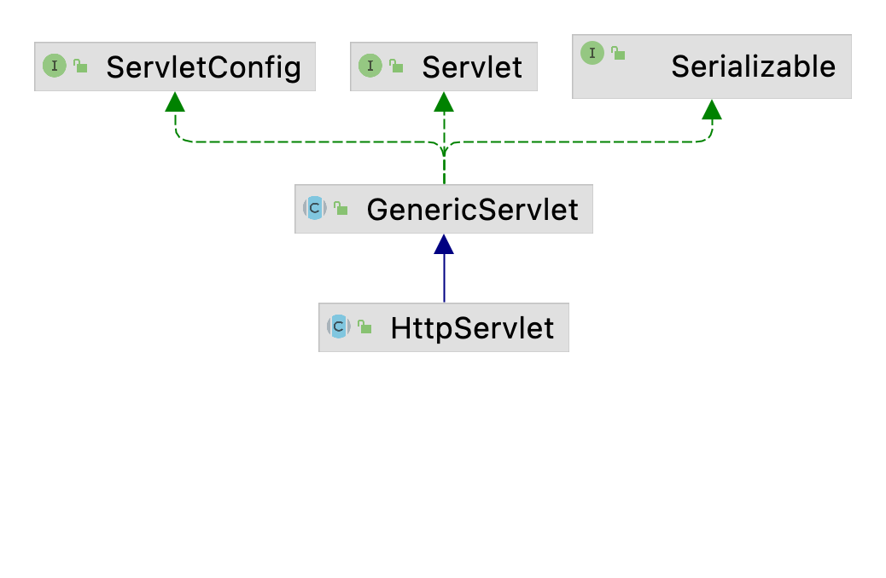

# JavaWeb(2)-Servlet&JSP

# 一. Servlet基础

## 1.1 简介

Servlet 是 Server Applet 的简称，称为服务端小程序，是 Java EE 平台下的技术标准，基于 Java 语言编写的服务端程序。Web 容器或应用服务器实现了 Servlet 标准所以 Servlet 需运行在 Web 容器或应用服务器中。Servlet 主要功能在于能在服务器中执行并生成数据。

Servlet 使用单进程多线程方式运行。

## 1.2 快速入门

声明一个类 FirstServlet 继承 HttpServlet，重写 *service* 方法：

```java
public class FirstServlet extends HttpServlet {

    @Override
    protected void service(HttpServletRequest req, HttpServletResponse resp) throws ServletException, IOException {
        resp.getWriter().write("this is the first Servlet");
    }
}
```

然后在 **web.xml** 配置文件中编写 Servlet 路径映射：

```xml
<servlet>
    <servlet-name>firstServlet</servlet-name>
    <servlet-class>org.codeart.javawebdemo.servlet.FirstServlet</servlet-class>
</servlet>
<servlet-mapping>
    <servlet-name>firstServlet</servlet-name>
    <url-pattern>/first</url-pattern>
</servlet-mapping>
```

最后启动服务器，访问 first 路径即可得到内容。

## 1.3 HttpServlet

### 1.3.1 HttpServletRequest

**HttpServletRequest** 对象代表客户端浏览器的请求，当客户端浏览器通过 **HTTP** 协议访问服务器时，**HTTP** 请求中的所有信息都会被 **Tomcat** 所解析并封装在这个对象中，通过这个对象提供的方法，可以获得客户端请求的所有信息。

1. 获取请求行信息：

```java
String url = req.getRequestURL();  // 返回客户端浏览器发出请求时的完整URL
String uri = req.getRequestURI();  // 返回请求行中指定资源部分
String addr = req.getRemoteAddr();  // 返回发出请求的客户机的IP地址
String local = req.getLocalAddr();   // 返回WEB服务器的IP地址
int port = req.getLocalPort();   // 返回WEB服务器处理Http协议的连接器所监听的端口
```

2. 获取请求头信息：

```java
// 根据请求头中的key获取对应的value
String headerValue = req.getHeader("headerKey");
// 获取请求头中所有的key，该方法返回枚举类型
Enumeration<String> headerNames = req.getHeaderNames();
// 遍历枚举类型
while (headNames.hasMoreElements) {
    String headername = headerNames.nextElement();
    System.out.println(headername + ":" + req.getHeader(headername));
}
```

3. 获取请求数据：

```java
// 根据key获取指定value
String str = req.getParameter("key");
// 获取复选框(checkbox组件)中的值，返回一个String[]
String[] hobbies = req.getParameterValues("hobbies");
// 获取请求中所有数据的key，该方法返回一个枚举类型
Enumeration<String> parameterNames = req.getParameterNames();
// 获取请求中所有的数据并存放到一个Map结构中，该方法返回一个Map，
// 其中key为String类型value为String[]类型。
Map<String, String[]> parameterMap = req.getParameterMap();
```

4. 设置请求头编码：

```java
req.setCharacterEncoding("utf-8");
```

请求的数据包基于字节在网络上传输，Tomcat 接收到请求的数据包后会将数据包中的字节转换为字符。在Tomcat 中使用的是 ISO-8859-1 的单字节编码完成字节与字符的转换，所以数据中含有中文就会出现乱码，可以通过 `req.setCharacterEncoding("utf-8");` 方法来对提交的数据根据指定的编码方式重新做编码处理。

### 1.3.2 HttpServletResponse

HttpServletResponse 对象代表服务器的响应。这个对象中封装了响应客户端浏览器的流对象，以及向客户端浏览器响应的响应头、响应数据、响应状态码等信息。

1. 响应的设置：

MIME 的全称是 **Multipurpose Internet Mail Extensions**，即多用途互联网邮件扩展类型。这是 HTTP 协议中用来定义文档性质及格式的标准。对 HTTP 传输内容类型进行了全面定义。 服务器通过MIME告知响应内容类型，而浏览器则通过 MIME 类型来确定如何处理文档。

```java
// 该方法可通过MIME-Type设置响应类型。
resp.setContentType("MIME");
```

**常见 MIME：**

| 类型                                 | 描述                             |
| ------------------------------------ | -------------------------------- |
| application/msword                   | Microsoft Word document          |
| application/octet-stream             | Unrecognized or binary data      |
| application/pdf                      | Acrobat (.pdf) file              |
| application/postscript               | PostScript file                  |
| application/vnd.lotus-notes          | Lotus Notes file                 |
| application/vnd.ms-excel             | Excel spreadsheet                |
| application/vnd.ms-powerpoint        | PowerPoint presentation          |
| application/x-gzip                   | Gzip archive                     |
| application/x-java-archive           | JAR file                         |
| application/x-java-serialized-object | Serialized Java object           |
| application/x-java-vm                | Java bytecode (.class) file      |
| application/zip                      | Zip archive                      |
| application/json                     | JSON                             |
| audio/basic                          | Sound file in .au or .snd format |
| audio/midi                           | MIDI sound file                  |
| audio/x-aiff                         | AIFF sound file                  |
| audio/x-wav                          | Microsoft Windows sound file     |
| image/gif                            | GIF image                        |
| image/jpeg                           | JPEG image                       |
| image/png                            | PNG image                        |
| image/tiff                           | TIFF image                       |
| image/x-xbitmap                      | X Windows bitmap image           |
| text/css                             | HTML cascading style sheet       |
| text/html                            | HTML document                    |
| text/plain                           | Plain text                       |
| text/xml                             | XML                              |
| video/mpeg                           | MPEG video clip                  |
| video/quicktime                      | QuickTime video clip             |

2. 设置字符型响应：

```java
// 设置响应类型为文本型，内容含有html字符串，是默认的响应类型
resp.setContentType("text/html");
// 设置响应类型为文本型，内容是普通文本
resp.setContentType("text/plain");
// 设置响应类型为JSON格式的字符串
resp.setContentType("application/json");
```

3. 设置字节型响应：

```java
// 设置响应类型为图片类型，图片类型为jpeg或jpg格式
resp.setContentType("image/jpeg");
// 设置响应类型为图片类型，图片类型为gif格式
resp.setContentType("image/gif");
```

4. 设置响应编码：

```java
// 设置服务端为浏览器产生响应的响应编码，服务端会根据此编码将响应内容的字符转换为字节
resp.setCharacterEncoding("utf-8");
// 设置服务端为浏览器产生响应的响应编码，服务端会根据此编码将响应内容的字符转换为字节
// 同时客户端浏览器会根据此编码方式显示响应内容。
resp.setContentType("text/html;charset=utf-8");
```

5. 在响应中添加附加信息(文件下载)：

```java
// 在实现文件下载时，我们需要修改响应头，添加附加信息
 response.setHeader("Content-Disposition", "attachment;filename=" + demo.txt);
```

Content-Disposition：attachment，该附加信息表示作为对**下载文件的一个标识字段**。不会在浏览器中显示而是直接做下载处理。

filename=文件名：表示指定下载文件的文件名。

解决文件名中文乱码问题：

```java
resp.addHeader(
    "Content-Disposition", 
    "attachment;filename="+new String(file.getName().getBytes("gbk"), "iso-8859-1"));
```

## 1.4 乱码问题

1. 控制台乱码：

设置 Tomcat 中 conf 下 *logging.properties* 中所有的 UTF-8 编码为 GBK 即可。

2. post 请求乱码：

```java
// 通过HttpServletRequest设置请求编码
req.setCharacterEncoding("UTF-8");
```

3. get 请求乱码：

需要手动进行编码解码，或者设置 Tomcat 中的 server.xml 中的 URI 编码。Tomcat 9 已经解决了该问题。

```xml
<Connector port="8080" protocol="HTTP/1.1"
           connectionTimeout="20000"
           redirectPort="8443" URIEncoding="utf-8"/>
```

4. 响应乱码：

```java
// 通过HttpServletResponse设置响应编码
resp.setContentType("UTF-8");
// 设置响应头,以便浏览器知道以何种编码解析数据
resp.setContentType("text/html;charset=UTF-8");
```

## 1.5 继承结构和生命周期

### 1.5.1 继承结构

1. 继承结构：



2. Servelt 接口方法：

- *init*：创建 Servlet 对象后立即调用该方法完成其他初始化工作。
- *service*：处理客户端请求，执行业务操作，利用响应对象响应客户端请求。
- *destroy*：在销毁 Servlet 对象之前调用该方法，释放资源。
- *getServletConfig*：ServletConfig 是容器向 Servlet 传递参数的载体。
- *getServletInfo*：获取 Servlet 相关信息。

3. ServletConfig 接口：

Servlet 运行期间，需要一些辅助信息，这些信息可以在 web.xml 文件中，使用一个或多个元素，进行配置。当 Tomcat 初始化一个 Servlet 时，会将该 Servlet 的配置信息，封装到一个 ServletConfig 对象中，通过调用 `init(ServletConfig config)` 方法，将 ServletConfig 对称传递给 Servlet。

4. GenericServlet 抽象类：

GenericServlet 是实现了 Servlet 接口的抽象类。在 GenericServlet 中进一步的定义了 Servlet 接口的具体实现，其设计的目的是为了和应用层协议解耦，在 GenericServlet 中包含一个 *service* 抽象方法。我们也可以通过继承GenericServlet 并实现 *service* 方法实现请求的处理，但是需要将 ServletReuqest 和 ServletResponse 转为 HttpServletRequest 和 HttpServletResponse。

5. HttpServlet：

继承自 GenericServlet，针对于处理 HTTP 协议的请求所定制。在 HttpServlet 的 *service* 方法中已经把 ServletReuqest 和 ServletResponse 转为 HttpServletRequest 和 HttpServletResponse。 直接使用 HttpServletRequest 和 HttpServletResponse, 不再需要强转。实际开发中, 直接继承 HttpServlet, 并根据请求方式复写 *doXxx* 方法即可。

在我们自定义的Servlet中,如果想区分请求方式,不同的请求方式使用不同的代码处理,那么我么重写 *doGet*  *doPost* 即可 	如果我们没有必要区分请求方式的差异,那么我们直接重写 *service* 方法即可 	

要么重写 *doGet*，*doPost* 要么重写 *service*，必须二选一，而且必须进行重写。

### 1.5.2 生命周期

Servlet 的生命周期是由容器管理的，分别经历四各阶段：

| 阶段     | 次数 | 时机           |
| -------- | ---- | -------------- |
| 创建     | 1    | 第一次请求之后 |
| 初始化   | 1    | 实例化请求之后 |
| 执行服务 | 多次 | 每次请求       |
| 销毁     | 1    | 停止服务       |

- new：实例化
- init：初始化
- service：执行服务
- destroy：回收销毁

当客户端浏览器第一次请求 Servlet 时，容器会实例化这个 Servlet，然后调用一次 *init* 方法，并在新的线程中执行 *service* 方法处理请求。service 方法执行完毕后容器不会销毁这个 Servlet 而是做缓存处理，当客户端浏览器再次请求这个 Servlet 时，容器会从缓存中直接找到这个 Servlet 对象，并再一次在新的线程中执行 *service* 方法。当容器在销毁 Servlet 之前对调用一次 *destory*方法。

```java
public class FirstServlet extends HttpServlet {

    // 只执行一次
    public FirstServlet() {
        System.out.println("创建一个Servlet");
    }

    @Override
    public void destroy() {
        System.out.println("销毁Servlet");
    }

    @Override
    public void init() throws ServletException {
        System.out.println("初始化一个Servlet");    
    }

    @Override
    protected void service(HttpServletRequest req, HttpServletResponse resp) throws ServletException, IOException {
        resp.getWriter().write("this is the first Servlet");
    }
}
```

**在 Servlet 中我们一般不要轻易使用成员变量!!!!** 可能会造成线程安全问题。如果要使用的话,应该尽量避免对成员变量产生修改，如果要产生修改我们应该注意线程安全问题，如果我们自己添加线程安全编码处理，会严重影响效率，综上所述:原则,能不用成员变量就不用!!!

### 1.5.3 处理请求流程

当浏览器基于 get 方式请求我们创建 Servlet 时，我们自定义的 Servlet 中的 *doGet* 方法会被执行。*doGet* 方法能够被执行并处理 get 请求的原因是，容器在启动时会解析 web 工程中 WEB-INF 目录中的 web.xml 文件，在该文件中我们配置了 Servlet 与 URI 的绑定，容器通过对请求的解析可以获取请求资源的 URI，然后找到与该 URI 绑定的 Servlet 并做实例化处理(注意：只实例化一次，如果在缓存中能够找到这个 Servlet 就不会再做次实例化处理)。在实例化时会使用 Servlet 接口类型作为引用类型的定义，并调用一次 *init* 方法，由于 HttpServlet 中重写了该方法所以最终执行的是 HttpServlet 中 *init* 方法(HttpServlet 中的 *init* 方法是一个空的方法体)，然后在新的线程中调用 *service* 方法。由于在 HttpServlet 中重写了 *service* 方法所以最终执行的是 HttpServlet 中的 *service* 方法。在 *service* 方法中通过 `request.getMethod` 获取到请求方式进行判断如果是 Get 方式请求就执行 *doGet* 方法，如果是 POST 请求就执行 *doPost* 方法。如果是基于 GET 方式提交的，并且在我们自定义的 Servlet 中又重写了 HttpServlet 中的 *doGet* 方法，那么最终会根据 Java 的多态特性转而执行我们自定义的 Servlet 中的 *doGet* 方法。

## 1.6 ServletConfig

ServletConfig 对象对应 web.xml 文件中的 `<servlet>` 节点。当 Tomcat 初始化一个 Servlet 时，会将该 Servlet 的配置信息，封装到一个 ServletConfig 对象中。我们可以通过该对象读取 `<servlet>` 节点中的配置信息。

```xml
<servlet>
    <servlet-name>servletName</servlet-name>
    <servlet-class>servletClass</servlet-class>
    <init-param>
        <param-name>key</param-name>
        <param-value>value</param-value>
    </init-param>
</servlet>
```

```java
// 读取web.xml文件中<servlet>标签中<init-param>标签中的配置信息
servletConfig.getInitParameter("key");
// 读取web.xml文件中当前<servlet>标签中所有<init-param>标签中的值
servletConfig.getInitParameterNames();
```

## 1.7 ServletContext

ServletContext 官方叫 Servlet 上下文。服务器会为每一个 Web 应用创建一个 ServletContext 对象。这个对象全局唯一，而且 Web 应用中的所有 Servlet 都共享这个对象。所以叫全局应用程序共享对象。

**ServletContext 作用：**

1. 相对路径转绝对路径
2. 获取容器的附加信息
3. 读取配置信息
4. 全局容器

```java
// 获取项目的部署名
context.getContextPath();
// 相对路径转绝对路径(文件上传下载时需要注意)
context.getRealPath("path");
// 获取容器的附加信息
context.getServerInfo();
// 返回Servlet容器所支持Servlet的主版本号
context.getMajorVersion();
// 返回Servlet容器所支持Servlet的副版本号
context.getMinorVersion();
```

**获取 web.xml 文件中的信息：**

```xml
<context-param>
    <param-name>key</param-name>
    <param-value>value</param-value>
</context-param>
```

```java
// 读取web.xml文件中<context-param>标签中的配置信息
context.getInitParameter("key");
// 读取web.xml文件中所有param-name标签中的值
context.getInitParameterNames();
```

**全局容器：**

```java
// 向全局容器中存放数据value为Object类型
context.setAttribute("key", value);
// 从全局容器中获取数据
Object value = context.getAttribute("key");
// 根据key删除全局容器中的value
context.removeAttribute("key");
```

**ServletContext 对象生命周期：**

当容器启动时会创建 ServletContext 对象并一直缓存该对象，直到容器关闭后该对象生命周期结束。ServletContext 对象的生命周期非常长，所以在使用全局容器时不建议存放业务数据。

## 1.8 url-pattern匹配规则

- **精确匹配：**

精确匹配是指 `<url-pattern>` 中配置的值必须与 url 完全精确匹配：

```xml
<servlet-mapping>
    <servlet-name>demoServlet</servlet-name>
    <url-pattern>/demo</url-pattern>
</servlet-mapping>
```

```
http://localhost:8888/demo/demo.do 匹配 		
http://localhost:8888/demo/suibian/demo.do 不匹配
```

- **扩展名匹配：**

在 `<url-pattern>` 允许使用统配符 `*` 作为匹配规则，`* ` 表示匹配任意字符。在扩展名匹配中只要扩展名相同都会被匹配和路径无关。注意，在使用扩展名匹配时在 `<url-pattern>` 中不能使用 `/`，否则容器启动就会抛出异常。

```xml
<servlet-mapping>
    <servlet-name>demoServlet</servlet-name>
    <url-pattern>*.do</url-pattern>
</servlet-mapping>
```

```
http://localhost:8888/demo/abc.do 				匹配
http://localhost:8888/demo/suibian/haha.do 	   匹配
http://localhost:8888/demo/abc 					不匹配
```

- **路径匹配：**

根据请求路径进行匹配，在请求中只要包含该路径都匹配。`*`表示任意路径以及子路径。

```xml
<servlet-mapping>
    <servlet-name>demoServlet</servlet-name>
    <url-pattern>/suibian/*</url-pattern>
</servlet-mapping>
```

```
http://localhost:8888/demo/suibian/haha.do 			匹配
http://localhost:8888/demo/suibian/hehe/haha.do    匹配
http://localhost:8888/demo/hehe/heihei.do 			不匹配
```

- **任意匹配：**

匹配 `/`，匹配所有但不包含 JSP 页面：

```xml
<url-pattern>/</url-pattern>
```

```
http://localhost:8888/demo/suibian.do				匹配
http://localhost:8888/demo/addUser.html				匹配
http://localhost:8888/demo/css/view.css				匹配
http://localhost:8888/demo/addUser.jsp				不匹配
http://localhost:8888/demo/user/addUser.jsp			不匹配
```

- **匹配所有：**

```xml
<url-pattern>/*</url-pattern>
```

```
http://localhost:8888/demo/suibian.do				匹配
http://localhost:8888/demo/addUser.html				匹配
http://localhost:8888/demo/suibian/suibian.do		匹配
```

- **优先顺序：**

当一个 url 与多个 Servlet 的匹配规则可以匹配时，则按照：**精确路径 \> 最长路径 \> 扩展名**这样的优先级匹配到对应的Servlet。

Servlet1 映射到 /abc/*  		

Servlet2 映射到 /*  		

Servlet3 映射到 /abc 		

Servlet4 映射到 *.do

```
当请求URL为“/abc/a.html”，“/abc/*”和“/*”都匹配，Servlet引擎将调用Servlet1。
当请求URL为“/abc”时，“/abc/*”和“/abc”都匹配，Servlet引擎将调用Servlet3。
当请求URL为“/abc/a.do”时，“/abc/*”和“*.do”都匹配，Servlet引擎将调用Servlet1。
当请求URL为“/a.do”时，“/*”和“*.do”都匹配，Servlet引擎将调用Servlet2。
当请求URL为“/xxx/yyy/a.do”时，“/*”和“*.do”都匹配，Servlet引擎将调用Servlet2。
```

- **URL 映射方式**：

在 web.xml 文件中支持将多个 URL 映射到一个 Servlet 中，但是相同的 URL 不能同时映射到两个 Servlet 中。

**方式 1：**

```xml
<servlet-mapping>
    <servlet-name>demoServlet</servlet-name>
    <url-pattern>/suibian/*</url-pattern>
    <url-pattern>*.do</url-pattern>
</servlet-mapping>
```

**方式 2：**

```xml
<servlet-mapping>
    <servlet-name>demoServlet</servlet-name>
    <url-pattern>/suibian/*</url-pattern>
</servlet-mapping>
<servlet-mapping>
    <servlet-name>demoServlet</servlet-name>
    <url-pattern>*.do</url-pattern>
</servlet-mapping>
```

## 1.9 注解开发Servlet

在 Servlet3.0 以及之后的版本中支持注解式开发 Servlet。对于 Servlet 的配置不在依赖于 web.xml 配置文件而是使用 `@WebServlet` 将一个继承于 *javax.servlet.http.HttpServlet* 的类定义为 Servlet 组件。

`@WebServlet `注解中属性：

| 属性名称       | 类型           | 作用                            |
| -------------- | -------------- | ------------------------------- |
| initParams     | WebInitParam[] | Servlet的init参数               |
| name           | String         | Servlet的名称                   |
| urlPatterns    | String[]       | Servlet的访问URL，支持多个      |
| value          | String[]       | Servlet的访问URL，支持多个      |
| loadOnStartup  | int            | 自启动Servlet                   |
| description    | String         | Servlet的描述                   |
| displayName    | String         | Servlet的显示名称               |
| asyncSupported | boolean        | 声明Servlet是否支持异步操作模式 |

```java
@WebServlet(
        name = "helloServlet", 
        value = "/hello-servlet",
        loadOnStartup = 1,
        asyncSupported = true,
        urlPatterns = {"/hello-servlet"},
        initParams = {
            @WebInitParam(name = "a", value = "1"),
            @WebInitParam(name = "b", value = "2")
        },
        description = "HelloWorld",
        displayName = "HelloServlet"
)
```

# 二. Servlet开发

## 2.1 请求转发

### 2.1.1 forward方式

**forword 处理流程：**

1. 清空 Response 存放响应正文数据的缓冲区。
2. 如果目标资源为 Servlet 或 JSP，就调用它们的 *service* 方法，把该方法产生的响应结果发送到客户端。如果目标资源文件系统中的静态 HTML 文档，就读取文档中的数据把它发送到客户端。

**forword 处理特点：**

1. 由于 *forword* 方法先清空用于存放响应正文的缓冲区，因此源 Servlet 生成的响应结果不会被发送到客户端，只有目标资源生成的响应结果才会被发送到客户端。
2. 如果源 Servlet 在进行请求转发之前，已经提交了响应结果(*flushBuffer*，*close* 方法)，那么 *forward* 方法抛出 `IllegalStateException`。为了避免该异常，不应该在源 Servlet 中提交响应结果。

**测试：**

```java
@WebServlet(name = "Servlet1", value = "/servlet1")
public class Servlet1 extends HttpServlet {
    @Override
    protected void doGet(HttpServletRequest request, HttpServletResponse response) throws ServletException, IOException {
        System.out.println("servlet1 service invoked");
        String money = request.getParameter("money");
        System.out.println("money:" + money);
        request.getRequestDispatcher("servlet2").forward(request, response);
    }

    @Override
    protected void doPost(HttpServletRequest request, HttpServletResponse response) throws ServletException, IOException {
        doGet(request, response);
    }
}
```

```java
@WebServlet(name = "Servlet2", value = "/servlet2")
public class Servlet2 extends HttpServlet {
    @Override
    protected void doGet(HttpServletRequest request, HttpServletResponse response) throws ServletException, IOException {
        System.out.println("servlet2 service invoked");
        String money = request.getParameter("money");
        System.out.println("money:" + money);
        response.setCharacterEncoding("UTF-8");
        response.setContentType("text/html;charset=UTF-8");
        PrintWriter writer = response.getWriter();
        writer.println("支付宝到账:" + money + "元");
    }

    @Override
    protected void doPost(HttpServletRequest request, HttpServletResponse response) throws ServletException, IOException {
        doGet(request, response);
    }
}
```

**总结：**

1. 请求转发是一种服务器的行为，是对浏览器屏蔽。
2. 浏览器的地址栏不会发生变化。
3. 请求的参数是**可以从源组件传递到目标组件的**。
4. 请求对象和响应对象没有重新创建，而是传递给了目标组件。
5. 请求转发可以帮助我们完成页面的跳转。
6. 请求转发可以转发至 WEB-INF 里。
7. 请求转发只能转发给当前项目的内部资源，不能转发至外部资源。
8. 常用 forward 方式转发请求。

### 2.1.2 include方式

**include 处理流程：**

1. 如果目标资源为 Servlet 或 JSP，就调用他们的相应的 *service* 方法，**把该方法产生的响应正文添加到源 Servlet 的响应结果中**。如果目标组件为 HTML 文档，就直接把文档的内容添加到源 Servlet 的响应结果中。
2. 返回到源 Servlet 的服务方法中，继续执行后续代码块。

**include 处理特点：**

1. 源 Servlet 与被包含的目标资源的输出数据都会被添加到响应结果中。
2. 在目标资源中对响应状态码或者响应头所做的修改都会被忽略。

**测试：**

```java
@WebServlet(name = "Servlet1", value = "/servlet1")
public class Servlet1 extends HttpServlet {
    @Override
    protected void doGet(HttpServletRequest request, HttpServletResponse response) throws ServletException, IOException {
        System.out.println("servlet1 service invoked");
        String money = request.getParameter("money");
        System.out.println("money:" + money);
        response.setContentType("text/html;charset=UTF-8");
        request.getRequestDispatcher("servlet2").include(request, response);
        response.getWriter().println("servlet1在转发之后增加的响应内容");
    }

    @Override
    protected void doPost(HttpServletRequest request, HttpServletResponse response) throws ServletException, IOException {
        doGet(request, response);
    }
}
```

```java
@WebServlet(name = "Servlet2", value = "/servlet2")
public class Servlet2 extends HttpServlet {
    @Override
    protected void doGet(HttpServletRequest request, HttpServletResponse response) throws ServletException, IOException {
        System.out.println("servlet2 service invoked");
        String money = request.getParameter("money");
        System.out.println("money:" + money);
        PrintWriter writer = response.getWriter();
        writer.println("支付宝到账:" + money + "元");
    }

    @Override
    protected void doPost(HttpServletRequest request, HttpServletResponse response) throws ServletException, IOException {
        doGet(request, response);
    }
}
```

## 2.2 响应重定向

**运作流程：**

1. 用户在浏览器端输入特定 URL，请求访问服务器端的某个 Servlet。
2. 服务器端的 Servlet 返回一个状态码为 302 的响应结果，该响应结果的含义为：让浏览器端再请求访问另一个 Web 资源，在响应结果中提供了另一个 Web 资源的 URL。另一个 Web 资源有可能在同一个 Web 服务器上，也有可能不再同一个 Web 服务器上。 		
3. 当浏览器端接收到这种响应结果后，再立即自动请求访问另一个 Web 资源。 		
4. 浏览器端接收到另一个 Web 资源的响应结果。

**测试：**

```java
@WebServlet(name = "Servlet1", value = "/servlet1")
public class Servlet1 extends HttpServlet {
    @Override
    protected void doGet(HttpServletRequest request, HttpServletResponse response) throws ServletException, IOException {
        System.out.println("servlet1 service invoked");
        String money = request.getParameter("money");
        System.out.println("money:" + money);
        response.sendRedirect("servlet2?money=" + money);
    }

    @Override
    protected void doPost(HttpServletRequest request, HttpServletResponse response) throws ServletException, IOException {
        doGet(request, response);
    }
}
```

```java
@WebServlet(name = "Servlet2", value = "/servlet2")
public class Servlet2 extends HttpServlet {
    @Override
    protected void doGet(HttpServletRequest request, HttpServletResponse response) throws ServletException, IOException {
        System.out.println("servlet2 service invoked");
        String money = request.getParameter("money");
        System.out.println("money:" + money);
        response.setCharacterEncoding("UTF-8");
        response.setContentType("text/html;charset=UTF-8");
        response.getWriter().println("支付宝到账:" + money + "元");
    }

    @Override
    protected void doPost(HttpServletRequest request, HttpServletResponse response) throws ServletException, IOException {
        doGet(request, response);
    }
}
```

**总结：**

1. 重定向是服务器给浏览器重新指定请求方向是一种浏览器行为，地址栏会发生变化。
2. 重定向时,请求对象和响应对象都会再次产生，请求中的参数是不会携带。
3. 重定向也可以帮助我们完成页面跳转。
4. 重定向不能帮助我们访问 WEB-INF 中的资源。
5. 重定向可以定向到外部资源。

## 2.3 路径问题

### 2.3.1 前端路径问题


### 2.3.2 请求转发路径问题


### 2.3.3 响应重定向问题


## 2.4 会话管理


## 2.5 域对象


# 三. JSP

## 3.1 入门


## 3.2 指令标签


## 3.3 九大内置对象


# 四. EL表达式


# 五. JSTL标签库

## 5.1 核心库标签


## 5.2 格式化标签


# 六. MVC模式