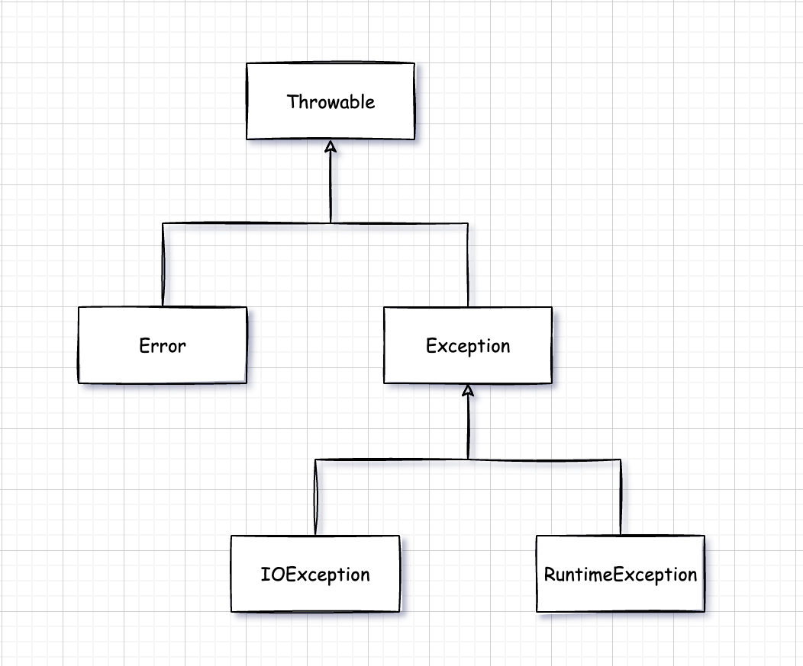

# 五. 异常断言日志

对于异常情况，例如，可能造成程序崩溃的错误输入，Java 使用一种被称为**异常处理(exception handling)**的错误捕捉机制处理。Java 异常处理与 C++ 或 Delphi 中的异常处理十分类似。


## 5.1 处理错误

假设在在一个 Java 程序运行期间出现了一个错误。这个错误可能是由于文件包含了错误的信息，或者网络连接出现问题造成的，也有可能是因为使用无数的数组下标，或者试图使用一个没有被赋值的对象引用而造成的。用户希望在出现错误的时候，程序能够采用一些理智的行为。如果由于出现错误而使得某些操作没有完成，程序应该：

- 返回到一种安全状态，并能够让用户执行一些其他的命令。
- 允许用户保存所有的操作，并以妥善的方式终止程序。

要做到这些并不是一件很容易的事情。其原因是检测(或引发)错误条件的代码通常离那些能够让数据恢复到安全状态，或者能够保存用户的操作结果，并正常地退出程序的代码很远。异常处理的任务就是将控制权从错误产生的地方转移给能够处理这种情况的错误处理器。


### 5.1.1 异常分类

在 Java 程序设计语言中，异常对象都是派生于 Throwable 类的一个实例。如果 Java 中内置的异常类不能够满足要求，那么用户可以创建自己的异常类。

Java 异常层次结构如图所示：



需要注意的是，所有的异常都是由 Throwable 继承而来，但在下一层立即分解为两个分支：Error 和 Exception。

Error 类层次结构描述了 Java 运行时系统的内部错误和资源耗尽错误。应用程序不应该抛出这种类型的对象。如果出现了这种内部错误，除了通告给用户，并尽力使程序安全地终止之外，再也无能为力。这种情况很少出现。

在设计 Java 应用程序是，需要关注 Exception 层次结构。这个层次结构又分解为两个分支：一个分支派生于 RuntimeException；另一个分支包含其他异常。划分两个分支的规则是：由程序错误导致的异常属于 RuntimeException；而程序本身没有问题，但由于像 I/O 错误这类问题导致的异常属于其他异常。

派生于 RuntimeException 的异常包含下面几种情况：

- 错误的类型转换。
- 数组访问越界。
- 访问 null 指针。

不是派生于 RuntimeException 的异常包括：

- 试图在文件尾部后面读取数据。
- 试图打开一个不存在的文件。
- 试图根据给定的字符串查找 Class 对象，而这个字符串表示的类并不存在。

如果出现 RuntimeException 异常，那么就一定是你的问题是一条相当有道理的规则。应该通过检测数组下表是否越界来避免 ArrayIndexOutOfBoundsException 异常。应该通过在使用变量之前检测是否为 null 来杜绝 NullPointer 异常的发生。

Java 语言规范将派生于 Error 类或 RuntimeException 类的所有异常称为**非受查异常(unchecked)**异常，所有其他异常称为**受查(checked)**。这是两个很有用的术语。编译器将核查是否为所有的受查异常提供了异常处理器。

> RuntimeException 这个名字很容易让人混淆。实际上，现在讨论的所有错误都发生运行时。


### 5.1.2 声明受查异常

如果遇到了无法处理的情况，那么 Java 的方法可以抛出一个异常。这个道理很简单：一个方法不仅需要告诉编译器将要返回什么值，**还要告诉编译器可能发生什么类型的错误**。例如，一段读取文件的代码知道有可能读取的文件不存在，或者内容为空。因此，试图处理文件信息的代码就需要通知编译器可能抛出 IOException 类的异常。

在自己编写方法时，不必讲所有可能抛出的异常都进行声明。至于什么时候需要再方法中用 throws 子句声明异常，什么异常必须使用 throws 子句声明，需要记住遇到下面  4 种情况时应该抛出异常：

- 调用一个抛出受查异常的方法
- 程序运行过程中发现错误，并且利用 throw 语句抛出一个受查异常。
- 程序出现错误，例如，数组下表越界异常。
- Java 虚拟机和运行时库出现的内部错误。

如果出现前两种情况之一，则必须告诉调用这个方法的程序员有可能抛出异常。因为任何一个抛出的异常方法都有可能是一个**死亡陷阱**。如果没有没有处理器捕获这个异常，当前执行的线程就会结束。

根据**异常规范(exception specification)**，在方法的首部声明这个方法可能抛出的异常。

```java
public Image loadImage(String s) throws IOException { ... }
```

如果一个方法有可能抛出多个受查异常类型，那么久必须在方法的首部列出所有的异常类。每个异常用逗号隔开：

```java
public Image loadImage(String s) throws FileNotFoundException, EOFException { ... }
```

但是不需要声明 Java 的内部错误，即从 Error 继承的错误。任何程序代码都具有抛出那些异常的潜能，而我们对其没有任何控制能力。

同样，也不该声明从 RuntimeException 继承的那些非受查异常。

总之，一个方法必须声明所有可能抛出的**受查异常**，而非受查异常要么不可控制(Error)，要么就应该避免发生(RuntimeException)。如果方法没有声明所有可能发生的异常，直接编译失败。

> 如果在子类中覆盖了超类的一个方法，子类方法中声明的受查异常不能比超类方法中声明的异常范围更广(也就是说，子类方法中可以抛出更特定的异常，或者根本不抛出任何异常。)特别需要说明的是，如果超类方法没有抛出任何受查异常，子类也不能抛出任何受查异常。

如果类中的一个方法声明将会抛出一个异常，而这个异常是某个特定类的实例时，则这个方法就有可能抛出一个这个类的异常，或者这个类的任意一个子类的异常。例如，FileInputStream 构造器声明将有可能抛出一个 IOException 异常，也有可能是其子类的异常。例如，FileNotFoundException。


### 5.1.3 如何抛出异常

抛出异常的语法格式：

```java
throw new XxxException();
```

把代码组织在一起：

```java
public String readData(Scanner in) throws EOFException {
    ...
    while (...) {
        if (!in.hasNext()) {  // EOF
            throw new EOFException();
        }
        ...
    }
    return s;
}
```

对于一个已经存在的异常类，将其抛出非常容易，在这种情况下：

1. 找到一个合适的异常类。
2. 创建这个类的一个对象。
3. 将其抛出。

一旦方法抛出异常，这个方法就不可能返回到调用者。也就是说，不必为返回的默认值或错误代码担忧。


### 5.1.4 创建异常类

在程序中，可能会遇到任何标准异常类都没有能够充分描述清楚问题。在这种情况下，创建自己的异常类就是一件顺理成章的事情了。需要做的就是定义一个派生于 Exception 的类，或者派生于 Exception 子类的类。

e.g. 定义一个自定义异常：

```java
public class FileFormatException extends IOException {
    public FileFormatException() {}
    public FileFormatException(String s) {
        super(s);
    }
}
```

抛出异常还是和原来一样，使用 throw 关键字即可。

*java.lang.Throwable* 有关 API：

- `Throwable()` 构造一个新的 Throwable 对象，这个对象没有详细的描述信息。
- `Throwable(String message)` 构造一个新的 throwable 对象，这个对象带有特定的详细描述信息。
- `String getMessage()` 获得 Throwable 对象的详细描述信息。


## 5.2 捕获异常

### 5.2.1 try catch

如果某个异常发生的时候没有任何地方尽心捕获，那么程序就会终止执行，并在控制台上打印异常信息，其中包括异常的类型和堆栈的内容。

想要捕获一个异常，那么必须要设置 try/catch 代码块。

try/catch 语法格式：

```java
try {
    ...  // code block that exception probably occurs in
} catch (ExceptionType e) {
    ...  // handle for this exception
}
```

如果在 try 代码块中的任何代码抛出了一个在 catch 子句中说明的异常类，那么：

1. 程序将会跳过 try 语句块的其余代码。
2. 程序将执行 catch 子句中的处理器代码。

如果在 try 语句块中的代码没有抛出异常，那么程序将跳过 catch 子句。

如果方法中的任何代码抛出了一个在 catch 子句中没有声明的异常类型，那么这个方法就会立刻退出。

e.g. 捕获读取数据的异常代码：

```java
public void read(String fileName) {
    try {
        InputStream in = new FileInputStream(fileName);
        int b;
        while ((b = in.read()) != -1) {
            ...
        }
    } catch (IOException e) {
        e.printStackTrace();
    }
}
```

或者不处理，而是把异常传递给调用者，那么就必须声明这个方法可能会抛出异常，那么代码就可以这样写：

```java
public void read(String fileName) throws IOException { ... }
```

编译器将严格执行 throws 说明符。如果调用了一个抛出受查异常的方法，就必须对它进行处理，或者继续传递。如果想要传递一个异常，就必须在方法的首部添加 throws 关键字，以便告知调用者这个方法可能会抛出异常。

同时记住，这个规则也有一个例外。如果编写一个覆盖超类的方法，而这个方法又没有抛出异常，那么这个方法就必须捕获方法中的每一个受查异常。不允许在子类的 throws 关键字后出现超过超类方法所列出的异常范围类型。


### 5.2.2 捕获多个异常

在一个 try 语句块中可以捕获多个异常，并对不同类型的异常做出不同的处理，可以按照下列方式为每个异常类型使用一个单独的 catch 子句：

```java
try {
    ...
} catch (FileNotFoundException e) {
    ...
} catch (UnknownHostException e) {
    ...
} catch (IOException e) {
    ...
}
```

异常对象可能包含与异常本身有关的信息。想要获得对象的更多信息，可以试着使用 `e.getMessage()`得到详细的错误信息或者使用 `e.getClass().getName()` 得到异常对象的实际类型。

在 Java SE 7 中，同一个 catch 子句可以捕获多个异常类型。上述代码可以合并为：

```java
try {
    ...
} catch (FileNotFoundException | UnkownHostException e) {
    ...
} catch(IOException e) {
    ...
}
```

意思就是说，前两种异常处理方式是一样的，后面的异常单独处理，相同处理方式的异常可以合并在一起。

> 捕获多个异常时，异常变量隐含为 final 变量。也就是说没，不可以为异常对象 e 重新赋值。


### 5.2.3 再次抛出异常与异常链

在 catch 子句中可以抛出一个异常，这样做的目的是改变异常的类型。如果开发了一个供其他程序员使用的子系统，那么，用于表示子系统故障的异常类型可能会产生多种解释。ServletException 就是这样一个异常类型的例子。执行 Servlet 代码可能不想知道发生错误的细节原因，但是希望明确地知道 servlet 是否有问题。

捕获异常并将它再次抛出的基本方法：

```java
try {
    ...  // access the database
} catch (SQLException e) {
    throw new ServletException("database error : " + e.getMessage());
}
```

还有一种更好的处理方法，并且将原始异常设置为新异常的“原因”：

```java
try {
	...    
} catch (SQLException e) {
    Throwable t = new ServletException("database error");
    t.initCause(e);
    throw se;
}
```

当捕获到异常时，就可以使用下面这条语句重新得到原始异常：

```java
Throwable e = t.getCause();
```

强烈建议使用这种包装技术。这样可以让用户抛出子系统中的高级异常，而不会丢失原始异常的细节。

如果在一个方法中发生了一个受查异常，而不允许抛出它，那么包装技术就会十分有用。可以捕获这个受查异常，并将它包装成一个运行时异常。


### 5.2.4 finally子句

当代码抛出一个异常时，就会终止方法中剩余代码的处理，并退出这个方法的执行。如果方法获得了一些本地资源，并且只有这个方法自己知道，又如果这些资源在退出方法之前必须被回收，那么就会产生资源回收问题。一种解决方案是捕获并重新抛出所有的异常。但是，这种解决方案比较乏味，这是因为需要再两个地方清除所分配的资源。一个在正常的代码中，另一个在异常代码中。

Java 有一种更好的解决方案，那就是使用 finally 子句。不管是否有异常被捕获，finally 子句中的代码都将被执行。以下示例中，程序将在所有情况下关闭文件：

```java
InputStream in = new FileInputStream(...);
try {
    // 1
    ...  // exception may occur
    // 2     
} catch (IOException) {
    // 3
    ...  // show error message
    // 4    
} finally {
    // 5
    in.close();
}
// 6
```

在上面的代码中，有下列 3 种情况下会执行 finally 子句：

1. 代码没有抛出异常。在这种情况下，程序首先执行 try 语句块中的全部代码，然后执行 finally 子句中的代码。随后继续执行 try 语句块之后的第一条语句。也就是说，执行顺序为： 

​					1  ⇨ 2 ⇨ 5 ⇨ 6

2. 抛出一个在 catch 子句中的异常。在上面示例中就是 IOException 异常。在这种情况下，程序将执行 try 语句块中的所有代码，直到异常发生为止。此时，将跳过 try 语句块中的剩余代码，转去执行与该异常匹配的 catch 子句中的代码，最后执行 finally 子句中的代码。

   如果 catch 子句没有抛出异常，程序将执行 try 语句块之后的第一条语句。在这里执行顺序就是：

   ​		1 ⇨ 3  ⇨ 4 ⇨ 5 ⇨ 6

   如果 catch 子句抛出了一个异常，异常将被抛回这个方法的调用者。在这里执行顺序就是：

   ​		1 ⇨ 3 ⇨ 5

3. 代码抛出了一个异常，但这个异常不是由 catch 子句捕获的。在这种情况下，程序将执行 try 语句块中的所有语句，直到所有异常被抛出为止。此时，将跳过 try 语句块中的剩余代码，然后执行 finally 子句中的语句，并将异常抛出给这个方法的调用者。在这里，执行顺序为：

​					1 ⇨ 5

​			try 语句可以只有 finally 子句，而没有 catch 子句。例如，下面这条 try 语句：

```java
InputStream in = ...;
try {
    ...
} finally {
    in.close();
}
```

无论在 try 语句块中是否遇到异常，finally 子句中的 in.close() 语句都会执行。当然，如果真的遇到一个异常，这个异常将会被重新被抛出，并且必须由另一个 catch 子句捕获。

强烈建议解耦合 try/catch 和 try/finally 语句块。这样可以提高代码的清晰度：

```java
InputStream in = ...;
try {
    try {
        // code taht might throw exception
    } finally {
        in.close();
    }
} catch (IOException e) {
    // show error message
}
```

内层的 try 语句块只有一个职责，就是确保关闭输入流。外层的 try 语句块也只有一个职责，那就是确保报告出现的错误。这种设计方式不仅清楚，而且还具有一个功能，就是将会报告 finally 子句中出现的错误。

**当 finally 子句中包含 return 语句时，将会出现一种意想不到的结果。假设利用 return 语句从 try 语句块中退出。在方法返回之前，finally 子句中的内容将被执行。如果 finally 子句中也有一个 return 语句，这个返回值将会覆盖原始的返回值。**

e.g.

```java
public static int fun(int n) {
	try {
        int r = n * n;
        return r;
    } finally {
        if (n == 2) {
            return 0;
        }
    }
}
```

如果调用 fun(2)，那么 try 语句块的计算结果为 r = 4，并执行 return 语句。然而，在方法真正返回前，还要执行 finally 语句。finally 子句使得方法返回 0，这个返回值覆盖了原始的返回值 4。

有时候，finally 子句也会带来麻烦。例如，清理资源的方法也有可能抛出异常。假设希望能够确保在流处理代码中遇到异常时将流关闭。执行 finally 语句块，并调用 close 方法，而 close 方法本身也可能抛出 IOException 异常。当出现这种情况时，原始的异常将会丢失，转而抛出 close 方法的异常。使用传统的解决方案：

```java
InputStream in = ...;
try {
    ...
} catch (Exception e) {
    e.printStackTrace();
} finally {
    if (in != null) {
        try {
            in.close();
        } catch (Exception e) {
            e.printStackTrace();
        }
    }
}
```

可以使用 try-with-resource 优化代码。


### 5.2.5 带资源的try语句

对于以下代码:

```java
// open a resource
try {
	// work with the resource
} finally {
    // close the resource
}
```

假设资源属于一个实现了 AutoCloseable 接口的类，Java SE 7 为这种代码提供了一种很有用的快捷方式。AutoCloseable 接口有一个方法：

```java
void close() throws Exception
```

> 另外，还有一个 Closeable 接口。这是 AutoCloseable 的子接口，也包含一个 close 方法。不过，这个方法声明为抛出一个 IOException。

带资源的 try 语句(try-with-resources)的最简单形式：

```java
try (Resource r = ...) {
    // process r
}
```

try 语句块退出时，会自动调用 `r.close()` 。

e.g. 读取一个文件中的所有单词：

```java
try (
    Scanner sc = new Scanner(
        new FileInputStream("/usr/local/words.txt"), 
        StandardCharsets.UTF_8
    )
) {
    while (sc.hasNext()) {
        System.out.println(sc.next());
    }
}
```

这个块正常退出时，或者存在一个异常时，都会调用 `sc.close()` 方法，就好像使用了 finally 块一样。try 关键字后的小括号而且还可以指定多个资源。


### 5.2.6 分析堆栈轨迹元素

**堆栈轨迹(stack trace)**是一个方法调用过程的列表，它包含了程序执行过程中方法调用的特定位置。前面已经看到这种列表，当 Java 程序正常终止，而没有不过异常时，这个列表就会显示出来。

可以调用 Throwable 类的 *printStackTrace* 方法访问堆栈轨迹的文本描述信息：

```java
Throwable t = new Throwable();
StringWriter out = new StringWriter();
t.printStackTrace(new PrintWriter(out));
String description = out.toString();
```

一种更灵活的方法是使用 *getStackTrace* 方法，它会得到 StackTraceElement 对象的一个数组，可以在你的程序中分析这个对象数组：

```java
Throwable t = new Throwable();
StackTraceElement[] frames = t.getStackTrace();
for (StackTraceElement frame : frames) {
    ...
}
```

StackTraceElement 类含有能够获得文件名称和当前执行的代码行号的方法，同时，还含有能够获得类名和方法名的方法。*toString* 方法将产生一个格式化的字符串，其中包含所获得的信息。

静态的 *Thread.getAllStackTrace* 方法，它可以产生所有线程的堆栈轨迹：

```java
Map<Thread, StackTraceElement[]> map = Thread.getAllStackTrace();
for (Thread t : map.keySet()) {
    StackTraceElement[] frames = map.get(t);
    ...
}
```

*java.lang.Throwable* 有关 API：

- `Throwable(Throwable cause)`
- `Throwable(String message, Throwable cause)` 用给定的原因，构造一个 Throwable 对象。
- `Throwable initCause(Throwable cause)` 将这个对象设置为原因。如果这个对象已经被设置为原因，则抛出一个异常，返回 this 引用。
- `Throwable getCause()` 获得设置这个对象的原因的异常对象。如果没有设置原因，则返回 null。
- `StackTraceElement[] getStackTrace()` 获得构造这个对象时调用堆栈的跟踪。
- `void addSuppressed(Throwable t)` 为这个异常增加一个抑制异常。这出现在带资源的 try 语句中，其中 t 是 close 方法抛出的异常。
- `Throwable[] getSuppressed()` 得到这个异常的所有“抑制”异常。

*java.lang.Exception* 有关 API：

- `Exception(Throwable cause)`
- `Exception(String message, Throwable cause)` 用给定的原因构造一个异常。

*java.lang.RuntimeException* 有关 API：

- `RuntimeException(Throwable cause)`
- `RuntimeException(String message, Throwable cause)` 用给定的原因，构造一个 RuntimeException 对象。

*java.lang.StackTraceElement* 有关 API：

- `String getFileName()` 返回这个元素运行时对应的源文件名。如果这个信息不存在则返回 null。
- `int getLineNumber()` 返回这个元素运行时对应的源文件行数。如果这个信息不存在则返回 -1.
- `String getClassName()` 返回这个元素运行时对应的类的完全限定名。
- `String getMethodName()` 返回这个元素运行时对应的方法名。构造器名是\<init\>，静态初始化器名是\<clinit>。这里无法区分同名重载方法。
- `boolean isNativeMethod()` 如果这个元素运行时在一个本地方法中，则返回 true。
- `String toString()` 如果存在的话，返回一个包含类名，方法名，文件名和行数的格式化字符串。


## 5.3 使用异常机制的技巧

下面给出使用异常机制的几个技巧：

1. 异常处理不能代替简单的测试。
2. 不要过分地细化异常。
3. 利用异常的层次结构。
4. 不要压制异常。
5. 贼检测错误时，“苛刻”可能比放任更好。
6. 不要羞于传递异常。

## 5.4 使用断言

在一个具有自我保护能力的程序中，断言很常用，

### 5.4.1 断言的概念

假设确信某个属性符合要求，并且代码的执行依赖于这个属性。例如，需要计算：

```java
double y = Math.sqrt(x);
```

我们确信，这里的 x 是一个非负整数。原因是：x 是另外一个计算的结果，而这个结果不可能是负数。或者 x 是一个方法的参数，而这个方法要求它的调用者只能提供一个正整数。然而希望进行检查，以避免“不是一个数”的数值参与计算操作。当然，也可以排除一个异常：

```java
if (x < 0) {
    throw new IllegalArgumentException("x < 0");
}
```

但是这段代码会一直保留在程序中，即使测试完毕也不会自定删除。如果在程序中含有大量的这种检查，程序运行起来会相当慢。

断言机制允许在测试期间向代码中插入一些检查语句。当代码发布时，这些插入的检测语句将会被自动地移走。

Java 语言引入了关键字 assert。这个关键字有两种形式：

```java
assert condition; 或者 assert conditon : expression;    
```

这两种形式都会对条件进行检测，如果结果为 false，则抛出一个 AssertionError 异常。在第二种形式中，表达式将被传入 AssertionError 的构造器，并转为一个消息字符串。

“expression” 部分的唯一目的是产生一个消息字符串。AssertionError 对象并不存储表达式的值，因此，不可能在以后得到它。正如 JDK 文档所描述的那样，如果使用表达式的值，就会鼓励程序员试图从断言中恢复程序的运行，这不符合断言机制的初衷。

想要断言 x 是一个非负数值，只需要简单地使用下面这条语句：

```java
assert x >= 0;
```

或者将 x 的实际值传递给 AssertionError 对象，从而可以在后面显示出来：

```java
assert x >= 0 : x;
```


### 5.4.2 启用和禁用断言

在默认情况下，断言被禁用。可以在运行程序时使用 `-enableassertions` 或 `-ea` 选项启用：

```shell
java -enableassertion MyApp
```

需要注意的是，在启用或禁用断言时不必重新编译程序。启用或禁用断言是**类加载器(class loader)**的功能。当断言被禁用时，类加载器将跳过断言代码，因此，不会降低程序运行速度。

也可以在某个类或整个包中使用断言：

```shell
java -ea:MyClass -ea:com.example.demo...MyApp
```

这条命令将开启 MyClass 类以及在 com.example.demo 包和它的子包的所有类的断言。选项 `-ea` 将开启默认包中的所有类的断言：

```shell
java -ea:... -da:MyClass MyApp
```

有些类不是由类加载器加载，而是直接由虚拟机加载。可以使用这些开关有选择地启用或禁用那些类中的断言。然后启用和禁用所有断言的 `-ea` 和 `-da` 开关不能应用到那些没有类加载器的“系统类”上。对于这些系统类来说，需要使用 `-enablesystemassertions/-esa` 开关启用断言。


### 5.4.3 使用断言完成参数检查

在 Java 语言中，给出了 3 种处理系统错误的机制：

- 抛出一个异常
- 日志
- 使用断言

什么时候使用断言？记住一下几点：

- 断言失败是致命的、不可恢复的错误。
- 断言检查只用于开发和测试阶段。

因此，不应该使用断言向程序的其他部分通告发生了可恢复的错误，或者，不应该作为程序向用户通告问题的手段。断言只应该用于在测试阶段确定程序内部的错误位置。

*java.lang.ClasLoader* 有关 API：

- `void setDefaultAssertionStatus(boolean b)` 对于通用类加载器的所有类来说，如果没有显式地说明类或包的断言状态，就启用或禁用断言。
- `void setClassAssertionStatus(String className, boolean b)` 对于给定的类和它的内部类，启用或禁用断言。
- `void setPackageAssertionStatus(String packageName, boolean b)` 对于给定包和其子包中的所有类启用或禁用断言。
- `void clearAssertionStatus()` 移除所有类的显式断言状态设置，并禁用所有通过这个类加载器加载的断言。


## 5.5 记录日志

每个 Java 程序员都很熟悉在有问题的代码中插入一些 System.out.println 方法调用来帮助观察程序运行的操作过程。当然，一旦发现问题的根源，就要将这些语句从代码中删除。如果接下来又出现了问题，就需要再插入几个打印语句。记录日志 API 就是为了解决这个问题而设计的。

### 5.5.1 基本日志

要生成简单的日志记录，可以使用全局日志记录器(global logger)并调用其 *info* 方法：

```java
Logger.getGlobal.info("File->Open menu item selected")
```

但是如果在适当的地方调用：

```java
Logger.getGlobal().setLevel(Level.OFF);
```

将会取消所有的日志。


### 5.5.2 高级日志

下面介绍**企业级(industrial-strength)日志**。在一个专业的应用程序中，不要将所有的日志都记录到一个全局日志记录器中，而是可以自定义日志记录器。

可以调用 *getLogger* 方法创建或获取记录器：

```java
private static final Logger logger = Logger.getLogger("com.example.demo.MyClass");
```

> 未被任何变量引用的日志记录器可能会被垃圾回收。为了防止这种情况发生，要像上面的例子中的一样，用一个静态变量存储日志记录器的一个引用。

通常有以下 7 个日志记录器级别：

- SEVERE
- WARNING
- INFO
- CONFIG
- FINE
- FINER
- FINEST

在默认情况下，只记录前三个级别。

默认的日志记录将显示包含日志调用的类名和方法名，如同堆栈显示的那样。但是，如果虚拟机对执行过程进行了优化，就得不到准确的调用信息。此时，可以调用 logp 方法获取调用类和方法的确切位置，这个方法签名为:

```java
void logp(Level l, String className, String methodName, String message)
```

记录日志的常见用途就是记录那些不可预料的异常。可以使用下面两个方法提供日志记录中包含的异常描述内容。

```java
void throwing(String className, String methodName, Throwable t);
void log(Level l, String message, Throwable t);
```

典型的用法是：

```java
if (...) {
    IOException e = new IOException("...");
    logger.throwing("com.example.demo.Reader", "read", e);
    throw e;
}
```

还有：

```java
try {
    ...
} catch (IOException e) {
    Logger.getLogger("com.example.demo.MyApp").log(Level.WARNING, "Reading image", e);
}
```

调用 throwing 可以记录一条 FINER 级别的记录和一条以 THROW 开始的信息。


### 5.5.3 修改日志管理器配置

可以通过编辑配置文件来修改日志系统的各种属性。在默认情况下，配置文件存在于：

​		`jre/lib/logging.properties`

想要使用另一个配置文件，就要将 *java.util.logging.config.file* 特性设置为配置文件的存储位置，并使用下列命令启动应用程序：

```
java -Djava.util.logging.config.file=configFile MainClass
```


### 5.5.4 处理器

在默认情况下，日志记录器将记录发送到 ConsoleHandler 中，并由它输出到 System.err 流中。特别是，日志记录器还会将记录发送到父处理器中，而最终的处理器有一个 ConsoleHandler。

与日志记录器一样，处理器也有日志记录级别。对于一个要被记录的日志记录，它的日志记录级别必须高于日志记录器和处理器的阈值。日志管理器配置文件设置的默认控制台处理器的日志记录级别为：

```
java.util.logging.ConsoleHandler.level=INFO
```


## 5.6 调试技巧

假设编写了一个程序，并对所有的异常进行了恰当的处理，然后，运行这个程序，但还是出现了问题，现在该怎么办呢？在启动调试器之前，先给出一些建议：

1. 可以打印或记录任意变量的值
2. 一个不太为人所知但是却非常有效的技巧是在每一个类中放置一个单独的 main 方法，这样就可以对每一个类进行测试。
3. 考虑使用 JUnit 之类的 Java 单元测试框架。
4. **日志代理(logging proxy)**是一个子类的对象，它可以捕获方法调用，并进行日志记录，然后调用超类中的方法。
5. 利用 Throwable 类提供的 printStackTrace 方法，可以从任何一个异常对象中获得堆栈情况。
6. 一般来说，堆栈轨迹显示在 System.err 上。也可以利用 printStackTrace(PrintWriter p) 方法将它发送到一个文件中。另外，如果想记录或显示堆栈轨迹，就可以采用下面的方式将它捕获到一个字符串中：

```java
StringWriter out = new StringWriter();
new Throwable().printStackTrace(new PrintWriter(out));
String description = out.toString();
```

7. 通常，将一个程序中的错误信息保存在一个文件中是非常有用的。然而，错误信息被发送到 System.err 中，而不是 System.out 中。
8. 让非捕获异常的堆栈轨迹出现在 System.err 中并不是一个很理想的方法。
9. 要想观察类的加载过程，可以用 `-verbose` 标志启动 Java 虚拟机。
10. `-Xlint` 选项告诉编译器对一些普遍容易出现的代码问题进行检查，
11. Java 虚拟机增加了对 Java 应用程序进行监控和管理的支持。它允许利用虚拟机中的代理装置跟踪内存消耗、线程使用、类加载情况。这个功能对于像应用程序服务器这样大型的、长时间运作的 Java 程序来说特别重要。
12. 可以使用 jmap 使用工具获得一个堆的转储，其中显示了堆中的每个对象。使用命令如下：

```
jmap -dump:format=b,file=dumpFileName processID
jhat dumpFileName
```

13. 如果使用 `-Xprof` 标志运行虚拟机，就会运行一个基本的解析器来跟踪那些代码中经常调用的方法。解析信息讲发送给 System.out 。输出结果海湖显示哪些方法时由即时编译器编译的。