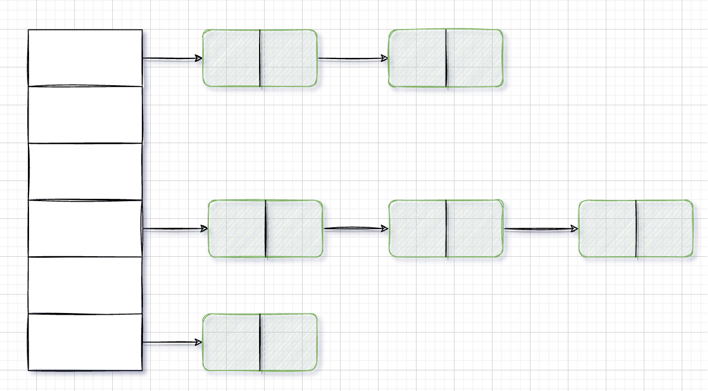
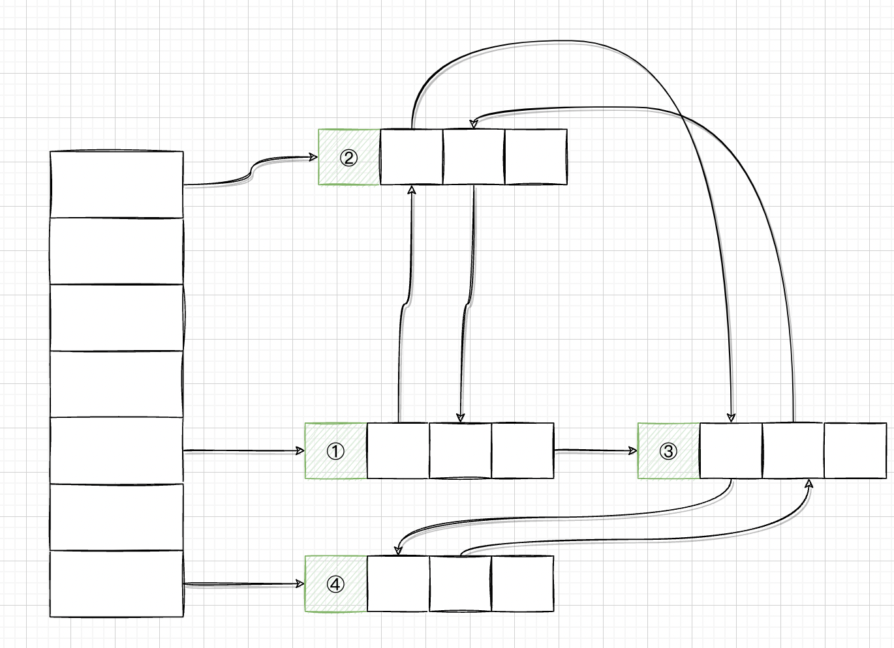
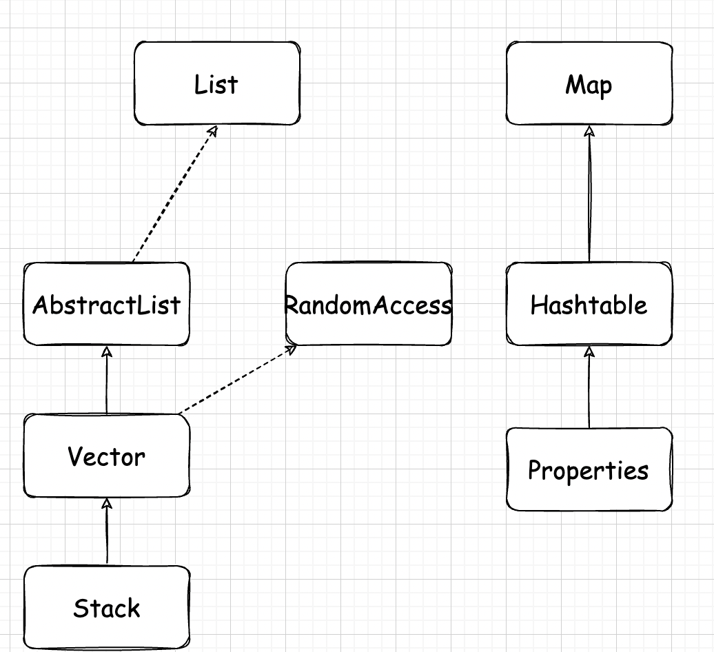

# 七. 集合

## 7.1 Java集合框架

Java 最初的版本只为最常用的数据结构提供了很少的一组类：Vector、Stack、Hashtable、BitSet 与 Enumeration 接口，其中的 Enumeration 接口提供了一种用于访问任意容器中各个元素的抽象机制。

随着 Java SE 1.2 问世，设计人员感到是推出一组功能完善的数据结构的时机了。面对一大堆相互矛盾的设计策略，他们希望让类库规模小且易于学习，而不希望像 C++ 的“标准模板库”(即 STL)那样复杂，但却又希望能够得到 STL 率先推出的“泛型算法”所具有的有点。他们希望将传统的类融入新的框架中。与所有的集合类库设计者一样，他们必须做到一些艰难的选择，于是，在整个设计过程中，他们做出了一些独具特色的设计决定。

与现代的数据结构类库的常见情况一样，Java 集合类库也将**接口(interface)**与**实现(implementation)**分离。

### 7.1.1 Collection接口

在 Java 类库中，集合类的基本接口是 Collection 接口。这个接口有两个基本方法：

```java
public interface Collection<E> {
    boolean add(E element);
    Iterator<E> iterator();
    ...
}
```

除了这两个方法之外，还有其他几个方法。

*add* 方法用于向集合中添加元素。如果添加元素确实改变了集合就返回 true，如果集合没有发生变化就返回 false。

*iterator* 方法用于返回一个实现了 Iterator 接口的对象。可以使用这个迭代器对象依次访问集合中的元素。


### 7.1.2 迭代器

Iterator 接口包含 4 个方法：

```java
public interface Iterator<E> {
    E next();
    boolean hasNext();
    void remove();
    default void forEachRemaining(Consumer<? super E> action)
}
```

通过反复调用 *next* 方法，可以逐个访问集合中的每个元素。但是，如果到达了集合的末尾，*next* 方法将抛出一个 NoSuchElementException。因此，需要在调用 *next* 之前调用 *hasNext* 方法。如果迭代器对象还有多个供访问的元素，这个方法就返回 true。如果想要查看集合中的所有元素，就请求一个迭代器，并在 *hashNext* 返回 true 时反复调用 *next* 方法。

```java
Collection<String> col = ...;
Iterator<String> it = col.iterator();
while (it.hasNext()) {
    String element = it.next();
    ...
}
```

用“for each”循环可以更加简单地表示同样的循环操作：

```java
for (String e : col) {
    ...
}
```

编译器简单地将“for each”循环翻译为带有迭代器的循环。

**“for each”循环可以与任何实现了 Iterable 接口的对象一起工作，这个接口只包含一个抽象方法：**

```java
public interface Iterable<E> {
    Iterator<E> iterator();
    ...
}
```

Collection 接口扩展了 Iterable 接口。因此，对于标准库中的任何集合都可以使用“for each”循环。

Iterator 接口的 *remove* 方法将删除上次调用 *next* 方法时返回的元素。在大多数情况下，在决定删除某个元素之前应该看一下这个元素是很具有实际意义的。然而，如果想要删除指定位置上的元素，仍然需要越过这个元素。

**更重要的是，对 *next* 方法和 *remove* 方法的调用具有互相依赖性。如果调用 *remove* 之前没有调用 *next* 将是不合法的。**如果这样做，将会抛出一个 `IllegalStateException` 异常。

如果想删除两个相邻的元素，不能直接地像这样调用：

```java
it.remove();
it.remove();  // Error
```

相反地，必须先调用 *next* 越过将要删除的元素。

```java
it.remove();
it.next();
it.remove();  // OK
```


### 7.1.3 泛型使用方法

由于 Collection 与 Iterator 都是泛型接口，可以编写操作任何集合类型的实用方法。

Java 类库的设计者认为：这些实用方法中的某些方法非常有用，应该将它们提供给用户使用。这样，类库的使用者就不必自己重新构建这些方法了。*contains* 就是这样一个实用方法。

事实上，Collection 接口声明了很多有用的方法，所有的实现类都必须提供这些方法。

当然，如果实现 Collection 接口的每一个类都要提供如此多的例行方法将是一件很烦人的事情。为了能够让实现者更容易地实现这个接口，Java 类库提供了一个类 AbstractCollection，它将基础方法 *size* 和 *iterator* 抽象化了，但是在此提供了例行方法。

此时一个具体的集合类可以扩展 AbstractCollection 类了。现在要由具体的集合类提供 *iterator* 方法。而 *contains* 方法已由 AbstractCollection 超类提供了。然而，如果子类有更加有效的方式实现 *contains* 方法，也可以由子类提供，就这点而言，没有什么限制。

*java.util.Collection\<E\>*：

- `Iterator<E> iterator()` 返回迭代器。
- `int size()` 返回元素个数。
- `boolean isEmpty()` 判空。
- `boolean contains(Object obj)` 是否包含。
- `boolean containsAll(Collection<?> other)` 判断是否包含 other 集合的所有元素。
- `boolean add(Object element)` 添加元素到集合中。如果改变了集合返回 true。
- `boolean addAll(Collection<? extends E> other)` 将 other 集合所有元素添加到集合中。

- `boolean remove(Object obj)` 删除元素。
- `boolean removeAll(Collection<?> other)` 批量删除。
- `default boolean removeIf(Predicate<? super E> filter)` 谓词条件删除元素。
- `void clear()` 清空集合。
- `boolean retainAll(Collection<?> other)` 删除所有与 other 集合不同的元素。
- `Object[] toArray()` 返回这个集合的对象。
- `<T> T[] toArray(T[] arrayToFill)` 如果 arrayToFill 足够大，就将集合中的元素填入这个数组中，剩余空间填补 null，否则，分配一个新数组，成员类型与 arrayToFill 成员类型一样，其长度等于集合大小，并填充集合元素。

*java.util.Iterator\<E\>*：

- `boolean hasNext()` 如果存在可访问的元素，返回 true。
- `E next()` 返回将要访问的下一个对象。如果已经到达了集合的尾部，将抛出一个 NoSuchElementException 异常。
- `void remove()` 删除上次访问的对象。这个方法必须紧跟在访问一个元素之后执行。如果上次访问之后，集合已经发生了变化，这个方法将抛出一个 `IllegalStateException`。


### 7.1.4 集合框架中的接口


集合有两个基本接口：Collection 和 Map。

LIst 是一个有序集合(ordered collection)。元素会增加到容器中的特定位置。可以采用两种方式访问元素：使用迭代器访问，或者使用一个整数索引来访问。后一种方法称为随机访问(Random Access)，因为这样可以按任意顺序访问元素。与之不同，使用迭代器访问时，必须顺序地访问元素。

ListIterator 接口是 Iterator 的一个子接口。它定义了一个方法用于在迭代器位置前面增加一个元素：

```java
void add(E element);
```

Set 接口等同于 Collection 接口，不过其方法的行为有更严谨的定义。集(Set)的 *add* 方法不允许增加重复的元素。要适当地定义集的 *equals* 方法：只要两个集包含同样的元素就认为是相等的，而不要求这些元素同样的顺序。*hashCode* 方法的定义要保证包含相同元素的两个集会得到相同的散列码。


## 7.2 具体的集合

除了以 Map 结尾的类之外，其他类都实现了 Collection 接口，而以 Map 结尾的类实现了 Map 接口。

<center>Java 库中的具体集合</center>

| 集合类型        | 描述                                               |
| --------------- | -------------------------------------------------- |
| ArrayList       | 一种可以动态增长和缩减的索引序列                   |
| LinkedList      | 一种可以在任何位置进行高效插入和删除操作的有序序列 |
| ArrayDeque      | 一种用循环数组实现的双端队列                       |
| HashSet         | 一种没有重复元素的无序集合                         |
| TreeSet         | 一种有序集                                         |
| EnumSet         | 一种包含枚举类型的集                               |
| LinkedHashSet   | 一种可以记住元素插入次序的集                       |
| PriorityQueue   | 一种允许高效删除最小元素的集合                     |
| HashMap         | 一种键/值关联的数据结构                            |
| TreeMap         | 一种键/值有序排列的映射表                          |
| EnumMap         | 一种键/值属于枚举类型的映射表                      |
| LinkedHashMap   | 一种可以记住键/值项添加次序的映射表                |
| WeakHashMap     | 一种其值无用武之地后可以被垃圾回收器回收的映射表   |
| IdentityHashMap | 一种用 == 而不是 equals 比较键值的映射表           |


### 7.2.1 链表

**链表(linked list)**可以进行高效的插入删除操作，链表将每个对象存放在独立的结点中，每个结点还存放着序列中下一个结点的引用。在 Java 语言中，所有链表实际上都是**双向链表**——即每个结点还存放着指向前驱结点的引用。

e.g. 链表插入删除元素：

```java
List<String> staff = new LinkedList<String>() {{
    add("Amy");
    add("Bob");
    add("Carl");
}};
Iterator it = staff.iterator();
String first = it.next();
String second = it.next();
it.remove();
```

但是链表和泛型集合之间有一个重要的区别。链表是一个**有序集合(ordered collection)**，每个对象的位置十分重要。LinkedList.add 方法将对象添加到链表的尾部。但是，常常需要将元素添加到链表中间。由于迭代器是描述集合中位置的，所以这种依赖于位置的 *add* 方法将由迭代器负责。只有对自然有序的集合使用迭代器添加元素才有实际意义。

要想在链表中添加元素，推荐使用 ListIterator 接口：

```java
List<String> staff = new LinkedList<String>() {{
    add("Amy");
    add("Bob");
    add("Carl");
}};
ListIterator<String> it = staff.listIterator();
it.next();
it.add("Juliet");
```

如果多次调用 *add* 方法，将按照提供的次序把元素添加到链表中。它们被依次添加到迭代器当前位置之前。

当用一个刚刚由 Iterator 方法返回，并且指向链表表头的迭代器调用 *add* 操作时，新添加的元素将变成列表的新表头。当迭代器越过链表的最后一个元素时，添加的元素将变成列表的新表尾。如果链表有 n 个元素，有 n + 1 个位置可以添加新元素。这些位置与迭代器的 n + 1 个可能得位置相对应。

*set* 方法用一个新元素取代调用 *next* 和 *previous* 方法返回的上一个元素。例如，下列代码将用一个新值取代链表的第一个元素：

```java
ListIterator<String> it = list.iterator();
String oldValue = it.next();
it.set(newValue);  // sets first element to newValue
```

可以想象，如果在某个迭代器修改集合时，另一个迭代器对其进行遍历，一定会出现混乱的状况。例如，一个迭代器指向另一个迭代器刚刚删除的元素前面，现在这个迭代器就是无效的，并且不应该使用。链表迭代器的设计使它能够检测到这种修改。如果迭代器发现它的集合被另一个迭代器修改了，或者是被集合自身的方法修改了，就会抛出一个 ConcurrentModificationException 异常。

e.g.

```java
List<String> list = ...;
ListIterator<String> it1 = list.iterator();
ListIterator<String> it2 = list.iterator();
it1.next();
it1.remove();
it2.next();  // throws ConcurrentModificationException
```

由于 it2 检测出这个链表被从外部修改了，所以对 it2.next 的调用抛出一个 ConcurrentModificationException 异常。

为了避免发生并发修改的异常，请遵循下述的简单规则：可以根据需要给容器附加许多的迭代器，但是这些迭代器只能读取列表。另外，再单独附加一个既能读又能写的迭代器。

有一种简单的方法可以检测到并发修改问题。集合可以跟踪改写操作(诸如添加或删除元素)的次数。每个迭代器都维护一个独立的计数值。在每个迭代器方法的开始处检查自己改写操作的计数值是否与集合的改写操作计数值一致。如果不一致，抛出一个 ConcurrentModificationException 异常。

对于并发修改列表的检测有一个奇怪的例外。链表只负责跟踪对列表的结构性修改，例如，添加元素、删除元素。*set* 方法不被视为结构性修改。可以将多个迭代器附加起来，所有的迭代器都调用 *set* 方法对现有结点的内容进行修改。

列表迭代器接口还有一个方法，可以告知当前位置的索引。实际上，从概念上讲，由于 Java 迭代器指向两个元素之间的位置，所以可以同时产生两个索引：*nextIndex* 方法返回下一次调用 *next* 方法时返回元素的整数索引。*previousIndex* 方法返回下一次调用 *previous* 方法时返回元素的整数索引。当然这个索引只比 nextIndex 返回的索引值小 1。这两个方法的效率非常高，这是因为迭代器保持着当前位置的计数值。

如果链表中只有很少几个元素，就完全没有必要为 *get* 方法和 *set* 方法的开销而烦恼。使用链表的唯一理由就是尽可能地减少在列表中间插入或删除元素所付出的代价。如果列表只有少数几个元素，就完全可以使用 ArrayList。

前列建议避免使用以整数索引表示链表中位置的所有方法。如果需要对集合进行随机访问，就使用数组或 ArrayList，而不使用链表。

*java.util.List\<E\>*：

- `ListIterator<E> listIterator()` 返回列表迭代器。
- `ListIterator<E> listIterator(int index)` 指定索引返回列表迭代器。
- `void add(int i, E e)` 添加元素。
- `void addAll(int i, Collection<? extends E> elements)` 批量插入。
- `E remove(int i)` 删除元素。
- `E get(int i)` 获取元素。
- `E set(int i, E element)` 设置元素。
- `int indexOf(Object element)` 查找元素第一次出现的位置。
- `int lastIndexOf(Object element)` 返回指定元素最后出现位置。

*java.util.ListIterator\<E\>*：

- `void add(E newElement)` 在当前位置插入元素。
- `void set(E newElement)` 用新元素取代 *next* 或 *previous* 上次访问的元素，如果在 *next* 或 *previous* 上次调用之后列表结构被修改了，将抛出一个 `IllegalStateException` 异常。
- `boolean hasPrevious()` 当反向迭代列表时，还有可供访问的元素，返回 true。
- `E previous()` 返回前一个对象。如果已经达到了列表的头部，就抛出一个 `NoSuchElementsException` 异常。
- `int nextIndex()` 返回下一次调用 *next* 方法时将返回的元素索引。
- `int previousIndex()` 返回下一次调用 *previouse* 方法时将返回的元素索引。

*java.util.LinkedList*：

- `LinkedList()`
- `LinkedList(Collection<? extends E> elements)` 拷贝构造。
- `void addFirst(E element)`
- `void addLast(E element)` 头部或尾部插入。
- `E getFirst()`
- `E getLast()` 返回列表头部或尾部。
- `E removeFirst()`
- `E removeLast()` 删除并返回头部或尾部。


### 7.2.2 数组列表

List 接口用于描述一个有序集合，并且集合中每个元素的位置十分重要。有两种访问元素的协议：一种用迭代器，另一种使用 *get* 和 *set* 方法随机访问每个元素。后者不适用于链表，但对数组却很有用。集合类库提供了 ArrayList 类，这个类实现了 List 接口。ArrayList 封装了一个动态分配的对象数组。


### 7.2.3 散列集

链表和数组可以按照人们的意愿排列元素的次序。但是，如果要查看某个指定的元素，却又忘记了它的位置，就需要访问所有元素，直到找到为止。如果集合中包含元素很多，将会十分耗费性能，如果不在意元素的顺序，可以有几种能够快速查找元素的数据结构。其缺点是无法控制元素出现的次序。它们将按照有利于操作目的的原则组织数据。

有一种众所周知的数据结构，可以快速地查找所需要的对象，这就是**散列表(hash table)**。散列表为每个对象计算一个整数，称为**散列码(hash code)**。散列码是由对象的实例域产生的一个整数。更准确的说，具有不同数据域的对象将产生不同的散列码。

如果自己定义了类，就要负责这个类的 *hashCode* 方法。注意，自己实现的 *hashCode* 方法应该与 *equals* 方法兼容，即如果 `a.equals(b)` 为 true，a 与 b 必须具有相同的散列码。

现在最重要的问题是散列码要快速地计算出来，并且这个计算只要与散列的对象有关，与散列表中的其他对象无关。

在 Java 中，散列表用链表数组实现。每个列表被称为**桶(bucket)**。想要查找表中对象的位置，就要先计算它的散列码，然后与桶的总数取余，所得到的结果就是保存这个元素的桶的索引。

散列表如下图：



当然，有时候也会遇到桶被占满的情况，这也是不可避免的。这种现象被称为**散列冲突(hash collision)**。这时，需要用新对象与桶中的所有对象进行比较，查看这个对象是否已经存在。如果散列码是合理且随机分布的，桶的数目也足够大，需要比较的次数就会很少。

> 在 Java 8 中，桶满时会从链表变成平衡二叉树。如果选择的散列函数不当，会产生很多冲突，或者如果有恶意代码试图在散列表中填充很多个相同散列码的值，这样就会降低性能。

如果想要更多地控制散列表的运行性能，就要指定一个初始的桶数。桶数是指用于收集具有相同散列值的桶的数目。如果要插入散列表中的元素太多，就会增加冲突的可能性，降低运行性能。

如果大致知道最终会有多少个元素要插入到散列表中，就可以设置桶数。通常，将桶数设置为预计元素个数的 75% ~ 150%。有些研究人员认为：尽管还没确凿的证据，但是好将桶数设置为一个素数，以防键的集聚。**标准类库使用的桶数是 2 的幂，默认值为 16(为表大小提供的任何值都将自动地被转换为 2 的下一个幂)。**

当然，并不是总能够知道需要存储多少个元素的，也有可能最初的估计过低。如果散列白太满，就需要**再散列(rehashed)**。如果要对散列表再散列，就需要创建一个桶数更多的表，并将所有的元素插入到这个新表中，然后丢弃原来的表。**装填因子(load factor)**决定何时对散列表进行再散列。例如，如果装填因子为 0.75(默认值)，而表中超过 75% 的位置已经填入元素，这个表就会用双倍的桶数自动地进行再散列。对于大多数应用程序来说，装填因子为 0.75 是比较合理的。

散列表可以用于实现几个重要的数据结构。其中最简单的是 set 类型。set 是没有重复元素的元素集合。set 的 *add* 方法首先在集中查找要添加的对象，如果不存在，就将这个对象添加进去。

Java 集合类库提供了一个 HashSet 类，它实现了基于散列表的集。可以用 *add* 方法添加元素。*contains* 方法已经被重新定义，用来快速查看是否某个元素已经出现在集中。它只在某个桶中查找元素，而不必查看集合中的所有元素。

散列集迭代器将依次访问所有的桶。由于散列将元素在表的各个位置上，所有访问他们的顺序几乎是随机的。只有不关心集合中元素的顺序时才应该使用 HashSet。

*java.util.HashSet\<E\>*：

- `HashSet()`
- `HashSet(Collection<> extends E> elements)` 拷贝构造。
- `HashSet(int initialCapacity)` 初始化容量。
- `HashSet(int initialCapacity, float loadFactor)` 制定初始化容量和填装因子。


### 7.2.4 树集

TreeSet 类与散列集十分类似，不过，它比散列集有所改进。树集是一个**有序集合(sorted collection)**。可以以任意顺序讲元素插入集合中。在对集合进行遍历时，每个值将自动地按照排序后的顺序呈现。

正如 TreeSet 类名所示，排序是用树结构完成的(当前实现使用的是红黑树)，每次将一个元素添加到树中时，都被放置在正确的排序位置上。因此，迭代器总是以排好序的顺序访问每个元素。

*java.util.TreeSet\<E\>*：

- `TreeSet()`
- `TreeSet(Comparator<? super E> comparator)`
- `TreeSet(Collection<? extends E> elements)`
- `TreeSet(SortedSet<E> s)`

*java.util.SortedSet*：

- `Comparator<? super E> comparator()` 返回用于对元素进行排序的比较器。如果元素用 Comparable 接口的 *compareTo* 方法进行比较则返回 null。
- `E first()`
- `E last()` 返回有序集中的最小元素或最大元素。

*java.util.NavigableSet\<E\>*：

- `E higher(E value)`
- `E lower(E value)` 返回大于 value 的最小元素或小于 value  的最大元素，如果没有这样的元素则返回 null。
- `E ceiling(E value)`
- `E floor(E value)`  返回大于等于 value 的最小元素或小于等于 value 的最大元素，如果没有这样的元素则返回 null。
- `E pollFirst()`
- `E pollLast()` 删除并返回这个集中的最大元素或最小元素，这个集为空时返回 null。
- `Iterator<E> descendingIterator()` 返回一个按照递减或顺序遍历集中元素的迭代器。

```java
public static void main(String[] args) {
    SortedSet<Item> parts = new TreeSet<>();
    parts.add(new Item("Toaster", 1234));
    parts.add(new Item("Widget", 4562));
    parts.add(new Item("Modem", 9912));
    System.out.println(parts);

    NavigableSet<Item> sortByDescription = new TreeSet<>(Comparator.comparing(Item::getDescription));
    sortByDescription.addAll(parts);
    System.out.println(sortByDescription);
}
```


### 7.2.5 队列与双端队列

队列可以让人们有效地在尾部添加一个元素，在头部删除一个元素。有两个端头的队列，即**双端队列**，可以让用户有效地在头部或尾部添加或删除元素。**不支持在队列中间添加元素**。在 Java 6 中引入了 Deque 接口，并由 ArrayDeque 和 LinkedList 类实现。这两个类都提供了双端队列，而且在必要时间可以增加队列的长度。

```java
public static void main(String[] args) {
    Queue<Integer> queue = new ArrayDeque();
    queue.addFirst(1);
    queue.addLast(2);
    Integer a = queue.getFirst();
    Integer b = queue.getLast();
}
```


### 7.2.6 优先级队列

优先级队列(Priority Queue)中的元素可以按照任意的顺序插入，却总是按照排序的顺序进行检索。也就是说，无论何时调用 *remove* 方法，总会获得当前优先队列中最小的元素。然而，优先队列并没有对所有的元素进行排序。如果用迭代器的方式处理这些元素，并不需要对它们进行排序。优先级队列使用了一个优雅而且高效的数据结构，称为**堆(heap)**。堆是一个可以自我调整的二插树，对树执行添加和删除操作，可以让最小的元素移动到根位置，而不必花时间对元素进行排序。

与 TreeSet 一样，一个优先队列既可以保存实现了 Comparable 接口的类对象，也可以保存在构造器中提供的 Comparator 对象。

使用优先队列的典型示例就是任务调度。每一个任务有一个优先级，任务以随机顺序添加到队列中。每当启动一个新的任务时，都将优先级最高的任务从队列中删除。

```java
PriorityQueue<LocalDate> pq = new PriorityQueue<>();
pq.add(LocalDate.of(1906, 12, 9)); // G. Hopper
pq.add(LocalDate.of(1815, 12, 10)); // A. Lovelace
pq.add(LocalDate.of(1903, 12, 3)); // J. von Neumann
pq.add(LocalDate.of(1910, 6, 22)); // K. Zuse

System.out.println("Iterating over elements...");
for (LocalDate date : pq) {
    System.out.println(date);
}
System.out.println("Removing elements...");
while (!pq.isEmpty()) {
    System.out.println(pq.poll());
}
```

*java.util.PriorityQueue\<E\>*：

- `PriorityQueue(Comparator<? super E> c)` 创建一个优先队列，指定比较器。


## 7.3 映射

集是一个集合，它可以快速地查找现有的元素。但是，要查找一个元素，需要有要查找元素的精确副本。这不是一种非常通用的查找方式。通常，我们知道某些键的信息，并想要查找与之对应的元素。**映射(map)**数据结构就是为此设计的。映射用来存放键/值对。如果提供了键，就能查找到值。

### 7.3.1 基本映射操作

Java 类库为映射提供了两个通用的视线：HashMap 和 TreeMap。这两个类都实现了 Map 接口。

散列映射对键进行散列，树映射用键的整体顺序对元素进行排序，并将其组织成搜索树。散列或比较函数**只能作用于键**。与键关联的值不能进行散列比较。

应该选择散列映射还是树映射？与集一样，散列稍微快一点，如果不需要按照排列顺序访问键，就是最好最好选择散列。

每当往映射中添加对象时，必须同时提供一个键。如果映射中没有与给定键对应的信息，get 将返回 null。

null 返回值可能并不方便。有时可以有一个好的默认值，用作映射中不存在的键。然后使用 *getOrDefault* 方法。

键必须是唯一的。不能同一个键存放两个值。如果对同一个键两次调用 *put* 方法，第二个值就会取代第一个值。实际上，*put* 将返回用这个键参数存储的上一个值。

*remove* 方法用于从映射中删除给定键对应的元素。*size* 方法用于返回映射中的元素个数。

要迭代处理映射的键和值，最容易的方法时使用 *forEach* 方法。可以提供一个接受键和值的 lambda 表达式。映射中的每一项会依次调用这个表达式：

```java
map.forEach((k, v) -> {
    ...
});
```

*java.util.Map\<K, V\>*：

- `V get(Object key)` 获取值，没有则返回 null。

- `default V getOrDefault(Object key, V defaultValue)` 获取值，没有则返回 defaultValue。

- `V put(Object key, V value)` 存放键值，如果存在则覆盖。HashMap 中键可以为 null，但是只能有一个唯一的 null 键。

- `void putAll(Map<? extends K, ? extends V> entries)` 批量添加键值。

- `boolean containsKey(Object key)` 判断是否存在 key。

- `boolean containsValue(Object value)` 判断是否存在 value。

- `default void forEach(BiConsumer<? super K, ? super V>)` 使用 lambda表达式迭代映射。

  

### 7.3.2 更新映射项

处理映射时的一个难点就是更新映射项。正常情况下，可以得到一个键关联的原值，完成更新，再放回更新后的值。不过，必须考虑一个特殊情况，即键第一次出现。

e.g. 统计单词出现的次数

```java
public static void main(String[] args) {
    String[] words = ...;
    Map<String, Integer> map = new HashMap<>();
    for (String word : words) {
        if (map.containsKey(word)) {
            map.put(word, map.get(word) + 1);
        } else {
            map.put(word, 1);
        }
    }
    System.out.println(map);
}
```

不过还可以用一种更优雅的方式简化代码：

```java
// 如果键原先不存在，就设置为 1，假如存在那么就计算之和
for (String word : words) {
    map.merge(word, 1, Integer::sum);
}
```

*java.util.Map\<K, V\>*：

- `default V merge(K key, V value, BiFunction<? super V, ? super V, ? extends V> remappingFunction)` 如果 key 与一个非 null 值 v 关联，将函数应用到 v 和 value，将 key 与结果关联，或者如果结果为 null， 则删除这个键。否则，将 key 与 value 关联，返回 *get(key)*。
- `default V compute(K key, BiFunction<? super K, ? super V, ? extends V> remappingFunction)` 将函数应用到 key 和 *get(key)*。将 key 与结果关联，或者如果结果为 null，则删除这个键。返回 *get(key)*。
- `default V computeIfPresent(K key, BiFunction<? super K, ? super V, ? extends V>  remappingFunction)` 如果 key 与一个非 null 值 v 关联，将函数应用到 key 和 v，将 key 与结果关联，或者如果结果为 null，则删除这个键。返回 *get(key)*。
- `default void replaceAll(BiFuntion<? super K, ? super V, ? extends V> function)` 在所有映射项上应用函数。将键与非 null 结果关联，对于 null 结果，则将相应的键删除。


### 7.3.3 映射视图

集合框架不认为映射本身是一个集合。不过可以得到映射的视图(view)——这是实现了 Collection 接口或者某个子接口的对象。

有 3 种视图：键集、值集合以及键/值对集。键和键/值对可以构成一个集，因为映射中一个键只能有一个副本。下面的方法：

```java
Set<K> keySet();
Collection<V> values();
Set<Map.Entry<K, V>> entrySet();
```

会分别返回这 3 个视图。

需要说明的是，keySey 不是 HashSet 或 TreeSet，而是实现了 Set 接口的另外某个类的对象。Set 接口扩展了 Collection 接口。因此，可以像使用集合一样使用 keySet。

e.g. 枚举一个映射的所有键：

```java
Set<String> keys = map.keySet();
for (String key : keys) {
    ...
}
```

如果想同时查看键和值，可以通过枚举条目来避免查找值：

```java
for (Map.Entry<String, Integer> entry : map.entrySet()) {
    String key = entry.getKey();
    Integer Value = entry.getValue();
    ...
}
```

如果在键集视图上调用迭代器的 *remove* 方法，实际上会从映射中删除这个键和它关联的值。**不过，不能向键集视图增加元素。**另外，如果增加一个键而没有同时增加值也是没有意义的。如果试图调用 *add* 方法，它会抛出一个 UnsupportedOperationException。条目集视图有同样的限制，尽管理论上增加一个新的键/值好像是有意义的。


### 7.3.4 弱散列映射

在集合类库中有几个专用的映射类。

设计 WeakHashMap 类是为了解决一个有趣的问题。如果有一个值，对应的键已经不再使用了，将会出现什么情况？假定对某个键的最后一次引用已经消亡了，不再有任何途径引用这个值的对象了。但是，由于在程序中的任何部分没有再出现这个键，所以这个键/值对无法从映射中删除。为什么垃圾回收器不能够删除它们？难道删除无用的对象不是垃圾回收器的工作吗？

垃圾回收器跟踪**活动的对象**。只要映射对象时活动的，其中的所有桶也是活动的，它们不能被回收。因此，需要由程序负责从上期存活的映射表中删除那些无用的值。或者使用 WeakHashMap 完成这件事情。当对键的唯一引用来自散列条目时，这一数据结构将与垃圾回收器协同工作一起删除键/值对。

WeakHashMap 使用**弱引用(weak references)**保存键。WeakReference 对象将引用保存到另外一个对象中，在这里，就是散列键。对于这种类型的对象，垃圾回收器用一种特有的方式进行处理。通常，如果垃圾回收器发现某个特定的对象已经没有他人引用了，就将其回收。然而，如果某个对象只能由 WeakReference 将周期性地检查队列，以便找出新添加的弱引用。一个弱引用进入队列意味着这个键不再被他人使用，并且已经被收集起来。于是，WeakHashMap 将删除对应的条目。


### 7.3.5 链接散列与映射

LinkedHashSet 与 LinkedHashMap 类用来记住插入元素项的顺序。这样就可以避免在散列表中的项从表面上看是随机排列的。当条目插入到表中时，就会并入到双向链表中。


e.g. 向链接散列表中插入数据

```java
Map<Integer, String> map = new LinkedHashMap<>() {{
    put(1, "cat");
    put(2, "dog");
    put(3, "bird");
}};
for (Map.Entry<Integer, String> entry : map.entrySet()) {
    System.out.println(entry.getKey() + ": " + entry.getValue());
}
// 1: cat
// 2: dog
// 3: bird
```

链接散列映射将用**访问顺序**，而不是插入顺序，对映射条目进行迭代。每次调用 *get* 或 *put*，受到影响的条目将从当前位置删除，并放到链表的尾部(只有条目在链表中的位置会受影响，而散列表中的插入不会受影响。一个条目总位于键散列码对应的桶中)。

访问顺序对于实现高速缓存的**“LRU(最贱最少使用)”**原则十分重要。例如，可能希望将访问频率最高的元素放在内存中，而访问频率低的元素则从数据库读取。当在表中找不到元素项且表又已经满时，可以将迭代器加入到表中，并将枚举的前几个元素删除掉。这些是近期最少使用的几个元素。




### 7.3.6 枚举集与映射

EnumSet 是一个枚举类型元素的高效实现。由于枚举类型只有有限个实例，所以 EnumSet 内部使用位序列实现。如果对应的值在集中，则相应的位被置为 1。

EnumSet 类没有公共的构造器。可以使用静态工厂构造这个集：

```java
enum WeekDay { MONDAY, TUESDAY, WEDNESDAY, THURSDAY, FRIDAY, SATURDAY, SUNDAY };
EnumSet<WeekDay> always = EnumSet.allOf(WeekDay.class);
EnumSet<WeekDay> never = EnumSet.noneOf(WeekDay.class);
EnumSet<WeekDay> workDay = EnumSet.range(WeekDay.MONDAY, WeekDay.FRIDAY);
EnumSet<WeekDay> mwf = EnumSet.of(WeekDay.MONDAY, WeekDay.WEDNESDAY, WeekDay.FRIDAY);
```

可以使用 Set 接口的常用方法来修改 EnumSet。

EnumMap 是一个键类型为枚举类型的映射。它可以直接且高效地用一个值数组实现。在使用时，需要在构造器中指定键类型：

```java
EnumMap<WeekDay, Employee> personInCharge = new EnumMap<>(WeekDay.class);
```


### 7.3.7 标识散列映射

IdentityHashMap 类有特殊的作用。在这个类中，键的散列值不是用 hashCode 方法计算的，而是用 System.identityHashCode 方法计算的。这是 Object.hashCode 方法根据对象的内存地址来计算散列码时所使用的方式。而且，在这两个对象进行比较时，IdentityHashMap 类使用 `==`，而不使用 *equals* 方法。

也就是说，不同的键对象，即使内容相同，也被视为是不同的对象。在实现对象遍历算法时，这个类非常有用，可以用来跟踪每个对象的遍历状况。


## 7.4 视图与包装器

通过使用**视图(views)**可以获得其他的实现了 Collection 接口和 Map 接口的对象。映射类的 keySet 方法就是这样一个示例。初看起来，好像这个方法创建了一个新集，并将映射中的所有键都填进去了，然后返回这个集。但是，情况并非如此。取而代之的是：keySet 方法返回一个实现 Set 接口的类对象，这个类的方法对原映射进行操作。这种集合称为**视图**。

### 7.4.1 轻量级集合包装器

Arrays 类静态方法 *asList* 将返回一个包装了普通 Java 数组的 List 包装器。这个方法可以将数组传递给一个期望得到列表或集合参数的方法。例如：

```java
Card[] cardDeck = new Card[52];
...
List<Card> list = Arrays.asList(cardDeck);    
```

返回的对象不是 ArrayList。它是一个视图对象，带有访问底层数组的 *get* 和 *set* 方法。改变数组大小的所有方法都会抛出 UnsupportedOperationException 异常。

asList 方法可以接收可变数目的参数：

```java
List<String> list = Arrays.asList("a", "b", "c");
```


### 7.4.2 子范围

可以为很多集合建立子范围(subrange)视图。例如，假设有一个列表 staff，想从中取出第 10 个 ~ 第 19 哥元素。可以使用 *subList* 方法来获得一个列表的子范围视图。

```java
List group = staff.subList(10, 20);
```

第一个索引包含在内，第二个索引不包含在内。这与 String 类的 *subString* 操作中的参数情况相同。可以将任何操作应用于子范围，并且能够自动地反映整个列表的情况。例如，可以删除整个子范围：

```java
group2.clear();
```

现在，元素自动地从 staff 列表中清除了，并且 group2 为空。

 对于有序集合和映射，可以使用排序而不是元素位置建立子范围。SortedSet 接口声明了 3 个方法：

```java
SortedSet<E> subSet(E from, E to);
SortedSet<E> headSet(E to);
SortedSet<E> tailSet(E from);
```

这些方法将返回大于等于 from 且小于 to 的所有元素子集。有序映射也有也有类似的方法：

```java
SortedMap<K, V> subMap(K from, V to);
SortedMap<K, V> headMap(V to);
SortedMap<K, V> tailMap(K from);
```


### 7.4.3  不可修改的视图

Collections 还有几个方法，用于产生集合的**不可修改视图(unmodified views)**。这些视图对现有集合增加了一个运行时的检查。如果发现视图对集合进行修改，就抛出一个异常，同时这个集合将保持未修改的状态。

可以使用以下 8 种方式获得不可修改的视图：

```
Collections.unmodifiableCollection
Collections.unmodifiableList
Collections.unmodifiableSet
Collections.unmodifiableSortedSet
Collections.unmodifiableNavigableSet
Collections.unmodifiableMap
Collections.unmodifiableSortedMap
Collections.unmodifiableNavigableMap
```

每个方法都定义与一个接口。

例如，假设想要查看某部分代码，但又不触及某个集合的内容，就可以进行下列操作：

```java
List<String> staff = new LinkedList<>();
...
lookAt(Collections.unmodifiableList(staff));
```

Collections.unmodifiableList 方法返回一个实现 List 接口的类对象。其访问器方法将从 staff 集合中获取值。当然，*lookAt* 方法可以调用 List 接口中的所有方法，而不只是访问器。但是所有的更改器方法已经被重新定义为抛出一个 UnsupportedOperationException 异常，而不是将调用传递给底层集合。

不可修改视图并不是集合本身不可修改。仍然可以通过集合的原始引用对集合进行修改。并且仍然可以让集合的元素调用更改器方法。

由于视图只是包装**接口**而不是实际的集合对象，所以只能访问接口中定义的方法。例如，LinkedList 类有一些非常方便的方法，*addFirst* 和 *addList*，它们都不是 List 接口的方法。不能通过不可修改视图进行访问。


### 7.4.4 同步视图

如果由多个线程访问集合，就必须确保集不会被意外地破坏。例如，如果一个线程视图将元素添加到散列表中，同时另一个线程正在对散列表进行再散列，其结果将是灾难性的。

类库的设计者使用视图机制来确保常规集合的线程安全，而不是实现线程安全的集合类。例如，Collections 类的静态方法 *synchronizedMap* 可以将任何一个映射表转换成具有同步访问方法的 Map：

```java
Map<String, Employee> map = Collections.synchronizedMap(new HashMap<String, Employee>());
```


### 7.4.5 受查视图

“受查”视图用来对泛型类型发生问题时提供调试支持。受查视图可以探测这类问题。下面定义了一个安全列表：

```java
List<String> safeStrings = Collections.checkedList(strings, String.class);
```

视图的 *add* 方法将检测插入的对象是否属于给定的类。如果不属于给定的类，就立即抛出一个 ClassCastException 异常。这样做的好处是错误可以在正确的位置得以报告。


### 7.4.6 关于视图的说明

通常，视图有些局限性，即可能**只可以读、无法改变大小、只支持删除而不支持插入，这些与映射的键试图情况相同**。如果试图进行不恰当的操作，受限制的视图就会抛出一个 UnsupportedOperationException。


## 7.5 算法

泛型集合接口有一个很大的优点，即算法只需要实现一次、例如，考虑以下计算集合中最大元素这样一个简单的算法。使用传统的方式，程序设计人员可能会使用循环实现这个算法。

编写这些循环代码有些乏味，并且也很容易出错。是否存在严重错误吗？对于空容器循环能正常工作吗？对于只含有一个元素的容器又会发生什么情况？那么就可以调用集合工具库提供的API：

```java
static <T extends Comparable> T max(Collection<T> col)
```

现在就可以使用这个方法计算机链表、数组列表最大元素了。


### 7.5.1 排序与混排

Collections 类中 *sort* 方法可以对实现了 List 接口的集合进行排序：

```java
List<Integer> list = new LinkedList<>();
...
Collections.sort(list);    
```

 这个方法假定列表元素实现了 Comparable 接口。如果想采用其他方式对列表进行排序，可以使用 Collections 类重载方法 *sort*：

```java
Collections.sort(list, (o1, o2) -> o1 - o2);
// Collections.sort(list, Comparator.comparing(o -> o));
```

如果想按照**降序**对列表进行排序，可以使用一种非常方便的静态方法 *Comparator.reverseOrder*。这个方法将返回一个比较器，比较器则返回 `b.compareTo(a)`。例如：

```java
staff.sort(Comparator.reverseOrder());
```

这个方法将根据元素类型的 *compareTo* 方法给定排序顺序，按照逆序对列表 staff 进行排序。同样，

```java
staff.sort(Comparator.comparingDouble(Employee::getSalary).reversed());
```

将按照工资逆序排序。

Collections 类有一个算法 *shuffle*，其功能与排序刚好相反，即随机地混排列表中元素的顺序：

```java
List<Integer> list = new ArrayList<>();
...
Collections.shuffle(list);    
```

如果提供的列表没有实现 RandomAccess 接口，*shuffle* 方法将元素复制到数组中，然后打乱数组元素的顺序，最后再将打乱顺序后的元素复制回列表。


### 7.5.2 二分查找

要想在数组中查找一个对象，通常需要依次访问数组中的每个元素，直到找到匹配的元素为止。然而，如果数组是有序的，就可以直接查看位于数组中间的元素，看一看是否大于要查找的元素，这就是所谓的二分查找。

Collections 类的 *binarySearch* 方法实现了这个算法。注意，集合必须是排好的，否则算法将返回错误的答案。要想查找某个元素，必须提供集合以及要查找的元素。如果如果集合没有采用 Comparble 接口的 *compareTo* 方法进行排序，就还要提供一个比较器对象：

```java
i = Collections.binarySearch(c, element);
i = Collections.binarySearch(c, element, comparator);
```

如果 *binarySearch* 方法返回的数值大于等于 0，则表示匹配对象的索引。也就是说，`c.get(i)` 等于在这个比较顺序下的 element。如果返回负值，则表示没有匹配的元素。但是，可以利用返回计算应该将 element 插入到集合的哪个位置，以保持集合的有序性。插入的位置是：

```java
insertionPoint = - i - 1;
```

*java.util.Collections*：

```java
static <T extends Object & Comparable<? super T>> T min(Collection<? extends T> coll);
static <T> T min(Collection<? extends T> coll, Comparator<? super T> comp);
static <T extends Object & Comparable<? super T>> T max(Collection<? extends T> coll);
static <T> T max(Collection<? extends T> coll, Comparator<? super T> comp);
static <T> void copy(List<? super T> dest, List<? extends T> src);
static <T> void fill(List<? super T> list, T obj);
static <T> boolean addAll(Collection<? super T> c, T... elements);
static <T> boolean replaceAll(List<T> list, T oldVal, T newVal);
static int indexOfSubList(List<?> source, List<?> target);
static int lastIndexOfSubList(List<?> source, List<?> target);
static void swap(List<?> list, int i, int j);
static void reverse(List<?> list);
static void rotate(List<?> list, int distance);  // 指定步长旋转列表
static int frequency(Collection<?> c, Object o);  // 返回和 o 相同的个数
static boolean disjoint(Collection<?> c1, Collection<?> c2);  // 没有共同元素返回 true
```

*java.util.Collection\<T\>*：

```java
default boolean removeIf(Predicate<? super E> filter);
```


### 7.5.3 集合与数组的转换

有时候需要在传统的数组和比较现代的集合之间进行转换。

如果需要把一个数组转换为集合，ArrayList 包装器可以达到这个目的。例如：

```java
String[] values = ...;
Set<String> staff = new HashSet<>(Arrays.asList(values));
```

从集合中得到数组会更困难一些。当然，可以使用 *toArray* 方法：

```java
Object[] values = staff.toArray();
```

不过这样做的结果是一个对象数组。尽管你知道集合中包含一个特定类型的对象，但是不能使用强制类型转换：

```java
String[] values = staff.toArray();  // Error
```

*toArray* 方法返回的数组是一个 Object[] 数组，不能改变它的类型。实际上，必须使用 *toArray* 方法的变体形式，提供一个所需类型而且长度为 0 的数组。这样一来，返回的数组就会创建为相同的数组类型：

```java
String[] values = staff.toArray(new String[0]);
```


## 7.6 遗留的集合

在集合框架出现之前已经存在大量“遗留的”容器类。




### 7.6.1 Hashtable类

Hashtable 类与 HashMap 类的作用一样。实际上，它们拥有相同的接口。与 Vector 类的方法一样。Hashtable 的方法也是同步的。如果对同步性或遗留代码的兼容性没有任何要求，就应该使用 HashMap。如果需要并发访问，则要使用 ConcurrentHashMap。


### 7.6.2 枚举

遗留集合使用 Enumeration 接口对元素序列进行遍历。Enumeration 接口有两个方法，即 *hasMoreElements* 和 *nextElement* 方法。这两个方法与 Iterator 接口的 *hasNext* 方法和 *next* 方法十分类似：

e.g. Hashtable 类的 *elements* 方法将产生一个用于描述表中各个枚举值的对象：

```java
Enumeration<Integer> e = list.elements();
while (e.hasMoreElements()) {
    Integer a = e.nextElement();
}
```


### 7.6.3 属性映射

**属性映射(property map)**是一个类型非常特殊的映射结构。有 3 个特性：

- 键与值都是字符串。
- 表可以保存到一个文件中，也可以从文件中加载。
- 使用一个默认的辅助表。

实现属性映射的类称为 Properties。

*java.util.Properties*：

```java
Properties();
Properties(Properties defaults);
String getProperty();
String getProperty(String key, String defaultValue);
void load(InputStream in);
void store(OutputStream out, String commentString);
```


### 7.6.4 栈

从 1.0 版本开始，标准类库中就包含了 Stack 类。但是，Stack 类扩展 Vector 类，从理论角度上看，Vector 类并不太令人满意，它可以让栈使用不属于栈操作的 *insert* 和 *remove* 方法，即可以在任何地方进行插入或删除操作，而不仅仅在栈顶。

*java.util.Stack\<E\>*：

```java
E push(E item);
E pop();
E peel();
```


### 7.6.5 位集

Java 类库的 BItSet 类用于存放一个位序列。如果需要高效地存储位序列就可以使用位集。由于位集将包装在字节里，所以，使用位集要比使用 Boolean 对象的 ArrayList 更加高效。

BitSet 类提供了一个便于读取、设置或清除各个位的接口。使用这个接口可以避免屏蔽和其他麻烦的位操作。如果将这些位存储在 int 或 long 变量中就必须进行这些繁琐的操作。

*java.util.BitSet*：

```.java
BitSet(int initialCapacity);  // 创建一个位集
int length();
boolean get(int bit);  // 获得一个位
void set(int bit);  // 设置一个位
void clear(int bit);  // 清除一个位
void and(BitSet set);  // 这个位集与另一个位集进行逻辑 AND
void or(BitSet set);  // 这个位集与另一个位集进行逻辑 OR
void xor(BitSet set);  // 这个位集与另一个位集进行逻辑 XOR
void andNot(BitSet set);  // 清除这个位集中对应另一个位集中设置的所有位
```