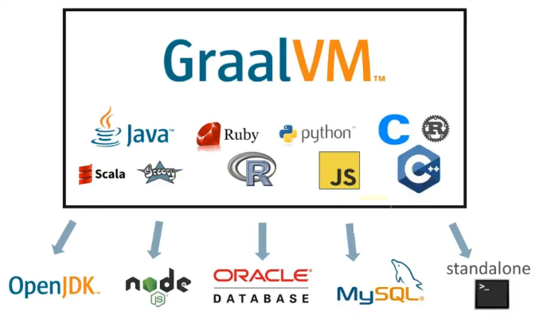

# JDK9+新特性4

# JAVA15

## 概述

2020年9月15日,java15正式发布,(风平浪静的一个版本)共有14个JEP,是时间驱动形式发布的第六个版本.相关文档: https://openjdk.java.net/projects/jdk/15/

一个孵化器阶段,三个预览,两个废弃和两个移除：

`JDK5` :enum 泛型 自动装箱拆箱 可变参数 增强循环

JDK6 : 支持脚本语言 JDBC4.0API

JDK7 :支持trycatch-with-resources switch语句新增String支持 NIO2.0

`JDK8` : lambda StreamAPI 新的时间日期API 方法引用 构造器引用

JDK9 :模块化 jShell

JDK10:局部变量类型推断

`JDK11`:ZGC  Epsilon GC 

JDK12:switch表达式 ShenandoahGC 增强G1

JDK13:switch表达式引入 yield 文本块

JDK14:instanceof模式识别 Records 弃用ParallelScavenge+Serial GC组合 删除CMS

## 语法

### 密封类

通过密封的类和接口来增强Java编程语言,这是新的预览特性,用于限制超类的使用密封的类和接口限制其他可继承或者实现他们的其他类或接口.

允许类或接口的开发者来控制那些代码负责实现,提供了比限制使用超类的访问修饰符声明方式更多选择,并通过支持对模式的详尽分析而支持模式匹配的未来发展

在java中,类层次构造通过集成实现代码的重用,父类的方法可以被许多子类继承.但是,类层次接口的目的并不总是重用代码.有时是对域中存在的各种可能性进行建模,例如图形库支持函的形状类型.当以这种方式使用类层次结构是,我们可能需要限制子类集从而简化建模.

虽然我们可以通过 final 来限定子类继承,但是这是绝对杜绝类子类,而类的密封是允许子类,但是限定是那个或者哪些.

引入 Seald class 或 interface,这些 class 或者 interface 只允许被指定的类或者interface 进行扩展和实现

使用修饰符 **sealed**,我们可以将一个类声明为密封类.密封类使用 reserved 关键字permits 列出可以直接扩展他的类.子类可以是最终的,非密封或者密封的

```java
public class TestSealedClass {
}
/*sealed 对Person类进行密封
* permits 指明哪些类可以继承
* 子类必须是final修饰的或者也是密封的
* 如果子类不想被密封,可以使用non-sealed修饰
* */
sealed class Person permits Worker, Teacher, Cook, Boss, Employee, Student {}
final class Cook              extends Person {}
final class Boss              extends Person {}
final class Employee          extends Person {}
final class Teacher           extends Person {}
// 密封的子类允许继续有子类
sealed class Student          extends Person permits PrimaryStudent, GraduateStudent {}
final class PrimaryStudent    extends Student {}
final class GraduateStudent   extends Student {}
// 通过non-sealed取消子类密封
non-sealed class Worker       extends Person {}
class CarWorker               extends Worker {}
```

**密封接口 指定实现类的接口：**

```java
/*
* 只有接口可以继承接口
* 一个接口可以同时继承多个接口
* final不能修饰接口,密封接口在被继承时,子接口要么使用 sealed non sealed  修饰
* */
sealed interface  Myinter1 permits Myinter3 {}
sealed interface  Myinter2 permits Myinter3 {}
sealed interface  Myinter3 extends Myinter1, Myinter2 {}
non-sealed class MyImpl implements Myinter3 {}


sealed interface I permits A,B,C  {}
final class A implements I {}
sealed class B implements I {}
non-sealed class C implements I {}

final class D extends B {}
```

密封接口不可以使用匿名内部类进行实现。

**密封接口和records：**

record 是隐匿式的 final,可以直接实现密封接口：

```java
sealed interface MyInter1 {
    public void eat();
}

/**
 * record 默认继承的 java.lang.Record
 * record可以直接实现密封接口,不需要用sealed 修饰 non-sealed 修饰
 * record本身是隐式的final修饰
 */
record Person(Integer pid,String pname)  implements MyInter1 {
    @Override
    public void eat() {
        
    }
}
```

### 隐藏类

该提案通过启用标准API来定义无法发现且有有限生命周期的隐藏类,从而提高JVM上所有语言的效率. JDK内部和外部的框架将能够动态生成类,而这些类可以定义隐藏类.通常来说基于JVM的很多语言都有动态生成类的机制,这样可以提高语言的灵活性和效率.

* 隐藏类天生为框架设计的,在运行时生成内部的class   
* 隐藏类只能通过反射访问,不能直接被其他类的字节码访问
* 隐藏类可以独立于其他类加载,卸载,这样可以减少框架的内存占用

就是不能直接被其他class的二进制代码使用的class. 主要被一些框架用来生成运行时类,但是这些类不能被用来直接使用的,是通过反射来调用的

比如JDK8中引入的lambda表达式,编译时不会将lambda表达式转换为专门的类,而是在运行时将相应的字节码动态生成相应的类对象

另外使用动态代理也可以为某些类生成新的动态类。

我们希望这样的动态类有哪些特征呢?

* 不可发现性.因为我们是为某些静态的类动态生成的动态类,所以我们希望这个动态生成的类看作是静态类的一部分,所以我们不希望除了该静态类以外的其他机制发现
* 访问控制. 我们希望在访问控制静态类的同时,也能控制到动态生成的类
* 生命周期.动态生成类的声明周期一般都比较短. 我们不需要将其保存和静态类的生命周期一致

因此,我们需要一些API来定义无法发现的且具有有限声明周期的隐藏类,这将有助于提高基于JVM的语言实现效率.比如

java.lang.reflect.Proxy 可以定义隐藏类作为实现代理接口的代理类

java.lang.invoke.StringConcatFactory 可以生成隐藏类来保存常量连接方法

java.lang.invoke.LambdaMetaFactory 可以生成隐藏的 nestmate 类,以容纳访问封闭变量的 lambda 主体

普通类是通过调用 `ClassLoader::defineClass` 创建的,而隐藏类是通过调用`Lookup::defineHiddenClass` 创建的,这使JVM提供的字节派生一个隐藏类,链接该隐藏类,并返回提供对隐藏类的反射访问的查找对象,调用程序可以通过返回的查找对象来获取隐藏类的 Class 对象

### instanceof模式匹配

JAVA 14 中作为预览语言功能引入 instanceof 模式匹配,在 JAVA15 中出于第二次预览,而没有任何更改,回顾 JAVA14 即可。

### Records(预览)

JDK 14 中引入了 Records, 只用一个Records可以很方便的创建一个常量类,就是一个数据的透明持有类,简化专门用于存储数据的类的创建语法。

* 获取成员变量的简单方法, 就是get方法,get方法将简化为成员变量同名方法
* 一个 equals 的实现
* 一个 hashcode 的实现
* 一个 toString 的重现
* 一个全参构造方法
* 对应声明的所有final修饰的成员变量

## 关于JVM

### ZGC

ZGC是JAVA11 引入的新的垃圾收集器,经历了多个阶段,自从终于成正式特性自2008年以来,ZGC已经增加了许多改进,并发类卸载,取消未使用的内存,对类数据实现共享的支持到NUMA感知,此外,最大的堆从4T增加到了16T,支持平台包括Linux,Windows和MacOS .ZGC 是一个重新设计的并发垃圾收集器,通过GC停顿时间来提高性能,但是这并不是替换默认的G1垃圾收集器,只不过之前需要-XX:+UnlockExperimentalVMOptions -XX:+UseZGC,现在只需要-XX:+UseZGC就可以,相信不久的将来它必然会成为默认的垃圾回收器

### Shenandoah垃圾收集算法

这是一个JAVA12引入的回收算法,该算法通过正在运行的JAVA线程同时进行疏散工作来减少GC暂停时间.Shenandoah的暂停时间与堆大小无关,无论是200M还是200G ,都具有机会一致的暂停时间. 

Shenandoah 和ZGC 对比

* 相同: 性能几乎认为是相同的
* 不同: ZGC是OracleJDK的, 而Shenandoah只存在于OpenJDK中,因此使用时需要注意JDK版本

Shenandoah在JDK12作为experimental引入,在JDK15变为Production ,之前需要通过-XX:+UnlockExperimentalVMOptions -XX:+UseShenandoahGC ,现在只需要-XX:+UseShenandoahGC

## 其他

### edDSA签名算法

这是一个新功能,新加基于EdWardS-Curve 数字签名算法,与JDK中现有的签名方案相比,EdDSA具有更高的安全性和性能,因此备受关注.它已经在OpenSSL和BoringSSL等加密库中得到支持,在区块链领域用的比较多.

EdDSA是一种现代椭圆曲线方案,具有JDK中现有签名方案的优点,EdDSA将只在SunECMA提供中实现。

### 禁用偏向锁定

在默认情况下禁用偏向锁定,并弃用所有的相关命令选项.目标是确定是否需要继续支持偏置锁定的高维护成本的遗留同步优化.HotSpot虚拟机使用该优化来减少非竞争锁的开销. 尽管某些JAVA应用程序在禁用偏向锁后可能会出现性能下降,但是偏向锁的性能提高通常不像以前那么明显

该特性默认禁用了 biased locking(-XX:+UseBisaedLocking),并且废弃了所有相关的命令行选型(BiasedLockingStartupDelay,BiasedLockingBulkRebiasThreshold,BiasedLockingBulkRevokeThreshold,BiasedLockingDecayTime,UseOptoBiasInlining,PrintBisasedLockingStatistics and PrintPreciseBiasedLockingStatistics)。

### 重新实现SocketAPI

作为JEP353的后续,该方案重新实现了遗留的套接字API. java.net.datagram.Socket 和java.netMulticastSocket的当前实现可以追溯到JDK1.0,当时IPV6还在开发中. 因此,当前的套接字实现尝试调和IPV4和IPV6难以维护的方式.

* 通过替换 java.net.datagram 的基础实现,重新实现旧版DatagramSocket API 
* 更改java.net.DatagramSocket和java.net.MulticastSocket 为更加简单,现代化的底层实现,提高了JDK的可维护性和稳定性

### 外部存储API

目的是引入一个API.以允许java程序安全.有效地访问JAVA对之外的外部存储器.如本机,持久和托管堆.

有许多JAVA程序访是访问外部内存的,比如 Ignite和MapDB.`该API将有助于避免与垃圾收集相关的成本以及与跨进程共享内存以及通过将文件映射到内存来序列化和返序列化内存内容相关的不可预测性`. 该java API 目前没有为访问外部内存停工令人满意的解决方案.但是在新的提议中,API不应该破坏JVM的安全性

Foreign-Memory Access API在JDK14中作为 incubating API引入,在JDK15中出于 Second Incubator,提供了改进.

### 废弃和移除

* Deprecated RMI Activation For Removal

RMI Activation(延迟激活: 延迟激活对象,推迟到客户第一次使用之前)被标记为删除,在未来的版本中将会删除,自JAVA8依赖一直是可选的,而不是必选项目. RMI激活机制增加了持续的维护负担,RMI的其他部分暂时不会被弃用.

对于现在应用程序来说. 分布式系统大部都是基于Web的,web服务器已经解决了穿越防火墙,过滤请求,身份验证和安全性问题,并且也提供了很多延迟加载的技术.所以在现代引用程序中,RMIActivation已经很少用了,并且在各种开源代码库中,也基本上找不见了

在JDK8中, RMI Activation被置为可选,JDK15 中,废弃了

* Deprecated -XX:ForceMUMA Option ,废弃了ForceNUMA选项
* Disable Native SunEC Implementation by Default 默认禁用了Native SunEC Implementation

* Obsolete -XX:UseAdaptiveGCBoundary,淘汰了 -XX:UseAdativeGCBoundary

* 移除Solaris和SPCRC端口

近年来,Solaris和SPARC都已被Linux操作系统和英特尔处理器取代.放弃对Solaris和SPARC 端口的支持,将使OpenJDK社区的贡献者们能够加速开发新功能,从而推动平台向前发展

* 移除 Nashorn JS 引擎

Nashorn 是JDK提出的脚本执行引擎,该功能时2014年3月发布的JDK8的新特性,在JDK11就已经把它标记为废弃了,JDK15完全移除了

在JDK中取以代之的是GraalVM . GraalVM 是一个运行时平台,他支持java和其他基于java字节码的语言,但也支持其他语言,如JAVAScript Ruby Python 或者 LLVM. 性能是Nashorn 的两倍以上

JDK15 移除了Nashorn JAVAScript Engine 以及jjs命令工具,具体就是jdk.scripting.nashorn及jdk.scripting.nashorn.shell这两个模块移除了



# JAVA16

## 概述

2021年3月16日正式发布,一共更新了17JEP

## 语法

### 密封类(第二次预览)

通过密封的类和接口来增强Java编程语言,这是新的预览特性,用于限制超类的使用密封的类和接口限制其他可继承或者实现他们的其他类或接口.

允许类或接口的开发者来控制那些代码负责实现,提供了比限制使用超类的访问修饰符声明方式更多选择,并通过支持对模式的详尽分析而支持模式匹配的未来发展

在java中,类层次构造通过集成实现代码的重用,父类的方法可以被许多子类继承.但是,类层次接口的目的并不总是重用代码.有时是对域中存在的各种可能性进行建模,例如图形库支持函的形状类型.当以这种方式使用类层次结构是,我们可能需要限制子类集从而简化建模.

虽然我们可以通过final来限定子类继承,但是这是绝对杜绝类子类,而类的密封是允许子类,但是限定是那个或者哪些.

### instanceof模式匹配

 增强Java编程语言与*模式匹配*的 `instanceof`运算符。 [模式匹配](https://cr.openjdk.java.net/~briangoetz/amber/pattern-match.html) 允许更简洁、更安全地表达程序中的常见逻辑，即从对象中有条件地提取组件。

模式匹配`instanceof`由[JEP 305](https://openjdk.java.net/jeps/305)提出 并在 [JDK 14 中](https://openjdk.java.net/projects/jdk/14)作为 [预览功能提供](https://openjdk.java.net/jeps/12)。它由[JEP 375](https://openjdk.java.net/jeps/375)重新提出， 并在 [JDK 15 中](https://openjdk.java.net/projects/jdk/15)进行第二轮预览。

该 JEP 建议在 JDK 16 中完成该功能，并进行以下改进：

- 取消模式变量是隐式 final 的限制，以减少局部变量和模式变量之间的不对称性。
- 将`instanceof`类型*S*的表达式与类型*T*的模式进行比较，使模式表达式成为编译时错误，其中*S*是*T*的子类型。（这个`instanceof`表达式总是成功，然后毫无意义。相反的情况，模式匹配总是失败，已经是一个编译时错误。）

可以根据进一步的反馈合并其他改进。

几乎每个程序都包含某种逻辑，这些逻辑结合了测试表达式是否具有特定类型或结构，然后有条件地提取其状态的组件以进行进一步处理。例如，所有 Java 程序员都熟悉 `instanceof`-and-cast 习语：

```java
if (obj instanceof String) {
    String s = (String) obj;    // grr...
    ...
}
```

有三件事情会在这里：测试（是`obj`一`String`？），转换（铸造`obj`到`String`），和一个新的局部变量的声明（`s`），这样我们就可以使用字符串值。这种模式很简单，所有 Java 程序员都可以理解，但由于几个原因，它并不是最理想的。它很乏味；应该不需要同时进行类型测试和强制转换（`instanceof`测试后你还会做什么 ？）。这个样板——特别是该类型的三个出现`String`——混淆了后面更重要的逻辑。但最重要的是，重复提供了错误潜入程序中的机会。

我们相信 Java 是时候拥抱*模式匹配了*，而不是寻求临时解决方案。模式匹配允许简洁地表达对象的所需“形状”（*模式*），并允许各种语句和表达式根据其输入（*匹配*）测试该“形状” 。许多语言，从 Haskell 到 C#，都因为其简洁和安全而采用了模式匹配

这允许我们将上面繁琐的代码重构为以下内容：

```java
if (obj instanceof String s) {
    // Let pattern matching do the work!
    ...
}
```

### JEP 395 记录

 使用[记录](https://cr.openjdk.java.net/~briangoetz/amber/datum.html)增强 Java 编程语言，[记录](https://cr.openjdk.java.net/~briangoetz/amber/datum.html)是充当不可变数据的透明载体的类。记录可以被认为是*名义元组*。

记录由[JEP 359](https://openjdk.java.net/jeps/359)提出 并在[JDK 14 中](https://openjdk.java.net/projects/jdk/14)作为 [预览功能提供](https://openjdk.java.net/jeps/12)。

作为对反馈的回应，[JEP 384](https://openjdk.java.net/jeps/384)对该设计进行了改进， 并在[JDK 15 中](https://openjdk.java.net/projects/jdk/15)作为第二次预览功能交付 。第二次预览的改进如下：

- 在第一个预览版中，规范构造函数必须是`public`. 在第二个预览中，如果隐式声明了规范构造函数，则其访问修饰符与记录类相同；如果显式声明了规范构造函数，则其访问修饰符必须提供至少与记录类一样多的访问权限。
- `@Override`注释的含义被扩展为包括注释方法是记录组件的显式声明的访问器方法的情况。
- 为了强制使用紧凑构造函数，分配给构造函数主体中的任何实例字段会导致编译时错误。
- 引入了声明本地记录类、本地枚举类和本地接口的能力。

该 JEP 建议在 JDK 16 中完成该功能，并进行以下改进：

- 放宽长期存在的限制，即内部类不能声明显式或隐式静态成员。这将变得合法，特别是将允许内部类声明作为记录类的成员。

可以根据进一步的反馈合并其他改进。

- 设计一个面向对象的构造来表达简单的值聚合。
- 帮助开发人员专注于建模不可变数据而不是可扩展行为。
- 自动实现数据驱动的方法，例如`equals`和访问器。
- 保留长期存在的 Java 原则，例如名义类型和迁移兼容性。

人们普遍抱怨“Java 太冗长”或“仪式太多”。一些最严重的违规者是那些只不过是少数值的不可变 *数据载体*的类。正确编写这样的数据载体类涉及许多低价值、重复、容易出错的代码：构造函数、访问器`equals`、`hashCode`、`toString`、 等。 例如，携带 x 和 y 坐标的类不可避免地以这样的方式结束：

## API

### Vector API(孵化)

 提供的初始迭代[培养箱模块](https://openjdk.java.net/jeps/11)， `jdk.incubator.vector`来表达向量计算在运行时可靠地编译到最佳矢量的硬件指令上支持的CPU架构，从而实现优异的性能等效标量计算。 

- *清晰简洁的 API：* API 应能够清晰简洁地表达广泛的矢量计算，这些矢量计算由一系列矢量操作组成，这些矢量操作通常在循环内组成，可能还有控制流。应该可以表达对向量大小（或每个向量的车道数）通用的计算，从而使此类计算能够在支持不同向量大小的硬件之间移植（如下一个目标中详述）。
- *平台不可知：* API 应与体系结构无关，支持在支持向量硬件指令的多个 CPU 体系结构上的运行时实现。与平台优化和可移植性冲突的 Java API 中的常见情况一样，偏向于使 Vector API 具有可移植性，即使某些特定于平台的习语不能直接用可移植代码表达。x64 和 AArch64 性能的下一个目标代表了支持 Java 的所有平台上的适当性能目标。在[ARM可缩放矢量扩展](https://arxiv.org/pdf/1803.06185.pdf)（SVE）在这方面特别关注，以确保API能支持这种架构，即使是写没有已知的生产硬件实现的。

- *在 x64 和 AArch64 架构上可靠的运行时编译和性能：* Java 运行时，特别是 HotSpot C2 编译器，应在有能力的 x64 架构上将向量操作序列编译为相应的向量硬件指令序列，例如[Streaming SIMD](https://en.wikipedia.org/wiki/Streaming_SIMD_Extensions)支持的那些 [扩展](https://en.wikipedia.org/wiki/Streaming_SIMD_Extensions)(SSE) 和[高级矢量扩展](https://en.wikipedia.org/wiki/Advanced_Vector_Extensions) (AVX) 扩展，从而生成高效和高性能的代码。程序员应该相信他们表达的向量操作将可靠地映射到相关的硬件向量指令。这同样适用于编译为[Neon](https://en.wikipedia.org/wiki/ARM_architecture#Advanced_SIMD_(Neon))支持的向量硬件指令序列的有能力的 ARM AArch64 架构。

- *优雅降级：* 如果向量计算无法在运行时完全表示为硬件向量指令序列，要么是因为架构不支持某些所需指令，要么是因为不支持另一种 CPU 架构，那么 Vector API 实现应优雅降级并且仍然起作用。这可能包括如果矢量计算无法充分编译为矢量硬件指令，则向开发人员发出警告。在没有向量的平台上，优雅降级将产生与手动展开循环竞争的代码，其中展开因子是所选向量中的通道数。

 Vector API 旨在通过提供一种在 Java 中编写复杂矢量算法的机制来解决这些问题，使用 HotSpot 中预先存在的矢量化支持，但使用用户模型使矢量化更加可预测和健壮。手工编码的向量循环可以表达`hashCode`自动向量化器可能永远不会优化的高性能算法（例如向量化或专门的数组比较）。这种显式矢量化 API 可能适用于许多领域，例如机器学习、线性代数、密码学、金融和 JDK 本身的用法。 

## 其他

### 启用C++14

允许在 JDK C++ 源代码中使用 C++14 语言特性，并给出关于哪些特性可以在 HotSpot 代码中使用的具体指导。 

通过 JDK 15，JDK 中 C++ 代码使用的语言特性已经被限制在 C++98/03 语言标准。在 JDK 11 中，代码已更新以支持使用较新版本的 C++ 标准进行构建，尽管它还没有使用任何新功能。这包括能够使用支持 C++11/14 语言功能的各种编译器的最新版本进行构建。

此 JEP 的目的是正式允许 JDK 中的 C++ 源代码更改以利用 C++14 语言功能，并提供有关哪些功能可以在 HotSpot 代码中使用的具体指导。

 要利用 C++14 语言功能，需要在构建时进行一些更改，具体取决于平台编译器。还需要指定各种平台编译器的最低可接受版本。应明确指定所需的语言标准；较新的编译器版本可能会默认使用较新的且可能不兼容的语言标准。 

- Windows：JDK 11 需要 Visual Studio 2017。（早期版本会生成配置时警告，可能会也可能不起作用。）对于 Visual Studio 2017，默认的 C++ 标准是 C++14。`/std:c++14` 应添加该选项。将完全放弃对旧版本的支持。
- Linux：将`-std=gnu++98`编译器选项替换为`-std=c++14`. gcc 的最低支持版本是 5.0。
- macOS：将`-std=gnu++98`编译器选项替换为`-std=c++14`. clang 的最低支持版本是 3.5。
- AIX/PowerPC：将`-std=gnu++98`编译器选项 替换为`-std=c++14`并要求使用 xlclang++ 作为编译器。xlclang++ 的最低支持版本是 16.1。

### 从Mercurial迁移到Git

 将 OpenJDK 社区的源代码存储库从 Mercurial (hg) 迁移到 Git。 

- 将所有单存储库 OpenJDK 项目从 Mercurial 迁移到 Git
- 保留所有版本控制历史，包括标签
- 根据 Git 最佳实践重新格式化提交消息
- 将[jcheck](https://openjdk.java.net/projects/code-tools/jcheck/)、 [webrev](https://openjdk.java.net/projects/code-tools/webrev/)和 [defpath](https://openjdk.java.net/projects/code-tools/defpath/)工具[移植](https://openjdk.java.net/projects/code-tools/defpath/)到 Git
- 创建一个工具来在 Mercurial 和 Git 哈希之间进行转换

迁移到 Git 的三个主要原因：

1. 版本控制系统元数据的大小
2. 可用工具
3. 可用主机

转换后的存储库的初始原型显示版本控制元数据的大小显着减少。例如，存储库的`.git`目录对于`jdk/jdk`Git 大约为 300 MB，`.hg`对于 Mercurial，该目录大约为 1.2 GB，具体取决于所使用的 Mercurial 版本。元数据的减少保留了本地磁盘空间并减少了克隆时间，因为需要通过线路的位更少。Git 还具有 仅克隆部分历史记录的*浅层克隆*，从而为不需要整个历史记录的用户提供更少的元数据。

与 Mercurial 相比，与 Git 交互的工具还有很多：

- 所有文本编辑器都具有 Git 集成，无论是本机还是插件形式，包括[Emacs](https://www.gnu.org/software/emacs/) （[magit](https://magit.vc/)插件）、[Vim](https://www.vim.org/) （[fugitive.git](https://github.com/tpope/vim-fugitive)插件）、 [VS Code](https://code.visualstudio.com/)（内置）和 [Atom](https://atom.io/)（内置）。
- 几乎所有集成开发环境 (IDE) 还附带开箱即用的 Git 集成，包括 [IntelliJ](https://www.jetbrains.com/idea/)（内置）、 [Eclipse](https://eclipse.org/)（内置）、 [NetBeans](https://netbeans.org/)（内置）和 [Visual Studio](https://visualstudio.microsoft.com/)（内置）。
- 有多个桌面客户端可用于与本地 Git 存储库进行交互。

最后，有许多选项可用于托管 Git 存储库，无论是自托管还是作为服务托管。

### ZGC：并发线程堆栈处理

将 ZGC 线程堆栈处理从安全点移动到并发阶段。 

- 从 ZGC 安全点中删除线程堆栈处理。
- 使堆栈处理变得懒惰、协作、并发和增量。
- 从 ZGC 安全点中删除所有其他每线程根处理。
- 提供一种机制，其他 HotSpot 子系统可以通过该机制延迟处理堆栈。

ZGC 垃圾收集器 (GC) 旨在使 HotSpot 中的 GC 暂停和可扩展性问题成为过去。到目前为止，我们已经将所有随堆大小和元空间大小扩展的 GC 操作从安全点操作移到并发阶段。这些包括标记、重定位、引用处理、类卸载和大多数根处理。

仍然在 GC 安全点中完成的唯一活动是根处理的子集和有时间限制的标记终止操作。根包括 Java 线程堆栈和各种其他线程根。这些根是有问题的，因为它们会随着线程的数量而扩展。由于大型机器上有许多线程，根处理成为一个问题。

为了超越我们今天所拥有的，并满足在 GC 安全点内花费的时间不超过一毫秒的期望，即使在大型机器上，我们也必须将这种每线程处理，包括堆栈扫描，移出并发阶段。

在这项工作之后，在 ZGC 安全点操作中基本上不会做任何重要的事情。

作为该项目的一部分构建的基础设施最终可能会被其他项目使用，例如 Loom 和 JFR，以统一延迟堆栈处理。

### Unix套接字通道

 将 Unix 域 ( `AF_UNIX`) 套接字支持添加到包中的[套接字通道](https://docs.oracle.com/en/java/javase/15/docs/api/java.base/java/nio/channels/SocketChannel.html)和[服务器套接字通道](https://docs.oracle.com/en/java/javase/15/docs/api/java.base/java/nio/channels/ServerSocketChannel.html)API `java.nio.channels`。扩展[继承的通道机制](https://docs.oracle.com/en/java/javase/15/docs/api/java.base/java/nio/channels/spi/SelectorProvider.html#inheritedChannel())以支持 Unix 域套接字通道和服务器套接字通道。 

Unix 域套接字用于同一主机上的进程间通信 (IPC)。它们在大多数方面类似于 TCP/IP 套接字，不同之处在于它们由文件系统路径名而不是 Internet 协议 (IP) 地址和端口号寻址。此 JEP 的目标是支持在主要 Unix 平台和 Windows 中通用的 Unix 域套接字的所有功能。Unix 域套接字通道在读/写行为、连接设置、服务器对传入连接的接受、与选择器中的其他非阻塞可选通道的多路复用以及相关套接字的支持方面的行为与现有的 TCP/IP 通道相同选项。 

对于本地、进程间通信，Unix 域套接字比 TCP/IP 环回连接更安全、更高效。

- Unix 域套接字严格用于同一系统上的进程之间的通信。不打算接受远程连接的应用程序可以通过使用 Unix 域套接字来提高安全性。
- Unix 域套接字受到操作系统强制的、基于文件系统的访问控制的进一步保护。
- Unix 域套接字比 TCP/IP 环回连接具有更快的设置时间和更高的数据吞吐量。
- 对于需要在同一系统上的容器之间进行通信的容器环境，Unix 域套接字可能是比 TCP/IP 套接字更好的解决方案。这可以使用位于共享卷中的套接字来实现。

Unix 域套接字长期以来一直是大多数 Unix 平台的一个功能，现在 Windows 10 和 Windows Server 2019 都支持。

为了支持 Unix 域套接字通道，我们将添加以下 API 元素：

- 一个新的套接字地址类，`java.net.UnixDomainSocketAddress`；
- 甲`UNIX`在现有的恒定值`java.net.StandardProtocolFamily`枚举;
- 新`open`的工厂方法`SocketChannel`，并`ServerSocketChannel`指定协议族
- 更新 `SocketChannel`和`ServerSocketChannel`规范以指定 Unix 域套接字的通道的行为方式。

### Alpine Linux端口

 将 JDK 移植到 Alpine Linux，以及在 x64 和 AArch64 架构上使用 musl 作为其主要 C 库的其他 Linux 发行版， [Musl](https://musl.libc.org/)是针对基于 Linux 的系统的 ISO C 和 POSIX 标准中描述的标准库功能的实现。包括[Alpine Linux](https://alpinelinux.org/)和 [OpenWrt](https://openwrt.org/)在内的几个 Linux 发行[版](https://alpinelinux.org/)都基于 musl，而其他一些发行版提供了可选的 musl 包（例如[Arch Linux](https://www.archlinux.org/)）。

Alpine Linux 发行版由于其较小的镜像大小，被广泛用于云部署、微服务和容器环境。例如，[用于 Alpine Linux 的](https://hub.docker.com/_/alpine)Docker[基础映像](https://hub.docker.com/_/alpine)小于 6 MB。使 Java 在此类设置中开箱即用将允许 Tomcat、Jetty、Spring 和其他流行框架在此类环境中本地工作。

通过使用`jlink` [(JEP 282)](https://openjdk.java.net/jeps/282)来减少 Java 运行时的大小，用户将能够创建一个更小的图像来运行特定的应用程序。应用程序所需的模块集可以通过`jdeps`命令确定。例如，如果目标应用程序仅依赖于`java.base`模块，则带有 Alpine Linux 的 Docker 映像和仅带有该模块的 Java 运行时和服务器 VM 大小为 38 MB。

同样的动机也适用于嵌入式部署，它们也有大小限制。

该 JEP 旨在整合上游的[Portola 项目](https://openjdk.java.net/projects/portola/)。

此端口将不支持 HotSpot Serviceability Agent 的附加机制。

要在 Alpine Linux 上构建 JDK 的 musl 变体，需要以下软件包：

 alpine-sdk alsa-lib alsa-lib-dev autoconf bash cups-dev cups-libs fontconfig fontconfig-dev freetype freetype-dev grep libx11 libx11-dev libxext libxext-dev libxrandr libxrandr-dev libxrender libxrender-dev libxt libxt-dev libxtst -dev linux-headers zip

安装这些软件包后，JDK 构建过程将照常工作。

如果有需求，可以在后续增强中实现其他架构的 Musl 端口。

### 弹性元空间

更及时地将未使用的 HotSpot 类元数据（即元*空间*）内存*返还*给操作系统，减少元空间占用空间，并简化元空间代码以降低维护成本。

自从在[JEP 122 中出现](https://openjdk.java.net/jeps/122)以来，元空间就因高堆外内存使用而臭名昭著。大多数普通应用程序没有问题，但很容易以错误的方式刺激元空间分配器，从而导致过多的内存浪费。不幸的是，这些类型的病例情况并不少见。

元空间内存在每类加载器管理[领域](https://en.wikipedia.org/wiki/Region-based_memory_management)。一个 arena 包含一个或多个 *chunks*，它的加载器通过廉价的指针碰撞从中分配。元空间块是粗粒度的，以保持分配操作的效率。然而，这会导致使用许多小类加载器的应用程序遭受不合理的高元空间使用。

当类加载器被回收时，其元空间领域中的块被放置在空闲列表中以供以后重用。然而，这种重用可能不会在很长一段时间内发生，或者可能永远不会发生。因此，具有大量类加载和卸载活动的应用程序可能会在元空间空闲列表中累积大量未使用的空间。如果没有碎片化，该空间可以返回给操作系统以用于其他目的，但通常情况并非如此。

我们建议用基于[好友的分配方案](https://en.wikipedia.org/wiki/Buddy_memory_allocation)替换现有的元空间内存分配器。这是一种古老且经过验证的算法，已成功用于例如 Linux 内核。这种方案将使以更小的块分配元空间内存变得可行，这将减少类加载器的开销。它还将减少碎片，这将使我们能够通过将未使用的元空间内存返回给操作系统来提高弹性。

我们还将根据需要将操作系统中的内存延迟提交到 arenas。这将减少从大型竞技场开始但不立即使用它们或可能永远不会使用它们的全部范围的加载器的占用空间，例如引导类加载器。

最后，为了充分利用伙伴分配提供的弹性，我们将元空间内存安排成大小均匀的*颗粒*，这些*颗粒*可以相互独立地提交和取消提交。这些颗粒的大小可以通过一个新的命令行选项来控制，它提供了一种控制虚拟内存碎片的简单方法。

可以在[此处](https://cr.openjdk.java.net/~stuefe/JEP-Improve-Metaspace-Allocator/review-guide/review-guide-1.0.html)找到详细描述新算法的文档。工作原型作为[JDK 沙箱存储库中的一个分支](https://hg.openjdk.java.net/jdk/sandbox/shortlog/38a706be96d4)存在。

### Windows/AArch64端口

 将 JDK 移植到 Windows/AArch64 

 随着新的消费级和服务器级 AArch64 (ARM64) 硬件的发布，由于最终用户的需求，Windows/AArch64 已成为一个重要的平台。 

通过扩展之前为 Linux/AArch64 移植[(JEP 237](https://openjdk.java.net/jeps/237) )所做的工作，我们已将 JDK 移植到 Windows/AArch64 。此端口包括模板解释器、C1 和 C2 JIT 编译器以及垃圾收集器（串行、并行、G1、Z 和 Shenandoah）。它支持 Windows 10 和 Windows Server 2016 操作系统。

这个 JEP 的重点不是移植工作本身，它大部分是完整的，而是将移植集成到 JDK 主线存储库中。

目前，我们有十几个变更集。我们将对共享代码的更改保持在最低限度。我们的更改将 AArch64 内存模型的支持扩展到 Windows，解决了一些 MSVC 问题，将 LLP64 支持添加到 AArch64 端口，并在 Windows 上执行 CPU 功能检测。我们还修改了构建脚本以更好地支持交叉编译和 Windows 工具链。

新平台代码本身仅限于 15 (+4) 个文件和 1222 行 (+322)。

可[在此处](https://github.com/microsoft/openjdk-aarch64)获得抢先体验的二进制文件。

### 外部链接器API(孵化)

 介绍一个 API，它提供对本机代码的静态类型、纯 Java 访问。此 API 与外部内存 API ( [JEP 393](https://openjdk.java.net/jeps/393) ) 一起，将大大简化绑定到本机库的其他容易出错的过程。 

 为该 JEP 提供基础的 Foreign-Memory Access API 最初由[JEP 370](https://openjdk.java.net/jeps/370)提出，并于 2019 年底作为[孵化 API](https://openjdk.java.net/jeps/11)面向 Java 14，随后由面向 Java 的[JEP 383](https://openjdk.java.net/jeps/383)和[JEP 393](https://openjdk.java.net/jeps/393)更新分别为 15 和 16。外部内存访问 API 和外部链接器 API 共同构成了[巴拿马项目的](https://openjdk.java.net/projects/panama/)关键可交付成果。 

- *易用性：*用卓越的纯 Java 开发模型替换 JNI。
- *C 支持：* 这项工作的初始范围旨在在 x64 和 AArch64 平台上提供与 C 库的高质量、完全优化的互操作性。
- *通用性：*外部链接器 API 和实现应该足够灵活，随着时间的推移，可以适应其他平台（例如，32 位 x86）和用非 C 语言编写的外部函数（例如 C++、Fortran）。
- *性能：*外部链接器 API 应提供与 JNI 相当或优于 JNI 的性能。

从 Java 1.1 开始，Java 就支持通过[Java 本地接口 (JNI)](https://docs.oracle.com/en/java/javase/14/docs/specs/jni/index.html)调用本地方法，但这条路径一直是艰难而脆弱的。使用 JNI 包装本机函数需要开发多个工件：Java API、C 头文件和 C 实现。即使有工具帮助，Java 开发人员也必须跨多个工具链工作，以保持多个依赖于平台的工件同步。这对于稳定的 API 来说已经够难了，但是当试图跟踪正在进行的 API 时，每次 API 发展时更新所有这些工件是一个重大的维护负担。最后，JNI 主要是关于代码的，但代码总是交换数据，而 JNI 在访问本机数据方面提供的帮助很小。出于这个原因，开发人员经常求助于解决方法（例如直接缓冲区或`sun.misc.Unsafe`) 这使得应用程序代码更难维护，甚至更不安全。

多年来，出现了许多框架来填补 JNI 留下的空白，包括[JNA](https://github.com/java-native-access/jna)、[JNR](https://github.com/jnr/jnr-ffi)和[JavaCPP](https://github.com/bytedeco/javacpp)。JNA 和 JNR 从用户定义的接口声明动态生成包装器；JavaCPP 生成由 JNI 方法声明上的注释静态驱动的包装器。虽然这些框架通常比 JNI 体验有显着改进，但情况仍然不太理想，尤其是与提供一流的本地互操作的语言相比时。例如，Python 的[ctypes](https://docs.python.org/3/library/ctypes.html)包可以在没有任何胶水代码的情况下动态包装本机函数。其他语言，例如[Rust](https://rust-lang.github.io/rust-bindgen/)，提供了从 C/C++ 头文件机械地派生本机包装器的工具。

最终，Java 开发人员应该能够（大部分）*只使用*任何被认为对特定任务有用的本地库——我们已经看到现状如何阻碍实现这一目标。此 JEP 通过引入高效且受支持的 API — 外部链接器 API — 来纠正这种不平衡，该 API 提供外部函数支持，而无需任何干预 JNI 胶水代码。它通过将外部函数公开为可以在纯 Java 代码中声明和调用的方法句柄来实现这一点。这大大简化了编写、构建和分发依赖于外部库的 Java 库和应用程序的任务。此外，Foreign Linker API 与 Foreign-Memory Access API 一起，为第三方本机互操作框架（无论是现在还是未来）都可以可靠地构建提供了坚实而高效的基础。

### 打包工具

 提供`jpackage`用于打包自包含 Java 应用程序的工具。 

该`jpackage`工具是由[JEP 343](https://openjdk.java.net/jeps/343)在 JDK 14 中作为孵化工具引入的。它仍然是 JDK 15 中的一个孵化工具，以便有时间提供额外的反馈。现在可以将其从孵化提升为生产就绪功能。作为这种转换的结果，`jpackage`模块的名称将从 更改`jdk.incubator.jpackage`为`jdk.jpackage`。

与 JEP 343 相关的唯一实质性变化是我们用`--bind-services`更通用的`--jlink-options`选项替换了该选项，[如下所述](https://openjdk.java.net/jeps/392#Runtime-images)。

创建一个基于遗留 JavaFX[`javapackager`](https://docs.oracle.com/javase/9/tools/javapackager.htm#JSWOR719)工具的打包工具：

- 支持原生打包格式，为最终用户提供自然的安装体验。这些格式包括`msi`与`exe`在Windows，`pkg`并`dmg`在MacOS，以及`deb`和`rpm`在Linux上。
- 允许在打包时指定启动时间参数。
- 可以直接从命令行调用，也可以通过`ToolProvider`API 以编程方式调用。

许多 Java 应用程序需要以一流的方式安装在本机平台上，而不是简单地放置在类路径或模块路径上。应用程序开发人员提供一个简单的 JAR 文件是不够的；他们必须提供适合本机平台的可安装包。这允许以用户熟悉的方式分发、安装和卸载 Java 应用程序。例如，在 Windows 上，用户希望能够双击一个软件包来安装他们的软件，然后使用控制面板来删除软件；在 macOS 上，用户希望能够双击 DMG 文件并将他们的应用程序拖到应用程序文件夹中。

jpackage 工具还可以帮助填补过去技术留下的空白，例如从 Oracle 的 JDK 11 中删除的 Java Web Start，以及`pack200`在 JDK 14 ( [JEP 367](https://openjdk.java.net/jeps/367) ) 中删除的。开发人员可以`jlink`将 JDK 拆分为所需的最小模块集，然后使用打包工具生成可部署到目标机器的压缩、可安装映像。

以前，为了满足这些要求，`javapackager`Oracle 的 JDK 8 随附了一个名为的打包工具。但是，作为 JavaFX 删除的一部分，它已从 Oracle 的 JDK 11 中删除。

该`jpackage`工具将 Java 应用程序打包到特定于平台的包中，其中包含所有必需的依赖项。应用程序可以作为普通 JAR 文件的集合或作为模块的集合提供。支持的特定于平台的包格式是：

- Linux：`deb`和`rpm`
- macOS：`pkg`和`dmg`
- 窗户：`msi`和`exe`

默认情况下，`jpackage`以最适合运行它的系统的格式生成包。

假设您有一个由 JAR 文件组成的应用程序，所有这些文件都在一个名为 的目录中`lib`，并且`lib/main.jar`包含主类。然后命令

```shell
$ jpackage --name myapp --input lib --main-jar main.jar
```

### 外部存储API(孵化)

Foreign-Memory Access API 最初由[JEP 370](https://openjdk.java.net/jeps/370)提出，并于 2019 年底作为[孵化 API](https://openjdk.java.net/jeps/11)面向 Java 14 ，后来由[JEP 383](https://openjdk.java.net/jeps/383)重新孵化，后者在 2020 年中期面向 Java 15。该 JEP 建议结合基于反馈，并在 Java 16 中重新孵化 API。此 API 更新中包含以下更改：

- `MemorySegment`和`MemoryAddress`接口之间的角色分离更清晰；
- 一个新的接口，`MemoryAccess`它提供了通用的静态内存访问器，以便`VarHandle`在简单的情况下最大限度地减少对API的需求；
- 支持*共享*段；和
- 使用`Cleaner`.

### 默认情况下强封装JDK内部

 默认情况下，强封装 JDK 的所有内部元素，除了[关键的内部 API](https://openjdk.java.net/jeps/260#Description)，如`sun.misc.Unsafe`. 允许最终用户选择自 JDK 9 以来一直默认的宽松强封装。 

- 继续提高 JDK 的安全性和可维护性，这是[Project Jigsaw](https://openjdk.java.net/projects/jigsaw)的主要目标之一。
- 鼓励开发人员从使用内部元素迁移到使用标准 API，以便他们和他们的用户可以轻松升级到未来的 Java 版本。