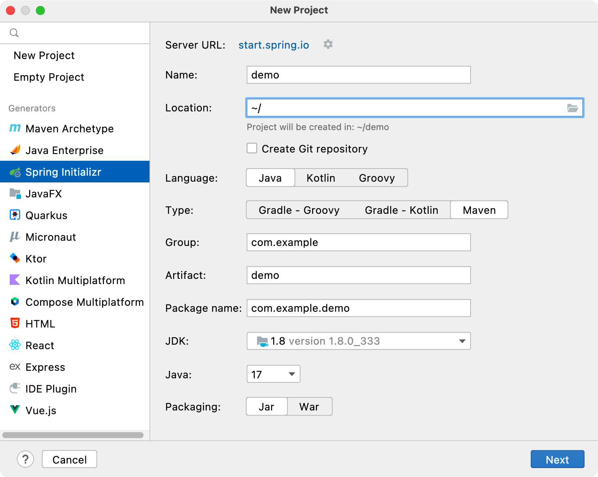

# SpringBoot(1)

# 一. 简介

## 1.1 原生Spring优缺点

Spring 是 Java EE(Java Enterprise Edition，也称 J2EE)的轻量级代替品。无需开发重量级的 Enterprise JavaBean(EJB)，Spring 为企业级 Java 开发提供了一种相对简单的方法，通过依赖注入和面向切面编程，用简单的Java 对象(Plain Old Java Object，POJO)实现了 EJB 的功能。

虽然 Spring 的组件代码是轻量级的，但它的配置却是重量级的。一开始，Spring 用 XML 配置，而且是很多XML 配置。Spring 2.5 引入了基于注解的组件扫描，这消除了大量针对应用程序自身组件的显式 XML 配置。Spring 3.0 引入 了基于 Java 的配置，这是一种类型安全的可重构配置方式，可以代替 XML。 所有这些配置都代表了开发时的损耗。因为在思考 Spring 特性配置和解决业务问题之间需要进行思维切换，所以编写配置挤占了编写应用程序逻辑的时间。和所有框架一样，Spring 实用，但与此同时它要求的回报也不少。 除此之外，项目的依赖管理也是一件耗时耗力的事情。在环境搭建时，需要分析要导入哪些库的坐标，而且还需要分析导入与之有依赖关系的其他库的坐标，一旦选错了依赖的版本，随之而来的不兼容问题就会严重阻碍项目的开发进度。

## 1.2 SpringBoot概念

Spring Boot 是 Spring 公司的一个顶级项目，和 Spring Framework 是一个级别的。

Spring Boot 实际上是利用 Spring Framework 4 自动配置特性完成。编写项目时不需要编写 XML 文件。发展到现在，Spring Boot 已经具有很很大的生态圈，各种主流技术已经都提供了 Spring Boot 的启动器。

## 1.3 启动器

Spring 框架在项目中作用是 Spring 整合各种其他技术，让其他技术使用更加方便。Spring Boot 的启动器实际上就是一个依赖。这个依赖中包含了整个这个技术的相关 jar 包，还包含了这个技术的自动配置，以前绝大多数XML 配置都不需要配置了。当然了，启动器中自动配置无法实现所有内容的自动配置，在使用 Spring Boot 时还需要进行少量的配置(这个配置不是在 XML 中了，而是在 properties 或 yml 中即可)。如果是 Spring 自己封装的启动器的 *artifactId* 名字满足：**spring-boot-starter-xxxx**，如果是第三方公司提供的启动满足：**xxxx-spring-boot-starter**。以后每次使用 Spring Boot 整合其他技术时首先需要考虑导入启动器。

## 1.4 SpringBoot优点

1. 使用 Spring Boot 可以创建独立的 Spring 应用程序。
2. 在 Spring Boot 中直接嵌入了 Tomcat、Jetty、Undertow 等 Web 容器，在使用 Spring Boot 做 Web 开发时不需要部署 WAR 文件。
3. 通过提供自己的启动器(Starter)依赖，简化项目构建配置。
4. 尽量的自动配置 Spring 和第三方库。
5. 绝对没有代码生成，也不需要 XML 配置文件。

## 1.5 SpringBoot核心

起步依赖本质上是一个 Maven 项目对象模型(Project Object Model，POM)，定义了对其他库的传递依赖，这些东西加在一起即支持某项功能。 简单的说，起步依赖就是将具备某种功能的坐标打包到一起，并提供一些默认的功能。

Spring Boot 的自动配置是一个运行时(更准确地说，是应用程序启动时)的过程，考虑了众多因素，才决定 Spring 配置应该用哪个，不该用哪个。该过程是 Spring 自动完成的。

# 二. 搭建项目

## 2.1 继承父工程

配置 Maven，使用 `<parent>` 标签设置继承的父工程的模块名称为 Spring Boot：

```xml
<parent>
    <artifactId>spring-boot-starter-parent</artifactId>
    <groupId>org.springframework.boot</groupId>
    <version>2.7.5</version>
</parent>
```

导入 **spring-boot-starter-web** 依赖，这样就可以使用 Spring MVC 了。

```xml
<dependency>
    <groupId>org.springframework.boot</groupId>
    <artifactId>spring-boot-starter-web</artifactId>
</dependency>
```

导入之后，Spring Boot 会自动配置 Spring MVC 所有组件，不用手动配置。

编写一个 Controller：

```java
@RestController
@RequestMapping("/")
public class HelloController {
    @RequestMapping("/hello")
    public String hello() {
        return "Hello Spring Boot";
    }
}
```

创建启动类：

Spring Boot 的启动类的作用是启动 Spring Boot 项目，是基于 *main* 方法来运行的。启动类在启动时会做注解扫描(`@Controller`、`@Service`、`@Repository`......)，**扫描位置为同包或者子包下的注解**，所以启动类的位置应放于包的根下。

```java
@SpringBootApplication
public class ExampleApplication {
    public static void main(String[] args) {
        SpringApplication.run(ExampleApplication.class, args);
    }
}
```

启动类表示项目的启动入口，启动器表示 jar 包的坐标。**必须在包中新建这个类**，不能直接放入到 java 文件夹。在 *org.example* 下新建自定义名称的类(规范：XXXXApplication)，可以是项目上下文路径 Application。

上下文访问路径默认为 `/`，端口号默认是 8080，打开浏览器访问：

```
http://localhost:8080/hello
```

显示数据说明成功访问服务器了。

## 2.2 使用依赖管理

可能你的 Maven 项目继承其他父工程，因为 Maven 工程是单继承的，所以就不能使用上述方法了。现在可以使用导入依赖的方式构建 Spring Boot 工程。

```xml
<dependencyManagement>
    <dependencies>
        <dependency>
            <groupId>org.springframework.boot</groupId>
            <artifactId>spring-boot-dependencies</artifactId>
            <version>2.4.5</version>
            <type>pom</type>
            <scope>import</scope>
        </dependency>
    </dependencies>
</dependencyManagement>

<dependencies>
    <dependency>
        <groupId>org.springframework.boot</groupId>
        <artifactId>spring-boot-starter-web</artifactId>
        <version>2.4.5</version>
    </dependency>
</dependencies>
```

## 2.3 使用脚手架

IDEA 内置了 Spring Boot 脚手架，可以直接点击构建：



或者直接去 Spring 脚手架官网在线生成：

https://start.spring.io/

# 三. 启动原理分析

## 3.1 SpringBoot包扫描

`@SpringBootApplication` 注解是 `@SpringBootConfiguration` 和 `@EnableAutoConfiguration` 注解的组合：

```java
@Target(ElementType.TYPE)
@Retention(RetentionPolicy.RUNTIME)
@Documented
@Inherited
@SpringBootConfiguration
@EnableAutoConfiguration
@ComponentScan(excludeFilters = { @Filter(type = FilterType.CUSTOM, classes = TypeExcludeFilter.class),
		@Filter(type = FilterType.CUSTOM, classes = AutoConfigurationExcludeFilter.class) })
public @interface SpringBootApplication {}
```

`@SpringBootConfiguration` 注解被 `@Configuration` 修饰，表示当前类一个配置类。

```java
@Target(ElementType.TYPE)
@Retention(RetentionPolicy.RUNTIME)
@Documented
@Configuration
@Indexed
public @interface SpringBootConfiguration {}
```

`@Configuration` 注解又被 `@Component` 注解修饰，说明当前类是容器中的一个组件。

```java
@Target({ElementType.TYPE})
@Retention(RetentionPolicy.RUNTIME)
@Documented
@Component
public @interface Configuration {
    @AliasFor(
        annotation = Component.class
    )
    String value() default "";
    boolean proxyBeanMethods() default true;
}
```

`@EnableAutoConfiguration` 启用自动配置功能，Spring Boot 中没有做任何配置，Spring Boot 自动帮助我们配置，但是需要通过这个注解才能生效。

```java
@Target(ElementType.TYPE)
@Retention(RetentionPolicy.RUNTIME)
@Documented
@Inherited
@AutoConfigurationPackage  // 自动扫描配置类包的注解
@Import(AutoConfigurationImportSelector.class)  // 给容器导入一些组件的选择器，导入一些默认配置
public @interface EnableAutoConfiguration {}
```

`@AutoConfigurationPackage` 注解，表示自动配置包。

```java
@Target(ElementType.TYPE)
@Retention(RetentionPolicy.RUNTIME)
@Documented
@Inherited
@Import(AutoConfigurationPackages.Registrar.class)
public @interface AutoConfigurationPackage {}
```

`@Import(AutoConfigurationPackages.Registrar.class)` 导入 `AutoConfigurationPackages.Registrar` 类，`@Import` 注解是 Spring 的底层注解，给容器导入一个组件。

```java
static class Registrar implements ImportBeanDefinitionRegistrar, DeterminableImports {

    @Override
    public void registerBeanDefinitions(AnnotationMetadata metadata, BeanDefinitionRegistry registry) {
        register(registry, new PackageImports(metadata).getPackageNames().toArray(new String[0]));
    }

    @Override
    public Set<Object> determineImports(AnnotationMetadata metadata) {
        return Collections.singleton(new PackageImports(metadata));
    }

}
```

## 3.2 SpringBoot自动配置

`@Import(AutoConfigurationImportSelector.class)` 为容器导入一些组件的选择器：

```java
protected List<String> getCandidateConfigurations(AnnotationMetadata metadata, AnnotationAttributes attributes) {
    List<String> configurations = new ArrayList<>(
        SpringFactoriesLoader.loadFactoryNames(getSpringFactoriesLoaderFactoryClass(), getBeanClassLoader()));
    ImportCandidates.load(AutoConfiguration.class, getBeanClassLoader()).forEach(configurations::add);
    Assert.notEmpty(configurations,
                    "No auto configuration classes found in META-INF/spring.factories nor in META-INF/spring/org.springframework.boot.autoconfigure.AutoConfiguration.imports. If you "
                    + "are using a custom packaging, make sure that file is correct.");
    return configurations;
}
```

```
0 = "com.baomidou.mybatisplus.autoconfigure.IdentifierGeneratorAutoConfiguration"
1 = "com.baomidou.mybatisplus.autoconfigure.MybatisPlusLanguageDriverAutoConfiguration"
2 = "com.baomidou.mybatisplus.autoconfigure.MybatisPlusAutoConfiguration"
3 = "org.mybatis.spring.boot.autoconfigure.MybatisLanguageDriverAutoConfiguration"
4 = "org.mybatis.spring.boot.autoconfigure.MybatisAutoConfiguration"
5 = "com.github.pagehelper.autoconfigure.PageHelperAutoConfiguration"
6 = "com.alibaba.druid.spring.boot.autoconfigure.DruidDataSourceAutoConfigure"
7 = "org.springframework.boot.autoconfigure.admin.SpringApplicationAdminJmxAutoConfiguration"
8 = "org.springframework.boot.autoconfigure.aop.AopAutoConfiguration"
9 = "org.springframework.boot.autoconfigure.amqp.RabbitAutoConfiguration"
10 = "org.springframework.boot.autoconfigure.batch.BatchAutoConfiguration"
11 = "org.springframework.boot.autoconfigure.cache.CacheAutoConfiguration"
12 = "org.springframework.boot.autoconfigure.cassandra.CassandraAutoConfiguration"
13 = "org.springframework.boot.autoconfigure.context.ConfigurationPropertiesAutoConfiguration"
14 = "org.springframework.boot.autoconfigure.context.LifecycleAutoConfiguration"
15 = "org.springframework.boot.autoconfigure.context.MessageSourceAutoConfiguration"
16 = "org.springframework.boot.autoconfigure.context.PropertyPlaceholderAutoConfiguration"
17 = "org.springframework.boot.autoconfigure.couchbase.CouchbaseAutoConfiguration"
18 = "org.springframework.boot.autoconfigure.dao.PersistenceExceptionTranslationAutoConfiguration"
```

上面展示的 `AutoConfiguration` 自动配置类全路径名称就是上面方法的获得的配置类路径集合。

这些自动配置类给我们当前项目的场景提供了一些组件和配置，有了自动配置就免除类手动编写配置文件，注入等等功能。这也就是常说的**约定大于配置**！

**spring-boot-autoconfigure** 包提供自动配置的功能以及常用的第三方库的自动配置类，只需要导入对应的启动器即可。这个包的 *META-INF* 目录下的 *spring.factories* 文件记录着自动配置类的全路径名，然后基于 Spring 的 SPI 机制扫描并加载到容器。

```
org.springframework.boot.autoconfigure.admin.SpringApplicationAdminJmxAutoConfiguration
org.springframework.boot.autoconfigure.aop.AopAutoConfiguration
org.springframework.boot.autoconfigure.amqp.RabbitAutoConfiguration
org.springframework.boot.autoconfigure.batch.BatchAutoConfiguration
org.springframework.boot.autoconfigure.cache.CacheAutoConfiguration
org.springframework.boot.autoconfigure.cassandra.CassandraAutoConfiguration
org.springframework.boot.autoconfigure.context.ConfigurationPropertiesAutoConfiguration
org.springframework.boot.autoconfigure.context.LifecycleAutoConfiguration
org.springframework.boot.autoconfigure.context.MessageSourceAutoConfiguration
org.springframework.boot.autoconfigure.context.PropertyPlaceholderAutoConfiguration
org.springframework.boot.autoconfigure.couchbase.CouchbaseAutoConfiguration
org.springframework.boot.autoconfigure.dao.PersistenceExceptionTranslationAutoConfiguration
org.springframework.boot.autoconfigure.data.cassandra.CassandraDataAutoConfiguration
org.springframework.boot.autoconfigure.data.cassandra.CassandraReactiveDataAutoConfiguration
org.springframework.boot.autoconfigure.data.cassandra.CassandraReactiveRepositoriesAutoConfiguration
org.springframework.boot.autoconfigure.data.cassandra.CassandraRepositoriesAutoConfiguration
org.springframework.boot.autoconfigure.data.couchbase.CouchbaseDataAutoConfiguration
org.springframework.boot.autoconfigure.data.couchbase.CouchbaseReactiveDataAutoConfiguration
org.springframework.boot.autoconfigure.data.couchbase.CouchbaseReactiveRepositoriesAutoConfiguration
org.springframework.boot.autoconfigure.data.couchbase.CouchbaseRepositoriesAutoConfiguration
org.springframework.boot.autoconfigure.data.elasticsearch.ElasticsearchDataAutoConfiguration
org.springframework.boot.autoconfigure.data.elasticsearch.ElasticsearchRepositoriesAutoConfiguration
org.springframework.boot.autoconfigure.data.elasticsearch.ReactiveElasticsearchRepositoriesAutoConfiguration
org.springframework.boot.autoconfigure.data.elasticsearch.ReactiveElasticsearchRestClientAutoConfiguration
...
```

这些东西用于替换掉传统的 XML 配置信息。

以 Spring MVC 自动配置为例，找到 `WebMvcAutoConfiguration` 配置类：

```java
@AutoConfiguration(after = { DispatcherServletAutoConfiguration.class, TaskExecutionAutoConfiguration.class,
		ValidationAutoConfiguration.class })
@ConditionalOnWebApplication(type = Type.SERVLET)
@ConditionalOnClass({ Servlet.class, DispatcherServlet.class, WebMvcConfigurer.class })
@ConditionalOnMissingBean(WebMvcConfigurationSupport.class)
@AutoConfigureOrder(Ordered.HIGHEST_PRECEDENCE + 10)
public class WebMvcAutoConfiguration {

	/**
	 * The default Spring MVC view prefix.
	 */
	public static final String DEFAULT_PREFIX = "";

	/**
	 * The default Spring MVC view suffix.
	 */
	public static final String DEFAULT_SUFFIX = "";

	/**
	 * Instance of {@link PathPatternParser} shared across MVC and actuator configuration.
	 */
	public static final PathPatternParser pathPatternParser = new PathPatternParser();

	private static final String SERVLET_LOCATION = "/";

    @Bean
	@ConditionalOnMissingBean(HiddenHttpMethodFilter.class)
	@ConditionalOnProperty(prefix = "spring.mvc.hiddenmethod.filter", name = "enabled")
	public OrderedHiddenHttpMethodFilter hiddenHttpMethodFilter() {
		return new OrderedHiddenHttpMethodFilter();
	}
    // ...
}
```

Spring Boot 会默认加载 *META-INF* 目录下的 *spring-configuration-metadata.json* 或者 *spring-* 配置文件提供默认值：

```json
{
    "name": "server.netty.validate-headers",
    "type": "java.lang.Boolean",
    "description": "Whether to validate headers when decoding requests.",
    "sourceType": "org.springframework.boot.autoconfigure.web.ServerProperties$Netty",
    "defaultValue": true
},
{
    "name": "server.port",
    "type": "java.lang.Integer",
    "description": "Server HTTP port.",
    "sourceType": "org.springframework.boot.autoconfigure.web.ServerProperties",
    "defaultValue": 8080
},
{
    "name": "server.reactive.session.cookie.domain",
    "type": "java.lang.String",
    "description": "Domain for the cookie.",
    "sourceType": "org.springframework.boot.web.server.Cookie"
},
```

可以看到默认的端口号就是 8080。

# 四. 项目配置

## 4.1 properties配置文件

Spring Boot 默认读取项目名称下以 **application** 开头的 *yml*、*yaml*、*properties* 配置文件。如果同一个目录下，有 *application.yml* 也有 *application.properties*，默认先读取 *application.properties*。 					

如果同一个配置属性，在多个配置文件都配置了，**默认使用第 1 个读取到的**，后面读取的不覆盖前面读取到的。**spring-boot-starter-parent** 父工程的 *pom.xml* 配置：

```xml
<resource>
    <directory>${basedir}/src/main/resources</directory>
    <filtering>true</filtering>
    <includes>
        <include>**/application*.yml</include>
        <include>**/application*.yaml</include>
        <include>**/application*.properties</include>
    </includes>
</resource>
```

编写示例：

```properties
server.port=8080
server.servlet.context-path=/example

spring.datasource.driver-class-name=com.mysql.cj.jdbc.Driver
spring.datasource.url=jdbc:mysql//localhost:3306/test
spring.datasource.username=root
spring.datasource.password=root
```

*properties* 配置文件写起来十分啰嗦，所以基本不常用，多数都用更简洁的 *yml* 配置文件。

## 4.2 yml配置文件

*yml* 配置文件的每一级目录都只要写一遍，所以很简洁。

```yml
server:
  port: 8080
  servlet:
  	context-path: /example

spring:
  datasource:
    driver-class-name: com.mysql.cj.jdbc.Driver
    url: jdbc:mysql//localhost:3306/test
    username: root
    password: root
```

*yml* 配置文件除了编写固定的配置项，还可以编写其他的数据项：

- 普通数据类型：

```yml
server:
  port: 8888
```

- 对象数据类型：

```yml
person:
  name: lbd
  age: 12
  gender: male
# or json form
person0: { name: erlua, age: 100 }
```

- 数组类型：

```yml
city:
  - San Francisco
  - New York
  - California
  - Huston
  - Los Angeles
  - Washington D.C
# or
city0: [London, Sidney, Boston，Miami]
```

## 4.3 bootstrap配置文件

**Spring Boot 中有两种上下文对象**，一种是 bootstrap, 另外一种是 application(ServletContext), bootstrap 是应用程序的父上下文，也就是说 bootstrap 加载优先于 application。bootstrap 主要用于从额外的资源来加载配置信息，还可以在本地外部配置文件中解密属性。这两个上下文共用一个环境，它是任何Spring应用程序的外部属性的来源。bootstrap 里面的属性会优先加载，它们默认也不能被本地相同配置覆盖。

**bootstrap配置文件特征**：

1. boostrap 由父 `ApplicationContext` 加载，比 applicaton 优先加载。
2. boostrap 里面的属性不能被覆盖。

**bootstrap与 application 的应用场景**：		

application 配置文件主要用于 Spring Boot 项目的自动化配置。 		

bootstrap 配置文件有以下几个应用场景：		

1. 使用 SpringCloudConfig 配置中心时，这时需要在 bootstrap 配置文件中添加连接到配置中心的配置属性来加载外部配置中心的配置信息。 		

2. 一些固定的不能被覆盖的属性。 		

3. 一些加密/解密的场景。

## 4.4 配置文件读取优先级

- 当前项目根目录下的 *config* 子目录(**最高**)：

```
config/application.yml
config/application.properties
```

- 当前项目根目录中(**其次**)：

```
application.yml
application.properties
```

- 项目的 *resources* 即 classpath 跟路径下的 *config* 目录中(**一般**)：

```
resources/config/application.properties
resources/config/application.yml
```

- 项目的 *resources* 即 classpath 根路径中(**最后**)：

```
resources/application.properties
resources/application.yml
```