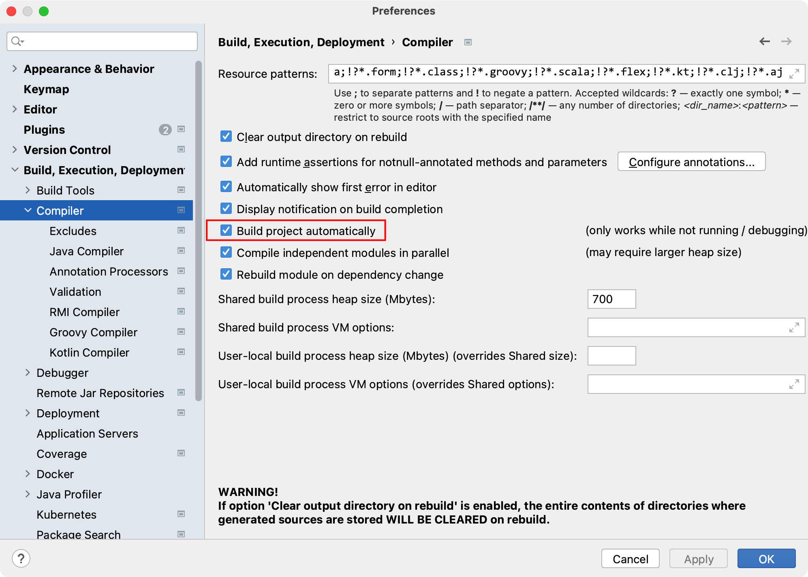
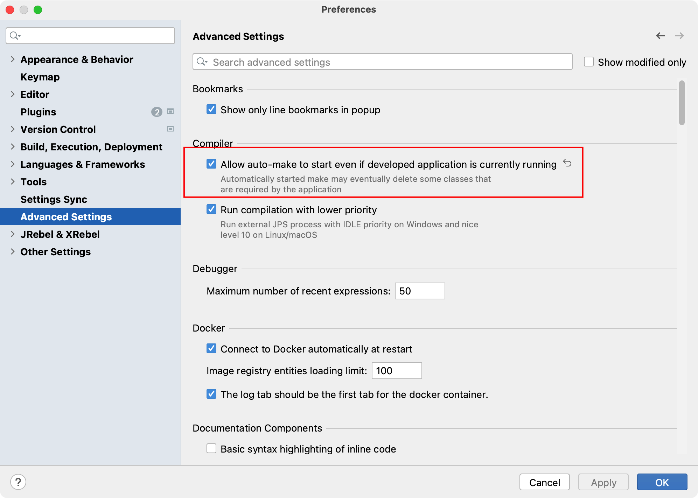

# SpringBoot(3)

# 一. 开发者工具

使用开发者工具包不需要手动重启项目，IDEA 会自动监听内容改变然后自动重启。

导入依赖：

```xml
<dependency>
    <groupId>org.springframework.boot</groupId>
    <artifactId>spring-boot-devtools</artifactId>
    <version>2.7.3</version>
</dependency>
```

开启 IDEA 的自动编译：



开启运行时自动构建项目：



# 二. 项目打包部署

SpringBoot 项目可以是 jar 类型的 Maven 项目，也可以是一个 war 类型的 Maven 项目，取决于我们要不要整合 jsp 使用。但是不管是哪种项目类型，已经不是我们传统意义上的项目结构了。

在本地使用 SpringBoot 的启动器即可访问我们开发的项目。如果我们将项目功能开发完成后，需要使用SpringBoot 的打包功能来将项目进行打包。 		

SpringBoot 项目打包在 Linux 服务器中运行：

1. jar 类型项目会打成 jar 包：

  jar 类型项目使用 SpringBoot 打包插件打包时，会在打成的 jar 中内置一个 tomcat 的 jar。所以我们可以使用jdk 直接运行该 jar 项目可，jar 项目中有一个功能，将功能代码放到其内置的 Tomcat 中运行。我们直接使用浏览器访问即可。

导入 SpringBoot 打包插件：

```xml
<build>
    <plugins>
        <plugin>
            <groupId>org.springframework.boot</groupId>
            <artifactId>spring-boot-maven-plugin</artifactId>
            <configuration>
                <fork>true</fork>
            </configuration>
        </plugin>
    </plugins>
</build>
```

项目类型设置为 jar，默认就是，可以不写：

```xml
<packaging>jar</packaging>
```

使用 `mvn package` 命令打包即可，记住要避免测试需要加上参数 `-D skipTests=true`，或者直接点击闪电按钮即可。

打包过后使用 `java -jar` 命令来启动。

2. war 类型项目会打成 war 包：

在打包时需要将内置的 Tomcat 插件排除，配置 Servlet的依赖。将 war 正常的放到 Tomcat 服务器中运行即可。

如果我们当前的 Maven 项目本身就是 war 类型的项目，直接打包即可，但是如果我们当前的 Maven 项目是 jar类型的项目，我们需要将项目修改为 war 类型，修改项目的 pom 文件，使用 `packaging` 标签设置值为 war。并且需要在项目中创建 webapp 文件夹，并设置为资源文件夹。

排除项目中自带的所有的 Tomcat 插件和 JSP Servlet 依赖，因为这里要将项目放到一个 Tomcat 上运行：

```xml
<!--配置SpringBoot的web启动器-->
<dependency>
    <groupId>org.springframework.boot</groupId>
    <artifactId>spring-boot-starter-web</artifactId>
    <!--排除web启动中自动依赖的tomcat插件-->
    <exclusions>
        <exclusion>
            <groupId>org.springframework.boot</groupId>
            <artifactId>spring-boot-starter-tomcat</artifactId>
        </exclusion>
    </exclusions>
</dependency>
<!--
    手动依赖tomcat插件，但是表明项目打包时该依赖不会被打进去，目的主要是保证开发阶段本地SpringBoot
    项目可以正常运行
-->
<dependency>
    <groupId>org.springframework.boot</groupId>
    <artifactId>spring-boot-starter-tomcat</artifactId>
    <!--打包的时候可以不用包进去，别的设施会提供。事实上该依赖理论上可以参与编译，测试，运行等周期。
        相当于compile，但是打包阶段做了exclude操作-->
    <scope>provided</scope>
</dependency>
```

让 SpringBoot 的启动类继承 SpringBootServletInitializer，并重写 *configure* 方法：

```java
@SpringBootApplication
public class MyApplication extends SpringBootServletInitializer {
    // 重写配置方法
    @Override
    protected SpringApplicationBuilder configure(SpringApplicationBuilder application) {
        return application.sources(MyApplication.class);
    }
    
    public static void main(String[] args) {
        //启动SpringBoot
        SpringApplication.run(MyApplication.class,args);
    }
}
```

使用 `install` 命令打包项目，并将 war 包放到 Tomcat 下的 webapps 下，启动 Tomcat 即可。

如果我们使用的是 Tomcat 7 则需要将 **javax.el-api-3.0.0.jar** 包放到 Tomcat 下的 *lib* 目录中。

# 三. 异常处理


# 四. 单元测试


# 五. Bean管理


# 六. 拦截器


# 七. 注解拓展


# 八. 静态资源


