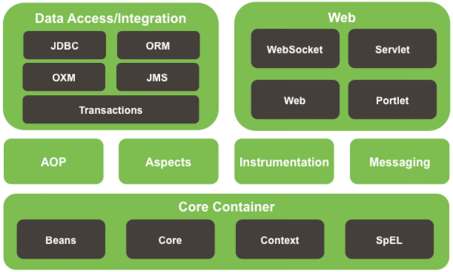
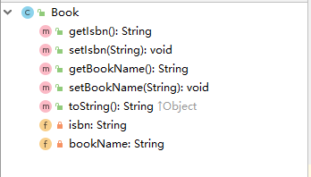
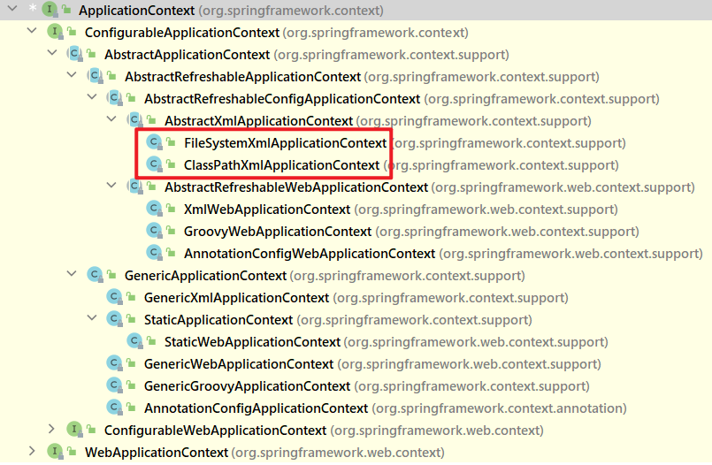
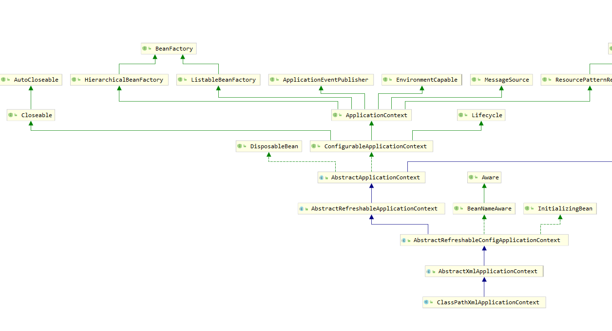
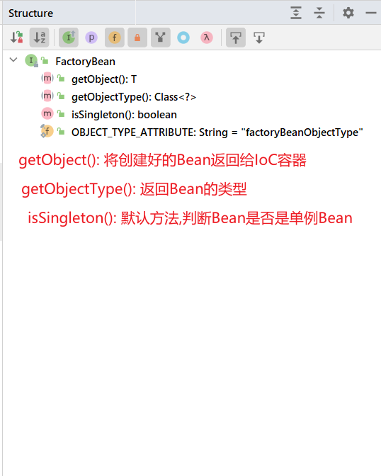
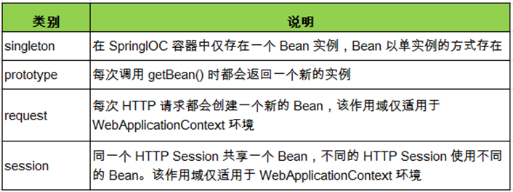
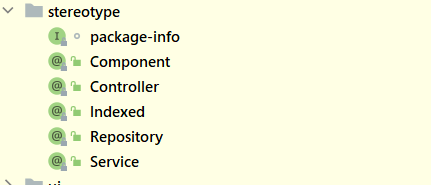

## 简介 了解框架

> 框架,即framework。其实就是某种应用的半成品,就是一组组件,供你选用完成你自己的系统.简单说就是使用别人搭好的舞台,你来做表演.而且,框架一般是成熟的,不断升级的软件.
>
> 框架是对特定应用领域中的应用系统的部分设计和实现的整体结构.
>
> 因为软件系统发展到今天已经很复杂了,特别是服务器端软件,涉及到的知识,内容,问题太多.在某些方面使用别人成熟的框架,就相当于让别人帮你完成一些基础工作,你只需要集中精力完成系统的业务逻辑设计.而且框架一般是成熟,稳健的,他可以处理系统很多细节问题,比如,事务处理,安全性,数据流控制等问题.还有框架一般都经过很多人使用,所以结构很好,所以扩展性也很好,而且它是不断升级的,你可以直接享受别人升级代码带来的好处.

## 一. Spring概述 

### 1.1 Spring概述  

 Spring的作者是一个音乐博士.

 hibernate的作者因为不会写sql语句,所以做了一个持久层框架.

- Spring是一个开源框架

- Spring为简化企业级开发而生,使用Spring，JavaBean就可以实现很多以前要靠EJB才能实现的功能.同样的功能,在EJB中要通过繁琐的配置和复杂的代码才能够实现,而在Spring中却非常的优雅和简洁. 

  - EJB即Enterprise JavaBean，是SUN的JavaEE服务器端组件模型.在JavaEE里，EJB称为Java 企业Bean，是Java的核心代码,分别是会话Bean（**Session Bean**）,实体Bean（**Entity Bean**）和消息驱动Bean（**MessageDriven Bean**）.在EJB3.0推出以后,实体Bean被单独分了出来,形成了新的规范**JPA**.

- Spring是一个**IOC**(DI)和**AOP**容器框架.

  - spring的核心。what?  

- Spring的优良特性

  - **非侵入式**：基于Spring开发的应用中的对象可以不依赖于Spring的API(struts侵入式)
  -  **依赖注入**：DI——Dependency Injection，反转控制(IOC)最经典的实现.
  -  **面向切面编程**：Aspect Oriented Programming——AOP
  -  **容器**：Spring是一个容器,因为它包含并且管理应用对象的生命周期
  -  **组件化**：Spring实现了使用简单的组件配置组合成一个复杂的应用.在 Spring 中可以使用XML和Java注解组合这些对象.
  - **一站式**：在IOC和AOP的基础上可以整合各种企业应用的开源框架和优秀的第三方类库（实际上Spring 自身也提供了表述层的SpringMVC和持久层的Spring JDBC）.

- Spring模块

  

- Spring 官网

  https://spring.io/ 

### 1.2 搭建Spring运行时环境

- 加入**JAR**包依赖

  ~~~xml
  <?xml version="1.0" encoding="UTF-8"?>
  <project xmlns="http://maven.apache.org/POM/4.0.0"
           xmlns:xsi="http://www.w3.org/2001/XMLSchema-instance"
           xsi:schemaLocation="http://maven.apache.org/POM/4.0.0 http://maven.apache.org/xsd/maven-4.0.0.xsd">
      <modelVersion>4.0.0</modelVersion>
  
      <groupId>org.example</groupId>
      <artifactId>spring_day01</artifactId>
      <version>1.0-SNAPSHOT</version>
      
      <dependencies>
          <!-- 引入context包即可,依赖传递,自定引入需要的包 -->
          <dependency>
              <groupId>org.springframework</groupId>
              <artifactId>spring-context</artifactId>
              <version>5.2.12.RELEASE</version>
          </dependency>
  
          <dependency>
              <groupId>commons-logging</groupId>
              <artifactId>commons-logging</artifactId>
              <version>1.1.1</version>
          </dependency>
      </dependencies>
  </project>
  ~~~
  
- 在idea中创建Spring的**配置文件**

  ~~~xml
  <?xml version="1.0" encoding="UTF-8" ?>
  <beans xmlns:xsi="http://www.w3.org/2001/XMLSchema-instance"
         xmlns="http://www.springframework.org/schema/beans"
         xsi:schemaLocation="http://www.springframework.org/schema/beans http://www.springframework.org/schema/beans/spring-beans.xsd" default-autowire="byName">
  
  </beans>
  ~~~

### 1.3 入门案例HelloWorld

​	lombok:自动帮pojo类添加get和set方法，toString.  

1. 添加依赖

~~~xml
 <dependency>
     <groupId>org.projectlombok</groupId>
     <artifactId>lombok</artifactId>
     <version>1.18.8</version>
     <scope>provided</scope>
</dependency>
~~~

2. 下载lombok插件

1. Book类结构图：

​	

2. Book类代码：

   ~~~java
   @Data
   public class Book {
   	private String isbn;
   	private String bookName;
   }
   ~~~
   
3. 创建Spring配置文件

   ~~~xml
   <?xml version="1.0" encoding="UTF-8" ?>
   <beans xmlns:xsi="http://www.w3.org/2001/XMLSchema-instance"
          xmlns="http://www.springframework.org/schema/beans"
          xsi:schemaLocation="http://www.springframework.org/schema/beans http://www.springframework.org/schema/beans/spring-beans.xsd" default-autowire="byName">
   
       <!-- 使用bean元素定义一个由IOC容器创建的对象 -->
   	<!-- class属性指定用于创建bean的全类名 -->
       <!-- id属性指定用于引用bean实例的标识 -->
       <bean id="book" class="cn.element.spring.pojo.Book">
           <!-- 使用property子元素为bean的属性赋值 -->
           <property name="isbn" value="1001"/>
           <property name="bookName" value="百年孤独"/>
       </bean>
   </beans>
   ~~~
   
   
   
4. 测试：通过Spring的IOC容器创建Student类实例

   ~~~java
   public void test01() {
       // 用我们的配置文件来启动一个 ApplicationContext
       ApplicationContext context = new ClassPathXmlApplicationContext("classpath:applicationContext.xml");
   
       // 从 context 中取出我们的 Bean，而不是用 new Book() 这种方式
       Book book = context.getBean(Book.class);
   
       // 这句将输出: book
       System.out.println(book);
   }
   ~~~
   
   
   

## 二. IOC容器和Bean的配置

### 2.1 IOC和DI

#### 2.1.1 IOC(Inversion of Control)：控制反转

>  在应用程序中的组件需要获取资源时,传统的方式是组件主动的从容器中获取所需要的资源,在这样的模式下开发人员往往需要知道在具体容器中特定资源的获取方式,增加了学习成本,同时降低了开发效率.
> 反转控制的思想完全颠覆了应用程序组件获取资源的传统方式：反转了资源的获取方向——改由容器主动的将资源推送给需要的组件,开发人员不需要知道容器是如何创建资源对象的,只需要提供接收资源的方式即可,极大的降低了学习成本,提高了开发的效率.这种行为也称为查找的被动形式.

#### 2.1.2 DI(Dependency Injection)：依赖注入

IOC的另一种表述方式：即组件以一些预先定义好的方式(例如：setter 方法)接受来自于容器的资源注入.相对于IOC而言,这种表述更直接.

> 总结: IOC 就是一种反转控制的思想, 而DI是对IOC的一种具体实现.  

#### 2.1.3 IOC容器在Spring中的实现

前提:  

1. Spring中有IOC思想
2. IOC思想必须基于 IOC容器来完成, 
3. 而IOC容器在最底层实质上就是一个对象工厂.

- 在通过IOC容器读取Bean的实例之前,需要先将IOC容器本身实例化.
- Spring提供了IOC容器的两种实现方式
  - BeanFactory：IOC容器的基本实现,是Spring内部的基础设施,是面向Spring本身的,不是提供给开发人员使用的.
  
  - ApplicationContext：BeanFactory的子接口,提供了更多高级特性.面向Spring的使用者,几乎所有场合都使用ApplicationContext而不是底层的BeanFactory。
  
    

> 面试题：BeanFactory和ApplicationContext有什么区别？
>

#### 2.1.4 ApplicationContext的主要实现类

1. **ClassPathXmlApplicationContext：对应类路径下的XML格式的配置文**

2. **FileSystemXmlApplicationContext：对应文件系统中的XML格式的配置文件**

3. **在初始化时就创建单例的bean，也可以通过配置的方式指定创建的Bean是多实例的.**

   

#### 2.1.5 ConfigurableApplicationContext

1. **是 ApplicationContext 的子接口,包含一些扩展方法 refresh() 和 close() 让 ApplicationContext 具有启动、关闭和刷新上下文的能力.**

   

#### 2.1.6 WebApplicationContext

1. **专门为WEB应用而准备的,它允许从相对于WEB根目录的路径中完成初始化工作**

   

#### 2.1.7 容器的结构图

### 2.2 通过类型获取bean

- 从IOC容器中获取bean时,除了通过id值获取,还可以通过bean的类型获取.但如果同一个类型的bean在XML文件中配置了多个,则获取时会抛出异常,所以同一个类型的bean在容器中必须是唯一的.

~~~java
Book book = cxt.getBean(Book.class);
// 或者可以使用另外一个重载的方法,同时指定bean的id值和类型
Book book = cxt.getBean("book", Book.class);
~~~

### 2.3 给bean的属性赋值

#### 2.3.1 依赖注入的方式

~~~java
@Data
public class Student {
	private Integer studentId;
	private String stuName;
	private int age;

	public Student() {
	}

	public Student(Integer studentId, String stuName, int age) {
		this.studentId = studentId;
		this.stuName = stuName;
		this.age = age;
	}
}
~~~

1. 通过bean的setXxx()方法赋值,Hello World中使用的就是这种方式

  ~~~xml
  <bean id="book" class="cn.element.spring.pojo.Book">
      <!-- 使用property子元素为bean的属性赋值 -->
      <property name="isbn" value="1001"/>
      <property name="bookName" value="百年孤独"/>
  </bean>
  ~~~

  

2. 通过bean的构造器赋值

   **Spring自动匹配合适的构造器**

  ~~~xml
  <bean id="student" class="cn.element.spring.pojo.Student">
      <constructor-arg  value="1"></constructor-arg>
      <constructor-arg  value="张三"></constructor-arg>
      <constructor-arg  value="20"></constructor-arg>
  </bean>
  ~~~

  	**通过索引值指定参数位置**

   ~~~xml
<bean id="student" class="cn.element.spring.pojo.Student">
    <constructor-arg index="0" value="1"></constructor-arg>
    <constructor-arg index="1" value="张三"></constructor-arg>
    <constructor-arg index="2" value="20"></constructor-arg>
</bean>
   ~~~

​	**通过类型区分重载的构造器**

  ~~~xml
  <bean id="student1" class="cn.element.spring.pojo.Student">
      <constructor-arg  value="1" type="java.lang.Integer"></constructor-arg>
      <constructor-arg  value="20" type="int"></constructor-arg>
      <constructor-arg value="张三" type="java.lang.String"></constructor-arg>
  </bean>
  ~~~

  

#### 2.3.2 依赖注入可用值

1. **字面量**

   1) 可以使用字符串表示的值,可以通过value属性或value子节点的方式指定

   2) 基本数据类型及其封装类、String等类型都可以采取字面值注入的方式

   3) 若字面值中包含特殊字符,可以使用`<![CDATA[]]>`把字面值包裹起来

   

2. **null值**

   如果赋值为`<null/>`,**得到的结果是null,而不是“null”**,**但是如果对null进行运算spring会自动将null转成“null”字符串来运算,防止空指针异常**

   ~~~xml
   <bean id="student1" class="cn.element.spring.pojo.Student">
       <constructor-arg  value="1" type="java.lang.Integer"></constructor-arg>
       <constructor-arg  value="20" type="int"></constructor-arg>
       <constructor-arg  type="java.lang.String">
           <null></null>
       </constructor-arg>
   </bean>
   ~~~

   

3. 外部已声明的bean、引用其他的bean

   shop类：

   ~~~java
   @Data
   public class Shop {
       private int shopId;
       private String shopName;
       private Book book;
   }
   ~~~
   
   引用外部的bean,使用ref属性.
   
   ~~~xml
   <bean id="shop" class="cn.element.spring.pojo.Shop">
       <property name="shopId" value="1"/>
       <property name="shopName" value="天猫小店"/>
       <property name="book" ref="book"/>
   </bean>
   ~~~

4. 给bean的**级联**属性赋值

   ~~~xml
   <bean id="shop" class="cn.element.spring.pojo.Shop">
       <property name="shopId" value="1"/>
       <property name="shopName" value="天猫小店"/>
       <property name="book" ref="book"/>
       <property name="book.bookName" value="金瓶梅"/>
   </bean>
   ~~~

5. 内部 bean
   当 bean 实例仅仅给一个特定的属性使用时,可以将其声明为内部 bean .内部bean声明直接包含在`<property>`或

   `<constructor-arg>`元素里,不需要设置任何 id 或 name 属性,内部 bean **不能使用在任何其他地方** !
   
   ~~~xml
   <bean id="shop1" class="cn.element.spring.pojo.Shop">
       <property name="shopId" value="1"/>
       <property name="shopName" value="天猫小店"/>
       <property name="book">
           <bean class="cn.justweb.ioc.Book">
               <property name="isbn" value="1005"/>
               <property name="bookName" value="三国演义"/>
           </bean>
       </property>
   </bean>
   ~~~
   
   

#### 2.3.3  p名称空间和c命名空间

为了简化XML文件的配置,越来越多的XML文件采用属性而非子元素配置信息。Spring从2.5版本开始引入了新的p命名空间和c命名空间,可以通过<bean>元素属性的方式配置Bean的属性.

- 使用p命名空间后,基于XML的配置方式将进一步简化.

  ~~~xml
  xmlns:p="http://www.springframework.org/schema/p"
  <bean id="student3" class="cn.justweb.ioc.Student" p:studentId="1" p:stuName="李四" p:age="40"/>
  ~~~

- 使用c命名空间后,基于XML的配置方式将进一步简化.

  ~~~xml
  xmlns:c="http://www.springframework.org/schema/c"
  <bean id="student4" class="cn.justweb.ioc.Student" c:studentId="3" c:stuName="李四2" c:age="43"/>
  ~~~
  

### 2.4 集合属性

在Spring中可以通过一组内置的XML标签来配置集合属性,例如：`<list>` ,`<set>` 或 `<map>`

图书馆类：

~~~java
@Data
public class Library {

    //图书集合
    private List<Book> books;

    //图书分类列表
    private Set<String> categories;
    
    //图书映射
    private Map<Integer, Book> bookMap;
}

~~~

#### 2.4.1 数组和List

配置java.util.List类型的属性,需要指定`<list>`标签,在标签里包含一些元素.这些标签	可以通过`<value>`指定简单的常量值,通过`<ref>`指定对其他Bean的引用.通过`<bean>`指定内置bean定义.通过`<null/>`指定空元素.甚至可以内嵌其他集合.

数组的定义和List一样,都可以使用`<list>`和`<array>`标签。list底层就是数组.
配置java.util.Set需要使用`<set>`标签,定义的方法与List一样.

~~~xml
<bean id="library" class="cn.element.spring.pojo.Library" >
    <property name= "categories">
        <!-- 以字面量为值的List集合 -->
        <set>
            <value> 历史</value >
            <value> 军事</value >
        </set>
    </property>
    <property name= "books">
        <!-- 以bean的引用为值的List集合 -->
        <list>
            <ref bean= "book"/>
            <ref bean= "book2"/>
        </list>
    </property>
</bean>
~~~

#### 2.4.2 Map

1. Java.util.Map通过 `<map>` 标签定义.
2. <map>标签里可以使用多个<entry>作为子标签.每个条目包含一个键和一个值.
3. 必须在 `<key>` 标签里定义键.
4. 因为键和值的类型没有限制,所以可以自由地为它们指定 `<value>` 、`<ref>` 、`<bean>` 或 `<null/>` 元素.
5. 可以将Map的键和值作为 `<entry>` 的属性定义：简单常量使用 **key** 和 **value** 来定义。bean引用通过 **key-ref** 和 **value-ref** 属性定义.

~~~xml
<bean id="library" class="cn.element.spring.pojo.Library">
    <property name= "categories">
        <!-- 以字面量为值的List集合 -->
        <set>
            <value>历史</value>
            <value>军事</value>
        </set>
    </property>
    <property name= "books">
        <!-- 以bean的引用为值的List集合 -->
        <list>
            <ref bean="book"/>
            <ref bean="book2"/>
        </list>
    </property>
    <property name="bookMap">
        <map key-type="java.lang.Integer" value-type="cn.element.spring.pojo.Book">
            <entry key="1001" value="book"/>
            <entry key="1003" value="book2"/>
        </map>
    </property>
</bean>
~~~

#### 2.4.3 集合类型的bean

如果只能将集合对象配置在某个bean内部,则这个集合的配置将不能重用.我们需要将集合bean的配置拿到外面,供其他bean引用.

配置集合类型的bean需要引入util名称空间

~~~xml
http://www.springframework.org/schema/util
http://www.springframework.org/schema/util/spring-util-4.0.xsd

<util:list id="bookList">
	<ref bean="book01"/>
	<ref bean="book02"/>
	<ref bean="book03"/>
	<ref bean="book04"/>
	<ref bean="book05"/>
</util:list>

<util:list id="list">
    <value>1</value>
    <value>2</value>
    <value>3</value>
    <value>4</value>
</util:list>

<util:list id="categoryList">
	<value>编程</value>
	<value>简维</value>
	<value>小说</value>
	<value>评书</value>
</util:list>
~~~

### 2.5  FactoryBean

- **Spring中有两种类型的 bean ,一种是普通 bean ,另一种是工厂 bean ,即 FactoryBean .**

- **工厂 bean 跟普通 bean 不同,其返回的对象不是指定类的一个实例,其返回的是该工厂 bean 的 getObject() 方法所返回的对象.**

- **工厂 bean 必须实现 org.springframework.beans.factory.FactoryBean 接口.**	

~~~xml
<bean id="product" class="cn.justweb.ioc.ProductFactory"></bean>
~~~

e.g. **ProductFactory类**

~~~java
public class ProductFactory implements FactoryBean<Book> {

    @Override
    public Book getObject() throws Exception {
        Book book = new Book();
        book.setIsbn("1");
        book.setBookName("aaa");
        return book;
    }

    @Override
    public Class<Book> getObjectType() {
        return Book.class;
    }

    @Override
    public boolean isSingleton() {
        return true;
    }
}
~~~

> **面试题：BeanFactory和FactoryBean有什么区别？**

### 2.6  Bean的作用域

在Spring中,可以在 `<bean>` 元素的 *scope* 属性里设置 *bean* 的作用域,以决定这个bean是单实例的还是多实例的.

默认情况下，Spring 只为每个在IOC容器里声明的bean创建唯一一个实例,整个IOC容器范围内都能共享该实例：所有后续的getBean() 调用和 bean 引用都将返回这个唯一的 bean 实例.该作用域被称为 *singleton* ,它是所有 bean 的默认作用域.

	

当bean的作用域为单例时，Spring 会在 IoC 容器对象创建时就创建 bean 的对象实例.而当 bean 的作用域为 *prototype* 时，IoC容器在获取bean的实例时创建bean的实例对象.

### 2.7 bean的生命周期

- Spring IoC容器可以管理bean的生命周期，Spring允许在bean生命周期内特定的时间点执行指定的任务.

- Spring IoC容器对bean的生命周期进行管理的过程：

  1. 通过构造器或工厂方法创建bean实例
  2. 为bean的属性设置值和对其他bean的引用
  3. 调用bean的初始化方法
  4. bean可以使用了
  5. 当容器关闭时,调用bean的销毁方法

- 在配置bean时,通过 **init-method** 和 **destroy-method** 属性为bean指定初始化和销毁方法
  
- bean的后置处理器
  
    1. bean后置处理器允许在调用初始化方法前后对bean进行额外的处理
    2. bean后置处理器对IoC容器里的所有bean实例逐一处理,而非单一实例.
       其典型应用是：检查bean属性的正确性或根据特定的标准更改bean的属性.
    3. bean后置处理器需要实现接口：*org.springframework.beans.factory.config.BeanPostProcessor*
       在初始化方法被调用前后，Spring将把每个bean实例分别传递给上述接口的
       以下两个方法：
       ● *postProcessBeforeInitialization(Object, String)*
       ● *postProcessAfterInitialization(Object, String)*
    
- 添加bean后置处理器后bean的生命周期:
	1. 通过构造器或工厂方法创建bean实例
    2. 为bean的属性设置值和对其他bean的引用
    3. 将bean实例传递给bean后置处理器的**postProcessBeforeInitialization()**方法
    4. 调用bean的初始化方法
    5. 将bean实例传递给bean后置处理器的**postProcessAfterInitialization()**方法
    6.  bean可以使用了
    7. 当容器关闭时调用bean的销毁方法

**生命周期测试：**

~~~java
public class Employee {
	
	private String lastName ;
	
	private Integer age ;
	
	private String desc ;
	
	public Employee() {
		System.out.println("生命周期 第一阶段 ====>① 调用构造器 创建Bean对象");
	}
	

	public String getLastName() {
		return lastName;
	}

	public void setLastName(String lastName) {
		System.out.println("生命周期 第二阶段 ====>② 调用set方法给对象的属性赋值");
		this.lastName = lastName;
	}

	public Integer getAge() {
		return age;
	}

	public void setAge(Integer age) {
		this.age = age;
	}

	public String getDesc() {
		return desc;
	}

	public void setDesc(String desc) {
		this.desc = desc;
	}

	@Override
	public String toString() {
		return "Employee [lastName=" + lastName + ", age=" + age + ", desc=" + desc + "]";
	} 
	
	/**
	 * init
	 * 
	 * 需要在配置文件中通过 init-method 来指定.
	 */
	public void  init() {
		System.out.println("生命周期 第三阶段 ====>③ 执行init方法");
	}
	
	
	/**
	 * destroy
	 * 
	 * 需要在配置文件中通过destroy-method来指定.
	 */
	public void destroy() {
		System.out.println("生命周期 第五阶段 ====>⑤ 执行destroy方法");
	}
}
~~~

**后置处理器：**

~~~java
/**
 * 后置处理器
 * 
 * 特点: 
 * 	1. 后置处理器 会对IOC容器 中的每个bean都起作用.
 */
public class IBeanPostProcessor implements BeanPostProcessor {
	
	/**
	 * 在初始化方法之前执行
	 * 
	 * Object bean :  当前正在被创建的Bean对象. 
	 * 
	 * String beanName :  当前正在被创建的Bean对象的id值. 
	 */
	@Override
	public Object postProcessBeforeInitialization(Object bean, String beanName) throws BeansException {
		//对bean对象进行处理
		System.out.println("postProcessBeforeInitialization==> "+ bean + " , " + beanName );
		Employee employee  = (Employee) bean ;
		employee.setAge(39);
		return employee;
	}
	/**
	 * 在初始化方法之后执行
	 */
	@Override
	public Object postProcessAfterInitialization(Object bean, String beanName) throws BeansException {
		//对bean对象进行处理
		System.out.println("postProcessAfterInitialization==> "+ bean + " , " + beanName );
		Employee employee  = (Employee) bean ;
		employee.setDesc("除了嘴行啥都不行.");
		return employee ; 
	}
}

~~~

测试：

~~~java
public class TestEmployee {
	
	public static void main(String[] args) {
		ConfigurableApplicationContext ctx = new ClassPathXmlApplicationContext("spring-lifecycle.xml");
		Employee employee = ctx.getBean("employee",Employee.class);
		System.out.println("生命周期 第四阶段 ====>④ 使用Bean " + employee);
		
		//关闭容器
		ctx.close();
	}
}
~~~

xml配置：

~~~xml
<?xml version="1.0" encoding="UTF-8"?>
<beans xmlns="http://www.springframework.org/schema/beans"
	xmlns:xsi="http://www.w3.org/2001/XMLSchema-instance"
	xsi:schemaLocation="http://www.springframework.org/schema/beans http://www.springframework.org/schema/beans/spring-beans.xsd">
	
	<!-- 生命周期 -->
    <bean id="employee" class="cn.element.spring.pojo.Employee" init-method="init" destroy-method="destroy">
        <property name="lastName" value="洛必达"/>
        <property name="age" value="25"/>
        <property name="desc" value="天下无敌"/>
    </bean>

    <!-- 后置处理器-->
    <bean class="cn.element.spring.factory.IBeanPostProcessor"/>
</beans>
~~~

### 2.8 引用外部属性文件

当bean的配置信息逐渐增多时,查找和修改一些bean的配置信息就变得愈加困难.这时可以将一部分信息提取到bean配置文件的外部,以properties格式的属性文件保存起来,同时在bean的配置文件中引用properties属性文件中的内容,从而实现一部分属性值在发生变化时仅修改properties属性文件即可.这种技术多用于连接数据库的基本信息的配置.

#### 2.8.1 直接配置

~~~xml
<!-- 直接配置 -->
<bean id="dataSource" class="com.mchange.v2.c3p0.ComboPooledDataSource">
	<property name="user" value="root"/>
	<property name="password" value="root"/>
	<property name="jdbcUrl" value="jdbc:mysql:///test"/>
	<property name="driverClass" value="com.mysql.jdbc.Driver"/>
</bean>
~~~

#### 2.8.2 使用外部的属性文件

1. 创建properties属性文件

   ~~~properties
   username=root
   password=root
   url=jdbc:mysql:///test
   driverClass=com.mysql.jdbc.Driver
   ~~~

   

2. 引入context名称空间

   ~~~xml
   <?xml version="1.0" encoding="UTF-8"?>
   <beans xmlns="http://www.springframework.org/schema/beans"
   	xmlns:xsi="http://www.w3.org/2001/XMLSchema-instance"
   	xmlns:context="http://www.springframework.org/schema/context"
   	xsi:schemaLocation="http://www.springframework.org/schema/beans http://www.springframework.org/schema/beans/spring-beans.xsd
   		http://www.springframework.org/schema/context http://www.springframework.org/schema/context/spring-context-4.0.xsd">
   ~~~

   

3. 指定properties属性文件的位置

   ~~~xml
   <!-- 读取属性文件   
        classpath:   从当前工程的类路径下读取属性文件.
        classpath*:  从有依赖关系的多个工程的类路径下读取属性文件.
   
        ${}:  特定的语法格式,用于读取属性文件中的内容.
   -->
   
   <!-- 
    PropertyPlaceHolderConfigurer 
   
      <bean class="org.springframework.beans.factory.config.PropertyPlaceholderConfigurer">
        <property name="location"  value="classpath:db.properties"></property>
      </bean>
     -->
   
   <!-- <context:property-placeholder/> -->
   
   <context:property-placeholder location="classpath:db.properties"/>
   ~~~

   

4. 从properties属性文件中引入属性值

   ~~~xml
   <!-- 从properties属性文件中引入属性值 -->
   <bean id="dataSource" class="com.alibaba.druid.pool.DruidDataSource">
       <property name="username" value="${username}"/>
       <property name="password" value="${password}"/>
       <property name="url" value="${url}"/>
       <property name="driverClassName" value="${driverClass}"/>
   </bean>
   ~~~

   

### 2.9自动装配

#### 2.9.1 自动装配的概念

- 手动装配：以 *value* 或 *ref* 的方式明确指定属性值都是手动装配.
- 自动装配：根据指定的装配规则,不需要明确指定, Spring 自动将匹配的属性值注入 bean 中.

#### 2.9.2 装配模式

- 根据 **类型** 自动装配：将类型匹配的bean作为属性注入到另一个bean中.若 IoC 容器中有多个与目标 bean 类型一致的 bean，Spring将无法判定哪个bean最合适该属性,所以不能执行自动装配
- 根据 **名称** 自动装配：必须将目标bean的名称和属性名设置的完全相同
- 通过 **构造器** 自动装配：当bean中存在多个构造器时,此种自动装配方式将会很复杂.不推荐使用.

自动装配实现类

~~~java
@Data
public class Person {
	
	private String name;
	
	private String friendName;
	
	private Car car; 
	
	private Address address;

	@Override
	public String toString() {
		return name  + "开着" + car.getPrice() + "钱的" + car.getBrand() + "带着" + friendName + "到" + address.getCity() + "的" +address.getLocation() + " 一起玩.";
	} 
	
}

~~~

被装配的car

~~~java
public class Car {
	
	private String brand ;
	
	private Double price ;

	public String getBrand() {
		return brand;
	}

	public void setBrand(String brand) {
		this.brand = brand;
	}

	public Double getPrice() {
		return price;
	}

	public void setPrice(Double price) {
		this.price = price;
	}

	@Override
	public String toString() {
		return "Car [brand=" + brand + ", price=" + price + "]";
	}
}
~~~

配置文件：

~~~xml
<?xml version="1.0" encoding="UTF-8"?>
<beans xmlns="http://www.springframework.org/schema/beans"
	xmlns:xsi="http://www.w3.org/2001/XMLSchema-instance"
	xsi:schemaLocation="http://www.springframework.org/schema/beans http://www.springframework.org/schema/beans/spring-beans.xsd">

	<!-- Car -->
	<bean id="car" class="cn.element.spring.autowire.Car">
		<property name="brand" value="摩拜单车"></property>
		<property name="price" value="500"></property>
	</bean>
	
	<!-- Address -->
	<bean id="address1" class="cn.element.spring.autowire.Address">
		<property name="city" value="北京"></property>
		<property name="location" value="三里屯"></property>
	</bean>
	
	
	<bean id="address2" class="cn.element.spring.autowire.Address">
		<property name="city" value="北京"></property>
		<property name="location" value="优衣库"></property>
	</bean>
	
	<bean id="address3" class="cn.element.spring.autowire.SubAddress">
		<property name="city" value="北京"></property>
		<property name="location" value="五道口"></property>
	</bean>
	
	
	<!-- Person  
		自动装配 
			byName :  Spring会使用被装配的属性的名字与IOC容器中bean的id值进行匹配,匹配成功则进行装配. 
			
			byType :  Spring会使用被装配的属性的类型与IOC容器中的bean的class值进行匹配.
					    如果能唯一匹配,则装配成功,如果匹配到多个兼容类型的bean，装配失败. 
	-->
	<bean id="person" class="cn.element.spring.autowire.Person" autowire="byType">
		<property name="name" value="大胜"></property>
		<property name="friendName" value="刚哥"></property>
	</bean>
	
	<!--  使用建议:  基于xml方式的自动装配不使用,但是要记住自动装配的模式, 以后使用基于注解的方式进行自动装配. -->
</beans>
~~~

#### 2.9.3 选用建议	

​	相对于使用注解的方式实现的自动装配,在XML文档中进行的自动装配略显笨拙,在项目中更多的使用注解的方式实现.

### 2.10 通过注解配置bean 

#### 2.10.1 概述

​	相对于XML方式而言,通过注解的方式配置bean更加简洁和优雅,而且和MVC组件化开发的理念十分契合,是开发中常用的使用方式.

#### 2.10.2 使用注解标识组件 

1. **普通组件**：`@Component`
   标识一个受Spring IOC容器管理的组件

2. **持久化层组件**：`@Repository`
   标识一个受Spring IOC容器管理的持久化层组件

   ~~~java
   @Repository
   public class UserDaoMyBatisImpl  implements UserDao{
   	
   	@Override
   	public void insertUser() {
   		System.out.println("UserDaoMyBatisImpl insert user success ...");
   	}
   }
   ~~~

3. **业务逻辑层组件**：`@Service`
   标识一个受Spring IOC容器管理的业务逻辑层组件

   

   1. @Autowired 注解的工作机制: 

      优先使用 *byType* 的方式进行自动装配, 如果能唯一匹配则装配成功, 如果匹配到多个兼容类型的bean, 会再使用*byName* 的方式在匹配到的bean中进行唯一性确定,如果能唯一确定,则进行装配,否则,失败.

   2. 默认情况下,使用 `@Autowired` 注解,属性必须被进行装配. 可以通过 `required = false`  设置为可选的. 

   3. 可以使用 `@Qualifier` 注解 具体指定要装配的 bean 的 id 值. 

   4.  `@Autowired` 和  `@Qualifier` 注解既可以加到属性上,也可以加到带有形参的方法上.

   ~~~java
   @Service
   public class UserServiceImpl implements UserService {
       
   	// 持久层的组件
   	@Autowired(required=false)
   	@Qualifier("userDaoMyBatisImpl")
   	private UserDao userDao ;
   	
   	/*
   	@Autowired(required=false)
   	@Qualifier("userDaoMyBatisImpl")
   	public void aaaUserDao(UserDao userDao) {
   		this.userDao = userDao;
   	}
   	*/
   	
   	@Override
   	public void doRegister() {
   		userDao.insertUser();
   	}
   }
   ~~~

   

4. **表述层控制器组件**：`@Controller`
   标识一个受Spring IoC容器管理的表述层控制器组件

   控制层的组件

   `@Controller` : 

   相当于在xml中进行如下的配置:

   `<bean id="userController" class="cn.element.spring.annotation.controller.UserController"/>`

   ​	id问题: 

   1. 加上注解以后,组件管理到 *IoC* 容器中,会有一个默认的 id ,  就是类名的首字母小写 *userController*

   2. 可以使用注解的 *value* 属性来指定id值.  `@Controller(value="uc")`

   3. 如果注解中只设置一个 *value* 属性的情况, value可以省略. `@Controller("uc")`

   ~~~java
   @Controller
   public class UserController {
   	
   	//Service层的组件对象
   	@Autowired
   	private UserService  userService;
   
   	
   	public void register() {
   		userService.doRegist();
   	}
   }
   ~~~

5. **组件命名规则**
      ①默认情况：使用组件的简单类名首字母小写后得到的字符串作为bean的id
      ②使用组件注解的value属性指定bean的id

   > 注意：事实上Spring并没有能力识别一个组件到底是不是它所标记的类型,即使将@Respository注解用在一个表述层控制器组件上面也不会产生任何错误,所以@Respository、@Service、@Controller这几个注解仅仅是为了让开发人员自己明确当前的组件扮演的角色.

#### 2.10.3 扫描组件

组件被上述注解标识后还需要通过Spring进行扫描才能够侦测到.

1. 指定被扫描的package

   ~~~xml
   <context:component-scan base-package="cn.element.component"/>
   ~~~

2. 详细说明
   ① base-package属性指定一个需要扫描的基类包，Spring容器将会扫描这个基类包及其子包中的所有类.
   ② 当需要扫描多个包时可以使用逗号分隔.
   ③ 如果仅希望扫描特定的类而非基包下的所有类,可使用resource-pattern属性过滤特定的类,示例：

   ~~~xml
   <context:component-scan base-package="cn.element.component" resource-pattern="autowire/*.class"/>
   ~~~

   ④包含与排除

   - `<context:include-filter/>`子节点表示要包含的目标类

     > 注意：通常需要与use-default-filters属性配合使用才能够达到“仅包含某些组件”这样的效果.即：通过将use-default-filters属性设置为false，禁用默认过滤器,然后扫描的就只是include-filter中的规则指定的组件了.

   - `<context:exclude-filter/>`子节点表示要排除在外的目标类

   - `<component-scan>` 下可以拥有若干个 *include-filter* 和 *exclude-filter* 子节点

   - 过滤表达式

     | 类别       | 示例                     | 说明                                                         |
     | ---------- | ------------------------ | ------------------------------------------------------------ |
     | annotation | cn.element.XxxAnnotation | 过滤所有标注了XxxAnnotation的类.这个规则根据目标组件是否标注了指定类型的注解进行过滤. |
     | assignable | cn.element.BaseXxx       | 过滤所有BaseXxx类的子类.这个规则根据目标组件是否是指定类型的子类的方式进行过滤. |
     | aspectj    | cn.element.*Service+     | 所有类名是以Service结束的,或这样的类的子类.这个规则根据AspectJ表达式进行过滤. |
     | regex      | com\.justweb\.anno\.*    | 所有cn.element.anno包下的类.这个规则根据正则表达式匹配到的类名进行过滤. |
     | custom     | cn.element.XxxTypeFilter | 使用XxxTypeFilter类通过编码的方式自定义过滤规则.该类必须实现org.springframework.core.type.filter.TypeFilter接口 |

xml配置

组件扫描:  *base-package* : 基包, Spring 会扫描指定包以及子包下的类,将带有注解的管理到 IoC 容器中   
			`context:include-filter`: 包含. 
			`type`: 过滤方式. 
				`annotation` :  通过注解的类型来进行过滤. 
				`assignable `:  通过组件的类型来进行过滤.
			注意: `context:include-filter` 需要在 `context:component-scan` 中设置  `use-default-filters=false`

​	`context:exclude-filter` : 排除. 
​			注意:  `context:exclude-filter` 需要在 `context:component-scan` 中设置 `use-default-filters=true`

~~~xml
<?xml version="1.0" encoding="UTF-8"?>
<beans xmlns="http://www.springframework.org/schema/beans"
	xmlns:xsi="http://www.w3.org/2001/XMLSchema-instance"
	xmlns:context="http://www.springframework.org/schema/context"
	xsi:schemaLocation="http://www.springframework.org/schema/beans http://www.springframework.org/schema/beans/spring-beans.xsd
		http://www.springframework.org/schema/context http://www.springframework.org/schema/context/spring-context-4.0.xsd">
	
	
	<context:component-scan base-package="cn.element.spring.annotation" use-default-filters="true">
		<context:include-filter type="annotation" expression="org.springframework.stereotype.Controller"/>
		<context:include-filter type="assignable" expression="cn.element.spring.annotation.controller.UserController"/>
		
		<context:exclude-filter type="annotation" expression="org.springframework.stereotype.Controller"/>
		<context:exclude-filter type="assignable" expression="cn.element.spring.annotation.controller.UserController"/>
	</context:component-scan>	
</beans>
~~~

#### 2.10.4 组件装配

- 需求

  Controller组件中往往需要用到Service组件的实例，Service组件中往往需要用到	Repository组件的实例。Spring可以通过注解的方式帮我们实现属性的装配.

- 实现依据
  在指定要扫描的包时,`<context:component-scan/>` 元素会自动注册一个bean的后置处理器：`AutowiredAnnotationBeanPostProcessor` 的实例.该后置处理器可以自动装配标记了 `@Autowired` 、`@Resource` 或 `@Inject` 注解的属性.

- `@Autowired`注解

  1. 根据类型实现自动装配.
  
  2. 构造器、普通字段(即使是非public)、一切具有参数的方法都可以应用 `@Autowired` 注解.
  
  3. 默认情况下,所有使用 `@Autowired` 注解的属性都需要被设置.当 Spring 找不到匹配的 bean 装配属性时,会抛出异常.
  
  4. 若某一属性允许不被设置,可以设置 `@Autowired` 注解的required属性为 false.
  
  5. 默认情况下,当 IoC 容器里存在多个类型兼容的 bean 时，Spring 会尝试匹配 bean 的 id 值是否与变量名相同,如果相同则进行装配.如果 bean 的 id 值不相同,通过类型的自动装配将无法工作.此时可以在 `@Qualifier` 注解里提供 bean的名称。Spring 甚至允许在方法的形参上标注 `@Qualifiter` 注解以指定注入bean的名称.
  
  6. `@Autowired` 注解也可以应用在数组类型的属性上,此时Spring将会把所有匹配的 bean 进行自动装配.
  
  7. `@Autowired` 注解也可以应用在集合属性上,此时 Spring 读取该集合的类型信息,然后自动装配所有与之兼容的 bean.
  
  8. `@Autowired` 注解用在 *java.util.Map*上时,若该 *Map* 的键值为 *String* ,那么 Spring 将自动装配与值类型兼容的 bean 作为值,并以 bean 的 id 值作为键.
  
- `@Resource`
  	`@Resource` 注解**要求提供一个bean名称的属性**,若该属性为空,则自动采用标注处的变量或方法名作为bean的名称.

- `@Inject`
  	@Inject 和 @Autowired 注解一样也是按类型注入匹配的 bean，但没有 *reqired* 属性.

