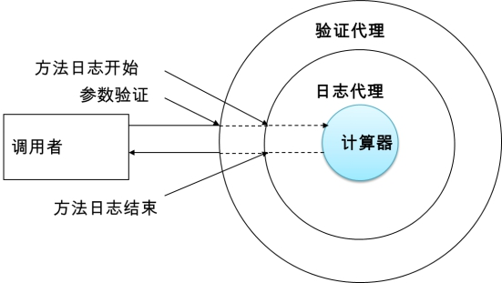
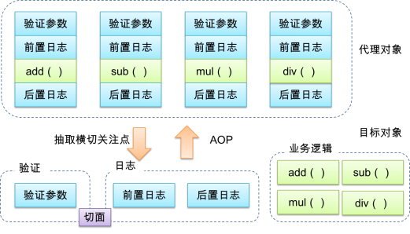
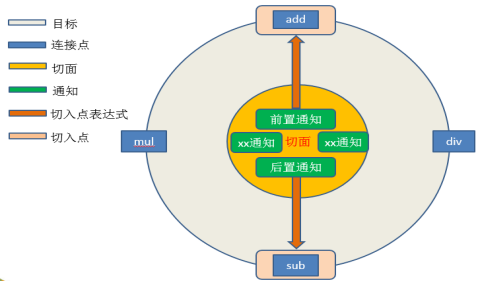

## 三. AOP前奏

### 3.1 提出问题

#### 3.1.1 情景：数学计算器

1) 要求

​	①执行加减乘除运算

​	②日志：在程序执行期间追踪正在发生的活动

​	③验证：希望计算器只能处理正数的运算

2) 常规实现

~~~java
public class ArithmeticCalculatorImpl implements ArithmeticCalculator {

    @Override
    public double add(double a, double b) {
//        System.out.println("日志：begin ["+a+","+b+"]");

        double result = a + b;
 //        System.out.println("日志：result="+result);
        return result;
    }

    @Override
    public double sub(double a, double b) {
//        System.out.println("日志：begin ["+a+","+b+"]");

        double result = a - b;

//        System.out.println("日志：result="+result);
        return result;
    }

    @Override
    public double mul(double a, double b) {
//        System.out.println("日志：begin ["+a+","+b+"]");

        double result = a * b;

//        System.out.println("日志：result="+result);
        return result;
    }

    @Override
    public double div(double a, double b) {
//        System.out.println("日志：begin ["+a+","+b+"]");

        double result = a / b;

//        System.out.println("日志：result="+result);
        return result;
    }
}
~~~

3) 问题

①代码混乱：越来越多的非业务需求(日志和验证等)加入后，原有的业务方法急剧膨胀。每个方法在处理核心逻辑的同时还必须兼顾其他多个关注点。

②代码分散: 以日志需求为例，只是为了满足这个单一需求，就不得不在多个模块（方法）里多次重复相同的日志代码。如果日志需求发生变化，必须修改所有模块。

 

### 3.2 动态代理

#### 3.2.1 动态代理的原理

代理设计模式的原理：**使用一个代理将原本对象包装起来**，然后用该代理对象”取代”原始对象。任何对原始对象的调用都要通过代理。代理对象决定是否以及何时将方法调用转到原始对象上。

 

#### 3.2.2 动态代理的方式

1) 基于接口实现动态代理： JDK动态代理

2) 基于继承实现动态代理： Cglib、Javassist动态代理 

### 3.3 数学计算器的改进

#### 3.3.1 日志处理器

~~~java
public class CalculatorLoggingHandler implements InvocationHandler {

    private Object target;

    public CalculatorLoggingHandler(Object target) {
        this.target = target;
    }

    @Override
    public Object invoke(Object proxy, Method method, Object[] args) throws Throwable {
        System.out.println("方法名："+method.getName()+"() 参数列表："+ Arrays.toString(args));
        Object result = method.invoke(target, args);
        System.out.println("方法名："+method.getName()+"() 运行结果是："+ result);
        return result;

    }

    //创建代理对象。
    public static Object createProxy(Object target) {
        return Proxy.newProxyInstance(target.getClass().getClassLoader(),target.getClass().getInterfaces(),new CalculatorLoggingHandler(target));
    }

}
~~~


#### 3.3.2 测试代码

```java
@Test
public void test() {
    //创建一个计算器实现类
    ArithmeticCalculator arithmeticCalculator = new ArithmeticCalculatorImpl();

    //创建代理对象（代理对象中对每个方法进行了增强。打印日志。）
    ArithmeticCalculator proxyObject = (ArithmeticCalculator)CalculatorLoggingHandler.createProxy(arithmeticCalculator);

    double add = proxyObject.add(1, 2);
    System.out.println("add = " + add);
}
```

 

#### 3.3.3 保存生成的动态代理类

~~~java
//在测试方法中加入如下代码：
Properties properties = System.getProperties();
properties.put("sun.misc.ProxyGenerator.saveGeneratedFiles", "true");
~~~


## 四. AOP概述

### 4.1 AOP概述

1. AOP(Aspect-Oriented Programming，**面向切面编程**)：是一种新的方法论，是对传统 OOP(Object-Oriented Programming，面向对象编程)的补充。

2. AOP编程操作的主要对象是切面(aspect)，而切面用于**模块化横切关注点（公共功能)**

3. 在应用AOP编程时，仍然需要定义公共功能，但可以明确的定义这个功能应用在哪里，以什么方式应用，并且不必修改受影响的类。这样一来横切关注点就被模块化到特殊的类里——这样的类我们通常称之为“切面”。

4. 使用AOP的作用： 

   - 每个事物逻辑位于一个位置，代码不分散，便于维护和升级

   - 业务模块更简洁，只包含核心业务代码
   - AOP图解

 


### 4.2 AOP术语

#### 4.2.1 横切关注点

从每个方法中抽取出来的同一类非核心业务。

#### 4.2.2 切面(Aspect)

封装横切关注点信息的类，每个关注点体现为一个通知方法。

#### 4.2.3 通知(Advice)

切面必须要完成的各个具体工作,也叫做增强,简单来说就是**增强的功能**.

通知通常分为5种:

- **前置通知: 在进入切入点之前调用**
- **后置通知: 在离开切入点之后调用**
- **环绕通知: 在切入点前后都调用**
- **方法返回通知: 在切入点方法正常返回之后调用**
- **异常通知: 在切入点方法抛出异常之后调用**

#### 4.2.4 目标(Target)

被通知(增强)的对象

#### 4.2.5 代理(Proxy)

向目标对象应用通知之后创建的代理对象

#### 4.2.6 连接点(Joinpoint)

横切关注点在程序代码中的具体体现，对应程序执行的某个特定位置。例如：类某个方法调用前、调用后、方法捕获到异常后等。在应用程序中可以使用横纵两个坐标来定位一个具体的连接点,简单来讲就是 **可以被增强的方法** .

#### 4.2.7 切入点(Pointcut)：

定位连接点的方式。每个类的方法中都包含多个连接点，所以连接点是类中客观存在的事物。如果把连接点看作数据库中的记录，那么切入点就是查询条件AOP可以通过切入点定位到特定的连接点。切点通过*org.springframework.aop.Pointcut* 接口进行描述，它使用类和方法作为连接点的查询条件。简单来说,切入点就是**实际被增强的方法**.


#### 4.2.8 织入(Weaving):

将切面和其他对象连接起来,并创建代理对象的过程称为**织入**.


#### 4.2.9 图解

 


### 4.3 AspectJ

#### 4.3.1	简介

**AspectJ**：Java社区里最完整最流行的AOP框架。

在Spring2.0以上版本中，可以使用基于AspectJ注解或基于XML配置的AOP。

**Spring AOP**旨在通过Spring IoC提供一个简单的AOP实现，以解决编码人员面临的最常出现的问题。这并不是完整的AOP解决方案，它只能用于Spring容器管理的beans。

AspectJ是最原始的AOP实现技术，提供了完整的AOP解决方案。AspectJ更为健壮，相对于Spring AOP也显得更为复杂。值得注意的是，AspectJ能够被应用于所有的领域对象。

#### 4.3.2	在Spring中启用AspectJ注解支持

- 导入依赖

  ~~~xml
  <dependencies>
      <dependency>
          <groupId>org.springframework</groupId>
          <artifactId>spring-context</artifactId>
          <version>5.2.12.RELEASE</version>
      </dependency>
  
      <dependency>
          <groupId>org.aspectj</groupId>
          <artifactId>aspectjweaver</artifactId>
          <version>1.9.6</version>
      </dependency>
  
      <dependency>
          <groupId>junit</groupId>
          <artifactId>junit</artifactId>
          <version>4.12</version>
          <scope>test</scope>
      </dependency>
  </dependencies>
  ~~~

  

- 引入aop命名空间

  ~~~java
  http://www.springframework.org/schema/aop
  http://www.springframework.org/schema/aop/spring-aop.xsd
  ~~~

- 配置`<aop:aspectj-autoproxy/>`重要!

  ​	当Spring IOC容器侦测到bean配置文件中&lt;aop:aspectj-autoproxy&gt;元素时，会自动为与AspectJ切面匹配的bean创建代理


#### 4.3.3 用AspectJ注解声明切面

- 要在Spring中声明AspectJ切面，只需要在IOC容器中将切面声明为bean实例。
- 当在Spring IOC容器中初始化AspectJ切面之后，Spring IOC容器就会为那些与 AspectJ切面相匹配的bean创建代理。
- 在AspectJ注解中，切面只是一个带有@Aspect注解的Java类，它往往要包含很多通知。
- 通知是标注有某种注解的简单的Java方法。
- AspectJ支持5种类型的通知注解：
  1. **@Before：前置通知，在方法执行之前执行**
  2. **@After：后置通知，在方法执行之后执行**
  3. **@AfterRunning：返回通知，在方法返回结果之后执行**
  4. **@AfterThrowing：异常通知，在方法抛出异常之后执行**
  5. **@Around：环绕通知，围绕着方法执行**


切面类：

~~~java
@Component  // 标识为一个组件,受Spring的IOC容器管理
@Aspect  //标识为一个切面
@Order(1)  //通过@Order注解指定一个int类型的值， 来设置优先级， 值越小优先级越高. 默认值为int的最大值.
		   //扩展: 最大最小值的表示方式:
						//最大值: 01111111 11111111 11111111 11111111   0x7fffffff
						//最小值:	 10000000 00000000 00000000 00000000   0x80000000	 
public class LoggingAspect { 
	@Before(value="execution( public int  cn.element.calculator.impl.ArithmeticCalculatorImpl.*(int,int))")
	public void beforeMethod() {
		System.out.println("前置通知");
	}
	
	....
	
}
~~~


## 五. AOP细节

### 5.1 切入点表达式 

#### 5.1.1 作用

​	通过**表达式的方式**定位**一个或多个**具体的连接点。

#### 5.1.2 语法细节

- 切入点表达式的语法格式

  execution([权限修饰符] [返回值类型] [简单类名/全类名] [方法名]([参数列表]))

  execution(public * com.example.spring.Demo.method(..))

- 案例

  | 表达式 | execution(* com.example.spring.ArithmeticCalculator.*(..))   |
  | ------ | ------------------------------------------------------------ |
  | 含义   | ArithmeticCalculator接口中声明的所有方法。第一个 * 代表任意返回值。第二个 * 代表任意方法。.. 匹配任意数量、任意类型的参数。若目标类、接口与该切面类在同一个包中可以省略包名。 |

  | 表达式 | execution(public * ArithmeticCalculator.*(..)) |
  | ------ | ---------------------------------------------- |
  | 含义   | ArithmeticCalculator接口的所有公有方法         |

  | 表达式 | execution(public double ArithmeticCalculator.*(..)) |
  | ------ | --------------------------------------------------- |
  | 含义   | ArithmeticCalculator接口中返回double类型数值的方法  |

  | 表达式 | execution(public double ArithmeticCalculator.*(double, ..))  |
  | ------ | ------------------------------------------------------------ |
  | 含义   | 第一个参数为double类型的方法。“..” 匹配任意数量、任意类型的参数。 |

  | 表达式 | execution(public double ArithmeticCalculator.*(double, double)) |
  | ------ | ------------------------------------------------------------ |
  | 含义   | 参数类型为double，double类型的方法                           |

- 在AspectJ中，切入点表达式可以通过 “&&”、“||”、“!”等操作符结合起来。

  | 表达式 | execution (* .add(int,..)) ***\*\|\|\**** execution(* *.sub(int,..)) |
  | ------ | ------------------------------------------------------------ |
  | 含义   | 任意类中第一个参数为int类型的add方法或sub方法                |
  | 表达式 | **!execution (* *.add(int,..))**                             |
  | 含义   | 匹配不是任意类中第一个参数为int类型的add方法                 |


#### 5.1.3切入点表达式应用到实际的切面类中

 


### 5.2 当前连接点细节

#### 5.2.1 概述

切入点表达式通常都会是从宏观上定位一组方法，和具体某个通知的注解结合起来就能够确定对应的连接点。那么就一个具体的连接点而言，我们可能会关心这个连接点的一些具体信息，例如：当前连接点所在方法的方法名、当前传入的参数值等等。这些信息都封装在JoinPoint接口的实例对象中。


#### 5.2.2 JoinPoint

### 5.3通知

切面类代码：

~~~java
@Component  // 标识为一个组件,受Spring的IOC容器管理
@Aspect  //标识为一个切面
@Order(1)  //通过@Order注解指定一个int类型的值， 来设置优先级， 值越小优先级越高. 默认值为int的最大值.
		   //扩展: 最大最小值的表示方式:
						//最大值: 01111111 11111111 11111111 11111111   0x7fffffff
						//最小值:	 10000000 00000000 00000000 00000000   0x80000000	 
public class LoggingAspect { 
	/**
	 * 定义切入点表达式
	 */
	@Pointcut(value="execution(* cn.element.calculator.*.*(..))")
	public void declarePointCut() {}
	
	/**
	 * 通知: 前置通知  后置通知 返回通知 异常通知 环绕通知
	 */
	
	/**
	 * 前置通知: 在目标方法执行之前执行.
	 * 
	 * @Before  
	 * 	  value: 指定切入点表达式， 告诉通知要作用到哪些个目标方法上. 
	 * 
	 * 连接点对象: JoinPoint , 当通知作用到某个连接点时，就会产生一个连接点对象，用于描述当前连接点的相关信息.
	 */
	@Before(value="declarePointCut()")
	public void beforeMethod(JoinPoint joinPoint ) {
		//方法名  
		String methodName = joinPoint.getSignature().getName();
		//参数列表
		Object [] args = joinPoint.getArgs();    
		System.out.println("LoggingAspect==>The method "+methodName+" begin with : " + Arrays.toString(args) );                                                D
	}
	
	/**
	 * 后置通知: 在目标方法执行之后执行. 不管目标方法有没有抛出异常都会执行. 不能获取到目标方法的返回值
	 * 
	 * 切入点表达式:  * cn.element.spring.aop.aspectj.*.*(..)
	 * 		* : 任意修饰符任意返回值
	 * 		* : 包下的任意类
	 * 		* : 类中的任意方法
	 * 		..: 方法中的任意参数列表
	 */
	
	//@After(value="execution(* cn.element.spring.aop.aspectj.*.*(..))")
	@After(value="declarePointCut()")
	public void afterMethod(JoinPoint joinPoint) {
		String methodName = joinPoint.getSignature().getName();
		System.out.println("LoggingAspect==>The method "+ methodName + " ends .");
	}
	
	/**
	 * 返回通知: 在目标方法正常执行结束后执行，可以获取到方法的返回值. 
	 * 
	 * 获取目标方法的返回值: 通过returning 指定一个形参名， 在通知方法中定义对应的形参，用于接收目标方法的返回值.
	 */
	@AfterReturning(value="declarePointCut()", returning="result")
	public void afterReturningMethod(JoinPoint joinPoint, Object result) {
		String methodName = joinPoint.getSignature().getName();
		System.out.println("LoggingAspect==>The method " + methodName + "end with : " + result );
		
	}
	
	/**
	 * 异常通知: 在目标方法抛出异常后执行. 
	 * 获取目标方法的异常信息: 通过throwing定义一个形参名，在通知方法中定义对应的形参, 用于接收目标方法抛出的异常信息.
	 * 					    也可以灵活的通过形参的类型来设置抛出指定异常以后再执行异常通知.
	 */
	@AfterThrowing(value="declarePointCut()",throwing="ex")
	public void afterThrowingMethod(JoinPoint joinPoint, ArithmeticException ex) {
		String methodName = joinPoint.getSignature().getName();
		
		System.out.println("LoggingAspect==>The method " + methodName + " occurs Exception : " + ex);
	}
	
	/**
	 * 环绕通知:  环绕着整个目标方法执行，可以理解为是 前置  后置  异常 返回通知的结合.
	 * 			类似于动态代理InvocationHandler中的invoke方法的处理. 
	 */
	public Object aroudMethod(ProceedingJoinPoint pjp) {
		try {
			//前置通知
			
			//执行目标方法
			Object result = pjp.proceed();
			
			//返回通知
			return result ;
		} catch (Throwable e) {
			//异常通知
			e.printStackTrace();
		} finally {
			//后置通知
		}
		return -100;
	}
	
	
}
~~~


#### 5.3.1 概述

1. 在具体的连接点上要执行的操作。
2. 一个切面可以包括一个或者多个通知。
3. 通知所使用的注解的值往往是切入点表达式。

#### 5.3.2 前置通知

1. 前置通知：在方法执行之前执行的通知
2. 使用 `@Before` 注解

#### 5.3.3 后置通知

1. 后置通知：后置通知是在连接点完成之后执行的，即连接点返回结果或者抛出异常的时候
2. 使用 `@After` 注解

#### 5.3.4 返回通知

1. 返回通知：无论连接点是正常返回还是抛出异常，后置通知都会执行。如果只想在连接点返回的时候记录日志，应使用返回通知代替后置通知。
2. 使用 `@AfterReturning` 注解,在返回通知中访问连接点的返回值
   - 在返回通知中，只要将returning属性添加到@AfterReturning注解中，就可以访问连接点的返回值。该属性的值即为用来传入返回值的参数名称
   - 必须在通知方法的签名中添加一个同名参数。在运行时Spring AOP会通过这个参数传递返回值
   - 原始的切点表达式需要出现在pointcut属性中	

#### 5.3.5 异常通知

1. 异常通知：只在连接点抛出异常时才执行异常通知
2. 将 *throwing* 属性添加到 `@AfterThrowing` 注解中，也可以访问连接点抛出的异常。**Throwable** 是所有错误和异常类的顶级父类，所以在异常通知方法可以捕获到任何错误和异常。
3. 如果只对某种特殊的异常类型感兴趣，可以将参数声明为其他异常的参数类型。然后通知就只在抛出这个类型及其子类的异常时才被执行

#### 5.3.6 环绕通知

1. 环绕通知是所有通知类型中功能最为强大的，能够全面地控制连接点，甚至可以控制是否执行连接点。
2. 对于环绕通知来说，连接点的参数类型必须是 ProceedingJoinPoint。它是 JoinPoint 的子接口，允许控制何时执行，是否执行连接点。
3. 在环绕通知中需要明确调用ProceedingJoinPoint的proceed()方法来执行被代理的方法。如果忘记这样做就会导致通知被执行了，但目标方法没有被执行。
4. 注意：环绕通知的方法需要返回目标方法执行之后的结果，即调用 joinPoint.proceed();的返回值，否则会出现空指针异常。

### 5.4 重用切入点定义

1. 在编写AspectJ切面时，可以直接在通知注解中书写切入点表达式。但同一个切点表达式可能会在多个通知中重复出现。
2. 在AspectJ切面中，可以通过@Pointcut注解将一个切入点声明成简单的方法。切入点的方法体通常是空的，因为将切入点定义与应用程序逻辑混在一起是不合理的。
3. 切入点方法的访问控制符同时也控制着这个切入点的可见性。如果切入点要在多个切面中共用，最好将它们集中在一个公共的类中。在这种情况下，它们必须被声明为public。在引入这个切入点时，必须将类名也包括在内。如果类没有与这个切面放在同一个包中，还必须包含包名。
4. 其他通知可以通过方法名称引入该切入点

### 5.5 指定切面的优先级

1. 在同一个连接点上应用不止一个切面时，除非明确指定，否则它们的优先级是不确定的。
2. 切面的优先级可以通过实现Ordered接口或利用@Order注解指定。
3. 实现Ordered接口，getOrder()方法的返回值越小，优先级越高。
4. 若使用@Order注解，序号出现在注解中


## 六. 以XML方式配置切面 

### 6.1 概述  

​	除了使用AspectJ注解声明切面，Spring也支持在bean配置文件中声明切面。这种声明是通过aop名称空间中的XML元素完成的。
​正常情况下，基于注解的声明要优先于基于XML的声明。通过AspectJ注解，切面可以与AspectJ兼容，而基于XML的配置则是Spring专有的。由于AspectJ得到越来越多的 AOP框架支持，所以以注解风格编写的切面将会有更多重用的机会。

### 6.2 配置细节

​	在bean配置文件中，所有的Spring AOP配置都必须定义在 `<aop:config>` 元素内部。对于每个切面而言，都要创建一个`<aop:aspect>` 元素来为具体的切面实现引用后端bean实例。
切面bean必须有一个标识符，供 `<aop:aspect>` 元素引用。

### 6.3 声明切入点

1. 切入点使用 `<aop:pointcut>` 元素声明。
2. 切入点必须定义在 `<aop:aspect>` 元素下，或者直接定义在`<aop:config>`元素下。
   - 定义在 `<aop:aspect>` 元素下：只对当前切面有效
   - 定义在 `<aop:config>` 元素下：对所有切面都有效
3. 基于XML的AOP配置不允许在切入点表达式中用名称引用其他切入点。

### 6.4 声明通知

1. 在aop名称空间中，每种通知类型都对应一个特定的XML元素。

2. 通知元素需要使用 `<pointcut-ref> `来引用切入点，或用 `<pointcut>` 直接嵌入切入点表达式。

3. method属性指定切面类中通知方法的名称

   

切面类：

~~~java
@Component  // 标识为一个组件,受Spring的IOC容器管理
public class LoggingAspect { 
	
	public void beforeMethod(JoinPoint joinPoint ) {
		//方法名  
		String methodName = joinPoint.getSignature().getName();
		//参数列表
		Object [] args = joinPoint.getArgs();
		System.out.println("LoggingAspect==>The method "+methodName+" begin with : " + Arrays.toString(args) );
	}
	
	public void afterMethod(JoinPoint joinPoint) {
		String methodName = joinPoint.getSignature().getName();
		System.out.println("LoggingAspect==>The method "+ methodName + " ends .");
	}
	
	public void afterReturningMethod(JoinPoint joinPoint,Object result ) {
		String methodName = joinPoint.getSignature().getName();
		System.out.println("LoggingAspect==>The method " + methodName + "end with : " + result );
		
	}
	
	public void afterThrowingMethod(JoinPoint joinPoint,ArithmeticException  ex ) {
		String methodName = joinPoint.getSignature().getName();
		System.out.println("LoggingAspect==>The method " + methodName + " occurs Exception : " + ex);
	}
	
	public Object  aroudMethod(ProceedingJoinPoint pjp) {
		try {
			//前置
			
			//执行目标方法
			Object result = pjp.proceed();
			
			//返回通知
			return result ;
		} catch (Throwable e) {
			//异常通知
			e.printStackTrace();
		} finally {
			//后置通知
		}
		
		return -100;
	}
	
	
}
~~~


xml配置

~~~xml
<!--组件扫描-->
<context:component-scan base-package="cn.element.spring.calculator"/>

<!--配置aop-->
<aop:config>
    <aop:pointcut id="myPointCut" expression="execution(* cn.element.spring.calculator.ArithmeticCalculatorImpl1.*(..))"/>
    <!--切面-->
    <aop:aspect ref="loggingAspect1" order="1">
        <!--通知-->
        <!--前置通知-->
        <aop:before method="before" pointcut-ref="myPointCut"/>
        <!--后置通知，返回通知-->
        <aop:after-returning method="afterReturning" pointcut-ref="myPointCut" returning="result"/>
        <!--异常通知-->
        <aop:after-throwing method="afterThrowing" pointcut-ref="myPointCut" throwing="ex"/>
        <!--最终通知-->
        <aop:after method="after" pointcut-ref="myPointCut"/>
        <!--环绕通知-->
        <aop:around method="around" pointcut-ref="myPointCut"/>
    </aop:aspect>
</aop:config>
~~~


测试：

~~~java
public static void main(String[] args) {
		ApplicationContext ctx = new ClassPathXmlApplicationContext("spring-aop.xml");
		//从IOC容器中获取ArithmeticCalculator 
		ArithmeticCalculator  ac =  ctx.getBean("arithmeticCalculatorImpl", ArithmeticCalculator.class);
		System.out.println("ac: " + ac.getClass().getName());
		int result = ac.add(1, 1);
		System.out.println("Main Result : " + result );
		System.out.println("==========================================================");
//		result = ac.div(4, 0);
//		System.out.println("Main Result : " + result );
}
~~~
