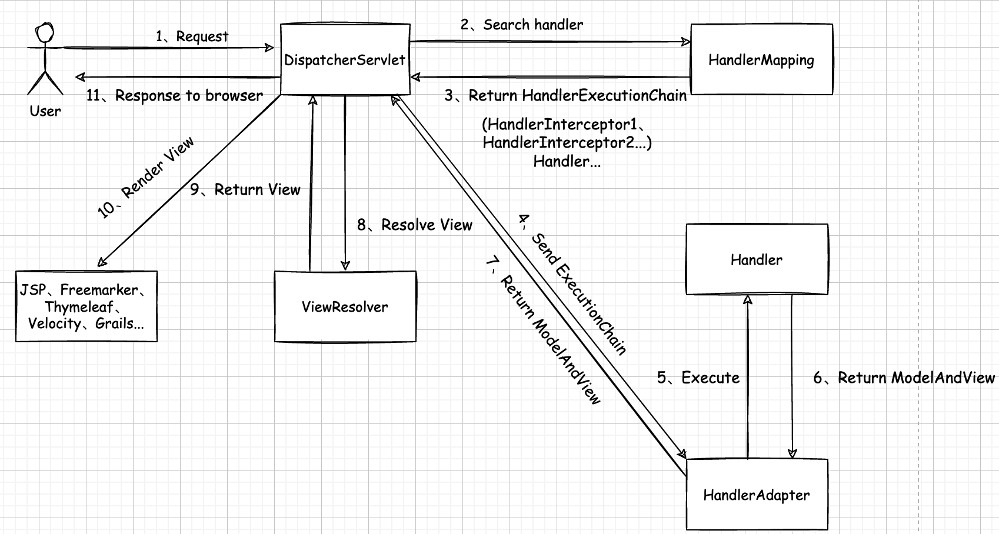

# SpringMVC(1)

# 一. 简介

Spring MVC 属于 SpringFramework 的后续产品，已经融合在 Spring Web Flow 里面。Spring 框架提供了 Web 应用程序的全功能的 MVC 模块。使用 Spring 可插入的 MVC 的架构，从而在使用 Spring 进行 WEB 开发时，可以选择使用 Spring 的 Spring MVC 框架或其他 MVC 开发框架，如 Structs(淘汰)等框架。

**M** 就是 Model 的缩写，也就是模型层，模型层有 Mybatis 框架封装持久化操作。

**V** 就是 View 的缩写，也就是视图层，视图层的技术有 HTML、CSS、JSP、Vue、React。

**C** 就是 Controller 的缩写，也就是控制层，控制层的技术有 Servlet，Spring MVC 封装了 Servlet。

Spring MVC 是 Spring 为展现层提供的基于 MVC 设计理念的优秀 Web 框架，是目前最主流的 MVC 框架之一。 SpringMVC 通过一套注解，可以让普通的 Java 类成为 Controller 控制器，无需继承 Servlet，实现了控制层和Servlet 之间的解耦。

Spring MVC 支持 Restful 风格的 URL 写法。

Spring MVC 采用了松耦合，可热插的主键结构，比其他的框架更具扩展性和灵活性。

# 二. 项目构建

## 2.1 导入依赖

首先创建一个 Java Web 项目，然后导入依赖，需要 Spring 框架作为核心依赖，然后就是 Spring MVC：

```xml
<dependency>
    <groupId>org.springframework</groupId>
    <artifactId>spring-context</artifactId>
    <version>5.2.12.RELEASE</version>
</dependency>

<dependency>
    <groupId>org.springframework</groupId>
    <artifactId>spring-webmvc</artifactId>
    <version>5.2.12.RELEASE</version>
</dependency>
```

为了能在开发阶段使用 Servlet API，需要导入 Servlet 依赖：

```xml
<dependency>
    <groupId>javax.servlet</groupId>
    <artifactId>javax.servlet-api</artifactId>
    <version>4.0.1</version>
    <scope>provided</scope>
</dependency>

<dependency>
    <groupId>javax.servlet.jsp</groupId>
    <artifactId>jsp-api</artifactId>
    <version>2.2</version>
    <scope>provided</scope>
</dependency>
```

## 2.2 配置web.xml

Spring MVC 有一个核心类那就是 `DispatcherServlet`，这个 Servlet 负责一切请求接受参数映射工作：

```xml
<servlet>
    <servlet-name>dispatcherServlet</servlet-name>
    <servlet-class>org.springframework.web.servlet.DispatcherServlet</servlet-class>
    <init-param>
        <param-name>contextConfigLocation</param-name>
        <param-value>classpath:spring-context.xml</param-value>
    </init-param>
    <load-on-startup>1</load-on-startup>
</servlet>
<servlet-mapping>
    <servlet-name>dispatcherServlet</servlet-name>
    <url-pattern>/</url-pattern>
</servlet-mapping>
```

## 2.3 配置Spring

Spring MVC 需要包扫描组件功能和最基本的视图解析器 Bean，编写以下配置项：

```xml
<context:component-scan base-package="org.codeArt"/>

<bean id="viewResolver" class="org.springframework.web.servlet.view.InternalResourceViewResolver">
    <property name="prefix" value="/WEB-INF/view/"/>
    <property name="suffix" value=".jsp"/>
</bean>
```

这样 Spring MVC 可以根据处理器返回值自动匹配 *WEB-INF/view/*下的视图文件。

## 2.4 配置日志

可以使用 log4j2 作为项目的日志框架，编写 **log4j2.xml** 配置文件：

```xml
<?xml version="1.0" encoding="UTF-8"?>
<Configuration status="DEBUG">
    <Appenders>
        <Console name="Console" target="SYSTEM_OUT">
            <PatternLayout pattern="%d{YYYY-MM-dd HH:mm:ss} [%t] %-5p %c{1}:%L - %msg%n" />
        </Console>
    </Appenders>
    <Loggers>
        <Root level="debug">
            <AppenderRef ref="Console" />
        </Root>
    </Loggers>
</Configuration>
```

## 2.5 编写控制器

```java
@Controller
@RequestMapping("/first")
public class FirstController {
    @RequestMapping("/hello")
    public String hello() {
        System.out.println("HelloWorld");
        return "hello";
    }
}
```

## 2.6 编写视图

在 *WEB-INF/view/* 下编写视图文件 *hello.jsp*：

```jsp
<%@ page contentType="text/html;charset=UTF-8" %>
<html>
<head>
    <title>Title</title>
</head>
<body>
  HelloWorld!
</body>
</html>
```

## 2.7 执行流程



- `DispatcherServlet`：前端控制器。

用户请求到达前端控制器，它就相当于 MVC 模式中的 **C**，DispatcherServlet 是整个流程控制的中心，由它调用其它组件处理用户的请求，DispatcherServlet 的存在降低了组件之间的耦合性。

- `HandlerMapping`：处理器映射器。

HandlerMapping 负责根据用户请求找到 Handler 即处理器，SpringMVC 提供了不同的映射器实现不同的映射方式，例如：配置文件方式，实现接口方式，注解方式等。

- `Handler`：处理器，用户自定义的 Controller。

它就是我们开发中要编写的具体业务控制器。由 DispatcherServlet 把用户请求转发到 Handler。由 Handler 对具体的用户请求进行处理。

- `HandlerAdapter`：处理器适配器。

通过 HandlerAdapter 对处理器进行执行，这是适配器模式的应用，通过扩展适配器可以对更多类型的处理器进行执行。

- `ViewResolver`：视图解析器。

View Resolver 负责将处理结果生成 View 视图，View Resolver 首先根据逻辑视图名解析成物理视图名即具体的页面地址，再生成 View 视图对象，最后对 View 进行渲染将处理结果通过页面展示给用户。

- `View`：视图。

Spring MVC 框架提供了很多的 View 视图类型的支持，包括：JstlView、FreemarkerView、PdfView 等。我们最常用的视图就是 JSP。 一般情况下需要通过页面标签或页面模版技术将模型数据通过页面展示给用户，需要由程序员根据业务需求开发具体的页面。

- `mvc:annotation-driven`：

在 SpringMVC 的各个组件中，**处理器映射器、处理器适配器、视图解析器**称为 SpringMVC 的三大组件。使用 `<mvc:annotation-driven/>` 自动加载 `RequestMappingHandlerMapping` （处理映射器） 和 `RequestMappingHandlerAdapter` (处 理 适 配 器)，可以在 *SpringMVC.xml* 配 置 文 件 中 使 用 `<mvc:annotation-driven/>`替代注解处理器和适配器的配置。这个配置还支持使用了 `ConversionService]`的实例对表单参数进行类型转换，支持使用 `@NumberFormat`、`@DateTimeFormat` 注解对数据类型进行格式化，支持使用 `@Valid` 对 JavaBean 进行 JSR-303 验证，支持使用 `@RequestBody`、`@ResponseBody`。

`DispatcherServlet` 核心源码：

```java
protected void doDispatch(HttpServletRequest request, HttpServletResponse response) throws Exception {
    HttpServletRequest processedRequest = request;
    HandlerExecutionChain mappedHandler = null;
    boolean multipartRequestParsed = false;

    WebAsyncManager asyncManager = WebAsyncUtils.getAsyncManager(request);

    try {
        ModelAndView mv = null;
        Exception dispatchException = null;

        try {
            processedRequest = checkMultipart(request);
            multipartRequestParsed = (processedRequest != request);

            // Determine handler for the current request.
            mappedHandler = getHandler(processedRequest);
            if (mappedHandler == null) {
                noHandlerFound(processedRequest, response);
                return;
            }

            // Determine handler adapter for the current request.
            HandlerAdapter ha = getHandlerAdapter(mappedHandler.getHandler());

            // Process last-modified header, if supported by the handler.
            String method = request.getMethod();
            boolean isGet = "GET".equals(method);
            if (isGet || "HEAD".equals(method)) {
                long lastModified = ha.getLastModified(request, mappedHandler.getHandler());
                if (new ServletWebRequest(request, response).checkNotModified(lastModified) && isGet) {
                    return;
                }
            }

            if (!mappedHandler.applyPreHandle(processedRequest, response)) {
                return;
            }

            // Actually invoke the handler.
            mv = ha.handle(processedRequest, response, mappedHandler.getHandler());

            if (asyncManager.isConcurrentHandlingStarted()) {
                return;
            }

            applyDefaultViewName(processedRequest, mv);
            mappedHandler.applyPostHandle(processedRequest, response, mv);
        }
        catch (Exception ex) {
            dispatchException = ex;
        }
        catch (Throwable err) {
            // As of 4.3, we're processing Errors thrown from handler methods as well,
            // making them available for @ExceptionHandler methods and other scenarios.
            dispatchException = new NestedServletException("Handler dispatch failed", err);
        }
        processDispatchResult(processedRequest, response, mappedHandler, mv, dispatchException);
    }
    catch (Exception ex) {
        triggerAfterCompletion(processedRequest, response, mappedHandler, ex);
    }
    catch (Throwable err) {
        triggerAfterCompletion(processedRequest, response, mappedHandler,
                               new NestedServletException("Handler processing failed", err));
    }
    finally {
        if (asyncManager.isConcurrentHandlingStarted()) {
            // Instead of postHandle and afterCompletion
            if (mappedHandler != null) {
                mappedHandler.applyAfterConcurrentHandlingStarted(processedRequest, response);
            }
        }
        else {
            // Clean up any resources used by a multipart request.
            if (multipartRequestParsed) {
                cleanupMultipart(processedRequest);
            }
        }
    }
}
```

# 三. 获取请求参数

## 3.1 RequestMapping

`@RequestMapping` 注解可以用于请求路径映射到处理器，*method* 属性可以控制请求的方式，值为 `RequestMethod` 的枚举值。

```java
@RequestMapping(value = "/list", method = RequestMethod.GET)
public List<String> list() {
    // ...
}
```

`@RequestMapping` 可以控制请求参数 *params* 和请求头 *headers*：

- *params*：表示请求中必须包含某个参数。

```java
@RequestMapping(value = "/list", params = {"username", "password != null"})
```

表示必须包含 `username` 这个参数，而且 `password` 不能为空。假如是 `!username` 那么则表示不能包含这个参数。多个条件可以写进一个数组。

```java
@RequestMapping( value = "/***", headers = {"Accept-Encoding=gzip, deflate"})
```

## 3.2 参数匹配

参数获取的方式通常有两种：

- 紧耦合方式：

`DispatcherServlet` 中的 *service* 方法直接将此次请求的 request 对象传递给调用的单元方法即可。同时在单元方法上声明形参 `HttpServletRequest` 来接收 request 实参即可。

```java
@RestController
public class HelloController {
    @RequestMapping("/hello")
    public String hello(HttpServletRequest req, HttpServletResponse resp) {
        String username = req.getParameter("username");
        String password = req.getParameter("password");
        return "hello";
    }
}
```

- 解耦合方式：

`DispatcherServlet` 在其 *service* 方法中将请求数据根据需求从 request 对象中获取出来后，将数据直接传递给对应的单元方法使用。同时在单元方法上直接声明对应的形参接收请求数据即可。在单元方法上声明形参来接收请求数据时，形参名必须和请求数据的键名一致，DispatcherServlet 会将调用单元方法的形参名作为请求数据的键名获取请求数据，然后传递给单元方法。

```java
@RestController
public class HelloController {
    @RequestMapping("/hello")
    public String hello(String username, @RquestParam("pwd") String password) {
        return "hello";
    }
}
```

请求的参数名称必须和方法参数名称相同，不同的话那就用 `@RequestParam` 注解做映射，注解传入请求的参数名称。

### 3.2.1 使用Pojo映射

在 Spring MVC 中，可以使用一个 Java 实体类来映射一个表单中的所有项，但是前提是表单中的项的 *name* 属性值必须要和实体类的属性名称相同才可以映射。

*表单*：

```html
<form action="toPojo" method="post">
    <p>姓名<input type="text" name="pname"></p>
    <p>年龄<input type="text" name="page"></p>
    <p>性别:
        <input type="radio" name="gender" value="1" >男
        <input type="radio" name="gender" value="0" >女
    </p>
    <p>爱好
        <input type="checkbox" name="hobby" value="1"> 篮球
        <input type="checkbox" name="hobby" value="2"> 足球
        <input type="checkbox" name="hobby" value="3"> 羽毛球
    </p>生日
    <p>
        <input type="text" name="birthdate">
    </p>
    <input type="submit">
</form>
```

*实体类 Person*：

```java
@Data
public class Person implements Serializable {
    private String pname;
    private String page;
    private String gender;
    private String[] hobby;
    private String birthdate;
}
```

*Controller*：

```java
@RestController
public class DemoController {
    @RequestMapping("toPojo")
    public String getDataByPojo(Person p){
        System.out.println(p);
        return "success";
    }
}
```

Spring MVC 底层通过 *setter* 方法给参数进行注入，假如实体类没有 *setter* 方法，那么就会报错。

### 3.2.2 日期类型映射

在 Spring MVC 中，可以使用 `DateTimeFormat(pattern = "yyyy-MM-dd hh:mm:ss")` 注解给日期类型参数格式化。这个注解可以作用于**参数列表中或者类的属性上**。

```java
@RequestMapping("toPojo")
public String getDate(@DateTimeFormat(pattern = "yyyy-MM-dd hh:mm:ss") Date birthday) {
    System.out.println(birthday);
    return "success";
}
```

```java
@DateTimeFormat(pattern = "yyyy-MM-dd hh:mm:ss")
private Date birthday;
```

这只是其中一种方式，还有一种方式那就是使用自定义类型转换器来进行日期格式的转换。

声明 `DateConverter` 实现 Spring 内置的 `Converter<String, Date>` 接口：

```java
public class DateConverter implements Converter<String, Date> {
    
    private static final SimpleDateFormat formatter = new SimpleDateFormat("yyyy-MM-dd hh:mm:ss");

    @Override
    public Date convert(String source) {
        try {
            return formatter.parse(source);
        } catch (ParseException e) {
            e.printStackTrace();
        }
        return null;
    }
}
```

然后在上下文配置文件中配置转换器：

```xml
<bean id="conversionService" class="org.springframework.context.support.ConversionServiceFactoryBean">
    <property name="converters">
        <array>
            <bean class="org.codeArt.converter.DateConverter"/>
        </array>
    </property>
</bean>

<mvc:annotation-driven conversion-service="conversionService"/>
```

这时候 `String` 类型就可以自动映射为 `Date` 类型了，但是就不要使用 `@DateTimeFormat` 注解了。

### 3.2.3 List集合映射

`List` 类型的参数同样可以映射，现在在 `Person` 类中添加一个 *pets* 属性：

```java
private List<Pet> pets;
```

添加几个表单项，修改其中的 *name* 属性值：

```html
宠物:
<p>
    宠物1： 
    名字：<input type="text" name="pets[0].petName">
    类型：<input type="text" name="pets[0].petType">
</p>
<p>
    宠物2： 
    名字：<input type="text" name="pets[1].petName">
    类型：<input type="text" name="pets[1].petType">
</p>
```

`pets[0].petName` 表示集合 `pets` 的第 0 个元素的 *petName* 属性，`pets[1].petType` 依次类推。这个表单提交之后那么 `pets` 集合中就有了两个元素。

### 3.2.4 Map集合映射

`Map` 集合类型的参数映射起来也很简单，和 `List` 集合映射方式类似，只需要在 *name* 属性后使用 `[]` 声明 `Map` 集合的键名即可。给 `Person` 类添加一个 *petMap* 属性：

```java
private Map<String, Pet> petMap;
```

添加几个表单项：

```html
宠物Map：
<p>
    宠物1： 
    名字：<input type="text" name="petMap['a'].petName">
    类型：<input type="text" name="petMap['a'].petType">
</p>
<p>
    宠物2：
    名字：<input type="text" name="petMap['b'].petName">
    类型：<input type="text" name="petMap['b'].petType">
</p>
```

映射完成之后，`Map` 集合中就有了 *a* 和 *b* 两个键，对应着两个 `Pet` 对象。

## 3.3 常见注解

1. `@RequestMapping`：

上面已经介绍过了，不猜赘述。需要强调的是，当这个注解作用在类上时，表示这个是第一级访问目录，还需要在方法上添加 `@RequestMapping` 注解才能匹配到对应的 Controller。请求路径的 `/` 可写或者可以不写，Spring MVC 会自动容错。

2. `@RequestParam`：

`@RequestParam` 注解可以把指定名称的参数给控制器中的形参赋值。

属性：

- *value*：请求参数的名称，不写默认就是。
- *required*：是否必须提供，默认值为 `true`，表示必须提供，不然报错。
- *defaultValue*：默认值，假如没有成功映射，那么可以提供一个默认值给形参，避免报错。Spring MVC 会自动做类型转换

```java
public void helloWorld(@RequestParam(value = "score", defaultValue = "10") Integer score) {
    // ...
}
```

上述例子，自动将 `String` 转为 `Integer`。

3. `@PathVariable`：

`@PathVariable` 注解用于解析路径中的动态参数，多用于和 Restful 接口路径参数搭配使用。

同样有 *value* 和 *required* 属性。

```java
@Controller
@RequestMapping("user")
public class UserController {
    @RequestMapping("/{id}")
    public User getById(@PathVariable("id") Integer id) {
        // ...
    }
}
```

上述例子，使用注解解析路径中的 `id` 参数，然后映射给形参 `id`，同样类型转换也是自动进行的。

4. `@RequestHeader`：

`@RquestHeader` 注解用于获取请求头中的参数，同样有两个属性分别是：*value* 和 *required*。

```java
@RequestMapping("/getRequestHeader") 
public String header(@RequestHeader(value = "Accept", required = false) String requestHeader) { 
    System.out.println(requestHeader); 
    return "success"; 
}
```

5. `@CookieValue`：

`@CookieValue` 注解用于把指定的 cookie 名称的值传入控制器的方法参数。同样有两个属性分别是：*value* 和 *required*。

```java
@RequestMapping("/getCookie") 
public String getCookie(@CookieValue(value = "JSESSIONID", required = false) String cookie) { 
    System.out.println(cookieValue); 
    return "success"; 
} 
```

## 3.4 处理响应

Spring MVC 会根据控制器方法的返回值给前端返回不同的数据，可以是 `void`、转发重定向还可以是返回 json 数据。

### 3.4.1 返回值void

```java
@RequestMapping("/testReturnVoid") 
public void testReturnVoid() throws Exception { 
    System.out.println("AccountController 的 testForward 方法执行了");
}
```

在 Spring MVC 中如果对于当前的控制单元，没有写对应的返回值，这个时候 Spring MVC 就会**找和自己控制单元名称一致的页面**展示，如果没有配置视图解析器的前缀和后缀是没有产生 404，需要注意控制单元仍然可以进。

### 3.4.2 Servlet转发和重定向

```java
@RequestMapping("demo1")
public void testDemo(HttpServletRequest request, HttpServletResponse response) throws Exception {
    // 请求转发
    // request.getRequestDispatcher("/forward.jsp").forward(request, response);
    // 响应重定向
    response.sendRedirect(request.getContextPath() + "/redirect.jsp");
}
```

单元方法的返回值类型设置 `void`。因为使用 response 对象在单元方法中直接对此次请求进行了响应，不再通过 `DispatcherServlet` 了，既然已经响应了，就不需要再给 `DispatcherServlet` 返回值了。在单元方法上声明 `HttpServletResponse` 形参，来接收此次请求的 response 对象。

### 3.4.3 forward指令

在 Spring MVC 中控制器方法的返回值设为 `String` 表示你可能返回的是一个视图名称，Spring MVC 会自动解析视图。使用 `forward` 指令可以做转发操作，但是也可以省略不写这个指令名称。

```java
@RequestMapping("demo")
public String testDemo() throws Exception {
    // return "forward:success";
    return "success";
}
```

### 3.4.4 redirect指令

`redirec` 指令可以告诉 Spring MVC 做重定向操作，路径中以 `/` 开头表示当前项目下，这里不需要使用上下文路径。

```java
@RequestMapping("demo")
public String testDemo() throws Exception {
    return "redirect:/redirectPage.jsp";
}
```

使用通过单元方法的返回值来告诉 `DispatcherServlet` 重定向指定的资源，注意这个 `redirect` 关键字不可以省去。

### 3.4.5 使用View

```java
@RequestMapping("demo")
public View testDemo(HttpServletRequest req) {
    View  view = null;
    // 请求转发
    // view =new InternalResourceView("/forwardPage.jsp");
    // 重定向
    view = new RedirectView(req.getContextPath() + "/redirectPage.jsp");
    return view;
}
```

`RedirectView` 中所做的操作，最终的实现是在 *renderMergedOutputModel* 中完成实现的，简单来说`RedirectView` 实现了链接的重定向，并且将数据保存到 FlashMap 中，这样在跳转后的链接中可以获取一些数据。

### 3.4.6 使用ModelAndView

```java
@RequestMapping("demo")
public ModelAndView testDemo(HttpServletRequest req) {
    ModelAndView mv = new ModelAndView();
    // 请求转发
    // mv.setViewName("forward:/forwardPage.jsp");
    // mv.setView(new InternalResourceView("/forwardPage.jsp"));
    // 重定向
    // mv.setViewName("redirect:/redirectPage.jsp");
    mv.setView(new RedirectView(req.getContextPath() + "/redirectPage.jsp"));
    return mv;
}
```

`ModelAndView` 中的 Model 代表模型，View 代表视图，这个名字就很好地解释了该类的作用。业务处理器调用模型层处理完用户请求后，把结果数据存储在该类的 model 属性中，把要返回的视图信息存储在该类的 *view* 属性中，然后让该 `ModelAndView` 返回该 Spring MVC 框架。

### 3.4.7 响应json数据

当浏览器发起一个 Ajax请求给服务器，服务器调用对应的单元方法处理 Ajax请求。而 Ajax 的请求在被处理完成后，其处理结果需要直接响应。而目前我们在单元方法中响应 Ajax 请求，使用的是 response 对象，需要我们自己将要响应的数据转换  为 json 字符串响应，比较麻烦，而我们一直希望在单元方法中无论是否是 Ajax 请求，都使用 `return` 语句来完成资源的响应，怎么办？

既然我们希望使用单元方法的返回值来响应 Ajax 请求的处理结果，而目前 `DispatcherServlet` 的底层会将单元方法的返回值按照请求转发或者重定向来处理，所以就需要我们告诉 `DispatcherServlet`，单元方法的返回值不要按照请求转发或者重定向处理，而是按照直接响应处理，将单元方法的返回值直接响应给浏览器。

使用 `@ReponseBody` 注解可以直接将方法的返回值转换成 json 数据返回给前端：

```java
@ResponseBody
@RequestMapping("testAjax")
public User testAjax() {
    User user = new User("洛必达", "123456");
    return user;
}
```

前端使用 jQuery 或者 axios 等异步请求库即可。

也可以使用 `@RestController` 注解将一个 Controller 的所有的方法的返回值都自动转成 json 数据返回给浏览器。`@RestController` 注解相当于是 `@Controller` 和 `@ResponseBody` 两个注解的组合，但是使用这个注解之后就不能返回 JSP、Html 等视图资源了，这个注解时候前后端分离开发。

```java
@RestController
@RequestMapping("user")
public class UserController {
    @RequestMapping("list")
    public List<User> list() {
        // ...
        return users;
    }
}
```

## 3.5 Restful接口

**Restful** 也就是**表述性状态转移**，它是一组架构约束条件和原则。满足这些约束条件的原则的应用程序或设计就是 **Restful**。需要注意的是，REST 是设计风格而不是标准。REST 通常基于使用 HTTP、URI 和 XML 以及 HTML 这些现有的广泛流行的协议和标准。

REST 定义了一组体系架构原则，你可以根据这些设计原则以系统资源为中心的 Web 服务，包括使用不同语言编写的客户端如何通过 HTTP 处理和传输资源状态。如何考虑使用它的 Web 服务的数量，REST 近年来已经成为最主要的 Web 服务设计模式。事实上，REST 对 Web 的影响非常大，由于其使用相当方便，已经普遍地取代了基于 SOAP 和 WSDL 的接口设计。

Http 协议中,四个表示操作方式的动词 **GET**、**POST**、**PUT**、**DELETE**，他们对应四种基本操作。**GET** 用来获取资源，**POST** 用来新建资源，**PUT** 用来更新资源，**DELETE** 用来删除资源。

表单提交不支持 **PUT** 和 **DELETE** 方法，需要使用一个隐藏域提交一个参数 *_method*。

```html
<form action="rest/testRest/10" method="POST">
    <input  type="hidden" name="_method" value="PUT">
    <input type="submit" value="testPUT">
</form>
<br/>

<form action="rest/testRest/10" method="POST">
    <input  type="hidden" name="_method" value="DELETE">
    <input type="submit" value="testDELETE">
</form>
<br/>

<form action="rest/testRest/10" method="POST">
    <input type="submit" value="testPOST">
</form>
<br/>

<form action="rest/testRest/10" method="GET">
    <input type="submit" value="testGET">
</form>
```

还需要配置 *web.xml* 配置文件，引入 `HiddenHttpMethodFilter` 来做请求转换，识别有隐藏域的表单：

```xml
<filter>
    <filter-name>hiddenHttpMethodFilter</filter-name>
    <filter-class>org.springframework.web.filter.HiddenHttpMethodFilter</filter-class>
</filter>
<filter-mapping>
    <filter-name>hiddenHttpMethodFilter</filter-name>
    <url-pattern>/*</url-pattern>
</filter-mapping>
```

转换源码：

```java
public class HiddenHttpMethodFilter extends OncePerRequestFilter {

	private static final List<String> ALLOWED_METHODS =
			Collections.unmodifiableList(Arrays.asList(HttpMethod.PUT.name(),
					HttpMethod.DELETE.name(), HttpMethod.PATCH.name()));

	/** Default method parameter: {@code _method}. */
	public static final String DEFAULT_METHOD_PARAM = "_method";

	private String methodParam = DEFAULT_METHOD_PARAM;


	/**
	 * Set the parameter name to look for HTTP methods.
	 * @see #DEFAULT_METHOD_PARAM
	 */
	public void setMethodParam(String methodParam) {
		Assert.hasText(methodParam, "'methodParam' must not be empty");
		this.methodParam = methodParam;
	}

	@Override
	protected void doFilterInternal(HttpServletRequest request, HttpServletResponse response, FilterChain filterChain)
			throws ServletException, IOException {

		HttpServletRequest requestToUse = request;

		if ("POST".equals(request.getMethod()) && request.getAttribute(WebUtils.ERROR_EXCEPTION_ATTRIBUTE) == null) {
			String paramValue = request.getParameter(this.methodParam);
			if (StringUtils.hasLength(paramValue)) {
				String method = paramValue.toUpperCase(Locale.ENGLISH);
				if (ALLOWED_METHODS.contains(method)) {
					requestToUse = new HttpMethodRequestWrapper(request, method);
				}
			}
		}

		filterChain.doFilter(requestToUse, response);
	}


	/**
	 * Simple {@link HttpServletRequest} wrapper that returns the supplied method for
	 * {@link HttpServletRequest#getMethod()}.
	 */
	private static class HttpMethodRequestWrapper extends HttpServletRequestWrapper {

		private final String method;

		public HttpMethodRequestWrapper(HttpServletRequest request, String method) {
			super(request);
			this.method = method;
		}

		@Override
		public String getMethod() {
			return this.method;
		}
	}

}
```

声明 `RestfulController`：

```java
@RequestMapping(value = "rest")
@RestController
public class RestfulController {
    @RequestMapping(value = "testRest/{id}", method = RequestMethod.PUT)
    public String testPut(@PathVariable(value = "id") Integer id) {
        System.out.println("testPut, id:" + id);
        return "show";
    }

    @RequestMapping(value = "testRest/{id}", method = RequestMethod.DELETE)
    public String testDelete(@PathVariable(value = "id") Integer id) {
        System.out.println("testDelete, id:" + id);
        return "show";
    }
    
    @RequestMapping(value = "testRest/{id}", method = RequestMethod.POST)
    public String testPOST(@PathVariable(value = "id") Integer id) {
        System.out.println("testPOST, id:" + id);
        return "show";
    }
    
    @RequestMapping(value = "testRest/{id}", method = RequestMethod.GET)
    public String testGET(@PathVariable(value = "id") Integer id) {
        System.out.println("testGET, id:" + id);
        return "show";
    }
}
```

## 3.6 编码问题

若参数映射出现了乱码问题，那么只需要在 *web.xml* 配置一下过滤器即可：

```xml
<filter>
    <filter-name>characterEncodingFilter</filter-name>
    <filter-class>org.springframework.web.filter.CharacterEncodingFilter</filter-class>
    <init-param>
        <param-name>encoding</param-name>
        <param-value>UTF-8</param-value>
    </init-param>
</filter>
<filter-mapping>
    <filter-name>characterEncodingFilter</filter-name>
    <url-pattern>/*</url-pattern>
</filter-mapping>
```