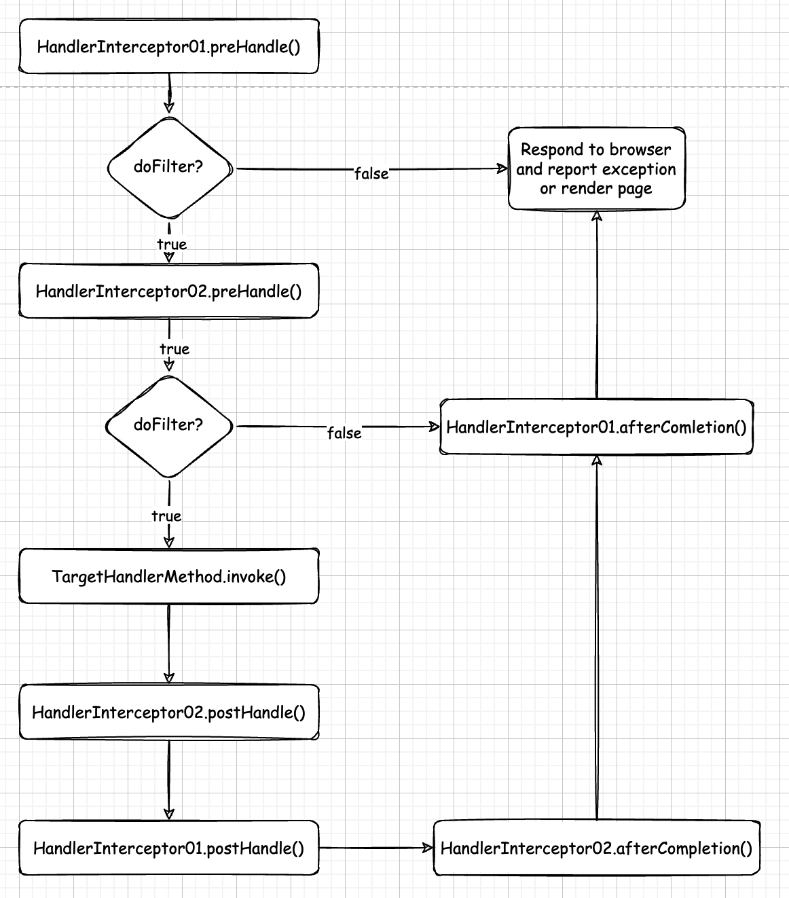
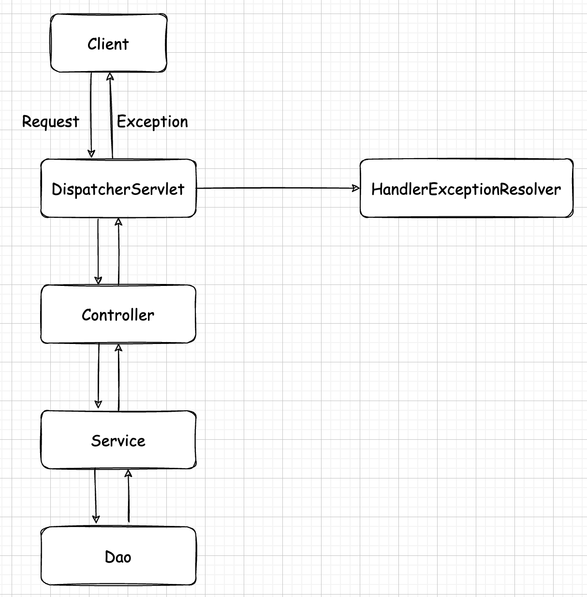

# SpringMVC(2)

# 一. 整合SSM

虽然 Spring 和 Spring MVC 可以共用一个上下文配置文件，但是最好分开，各司其职。做个了解即可。

引入 **spring-context** 依赖：

```xml
<dependency>
    <groupId>org.springframework</groupId>
    <artifactId>spring-context</artifactId>
    <version>5.2.12.RELEASE</version>
</dependency>
```

创建 *log4j2.xml* 配置文件：

```xml
<?xml version="1.0" encoding="UTF-8"?>
<Configuration status="DEBUG">
    <Appenders>
        <Console name="Console" target="SYSTEM_ERR">
            <PatternLayout pattern="%d{YYYY-MM-dd HH:mm:ss} [%t] %-5p %c{1}:%L - %msg%n" />
        </Console>
    </Appenders>
    <Loggers>
        <Root level="DEBUG">
            <AppenderRef ref="Console" />
        </Root>
    </Loggers>
</Configuration>
```

创建 *jdbc.properties* 配置文件：

```properties
driver=com.mysql.cj.jdbc.Driver
url=jdbc:mysql://127.0.0.1:3306/test?useSSL=false&useUnicode=true&characterEncoding=UTF-8&serverTimezone=Asia/Shanghai
username=root
password=root
```

配置 *spring-mvc-context.xml* 配置文件：

```xml
<?xml version="1.0" encoding="UTF-8"?>
<beans xmlns="http://www.springframework.org/schema/beans"
       xmlns:xsi="http://www.w3.org/2001/XMLSchema-instance"
       xmlns:mvc="http://www.springframework.org/schema/mvc"
       xsi:schemaLocation="http://www.springframework.org/schema/beans 
       http://www.springframework.org/schema/beans/spring-beans.xsd 
       http://www.springframework.org/schema/mvc 
       https://www.springframework.org/schema/mvc/spring-mvc.xsd">

    <mvc:annotation-driven/>
    <mvc:resources mapping="/static/**" location="static/"/>
    
    <bean id="viewResolver" class="org.springframework.web.servlet.view.InternalResourceViewResolver">
        <property name="prefix" value="/WEB-INF/view/"/>
        <property name="suffix" value=".jsp"/>
    </bean>
</beans>
```

配置 *spring-context.xml* 配置文件：

```xml
<?xml version="1.0" encoding="UTF-8"?>
<beans xmlns="http://www.springframework.org/schema/beans"
       xmlns:xsi="http://www.w3.org/2001/XMLSchema-instance"
       xmlns:context="http://www.springframework.org/schema/context"
       xmlns:aop="http://www.springframework.org/schema/aop"
       xmlns:tx="http://www.springframework.org/schema/tx" 
       xmlns:mvc="http://www.springframework.org/schema/mvc"
       xsi:schemaLocation="http://www.springframework.org/schema/beans 
       http://www.springframework.org/schema/beans/spring-beans.xsd 
       http://www.springframework.org/schema/context 
       https://www.springframework.org/schema/context/spring-context.xsd 
       http://www.springframework.org/schema/aop 
       https://www.springframework.org/schema/aop/spring-aop.xsd
       http://www.springframework.org/schema/tx 
       http://www.springframework.org/schema/tx/spring-tx.xsd 
       http://www.springframework.org/schema/mvc 
       https://www.springframework.org/schema/mvc/spring-mvc.xsd">

    <context:component-scan base-package="org.codeArt"/>
    <context:property-placeholder location="classpath:jdbc.properties"/>

    <aop:aspectj-autoproxy/>
    <tx:annotation-driven transaction-manager="transactionManager"/>

    <bean id="dataSource" class="com.alibaba.druid.pool.DruidDataSource">
        <property name="username" value="${username}"/>
        <property name="password" value="${password}"/>
        <property name="url" value="${url}"/>
        <property name="driverClassName" value="${driver}"/> 
        <property name="initialSize" value="1"/>
    </bean>
    
    <bean id="transactionManager" class="org.springframework.jdbc.datasource.DataSourceTransactionManager">
        <property name="dataSource" ref="dataSource"/>
    </bean>
    
    <!-- 配置SqlSessionFactoryBean，负责创建SqlSession -->
    <bean id="sqlSessionFactoryBean" class="org.mybatis.spring.SqlSessionFactoryBean">
        <property name="dataSource" ref="dataSource"/>
        <property name="typeAliasesPackage" value="org.codeArt.pojo"/>
    </bean>
    
    <!-- 配置扫描的包，动态创建mapper对象 -->
    <bean id="mapperScannerConfigurer" class="org.mybatis.spring.mapper.MapperScannerConfigurer">
        <property name="sqlSessionFactoryBeanName" value="sqlSessionFactoryBean"/>
        <property name="basePackage" value="org.codeArt.mapper"/>
    </bean>
</beans>
```

配置 *web.xml* 配置文件：

```xml
<?xml version="1.0" encoding="UTF-8"?>
<web-app xmlns="http://xmlns.jcp.org/xml/ns/javaee"
         xmlns:xsi="http://www.w3.org/2001/XMLSchema-instance"
         xsi:schemaLocation="http://xmlns.jcp.org/xml/ns/javaee http://xmlns.jcp.org/xml/ns/javaee/web-app_4_0.xsd"
         version="4.0">
    
    <!-- spring核心配置文件位置 -->
    <context-param>
        <param-name>contextConfigLocation</param-name>
        <param-value>classpath:spring-context.xml</param-value>
    </context-param>
    
    <!-- spring Listener -->
    <listener>
        <listener-class>org.springframework.web.context.ContextLoaderListener</listener-class>
    </listener>

    <servlet>
        <servlet-name>dispatcherServlet</servlet-name>
        <servlet-class>org.springframework.web.servlet.DispatcherServlet</servlet-class>
        <init-param>
            <param-name>contextConfigLocation</param-name>
            <param-value>classpath:spring-context.xml</param-value>
        </init-param>
        <load-on-startup>1</load-on-startup>
    </servlet>
    <servlet-mapping>
        <servlet-name>dispatcherServlet</servlet-name>
        <url-pattern>/</url-pattern>
    </servlet-mapping>
    
    
```

目前为止 SSM 框架就整合完毕了，若是嫌麻烦可以把 Spring 的配置项写到 Spring MVC 配置文件里面来，都是互通的，那这样监听器也没有存在的必要了。

# 二. 作用域传参

Spring MVC 支持使用域对象传递数据，可以使用原生的 request 域或者 session 域，也可以使用 Spring MVC 提供的 `Model` 或者 `ModelAndView`。

## 2.1 传统方式

Spring MVC 会自动注入 `HttpServletRequest` 或者 `HttpSession`。

```java
@Controller
public class ScopeController {
    @Autowired
    private UserService userService;
   
    // request,session 这两个域直接放在参数列表上即可,SpringMVC就可以给我们注入
    // ServletContext对象(application域) 不能直接放在参数列表上的
    @RequestMapping("setData")
    public String setData(HttpServletRequest req, HttpSession session) {
        List<User> users = userService.findAllUser();
        // 向三个域中放入数据
        req.setAttribute("message", "reqMessage");
        req.setAttribute("users", users);
        session.setAttribute("message", "sesssionMessage");
        session.setAttribute("users", users);
        ServletContext application = req.getServletContext();
        application.setAttribute("message", "applictionMessage");
        application.setAttribute("users", users);
        // 跳转至showDataPage
        return "showDataPage";
    }
}
```

## 2.2 Model方式

Spring MVC 提供的 `Model` 对象主要是对请求域传递数据进行了 API 封装，降低了 Controller 和 Servlet 之间的耦合度。若使用重定向，那么没法使用 `Model` 传递域中的数据。`Model` 中的字符串类型的键值对信息会**转换成为请求参数**，转发给目标组件。

```java
@RequestMapping("setData")
public String setData2(Model model) {
    List<User> users = userService.findAllUser();
    // 向域中放入数据
    model.addAttribute("message", "reqMessage");
    model.addAttribute("users", users);
    // 跳转至showDataPage
    // return "forward:/showDataPage.jsp";
    return "redirect:/showDataPage.jsp";
}
```

## 2.3 ModelAndView方式

Spring MVC 提供的 `ModelAndView` 类不仅可以存入数据而且还可以设置跳转的视图。

```java
@RequestMapping("setData")
public ModelAndView setData3() {
    ModelAndView mv = new ModelAndView();
    Map<String, Object> model = mv.getModel();
    // 向request域中放入数据
    List<User> users = userService.findAllUser();
    model.put("message", "reqMessage");
    model.put("users", users);
    // 设置视图
    // mv.setViewName("forward:/showDataPage.jsp");
    mv.setViewName("redirect:/showDataPage.jsp");
    return mv;
}
```

# 三. 文件操作

Spring MVC 内置了功能强大的文件上传组件，那就是 `MultipartResolver`。首先为了简化文件的 I/O 操作，需要导入 **commons-io** 依赖：

```xml
<dependency>
    <groupId>commons-fileupload</groupId>
    <artifactId>commons-fileupload</artifactId>
    <version>1.4</version>
</dependency>

<dependency>
    <groupId>commons-io</groupId>
    <artifactId>commons-io</artifactId>
    <version>2.11.0</version>
</dependency>
```

## 2.1 文件上传

配置文件上传解析器：

```xml
<bean id="multipartResolver" class="org.springframework.web.multipart.commons.CommonsMultipartResolver">
    <!-- 设置文件大小最多5MB -->
    <property name="maxUploadSize" value="5242880"/>
</bean>
```

文件解析器 Bean 对象的 *id* **必须**为 `multipartResolver`，不然 Spring MVC 无法解析。

编写页面代码：

```jsp
<%@ page contentType="text/html;charset=UTF-8" %>
<html>
<head>
  <title>Title</title>
  <style>
    .progress {
      width: 200px;
      height: 10px;
      border: 1px solid #ccc;
      border-radius: 10px;
      margin: 10px 0;
      overflow: hidden;
    }

    .progress > div {
      width: 0;
      height: 100%;
      background-color: yellowgreen;
      transition: all .3s ease;
    }
  </style>
  <script src="https://code.jquery.com/jquery-3.6.1.min.js"></script>
</head>
<body>
<form action="upload/avatar" method="post" onsubmit="return false">
  <label for="avatar">上传头像：</label><br>
  <br>
  <input id="avatar" type="file"><br>
  
  <%-- 进度条 --%>
  <div class="progress">
    <div></div>
  </div>
  <button id="upload_btn">上传</button>
</form>
<a href="file/download?fileName=1aeb68de-77b3-4be4-815c-bc9d064e44b7.png">下载文件</a>
</body>
</html>
<script>
  $("#upload_btn").click(function () {
    var file = $("#avatar")[0].files[0]
    if (file === undefined) {
      return alert("未选中")
    }
    var formData = new FormData()
    formData.append("avatar", file)
    $.ajax({
      type: 'POST',
      data: formData,
      url: 'file/avatar',
      processData: false,
      contentType: false,
      success: function (result) {
        console.log(result)
        $("#avatar_img").attr("src", result)
      },
      xhr: function () {
        var xhr = new XMLHttpRequest()
        // 使用XMLHttpRequest.upload监听上传过程，注册progress事件，打印回调函数中的event事件
        xhr.upload.addEventListener('progress', function (e) {
          console.log(e)
          // loaded代表上传了多少
          // total代表总数为多少
          var progressRate = (e.loaded / e.total) * 100 + '%'
          // 通过设置进度条的宽度达到效果
          $('.progress > div').css('width', progressRate)
        })
        return xhr
      }
    })
  })
</script>
```

编写 Controller：

```java
@RestController
@RequestMapping("file")
public class FileController {

    @PostMapping("avatar")
    public String upload(MultipartFile avatar, HttpServletRequest request) throws IOException {
        String realPath = request.getServletContext().getRealPath("/static/upload");
        File dir = new File(realPath);
        if (!dir.exists()) {
            dir.mkdirs();
        }
        String originalFilename = avatar.getOriginalFilename();
        String uuid = UUID.randomUUID().toString();
        String extendedName = originalFilename.substring(originalFilename.lastIndexOf("."));
        String target = uuid.concat(extendedName);
        File file = new File(dir, target);
        avatar.transferTo(file);
        // 返回图片存储的地址
        return request.getContextPath() + "/static/upload/" + target;
    }
}
```

最终要给前端传递文件存储的位置，也就是 URL，然后前端使用 jQuery 操作 `` 标签的 *src* 属性来显示图片。因为配置了最大上传的文件大小的限制，所以假如你上传的文件大小超出了那么 Spring 就会报异常。

## 2.2 文件下载

文件下载需要使用文件流读取文件然后写入到前端。还需要设置响应头的 *Content-Disposition* 属性为 **attachment;filename=file**。**file** 指的是传给前端的文件的名字。设置了 *Content-Disposition* 属性之后，浏览器不会解析页面路径而是会自动地下载文件。attachment 表示附件的意思，所以不会做其他操作。

上述页面有一个超链接标签，*href* 属性指向后端 Controller，给后端传递了文件名称，后端根据文件名称读取然后下载文件。

编写 Controller：

```java
@RestController
@RequestMapping("file")
public class FileController {

    @GetMapping("download")
    public void download(@RequestParam("fileName") String fileName, HttpServletRequest request, HttpServletResponse response) {
        ServletContext context = request.getServletContext();
        String mimeType = context.getMimeType(fileName);
        String realPath = context.getRealPath("/static/upload/" + fileName);
        response.setContentType(mimeType);
        response.setHeader("Content-Disposition", "attachment;filename=" + fileName);
        try {
            InputStream is = Files.newInputStream(Paths.get(realPath));
            ServletOutputStream os = response.getOutputStream();
            IOUtils.copy(is, os);
        } catch (IOException e) {
            e.printStackTrace();
        }
    }
}
```

# 四. 拦截器

Spring MVC 中的拦截器(Interceptor)类似于 Java Web 中的过滤器(Filter)，它主要用于拦截用户请求并作相应的处理。例如通过拦截器可以进行权限验证、记录请求信息的日志、判断用户是否登录等。 		

  要使用 Spring MVC 中的拦截器，就需要对拦截器类进行定义和配置。通常拦截器类可以通过两种方式来定义。 		

1. 通过实现 `HandlerInterceptor` 接口，或继承 `HandlerInterceptor` 接口的实现类(如`HandlerInterceptorAdapter`)来定义。 		

2. 通过实现 `WebRequestInterceptor` 接口，或继承 `WebRequestInterceptor` 接口的实现类来定义。

**拦截器和过滤器的区别：**

1. 拦截器是 Spring MVC 的，而过滤器是 Servlet 的。
2. 拦截器不依赖与 Servlet 容器，由 Spring 容器初始化，过滤器依赖与 Servlet 容器，由 Servlet 容器初始化。
3. 拦截器只能对 action 请求起作用，而过滤器则可以对几乎所有的请求起作用。
4. 拦截器可以访问 action 上下文、值栈里的对象，而过滤器不能访问。
5. 在 action 的生命周期中，拦截器可以多次被调用，而过滤器只能在容器初始化时被调用一次。
6. 拦截器可以获取 IoC 容器中的各个 bean，而过滤器就不太方便，这点很重要，在拦截器里注入一个service，可以调用业务逻辑。

## 4.1 定义拦截器

定义一个拦截器：

```java
public class BaseInterceptor implements HandlerInterceptor {

    @Override
    public boolean preHandle(HttpServletRequest request, HttpServletResponse response, Object handler) throws Exception {
        System.out.println("Pre Handle");
        return true;
    }
  
    @Override
    public void postHandle(HttpServletRequest request, HttpServletResponse response, Object handler, ModelAndView modelAndView) throws Exception {
        System.out.println("Post Handle");
        HandlerInterceptor.super.postHandle(request, response, handler, modelAndView);
    }

    @Override
    public void afterCompletion(HttpServletRequest request, HttpServletResponse response, Object handler, Exception ex) throws Exception {
        System.out.println("After Completion");
        HandlerInterceptor.super.afterCompletion(request, response, handler, ex);
    }
}
```

在配置文件中配置拦截器：

```xml
<mvc:interceptors>
    <mvc:interceptor>
        <mvc:mapping path="/user/login"/>
        <bean id="baseInterceptor" class="org.codeArt.interceptor.BaseInterceptor"/>
    </mvc:interceptor>
</mvc:interceptors>
```

拦截的路径也就是 *path* 属性的值必须要以 `/` 开头，表示绝对路径。

## 4.2 拦截器详解

- *prehandle* 方法：

*prehandle* 方法在进入 Controller 方法之前执行。如果程序员决定该拦截器对请求进行拦截处理后还要调用其他的拦截器，或者是业务处理器去进行处理，则返回 true。 如果程序员决定不需要再调用其他的组件去处理请求，则返回 false。

参数列表中的前两个是 request 和 response 对象，handler 是封装了控制器方法对象的 `HandlerMethod` 对象。

- *postHandle* 方法：

*postHandle* 方法在进行数据处理和做出响应之前进行这个方法的调用。在业务处理器处理完请求后，但是 `DispatcherServlet` 向客户端返回响应前被调用，在该方法中对用户请求 request 域数据进行处理。

参数列表中前三个参数和上面的一样，第四个是封装了单元方法的返回值资源路径和请求域的 Map 数据。

- *afterCompletion* 方法：

*afterCompletion* 方法在进行页面渲染的时候执行。在 `DispatcherServlet` 完全处理完请求后被调用，可以在该方法中进行一些资源清理的操作。

参数列表中前三个参数和上面的一样，第四个参数为存储了责任链的异常信息。

## 4.3 拦截器执行流程

多个拦截器同时存在时，**执行的顺序由配置顺序决定**，谁先配置的就先执行谁，这点跟过滤器是一样的。执行流程图如下：



# 五. 异常处理

Spring MVC 对异常处理提供了强大的支持。系统的 dao、service、controller 出现都通过 throws Exception 向上抛出，最后由 Spring MVC 前端控制器交由异常处理器进行异常处理，如下图：



## 5.1 ExceptionHandler

`@ExceptionHandler` 注解可以处理当前 Controller 的局部异常。局部异常处理器虽然有局限性但是优先级确实最高的。

```java
@Controller
public class DemoController {
    @RequestMapping
    public String test() {
        int i = 1 / 0;
        return "success";
    }
    
    @ExceptionHandler(value = {ArithmeticException.class, NullPointerException.class})
    public ModelAndView handle() {
        ModelAndView mv = new ModelAndView();
        mv.setViewName("500.jsp");
        return mv;
    }
}
```

## 5.2 ControllerAdvice

使用 `@ControllerAdvice` 配合 `@ExceptionHandler` 注解可以定义全局异常处理器，但是优先级却比较低。

```java
@ControllerAdvice
public class GlobalExceptionHandler {
    @ExceptionHandler(value = {ArithmeticException.class, NullPointerException.class})
    public ModelAndView handle() {
        ModelAndView mv = new ModelAndView();
        mv.setViewName("500.jsp");
        return mv;
    }
}
```

注解生效的前提是配置了包扫描组件。

## 5.3 SimpleMappingExceptionResolver

可以使用 `SimpleMappingExceptionResolver` 来处理异常，首先要在配置文件中配置整个 Java Bean。

```xml
<bean id="exceptionResolver" class="org.springframework.web.servlet.handler.SimpleMappingExceptionResolver">
    <property name="exceptionMappings">
        <props>
            <prop key="java.lang.ArithmeticException">redirect:/500.jsp</prop>
            <prop key="java.lang.NullPointerException">redirect:/500.jsp</prop>
        </props>
    </property>
</bean>
```

或者使用配置类，声明配置类 `GlobalExceptionConfig`：

```java
@Configuration
public class GlobalExceptionConfig {
    @Bean
    public SimpleMappingExceptionResolver simpleMappingExceptionResolver() {
        SimpleMappingExceptionResolver resolver = new SimpleMappingExceptionResolver();
        Properties prop = new Properties();
        prop.put("java.lang.NullPointerException", "500.jsp");
        prop.put("java.lang.ArithmeticException", "500.jsp");
        resolver.setExceptionMappings(prop);
        return resolver;
    }
}
```

## 5.4 HandlerExceptionResolver

可以实现 `HandlerExceptionResolver` 接口自定义全局异常处理器：

```java
@Configuration
public class GlobalExceptionConfig implements HandlerExceptionResolver {
    @Override
    public ModelAndView resolveException(HttpServletRequest httpServletRequest, HttpServletResponse httpServletResponse, Object o, Exception e) {
        ModelAndView mv = new ModelAndView();
        if (e instanceof NullPointerException) {
            mv.setViewName("500");
        }
        if (e instanceof ArithmeticException) {
            mv.setViewName("500");
        }
        mv.addObject("msg", e);
        return mv;
    }
}
```

# 六. 其他注解

## 6.1 PostMapping

`@PostMapping` 注解是 `@RequestMapping` 的简化，它嵌套了 `@RequestMapping(method = RequestMethod.POST)`，所以说是简化。Spring 中的组合注解大大简化了开发。

属性和 `@RequestMapping` 中的一致。

```java
@PostMapping("demo")
public String demo() {
    return "success";
}
```

## 6.2 GetMapping

类似于 `@PostMapping`，都是 `@RequestMapping` 的简化，嵌套了 `@RequestMapping(method = RequestMethod.GET)`。同理，Spring MVC 还提供了以下几个简化注解：

- `@DeleteMapping`
- `@PutMapping`
- `@PatchMapping`

这几个注解用起来和 `@PostMapping` 一样，照葫芦画瓢即可。

## 6.3 RestController

`@RestController` 注解用于修饰类，代表该类中所有控制单元方法均是 Ajax 响应 JSON 数据。它是 `@ResponseBody` 和 `@Controller` 的嵌套。用法和 `@Controller` 一样。

## 6.4 JsonFormat

`@JsonFormat` 注解用于格式化响应的 JSON 数据，多用于格式化日期事前时间格式。

**属性**：

- *pattern*：指定响应的格式。
- *TimeZone*：指定响应的时区，否则会有时差。

```java
@DateTimeFormat(pattern = "yyyy-MM-dd")
@JsonFormat(pattern = "yyyy-MM-dd", timezone = "GMT+8")
private Date birth;
```

## 6.5 RequestBody

`@RequestBody` 注解用于映射前端传递的 JSON 字符串为一个 POJO 或者集合，**必须得要有请求体才行**。而且前端发送数据的格式**必须要是 JSON 字符串格式**。使用 GET 方式请求直接报错。

属性：

- *required*： 是否必须有请求体，默认值是 true。当取值为 true 时，GET 请求方式会报错。如果取值为 false，GET 请求得到是 null。

前端代码：

```js
var obj = { name: "洛必达", password: "123456" }
$.ajax({
  type: 'POST',
  url: 'user/login',
  data: JSON.stringify(obj),  // 转为JSON字符串
  contentType: 'application/json'
})
```

后端代码：

```java
@RequestMapping("user")
public class UserController {
    @RequestMapping("login")
    public R login(@RquestBody(required = false) User user) {
        System.out.println(user);
        return R.ok();
    }
}
```

## 6.6 CrossOrigin

出于浏览器的同源策略限制。同源策略(SameOriginPolicy)是一种约定，它是浏览器最核心也最基本的安全功能，如果缺少了同源策略，则浏览器的正常功能可能都会受到影响。可以说 Web 是构建在同源策略基础之上的，浏览器只是针对同源策略的一种实现。同源策略会阻止一个域的 JavaScript 脚本和另外一个域的内容进行交互。所谓同源(即指在同一个域)就是两个页面具有相同的协议(protocol)，主机(host)和端口号(port)。

之前已经详细介绍过，这边不再赘述。

在 Spring MVC 中，可以给 Controller 层的方法加一个 `@CrossOrigin` 注解即可实现跨域。

**属性**：

- *origins*：允许可访问的域列表 IP。
- *maxAge*：准备响应前的缓存持续的最大时间(以秒为单位)。

```java
@CrossOrigin(origins = "http://domain2.com", maxAge = 3600)
@RestController
@RequestMapping("account")
public class AccountController {
    @GetMapping("{id}")
    public Account receive(@PathVariable Long id) {
        // ...
    }
}
```