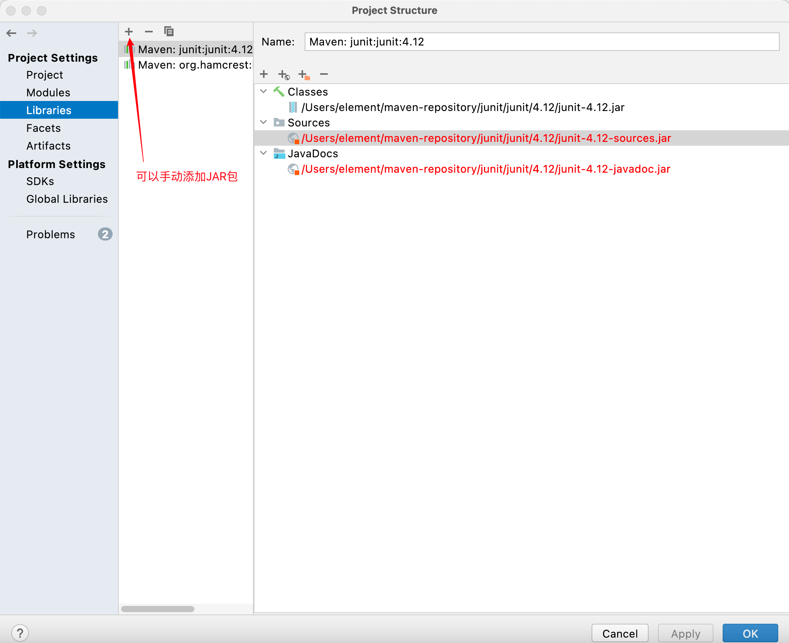

# InteliJ IDEA权威指南

# 一. IDEA简介

## 1.1 IDE

集成开发环境（IDE，Integrated Development Environment ）是用于提供程序开发环境的应用程序，一般包括代码编辑器、编译器、调试器和图形用户界面等工具。集成了代码编写功能、分析功能、编译功能、调试功能等一体化的开发软件服务套。所有具备这一特性的软件或者软件套（组）都可以叫集成开发环境。如微软的Visual Studio系列，Borland的C++ Builder、Delphi系列等。该程序可以独立运行，也可以和其它程序并用。IDE多被用于开发HTML应用软件。例如，许多人在设计网站时使用IDE（如HomeSite、DreamWeaver等），因为很多项任务会自动生成。编程开发软件将编辑、编译、调试等功能集成在一个桌面环境中,这样就大大方便了用户。 	

**优点**

节省时间和精力。IDE的目的就是要让开发更加快捷方便，通过提供工具和各种性能来帮助开发者组织资源，减少失误，提供捷径。 	

建立统一标准。当一组程序员使用同一个开发环境时，就建立了统一的工作标准，当IDE提供预设的模板，或者不同团队分享代码库时，这一效果就更加明显了。 	

管理开发工作。首先，IDE提供文档工具，可以自动输入开发者评论，或者迫使开发者在不同区域编写评论。其次，IDE可以展示资源，更便于发现应用所处位置，无需在文件系统里面艰难的搜索。 	

**缺点**

学习曲线问题。IDE基本上是比较复杂的工具，为了更好的熟练使用，需要一定的时间和耐心。 	

初学者的困难。对初学者来说，使用IDE来学习开发有相当的难度，不适合学习一种新语言时使用。 	

无法修复坏代码或设计。开发者不能完全依赖工具的便捷，还是必须保持专业水准和熟练度，开发的成果好坏主要还是看开发员的技术。

## 1.2 JetBrains

【1】IntelliJ IDEA就是Java的IDE。 	

【2】市场占有率竹节攀升，超过了Eclipse。 	

【3】JetBrains公司介绍： 	

JetBrains是一家捷克的软件开发公司，该公司位于捷克的布拉格，并在俄罗斯的圣彼得堡及美国麻州波士顿都设有办公室，该公司最为人所熟知的产品是Java编程语言开发撰写时所用的[集成开发环境](https://baike.baidu.com/item/集成开发环境/298524)：IntelliJ IDEA。公司旗下还有其它产品，比如： 	

➢WebStorm：用于开发JavaScript、HTML5、 CS3等前端技术; 	

➢PyCharm：用于开发python（python语言热度排行榜排名第一，在人工智能大数据领域应用） 	

➢PhpStorm：用于开发PHP 	

➢RubyMine：用于开发Ruby/Rails 	

➢AppCode：用于开发Objective - C/Swift,替换xcode的 	

➢CLion：用于开发C/C++ 	

➢DataGrip：用于开发数据库和SQL 	

➢Rider：用于开发.NET 	

➢GoLand：用于开发Go（区块链主流开发语言就是Go语言） 	

【4】官网：https://www.jetbrains.com/

## 1.3 InteliJ IDEA简介

【1】IDEA 全称IntelliJ IDEA，是用于java语言开发的集成环境IDE(Integrated Development Environment)，也可用于其他语言。 	

IntelliJ在业界被公认为最好的java开发工具之一，尤其在智能代码助手、代码自动提示、重构、J2EE支持、Ant、JUnit、CVS整合、代码审查、 创新的GUI设计等方面的功能可以说是超常的。 	

IDEA是JetBrains公司的产品，这家公司总部位于捷克共和国的首都布拉格，开发人员以严谨著称的东欧程序员为主。

【2】IDEA的支持：

插件支持：

1. SQL 类
2. JVM 生态
3. PHP
4. PostgreSQL
5. Java
6. Python
7. MySQL
8. Groovy
9. Ruby
10. Oracle
11. Scala
12. SQL Server
13. Kotlin
14. Clojure

框架支持：

1. 代码提示
2. 服务器容器
3. Spring 全家桶
4. HTML5/CSS3
5. JavaScript
6. NodeJS
7. Grails

【3】IDEA的优势（相对于Eclipse） 	

① 强大的整合能力。比如: Git、 Maven、 Spring 等 		

② 提示功能的快速、便捷 		

③ 提示功能的范围广 		

④ 好用的快捷键和代码模板 			

⑤ 精准搜索

## 1.4 下载安装

# 二. IDEA常用设置

进入设置： ：⌘ **,**

## 2.1 设置主题

## 2.2 编辑区的字体变大或变小

## 2.3 鼠标悬浮在代码上有提示

## 2.4 自动导包和优化多余的包

手动导包快捷键：

​		win：alt  ⏎

​		mac：⌥ ⏎

自动导包和优化多余的包：

## 2.5 导包合并为*

## 2.6 显示行号 ，  方法和方法间的分隔符

## 2.7 忽略大小写，进行提示

## 2.8 多个类隐藏，单行显示

## 2.9 设置默认的字体

## 2.10 修改代码中注释的字体颜色

## 2.11 修改类头的文档注释信息

## 2.12 设置项目文件编码

右下角可以调节编码格式：

## 2.13 自动编译

## 2.14 省电模式

## 2.15 代码展示结构

## 2.16 导入JAR包

## 2.17 生成序列化版本号

# 三. 常用快捷键

1. 创建内容：Win：alt ⏎		Mac：⌃⇧/
2. main方法：psvm
3. 打印语句：sout/soutv
4. 单行复制：Win：ctrl D      Mac：⌘ D
5. 单行删除：Win：ctrl Y          Mac：⌘ ⌫
6. 代码向上/下移动：
7. 

## 3.7 搜索类

## 3.8 生成代码

## 3.9 万能快捷键

## 3.10 单行注释

# 四. 使用模板

# 五. 断点调试

