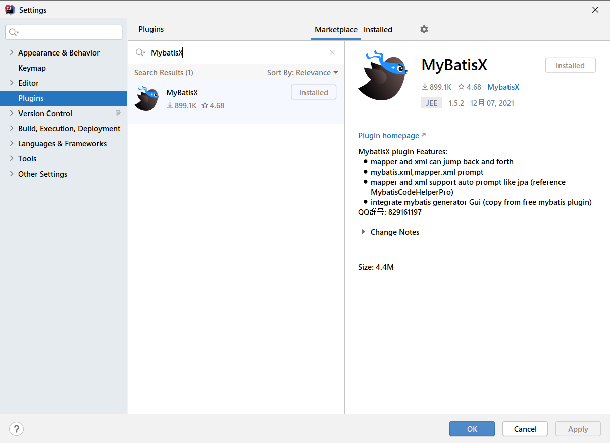
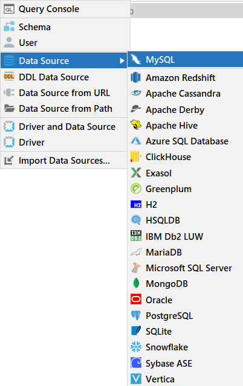
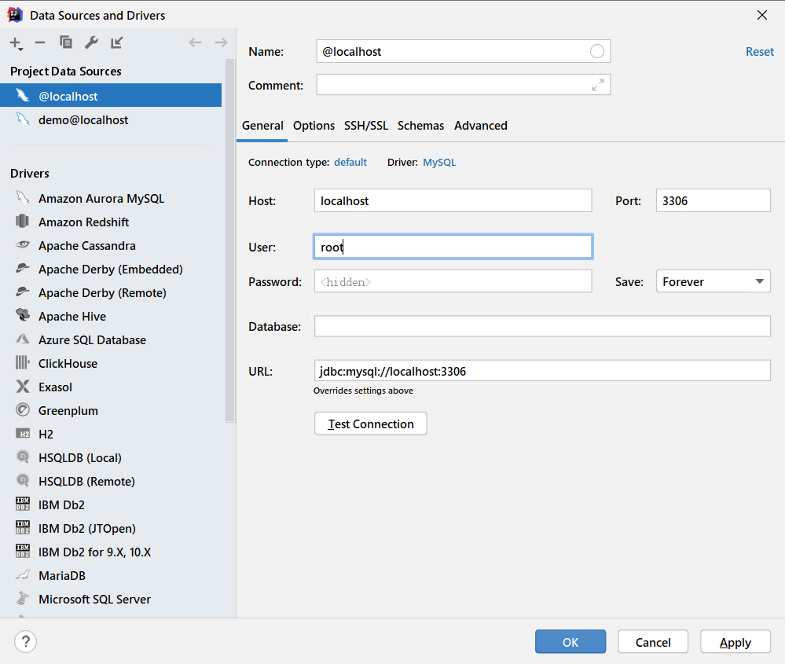
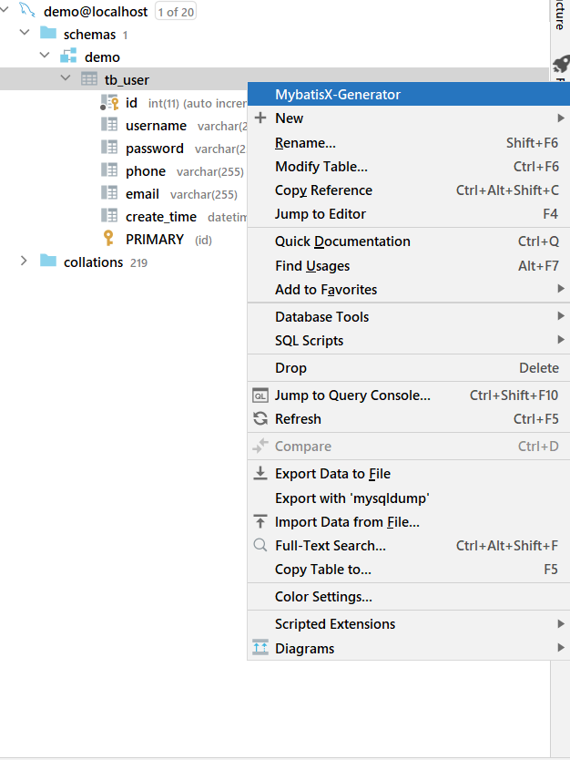
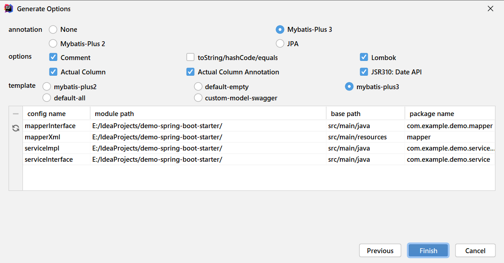
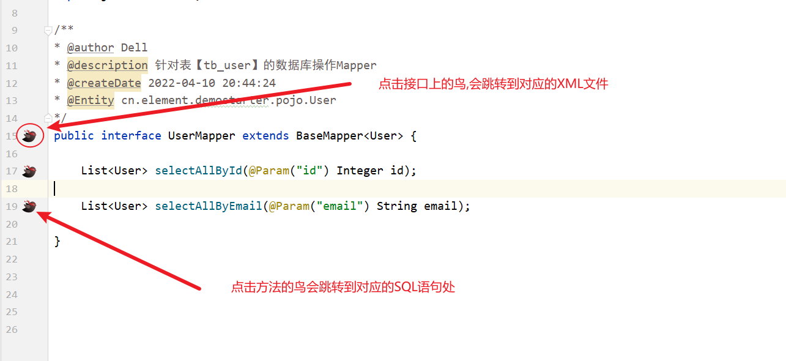
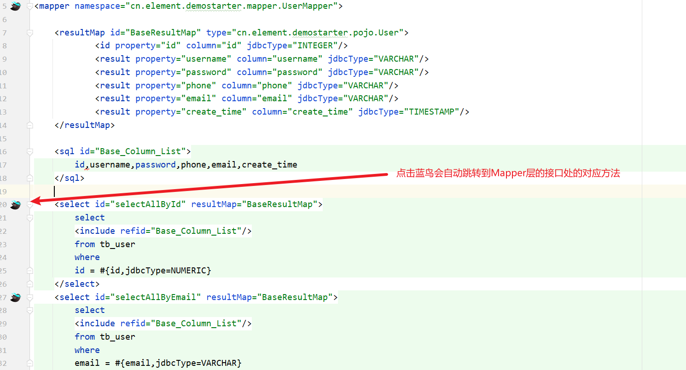
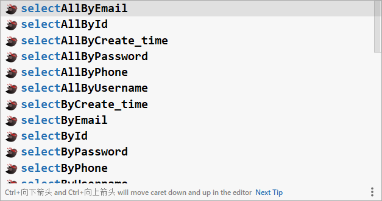
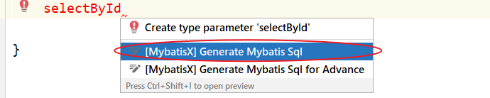

# MybatisX插件使用指南

MybatisX 是一款全免费且强大的 IDEA 插件，支持跳转、自动补全生成 SQL、代码生成等等。

需要搭配以下一起食用

- SpringBoot
- MybatisPlus(也可以不搭配，但是效果就没那么好了)

# 一. 下载安装

安装方法：打开 IDEA，进入 File -> Settings -> Plugins -> Browse Repositories，输入 mybatisx 搜索并安装。安装完成之后，需要重启一下IDE。

# 二. 使用方法

## 2.1 IDEA配置数据源

点击IDEA右侧的Database按钮,配置数据源,点击Data Source,然后再点击MySQL

检查用户名,密码还有数据库名称,驱动啥的是否正确

## 2.2 一键生成代码

右键选中一个表,点击MybatisX-Generator

配置项对话框如图所示:

部分参数说明：

- **module path**：模块路径，此处填写项目所在路径，生成的代码会在相应位置。
- **basepackage**：填写项目的包
- **encoding**：编码，使用UTF-8即可
- **base path**：代码所在路径
- **relative package**：决定实体类会被生成在哪里，默认生成在**domain**包中，可以修改为其他包但不要为空。
- **extra class suffix**：生成的实体类后面会加上里面的内容。举例：图中如果这里写入Test，最后生成实体类会叫FilesTest
- **ignore xxx**：生成实体类相应字段中忽略指定的前缀/后缀，以下为举例：
  - 数据库中有字段名称为type，若ignore field prefix参数设置为ty，则生成实体类中相应的属性名为pe，忽略了ty；
  - 数据库名为files，若ignore table prefix设置为为fi，则生成的实体类的名字变为Les，忽略了fi
- **superClass**：生成实体类继承的父类
- **class name strategy**: 类名称策略, camel是驼峰命名 same as tablename是和数据库表一样

点击next后，下一步为生成mapper、service等

参数说明：

- **annotation**：生成的代码中是否加上注解（例如，@TableName等注解）。None为没有注解，其他为字面意思。
- **options**各选项经过尝试后，作用大致如下
  - **comment**：可能和生成java doc comments有关，但试了下，好像没有效果。
  - **toString/hashCode/equals**：是否生成相应的方法；建议勾选。
  - **Lombok**：勾选后实体类自动添加Lombok的@Data注解；建议勾选（建议安装Lombok）
  - **Actual Column**：勾选后，生成的实体类属性名和表中字段名大小写会保持一致。例如，表中有字段classID，勾选该选项后生成的属性名也为classID，未勾选则为classid。建议根据实际需要勾选。
  - **Actual Column Annotation**：是否对所有属性名都加上注解标明对应字段，例如@TableName。建议勾选。
  - **JSR310:Data API**：是否使用新标准的时间日期API，包括 Instant、Clock、LocalDateTime、DateTimeFormatter、ZonedDateTime 以及替换 Calendar 的 Chronology 等类。建议勾选（新标准的时间日期API比老版本友好多了，强烈建议使用新版时间日期API）。
- **template**：生成mapper、service等相关代码所使用的模板。template可以修改，默认位于 草稿和控制台——扩展——MybatisX 。对应文件夹内即为相关模板的具体配置文件。如果需要重置，右键template文件夹点击重置默认扩展即可。

## 2.3 XML跳转

## 2.4 JPA语法提示

MybatisX插件提供了和Spring Data JPA一样的SQL方法提示功能,MybatisX会根据前缀的单词提示查询方法名称

前缀提示:

- 查询: select/query
- 更新: update
- 添加: insert/add
- 删除: delete

方法声明好之后使用alt + enter组合键,点击Generate Mybatis Sql,生成对应的sql,可以在XML文件中查看对应sql语句

