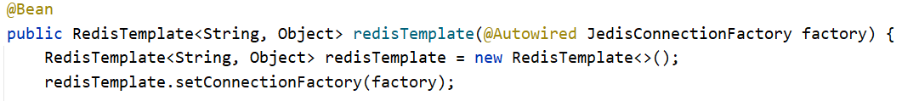
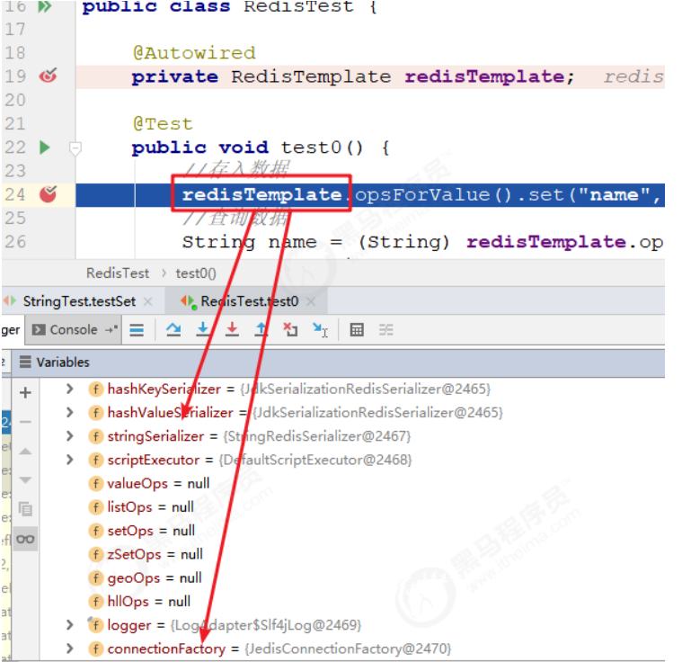
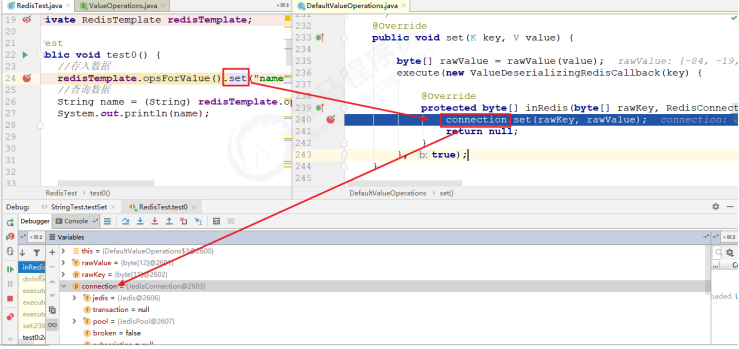
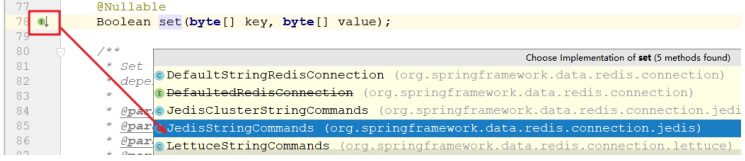
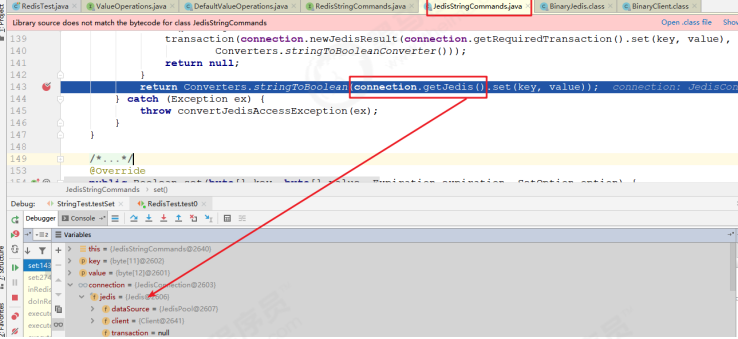
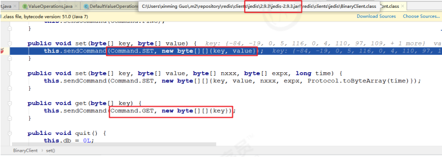

# Spring Data Redis

# 一. Spring Data Redis简介

**Redis**是一个基于内存的数据结构存储系统，它可以用作数据库或者缓存。它支持多种类型的数据
结构，这些数据结构类型分别为**String**（字符串）、**List**（列表）、**Set**（集合）、**Hash**（散列）和
**Zset**（有序集合）。
**SpringData Redis**的作用是通过一段简单的配置即可访问redis服务，它的底层是对java提供的
redis开发包(比如jedis等)进行了高度封装，主要提供了如下功能：
连接池自动管理，提供了一个高度封装的RedisTemplate类,基于这个类的对象可以对redis进行各
种操作
针对jedis客户端中大量api进行了归类封装,将同一类型操作封装为operation接口
**ValueOperations**：简单字符串类型数据操作
**SetOperations：set**类型数据操作
**ZSetOperations：zset**类型数据操作
**HashOperations：map**类型的数据操作
**ListOperations：list**类型的数据操作


# 二. Spring Data Redis快速入门

## 2.1 引入依赖

```xml
<dependency>
	<dependency>
        <groupId>org.springframework.data</groupId>
        <artifactId>spring-data-redis</artifactId>
        <version>2.1.8.RELEASE</version>
	</dependency>
</dependency>
```

## 2.2 配置Redis配置类

```java
@Configuration
public class JedisConfig {

    @Bean
    public JedisConnectionFactory jedisConnectionFactory() {
        RedisStandaloneConfiguration redisStandaloneConfiguration = new RedisStandaloneConfiguration();
        redisStandaloneConfiguration.setHostName("localhost");
        redisStandaloneConfiguration.setDatabase(0);
        redisStandaloneConfiguration.setPort(6379);

        return new JedisConnectionFactory(redisStandaloneConfiguration);
    }

    @Bean
    public RedisTemplate<String, Object> redisTemplate(@Autowired JedisConnectionFactory factory) {
        RedisTemplate<String, Object> redisTemplate = new RedisTemplate<>();
        redisTemplate.setConnectionFactory(factory);

        // 配置具体的序列化方式
        Jackson2JsonRedisSerializer<Object> jacksonSerializer = new Jackson2JsonRedisSerializer<>(Object.class);
        StringRedisSerializer stringRedisSerializer = new StringRedisSerializer();

        /*
         * key采用String序列化的方式
         * value序列化的方式采用JSON
         * hash的key采用String的序列化方式
         * hash的value序列化采用JSON
         */
        redisTemplate.setKeySerializer(stringRedisSerializer);
        redisTemplate.setValueSerializer(jacksonSerializer);
        redisTemplate.setHashKeySerializer(stringRedisSerializer);
        redisTemplate.setHashValueSerializer(jacksonSerializer);
        redisTemplate.afterPropertiesSet();

        return redisTemplate;
    }
}
```

## 2.3 YAML文件配置

```yaml
spring:
  data:
    redis:
      repositories:
        enabled: true

  redis:
    host: 127.0.0.1			# ip
    port: 6379				# 端口
    jedis:
      pool:					# 连接池配置
        max-active: 30
        max-idle: 20
        min-idle: 10
```

## 2.4 测试

```java
@Test
public void test0() {
    //存入数据
    redisTemplate.opsForValue().set("name", "heima");
    //查询数据
    String name = (String) redisTemplate.opsForValue().get("name");
    System.out.println(name);
}
```

## 2.5 Spring Data Redis序列化器

这时候会发现，存入的数据并不是简单的字符串，而是一些类似于二进制的数据，这是怎么回事呢？
原来，SpringData Redis在保存数据的时候，底层有一个序列化器在工作，它会将要保存的数据
（键和值）按照一定的规则进行序列化操作后再进行存储。spring-data-redis提供如下几种序列化器：
**StringRedisSerializer**: 简单的字符串序列化
**GenericToStringSerializer**: 可以将任何对象泛化为字符串并序列化
**Jackson2JsonRedisSerializer**: 序列化对象为json字符串
**GenericJackson2JsonRedisSerializer**:功能同上,但是更容易反序列化
**OxmSerializer**: 序列化对象为xml字符串
**JdkSerializationRedisSerializer**: 序列化对象为二进制数据
**RedisTemplate**默认使用的是**JdkSerializationRedisSerializer**对数据进行序列化。
那么如何选择自己想要的序列化器呢？SpringData提供了两种方式：

1. **通过配置类配置**
2. **通过RedisTemplate设定**


## 2.6 Spring Data Redis运行原理分析

1. 首先看配置文件中关于**RestTemplate**的bean的配置，可以看到在**RedisTemplate**的**bean**声明中注入了一个**JedisConnectionFactory**实例，顾名思义，这个连接工厂是用来获取**Jedis**连接的，那么通过这种方式**RedisTemplate**就可以拿到操作**Redis**服务器的句柄了。



2. 使用debug运行入门案例，观察创建好的RestTemplate实例，可以看到里面主要有序列化器和redis的连接信息，基于这些，我们就可以对redis进行操作了



3. 跟踪进入set方法，我们可以看到set方法中使用了一个**connection**来进行操作，这个**connection**的类型是**JedisConnetion**，而这个**connection**肯定是通过配置文件配置的**JedisConnectionFactory**产生的，也就是底层开始调用**jedis**的api了



4. 继续追踪set方法，选择**JedisStringCommands**实现



5. 继续之宗set方法，可以看到底层已经获取到了jedis的实例，再调用set方法已经在调jedis的set了



6. 再追踪一步，就会发现，底层最终调用的是jedis的原生API，setCommand方法，这个方法就是jedis提供的对redis的各种操作命令了



7. 总结: **SpringData**提供**redisTemplate**就是在原生的**Jedis**或者其他操作**redis**的技术上做的一层封装，它屏蔽掉了这些原生技术的实现细节，统一了调用接口，使得我们的操作更加简单明了。

# 三. Spring Data Redis常见操作

- **ValueOperations**: 用来操作字符串类型的数据
- **HashOperations**: 用来操作hash类型的数据
- **ListOperations**: 用来操作list类型数据
- **SetOperations**: 用来操作Set类型数据
- **ZSetOperations**: 用来操作ZSet类型数据

具体操作步骤省略,详情见test文件夹下的测试代码

```java
// String类型
ValueOperations<String, String> operations = redisTemplate.opsForValue();
operation.set("name", "abc", 10);  // ...

// List类型
ListOperations<String, Object> operations = redisTemplate.opsForList();

// Hash类型
HashOperations<String, String, Article> operations = redisTemplate.opsForHash();

// Set类型
SetOperations<String, Object> operations = redisTemplate.opsForSet();

// ZSet类型
ZSetOperations<String, Object> operations = redisTemplate.opsForZSet();
```


# 四. Repository和Template的选用

​	我们使用SpringDataJpa的时候，采用了继承SpringData提供的一个接口的形式，即 `public interface ArticleDao extends JpaRepository,JpaSpecificationExecutor `，但是使用SpingData Redis的时候，却是使用了在实现类中注入一个 redisTemplate 的方式，那么这两种方式到底有什么关系，用哪个更好呢？
​	其实这两种方式都可以完成我们对持久层的操作，但是对比两种方式的使用，就会发现：第一种方式，直接继承xxxRepository接口，可以不必自己去写实现类，而轻松实现简单的增删改查、分页、排序操作，但是对于非常复杂的查询，用起来就比较的费力了；
​	第二种方式，直接使用xxxTemplate，就需要自己写实现类，但是这样增删改查可以自己控制，对于复杂查询来说，用起来更加得心应手。
​	所以，两种方式在企业开发中都可能用到，甚至有的项目开发中会同时使用两种方式:对于简单的操作，直接继承Repository接口，对于复杂操作，使用Template完成。所以我们用的时候也要根据实际场景进行灵活选用。

