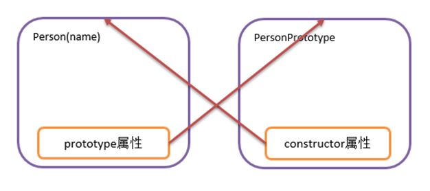

# JavaScript-入门篇1

# 一. 快速入门

## 1.1 JS简介

Javascript 是一种由Netscape(网景)的 LiveScript 发展而来的原型化继承的面向对象的动态类型的区分大小写的客户端脚本语言，主要目的是为了解决服务器端语言，比如 Perl，遗留的速度问题，为客户提供更流畅的浏览效果。当时服务端需要对数据进行验证，由于网络速度相当缓慢,只有28.8kbps，验证步骤浪费的时间太多。于是Netscape的浏览器Navigator加入了Javascript，提供了数据验证的基本功能。JavaScript 的正式名称是 "ECMAScript"。这个标准由 ECMA 组织发展和维护。ECMA-262 是正式的 JavaScript 标准。这个标准基于 JavaScript (Netscape) 和 JScript (Microsoft)。Netscape (Navigator 2.0) 的 Brendan Eich 发明了这门语言，从 1996 年开始，已经出现在所有的 Netscape 和 Microsoft 浏览器中。ECMA-262 的开发始于 1996 年，在 1997 年 7 月，ECMA 会员大会采纳了它的首个版本。JavaScript 的组成包含 ECMAScript、DOM、BOM。JS 是一种运行于浏览器端上的小脚本语句,可以实现网页如文本内容动,数据动态变化和动画特效等。

**ECMAScript：**是一种由欧洲计算机制造商协会（ECMA）通过 ECMA-262 标准化的脚本程序语言,简单点说，ECMAScript 描述了语法、类型、语句、关键字、保留字、运算符和对象。它就是定义了脚本语言的所有属性、方法和对象。

**DOM：**把整个页面规划成由节点层构成的文档，它不与浏览器、平台、语言相关，为web开发者提供一个标准可以访问站点中的数据、脚本和表现层对象。DOM 编程可以实现网页内容校验和动态变化的效果。

**BOM：**是浏览器的一种特性，它可以对浏览器窗口进行访问和操作，例如移动、关闭窗口，调整窗口的大小，支持 cookie 等。BOM 编程可以实现动态控制浏览器本身行为的效果。

## 1.2 JS特点

1. 脚本语言

脚本语言是一种简单的程序，规模小,不需要编译,运行快,是由一些 ASCII 字符构成，可以使用任何一种文本编辑器编写。脚本语言是指在 web 浏览器内有解释器解释执行的编程语言，每次运行程序的时候，解释器会把程序代码翻译成可执行的格式。一些程序语言（如C、C++、Java等）都必须经过编译，将源代码编译成二进制的可执行文件之后才能运行，而脚本语言不需要事先编译，只要有一个与其相适应的解释器就可以执行。

2. 基于对象的语言

面向对象有三大特点（封装，继承，多态）缺一不可。通常"基于对象"是使用对象，但是无法利用现有的对象模板产生新的对象类型，也就是说"基于对象"没有继承的特点。没有了继承的概念也就无从谈论"多态"。

3. 事件驱动

在网页中执行了某种操作的动作，被称为"事件"(Event)，比如按下鼠标、移动窗口、选择菜单等都可以视为事件。当事件发生后，可能会引起相应的事件响应。

4. 简单性

变量类型是采用弱类型，并未使用严格的数据类型。var a,b,c; a=123; b="abc"; a=b; 

5. 安全性

JavaScript 不能访问本地的硬盘，不能将数据存入到服务器上，不能对网络文档进行修改和删除，只能通过浏览器实现信息浏览或动态交互。

6. 跨平台性

JavaScript 依赖于浏览器本身，与操作平台无关， 只要计算机安装了支持 JavaScript 的浏览器（装有JavaScript解释器)，JavaScript 程序就可以正确执行。

缺点：

各种浏览器支持 JavaScript 的程度是不一样的，支持和不完全支持 JavaScript的 浏览器在浏览同一个带有JavaScript 脚本的网页时，效果会有一定的差距，有时甚至会显示不出来。

基于对象和面向对象：JavaScript 是脚本语言，是一种基于对象的语言。本身提供了非常丰富的内部对象供设计人员使用，但不支持继承和多态。Java 是面向对象的，是一种真正的面向对象的语言，支持封装、继承和多态。

## 1.3 JS引入方式

1. 内嵌式：

```html
<!DOCTYPE html>
<html>
    <head>
        <meta charset="utf-8">
        <title></title>
    </head>
    <body>
        <input type="button" value="点我呀" onclick="fun1()">
    </body>
</html>
<script type="text/javascript">
/*定义一个函数(方法)*/
function fun1() {
    /*弹窗提示一点信息 */
    alert("你好")
}
</script>
```

2. 外链式：

```html
<!DOCTYPE html>
<html>
    <head>
        <meta charset="utf-8">
        <title></title>
        <script type="text/javascript" src="js/myjs.js"></script>
    </head>
    <body>
        <input type="button" value="点我呀" onclick="fun1()">
    </body>
</html>
```

使用 script 标签引入外部 js 文件。**编写 js 语句时，可以不加分号，但是要换行。**

# 二. 数据类型和运算符

## 2.1 数据类型

1. 数值型：number 整数和浮点数统称为数值。
2. 字符串：string 由0个,1个或多个字符组成的序列。在 JavaScript 中，单引号或者双引号包裹的内容都是字符串类型。
3. 布尔型：boolean 用 true 或 false 来表示。
4. null：表示没有值，用于定义空的或不存在的引用。要注意，空值不等同于空字符串 "" 或 0。当给一个变量赋值为 null 时,变量的类型为 object。
5. undefined：它也是一个保留字。表示变量虽然已经声明，但却没有赋值。
6. object：包括对象和数组。
7. 函数：指函数数据类型，使用关键字 function 声明。

无论是什么数据类型，统一都使用关键字 `var` 声明变量：

```js
var a = 10  
console.log(typeof a)  // number
var b = 'aaa'  
console.log(typeof b)  // string
var c = false  
console.log(typeof c)  // boolean
var d = null  
console.log(typeof d)  // object
var e
console.log(typeof e)  // undefined
var f = {}
console.log(typeof f)  // object
var g = []
console.log(typeof g)  // object
var h = function() {}
console.log(typeof h)  // function
```

## 2.2 运算符号

JS 中运算符号大部分和 Java 中的运算符一样，我们在这里分析一下特殊的运算符号：

| 类型       | 运算符                            |
| ---------- | --------------------------------- |
| 算术运算符 | `+` `-` `*` `/` `%` `++` `--`     |
| 赋值运算符 | `=`                               |
| 比较运算符 | `>` `<` `>=` `<=` `==` `===` `!=` |
| 逻辑运算符 | `&&` `||` `!`                     |

**/ % 运算：**

```js
console.log(10 / 3)    // 3.3333...  除尽就是整数，除不尽就是浮点数
console.log(10 / 0)    // Infinity
console.log(10 % 3)    // 1
console.log(10 % 0)    // NaN
console.log(10 % 1.5)  // 1
```

JS 取余数运算对于浮点数仍然有效,如果和0取余数,结果是 NaN(not a number)。

**+ 运算：**

\+ 同时也是连接运算符,看两端的变量类型,如果都是 number 那么就是算数中的加法 如果有字符串,那么就是连接符号,如果是布尔类型和 number 相加,那么会将 true 转化为 1 将 false 转化为 0。

```js
console.log(1 + 1)     // 2
console.log(1 + "1")   // 11(string)
console.log(1 + true)  // 2
```

**== 等值符号：**

先比较类型,如果类型一致，再比较内容，如果类型不一致,会强制转换为 number 再比较内容：

```js
console.log(1 == "1")        // true
console.log(1 == true)       // true  
console.log(1 == "true")     // false  
console.log("1" == true)     // true  
console.log("1" == "true")   // false
console.log(true == "true")  // false
```

**=== 等值符号：**

数据类型不同，直接返回 false 如果类型相同，才会比较内容：

```js
console.log(1 === "1")        // false
console.log(1 === true)       // false
console.log(1 === "true")     // false
console.log("1" === true)     // false
console.log("1" === "true")   // false
console.log(true === "true")  // false
console.log("123" === "123")  // true
```

**字符串运算：**

字符串类型在做算数运算时会做隐式转换成 number，最终的结果也是 number：

```js
console.log("1" * 2)  // 2
console.log("1" / 2)  // 0.5
console.log("1" - 1)  // 0
console.log("1" % 2)  // 1
console.log("1" << 1) // 2 
```

## 2.3 流程控制

### 2.3.1 分支结构

**if分支：**

```js
var a = 10
if (a >= 12) {
    console.log("...")
} else if (a >= 5) {
    console.log("...")
} else {
    console.log("...")
}
```

**switch分支：**

```js
var a = 10
switch (a) {
    case 1:
    case 2:
    case 3:
        console.log("...")
        break
    case 4:
    case 5:
        console.log("...")
        break
    default:
        console.log("...")
}
```

### 2.3.2 循环结构

**while循环：**

```js
var a = 0
while (a < 10) {
    a++
}
```

**do-while循环：**

```js
var a = 0
do {
    a++
} while (a < 10)
```

**for循环：**

```js
for (var i = 0; i < 5; i++) {
    console.log(i)
}
```

## 2.4 函数

声明函数的三种方式：

1. 使用关键字 `function` 直接声明：

```js
function fun() {
    // ...
}
```

2. 函数变量：

```js
var a = function() {
    // ...
}
```

3. 使用关键字 `new`：

```js
// 括号内传入js代码
var b = new Function("...")
```

**参数和返回值问题：**

```js
// 传入的参数个数可以和参数列表个数不一致
function fun(a, b, c) {
    // 如果有返回值则使用return返回，没有则不用
    return a + b
}
console.log(fun(1, 2))  // 3

// 参数为函数类型，也就是回调函数
function fun(arr, f) {
    return f(arr)
}
var arr = [1, 2, 3, 4, 5]
console.log(fun(arr, function(arr) {
    return arr.reduce((a, b) => a + b)
}))  // 15
```

# 三. 数组

## 3.1 声明方式

四种创建方式：

1. 创建空数组：

```js
var arr = new Array()
arr[0] = 1
console.log(arr)
```

2. 创建定长数组：

```js
var arr = new Array(5)
arr[0] = 1
arr[2] = "abc"
```

3. 创建时指定元素值：

```js
var arr = new Array("asdf", 10, 20.3, true)
```

4. 直接声明：

```js
var arr = ["asdf", 10, 20.3, true]
```

最常用的是第四种。

## 3.2 元素和长度

```js
var arr = [1, 2, 3, 4, 5]
// 获取长度
console.log(arr.length)

// JS中的数组是可以通过修改length属性来改变数组长度的
arr.length = 10
console.log(arr)

// JS的数组可以通过索引改变数组的长度
arr[9] = 100
console.log(arr)
```

## 3.3 遍历方式

1. 普通for循环：

```js
for (var i = 0; i < arr.length; i++) {
    console.log(arr[i])
}
```

2. for...in：

```js
// 这里的i指的是索引
for (var i in arr) {
    console.log(arr[i])
}
```

3. for...of

```js
// 这里的i指的是元素
for (var i of arr) {
    console.log(i)
}
```

## 3.4 常用方法

1. **indexOf**

```js
var arr = [1, 2, 3, 4, 5, 7, 8, 9]
// 查询元素索引
console.log(arr.indexOf(7))  // 5
```

2. **concat**

```js
var arr1 = [1, 2, 3]
var arr2 = [2, 4, 5]
console.log(arr1.concat(arr2))  // [1, 2, 3, 2, 4, 5]
// concat还可以合并多个数组，只要传递参数即可
var arr3 = [7, 8, 9]
arr1.concat(arr2, arr3)
```

3. **join**

```js
var fruits = ["Banana", "Orange", "Apple", "Mango"];
// 合并字符串，默认使用逗号隔开
console.log(fruits.join())  // Banana,Orange,Apple,Mango
// 可以使用其他分隔符隔开
console.log(fruits.join("."))  // Banana.Orange.Apple.Mango
```

4. **pop**

```js
var arr = [1, 2, 3, 4, 5]
// 弹出最后一个元素
console.log(arr.pop())  // 5
```

5. **push**

```js
var arr = [1, 2, 3, 4, 5]
// 尾插入数据
arr.push(6)
console.log(arr)  // [1, 2, 3, 4, 5, 6]
```

6. **reverse**

```js
var arr = [1, 2, 3, 4, 5]
// 逆转数组
arr.reverse()
console.log(arr)  // [5, 4, 3, 2, 1]
```

7. **shift**

```js
var arr = [1, 2, 3, 4, 5]
// 删除数组第一个元素
console.log(arr.shift())  // 1
```

8. **unshift**

```js
var arr = [1, 2, 3, 4, 5]
// 向第一个位置添加元素
arr.unshift(7)
console.log(arr)  // [7, 5, 4, 3, 2, 1]
```

9. **slice**

```js
var arr = [1, 2, 3, 4, 5]
// 截取索引[1, 3)
console.log(arr.slice(1, 3))  // [2, 3]
```

10. **splice**

```js
var arr = [1, 2, 3, 4, 5]
// 删除元素从指定索引开始，第二个参数指定数量
arr.splice(1, 3)
console.log(arr)  // [1, 5]
// 如果第二个参数为0意思就是在指定索引位置插入元素
arr.splice(1, 0, 3)
console.log(arr)  // [1, 3, 2, 3, 4, 5]
```

11. **sort**

```js
var arr = [8, 5, 1, 9, 6]
// 默认升序排序
console.log(arr.sort())  // [1, 5, 6, 8, 9]
// 传入回调函数降序排序
console.log(arr.sort((a, b) => b - a))  // [9, 8, 6, 5, 1]
```

# 四. 对象

## 4.1 JS常用对象

### 4.1.1 String

JS 基于对象的脚本语言，有类和对象,但是没有封装、继承、多态，JavaScript 中有一些浏览器直接识别并使用的对象,常见的对象有 Array，String 对象，Math 对象，Number 对象，Date 对象等等。 		

string 和 Java 中的 String 很类似，的常用方法：

- **charAt**：返回在指定位置的字符。

```js
var s = "HelloWorld"
console.log(s.charAt(1))  // e
```

- **charCodeAt**：返回在指定的位置的字符的 Unicode 编码。
- **concat**：连接两个或更多字符串，并返回新的字符串。

```js
var s = "Hello"
console.log(s.concat("World", "123", "000"))  // HelloWorld123000
```

- **fromCharCode**：将 Unicode 编码转为字符。
- **indexOf**：返回某个指定的字符串值在字符串中首次出现的位置。第二个参数可以省略，则默认从开头开始查找，否则从对应下标开始搜索。

```js
var s = "HelloWorld"
console.log(s.indexOf("World"))  // 5
```

- **lastIndexOf**：从后向前搜索字符串，并从起始位置(0)开始计算返回字符串最后出现的位置。第二个参数可以省略，则默认从开头开始查找，否则从对应下标开始搜索。

```js
var s = "HelloWorld"
console.log(s.lastIndexOf("World"))  // 5
```

- **includes**：查找字符串中是否包含指定的子字符串。

```js
var s = "HelloWorld"
console.log(s.includes("World"))  // true
```

- **match**：查找找到一个或多个正则表达式的匹配。

```js
var s = "HelloWorld"
console.log(s.match(/.*World/)[0])  // HelloWorld
```

- **repeat**：重复指定次数，并返回。

```js
var s = "HelloWorld"
console.log(s.repeat(2))  // HelloWorldHelloWorld
```

- **replace**：使用正则匹配，并替换，返回替换后的字符串：

```js
var s = "HelloWorld"
console.log(s.replace(/H.*?o/, "HaloHa"))  // HaloHaWorld
```

- **search**：根据正则表达式查找字符串，返回索引：

```js
var s = "HelloWorld"
console.log(s.search(/Wo/))  // 5
```

- **slice**：提取字符串的片断，并在新的字符串中返回被提取的部分。

```js
var s = "HelloWorld"
// 不写任何参数，返回自身
console.log(s.slice())  // HelloWorld
// 只写第一个参数，则从start截取到末尾
console.log(s.slice(2))  // lloWorld
// 写两个参数，则截取[start, end)
console.log(s.slice(0, 3))  // Hel
```

- **split**：根据正则表达式把字符串分割为字符串数组。

```js
var s = "Hello World  cat dog"
console.log(s.split(/\s+/))  // ['Hello', 'World', 'cat', 'dog']
// 第二个参数指定返回结果的个数
console.log(s.split(/\s+/, 2))  // ['Hello', 'World']
```

- **startsWith**：查看字符串是否以指定的子字符串开头。

```js
var s = "HelloWorld"
console.log(s.startsWith("He"))  // true
```

- **substr**：从起始索引号提取字符串中指定数目的字符。

```js
var s = "HelloWorld"
console.log(s.substr(3, 2))  // lo
```

- **substring**：提取字符串中两个指定的索引号之间的字符，和 slice 类似。

```js
var s = "HelloWorld"
console.log(s.substring(1, 3))  // el
```

- **toLowerCase**：把字符串转换为小写。

```js
var s = "HelloWorld"
console.log(s.toLowerCase())  // helloworld
```

- **toUpperCase**：把字符串转换为大写。
- **trim**：去除字符串两边的空白。

```js
var s = "    HelloWorld    "
console.log(s.trim())  // HelloWorld
```

- **valueOf**：返回某个字符串对象的原始值。

```js
var s = "'HelloWorld   123"
console.log(s.valueOf())  // 'HelloWorld   123
```

### 4.1.2 Number

Number 对象是数字对象，包含了常用的操作数字的方法以及常用的属性：

- `Number.MAX_VALUE`：最大值

- `Number.MIN_VALUE`：最小值
- `Number.NaN`：非数字
- `Number.NEGATIVE_INFINITY`：负无穷，在溢出时返回
- `Number.POSITIVE_INFINITY`：正无穷，在溢出时返回
- `Number.EPSILON`：表示 1 和比最接近 1 且大于 1 的最小 Number 之间的差别
- `Number.MIN_SAFE_INTEGER`：最小安全整数
- `Number.MAX_SAFE_INTEGER`：最大安全整数

```js
console.log(Number.MAX_VALUE)  			// 1.7976931348623157e+308
console.log(Number.MIN_VALUE)  			// 5e-324
console.log(Number.MAX_SAFE_INTEGER)   // 9007199254740991
console.log(Number.MIN_SAFE_INTEGER)   // -9007199254740991
console.log(Number.NaN)  				// NaN
console.log(Number.NEGATIVE_INFINITY)  // -Infinity
console.log(Number.POSITIVE_INFINITY)  // Infinity
console.log(Number.EPSILON)  			// 2.220446049250313e-16
```

**数字方法：**

- `Number.parseFloat()`：将字符串转换成浮点数，和全局方法 parseFloat() 作用一致。
- `Number.parseInt()`：将字符串转换成整型数字，和全局方法 parseInt() 作用一致。
- `Number.isFinite()`：判断传递的参数是否为有限数字。
- `Number.isInteger()`：判断传递的参数是否为整数。
- `Number.isNaN()`：判断传递的参数是否为 isNaN()。
- `Number.isSafeInteger()`：判断传递的参数是否为安全整数。

```js
var i = 10 % 0
var j = 10 / 0
console.log(Number.isNaN(i))                                // true
console.log(Number.isFinite(j))                             // false
console.log(Number.isSafeInteger(Number.MAX_VALUE))         // false
console.log(Number.isSafeInteger(Number.MAX_SAFE_INTEGER))  // true
console.log(parseInt("123"))                                // 123
console.log(parseFloat("123.05"))                           // 123.05
```

### 4.1.3 Math

**常用方法：**

- **round**：四舍五入
- **floor**：向下取整
- **ceil**：向上取整
- **max**：获取最大值
- **min**：获取最小值
- **random**：生成[0,1)之间的随机数
- **sqrt**：平方根

```js
console.log(Math.round(1.55))     // 2
console.log(Math.floor(1.5))      // 1
console.log(Math.ceil(1.5))       // 2
console.log(Math.max(1, 2, 3))    // 3
console.log(Math.min(1, 2, 3))    // 1
console.log(Math.random())        // 0.3276223873635571
console.log(Math.sqrt(16))        // 4
```

**常用属性：**

- **PI**：圆周率

- **E**：自然对数

```js
console.log(Math.PI)  // 3.141592653589793
console.log(Math.E)   // 2.718281828459045
```

### 4.1.4 Date

Date 对象用于处理日期与时间。

以下四种方法同样可以创建 Date 对象：

```js
var d = new Date()
var d = new Date(milliseconds)
var d = new Date(dateString)
var d = new Date(year, month, day, hours, minutes, seconds, milliseconds)
```

**常用方法：**

- **getDate**：从 Date 对象返回一个月中的某一天 (1 ~ 31)
- **getDay**：从 Date 对象返回一周中的某一天 (0 ~ 6)
- **getFullYear**：从 Date 对象以四位数字返回年份
- **getHours**：返回 Date 对象的小时 (0 ~ 23)
- **getMilliseconds**：返回 Date 对象的毫秒(0 ~ 999)

- **getMinutes**：返回 Date 对象的分钟 (0 ~ 59)
- **getMonth**：从 Date 对象返回月份 (0 ~ 11)
- **getSeconds**：返回 Date 对象的秒数 (0 ~ 59)
- **getTime**：返回 1970 年 1 月 1 日至今的毫秒数
- **getTimezoneOffset**：返回本地时间与格林威治标准时间 (GMT) 的分钟差
- **getUTCDate**：根据世界时从 Date 对象返回月中的一天 (1 ~ 31)
- **getUTCDay**：根据世界时从 Date 对象返回周中的一天 (0 ~ 6)
- **getUTCFullYear**：根据世界时从 Date 对象返回四位数的年份
- **getUTCHours**：根据世界时返回 Date 对象的小时 (0 ~ 23)
- **getUTCMilliseconds**：根据世界时返回 Date 对象的毫秒(0 ~ 999)
- **getUTCMinutes**：根据世界时返回 Date 对象的分钟 (0 ~ 59)
- **getUTCMonth**：根据世界时从 Date 对象返回月份 (0 ~ 11)
- **getUTCSeconds**：根据世界时返回 Date 对象的秒钟 (0 ~ 59)
- **parse**：返回1970年1月1日午夜到指定日期（字符串）的毫秒数
- **setDate**：设置 Date 对象中月的某一天 (1 ~ 31)
- **setFullYear**：设置 Date 对象中的年份（四位数字）
- **setHours**：设置 Date 对象中的小时 (0 ~ 23)
- **setMilliseconds**：设置 Date 对象中的毫秒 (0 ~ 999)
- **setMinutes**：设置 Date 对象中的分钟 (0 ~ 59)
- **setMonth**：设置 Date 对象中月份 (0 ~ 11)
- **setSeconds**：设置 Date 对象中的秒钟 (0 ~ 59)
- **setTime**：setTime() 方法以毫秒设置 Date 对象
- **toDateString**：把 Date 对象的日期部分转换为字符串
- **toISOString**：使用 ISO 标准返回字符串的日期格式
- **toJSON**：以 JSON 数据格式返回日期字符串
- **toTimeString**：把 Date 对象的时间部分转换为字符串
- **toUTCString**：根据世界时，把 Date 对象转换为字符串
- **UTC**：根据世界时返回 1970 年 1 月 1 日 到指定日期的毫秒数

```js
// 在程序中 西方的月份编号从0开始
var today = new Date()
var d1 = new Date("October 13, 1975 11:13:00")
var d2 = new Date(79,5,24)
var d3 = new Date(79, 5, 24, 11, 33, 0)
console.log(d1)  // Mon Oct 13 1975 11:13:00 GMT+0800 (中国标准时间)
console.log(d2)  // Sun Jun 24 1979 00:00:00 GMT+0800 (中国标准时间)
console.log(d3)  // Sun Jun 24 1979 11:33:00 GMT+0800 (中国标准时间)
```

```js
var d4 = new Date(2048, 0, 13, 16, 51, 20, 123)
// set... 方法同理
console.log(d4)               // Mon Jan 13 2048 16:51:20 GMT+0800 (中国标准时间)
console.log(d4.getYear())     // 148
console.log(d4.getFullYear()) // 2048
console.log(d4.getMonth())    // 0
console.log(d4.getDate())     // 13
console.log(d4.getHours())    // 16
console.log(d4.getMinutes())  // 51
console.log(d4.getSeconds())  // 20
console.log(d4.getMilliseconds())  // 123
var d5 = new Date(2048, 0, 13, 16, 51, 20, 456)
console.log(d4 < d5)          // true
```

**时间日期格式化扩展函数：**

```js
// 使用原型链进行扩展Date类的方法
Date.prototype.format = function (fmt) {
    var o = {
        "M+": this.getMonth() + 1,                 		// 月份
        "d+": this.getDate(),                    		// 日
        "h+": this.getHours(),                   		// 小时
        "m+": this.getMinutes(),                 		// 分
        "s+": this.getSeconds(),                 		// 秒
        "q+": Math.floor((this.getMonth() + 3) / 3),   // 季度
        "S": this.getMilliseconds()             		// 毫秒
    }

    if (/(y+)/.test(fmt)) {
        fmt = fmt.replace(RegExp.$1, (this.getFullYear() + "").slice(4 - RegExp.$1.length))
    }

    for (var k in o) {
        if (new RegExp("(" + k + ")").test(fmt)) {
            fmt = fmt.replace(
                RegExp.$1, (RegExp.$1.length === 1) ? (o[k]) : (("00" + o[k]).slice(("" + o[k]).length)))
        }
    }
    return fmt
}
var fmt = new Date(2000, 9, 1, 8, 0, 0).format("yyyy-MM-dd hh:mm:ss")
console.log(fmt)  // 2000-10-01 08:00:00
```

## 4.2 JS自定义对象

JS 除了一些常用方法和类以外,允许我们自己定义对象,在 JS 中自定义对象有三种可用的语法格式,分别为：

1. 调用系统的构造函数创建对象：

```js
// 实例化对象
var obj = new Object()
// 给对象添加属性
obj.name = "洛必达"
obj.age = 20
obj.gender = "男"
// 给对象添加方法
obj.eat = function (food) {
    console.log(this.name + "正在吃" + food)
}

// 查看对象属性
console.log(obj.name)
console.log(obj.age)
console.log(obj.gender)
// 调用对象方法
obj.eat("蛋糕")
```

2. 自定义构造函数创建对象：

```js
function Person(pname, page) {
    this.pname = pname
    this.page = page
    this.eat = function (food) {
        console.log(this.page + "岁的" + this.pname + "正在吃" + food)
    }
}

var p1 = new Person("洛必达", 10)
// 查看对象属性
console.log(p1.pname)
console.log(p1.page)
// 调用对象方法
p1.eat("油条")
```

3. 字面量的方式创建对象，也就是 JSON：

```js
var person = {
    name: "晓明",
    gender: "男",
    age: 10,
    eat: function (food) {
        console.log(this.age + "岁的" + this.gender + "孩儿" + this.name + "正在吃" + food)
    }
}

// 查看对象属性
// 调用对象方法
console.log(person.name)
console.log(person.gender)
console.log(person.age)
person.eat("馒头")
```

## 4.3 JS原型介绍

当我们用构造方法创建一个类时，在内存会预先调用构造方法创建一个对象，这对象我们称之为原型对象，构造方法对象中有一个 prototype 属性指向该对象，原型对象中有一个 constructor 属性指向构造方法。获得一个类的原型对象可以通过 `ClassName.prototype `的方式获得。



```js
function Person(pname, page) {
    this.pname = pname
    this.page = page

    this.eat = function (food) {
        console.log(this.page + "岁的" + this.pname + "正在吃" + food)
    }
}

console.log(Person)  // Constructor对象  构造方法对象
console.log(Person.prototype)  // constructor属性指向构造方法对象
```

### 4.3.1 当前类对象和原型的关系

当前类的每一个对象内部有一个 _proto_的一个属性,指向他们的原型, 当我们用对象获取属性和调用方法时,如果当前对象中没有，那么会去他们所对应的原型对象中去找，**也就是说,我们通过对原型的操作可以实现为一个类所有的对象添加属性和方法。**

```js
// 给Person所有的对象增加属性和方法
Person.prototype.gender = "男"
Person.prototype.sleep = function () {
    console.log(this.page + "岁的" + this.gender + "孩儿" + this.pname + "正在睡觉")
}
var p1 = new Person("张三", 10)
p1.eat("蛋挞")
p1.sleep()

var p2 = new Person("李四", 8)
p2.eat("牛角面包")
p2.sleep()
```

## 4.4 JS原型链

一个类的原型是一个Object类的对象,也就是说,原型也有一个_proto_属性，指向 Object 的原型对象,那么也就是说 `Person.prototype` 中没有的属性和方法会继续向 `Object.prototype` 去找,也就是说,我们在 Object 原型中添加的属性和方法,我们在 person1 和 person2 中也可以使用。那么这种连续的 _proto_属性指向就形成了原型链。

 ```js
 // 给所有的对象增加属性和方法
 Object.prototype.gender = "男"
 Object.prototype.sleep = function () {
     console.log(this.page + "岁的" + this.gender + "孩儿" + this.pname + "正在睡觉")
 }
 ```
