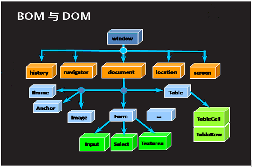

# JavaScript-入门篇2

# 五. 事件

## 5.1 什么是事件

可以被浏览器侦测到的人或者浏览器本身的行为，人对浏览器或者浏览器对网页做了什么事，JS 可以根据不同行为。绑定一些不同的响应代码处理，让浏览器和人的行为之间有一个交互。给页面上的元素先绑定事件，然后通过行为去触发。

## 5.2 常见事件

### 5.2.1 鼠标事件

| 属性          | 描述                                     |
| ------------- | ---------------------------------------- |
| onclick       | 当用户点击某个对象时调用的事件句柄。     |
| oncontextmenu | 在用户点击鼠标右键打开上下文菜单时触发。 |
| ondbclick     | 当用户双击某个对象时调用的事件句柄。     |
| onmousedown   | 鼠标按钮被按下。                         |
| onmouseenter  | 当鼠标指针移动到元素上时触发。           |
| onmouseleave  | 当鼠标指针移出元素时触发。               |
| onmousemove   | 鼠标被移动。                             |
| onmouseover   | 鼠标移到某元素之上。                     |
| onmouseout    | 鼠标从某元素移开。                       |
| onmouseup     | 鼠标按键被松开。                         |

```html
<!DOCTYPE html>
<html lang="en">
<head>
  <meta charset="UTF-8">
  <title>Title</title>
  <style>
    .d1 {
      width: 100px;
      height: 100px;
      background-color: greenyellow;
    }
  </style>
</head>
<body>
<div
  class="d1"
  ondblclick="fun1()"
  onmousedown="fun2()"
  onmouseup="fun3()"
  onmouseenter="fun4()"
  onmouseleave="fun5()"
  onmousemove="fun6()">
</div>
</body>
</html>
<script>
  function fun1() {
    console.log("双击666")
  }
  function fun2() {
    console.log("鼠标按下")
  }
  function fun3() {
    console.log("鼠标抬起")
  }
  function fun4() {
    console.log("鼠标进入")
  }
  function fun5() {
    console.log("鼠标离开")
  }
  function fun6() {
    console.log("鼠标移动")
  }
</script>
```

### 5.2.2 键盘事件

| 属性       | 描述                       |
| ---------- | -------------------------- |
| onkeydown  | 某个键盘按键被按下。       |
| onkeypress | 某个键盘按键被按下并松开。 |
| onkeyup    | 某个键盘按键被松开。       |

```html
<!DOCTYPE html>
<html lang="en">
<head>
  <meta charset="UTF-8">
  <title>Title</title>
</head>
<body>
<input type="text" onkeydown="fun1()" onkeyup="fun2()" onkeypress="fun3()"/>
</body>
</html>
<script>
  function fun1() {
    console.info("按钮按下")
  }

  function fun2() {
    console.info("按钮抬起")
  }

  function fun3() {
    console.info("按钮按下并抬起")
  }
</script>
```

### 5.2.3 表单事件

| 属性       | 描述                                                         |
| ---------- | ------------------------------------------------------------ |
| onblur     | 元素失去焦点时触发                                           |
| onchange   | 该事件在表单元素的内容改变时触发( `<input>`, `<keygen>`, `<select>`, 和 `<textarea>`) |
| onfocus    | 元素获取焦点时触发                                           |
| onfocusin  | 元素即将获取焦点时触发                                       |
| onfocusout | 元素即将失去焦点时触发                                       |
| oninput    | 元素获取用户输入时触发                                       |
| onreset    | 表单重置时触发                                               |
| onsearch   | 用户向搜索域输入文本时触发 ( `<input="search">`)             |
| onselect   | 用户选取文本时触发 ( `<input>` 和 `<textarea>`)              |
| onsubmit   | 表单提交时触发                                               |

```html
<!DOCTYPE html>
<html lang="en">
<head>
  <meta charset="UTF-8">
  <title>Title</title>
</head>
<body>
<form method="get" action="https://www.baidu.com" onsubmit="return fun6()" 
      onreset="return fun7()">
  <input name="" value="" type="text" onfocus="fun1()" onblur="fun2()" 
         oninput="fun3()" onchange="fun4()"/><br/>
  <select name="city" onchange="fun5(this)">
    <option selected>-请选择城市-</option>
    <option value="1">北京</option>
    <option value="2">天津</option>
    <option value="3">上海</option>
    <option value="4">重庆</option>
  </select>
  <br/>
  <input type="submit" value="提交数据"/>
  <input type="reset" value="重置数据"/>
</form>
</body>
</html>
<script>
  function fun1() {
    console.log("获得焦点")
  }

  function fun2() {
    console.log("失去焦点")
  }

  function fun3() {
    console.log("正在输入")
  }
  function fun4() {
    console.log("内容改变")
  }
  function fun5(sel) {
    console.log("内容发生改变了" + sel.value)
  }
  function fun6() {
    alert("发生了提交事件")
    // 做了一些运算之后 动态决定表单能否提交
    return false
  }
  function fun7() {
    console.log("发生了重置事件")
    return true
  }
</script>
```

### 5.2.4 页面加载事件

onload 属性用于页面**加载完成时候**触发的事件：

```html
<!DOCTYPE html>
<html lang="en">
<head>
  <meta charset="UTF-8">
  <title>Title</title>
</head>
<body onload="testFun()">
<input type="text" value="测试文字" id="i1"/>
</body>
</html>
<script>
  function testFun() {
    var in1 = document.getElementById("i1")
    var v1 = in1.value
    console.log(v1)
  }
</script>
```

# 六. BOM

## 6.1 认识BOM和DOM

### 6.1.1 什么是BOM

- BOM 是 Browser Object Model 的简写，即浏览器对象模型。
- BOM 有一系列对象组成，是访问、控制、修改浏览器的属性的方法。 		
- BOM 没有统一的标准(每种客户端都可以自定标准)。
- BOM 的顶层是 window 对象。

### 6.1.2 什么是DOM

- DOM 是 Document Object Model 的简写，即文档对象模型。
- DOM 用于 XHTML、XML 文档的应用程序接口(API)。 		
- DOM 提供一种结构化的文档描述方式，从而使 HTML 内容使用结构化的方式显示。 		
- DOM 由一系列对象组成，是访问、检索、修改 XHTML 文档内容与结构的标准方法。 		
- DOM 标准是由 w3c 制定与维护，DOM 是跨平台与跨语言的。 		
- DOM 的顶层是 document 对象

### 6.1.3 DOM和BOM的关系

BOM 编程就是把整个浏览器抽象成一个对象(window)，这个对象中有很多的属性和方法,访问这些属性或者调用这些方法就可以控制浏览器作出各种行为。 		

DOM 编程就是把浏览器当前页面对应的文档抽象成一个对象(document)，这个对象中有很多关于操作文档的一些属性和方法，访问这些属性和方法的时候,我们就可以通过代码动态控制页面上显示的内容。		

BOM 是为了操作浏览器出现的 API，window 是其根对象。  		

DOM 是为了操作文档出现的 API，document 是其根对象。



## 6.2 window对象及常用方法

### 6.2.1 什么是window对象

Window 对象简单理解就是把浏览器抽象成一个对象,它表示一个浏览器窗口或一个框架。在客户端 JavaScript中，Window 对象是全局对象，所有的表达式都在当前的环境中计算。也就是说，要引用当前窗口根本不需要特殊的语法，可以把那个窗口的属性作为全局变量来使用。例如，可以只写 document，而不必写 `window.document`。同样，可以把当前窗口对象的方法当作函数来使用，如只写 `alert()`，而不必写 `Window.alert()`。

除了上面列出的属性和方法，Window 对象还实现了核心 JavaScript 所定义的所有全局属性和方法。Window 对象的 window 属性和 self 属性引用的都是它自己。当你想明确地引用当前窗口，而不仅仅是隐式地引用它时，可以使用这两个属性。除了这两个属性之外，parent 属性、top 属性以及 frame[] 数组都引用了与当前 Window 对象相关的其他 Window 对象。 		

### 6.2.2 window对象属性

| 属性           | 描述                                                         |
| -------------- | ------------------------------------------------------------ |
| closed         | 返回窗口是否已被关闭。                                       |
| defaultStatus  | 设置或返回窗口状态栏中的默认文本。                           |
| document       | 对 Document 对象的只读引用。                                 |
| frames         | 返回窗口中所有命名的框架。该集合是 Window 对象的数组，每个 Window 对象在窗口中含有一个框架。 |
| history        | 对 History 对象的只读引用。                                  |
| innerHeight    | 返回窗口的文档显示区的高度。                                 |
| innerWidth     | 返回窗口的文档显示区的宽度。                                 |
| localStorage   | 在浏览器中存储 key/value 对。没有过期时间。                  |
| length         | 设置或返回窗口中的框架数量。                                 |
| location       | 用于窗口或框架的 Location 对象。                             |
| name           | 设置或返回窗口的名称。                                       |
| navigator      | 对 Navigator 对象的只读引用。                                |
| opener         | 返回对创建此窗口的窗口的引用。                               |
| outerHeight    | 返回窗口的外部高度，包含工具条与滚动条。                     |
| outerWidth     | 返回窗口的外部宽度，包含工具条与滚动条。                     |
| pageXOffset    | 设置或返回当前页面相对于窗口显示区左上角的 X 位置。          |
| pageYOffset    | 设置或返回当前页面相对于窗口显示区左上角的 Y 位置。          |
| parent         | 返回父窗口。                                                 |
| screen         | 对 Screen 对象的只读引用。                                   |
| screenLeft     | 返回相对于屏幕窗口的x坐标。                                  |
| screenTop      | 返回相对于屏幕窗口的y坐标。                                  |
| screenX        | 返回相对于屏幕窗口的x坐标                                    |
| sessionStorage | 在浏览器中存储 key/value 对。 在关闭窗口或标签页之后将会删除这些数据。 |
| screenY        | 返回相对于屏幕窗口的y坐标。                                  |
| self           | 返回对当前窗口的引用。等价于 Window 属性。                   |
| status         | 设置窗口状态栏的文本。                                       |
| top            | 返回最顶层的父窗口。                                         |

### 6.2.3 window对象方法

**常用方法：**

- **alert**：显示带有一段消息和一个确认按钮的警告框。

```js
alert("123")
```

- **atob**：解码一个 base-64 编码的字符串。
- **btoa**：创建一个 base-64 编码的字符串。
- **blur**：把键盘焦点从顶层窗口移开。
- **clearInterval**：取消由 setInterval() 设置的 timeout。
- **clearTimeout**：取消由 setTimeout() 方法设置的 timeout。
- **close**：关闭浏览器窗口。

```html
<!-- 点击按钮关闭浏览器窗口 -->
<input type="button" onclick="window.close()">
```

- **confirm**：显示带有一段消息以及确认按钮和取消按钮的对话框。

```js
var flag = confirm("确定删除吗？")
if (flag) {
  // do something...
}
```

- **createPopup**：创建一个 pop-up 窗口。
- **focus**：把键盘焦点给予一个窗口。
- **getSelection**：返回一个 Selection 对象，表示用户选择的文本范围或光标的当前位置。
- **getComputedStyle**：获取指定元素的 CSS 样式。
- **matchMedia**：该方法用来检查 media query 语句，它返回一个 MediaQueryList对象。
- **moveBy**：可相对窗口的当前坐标把它移动指定的像素。
- **moveTo**：把窗口的左上角移动到一个指定的坐标。
- **open**：打开一个新的浏览器窗口或查找一个已命名的窗口。

```js
// 打开一个新的窗口，跳转至百度
open("http://www.baidu.com")
```

- **print**：打印当前窗口的内容。
- **prompt**：显示可提示用户输入的对话框。

```js
var message = prompt("请输入你的姓名")
console.log(message)
```

- **resizeBy**：按照指定的像素调整窗口的大小。
- **resizeTo**：把窗口的大小调整到指定的宽度和高度。
- **scroll**：已废弃。 该方法已经使用了 scrollTo() 方法来替代。
- **scrollBy**：按照指定的像素值来滚动内容。
- **scrollTo**：把内容滚动到指定的坐标。
- **setInterval**：按照指定的周期（以毫秒计）来调用函数或计算表达式。

- **setTimeout**：在指定的毫秒数后调用函数或计算表达式。

```js
// 每间隔1s执行一次
var timer = setInterval(function () {
  console.log("...")
}, 1000)
clearInterval(timer)  // 清除定时器
// 1s过后就执行，仅执行一次
setTimeout(function () {
  console.log("...")
}, 1000)

// 可以通过递归调用实现间隔执行
function recurse() {
  console.log("...")
  setTimeout(recurse, 1000)
}
// 同样可以实现间隔1s运行一次的效果
recurse()
```

- **stop**：停止页面载入。

## 6.3 BOM其他常见对象

### 6.3.1 location对象

location 对象,是 window 对象的一个属性,代表浏览器上 URL 地址栏,使用 location 对象可以操作地址栏。

```js
console.log(location.host)      // 服务器IP + 端口
console.log(location.hostname)  // IP
console.log(location.port)  		// 端口号
console.log(location.href)			// 地址栏的内容
// 修改href属性的值可以直接跳转页面
location.href = "https://www.baidu.com"
```

### 6.3.2 history对象

history 对象是 window 对象的一个属性,代表浏览器访问历史记录，通过 history 的操作我们可以实现翻阅浏览器历史网页。

```js
history.forward()  // 向前跳转
history.back()  	 // 向后跳转
hitstory.go(1)		 // 传入正整数向前跳转，负整数向后跳转
```

### 6.3.3 screen和navigator

screen 代表屏幕，navigator 代表浏览器软件本身,通过这两个对象可以获得屏幕和浏览器软件的一些信息。

```js
console.info(screen.width)					// 屏幕宽度
console.info(screen.height)					// 屏幕高度
console.info(navigator.userAgent)	 // 用户代理
console.info(navigator.appName)		 // 应用名称
```

# 七. DOM

## 7.1 简介

简单来说：DOM 编程就是使用 document 对象的 API 完成对网页 HTML 文档进行动态修改，以实现网页数据和样式动态变化效果的编程。document 对象代表整个 html 文档，可用来访问页面中的所有元素，是最复杂的一个dom 对象，可以说是学习好 dom 编程的关键所在。document 对象是 window 对象的一个成员属性，通过`window.document` 来访问，当然也可以直接使用 document，根据 HTML 代码结构特点，document 对象本身是一种树形结构的文档对象。 		

### 7.1.1 DOM节点分类

结点对象：Node，document 对象中的每一个分支点都是一个 node 对象，它有三个子类：

1. 元素节点：Element。如：`<a href="http://www.baidu,com">超链接</a>`

2. 属性节点：Attribute。如：`href="http://www.baidu.com"`
3. 文本节点：Text。如：`超链接`

### 7.1.2 DOM操作的内容

1. 查询元素，获取元素的各种属性
2. 操作文本
3. 操作属性
4. 操作元素
5. 操作 CSS(修改 style 属性)

### 7.1.3 常用属性和方法

**常用属性：**

| 属性名称         | 类型     | 描述                     |
| ---------------- | -------- | ------------------------ |
| nodeName         | String   | 节点名称                 |
| nodeValue        | String   | 节点值                   |
| nodeType         | Number   | 节点类型                 |
| parentType       | Node     | 父节点                   |
| firstChild       | Node     | 第一个子节点             |
| lastChild        | Node     | 最后一个子节点           |
| childNodes       | NodeList | 所有子节点               |
| previousSiblings | Node     | 前一个节点               |
| nextSibling      | Node     | 后一个节点               |
| ownerDocument    | Document | 获得该节点所属的文档对象 |
| attributes       | Map      | 代表一个节点的属性对象   |

**常用方法：**

| 方法名称                       | 返回值类型 | 描述                       |
| ------------------------------ | ---------- | -------------------------- |
| hasChildNodes()                | Boolean    | 当前节点是否有子节点       |
| appendChild(node)              | Node       | 往当前节点上添加子节点     |
| removeChild(node)              | Node       | 删除子节点                 |
| replaceChild(oldNode, newNode) | Node       | 替换子节点                 |
| insertBefore(newNode, refNode) | Node       | 在指定节点的前面插入新节点 |

## 7.2 直接获取节点

获取节点有以下几种方式：

1. 根据 id 获取，返回单个 Node 对象：

```js
// 获取id为app的节点
var node = document.getElementById("app")
console.log(node)
// 修改内部的文字内容
node.innerText = "这是我的div"
```

2. 根据样式名称获取，返回一个 Node 数组：

```js
var nodes = document.getElementsByClassName(className);
console.log(nodes)
for (var i = 0; i < nodes.length; i++) {
  console.log(nodes[i])
}
```

3. 根据标签名称获取，返回一个 Node 数组：

```js
var nodes = document.getElementsByTagName("input")
console.log(nodes)
for (var i = 0; i < nodes.length; i++) {
  console.log(nodes[i])
}
```

4. 根据 name 的属性值获取，返回一个 Node 数组：

```js
var nodes = document.getElementsByName("hobby")
console.log(nodes)
for (var i = 0; i < nodes.length; i++) {
  console.log(nodes[i])
}
```

## 7.3 操作节点属性

```js
var node = document.getElementById("in1")

// 方式1 拿到对应属性值直接赋值
console.log(node.type)
console.log(node.value)
// 改变属性值
node.type = "button"
node.value = "你好我也好"


// 方式2 getAttribute setAttribute
console.log(node.getAttribute("type"))
console.log(node.getAttribute("value"))

node.setAttribute("type", "button")
node.setAttribute("value", "大家好")
```

## 7.4 操作节点样式

```js
// 节点.style.样式名 = 样式值
var node = document.getElementById("div1")
node.style.width = "200px"
node.style.height = "200px"
node.style.border = "10px solid green"
// css样式在更多的时候是以class选择器的形式作用到元素上
// 可以通过修改class属性,影响div的样式
node.setAttribute("class", "a")
```

## 7.5 操作标签文本

- **innerHtml 操作双标签中间的HTML** 		
- **innerText 操作双标签中间的 Text** 		
- **value**  **操作表单标签值**

```js
var node = document.getElementById("app")

console.log("innerText>>>" + node.innerText)
console.log("innerHTML>>>" + node.innerHTML)
// 重新赋值
node.innerText = "你好世界"
node.innerHTML = "<h1>你好世界</h1>"

var node2 = document.getElementById("i1")
console.log(node2.value)
node2.value = "100"
```

## 7.6 增加删除节点

- 创建元素：*createElement*
- 增加元素：*appendChild*
- 删除元素：*removeChild*

```js
var div1 = document.getElementById("app")
// 通过JS创建标签
var in1 = document.createElement("input")
in1.setAttribute("type","text")
in1.setAttribute("value","请输入内容")

var in2 = document.createElement("input")
in2.setAttribute("type", "password")
in2.setAttribute("value", "123456789")

var in3 = document.createElement("input")
in3.setAttribute("type", "button")
in3.setAttribute("value", "删除")

var br = document.createElement("br")

in3.onclick = function () {
  div1.removeChild(in1)
  div1.removeChild(in2)
  div1.removeChild(in3)
  div1.removeChild(br)
}
div1.appendChild(in1)
div1.appendChild(in2)
div1.appendChild(in3)
div1.appendChild(br)
```
