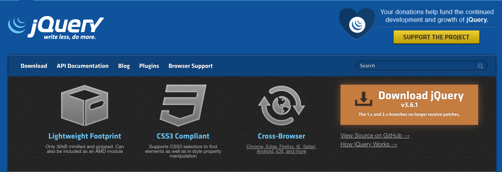

# jQuery-1

# 一. 简介

## 1.1 why jQuery

目前最流行的JavaScript函数库之一，对JavaScript进行了封装。并不是一门新语言。将常用的、复杂的操作进行函数化封装，直接调用，大大降低了使用JavaScript的难度，改变了使用JavaScript的习惯。jQuery能做的JavaScript也能做，但使用jQuery能大幅提高开发效率,由美国人John Resig在2006年推出，目前最新版本是v3.5.1。宗旨：**Write less，do more（写更少代码，做更多事情）**。官方网址：http://jquery.com/。



## 1.2 快速入门

**如何引入？**

使用 `<script>` 标签引入 jQuery 生产版本文件：

```html
<script src="js/jquery.min.js"></script>
```

编写代码：

```html
<script>
  // 获取id为app的元素的文本内容
  var message = $("#app").text()
  console.log(message)
</script>
```

# 二. jQuery选择器

jQuery 提供了丰富的选择器功能，这个是 jQuery 相比 JavaScript 的一大优势。我们先来看一下 jQuery API。可以看到提供了众多的选择器，可以非常方便简单的获取要选择的内容。

## 2.1 基本选择器

- 标签选择器：

```js
$()"input")
```

- id 选择器：

```js
$("#app")
```

- 类选择器：

```js
$(".cl")
```

- 通配符选择器：

```js
$("*")
```

- 并集选择器：

```js
$("el1, el2, .cl")
```

- 后代选择器：

```js
$("ul li")
```

- 父子选择器：

```js
$("ul > li")
```

- 后面第一个兄弟元素：

```js
$("h1 + p")
```

- 后面所有的兄弟元素：

```js
$("h1 ~ p")
```

这些选择器其实我们并不陌生，因为在讲解CSS样式中都有类似的选择器，并且其含义也是一样的。不同的在CSS 中是对选择的内容定义 CSS 样式，在 jQuery 中用来选择内容并后续进行更多的下步操作。

## 2.2 属性选择器

- `[attribute]` 匹配包含给定属性的元素
- `[attribute1][attribute2]` 复合属性选择器，需要同时满足多个属性 		
- `[attribute=value]` 匹配给定的属性是某个特定值的元素
- `[attribute!=value]` 匹配所有属性不等于特定值的元素
- `[attribute^=value]` 匹配给定的属性是以某些值开始的元素
- `[attribute$=value]` 匹配给定的属性是以某些值结尾的元素 		
- `[attribute*=value]` 匹配给定的属性是以包含某些值的元素

```js
// 获取a标签元素
$("a")
// 获取带有href属性的a标签元素
$("a[href]")
// 获取带有href和title属性的a标签元素
$("a[href][title]")
// 获取href属性值为b.html的a标签元素
$("a[href='b.html']")
// 获取含有href属性但是不等于b.html的a标签元素
$("a[href][href!='b.html']")
// 获取href属性值以http开头的a标签元素
$("a[href^='http']")
// 获取href属性值以htm结尾的a标签元素
$("a[href$='htm']")
// 获取href属性值包含.com的a标签元素
$("a[href*='.com']")
```

## 2.3 位置选择器

**针对整个页面而言的位置选择器**：

- `:first` 获取第一个元素 		
- `:last` 获取最后一个元素 		
- `:odd` 匹配所有索引值为奇数的元素，从0 开始计数  		
- `:even` 匹配所有索引值为偶数的元素，从0 开始计数  		
- `:eq(n)` 匹配一个给定索引值的元素 		
- `:gt(n)` 匹配所有大于给定索引值的元素 		
- `:lt(n)`  匹配所有小于给定索引值的元素

**针对上级标签而言的位置选择器**：

- `:first-child` 匹配第一个子元素
- `:last-child` 匹配最后一个子元素
- `:only-child` 如果某个元素是父元素中唯一的子元素，将会被匹配
- `:nth-child(n)` `:nth-child(odd|even)` ` :nth-child(xn+y)` 匹配其父元素下的第 N 个子或奇偶元素

注意：`:nth-child()` 选择器编号是从1开始，而其他选择器从 0 开始。

```js
// 获取第一个p标签元素
$("p:first")
// 获取最后一个p标签元素
$("p:last")
// 获取奇数索引p标签，从0开始计数
$("p:odd")
// 获取偶数索引p标签
$("p:even")
// 获取索引等于4的p标签
$("p:eq(4)")
// 获取索引小于4的p标签
$("p:lt(4)")
// 获取索引大于4的p标签
$("p:gt(4)")
// 获取p标签第一个子元素
$("p:first-child")
// 获取p标签最后一个子元素
$("p:last-child")
// 假如存在p标签的唯一子元素，那么匹配
$("p:only-child")
// 获取p标签的第2个子元素
$("p:nth-child(2)")
// 获取p标签的奇数个
$("p:nth-child(odd)")
// 获取p标签的偶数个
$("p:nth-child(even)")
// 子元素序号从1开始符合表达式3n+1
$("p:nth-child(3n+1)")
```

## 2.4 表单选择器

**表单项的选择器**：

```
:text :password :radio :checkbox :hidden :file :submit :input
```

**表单项状态的选择器**：

```
:selected :checked :enabled :disabled :hidden :visible
```

注意 `$("input")` 和 `$(":input")` 的区别：

`$("input")`：标签选择器，只匹配 input 标签，`$(":input")`： 匹配所有 input、textarea、select 和 button 元素。

```js
// 获取input标签类型是hidden的
$("input[type=hidden]")
// 同上
$("input:hidden")
// 并集选择器
$("input,select,textarea,button")
// 获取所有input、textarea、select、button元素
$(":input")
// 获取disabled状态的表单项
$(":disabled")
// 获取enabled状态的表单项
$(":enabled")
// 获取非disabled状态的表单项
$(":input:not(:disabled)")
// 获取checked状态的控件
$(":checked")
// 获取selected状态的控件
$(":selected")
// 获取:input匹配项，且visible状态的控件
$(":input:visible")
```


# 三. 简化DOM编程

## 3.1 操作属性和样式

原生 js 中的通过元素.属性名或者元素 *setAttribute*方式操作元素属性，jQuery 给我们封装了 *attr* 和*removeAttr*，更加便捷的操作属性：

```js
$("#f1").attr("class", "a")
$("#f1").attr("color","green")
$("#f1").attr("size","5")
$("#f1").removeAttr("color") 
```

## 3.2 操作文本和增删元素

原生 js 中的通过元素 *innerText* 和 *innerHTML* 和 *value* 属性操作标签内部文本和内容，jQuery 给我们封装了*text*，*html* 和 *val* 三个方法：

```js
var v1 = $("#app").text()  // 获取文本内容，忽略html
var v2 = $("#app").html()  // 获取html内容，包含文本
var c3 = $("#app").val()   // 获取元素的value属性
$("#app").text("Hello World")  // 设置文本内容
$("#app").html("<span>HelloWorld</span>")  // 设置html内容
$("#app").val(123)					// 设置value属性的值
```

原生 js 中的对于元素的创建，增加和删除代码比较繁琐，而 jQuery 从元素的创建到元素的增加和删除都给我们提供了更加便捷的方法：

```js
var e = $("<span>Hello</span>")  	// 创建元素
e.append("<p>123</p>")  					 // 追加元素
e.appendTo($("#app"))  						 // 添加到其他元素内部
e.before("<p>456</p>")  					 // 在e前面添加内容
e.insertBefore($("#app"))  				 // 把e添加到其他元素前面
e.after("<p>789</p>")  						 // 在e后面添加内容
e.insertAfter($("#app"))  				 // 把e插入到其他元素后面
e.empty()  													// 移除被选元素的所有子节点和内容
e.remove()  												// 移除当前标签
```

## 3.3 绑定和触发事件

jQuery 中，我们可以使用 		

事件的绑定函数：*bind*，*live* (1.8 及之前可用)，*on* (1.9之后推荐使用)，*one*

事件的解绑函数：*unbind*

```js
// bind方法绑定事件，原始名称去掉on即可
$("#d1").bind('click', function () {
  $('#d1').css("background-color", 'yellow')
})
// on方法绑定事件，同样去掉on
$("#d1").on('click', function () {
  $('#d1').css("background-color", 'yellow')
})
// 事件名称作为方法
$("#d1").click(function () {
  $('#d1').css("background-color", 'lightgreen')
})
// one只绑定一次
$("#d1").one('mouseleave', function () {
  $('#d1').css("background-color",'lightgreen')
})
// 解绑事件
$("#d1").unbind("click")
// 相当于发生了获得焦点事件
$("#username").focus()
```

## 3.4 DOM和jQuery对象的互相转换

使用原生 JS 方式获得的页面结点对象我们可以简称为 DOM 对象，使用 jQuery 核心函数获得的对象我们可以简称为 jQuery 对象，这两种方式获得的对象即是是页面上同一个元素，那么也是不一样的，二者之间的 API 是不通用的。而在某些情况下，我们往往无法选择接收的对象，只能被动使用，那么这个时候我们可以让二者实现转换，以达到可以调用API实现功能的目的：

```js
var e = document.getElementById("#app")
// 使用$()转为jQuery对象
var $e = $(e)

var $a = $("#a")
// 转为DOM对象
var a = $a[0]
// or
var a = $a.get(0)
```

因为 `$()` 获取的是一个 jQuery 对象数组，所以可以使用 *get* 方法或者使用 `[]` 下标。

## 3.5 jQuery迭代遍历方式

有四种方式遍历元素：

**方式1**：

```js
var $liArr = $("li")
for (var i = 0; i < $liArr.length; i++) {
  console.log($liArr[i])
}
```

**方式2**：

```js
for (var i in $liArr) {
  console.log($liArr[i])
}
```

**方式3**：

```js
// each每拿出一个元素 都会执行一次内部的function
// i 当前元素的所有
// e 当前元素 DOM对象
$liArr.each(function (i, e) {
  console.log(i + ": " + $(e).text())
})
```

**方式4**：

```js
$.each($liArr, function (i, e) {
  console.log(i + ": " + $(e).text())
})
```

# 四. 动画效果

## 4.1 显示和隐藏

实现简单显示动画效果方法 *show*	

实现简单隐藏动画效果方法 *hide*

实现切换简单显示和隐藏动画效果方法 *toggle*

```js
// 2s后隐藏
$("#d1").hide(2000)
// 1s后显示
$("#d1").show(1000)
// 3s内来回切换显示和隐藏，使用按钮来触发
$("#d1").toggle(3000)
// 使用链式编程连接起来
$("#d1").hide(2000).show(1000).toggle(3000)
```

## 4.2 上下滑动

实现向下滑动动画效果 *slideDown*

实现向上滑动动画效果 *slideUp*

实现滑动切换动画效果 *slideToggle*

```js
// 与上面同理，单位ms
$("#d1").slideDown(2000).slideUp(3000).slideToggle(5000)
```

## 4.3 淡入淡出

实现淡入动画效果方法 *fadeIn*

实现淡出动画效果方法 *fadeOut*

实现淡入淡出切换效果方法 *fadeToggle*

实现淡入之指定透明度效果方法 *fadeTo*

```js
$("#d1").fadeIn(2000).fadeOut(3000)
$("#app")fadeToggle(5000).fadeTo(5000, 0.2)
```

## 4.4 自定义动画

使用 *animate* 方法可以实现自定义动画效果：

```js
$("#d1").animate(
  {
  	width: "100px",
  	height: "100px",
  	opcity: 0.5,
  	borderRadius: "50px"
	},
  2000, 
  function () {
   alert("动画执行结束了")
	}
)
```

# 五. 表单校验

## 5.1 使用正则表达式校验表单

```js
function checkUsername() {
  var reg1 = /^\D{6,}$/
  var username = $("#user").val()
  if (!reg1.test(username)) {
    $("#usertip").html("<font color='red'>格式必须是至少六位的非数字</font>")
    return false
  }
  // 提示OK
  $("#usertip").html("<font color='green'>OK</font>")
  return true
}

function checkPassword() {
  var reg2 = /^\S{5,}$/
  var pwd =$("#pwd").val()
  if (!reg2.test(pwd)) {
    $("#pwdtip").html("<font color='red'>至少为5位非空格</font>")
    return false
  }
  $("#pwdtip").html("<font color='green'>OK</font>")
  return true
}

function checkRepwd() {
  var p1 = $("#pwd").val()
  var p2 = $("#repwd").val()

  if (p1.length< 5 || p1 != p2) {
    $("#repwdtip").html("<font color='red'>两次密码不一致</font>")
    return false
  }

  $("#repwdtip").html("<font color='green'>OK</font>")
  return true
}

function checkEmail() {
  var em = $("#email").val()
  var regex3 = /^\w{6,}@[0-9A-Za-z]{2,}(\.[a-zA-Z]{2,3}){1,2}$/;
  if (!regex3.test(em)) {
    $("#emailtip").html("<font color='red'>邮箱格式有误</font>")
    return false
  }
  $("#emailtip").html("<font color='green'>OK</font>")
  return true
}

function checkForm() {
  return checkUsername() && checkPassword() && checkRepwd() && checkEmail()
}
```