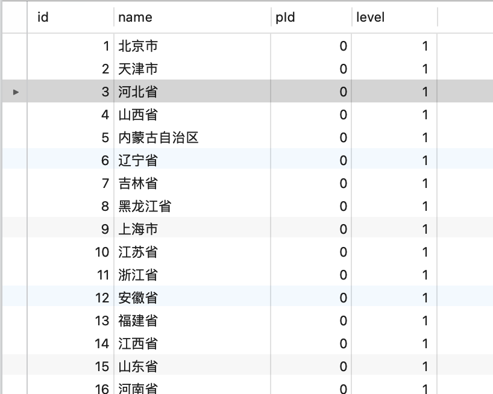
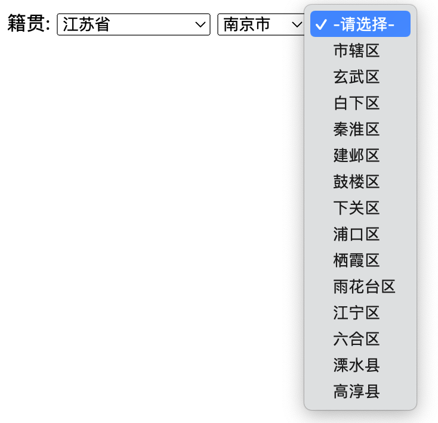

# jQuery(2)-Ajax

# 一. 简介

## 1.1 简介

**AJAX** 就是 **Asynchronous Javascript And XML**（异步 JavaScript 和 XML），是指一种创建交互式、快速动态网页应用的网页开发技术，无需重新加载整个网页的情况下，能够更新部分网页的技术。通过在后台与服务器进行少量数据交换，AJAX 可以使网页实现异步更新。这意味着可以在不重新加载整个网页的情况下，对网页的某部分进行更新。

**最大特点：**异步访问，局部刷新。

## 1.2 快速使用

以访问用户名是否存在为例：

```js
const xhr = new XMLHttpRequest()
// 使用xhr对象设置打开链接
// 设置请求方式和参数xhr.open("请求方式","请求的URL",是否使用异步方式)
xhr.open("GET", "user/select", true)
// 设置回调函数
xhr.onreadystatechange = function () {
    if (xhr.readyState === 4 && xhr.status === 200) {
        const result = xhr.responseText
        console.log(result)  // 查询所有用户数据
    }
}
// 正式发送请求
xhr.send(null)
```

AJAX 异步提交请求的步骤为：

1. 获取 XMLHTTPRequest 对象。
2. 打开链接 `xhr.open`。
3. 设置回调函数 `xhr.onreadystatechange`。
4. 提交数据 `xhr.send(data)`。

原生 js 提交 AJAX 异步请求代码比较繁琐，处理复杂数据比较麻烦,后续可以使用 jQuery 解决。

如果响应的数据是一个对象或者对象集合，数据处理起来会非常麻烦，可以使用 JSON 格式处理。

# 二. jQuery的Ajax

## 2.1 快速使用

每次书写 AJAX 代码比较繁琐 步骤都是一样的，数据回显使用原生 js 代码也比较繁琐，可以使用 jQuery 对上述问题进行优化，jQuery 不仅仅对 DOM 操作进行了封装，同时也对 AJAX 提交和回显已经进行了封装，可大大简化 AJAX 的操作步骤。

**jQuery.ajax() 简单使用：**

```js
$.ajax(
  {
    type: "GET",  // 可以有其他请求，如 POST
    url: "user/insert",
    // data: "username=" + $("#username").val(),
    // 推荐此种写法，提交到后端的数据，拼接在url后面
    data: { username: $("#username").val() },  
    success: function (info) { // 响应成功执行的函数
      console.log(info)
    },
    error: function (err) {
      console.log(err)
    },
    // 不能失败或成功都执行的回调函数
    complete: function (info) {
      console.log(info)
    }
  }
)
```

假如是 POST 请求方式时，请求的数据就是放在请求体里面，而且请求的 Content-Type 为 **application/x-www-form-urlencoded**，这是一种表单提交方式。

## 2.2 属性介绍

`$.ajax()` 方法中有很多属性可以供我们使用，其中很多属性都有默认值，那么这些属性都有哪些，处理的是什么事情?接下来给大家一一介绍一下。

1. url：要求为 String 类型的参数，（默认为当前页地址）发送请求的地址。
2. type：要求为 String 类型的参数，请求方式（POST 或 GET）默认为 GET。注意其他 http 请求方法，例如PUT 和 DELETE 也可以使用，但仅部分浏览器支持。
3. tiemout：要求为 Number 类型的参数，设置请求超时时间（毫秒）。此设置将覆盖 *$.ajaxSetup()* 方法的全局设置。
4. async：要求为 Boolean 类型的参数，默认设置为 true，所有请求均为异步请求。如果需要发送同步请求，请将此选项设置为 false。注意，同步请求将锁住浏览器，用户其他操作必须等待请求完成才可以执行。
5. cache：要求为 Boolean 类型的参数，默认为 true（当 dataType 为 script 时，默认为 false），设置为false 将不会从浏览器缓存中加载请求信息。
6. data：要求为 Object 或 String 类型的参数，发送到服务器的数据。如果已经不是字符串，将自动转换为字符串格式。get 请求中将附加在 url 后。防止这种自动转换，可以查看 processData 选项。对象必须为key/value 格式，例如 `{foo1: "bar1",foo2: "bar2"}` 转换为 `&foo1=bar1&foo2=bar2`。如果是数组，jQuery 将自动为不同值对应同一个名称。例如 `{foo:["bar1","bar2"]}` 转换为 `&foo=bar1&foo=bar2`。
7. dataType：要求为 String 类型的参数，预期服务器返回的数据类型。如果不指定，jQuery将自动根据http 包 mime 信息返回 responseXML 或 responseText，并作为回调函数参数传递。可用的类型如下：
   - xml：返回 XML 文档，可用 jQuery 处理。
   - html：返回纯文本 HTML 信息；包含的 script 标签会在插入 DOM 时执行。
   - script：返回纯文本 JavaScript 代码。不会自动缓存结果，除非设置了 cache 参数。注意在远程请求时（不在同一个域下），所有 POST 请求都将转为 GET 请求。
   - json：返回JSON数据。
   - jsonp：JSONP格式。使用 JSONP 形式调用函数时，例如 `myurl?callback=?`，jQuery 将自动替换后一个 `?` 为正确的函数名，以执行回调函数。
   - text：返回纯文本字符串。
8. beforeSend：要求为 Function 类型的参数，发送请求前可以修改 XMLHttpRequest 对象的函数，例如添加自定义 HTTP 头。在 *beforeSend* 中如果返回 false 可以取消本次 ajax 请求。
9. complete：要求为 Function 类型的参数，请求完成后调用的回调函数（请求成功或失败时均调用）。参数：XMLHttpRequest 对象和一个描述成功请求类型的字符串。

```js
function (XMLHttpRequest, textStatus) {
  // 调用本次ajax请求时传递的options参数
}
```

10. success：要求为 Function 类型的参数，请求成功后调用的回调函数，有两个参数。
    - 由服务器返回，并根据 dataType 参数进行处理后的数据。
    - 描述状态的字符串。

```js
function (data, textStatus) {
  // data可能是xmlDoc、jsonObj、html、text等等
}
```

11. error：要求为 Function 类型的参数，请求失败时被调用的函数。该函数有 3 个参数，即 XMLHttpRequest对象、错误信息、捕获的错误对象(可选)。ajax 事件函数如下：

```js
function (XMLHttpRequest, textStatus, errorThrown) {
  // 通常情况下textStatus和errorThrown只有其中一个包含信息
}
```

12. contentType：

要求为 String 类型的参数，当发送信息至服务器时，内容编码类型默认为 **application/x-www-form-urlencoded**。该默认值适合大多数应用场合。

13. dataFilter：

要求为 Function 类型的参数，给 Ajax 返回的原始数据进行预处理的函数。提供 data 和 type两个参数。data 是 Ajax 返回的原始数据，type 是调用 jQuery.ajax 时提供的 dataType 参数。函数返回的值将由 jQuery 进一步处理。

```js
function (data, type) {
  // 返回处理后的数据
  return data
}
```

14. global：要求为 Boolean 类型的参数，默认为 true。表示是否触发全局 ajax 事件。设置为 false 将不会触发全局 ajax 事件，ajaxStart 或 ajaxStop 可用于控制各种 ajax 事件。
15. ifModified：要求为 Boolean 类型的参数，默认为 false。仅在服务器数据改变时获取新数据。服务器数据改变判断的依据是 Last-Modified 头信息。默认值是 false，即忽略头信息。 
16. jsonp：要求为 String 类型的参数，在一个 jsonp 请求中重写回调函数的名字。该值用来替代在 `callback=?` 这种 GET 或 POST 请求中 URL 参数里的 *callback* 部分，例如 `{jsonp:'onJsonPLoad'}` 会导致将 `onJsonPLoad=?` 传给服务器。
17. username：要求为 String 类型的参数，用于响应 HTTP 访问认证请求的用户名。
18. password：要求为 String 类型的参数，用于响应 HTTP 访问认证请求的密码。
19. processData：要求为 Boolean 类型的参数，默认为 true。默认情况下，发送的数据将被转换为对象（从技术角度来讲并非字符串）以配合默认内容类型 **application/x-www-form-urlencoded**。如果要发送 DOM树信息或者其他不希望转换的信息，请设置为 false。
20. scriptCharset：要求为 String 类型的参数，只有当请求时 dataType 为 *jsonp* 或者 *script*，并且 type 是GET 时才会用于强制修改字符集(charset)。通常在本地和远程的内容编码不同时使用。

一个 ajax 方法中，可用的属性和方法大致如下：

```js
$.ajax({
  url: "servlet1",
  type: "get",
  timeout: 2000,
  async: true,
  cache: true,
  data: { username: "lbd", password: "123456" },
  processData: true,
  contentType: "application/x-www-form-urlencoded",
  dataType: "json",
  beforeSend: function (XMLHttpRequest) {

  },
  success: function (data, textStatus) {

  },
  error: function (XMLHttpRequest, textStatus, errorThrown) {

  },
  complete: function (XMLHttpRequest, textStatus) {

  },
  dataFilter: function (data, type) {

  }
})
```

## 2.3 其他简便写法

### 2.3.1 load

jQuery 的 *load* 方法是简单但强大的 AJAX 方法，*load* **方法从服务器加载数据，并把返回的数据放入被选元素中**。默认使用 GET 方式 ，传递附加参数时自动转换为 POST 方式。

语法为：

```js
$(selector).load(URL, data, callback)
```

**测试：**

```js
//  从后端获取，然后把数据填充到id位#d1的元素内部
$("#d1").load("user/select", "username=aaa&password=bbb", function () {
  alert("响应结束")
})

// 从hello.html页面获取id为#a的元素填充到本页面id为#d1的元素内部
$("#d1").load("hello.html #a")
```

### 2.3.2 get

 这是一个简单的 GET 请求功能以取代复杂 `$.ajax` 。请求成功时可调用回调函数。如果需要在出错时执行函数，请使用 `$.ajax`。

语法：

```
$.get(url, [data], [callback], [type])
```

- url：URL 地址。
- data：待发送的参数。
- callback：载入成功时的回调函数。
- type：返回的内容格式。

等价于：

```js
$.ajax({
  type: 'GET',
  url: url,
  data: data,
  success: function () {},
  dataType: 'json'
})
```

### 2.3.3 getJSON

JSON 是一种较为理想的数据传输格式，它能够很好的融合与 JavaScript 或其他宿主语言，并且可以被 JS 直接使用。使用 JSON 相比传统的通过 GET、POST 直接发送“裸体”数据，在结构上更为合理，也更为安全。至于 jQuery的 *getJSON* 函数，只是设置了 JSON 参数的 *ajax* 函数的一个简化版本。语法为：

```js
$.getJSON(
  url,             // 请求URL
  [data],          // 传参，可选参数
  [callback]       // 回调函数，可选参数
)
```

等价于：

```js
$.ajax({
  url: url,
  data: data,
  success: callback,
  dataType: 'json'
})
```

仅仅是等效于上述函数，但是除此之外这个函数也是可以跨域使用的，相比 *get*、*post* 有一定优势。另外这个函数可以通过把请求 url 写 成 `url?callback=X` 这种格式，让程序执行回调函数 X。

### 2.3.4 post

`$.post` 这是一个简单的 POST 请求功能以取代复杂 `$.ajax` ，请求成功时可调用回调函数。

语法：

```js
$.post(url, [data], [callback], [type])
```

等价于：

```js
$.ajax({
  type: 'POST',
  url: url,
  data: data,
  success: success,
  dataType: dataType
})
```

**示例：**

```js
// 从后端获取数据，然后把返回的数据渲染到列表
$.post("user/select", function (result) {
  let html = ''
  $.each(result, function (i, e) {
    html += '<span>' + e +'</span>'
  })
  $("#app").html(html)
})
```

## 2.4 jsonp跨域处理

### 2.4.1 什么是跨域

出于浏览器的同源策略限制。同源策略（Sameoriginpolicy）是一种约定，它是浏览器最核心也最基本的安全功能，如果缺少了同源策略，则浏览器的正常功能可能都会受到影响。可以说 Web 是构建在同源策略基础之上的，浏览器只是针对同源策略的一种实现。同源策略会阻止一个域的 Javascript 脚本和另外一个域的内容进行交互。所谓同源（即指在同一个域）就是两个页面具有相同的协议(protocol)，主机(host)和端口号(port)。

简单来讲，不同源那就是协议、域名或者端口号可能不一样。

### 2.4.2 实现原理

我们发现 Web 页面上调用js文件时则不受是否跨域的影响,拥有 *src* 这个属性的标签都却拥有跨域的能力，比如 `<script>`、``、`<iframe>`。那么跨域访问数据就有了一种可能，那就是在远程服务器上设法把数据装进 js 格式的文件里，供客户端调用和进一步处理。就好比使用一个 `<script>`,让其 *src* 属性指向我们要访问的跨域资源，然后以接收 js 文件的形式接收数据。

- 通过 `dataType: 'jsonp'` 属性实现跨域请求。
- 通过 `jsonp: 'callback'`，属性简化回调函数处理：

通过 `jsonp: 'callback'`，实现自动处理回调函数名，相当于在 url 地址栏最后后拼接一个 `callback=函数名`，后台自动根据这个函数名处理 JS 脚本，jQuery 也会根据这函数名自动在前端处理回调函数，这样我们直接在 *success* 方法中接收返回的数据即可，可以不用自己去自己定义回调函数。后台获取参数时，参数名要要和`jsonp:` 后面的函数名保持一致。

```js
$.ajax({
  type: 'GET',
  url: 'user/insert',
  data: { username: '洛必达' },
  dataType: 'jsonp',
  jsonp: 'callback',
  success: function (info) {
    console.log(info)
  }
})
```

后端代码：

```java
@WebServlet("/user/*")
public class UserServlet extends BaseServlet {
		@RequestMapping("/insert")
    public void insert(HttpServletRequest request, HttpServletResponse response) throws IOException {
        String username = request.getParameter("username");
        String callback = request.getParameter("callback");
        String info = String.format("添加用户数据%s", username);
        response.setContentType("text/javaScript;charset=UTF-8");
        // 这里的callback就对应着上面的success回调函数，info是传过去的参数
        response.getWriter().print(callback + "('" + info + "')");
    }
}
```

### 2.4.3 通过getJson方实现跨域请求

*getJSON* 方法是可以实现跨域请求的，在用该方法实现跨域请求时，在传递参数上应该注意在 url 后拼接一个 `jsoncallback=?`，jQuery 会自动替换 `?` 为正确的回调函数名，我们就可以不用单独定义回调函数了。

```js
$.getJSON(
  "user/insert?callback=?",
  { username: '洛必达' },
  function (info) {
    console.log(info)
  }
)
```

后端代码不变。

### 2.4.4 后端配置跨域操作

通过后台代码也可以实现跨域，一般在过滤器中添加如下代码，那么前端在请求时就不用考虑跨域问题了：

```java
response.setHeader("Access-Control-Allow-Origin", "*");
/*请求方式白名单*/
response.setHeader("Access-Control-Allow-Methods", "POST, GET, OPTIONS, DELETE");
response.setHeader("Access-Control-Max-Age", "3600");
response.setHeader("Access-Control-Allow-Headers", "x-requested-with");
```

# 三. 三级联动案例

接下来做一个省市县三级联动效果。

## 3.1 准备数据

使用 china.sql 生成中国的省市区的数据。





## 3.2 编写前端

准备三个 select 标签：


```jsp
<%@ page contentType="text/html;charset=UTF-8" %>
<html>
<head>
  <title>index.jsp</title>
</head>
<body>
籍贯:
<select id="province" onchange="showArea(this.value, '#city')">
  <option>-请选择-</option>
</select>
<select id="city" onchange="showArea(this.value, '#county')">
  <option>-请选择-</option>
</select>
<select id="county">
  <option>-请选择-</option>
</select>
</body>
</html>
<script src="js/jquery-3.6.1.min.js" rel="script"></script>
<script>
  showArea(0, '#province')
  function showArea(id, selector) {
    $.get('area/all', { pid: id }, function (result) {
      // 清除上一次选择省份时，遗留的城市
      $(selector).html('<option>-请选择-</option>')
      $.each(result, function (i, e) {
        $(selector).append('<option value="' + e.id + '">' + e.name + '</option>')
      })
      if (selector === "#city") {
        $("#county").html('<option>-请选择-</option>');
      }
    })
  }
</script>
```

## 3.3 编写后端

0. 导入依赖：

```xml
<dependency>
    <groupId>com.google.code.gson</groupId>
    <artifactId>gson</artifactId>
    <version>2.8.7</version>
</dependency>

<dependency>
    <groupId>mysql</groupId>
    <artifactId>mysql-connector-java</artifactId>
    <version>8.0.30</version>
</dependency>
```

1. 声明实体类 Area：

```java
public class Area {
    
    private Integer id;
    
    private String name;
    
    private Integer pId;
    
    private Integer level;

    public Area() {
    }

    public Area(Integer id, String name, Integer pId, Integer level) {
        this.id = id;
        this.name = name;
        this.pId = pId;
        this.level = level;
    }

    public Integer getId() {
        return id;
    }

    public void setId(Integer id) {
        this.id = id;
    }

    public String getName() {
        return name;
    }

    public void setName(String name) {
        this.name = name;
    }

    public Integer getpId() {
        return pId;
    }

    public void setpId(Integer pId) {
        this.pId = pId;
    }

    public Integer getLevel() {
        return level;
    }

    public void setLevel(Integer level) {
        this.level = level;
    }

    @Override
    public String toString() {
        return "Area{" + "id=" + id + ", name='" + name + '\'' + ", pId=" + pId + ", level=" + level + '}';
    }
}
```

2. 声明 AreaDao 和 AreaDaoImpl 继承 BaseDao：

```java
public interface AreaDao {
    
    List<Area> findByPId(Integer pid);
}
```

```java
public class AreaDaoImpl extends BaseDao<Area> implements AreaDao {
    
    @Override
    public List<Area> findByPId(Integer pid) {
        String sql = "select * from tb_area where pid = ?";
        return query(Area.class, sql, pid);
    }
}
```

3. 声明 AreaService：

```java
public class AreaService {
    
    private final AreaDao areaDao = new AreaDaoImpl();
    
    public List<Area> findByPId(Integer pid) {
        return areaDao.findByPId(pid);
    }
}
```

4. 声明 AreaServlet 继承 BaseServlet：

```java
@WebServlet("/area/*")
public class AreaServlet extends BaseServlet {
    
    private final AreaService areaService = new AreaService();
    
    @RequestMapping("/all")
    public void findAll(HttpServletRequest request, HttpServletResponse response) throws IOException {
        String pid = request.getParameter("pid");
        List<Area> list = areaService.findByPId(Integer.parseInt(pid));
        String json = new Gson().toJson(list);
        response.setContentType("application/json;charset=utf-8");
        response.getWriter().write(json);
    }
}
```

5. 最终效果：


