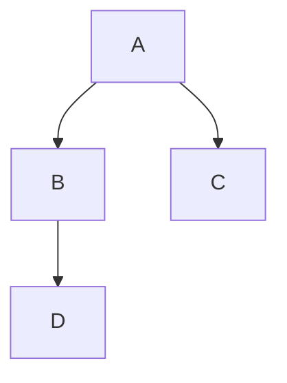
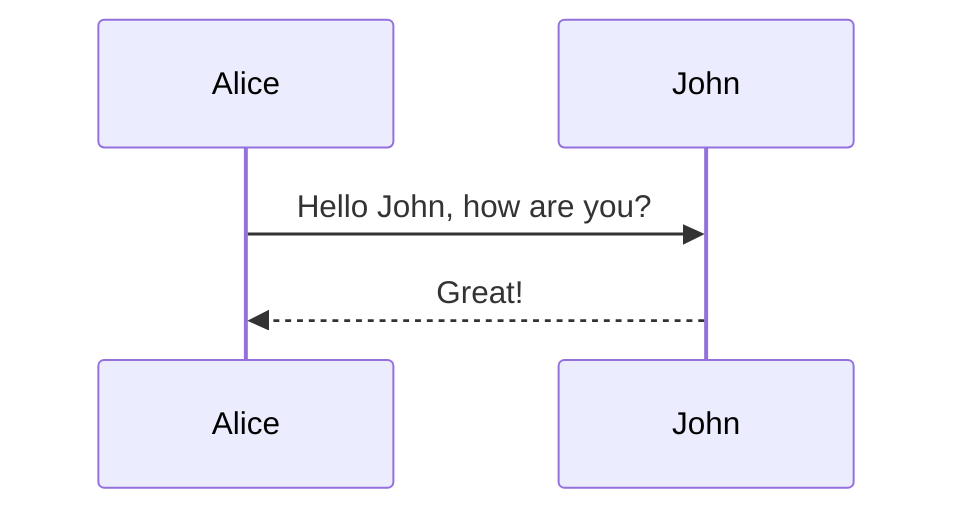
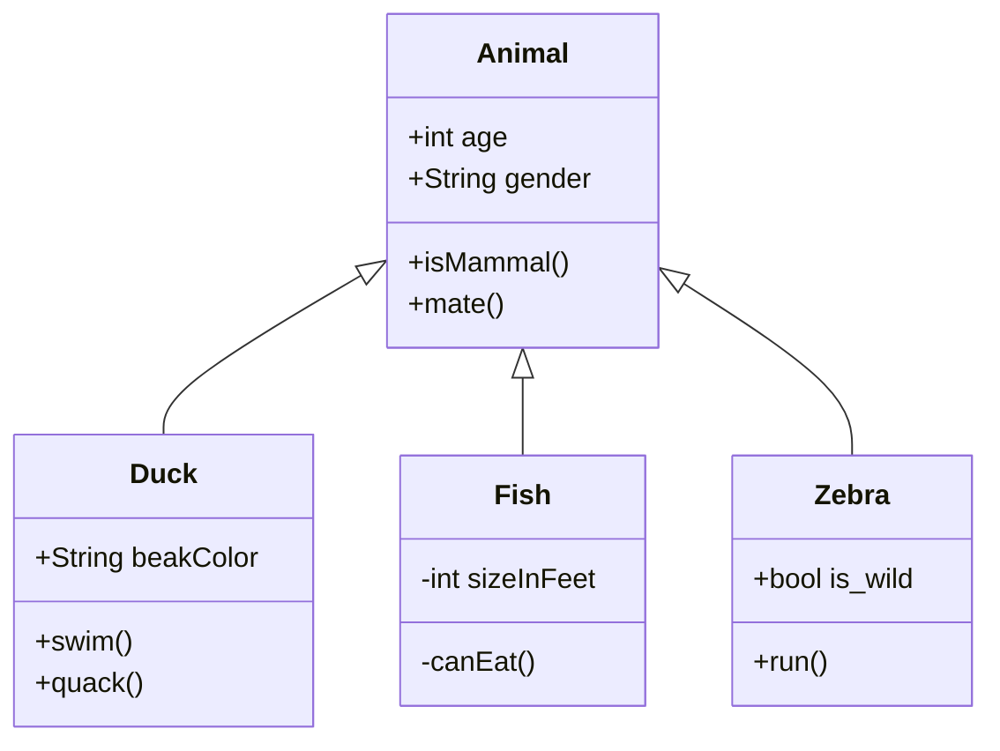
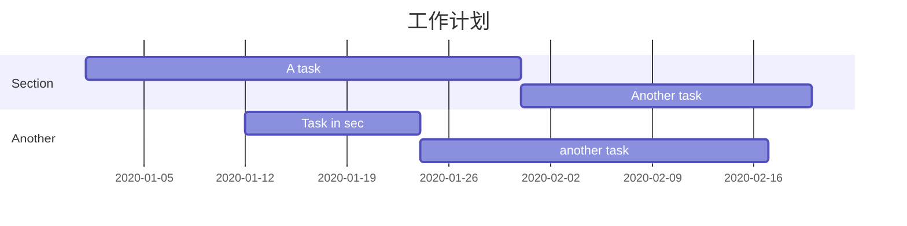
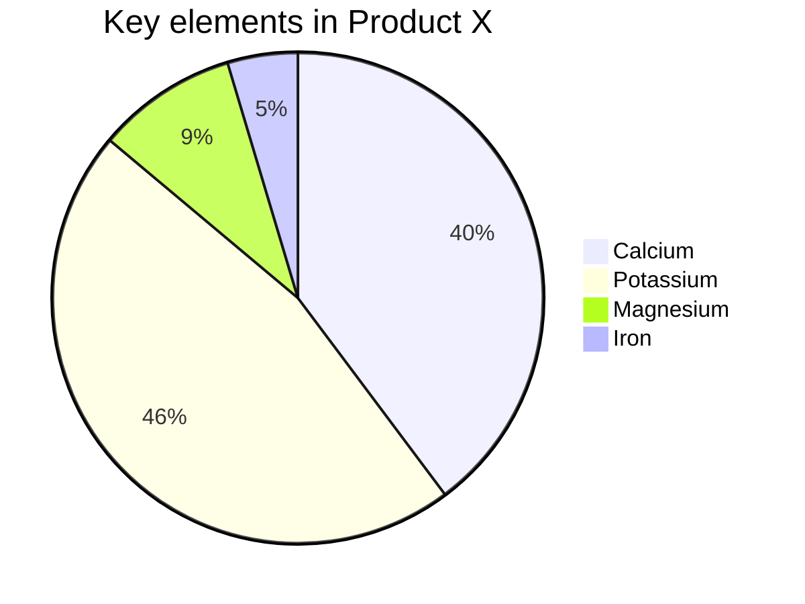

# Draw Diagrams With Markdown

Typora支持一些图表的Markdown扩展，一旦它们从首选项面板中启用。

当导出为HTML、PDF、epub、docx时，那些呈现的图也会被包括在内，但是当在当前版本中导出markdown到其他文件格式时，图的特性是不支持的。此外，您还应该注意到图表不受标准Markdown、CommonMark或GFM的支持。因此，我们仍然建议您插入这些图的图像，而不是直接在Markdown中编写它们。

# 一. 流程图 

> 先在 [Typora](https://so.csdn.net/so/search?q=Typora&spm=1001.2101.3001.7020) 中，输入 ````mermaid` 然后敲击回车，即可初始化一张空白图。
> 语法解释：graph 关键字就是声明一张流程图

| 方向 | 介绍                    |
| ---- | ----------------------- |
| TD   | Top to Down，从上至下   |
| TB   | Top to Bottom，从上至下 |
| BT   | Bottom，从下至上        |
| LR   | Left to Right，从左至右 |
| RL   | Right to Left，从右至左 |

```
graph TD;
    A-->B;
    A-->C;
    B-->D;
```




# 二. 时序图

> 语法解释：`->>` 代表实线箭头，`-->>` 则代表虚线。

```
sequence Diagram
    Alice->>John: Hello John, how are you?
    John-->>Alice: Great!
```




# 三. 状态图

> 语法解释：`[*]` 表示开始或者结束，如果在箭头右边则表示结束。

```
stateDiagram
    [*] --> s1
    s1 --> [*]
```


# 四. 类图

> 语法解释：`<|--` 表示继承，`+` 表示 `public`，`-` 表示 `private`

```
classDiagram
    Animal <|-- Duck
    Animal <|-- Fish
    Animal <|-- Zebra
    Animal : +int age
    Animal : +String gender
    Animal: +isMammal()
    Animal: +mate()
    class Duck{
        +String beakColor
        +swim()
        +quack()
    }
    class Fish{
        -int sizeInFeet
        -canEat()
    }
    class Zebra{
        +bool is_wild
        +run()
    }     
```




# 五. 甘特图

> 甘特图一般用来表示项目的计划排期.从上到下依次是图片标题、日期格式、项目、项目细分的任务。

```
gantt
    title 工作计划
    dateFormat  YYYY-MM-DD
    section Section
    A task           : a1, 2020-01-01, 30d
    Another task     : after a1, 20d
    
    section Another
    Task in sec      : 2020-01-12, 12d
    another task     : 24d
```




# 六. 饼图

> 饼图使用 `pie` 表示，标题下面分别是区域名称及其百分比。

```
pie
    title Key elements in Product X
    "Calcium" : 42.96
    "Potassium" : 50.05
    "Magnesium" : 10.01
    "Iron" :  5
```




# 七. 导出

> 绘制好的图片可以选择菜单/文件/导出，导出为图片或者网页格式。在网页中图片是以 `SVG` 格式渲染的，你可以复制 SVG 内容，导入到 SVG 的图片编辑器中进一步操作。
