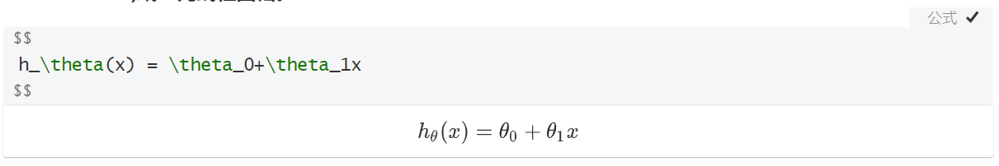
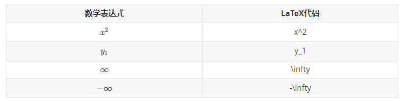
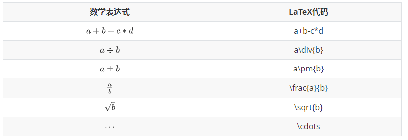
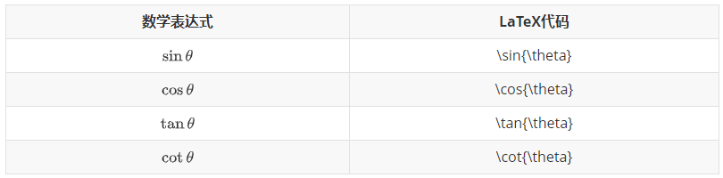
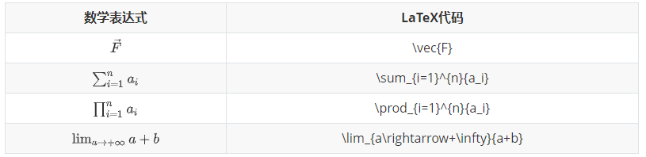
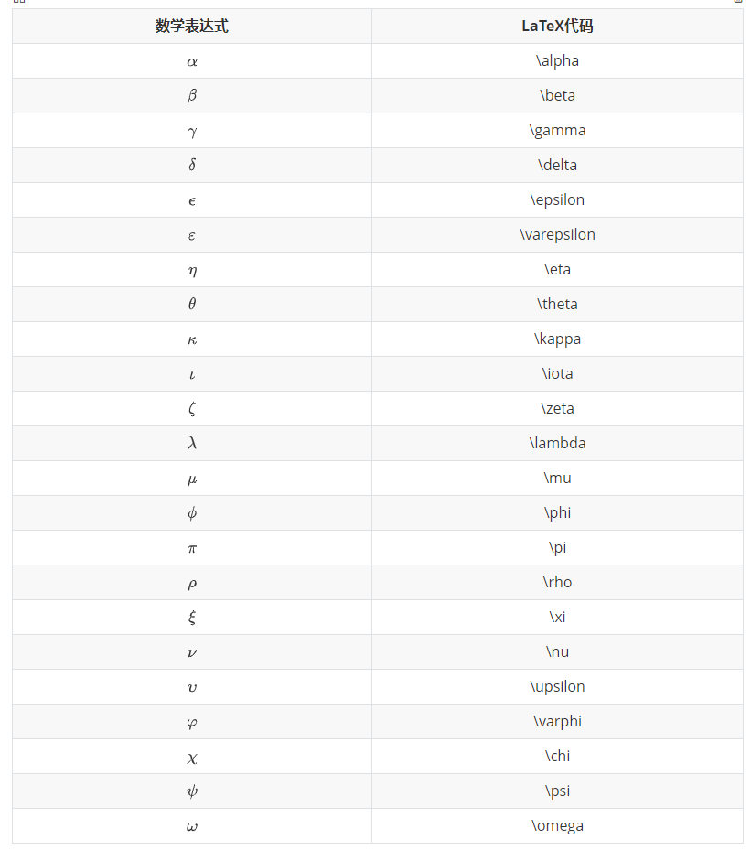
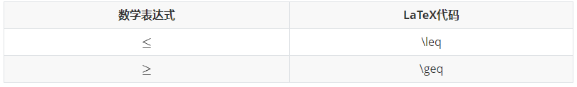

# Math and Academic Functions

Typora支持使用Tex/LaTeX语法渲染普通数学。呈现过程由MathJax处理。

# 一. 公式块与行内公式的添加

## 1.1 公式块

- **创建独立的一块公式区域**。



- 上部分为公式输入区
- 下部分为效果展示区

**方法一**：左上角点击“段落”，再点击“公式块”

**方法二**：在文中输入$$，再按下回车


## 1.2 行内公式

- **将公式嵌入文字内**。

$$
自变量\theta增大,函数值\theta增大
$$


# 二. 常用符号的代码

- 上下标，正负无穷
- 加减乘，分式，根号，省略号
- 三角函数
- 矢量，累加累乘，极限
- 希腊字母


## 2.1 **上下标，正负无穷**




## 2.2 **加减乘，分式，根号，省略号**




## 2.3 **三角函数**




## 2.4 **矢量，累加累乘，极限**




## 2.5 **希腊字母**




## 2.6 关系运算符




# 三. 矩阵

## 3.1 简单矩阵

使用`\begin{matrix}…\end{matrix}`生成， 每一行以`\\`结尾表示换行，元素间以`&`间隔，式子的表示序号`\tag{1}`（右边的序号）。

```
 $$
\begin{matrix}
 1 & 2 & 3 \\
 4 & 5 & 6 \\
 7 & 8 & 9 
\end{matrix} \tag{1}
$$
```

$$
\begin{matrix}
 1 & 2 & 3 \\
 4 & 5 & 6 \\
 7 & 8 & 9 
\end{matrix} \tag{1}
$$


## 3.2 **带左右括号的矩阵(大中小括号)**

**方法一**：在`\begin{}`之前和`\end{}`之后添加左右括号的代码。

```
$$
 \left\{
 \begin{matrix}
   1 & 2 & 3 \\
   4 & 5 & 6 \\
   7 & 8 & 9
  \end{matrix}
  \right\} \tag{2}
$$
```

$$
\left\{
 \begin{matrix}
   1 & 2 & 3 \\
   4 & 5 & 6 \\
   7 & 8 & 9
  \end{matrix}
  \right\} \tag{2}
$$


中括号：

```
$$
 \left[
 \begin{matrix}
   1 & 2 & 3 \\
   4 & 5 & 6 \\
   7 & 8 & 9
  \end{matrix}
  \right] \tag{3}
$$
```

$$
\left[
\begin{matrix}
  1 & 2 & 3 \\
  4 & 5 & 6 \\
  7 & 8 & 9
\end{matrix}
\right] \tag{3}
$$

小括号：

```
$$
  \left(
  \begin{matrix}
    1 & 2 & 3 \\
    4 & 5 & 6 \\
    7 & 8 & 9
  \end{matrix}
  \right) \tag{4}
$$
```

$$
\left(
\begin{matrix}
  1 & 2 & 3 \\
  4 & 5 & 6 \\
  7 & 8 & 9
\end{matrix}
\right) \tag{4}
$$


**方法二**：改变`\begin{matrix}`和`\end{matrix}`中`{matrix}`

```
$$
 \begin{Bmatrix}
   1 & 2 & 3 \\
   4 & 5 & 6 \\
   7 & 8 & 9
  \end{Bmatrix} \tag{6}
$$
```

$$
\begin{Bmatrix}
   1 & 2 & 3 \\
   4 & 5 & 6 \\
   7 & 8 & 9
\end{Bmatrix} \tag{6}
$$

中括号：

```
$$
 \begin{bmatrix}
   1 & 2 & 3 \\
   4 & 5 & 6 \\
   7 & 8 & 9
  \end{bmatrix} \tag{6}
$$
```

$$
\begin{bmatrix}
   1 & 2 & 3 \\
   4 & 5 & 6 \\
   7 & 8 & 9
\end{bmatrix} \tag{6}
$$


## 3.3 **包含希腊字母与省略号**

行省略号`\cdots`，列省略号`\vdots`，斜向省略号（左上至右下）`\ddots`。

```
$$
 \left\{
 \begin{matrix}
 1      & 2        & \cdots & 5        \\
 6      & 7        & \cdots & 10       \\
 \vdots & \vdots   & \ddots & \vdots   \\
 \alpha & \alpha+1 & \cdots & \alpha+4 
 \end{matrix}
 \right\}
$$
```

$$
\left\{
\begin{matrix}
 1      & 2       & \cdots & 5        \\
 6      & 7       & \cdots & 10       \\
\vdots & \vdots   & \ddots & \vdots   \\
\alpha & \alpha+1 & \cdots & \alpha+4 
\end{matrix}
\right\}
$$


# 四. 公式序号

```
\tag{i}
```


# 五. 行列式

```
$$
 \begin{vmatrix}
   1 & 2 & 3 \\
   4 & 5 & 6 \\
   7 & 8 & 9
  \end{vmatrix}
\tag{7}
$$
```

$$
\begin{vmatrix}
   1 & 2 & 3 \\
   4 & 5 & 6 \\
   7 & 8 & 9
  \end{vmatrix}
\tag{7}
$$


# 六. 表格

## 6.1 简单表格

```
$$
\begin{array}{|c|c|c|}
	\hline 2 & 9 & 4  \\
	\hline 7 & 5 & 3  \\
	\hline 6 & 1 & 8  \\
	\hline
\end{array}
$$
```

$$
\begin{array}{|c|c|c|}
	\hline 2&9&4\\
	\hline 7&5&3\\
	\hline 6&1&8\\
	\hline
\end{array}
$$


**开头结尾**： `\begin{array}` ， `\end{array}`

**定义式**：例：`{|c|c|c|}`，其中`c` `l` `r` 分别代表居中、左对齐及右对齐。

**分割线**：

①**竖直分割线**：在定义式中插入 `|`， （`||`表示两条竖直分割线）。

②**水平分割线**：在下一行输入前插入 `\hline`，以下图真值表为例。

其他：每行元素间均须要插入 `&` ，每行元素以 `\\` 结尾。


## **6.2 真值表**

```
$$
\begin{array}{cc|c}
	       A & B & F  \\
	\hline 0 & 0 & 0  \\
	       0 & 1 & 1  \\
	       1 & 0 & 1  \\
	       1 & 1 & 1  \\
\end{array}
$$
```

$$
\begin{array}{cc|c}
	       A & B & F  \\
	\hline 0 & 0 & 0  \\
	       0 & 1 & 1  \\
	       1 & 0 & 1  \\
	       1 & 1 & 1  \\
\end{array}
$$


# 七. **多行等式对齐**

```
$$
  \begin{aligned}
    a & = b + c   \\
      & = d + e + f
  \end{aligned}
$$
```

$$
\begin{aligned}
a &= b + c \\
  &= d + e + f
\end{aligned}
$$


# 八. 方程组条件表达式


```
$$
  \begin{cases}
    3x + 5y +  z \\
    7x - 2y + 4z \\
   -6x + 3y + 2z
  \end{cases}
$$
```

$$
\begin{cases}
    3x + 5y +  z \\
    7x - 2y + 4z \\
   -6x + 3y + 2z
 \end{cases}
$$

同理，条件表达式：

```
$$
  f(n) =
    \begin{cases} 
      n/2,  & \text{if }n\text{ is even} \\
     3n+1,  & \text{if }n\text{ is odd}
    \end{cases}
$$
```

$$
f(n) =
    \begin{cases} 
      n/2,  & \text{if }n\text{ is even} \\
     3n+1,  & \text{if }n\text{ is odd}
    \end{cases}
$$


# 九. **间隔 (大小空格、紧贴)**

**紧贴 + 无空格 + 小空格 + 中空格 + 大空格 + 真空格 + 双真空格**

```
$$
a\!b + ab + a\,b + a\;b + a\ b + a\quad b + a\qquad b
$$
```

$$
a\!b + ab + a\,b + a\;b + a\ b + a\quad b + a\qquad b
$$

紧贴`\!`

无空格 小空格`\,` 中空格`\;` 大空格`\`

真空格`\quad` 双真空格`\qquad`


